# Simulace 2 {#simulace2}

## Simulace funkcionálních dat

Nejprve si simulujeme funkce, které budeme následně chtít klasifikovat.
Budeme uvažovat pro jednoduchost dvě klasifikační třídy.
Pro tuto simulaci zvolíme následující postup:

-   zvolíme vhodné body (pro každou klasifikační třídu jiné), které proložíme interpolačním splajnem,

- takto získané funkce využijeme ke generování náhodných křivek pro obě třídy,

-   generujeme body ze zvoleného intervalu pomocí vyhlazených funkcí interpolačním splajnem, které obsahují, například gaussovský, šum,

-   takto získané diskrétní body vyhladíme do podoby funkcionálního objektu pomocí nějakého vhodného bázového systému.

Tímto postupem získáme funkcionální objekty společně s hodnotou kategoriální proměnné $Y$, která rozlišuje příslušnost do klasifikační třídy.


```r
# nacteme potrebne balicky 

library(fda)
library(ggplot2)
library(dplyr)
library(tidyr)
library(ddalpha)
library(stats)

set.seed(42)
```

Uvažujme tedy dvě klasifikační třídy, $Y \in \{0, 1\}$, pro každou ze tříd stejný počet `n` generovaných funkcí.
Definujme si nejprve dvě funkce, každá bude pro jednu třídu.
Funkce budeme uvažovat na intervalu $I = [0, 12]$.

V tomto případě si definujeme v prvním kroku body, kterými má náš interpolační splajn procházet. Následně proložíme těmito body interpolační splajn, k čemuž využijeme funkci `spline()` z knihovny `stats`. Pro lepší interpretovatelnost simulovaných dat jsme definovali interval $I = [0, 12]$ a funkce pro obě klasifikační třídy zvolíme tak, aby při troše fantazie mohli představovat například vývoj určité veličiny (teplota, tlak, srážky, nezaměstnanost, prodej nějaké komodity atd.) v průběhu roku. Budeme předpokládat, že se vývoj této veličiny periodicky opakuje v čase (s roční periodou), proto ve funkci `spline()` zvolíme parametr `method = 'periodic'`. 


```r
# definujici body pro tridu 0
x.0 <- c(0, 2, 2.96, 3.64, 4.2, 5.3, 6.22, 7.32, 8.3, 9.3, 10.6, 11.54, 12)
y.0 <- c(3, 4.66, 4.6, 3.48, 2.08, 1.5, 1.32, 2.78, 3.82, 4.48, 3.88, 3.16, 3)

# definujici body pro tridu 1
x.1 <- c(0, 1.3, 2, 2.7, 3.33, 3.68, 4.06, 4.72, 5.9, 6.9, 8, 9.02, 10.1, 11.25, 12)
y.1 <- c(2.8, 3.95, 4.82, 5.1, 4.8, 4, 2.73, 1.67, 1.53, 2.2, 3, 3.73, 3.69, 3.6, 2.8)
```


```r
# graf bodu
dat_points <- data.frame(x = c(x.0, x.1),
                         y = c(y.0, y.1),
                         Class = rep(c('Y = 0', 'Y = 1'), 
                                     c(length(x.0), length(x.1))))

ggplot(dat_points, aes(x = x, y = y, colour = Class)) + 
  geom_point(size=1.5) + 
  theme_bw() + 
  labs(colour = 'Klasifikační\n      třída')
```

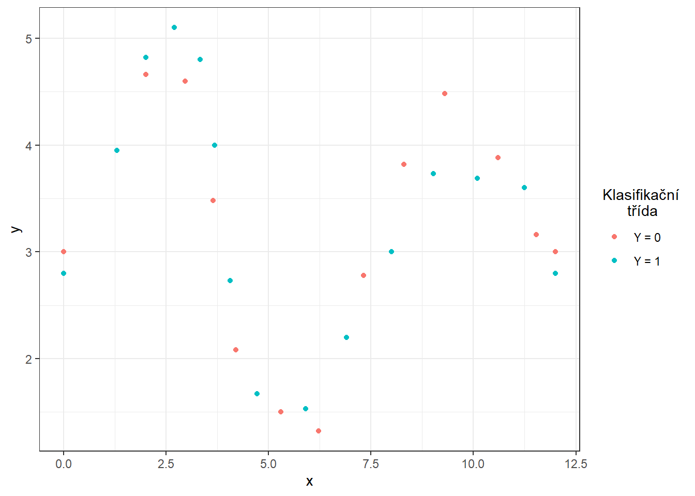

Jejich grafy jsou na obrázcích níže.


```r
# generujici funkce pro Y = 0 a Y = 1
funkce_0 <- function(n) {
  sp <- spline(x.0, y.0, method = 'periodic', n = n)
  return(list(x = sp$x, y = sp$y))
}
# pridat nahodny posun v zacatku nebo periode
funkce_1 <- function(n) {
  sp <- spline(x.1, y.1, method = 'periodic', n = n)
  return(list(x = sp$x, y = sp$y))
}
```


```r
n_x <- 501
x <- funkce_0(n_x)$x
y0 <- funkce_0(n_x)$y
y1 <- funkce_1(n_x)$y
df <- data.frame(x = rep(x, 2),
                 y = c(y0, y1),
                 Y = rep(c('Y = 0', 'Y = 1'), each = length(x)))

df |> ggplot(aes(x = x, y = y, colour = Y)) + 
  geom_line(linewidth = 1) + 
  theme_bw() +
  labs(colour = 'Klasifikační\n      třída') 
```

<div class="figure">

<p class="caption">(\#fig:unnamed-chunk-6)Znázornění dvou funkcí na intervalu $[0, 12]$, ze kterých generujeme pozorování ze tříd 0 a 1.</p>
</div>

Nyní si vytvoříme funkci pro generování náhodných funkcí s přidaným šumem (resp. bodů na předem dané síti) ze zvolené generující funkce.
Argument `t` označuje vektor hodnot, ve kterých chceme dané funkce vyhodnotit, `fun` značí generující funkci, `n` počet funkcí a `sigma` směrodatnou odchylku $\sigma$ normálního rozdělení $\text{N}(\mu, \sigma^2)$, ze kterého náhodně generujeme gaussovský bílý šum s $\mu = 0$.
Abychom ukázali výhodu použití metod, které pracují s funkcionálními daty, přidáme při generování ke každému simulovanému pozorování navíc i náhodný člen, který bude mít význam vertikálního posunu celé funkce.
Tento posun budeme generovat s normálního rozdělění s parametrem $\sigma^2 = 3.75^2$.


```r
generate_values <- function(t, fun, n, sigma, sigma_shift = 0) {
  # Arguments:
  # t ... vector of values, where the function will be evaluated
  # fun ... generating function of t 
  # n ... the number of generated functions / objects
  # sigma ... standard deviation of normal distribution to add noise to data
  # sigma_shift ... parameter of normal distribution for generating shift
  
  # Value:
  # X ... matrix of dimension length(t) times n with generated values of one 
  # function in a column 
  
  X <- matrix(rep(fun(length(t))$y, times = n), ncol = n, nrow = length(t), byrow = FALSE)
  noise <- matrix(rnorm(n * length(t), mean = 0, sd = sigma),
                  ncol = n, nrow = length(t), byrow = FALSE)
  shift <- matrix(rep(rnorm(n, 0, sigma_shift), each = length(t)),
                  ncol = n, nrow = length(t))
  return(X + noise + shift)
}
```

Nyní můžeme generovat funkce.
V každé ze dvou tříd budeme uvažovat 100 pozorování, tedy `n = 100`.


```r
# pocet vygenerovanych pozorovani pro kazdou tridu
n <- 100
# vektor casu ekvidistantni na intervalu [0, 12]
t <- seq(0, 12, length = 51)

# pro Y = 0
X0 <- generate_values(t, funkce_0, n, 1, 3.75)
# pro Y = 1
X1 <- generate_values(t, funkce_1, n, 1, 3.75)
```

Vykreslíme vygenerované (ještě nevyhlazené) funkce barevně v závislosti na třídě (pouze prvních 10 pozorování z každé třídy pro přehlednost).


```r
n_curves_plot <- 10 # pocet krivek, ktere chceme vykreslit z kazde skupiny

DF0 <- cbind(t, X0[, 1:n_curves_plot]) |> 
  as.data.frame() |> 
  reshape(varying = 2:(n_curves_plot + 1), direction = 'long', sep = '') |> 
  subset(select = -id) |> 
  mutate(
  time = time - 1,
  group = 0
  )

DF1 <- cbind(t, X1[, 1:n_curves_plot]) |> 
  as.data.frame() |> 
  reshape(varying = 2:(n_curves_plot + 1), direction = 'long', sep = '') |> 
  subset(select = -id) |> 
  mutate(
  time = time - 1,
  group = 1
  )

DF <- rbind(DF0, DF1) |>
  mutate(group = factor(group))

DF |> ggplot(aes(x = t, y = V, group = interaction(time, group), 
                 colour = group)) + 
  geom_line(linewidth = 0.5) +
  theme_bw() +
  labs(x = 'x',
       y = 'y',
       colour = 'Klasifikační\n      třída') +
  scale_colour_discrete(labels=c('Y = 0', 'Y = 1'))
```

<div class="figure">
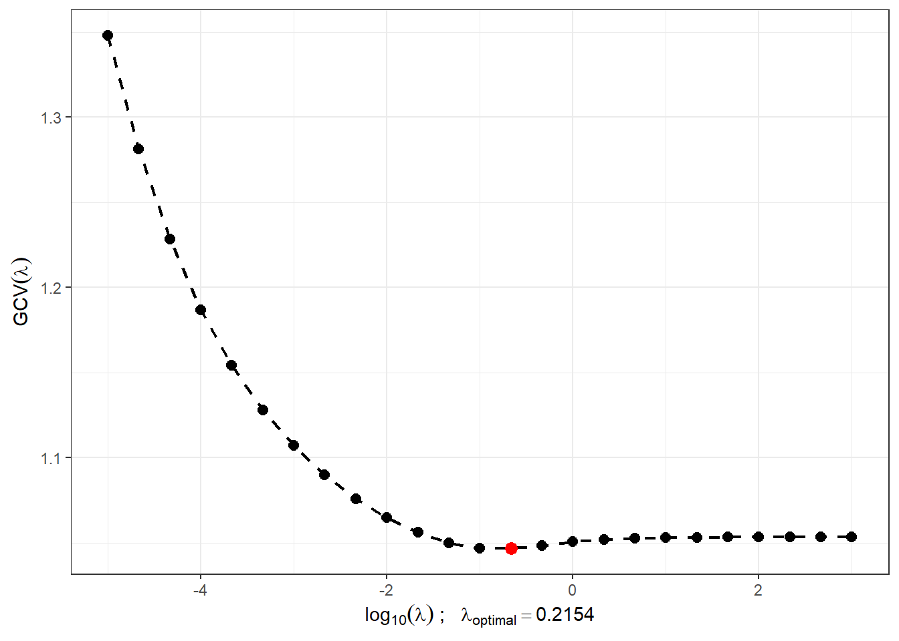
<p class="caption">(\#fig:unnamed-chunk-9)Prvních 10 vygenerovaných pozorování z každé ze dvou klasifikačních tříd. Pozorovaná data nejsou vyhlazená.</p>
</div>

## Vyhlazení pozorovaných křivek

Nyní převedeme pozorované diskrétní hodnoty (vektory hodnot) na funkcionální objekty, se kterými budeme následně pracovat.
Jelikož se nyní jedná o periodické křivky na intervalu $I = [0, 12]$, využijeme k vyhlazení *fourierovu* bázi.

Za uzly bereme celý vektor `t`, budeme uvažovat tzv. *harmonic acceleration penalties*. *Harmonic acceleration* pro funkci $x(t)$ je 
$$
Lx = \omega^2 Dx + D^3x,
$$
kde $D^mx$ značí $m$-tou derivaci funkce $x(t)$ podle $t$. Platí přitom $L\sin(\omega x) = 0 = L\cos(\omega x)$. Potom jako penalizaci bereme hodnotu funkcionálu
$$
J_L(x) = \int \left[Lx(t)\right]^2\text dt.
$$


```r
rangeval <- range(t)

fbasis <- create.fourier.basis(rangeval = rangeval, 
                               nbasis = length(t))

omega <- 2 * pi / diff(rangeval)
acvec <- c(0, omega^2, 0)
harmLfd <- vec2Lfd(bwtvec = acvec, rangeval = rangeval)
```

Najdeme vhodnou hodnotu vyhlazovacího parametru $\lambda > 0$ pomocí $GCV(\lambda)$, tedy pomocí zobecněné cross--validace.
Hodnotu $\lambda$ budeme uvažovat pro obě klasifikační skupiny stejnou, neboť pro testovací pozorování bychom dopředu nevěděli, kterou hodnotu $\lambda$, v případě rozdílné volby pro každou třídu, máme volit.


```r
# spojeni pozorovani do jedne matice
XX <- cbind(X0, X1)

lambda.vect <- 10^seq(from = -2, to = 2, length.out = 25) # vektor lambd
gcv <- rep(NA, length = length(lambda.vect)) # prazdny vektor pro ulozebi GCV

for(index in 1:length(lambda.vect)) {
  curv.Fdpar <- fdPar(fbasis, harmLfd, lambda.vect[index])
  FSmooth <- smooth.basis(t, XX, curv.Fdpar) # vyhlazeni
  gcv[index] <- mean(FSmooth$gcv) # prumer pres vsechny pozorovane krivky
}

GCV <- data.frame(
  lambda = round(log10(lambda.vect), 3),
  GCV = gcv
)

# najdeme hodnotu minima
lambda.opt <- lambda.vect[which.min(gcv)]
```

Pro lepší znázornění si vykreslíme průběh $GCV(\lambda)$.


```r
GCV |> ggplot(aes(x = lambda, y = GCV)) + 
  geom_line(linetype = 'dashed', linewidth = 0.8) + 
  geom_point(size = 2.5) + 
  theme_bw() + 
  labs(x = bquote(paste(log[10](lambda), ' ;   ', 
                        lambda[optimal] == .(round(lambda.opt, 4)))),
       y = expression(GCV(lambda))) + 
  geom_point(aes(x = log10(lambda.opt), y = min(gcv)), colour = 'red', size = 3)
```

<div class="figure">
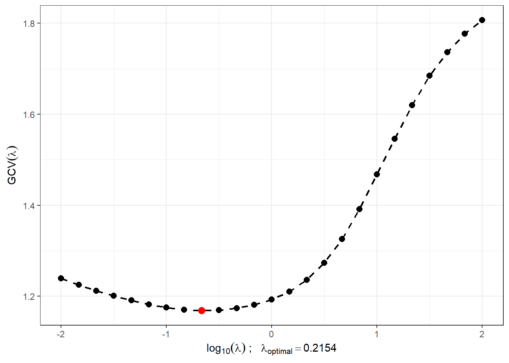
<p class="caption">(\#fig:unnamed-chunk-12)Průběh $GCV(\lambda)$ pro zvolený vektor $\boldsymbol\lambda$. Na ose $x$ jsou hodnoty vyneseny v logaritmické škále. Červeně je znázorněna optimální hodnota vyhlazovacího parametru $\lambda_{optimal}$.</p>
</div>

S touto optimální volbou vyhlazovacího parametru $\lambda$ nyní vyhladíme všechny funkce a opět znázorníme graficky prvních 10 pozorovaných křivek z každé klasifikační třídy.


```r
curv.fdPar <- fdPar(fbasis, harmLfd, lambda.opt)
FSmooth <- smooth.basis(t, XX, curv.fdPar)
XXfd <- FSmooth$fd

fdobjSmootheval <- eval.fd(fdobj = XXfd, evalarg = t)
DF$Vsmooth <- c(fdobjSmootheval[, c(1 : n_curves_plot, 
                                    (n + 1) : (n + n_curves_plot))])

DF |> ggplot(aes(x = t, y = Vsmooth, group = interaction(time, group), 
                 colour = group)) + 
  geom_line(linewidth = 0.75) +
  theme_bw() +
  labs(x = 'x',
       y = 'y',
       colour = 'Klasifikační\n      třída') +
  scale_colour_discrete(labels=c('Y = 0', 'Y = 1'))
```

<div class="figure">
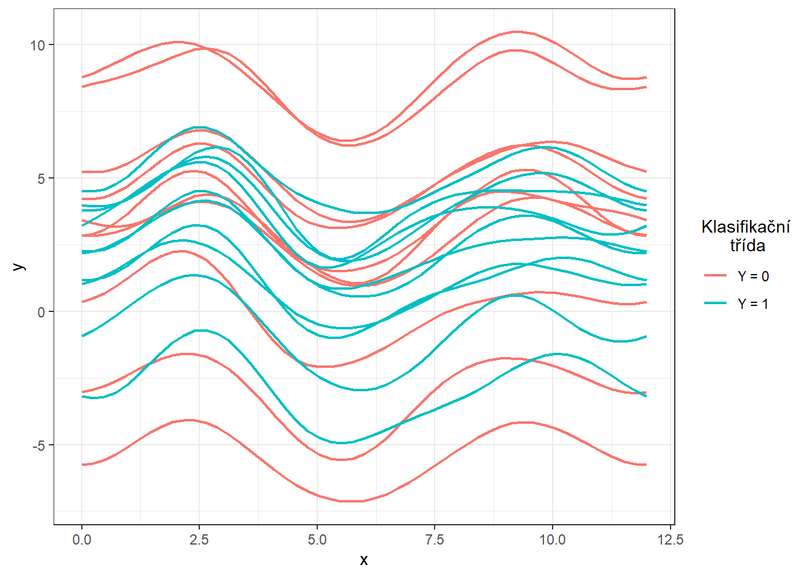
<p class="caption">(\#fig:unnamed-chunk-13)Prvních 10 vyhlazených křivek z každé klasifikační třídy.</p>
</div>

Ještě znázorněme všechny křivky včetně průměru zvlášť pro každou třídu.


```r
DFsmooth <- data.frame(
  t = rep(t, 2 * n),
  time = rep(rep(1:n, each = length(t)), 2),
  Smooth = c(fdobjSmootheval),
  Mean = c(rep(apply(fdobjSmootheval[ , 1 : n], 1, mean), n),
            rep(apply(fdobjSmootheval[ , (n + 1) : (2 * n)], 1, mean), n)),
  group = factor(rep(c(0, 1), each = n * length(t)))
)

DFmean <- data.frame(
  t = rep(t, 2),
  Mean = c(apply(fdobjSmootheval[ , 1 : n], 1, mean), 
            apply(fdobjSmootheval[ , (n + 1) : (2 * n)], 1, mean)),
  group = factor(rep(c(0, 1), each = length(t)))
)

DFsmooth |> ggplot(aes(x = t, y = Smooth, group = interaction(time, group), 
                 colour = group)) + 
  geom_line(linewidth = 0.25) +
  theme_bw() +
  labs(x = 'x',
       y = 'y',
       colour = 'Klasifikační\n      třída') +
  scale_colour_discrete(labels = c('Y = 0', 'Y = 1')) + 
  geom_line(aes(x = t, y = Mean), 
            colour = 'black', linewidth = 1, linetype = 'twodash')
```

<div class="figure">
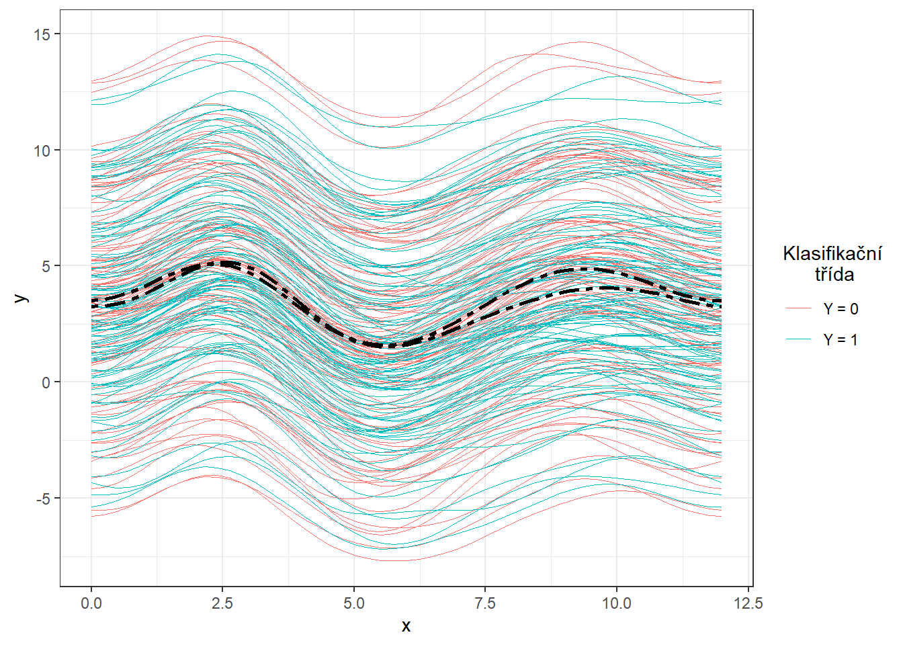
<p class="caption">(\#fig:unnamed-chunk-14)Vykreslení všech vyhlazených pozorovaných křivek, barevně jsou odlišeny křivky podle příslušnosti do klasifikační třídy. Černou čerchovanou čarou je zakreslen průměr pro každou třídu.</p>
</div>

## Klasifikace křivek

Nejprve načteme potřebné knihovny pro klasifikaci.


```r
library(caTools) # pro rozdeleni na testovaci a trenovaci
library(caret) # pro k-fold CV
library(fda.usc) # pro KNN, fLR
library(MASS) # pro LDA
library(fdapace)
library(pracma)
library(refund) # pro LR na skorech
library(nnet) # pro LR na skorech
library(caret)
library(rpart) # stromy
library(rattle) # grafika
library(e1071)
library(randomForest) # nahodny les
```

Abychom mohli jednotlivé klasifikátory porovnat, rozdělíme množinu vygenerovaných pozorování na dvě části v poměru 70:30, a to na trénovací a testovací (validační) část.
Trénovací část použijeme při konstrukci klasifikátoru a testovací na výpočet chyby klasifikace a případně dalších charakteristik našeho modelu.
Výsledné klasifikátory podle těchto spočtených charakteristik můžeme následně porovnat mezi sebou z pohledu jejich úspěnosti klasifikace.


```r
# rozdeleni na testovaci a trenovaci cast
split <- sample.split(XXfd$fdnames$reps, SplitRatio = 0.7)

Y <- rep(c(0, 1), each = n)

X.train <- subset(XXfd, split == TRUE)
X.test <- subset(XXfd, split == FALSE)

Y.train <- subset(Y, split == TRUE)
Y.test <- subset(Y, split == FALSE)
```

Ještě se podíváme na zastoupení jednotlivých skupin v testovací a trénovací části dat.


```r
# absolutni zastoupeni
table(Y.train)
```

```
## Y.train
##  0  1 
## 71 69
```

```r
table(Y.test)
```

```
## Y.test
##  0  1 
## 29 31
```

```r
# relativni zastoupeni
table(Y.train) / sum(table(Y.train))
```

```
## Y.train
##         0         1 
## 0.5071429 0.4928571
```

```r
table(Y.test) / sum(table(Y.test))
```

```
## Y.test
##         0         1 
## 0.4833333 0.5166667
```

### $K$ nejbližších sousedů

Začněme neparametrickou klasifikační metodou, a to metodou $K$ nejbližších sousedů.
Nejprve si vytvoříme potřebné objekty tak, abychom s nimi mohli pomocí funkce `classif.knn()` z knihovny `fda.usc` dále pracovat.


```r
x.train <- fdata(X.train)
y.train <- as.numeric(factor(Y.train))
```

Nyní můžeme definovat model a podívat se na jeho úspěšnost klasifikace.
Poslední otázkou však zůstává, jak volit optimální počet sousedů $K$.
Mohli bychom tento počet volit jako takové $K$, při kterém nastává minimální chybovost na trénovacích datech.
To by ale mohlo vést k přeučení modelu, proto využijeme cross-validaci.
Vzhledem k výpočetní náročnosti a rozsahu souboru zvolíme $k$-násobnou CV, my zvolíme například hodnotu $k = {10}$.


```r
# model pro vsechna trenovaci data pro K = 1, 2, ..., sqrt(n_train)
neighb.model <- classif.knn(group = y.train, 
                            fdataobj = x.train, 
                            knn = c(1:round(sqrt(length(y.train))))) 

# summary(neighb.model) # shrnuti modelu
# plot(neighb.model$gcv, pch = 16) # vykresleni zavislosti GCV na poctu sousedu K
# neighb.model$max.prob # maximalni presnost
(K.opt <- neighb.model$h.opt) # optimalni hodnota K
```

```
## [1] 1
```

Proveďme předchozí postup pro trénovací data, která rozdělíme na $k$ částí a tedy zopakujeme tuto část kódu $k$-krát.


```r
k_cv <- 10 # k-fold CV
neighbours <- c(1:(2 * ceiling(sqrt(length(y.train))))) # pocet sousedu 

# rozdelime trenovaci data na k casti
folds <- createMultiFolds(X.train$fdnames$reps, k = k_cv, time = 1)

# prazdna matice, do ktere vlozime jednotlive vysledky
# ve sloupcich budou hodnoty presnosti pro danou cast trenovaci mnoziny
# v radcich budou hodnoty pro danou hodnotu K sousedu
CV.results <- matrix(NA, nrow = length(neighbours), ncol = k_cv)

for (index in 1:k_cv) {
  # definujeme danou indexovou mnozinu
  fold <- folds[[index]]
    
  x.train.cv <- subset(X.train, c(1:length(X.train$fdnames$reps)) %in% fold) |>
    fdata()
  y.train.cv <- subset(Y.train, c(1:length(X.train$fdnames$reps)) %in% fold) |>
    factor() |> as.numeric()
  
  x.test.cv <- subset(X.train, !c(1:length(X.train$fdnames$reps)) %in% fold) |>
    fdata()
  y.test.cv <- subset(Y.train, !c(1:length(X.train$fdnames$reps)) %in% fold) |>
    factor() |> as.numeric()
  
  # projdeme kazdou cast ... k-krat zopakujeme
  for(neighbour in neighbours) {
    # model pro konkretni volbu K
    neighb.model <- classif.knn(group = y.train.cv, 
                              fdataobj = x.train.cv, 
                              knn = neighbour) 
    # predikce na validacni casti
    model.neighb.predict <- predict(neighb.model, 
                                    new.fdataobj = x.test.cv)
    # presnost na validacni casti
    presnost <- table(y.test.cv, model.neighb.predict) |> 
      prop.table() |> diag() |> sum()
    
    # presnost vlozime na pozici pro dane K a fold
    CV.results[neighbour, index] <- presnost
  }
}

# spocitame prumerne presnosti pro jednotliva K pres folds
CV.results <- apply(CV.results, 1, mean)
K.opt <- which.max(CV.results)
presnost.opt.cv <- max(CV.results)
# CV.results
```

Vidíme, že nejlépe vychází hodnota parametru $K$ jako 3 s hodnotou chybovosti spočtenou pomocí 10-násobné CV 0.2579.
Pro přehlednost si ještě vykresleme průběh validační chybovosti v závislosti na počtu sousedů $K$.


```r
CV.results <- data.frame(K = neighbours, CV = CV.results)
CV.results |> ggplot(aes(x = K, y = 1 - CV)) + 
  geom_line(linetype = 'dashed', colour = 'grey') + 
  geom_point(size = 1.5) + 
  geom_point(aes(x = K.opt, y = 1 - presnost.opt.cv), colour = 'red', size = 2) +
  theme_bw() + 
  labs(x = bquote(paste(K, ' ;   ', 
                        K[optimal] == .(K.opt))),
       y = 'Validační chybovost') + 
  scale_x_continuous(breaks = neighbours)
```

<div class="figure">
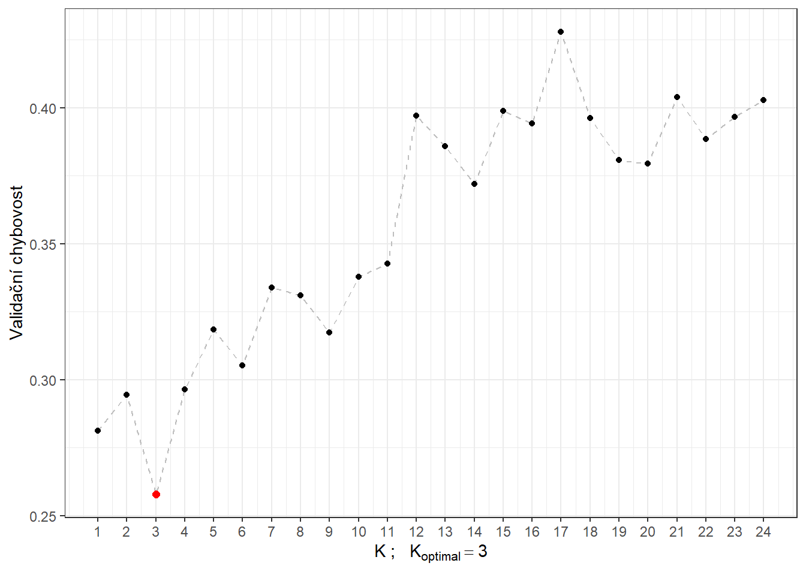
<p class="caption">(\#fig:unnamed-chunk-21)Závislost validační chybovosti na hodnotě $K$, tedy na počtu sousedů.</p>
</div>

Nyní známe optimální hodnotu parametru $K$ a tudíž můžeme sestavit finální model.


```r
neighb.model <- classif.knn(group = y.train, fdataobj = x.train, knn = K.opt)

# predikce
model.neighb.predict <- predict(neighb.model, 
                                new.fdataobj = fdata(X.test))

# summary(neighb.model)

# presnost na testovacich datech
presnost <- table(as.numeric(factor(Y.test)), model.neighb.predict) |>
  prop.table() |>
  diag() |>
  sum()
# chybovost
# 1 - presnost
```

Vidíme tedy, že chybovost modelu sestrojeného pomocí metody $K$ nejbližších sousedů s optimální volbou $K_{optimal}$ rovnou 3, kterou jsme určili cross-validací, je na trénovacích datech rovna 0.3071 a na testovacích datech 0.3333.

K porovnání jendotlivých modelů můžeme použít oba typy chybovostí, pro přehlednost si je budeme ukládat do tabulky.


```r
RESULTS <- data.frame(model = 'KNN', 
                      Err.train = 1 - neighb.model$max.prob,
                      Err.test = 1 - presnost)
```

### Lineární diskriminační analýza

Jako druhou metodu pro sestrojení klasifikátoru budeme uvažovat lineární diskriminační analýzu (LDA).
Jelikož tato metoda nelze aplikovat na funkcionální data, musíme je nejprve diskretizovat, což provedeme pomocí funkcionální analýzy hlavních komponent.
Klasifikační algoritmus následně provedeme na skórech prvních $p$ hlavních komponent.
Počet komponent $p$ zvolíme tak, aby prvních $p$ hlavních komponent dohromady vysvětlovalo alespoň 90 % variability v datech.

Proveďme tedy nejprve funkcionální analýzu hlavních komponent a určeme počet $p$.


```r
# analyza hlavnich komponent
data.PCA <- pca.fd(X.train, nharm = 10) # nharm - maximalni pocet HK
nharm <- which(cumsum(data.PCA$varprop) >= 0.9)[1] # urceni p
if(nharm == 1) nharm <- 2

data.PCA <- pca.fd(X.train, nharm = nharm) 
data.PCA.train <- as.data.frame(data.PCA$scores) # skore prvnich p HK
data.PCA.train$Y <- factor(Y.train) # prislusnost do trid
```

V tomto konkrétním případě jsme za počet hlavních komponent vzali $p$ = 2, které dohromady vysvětlují 99.52 % variability v datech.
První hlavní komponenta potom vysvětluje 99.16 % a druhá 0.36 % variability.
Graficky si můžeme zobrazit hodnoty skórů prvních dvou hlavních komponent, barevně odlišených podle příslušnosti do klasifikační třídy.


```r
data.PCA.train |> ggplot(aes(x = V1, y = V2, colour = Y)) +
  geom_point(size = 1.5) + 
  labs(x = paste('1. hlavní komponenta (vysvětlená variabilita', 
                 round(100 * data.PCA$varprop[1], 2), '%)'),
       y = paste('2. hlavní komponenta (', 
                 round(100 * data.PCA$varprop[2], 2), '%)'),
       colour = 'Klasifikační\n      třída') +
  scale_colour_discrete(labels = c('Y = 0', 'Y = 1')) +
  theme_bw()
```

<div class="figure">

<p class="caption">(\#fig:unnamed-chunk-25)Hodnoty skórů prvních dvou hlavních komponent pro trénovací data. Barevně jsou odlišeny body podle příslušnosti do klasifikační třídy.</p>
</div>

Abychom mohli určit přesnost klasifikace na testovacích datech, potřebujeme spočítat skóre pro první 2 hlavní komponenty pro testovací data.
Tato skóre určíme pomocí vzorce:

$$
\xi_{i, j} = \int \left( X_i(t) - \mu(t)\right) \cdot \rho_j(t)\text dt,
$$ kde $\mu(t)$ je střední hodnota (průměrná funkce) a $\rho_j(t)$ vlastní fukce (funkcionální hlavní komponenty).


```r
# vypocet skoru testovacich funkci
scores <- matrix(NA, ncol = nharm, nrow = length(Y.test)) # prazdna matice 

for(k in 1:dim(scores)[1]) {
  xfd = X.test[k] - data.PCA$meanfd[1] # k-te pozorovani - prumerna funkce
  scores[k, ] = inprod(xfd, data.PCA$harmonics) 
  # skalarni soucin rezidua a vlastnich funkci rho (funkcionalni hlavni komponenty)
}

data.PCA.test <- as.data.frame(scores)
data.PCA.test$Y <- factor(Y.test)
colnames(data.PCA.test) <- colnames(data.PCA.train) 
```

Nyní již můžeme sestrojit klasifikátor na trénovací části dat.


```r
# model
clf.LDA <- lda(Y ~ ., data = data.PCA.train)

# presnost na trenovacich datech
predictions.train <- predict(clf.LDA, newdata = data.PCA.train)
presnost.train <- table(data.PCA.train$Y, predictions.train$class) |>
  prop.table() |> diag() |> sum()
  
# presnost na testovacich datech
predictions.test <- predict(clf.LDA, newdata = data.PCA.test)
presnost.test <- table(data.PCA.test$Y, predictions.test$class) |>
  prop.table() |> diag() |> sum()
```

Spočítali jsme jednak chybovost klasifikátoru na trénovacích (11.43 %), tak i na testovacích datech (15 %).

Pro grafické znázornění metody můžeme zaznačit dělící hranici do grafu skórů prvních dvou hlavních komponent.
Tuto hranici spočítáme na husté síti bodů a zobrazíme ji pomocí funkce `geom_contour()`.


```r
# pridame diskriminacni hranici
np <- 1001 # pocet bodu site
# x-ova osa ... 1. HK
nd.x <- seq(from = min(data.PCA.train$V1), 
            to = max(data.PCA.train$V1), length.out = np)
# y-ova osa ... 2. HK
nd.y <- seq(from = min(data.PCA.train$V2), 
            to = max(data.PCA.train$V2), length.out = np)
# pripad pro 2 HK ... p = 2
nd <- expand.grid(V1 = nd.x, V2 = nd.y)
# pokud p = 3
if(dim(data.PCA.train)[2] == 4) {
  nd <- expand.grid(V1 = nd.x, V2 = nd.y, V3 = data.PCA.train$V3[1])}
# pokud p = 4
if(dim(data.PCA.train)[2] == 5) {
  nd <- expand.grid(V1 = nd.x, V2 = nd.y, V3 = data.PCA.train$V3[1],
                    V4 = data.PCA.train$V4[1])}
# pokud p = 5
if(dim(data.PCA.train)[2] == 6) {
  nd <- expand.grid(V1 = nd.x, V2 = nd.y, V3 = data.PCA.train$V3[1],
                    V4 = data.PCA.train$V4[1], V5 = data.PCA.train$V5[1])}

# pridame Y = 0, 1
nd <- nd |> mutate(prd = as.numeric(predict(clf.LDA, newdata = nd)$class))

data.PCA.train |> ggplot(aes(x = V1, y = V2, colour = Y)) +
  geom_point(size = 1.5) + 
  labs(x = paste('1. hlavní komponenta (vysvětlená variabilita', 
                 round(100 * data.PCA$varprop[1], 2), '%)'),
       y = paste('2. hlavní komponenta (', 
                 round(100 * data.PCA$varprop[2], 2), '%)'),
       colour = 'Klasifikační\n      třída') +
  scale_colour_discrete(labels = c('Y = 0', 'Y = 1')) +
  theme_bw() +
  geom_contour(data = nd, aes(x = V1, y = V2, z = prd), colour = 'black')
```

<div class="figure">
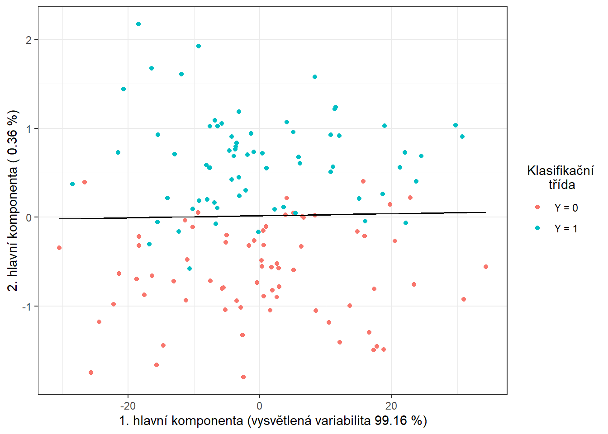
<p class="caption">(\#fig:unnamed-chunk-28)Skóre prvních dvou hlavních komponent, barevně odlišené podle příslušnosti do klasifikační třídy. Černě je vyznačena dělící hranice (přímka v rovině prvních dvou hlavních komponent) mezi třídami sestrojená pomocí LDA.</p>
</div>

Vidíme, že dělící hranicí je přímka, lineární funkce v prostoru 2D, což jsme ostatně od LDA čekali.
Nakonec přidáme chybovosti do souhrnné tabulky.


```r
Res <- data.frame(model = 'LDA', 
                  Err.train = 1 - presnost.train,
                  Err.test = 1 - presnost.test)

RESULTS <- rbind(RESULTS, Res)
```

### Kvadratická diskriminační analýza

Jako další sestrojme klasifikátor pomocí kvadratické diskriminační analýzy (QDA).
Jedná se o analogický případ jako LDA s tím rozdílem, že nyní připouštíme pro každou ze tříd rozdílnou kovarianční matici normálního rozdělení, ze kterého pocházejí příslušné skóry.
Tento vypuštěný předpoklad o rovnosti kovariančních matic vede ke kvadratické hranici mezi třídami.

V `R` se provede QDA analogicky jako LDA v předchozí části, tedy opět bychom pomocí funkcionální analýzy hlavních komponent spočítali skóre pro trénovací i testovací funkce, sestrojili klasifikátor na skórech prvních $p$ hlavních komponent a pomocí něj predikovali příslušnost testovacích křivek do třídy $Y^* \in \{0, 1\}$.

Funkcionální PCA provádět nemusíme, využijeme výsledků z části LDA.


Můžeme tedy rovnou přistoupit k sestrojení klasifikátoru, což provedeme pomocí funkce `qda()`.
Následně spočítáme přesnost klasifikátoru na testovacích a trénovacích datech.


```r
# model
clf.QDA <- qda(Y ~ ., data = data.PCA.train)

# presnost na trenovacich datech
predictions.train <- predict(clf.QDA, newdata = data.PCA.train)
presnost.train <- table(data.PCA.train$Y, predictions.train$class) |>
  prop.table() |> diag() |> sum()
  
# presnost na testovacich datech
predictions.test <- predict(clf.QDA, newdata = data.PCA.test)
presnost.test <- table(data.PCA.test$Y, predictions.test$class) |>
  prop.table() |> diag() |> sum()
```

Spočítali jsme tedy jednak chybovost klasifikátoru na trénovacích (12.86 %), tak i na testovacích datech (15 %).

Pro grafické znázornění metody můžeme zaznačit dělící hranici do grafu skórů prvních dvou hlavních komponent.
Tuto hranici spočítáme na husté síti bodů a zobrazíme ji pomocí funkce `geom_contour()` stejně jako v případě LDA.


```r
nd <- nd |> mutate(prd = as.numeric(predict(clf.QDA, newdata = nd)$class))

data.PCA.train |> ggplot(aes(x = V1, y = V2, colour = Y)) +
  geom_point(size = 1.5) + 
  labs(x = paste('1. hlavní komponenta (vysvětlená variabilita', 
                 round(100 * data.PCA$varprop[1], 2), '%)'),
       y = paste('2. hlavní komponenta (', 
                 round(100 * data.PCA$varprop[2], 2), '%)'),
       colour = 'Klasifikační\n      třída') +
  scale_colour_discrete(labels = c('Y = 0', 'Y = 1')) +
  theme_bw() +
  geom_contour(data = nd, aes(x = V1, y = V2, z = prd), colour = 'black')
```

<div class="figure">

<p class="caption">(\#fig:unnamed-chunk-34)Skóre prvních dvou hlavních komponent, barevně odlišené podle příslušnosti do klasifikační třídy. Černě je vyznačena dělící hranice (parabola v rovině prvních dvou hlavních komponent) mezi třídami sestrojená pomocí QDA.</p>
</div>

Všimněme si, že dělící hranicí mezi klasifikačními třídami je nyní parabola.

Nakonec ještě doplníme chybovosti do souhrnné tabulky.


```r
Res <- data.frame(model = 'QDA', 
                  Err.train = 1 - presnost.train,
                  Err.test = 1 - presnost.test)

RESULTS <- rbind(RESULTS, Res)
```

### Logistická regrese

Logistickou regresi můžeme provést dvěma způsoby.
Jednak použít funkcionální obdobu klasické logistické regrese, druhak klasickou mnohorozměrnou logistickou regresi, kterou provedeme na skórech prvních $p$ hlavních komponent. V tomto případě však funkce `fregre.glm()` hlásí chybu, že systém je výpočetně singulární, proto nyní uvažujme pouze druhou z možných implementací logistické regrese pro funkcionální data. 

#### Logistická regrese s analýzou hlavních komponent

Abychom mohli sesrojit tento klasifikátor, potřebujeme provést funkcionální analýzu hlavních komponent, určit vhodný počet komponent a spočítat hodnoty skórů pro testovací data.
To jsme již provedli v části u lineární diskriminační analýzy, proto využijeme tyto výsledky v následující části.


Můžeme tedy rovnou sestrojit model logistické regrese pomocí funkce `glm(, family = binomial)`.


```r
# model
clf.LR <- glm(Y ~  ., data = data.PCA.train, family = binomial)

# presnost na trenovacich datech
predictions.train <- predict(clf.LR, newdata = data.PCA.train, type = 'response')
predictions.train <- ifelse(predictions.train > 0.5, 1, 0)
presnost.train <- table(data.PCA.train$Y, predictions.train) |>
  prop.table() |> diag() |> sum()
  
# presnost na testovacich datech
predictions.test <- predict(clf.LR, newdata = data.PCA.test, type = 'response')
predictions.test <- ifelse(predictions.test > 0.5, 1, 0)
presnost.test <- table(data.PCA.test$Y, predictions.test) |>
  prop.table() |> diag() |> sum()
```

Spočítali jsme tedy chybovost klasifikátoru na trénovacích (10.71 %) i na testovacích datech (16.67 %).

Pro grafické znázornění metody můžeme zaznačit dělící hranici do grafu skórů prvních dvou hlavních komponent.
Tuto hranici spočítáme na husté síti bodů a zobrazíme ji pomocí funkce `geom_contour()` stejně jako v případě LDA i QDA.


```r
nd <- nd |> mutate(prd = as.numeric(predict(clf.LR, newdata = nd,
                                            type = 'response')))
nd$prd <- ifelse(nd$prd > 0.5, 1, 0)

data.PCA.train |> ggplot(aes(x = V1, y = V2, colour = Y)) +
  geom_point(size = 1.5) + 
  labs(x = paste('1. hlavní komponenta (vysvětlená variabilita', 
                 round(100 * data.PCA$varprop[1], 2), '%)'),
       y = paste('2. hlavní komponenta (', 
                 round(100 * data.PCA$varprop[2], 2), '%)'),
       colour = 'Klasifikační\n      třída') +
  scale_colour_discrete(labels = c('Y = 0', 'Y = 1')) +
  theme_bw() +
  geom_contour(data = nd, aes(x = V1, y = V2, z = prd), colour = 'black')
```

<div class="figure">

<p class="caption">(\#fig:unnamed-chunk-40)Skóre prvních dvou hlavních komponent, barevně odlišené podle příslušnosti do klasifikační třídy. Černě je vyznačena dělící hranice (přímka v rovině prvních dvou hlavních komponent) mezi třídami sestrojená pomocí logistické regrese.</p>
</div>

Všimněme si, že dělící hranicí mezi klasifikačními třídami je nyní přímka jako v případě LDA.

Nakonec ještě doplníme chybovosti do souhrnné tabulky.


```r
Res <- data.frame(model = 'LR score', 
                  Err.train = 1 - presnost.train,
                  Err.test = 1 - presnost.test)

RESULTS <- rbind(RESULTS, Res)
```

### Rozhodovací stromy

V této části se podíváme na velmi odlišný přístup k sestrojení klasifikátoru, než byly například LDA či logistická regrese.
Rozhodovací stromy jsou velmi oblíbeným nástrojem ke klasifikaci, avšak jako v případě některých předchozích metod nejsou přímo určeny pro funkcionální data.
Existují však postupy, jak funkcionální objekty převést na mnohorozměrné a následně na ně aplikovat algoritmus rozhodovacích stromů.
Můžeme uvažovat následující postupy:

-   algoritmus sestrojený na bázových koeficientech,

-   využití skórů hlavních komponent,

-   použít diskretizaci intervalu a vyhodnotit funkci jen na nějaké konečné síti bodů.

My se nejprve zaměříme na diskretizaci intervalu a následně porovnáme výsledky se zbylými dvěma přístupy k sestrojení rozhodovacího stromu.

#### Diskretizace intervalu

Nejprve si musíme definovat body z intervalu $I = [0, 12]$, ve kterých funkce vyhodnotíme.
Následně vytvoříme objekt, ve kterém budou řádky představovat jednotlivé (diskretizované) funkce a sloupce časy.
Nakonec připojíme sloupec $Y$ s informací o příslušnosti do klasifikační třídy a totéž zopakujeme i pro testovací data.


```r
# posloupnost bodu, ve kterych funkce vyhodnotime
t.seq <- seq(0, 12, length = 101)
   
grid.data <- eval.fd(fdobj = X.train, evalarg = t.seq)
grid.data <- as.data.frame(t(grid.data)) # transpozice kvuli funkcim v radku
grid.data$Y <- Y.train |> factor()

grid.data.test <- eval.fd(fdobj = X.test, evalarg = t.seq)
grid.data.test <- as.data.frame(t(grid.data.test))
grid.data.test$Y <- Y.test |> factor()
```

Nyní mážeme sestrojit rozhodovací strom, ve kterém budou jakožto prediktory vystupovat všechny časy z vektoru `t.seq`.
Tato klasifikační není náchylná na multikolinearitu, tudíž se jí nemusíme zabývat.
Jako metriku zvolíme přesnost.


```r
# sestrojeni modelu
clf.tree <- train(Y ~ ., data = grid.data, 
                 method = "rpart", 
                 trControl = trainControl(method = "CV", number = 10),
                 metric = "Accuracy")

# presnost na trenovacich datech
predictions.train <- predict(clf.tree, newdata = grid.data)
presnost.train <- table(Y.train, predictions.train) |>
  prop.table() |> diag() |> sum()
  
# presnost na testovacich datech
predictions.test <- predict(clf.tree, newdata = grid.data.test)
presnost.test <- table(Y.test, predictions.test) |>
  prop.table() |> diag() |> sum()
```

Chybovost klasifikátoru na testovacích datech je tedy 53.33 % a na trénovacích datech 32.86 %.

Graficky si rozhodovací strom můžeme vykreslit pomocí funkce `fancyRpartPlot()`.
Nastavíme barvy uzlů tak, aby reflektovaly předchozí barevné odlišení.
Jedná se o neprořezaný strom.


```r
colnames(grid.data) <- c(paste0('time:', t.seq), 'Y')
fancyRpartPlot(rpart(Y ~ ., data = grid.data, method = "class"),
               sub = '', palettes = c('Reds', 'Blues')) 
```

<div class="figure">
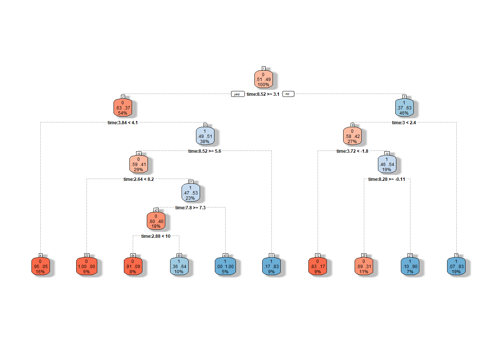
<p class="caption">(\#fig:unnamed-chunk-44)Grafické znázornění neprořezaného rozhodovacího stromu. Modrými odstíny jsou vykresleny uzly příslušející klasifikační třídě 1 a červenými odstíny třídě 0.</p>
</div>

Můžeme si také vykreslit již prořezaný finální rozhodovací strom.


```r
rpart.plot::rpart.plot(clf.tree$finalModel, # finalni model ... prorezany strom
                       extra = 104, # zobrazeni pozadovanych informaci
                       box.palette = c('Reds', 'Blues'),
                       branch.lty = 3, # dotted branch lines
                       shadow.col = 0, # shadows under the node boxes
                       nn = FALSE, 
                       under = FALSE, 
                       digits = 2)
```

<div class="figure">

<p class="caption">(\#fig:unnamed-chunk-45)Finální prořezaný rozhodovací strom.</p>
</div>

Nakonec opět přidejme trénovací a testovací chybovost do souhrnné tabulky.


```r
Res <- data.frame(model = 'Tree - diskr.', 
                  Err.train = 1 - presnost.train,
                  Err.test = 1 - presnost.test)

RESULTS <- rbind(RESULTS, Res)
```

#### Skóre hlavních komponent

Další možností pro sestrojení rozhodovacího stromu je použít skóre hlavních komponent.
Jelikož jsme již skóre počítali pro předchozí klasifikační metody, využijeme těchto poznatků a sestrojíme rozhodovací strom na skórech prvních 2 hlavních komponent.


```r
# sestrojeni modelu
clf.tree.PCA <- train(Y ~ ., data = data.PCA.train, 
                 method = "rpart", 
                 trControl = trainControl(method = "CV", number = 10),
                 metric = "Accuracy")

# presnost na trenovacich datech
predictions.train <- predict(clf.tree.PCA, newdata = data.PCA.train)
presnost.train <- table(Y.train, predictions.train) |>
  prop.table() |> diag() |> sum()
  
# presnost na testovacich datech
predictions.test <- predict(clf.tree.PCA, newdata = data.PCA.test)
presnost.test <- table(Y.test, predictions.test) |>
  prop.table() |> diag() |> sum()
```

Chybovost rozhodovacího stromu na testovacích datech je tedy 16.67 % a na trénovacích datech 10 %.

Graficky si rozhodovací strom sestrojený na skórech hlavních komponent můžeme vykreslit pomocí funkce `fancyRpartPlot()`.
Nastavíme barvy uzlů tak, aby reflektovaly předchozí barevné odlišení.
Jedná se o neprořezaný strom.


```r
fancyRpartPlot(rpart(Y ~ ., data = data.PCA.train, method = "class"),
               sub = '', palettes = c('Reds', 'Blues')) 
```

<div class="figure">

<p class="caption">(\#fig:unnamed-chunk-48)Grafické znázornění neprořezaného rozhodovacího stromu sestrojeného na skórech hlavních komponent. Modrými odstíny jsou vykresleny uzly příslušející klasifikační třídě 1 a červenými odstíny třídě 0.</p>
</div>

Můžeme si také vykreslit již prořezaný finální rozhodovací strom.


```r
rpart.plot::rpart.plot(clf.tree.PCA$finalModel, # finalni model 
                       extra = 104, # zobrazeni pozadovanych informaci
                       box.palette = c('Reds', 'Blues'),
                       branch.lty = 3, # dotted branch lines
                       shadow.col = 0, # shadows under the node boxes
                       nn = FALSE, under = FALSE, digits = 2)
```

<div class="figure">
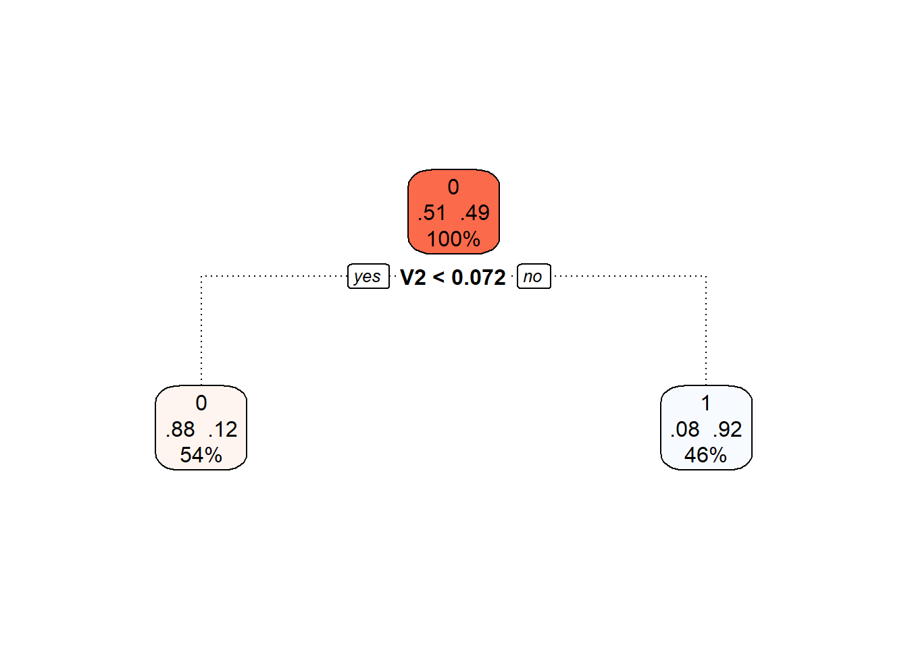
<p class="caption">(\#fig:unnamed-chunk-49)Finální prořezaný rozhodovací strom.</p>
</div>

Nakonec opět přidejme trénovací a testovací chybovost do souhrnné tabulky.


```r
Res <- data.frame(model = 'Tree - score', 
                  Err.train = 1 - presnost.train,
                  Err.test = 1 - presnost.test)

RESULTS <- rbind(RESULTS, Res)
```

#### Bázové koeficienty

Poslední možností, kterou využijeme pro sestrojení rozhodovacího stromu, je použití koeficientů ve vyjádření funkcí ve Fourierově bázi.

Nejprve si definujme potřebné datové soubory s koeficienty.


```r
# trenovaci dataset
data.Bbasis.train <- t(X.train$coefs) |> as.data.frame()
data.Bbasis.train$Y <- factor(Y.train)

# testovaci dataset
data.Bbasis.test <- t(X.test$coefs) |> as.data.frame()
data.Bbasis.test$Y <- factor(Y.test)
```

Nyní již můžeme sestrojit klasifikátor.


```r
# sestrojeni modelu
clf.tree.Bbasis <- train(Y ~ ., data = data.Bbasis.train, 
                 method = "rpart", 
                 trControl = trainControl(method = "CV", number = 10),
                 metric = "Accuracy")

# presnost na trenovacich datech
predictions.train <- predict(clf.tree.Bbasis, newdata = data.Bbasis.train)
presnost.train <- table(Y.train, predictions.train) |>
  prop.table() |> diag() |> sum()
  
# presnost na testovacich datech
predictions.test <- predict(clf.tree.Bbasis, newdata = data.Bbasis.test)
presnost.test <- table(Y.test, predictions.test) |>
  prop.table() |> diag() |> sum()
```

Chybovost rozhodovacího stromu na trénovacích datech je tedy 12.86 % a na testovacích datech 15 %.

Graficky si rozhodovací strom sestrojený na koeficientech B-splinového vyjádření můžeme vykreslit pomocí funkce `fancyRpartPlot()`.
Nastavíme barvy uzlů tak, aby reflektovaly předchozí barevné odlišení.
Jedná se o neprořezaný strom.


```r
fancyRpartPlot(rpart(Y ~ ., data = data.Bbasis.train, method = "class"),
               sub = '', palettes = c('Reds', 'Blues')) 
```

<div class="figure">

<p class="caption">(\#fig:unnamed-chunk-53)Grafické znázornění neprořezaného rozhodovacího stromu sestrojeného na bázových koeficientech. Modrými odstíny jsou vykresleny uzly příslušející klasifikační třídě 1 a červenými odstíny třídě 0.</p>
</div>

Můžeme si také vykreslit již prořezaný finální rozhodovací strom.


```r
rpart.plot::rpart.plot(clf.tree.Bbasis$finalModel, # finalni model 
                       extra = 104, # zobrazeni pozadovanych informaci
                       box.palette = c('Reds', 'Blues'),
                       branch.lty = 3, # dotted branch lines
                       shadow.col = 0, # shadows under the node boxes
                       nn = FALSE, under = FALSE, digits = 2)
```

<div class="figure">
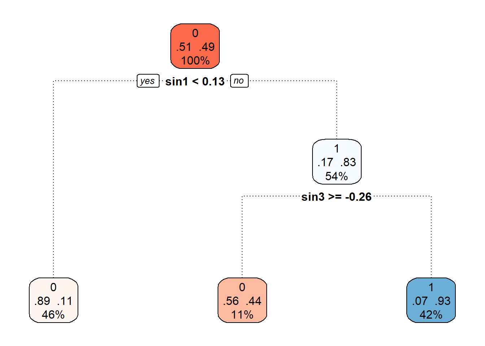
<p class="caption">(\#fig:unnamed-chunk-54)Finální prořezaný rozhodovací strom.</p>
</div>

Nakonec opět přidejme trénovací a testovací chybovost do souhrnné tabulky.


```r
Res <- data.frame(model = 'Tree - Fbasis', 
                  Err.train = 1 - presnost.train,
                  Err.test = 1 - presnost.test)

RESULTS <- rbind(RESULTS, Res)
```

### Náhodné lesy

Klasifikátor sestrojený pomocí metody náhodných lesů spočívá v sestrojení několika jednotlivých rozhodovacích stromů, které se následně zkombinují a vytvoří společný klasifikátor (společným "hlasováním").

Tak jako v případě rozhodovacích stromů máme několik možností na to, jaká data (konečně-rozměrná) použijeme pro sestrojení modelu.
Budeme opět uvažovat výše diskutované tři přístupy.
Datové soubory s příslušnými veličinami pro všechny tři přístupy již máme připravené z minulé sekce, proto můžeme přímo sestrojit dané modely, spočítat charakteristiky daného klasifikátoru a přidat výsledky do souhrnné tabulky.

#### Diskretizace intervalu

V prvním případě využíváme vyhodnocení funkcí na dané síti bodů intervalu $I = [0, 12]$.


```r
# sestrojeni modelu
clf.RF <- randomForest(Y ~ ., data = grid.data, 
                       ntree = 500, # pocet stromu
                       importance = TRUE,
                       nodesize = 5)

# presnost na trenovacich datech
predictions.train <- predict(clf.RF, newdata = grid.data)
presnost.train <- table(Y.train, predictions.train) |>
  prop.table() |> diag() |> sum()
  
# presnost na testovacich datech
predictions.test <- predict(clf.RF, newdata = grid.data.test)
presnost.test <- table(Y.test, predictions.test) |>
  prop.table() |> diag() |> sum()
```

Chybovost náhodného lesu na trénovacích datech je tedy 1.43 % a na testovacích datech 28.33 %.


```r
Res <- data.frame(model = 'RForest - diskr', 
                  Err.train = 1 - presnost.train,
                  Err.test = 1 - presnost.test)

RESULTS <- rbind(RESULTS, Res)
```

#### Skóre hlavních komponent

V tomto případě využijeme skóre prvních $p =$ 2 hlavních komponent.


```r
# sestrojeni modelu
clf.RF.PCA <- randomForest(Y ~ ., data = data.PCA.train, 
                           ntree = 500, # pocet stromu
                           importance = TRUE,
                           nodesize = 5)

# presnost na trenovacich datech
predictions.train <- predict(clf.RF.PCA, newdata = data.PCA.train)
presnost.train <- table(Y.train, predictions.train) |>
  prop.table() |> diag() |> sum()
  
# presnost na testovacich datech
predictions.test <- predict(clf.RF.PCA, newdata = data.PCA.test)
presnost.test <- table(Y.test, predictions.test) |>
  prop.table() |> diag() |> sum()
```

Chybovost rozhodovacího stromu na trénovacích datech je tedy 3.57 % a na testovacích datech 16.67 %.


```r
Res <- data.frame(model = 'RForest - score', 
                  Err.train = 1 - presnost.train,
                  Err.test = 1 - presnost.test)

RESULTS <- rbind(RESULTS, Res)
```

#### Bázové koeficienty

Nakonec použijeme vyjádření funkcí pomocí Fourierovské báze.


```r
# sestrojeni modelu
clf.RF.Bbasis <- randomForest(Y ~ ., data = data.Bbasis.train, 
                              ntree = 500, # pocet stromu
                              importance = TRUE,
                              nodesize = 5)

# presnost na trenovacich datech
predictions.train <- predict(clf.RF.Bbasis, newdata = data.Bbasis.train)
presnost.train <- table(Y.train, predictions.train) |>
  prop.table() |> diag() |> sum()
  
# presnost na testovacich datech
predictions.test <- predict(clf.RF.Bbasis, newdata = data.Bbasis.test)
presnost.test <- table(Y.test, predictions.test) |>
  prop.table() |> diag() |> sum()
```

Chybovost tohoto klasifikátoru na trénovacích datech je 0 % a na testovacích datech 15 %.


```r
Res <- data.frame(model = 'RForest - Fbasis', 
                  Err.train = 1 - presnost.train,
                  Err.test = 1 - presnost.test)

RESULTS <- rbind(RESULTS, Res)
```

### Support Vector Machines

Nyní se podívejme na klasifikaci našich nasimulovaných křivek pomocí metody podpůrných vektorů (ang. Support Vector Machines, SVM).
Výhodou této klasifikační metody je její výpočetní nenáročnost, neboť pro definici hraniční křivky mezi třídami využívá pouze několik (často málo) pozorování.

Hlavní výhodou SVM je použití tzv.
*jádrového triku* (kernel trick), pomocí kterého nahradíme obyčejný skalární součin jiným skalárním součinem transformovaných dat, aniž bychom tuto transformaci museli přímo definovat.
Tím dostaneme obecně nelineární dělící hranici mezi klasifikačními třídami.
*Jádro* (jádrová funkce, ang. kernel, kernel function) $K$ je taková funkce, která splňuje

$$
K(x_i, x_j) = \langle \phi(x_i), \phi(x_j) \rangle_{\mathcal H}, 
$$ kde $\phi$ je nějaká (neznámá) transformace (ang. feature map), $\mathcal H$ je Hilbertův prostor a $\langle \cdot, \cdot \rangle_{\mathcal H}$ je nějaký skalární součin na tomto Hilbertově prostoru.

Nejčastěji se v praxi volí tři typy jádrových funkcí:

-   lineární jádro -- $K(x_i, x_j) = \langle x_i, x_j \rangle$,
-   polynomiální jádro -- $K(x_i, x_j) = \big(\alpha_0 + \gamma \langle x_i, x_j \rangle \big)^d$,
-   radiální (gaussovské) jádro -- $\displaystyle{K(x_i, x_j) = \text e^{-\gamma \|x_i - x_j \|^2}}$.

U všech výše zmíněných jader musíme zvolit konstantu $C > 0$, která udává míru penalizace za překročení dělící hranice mezi třídami (ang. inverse regularization parameter).
S rostoucí hodnotou $C$ bude metoda více penalizovat špatně klasifikovaná data a méně tvar hranice, naopak pro malé hodnoty $C$ metoda nedává takový význam špatně klasifikovaným datům, ale zaměřuje se více na penalizaci tvaru hranice.
Tato konstanta $C$ se defaultně volí rovna 1, můžeme ji určit i přímo například pomocí cross-validace.

Využitím cross-validace můžeme také určit optimální hodnoty ostatních hyperparametrů, které nyní závisí na naší volbě jádrové funkce.
V případě lineárního jádra nevolíme žádný další parametr kromě konstanty $C$, u polynomiálního a radiálního jádra musíme určit hodnoty hyperparametrů $\alpha_0, \gamma \text{ a } d$, jejichž defaultní hodnoty v `R` jsou postupně $\alpha_0^{default} = 0, \gamma^{default} = \frac{1}{dim(\texttt{data})} \text{ a } d^{default} = 3$.
Opět bychom mohli hodnoty hyperparametrů určit jako optimální pro naše data, avšak vzhledem k relativní výpočetní náročnosti necháme hodnoty příslušných hyperparametrů na jejich defaultních hodnotách.

V případě funkcionálních dat máme několik možností, jak použít metodu SVM.
Nejjednodušší variantou je použít tuto klasifikační metodu přímo na diskretizovanou funkci (sekce \@ref(diskr2)).
Další možností je opět využít skóre hlavních komponent a klasifikovat křivky pomocí jejich reprezentace \@ref(PCA-SVM2).
Další přímočarou variantou je využít vyjádření křivek pomocí Fourierovy báze a klasifikovat křivky na základě koeficientů jejich vyjádření v této bázi (sekce \@ref(basis-SVM2)).

Složitější úvahou můžeme dospět k několika dalším možnostem, které využívají funkcionální podstatu dat.
Jednak můžeme místo klasifikace původní křivky využít její derivaci (případně druhou derivaci, třetí, ...), druhak můžeme využít projekce funkcí na podprostor generovaný, např. B-splinovými nebo Fourierovými, funkcemi (sekce \@ref(projection-SVM2)). Poslední metoda, kterou použijeme pro klasifikaci funkcionálních dat, spočívá v kombinaci projekce na určitý podprostor generovaný funkcemi (Reproducing Kernel Hilbert Space, RKHS) a klasifikace příslušné reprezentace. Tato metoda využívá kromě klasického SVM i SVM pro regresi, více uvádíme v sekci RKHS + SVM \@ref(RKHS-SVM2).

#### Diskretizace intervalu {#diskr2}

Začněme nejprve aplikací metody podpůrných vektorů přímo na diskretizovaná data (vyhodnocení funkce na dané síti bodů na intervalu $I = [0, 12]$), přičemž budeme uvažovat všech tři výše zmíněné jádrové funkce.


```r
# set norm equal to one
norms <- c()
for (i in 1:dim(XXfd$coefs)[2]) {
  norms <- c(norms, as.numeric(1 / norm.fd(XXfd[i])))
  }
XXfd_norm <- XXfd 
XXfd_norm$coefs <- XXfd_norm$coefs * matrix(norms, 
                                            ncol = dim(XXfd$coefs)[2],
                                            nrow = dim(XXfd$coefs)[1],
                                            byrow = T)

# rozdeleni na testovaci a trenovaci cast
X.train_norm <- subset(XXfd_norm, split == TRUE)
X.test_norm <- subset(XXfd_norm, split == FALSE)

Y.train_norm <- subset(Y, split == TRUE)
Y.test_norm <- subset(Y, split == FALSE)

grid.data <- eval.fd(fdobj = X.train_norm, evalarg = t.seq)
grid.data <- as.data.frame(t(grid.data)) 
grid.data$Y <- Y.train_norm |> factor()

grid.data.test <- eval.fd(fdobj = X.test_norm, evalarg = t.seq)
grid.data.test <- as.data.frame(t(grid.data.test))
grid.data.test$Y <- Y.test_norm |> factor()
```


```r
# sestrojeni modelu
clf.SVM.l <- svm(Y ~ ., data = grid.data,
                 type = 'C-classification',
                 scale = TRUE,
                 kernel = 'linear')

clf.SVM.p <- svm(Y ~ ., data = grid.data,
                 type = 'C-classification',
                 scale = TRUE,
                 coef0 = 1,
                 kernel = 'polynomial')

clf.SVM.r <- svm(Y ~ ., data = grid.data,
                 type = 'C-classification',
                 scale = TRUE,
                 kernel = 'radial')

# presnost na trenovacich datech
predictions.train.l <- predict(clf.SVM.l, newdata = grid.data)
presnost.train.l <- table(Y.train, predictions.train.l) |>
  prop.table() |> diag() |> sum()

predictions.train.p <- predict(clf.SVM.p, newdata = grid.data)
presnost.train.p <- table(Y.train, predictions.train.p) |>
  prop.table() |> diag() |> sum()

predictions.train.r <- predict(clf.SVM.r, newdata = grid.data)
presnost.train.r <- table(Y.train, predictions.train.r) |>
  prop.table() |> diag() |> sum()

# presnost na testovacich datech
predictions.test.l <- predict(clf.SVM.l, newdata = grid.data.test)
presnost.test.l <- table(Y.test, predictions.test.l) |>
  prop.table() |> diag() |> sum()

predictions.test.p <- predict(clf.SVM.p, newdata = grid.data.test)
presnost.test.p <- table(Y.test, predictions.test.p) |>
  prop.table() |> diag() |> sum()

predictions.test.r <- predict(clf.SVM.r, newdata = grid.data.test)
presnost.test.r <- table(Y.test, predictions.test.r) |>
  prop.table() |> diag() |> sum()
```

Chybovost metody SVM na trénovacích datech je tedy 10.71 % pro lineární jádro, 12.86 % pro polynomiální jádro a 19.29 % pro gaussovské jádro.
Na testovacích datech je potom chybovost metody 10 % pro lineární jádro, 18.33 % pro polynomiální jádro a 30 % pro radiální jádro.


```r
Res <- data.frame(model = c('SVM linear - diskr', 
                            'SVM poly - diskr', 
                            'SVM rbf - diskr'), 
                  Err.train = 1 - c(presnost.train.l, presnost.train.p, presnost.train.r),
                  Err.test = 1 - c(presnost.test.l, presnost.test.p, presnost.test.r))

RESULTS <- rbind(RESULTS, Res)
```

#### Skóre hlavních komponent {#PCA-SVM2}

V tomto případě využijeme skóre prvních $p =$ 2 hlavních komponent.


```r
# sestrojeni modelu
clf.SVM.l.PCA <- svm(Y ~ ., data = data.PCA.train,
                     type = 'C-classification',
                     scale = TRUE,
                     kernel = 'linear')

clf.SVM.p.PCA <- svm(Y ~ ., data = data.PCA.train,
                     type = 'C-classification',
                     scale = TRUE,
                     coef0 = 1,
                     kernel = 'polynomial')

clf.SVM.r.PCA <- svm(Y ~ ., data = data.PCA.train,
                     type = 'C-classification',
                     scale = TRUE,
                     kernel = 'radial')

# presnost na trenovacich datech
predictions.train.l <- predict(clf.SVM.l.PCA, newdata = data.PCA.train)
presnost.train.l <- table(data.PCA.train$Y, predictions.train.l) |>
  prop.table() |> diag() |> sum()

predictions.train.p <- predict(clf.SVM.p.PCA, newdata = data.PCA.train)
presnost.train.p <- table(data.PCA.train$Y, predictions.train.p) |>
  prop.table() |> diag() |> sum()

predictions.train.r <- predict(clf.SVM.r.PCA, newdata = data.PCA.train)
presnost.train.r <- table(data.PCA.train$Y, predictions.train.r) |>
  prop.table() |> diag() |> sum()
  
# presnost na testovacich datech
predictions.test.l <- predict(clf.SVM.l.PCA, newdata = data.PCA.test)
presnost.test.l <- table(data.PCA.test$Y, predictions.test.l) |>
  prop.table() |> diag() |> sum()

predictions.test.p <- predict(clf.SVM.p.PCA, newdata = data.PCA.test)
presnost.test.p <- table(data.PCA.test$Y, predictions.test.p) |>
  prop.table() |> diag() |> sum()

predictions.test.r <- predict(clf.SVM.r.PCA, newdata = data.PCA.test)
presnost.test.r <- table(data.PCA.test$Y, predictions.test.r) |>
  prop.table() |> diag() |> sum()
```

Chybovost metody SVM aplikované na skóre hlavních komponent na trénovacích datech je tedy 10 % pro lineární jádro, 12.14 % pro polynomiální jádro a 12.14 % pro gaussovské jádro.
Na testovacích datech je potom chybovost metody 18.33 % pro lineární jádro, 18.33 % pro polynomiální jádro a 18.33 % pro radiální jádro.

Pro grafické znázornění metody můžeme zaznačit dělící hranici do grafu skórů prvních dvou hlavních komponent.
Tuto hranici spočítáme na husté síti bodů a zobrazíme ji pomocí funkce `geom_contour()` stejně jako v předchozích případech, kdy jsme také vykreslovali klasifikační hranici.


```r
nd <- rbind(nd, nd, nd) |> mutate(
   prd = c(as.numeric(predict(clf.SVM.l.PCA, newdata = nd, type = 'response')),
           as.numeric(predict(clf.SVM.p.PCA, newdata = nd, type = 'response')),
           as.numeric(predict(clf.SVM.r.PCA, newdata = nd, type = 'response'))),
   kernel = rep(c('linear', 'polynomial', 'radial'),
                each = length(as.numeric(predict(clf.SVM.l.PCA, 
                                                 newdata = nd,
                                                 type = 'response')))))

data.PCA.train |> ggplot(aes(x = V1, y = V2, colour = Y)) +
 geom_point(size = 1.5) + 
 labs(x = paste('1. hlavní komponenta (vysvětlená variabilita', 
                round(100 * data.PCA$varprop[1], 2), '%)'),
      y = paste('2. hlavní komponenta (', 
                round(100 * data.PCA$varprop[2], 2), '%)'),
      colour = 'Group', 
      linetype = 'Kernel type') +
 scale_colour_discrete(labels = c('Y = 0', 'Y = 1')) +
 theme_bw() +
 geom_contour(data = nd, aes(x = V1, y = V2, z = prd, linetype = kernel), 
              colour = 'black') + 
 geom_contour(data = nd, aes(x = V1, y = V2, z = prd, linetype = kernel),
              colour = 'black') + 
 geom_contour(data = nd, aes(x = V1, y = V2, z = prd, linetype = kernel),
              colour = 'black')
```

<div class="figure">
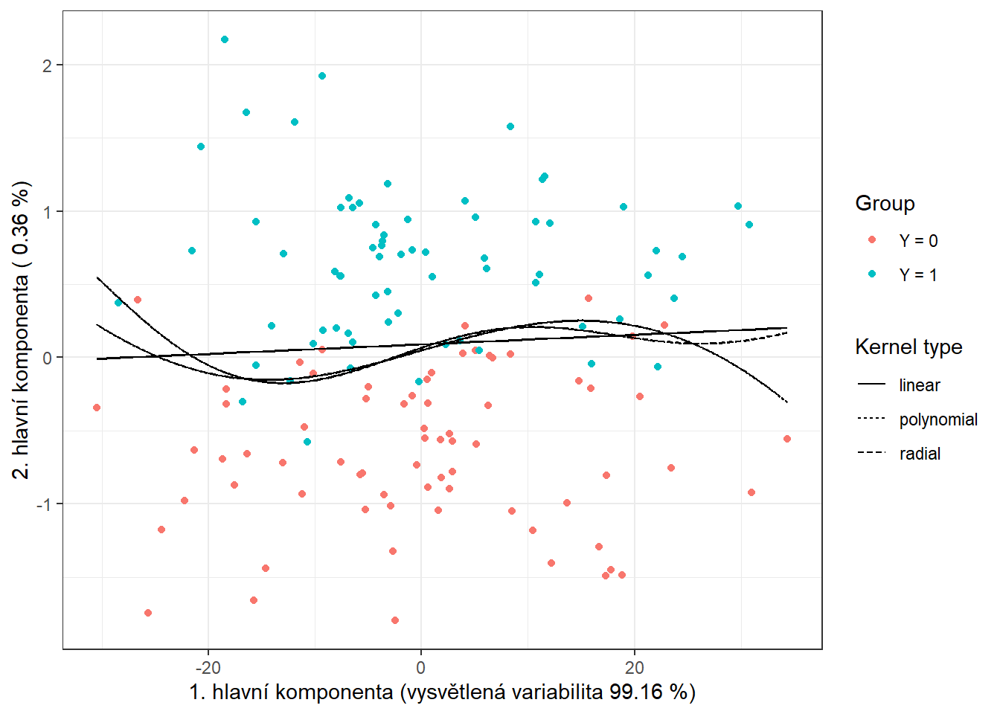
<p class="caption">(\#fig:unnamed-chunk-69)Skóre prvních dvou hlavních komponent, barevně odlišené podle příslušnosti do klasifikační třídy. Černě je vyznačena dělící hranice (přímka, resp. křivky v rovině prvních dvou hlavních komponent) mezi třídami sestrojená pomocí metody SVM.</p>
</div>


```r
Res <- data.frame(model = c('SVM linear - PCA', 
                            'SVM poly - PCA', 
                            'SVM rbf - PCA'), 
                  Err.train = 1 - c(presnost.train.l, presnost.train.p, presnost.train.r),
                  Err.test = 1 - c(presnost.test.l, presnost.test.p, presnost.test.r))

RESULTS <- rbind(RESULTS, Res)
```

#### Bázové koeficienty {#basis-SVM2}

Nakonec použijeme vyjádření funkcí pomocí Fourierovy báze.


```r
# sestrojeni modelu
clf.SVM.l.Bbasis <- svm(Y ~ ., data = data.Bbasis.train,
                        type = 'C-classification',
                        scale = TRUE,
                        kernel = 'linear')

clf.SVM.p.Bbasis <- svm(Y ~ ., data = data.Bbasis.train,
                        type = 'C-classification',
                        scale = TRUE,
                        coef0 = 1,
                        kernel = 'polynomial')

clf.SVM.r.Bbasis <- svm(Y ~ ., data = data.Bbasis.train,
                        type = 'C-classification',
                        scale = TRUE,
                        kernel = 'radial')

# presnost na trenovacich datech
predictions.train.l <- predict(clf.SVM.l.Bbasis, newdata = data.Bbasis.train)
presnost.train.l <- table(Y.train, predictions.train.l) |>
  prop.table() |> diag() |> sum()

predictions.train.p <- predict(clf.SVM.p.Bbasis, newdata = data.Bbasis.train)
presnost.train.p <- table(Y.train, predictions.train.p) |>
  prop.table() |> diag() |> sum()

predictions.train.r <- predict(clf.SVM.r.Bbasis, newdata = data.Bbasis.train)
presnost.train.r <- table(Y.train, predictions.train.r) |>
  prop.table() |> diag() |> sum()
  
# presnost na testovacich datech
predictions.test.l <- predict(clf.SVM.l.Bbasis, newdata = data.Bbasis.test)
presnost.test.l <- table(Y.test, predictions.test.l) |>
  prop.table() |> diag() |> sum()

predictions.test.p <- predict(clf.SVM.p.Bbasis, newdata = data.Bbasis.test)
presnost.test.p <- table(Y.test, predictions.test.p) |>
  prop.table() |> diag() |> sum()

predictions.test.r <- predict(clf.SVM.r.Bbasis, newdata = data.Bbasis.test)
presnost.test.r <- table(Y.test, predictions.test.r) |>
  prop.table() |> diag() |> sum()
```

Chybovost metody SVM aplikované na bázové koeficienty na trénovacích datech je tedy 0 % pro lineární jádro, 0 % pro polynomiální jádro a 0 % pro gaussovské jádro.
Na testovacích datech je potom chybovost metody 13.33 % pro lineární jádro, 21.67 % pro polynomiální jádro a 26.67 % pro radiální jádro.


```r
Res <- data.frame(model = c('SVM linear - Fbasis', 
                            'SVM poly - Fbasis', 
                            'SVM rbf - Fbasis'), 
                  Err.train = 1 - c(presnost.train.l, presnost.train.p, presnost.train.r),
                  Err.test = 1 - c(presnost.test.l, presnost.test.p, presnost.test.r))

RESULTS <- rbind(RESULTS, Res)
```

#### Projekce na Fourierovu bázi {#projection-SVM2}

Další možností, jak použít klasickou metodu SVM pro funkcionální data, je projektovat původní data na nějaký $d$-dimenzionální podprostor našeho Hilbertova prostoru $\mathcal H$, označme jej $V_d$.
Předpokládejme, že tento podprostor $V_d$ má ortonormální bázi $\{\Psi_j\}_{j = 1, \dots, d}$.
Definujeme transformaci $P_{V_d}$ jakožto ortogonální projekci na podprostor $V_d$, tedy můžeme psát

$$
P_{V_d} (x) = \sum_{j = 1}^d \langle x, \Psi_j \rangle \Psi_j.
$$

Nyní můžeme pro klasifikaci použít koeficienty z ortogonální projekce, tedy aplikujeme standardní SVM na vektory $\left( \langle x, \Psi_1 \rangle, \dots, \langle x, \Psi_d \rangle\right)^\top$.
Využitím této transformace jsme tedy definovali nové, tzv.
adaptované jádro, které je složené z ortogonální projekce $P_{V_d}$ a jádrové funkce standardní metody podpůrných vektorů.
Máme tedy (adaptované) jádro $Q(x_i, x_j) = K(P_{V_d}(x_i), P_{V_d}(x_j))$.
Jde tedy o metodu redukce dimenze, kterou můžeme nazvat *filtrace*.

Pro samotnou projekci použijeme v `R` funkci `project.basis()` z knihovny `fda`.
Na jejím vstupu bude matice původních diskrétních (nevyhlazených) dat, hodnoty, ve kterých měříme hodnoty v matici původních dat a bázový objekt, na který chceme data projektovat.
My zvolíme projekci na Fourierovu bázi, protože využití B-splinové báze není pro naše periodická data vhodné.

Dimenzi $d$ volíme buď z nějaké předchozí expertní znalosti, nebo pomocí cross-validace.
V našem případě určíme optimální dimenzi podprostoru $V_d$ pomocí $k$-násobné cross-validace (volíme $k \ll n$ kvůli výpočetní náročnosti metody, často se volí $k = 5$ nebo $k = 10$).


```r
k_cv <- 10 # k-fold CV

# hodnoty pro Fourierovu bazi
rangeval <- range(t)
n_basis_min <- 3
n_basis_max <- 40

dimensions <- n_basis_min:n_basis_max # vsechny dimenze, ktere chceme vyzkouset

# rozdelime trenovaci data na k casti
folds <- createMultiFolds(1:sum(split), k = k_cv, time = 1)

# list se tremi slozkami ... maticemi pro jednotlive jadra -> linear, poly, radial
# prazdna matice, do ktere vlozime jednotlive vysledky
# ve sloupcich budou hodnoty presnosti pro danou cast trenovaci mnoziny
# v radcich budou hodnoty pro danou hodnotu dimenze
CV.results <- list(SVM.l = matrix(NA, nrow = length(dimensions), ncol = k_cv),
                   SVM.p = matrix(NA, nrow = length(dimensions), ncol = k_cv),
                   SVM.r = matrix(NA, nrow = length(dimensions), ncol = k_cv))

for (d in dimensions) {
  # bazovy objekt
  fbasis <- create.fourier.basis(rangeval = rangeval, 
                                 nbasis = d)
  
  # projekce diskretnich dat na Fourierovu bazi o dimenzi d
  Projection <- project.basis(y = XX, # matice diskretnich dat
                              argvals = t, # vektor argumentu
                              basisobj = fbasis) # bazovy objekt
  
  # rozdeleni na trenovaci a testovaci data v ramci CV
  XX.train <- subset(t(Projection), split == TRUE)
  
  for (index_cv in 1:k_cv) {
    # definice testovaci a trenovaci casti pro CV
    fold <- folds[[index_cv]]
    cv_sample <- 1:dim(XX.train)[1] %in% fold
    
    data.projection.train.cv <- as.data.frame(XX.train[cv_sample, ])
    data.projection.train.cv$Y <- factor(Y.train[cv_sample])
    
    data.projection.test.cv <- as.data.frame(XX.train[!cv_sample, ])
    Y.test.cv <- Y.train[!cv_sample]
    data.projection.test.cv$Y <- factor(Y.test.cv)
  
    # sestrojeni modelu
    clf.SVM.l.projection <- svm(Y ~ ., data = data.projection.train.cv,
                            type = 'C-classification',
                            scale = TRUE,
                            kernel = 'linear')
    
    clf.SVM.p.projection <- svm(Y ~ ., data = data.projection.train.cv,
                            type = 'C-classification',
                            scale = TRUE,
                            coef0 = 1,
                            kernel = 'polynomial')
    
    clf.SVM.r.projection <- svm(Y ~ ., data = data.projection.train.cv,
                            type = 'C-classification',
                            scale = TRUE,
                            kernel = 'radial')
      
    # presnost na validacnich datech
    ## linear kernel
    predictions.test.l <- predict(clf.SVM.l.projection,
                                  newdata = data.projection.test.cv)
    presnost.test.l <- table(Y.test.cv, predictions.test.l) |>
      prop.table() |> diag() |> sum()
    ## polynomial kernel
    predictions.test.p <- predict(clf.SVM.p.projection, 
                                  newdata = data.projection.test.cv)
    presnost.test.p <- table(Y.test.cv, predictions.test.p) |>
      prop.table() |> diag() |> sum()
    ## radial kernel
    predictions.test.r <- predict(clf.SVM.r.projection,
                                  newdata = data.projection.test.cv)
    presnost.test.r <- table(Y.test.cv, predictions.test.r) |>
      prop.table() |> diag() |> sum()
    
    # presnosti vlozime na pozice pro dane d a fold
    CV.results$SVM.l[d - min(dimensions) + 1, index_cv] <- presnost.test.l
    CV.results$SVM.p[d - min(dimensions) + 1, index_cv] <- presnost.test.p
    CV.results$SVM.r[d - min(dimensions) + 1, index_cv] <- presnost.test.r
  }
}
  
# spocitame prumerne presnosti pro jednotliva d pres folds
for (n_method in 1:length(CV.results)) {
  CV.results[[n_method]] <- apply(CV.results[[n_method]], 1, mean)
}

d.opt <- c(which.max(CV.results$SVM.l) + n_basis_min - 1, 
           which.max(CV.results$SVM.p) + n_basis_min - 1, 
           which.max(CV.results$SVM.r) + n_basis_min - 1)
presnost.opt.cv <- c(max(CV.results$SVM.l), 
                     max(CV.results$SVM.p),
                     max(CV.results$SVM.r))
data.frame(d_opt = d.opt, ERR = 1 - presnost.opt.cv,
           row.names = c('linear', 'poly', 'radial'))
```

```
##        d_opt        ERR
## linear    34 0.09031136
## poly      40 0.11414835
## radial    18 0.12593407
```

Vidíme, že nejlépe vychází hodnota parametru $d$ jako 34 pro lineární jádro s hodnotou chybovosti spočtenou pomocí 10-násobné CV 0.0903, 40 pro polynomiální jádro s hodnotou chybovosti spočtenou pomocí 10-násobné CV 0.1141 a 18 pro radiální jádro s hodnotou chybovosti 0.1259.
Pro přehlednost si ještě vykresleme průběh validačních chybovostí v závislosti na dimenzi $d$.


```r
CV.results <- data.frame(d = dimensions |> rep(3), 
                         CV = c(CV.results$SVM.l, 
                                CV.results$SVM.p, 
                                CV.results$SVM.r),
                         Kernel = rep(c('linear', 'polynomial', 'radial'), 
                                      each = length(dimensions)) |> factor())
CV.results |> ggplot(aes(x = d, y = 1 - CV, colour = Kernel)) + 
  geom_line(linetype = 'dashed') + 
  geom_point(size = 1.5) + 
  geom_point(data = data.frame(d.opt,
                               presnost.opt.cv),
             aes(x = d.opt, y = 1 - presnost.opt.cv), colour = 'black', size = 2) +
  theme_bw() + 
  labs(x = bquote(paste(d)),
       y = 'Validační chybovost') + 
  theme(legend.position = "bottom") + 
  scale_x_continuous(breaks = dimensions)
```

<div class="figure">
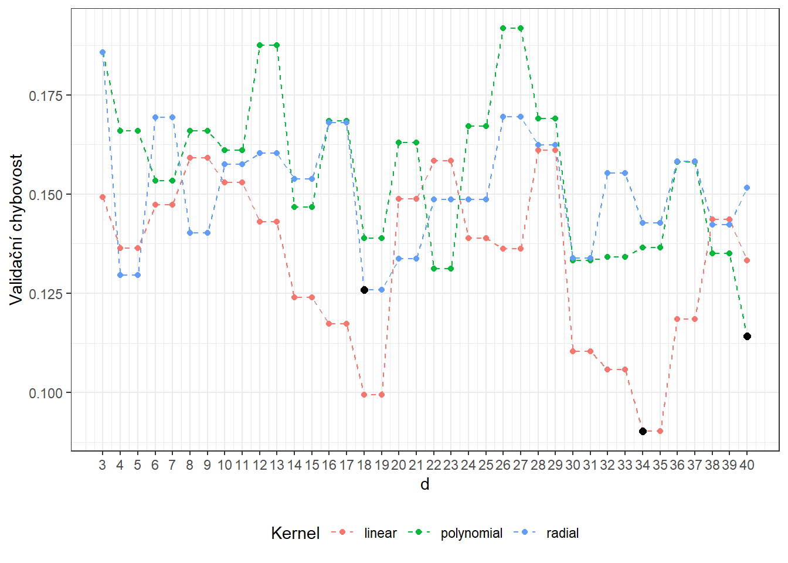
<p class="caption">(\#fig:unnamed-chunk-74)Závislost validační chybovosti na dimenzi podprostoru $V_d$, zvlášť pro všechna tři uvažovaná jádra v metodě SVM. Černými body jsou vyznačeny optimální hodnoty dimenze $V_d$ pro jednotlivé jádrové funkce.</p>
</div>

Nyní již můžeme natrénovat jednotlivé klasifikátory na všech trénovacích datech a podívat se na jejich úspěšnost na testovacích datech.
Pro každou jádrovou funkci volíme dimenzi podprostoru, na který projektujeme, podle výsledků cross-validace.

V proměnné `Projection` máme uloženou matici koeficientů ortogonální projekce, tedy

$$
\texttt{Projection} = \begin{pmatrix}
\langle x_1, \Psi_1 \rangle & \langle x_2, \Psi_1 \rangle & \cdots & \langle x_n, \Psi_1 \rangle\\
\langle x_1, \Psi_2 \rangle & \langle x_2, \Psi_2 \rangle & \cdots & \langle x_n, \Psi_2 \rangle\\
\vdots & \vdots & \ddots & \vdots \\
\langle x_1, \Psi_d \rangle & \langle x_2, \Psi_d \rangle & \dots & \langle x_n, \Psi_d \rangle
\end{pmatrix}_{d \times n}.
$$


```r
# pripravime si datovou tabulku pro ulozeni vysledku
Res <- data.frame(model = c('SVM linear - projection', 
                            'SVM poly - projection', 
                            'SVM rbf - projection'), 
                  Err.train = NA,
                  Err.test = NA)

# projdeme jednotliva jadra
for (kernel_number in 1:3) {
  kernel_type <- c('linear', 'polynomial', 'radial')[kernel_number]
  # bazovy objekt
  bbasis <- create.fourier.basis(rangeval = rangeval, 
                                 nbasis = d.opt[kernel_number])
  
  # projekce diskretnich dat na Fourierovu bazi
  Projection <- project.basis(y = XX, # matice diskretnich dat
                              argvals = t, # vektor argumentu
                              basisobj = bbasis) # bazovy objekt
  
  # rozdeleni na trenovaci a testovaci data
  XX.train <- subset(t(Projection), split == TRUE)
  XX.test <- subset(t(Projection), split == FALSE)
  
  data.projection.train <- as.data.frame(XX.train)
  data.projection.train$Y <- factor(Y.train)
  
  data.projection.test <- as.data.frame(XX.test)
  data.projection.test$Y <- factor(Y.test)
  
  # sestrojeni modelu
  clf.SVM.projection <- svm(Y ~ ., data = data.projection.train,
                            type = 'C-classification',
                            scale = TRUE,
                            coef0 = 1,
                            kernel = kernel_type)
  
  # presnost na trenovacich datech
  predictions.train <- predict(clf.SVM.projection, newdata = data.projection.train)
  presnost.train <- table(Y.train, predictions.train) |>
    prop.table() |> diag() |> sum()
    
  # presnost na testovacich datech
  predictions.test <- predict(clf.SVM.projection, newdata = data.projection.test)
  presnost.test <- table(Y.test, predictions.test) |>
    prop.table() |> diag() |> sum()
  
  # ulozeni vysledku
  Res[kernel_number, c(2, 3)] <- 1 - c(presnost.train, presnost.test)
}
```

Chybovost metody SVM aplikované na bázové koeficienty na trénovacích datech je tedy 0 % pro lineární jádro, 0 % pro polynomiální jádro a 2.86 % pro gaussovské jádro.
Na testovacích datech je potom chybovost metody 18.33 % pro lineární jádro, 15 % pro polynomiální jádro a 15 % pro radiální jádro.


```r
RESULTS <- rbind(RESULTS, Res)
```

#### RKHS + SVM {#RKHS-SVM2} 

V této sekci se podíváme na další možnost, jak využít metodu podpůrných vektorů pro klasifikaci funkcionálních dat.
V tomto případě půjde opět o již nám známý princip, kdy nejprve funkcionální data vyjádříme jakožto nějaké konečně-rozměrné objekty a na tyto objekty následně aplikujeme klasickou metodu SVM.

Nyní však metodu SVM použijeme i pro samotnou reprezentaci funkcionálních dat pomocí určitého konečně-rozměrného objektu.
Jak již název napovídá, půjde o kombinaci dvou konceptů -- jednak metody podpůrných vektorů a druhak prostoru, který se nazývá v anglické literatuře *Reproducing Kernel Hilbert Space*.
Pro tento prostor je klíčovým pojmem *jádro* -- *kernel*.

::: {.definition #kernel name="Jádro"} 
Jádro je taková funkce $K : \mathcal X \times \mathcal X \rightarrow \mathbb R$, že pro každou dvojici $\boldsymbol x, \tilde{\boldsymbol x} \in \mathcal X$ platí 
\begin{equation*}
K(\boldsymbol x, \tilde{\boldsymbol x}) = \big\langle \boldsymbol\phi(\boldsymbol x), \boldsymbol\phi(\tilde{\boldsymbol x}) \big\rangle_{\mathcal H},
\end{equation*}
kde $\boldsymbol\phi : \mathcal X \rightarrow \mathcal H$ je zobrazení z prostoru $\mathcal X$ do prostoru $\mathcal H$.
:::

Aby funkce byla jádrem, musí splňovat určité podmínky.

::: {.lemma #pozdef} 
Nechť $\mathcal X$ je nějaký Hilbertův prostor. Potom symetrická funkce $K : \mathcal X \times \mathcal X \rightarrow \mathbb R$ je jádrem, pokud $\forall k \geq 1, \boldsymbol x_1, \dots, \boldsymbol x_k \in \mathcal X$ a $c_1, \dots, c_k \in \mathbb R$ platí
\begin{equation*}
\sum_{i, j = 1}^k c_ic_j K(\boldsymbol x_i, \boldsymbol x_j) \geq 0.
\end{equation*}
:::

Vlastnost výše uvedená v Lemmatu \@ref(lem:pozdef) se nazývá pozitivní semidefinitnost.
Platí také následující tvrzení.

::: {.theorem} 
Funkce $K: \mathcal X \times \mathcal X \rightarrow \mathbb R$ je jádrem právě tehdy, když existuje Hilbertův prostor $\mathcal H$ a zobrazení $\boldsymbol\phi : \mathcal X \rightarrow \mathcal H$ takové, že
\begin{equation*}
K(\boldsymbol x, \tilde{\boldsymbol x}) = \big\langle \boldsymbol\phi(\boldsymbol x), \boldsymbol\phi(\tilde{\boldsymbol x}) \big\rangle_{\mathcal H} \quad \forall \boldsymbol x, \tilde{\boldsymbol x}\in \mathcal X.
\end{equation*}
:::

Nyní již máme připravenou půdu pro zavedení pojmu *Reproducing Kernel Hilbert Space*.

##### Reproducing Kernel Hilbert Space (RKHS)

Uvažujme Hilbertův prostor $\mathcal H$ jakožto prostor funkcí.
Naším cílem je definovat prostor $\mathcal H$ a zobrazení $\phi$ takové, že $\phi(x) \in \mathcal H, \ \forall x \in \mathcal X$.
Označme $\phi(x) = k_x$.
Každé funkci $x \in \mathcal X$ tedy přiřadíme funkci $x \mapsto k_x \in \mathcal H, k_x := K(x, \cdot), k_x: \mathcal X \rightarrow \mathbb R$.
Potom $\phi: \mathcal X \rightarrow \mathbb R^{\mathcal X}$, můžeme tedy souhrnně napsat

$$
x \in \mathcal X \mapsto \phi(x) = k_x = K(x, \cdot) \in \mathcal H,
$$

Bod (funkce) $x \in \mathcal X$ je zobrazen na funkci $k_x: \mathcal X \rightarrow \mathbb R, k_x(y) = K(x, y)$.

Uvažujme množinu všech obrazů $\{k_x | x \in \mathcal X\}$ a definujme lineární obal této množiny vektorů jakožto

$$
\mathcal G := \text{span}\{k_x | x \in \mathcal X\} = \left\{\sum_{i = 1}^r\alpha_i K(x_i, \cdot)\ \Big|\ \alpha_i \in \mathbb R, r \in \mathbb N, x_i \in \mathcal X\right\}.
$$

Potom skalární součin

$$
\langle k_x, k_y \rangle = \langle K(x, \cdot), K(y, \cdot) \rangle = K(x, y),\quad x, y \in \mathcal X
$$

a obecně

$$
f, g \in \mathcal G, f = \sum_i \alpha_i K(x_i, \cdot), g = \sum_j \beta_j K(y_j, \cdot), \\
\langle f, g \rangle_{\mathcal G} = \Big\langle \sum_i \alpha_i K(x_i, \cdot), \sum_j \beta_j K(y_j, \cdot) \Big\rangle = \sum_i\sum_j\alpha_i\beta_j \langle K(x_i, \cdot), K(y_j, \cdot) \rangle = \sum_i\sum_j\alpha_i\beta_j K(x_i, y_j).
$$

Prostor $\mathcal H := \overline{\mathcal G}$, který je zúplněním prostoru $\mathcal G$, nazýváme *Reproducing Kernel Hilbert Space* (RKHS).
Významnou vlastností tohoto prostoru je

$$
K(x, y) = \Big\langle \phi(x), \phi(y) \Big\rangle_{\mathcal H}.
$$

*Poznámka:* Jméno Reproducing vychází z následujícího faktu.
Mějme libovolnou funkci $f = \sum_i \alpha_i K(x_i, \cdot)$.
Potom

```{=tex}
\begin{align*}
\langle K(x, \cdot), f\rangle &= \langle K(x, \cdot), \sum_i \alpha_i K(x_i, \cdot) \rangle =\\
&= \sum_i \alpha_i \langle K(x, \cdot), K(x_i, \cdot) \rangle = \sum_i \alpha_i K(x_i, x) = \\
&= f(x)
\end{align*}
```

*Vlastnosti:*

-   nechť $\mathcal H$ je Hilbertův prostor funkcí $g: \mathcal X \rightarrow \mathbb R$.
    Potom $\mathcal H$ je RKHS $\Leftrightarrow$ všechny funkcionály (evaluation functionals) $\delta_x: \mathcal H \rightarrow \mathbb R, g \mapsto g(x)$ jsou spojité,

-   pro dané jádro $K$ existuje právě jeden prostor RKHS (až na isometrickou izomofrii),

-   pro daný RKHS je jádro $K$ určeno jednoznačně,

-   funkce v RKHS jsou bodově korektně definovány,

-   RKHS je obecně nekonečně-rozměrný vektorový prostor, v praxi však pracujeme pouze s jeho konečně-rozměrným podprostorem.

Na konec této sekce si uveďme jedno důležité tvrzení.

::: {.theorem #representer name="The representer theorem"} 
Nechť $K$ je jádro a $\mathcal H$ je příslušný RKHS s normou a skalárním součinem $\|\cdot\|_{\mathcal H}$ a $\langle \cdot, \cdot \rangle_{\mathcal H}$. Předpokládejme, že chceme zjistit lineární funkci $f: \mathcal H \rightarrow \mathbb R$ na Hilbertově prostoru $\mathcal H$ definovaného jádrem $K$. Funkce $f$ má tvar $f(x) = \langle \omega, x \rangle_{\mathcal H}$ pro nějaké $\omega \in \mathcal H$. Uvažujme regularizovaný minimalizační problém 
\begin{equation}
\min_{\omega \in \mathcal H} R_n(\omega) + \lambda \Omega(\|\omega\|_{\mathcal H}),
(\#eq:repr-thm)
\end{equation}
kde $\Omega: [0, \infty) \rightarrow \mathbb R$ je striktně monotonně rostoucí funkce (regularizer), $R_n(\cdot)$ je empirická ztráta (empirical risk) klasifikátoru vzhledem ke ztrátové funkci $\ell$. Potom optimalizační úloha \@ref(eq:repr-thm) má vždy optimální řešení a to je tvaru 
\begin{equation}
\omega^* = \sum_{i = 1}^n \alpha_i K(x_i, \cdot),
(\#eq:optimal-thm)
\end{equation}
kde $(x_i, y_i)_{i = 1, 2, \dots, n} \in \mathcal X \times \mathcal Y$ je množina trénovacích hodnot.
:::

$\mathcal H$ je obecně nekočně-rozměrný prostor, ale pro konečný datový soubor velikosti $n$ má $\mathcal H$ dimenzi nejvýše $n$.
Každý $n$-dimenzionální podprostor Hilbertova prostoru je navíc izometrický s $\mathbb R^n$, tudíž můžeme předpokládat, že zobrazení (feature map) zobrazuje právě do $\mathbb R^n$.

Jádro $K$ je *univerzální* pokud RKHS $\mathcal H$ je hustá množina v $\mathcal C(\mathcal X)$ (množina spojitých funkcí).
Navíc platí následující poznatky:

-   univerzální jádra jsou dobrá pro aproximaci,
-   Gaussovo jádro s pevnou hodnotou $\sigma$ je univerzální,
-   univerzalita je nutnou podmínkou pro konzistenci.

##### Klasifikace pomocí RKHS

Základní myšlenkou je projekce původních dat na podprostor prostoru RKHS, označme jej $\mathcal H_K$ (index ${}_K$ odkazuje na fakt, že tento prostor je definován jádrem $K$).
Cílem je tedy transformovat křivku (pozorovaný objekt, funkce) na bod v RKHS.
Označme $\{\hat c_1, \dots, \hat c_n\}$ množinu pozorovaných křivek, přičemž každá křivka $\hat c_l$ je definována daty $\{(\boldsymbol x_i, \boldsymbol y_{il}) \in \mathcal X \times \mathcal Y\}_{i = 1}^m$, kde $\mathcal X$ je prostor vstupních proměnných a nejčastěji $\mathcal Y = \mathbb R$.
Předpokládejme, že pro každou funkci $\hat c_l$ existuje spojitá funkce $c_l:\mathcal X \rightarrow \mathcal Y, \mathbb E[y_l|\boldsymbol x] = c_l(\boldsymbol x)$.
Předpokládejme také, že $\boldsymbol x_i$ jsou společné pro všechny křivky.

Muñoz a González ve svém článku[^1] navrhují následující postup.
Křivku $c_l^*$ můžeme napsat ve tvaru

[^1]: Muñoz, A.
    and González, J.
    (2010) *Representing functional data using support vector machines*, Pattern Recognition Letters, 31(6), pp. 511--516.
    [doi:10.1016/j.patrec.2009.07.014](https://www.sciencedirect.com/science/article/pii/S0167865509001913).

$$
c_l^*(\boldsymbol x) = \sum_{i = 1}^m \alpha_{il} K(\boldsymbol x_i, \boldsymbol x), \quad \forall \boldsymbol x \in \mathcal X,
$$

kde $\alpha_{il} \in \mathbb R$.
Tyto koeficienty získáme v praxi řešením optimalizačního problému $$
\text{argmin}_{c \in \mathcal H_K} \frac{1}{m} \sum_{i = 1}^m \big[|c(\boldsymbol x_i) - y_i| - \varepsilon\big]_+ + \gamma \|c\|_{K}^2, \gamma > 0, \varepsilon \geq 0,
$$ tedy právě například pomocí metody SVM.
Díky známé vlastnosti této metody pak bude mnoho koeficientů $\alpha_{il} = 0$.
Minimalizací výše uvedeného výrazu získáme funkce $c_1^*, \dots, c_n^*$ odpovídající původním křivkám $\hat c_1, \dots, \hat c_n$.
Metoda SVM tedy dává smysluplnou reprezentaci původních křivek pomocí vektoru koeficientů $\boldsymbol \alpha_l = (\alpha_{1l}, \dots, \alpha_{ml})^\top$ pro $\hat c_l$.
Tato reprezentace je však velmi nestabilní, neboť i při malé změně původních hodnot může dojít ke změně v množině podpůrných vektorů pro danou funkci, a tedy dojde k výrazné změně celé reprezentace této křivky (reprezentace není spojitá ve vstupních hodnotách).
Definujeme proto novou reprezentaci původních křivek, která již nebude trpět tímto nedostatkem.

::: {.theorem #MaG name="Muñoz-González"} 
Nechť $c$ je funkce, jejíž pozorovaná verze je $\hat c = \{(\boldsymbol x_i, y_{i}) \in \mathcal X \times \mathcal Y\}_{i = 1}^m$ a $K$ je jádro s vlastními funkcemi $\{\phi_1, \dots, \phi_d, \dots\}$ (báze $\mathcal H_K$). Potom funkce $c^*(\boldsymbol x)$ může být vyjádřena ve tvaru
\begin{equation*}
c^*(\boldsymbol x) = \sum_{j = 1}^d \lambda_j^* \phi_j(\boldsymbol x),
\end{equation*}
kde $\lambda_j^*$ jsou váhy projekce $c^*(\boldsymbol x)$ na prostor funkcí generovaný vlastními funkcemi jádra $K$ a $d$ je dimenze prostoru $\mathcal H$. V praxi, kdy máme k dispozici pouze konečně mnoho pozorování, $\lambda_j^*$ mohou být odhadnuty pomocí
\begin{equation*}
\hat\lambda_j^* = \hat\lambda_j \sum_{i = 1}^m \alpha_i\hat\phi_{ji}, \quad j = 1, 2, \dots, \hat d,
\end{equation*}
kde $\hat\lambda_j$ je $j$-té vlastní číslo příslušné $j$-tému vlastnímu vektoru $\hat\phi_j$ matice $K_S = \big(K(\boldsymbol x_i, \boldsymbol x_j)\big)_{i, j = 1}^m, \hat d = \text{rank}(K_S)$ a $\alpha_i$ jsou řešením optimalizačního problému.
:::

##### Implementace metody v `R`

Z poslední části Tvrzení \@ref(thm:MaG) vyplývá, jak máme spočítat v praxi reprezentace křivek.
Budeme pracovat s diskretizovanými daty po vyhlazení křivek.
Nejprve si definujeme jádro pro prostor RKHS.
Využijeme Gaussovské jádro s parametrem $\gamma$.
Hodnota tohoto hyperparametru výrazně ovlivňuje chování a tedy i úspěšnost metody, proto jeho volbě musíme věnovat zvláštní pozornost (volíme pomocí cross-validace).

###### Gaussovké jádro


```r
# odstranime posledni sloupec, ve kterem jsou hodnoty Y
data.RKHS <- grid.data[, -dim(grid.data)[2]] |> t()
# pridame i testovaci data
data.RKHS <- cbind(data.RKHS, grid.data.test[, -dim(grid.data.test)[2]] |> t())

# jadro a jadrova matice ... Gaussovske s parametrem gamma
Gauss.kernel <- function(x, y, gamma) {
  return(exp(-gamma * norm(c(x - y) |> t(), type = 'F')))
}

Kernel.RKHS <- function(x, gamma) {
  K <- matrix(NA, ncol = length(x), nrow = length(x))
  for(i in 1:nrow(K)) {
    for(j in 1:ncol(K)) {
      K[i, j] <- Gauss.kernel(x = x[i], y = x[j], gamma = gamma)
    }
  }
  return(K)
}
```

Spočítejme nyní matici $K_S$ a její vlastní čísla a příslušné vlastní vektory.


```r
# spocitame matici K
gamma <- 0.1 # pevna hodnota gamma, optimalni urcime pomoci CV
K <- Kernel.RKHS(t.seq, gamma = gamma)

# urcime vlastni cisla a vektory
Eig <- eigen(K)
eig.vals <- Eig$values
eig.vectors <- Eig$vectors
```

K výpočtu koeficientů v reprezentaci křivek, tedy výpočtu vektorů $\hat{\boldsymbol \lambda}_l^* = \left( \hat\lambda_{1l}^*, \dots, \hat\lambda_{\hat dl}^*\right)^\top, l = 1, 2, \dots, n$, potřebujeme ještě koeficienty z SVM.
Narozdíl od klasifikačního problému nyní řešíme problém regrese, neboť se snažíme vyjádřit naše pozorované křivky v nějaké (námi zvolené pomocí jádra $K$) bázi.
Proto využijeme metodu *Support Vector Regression*, z níž následně získáme koeficienty $\alpha_{il}$.


```r
# urceni koeficientu alpha z SVM
alpha.RKHS <- matrix(0, nrow = dim(data.RKHS)[1],
                     ncol = dim(data.RKHS)[2]) # prazdny objekt

# model
for(i in 1:dim(data.RKHS)[2]) {
  df.svm <- data.frame(x = t.seq,
                       y = data.RKHS[, i])
  svm.RKHS <- svm(y ~ x, data = df.svm, 
                  kernel = 'radial',
                  type = 'eps-regression',
                  epsilon = 0.1,
                  gamma = gamma)
  # urceni alpha
  alpha.RKHS[svm.RKHS$index, i] <- svm.RKHS$coefs # nahrazeni nul koeficienty
}
```

Nyní již můžeme spočítat reprezentace jednotlivých křivek.
Nejprve zvolme za $\hat d$ celou dimenzi, tedy $\hat d = m ={}$ 101, následně určíme optimální $\hat d$ pomocí cross-validace.


```r
# d
d.RKHS <- dim(alpha.RKHS)[1]

# urceni vektoru lambda
Lambda.RKHS <- matrix(NA, 
                      ncol = dim(data.RKHS)[2], 
                      nrow = d.RKHS) # vytvoreni prazdneho objektu

# vypocet reprezentace
for(l in 1:dim(data.RKHS)[2]) {
  Lambda.RKHS[, l] <- (t(eig.vectors[, 1:d.RKHS]) %*% alpha.RKHS[, l]) * eig.vals[1:d.RKHS]
}
```

Nyní máme v matici `Lambda.RKHS` uloženy ve sloupcích vektory $\hat{\boldsymbol \lambda}_l^*, l = 1, 2, \dots, n$ pro každou křivku.
Tyto vektory nyní využijeme jakožto reprezentaci daných křivek a klasifikujeme data podle této diskretizace.


```r
# rozdeleni na trenovaci a testovaci data
XX.train <- Lambda.RKHS[, 1:dim(grid.data)[1]]
XX.test <- Lambda.RKHS[, (dim(grid.data)[1] + 1):dim(Lambda.RKHS)[2]]

# pripravime si datovou tabulku pro ulozeni vysledku
Res <- data.frame(model = c('SVM linear - RKHS', 
                            'SVM poly - RKHS', 
                            'SVM rbf - RKHS'), 
                  Err.train = NA,
                  Err.test = NA)

# projdeme jednotliva jadra
for (kernel_number in 1:3) {
  kernel_type <- c('linear', 'polynomial', 'radial')[kernel_number]

  data.RKHS.train <- as.data.frame(t(XX.train))
  data.RKHS.train$Y <- factor(Y.train)
  
  data.RKHS.test <- as.data.frame(t(XX.test))
  data.RKHS.test$Y <- factor(Y.test)
  
  # sestrojeni modelu
  clf.SVM.RKHS <- svm(Y ~ ., data = data.RKHS.train,
                      type = 'C-classification',
                      scale = TRUE,
                      coef0 = 1,
                      kernel = kernel_type)
  
  # presnost na trenovacich datech
  predictions.train <- predict(clf.SVM.RKHS, newdata = data.RKHS.train)
  presnost.train <- table(Y.train, predictions.train) |>
    prop.table() |> diag() |> sum()
    
  # presnost na testovacich datech
  predictions.test <- predict(clf.SVM.RKHS, newdata = data.RKHS.test)
  presnost.test <- table(Y.test, predictions.test) |>
    prop.table() |> diag() |> sum()
  
  # ulozeni vysledku
  Res[kernel_number, c(2, 3)] <- 1 - c(presnost.train, presnost.test)
}
```


Table: (\#tab:unnamed-chunk-82)Souhrnné výsledky metody SVM v kombinaci s RKHS na simulovaných datech. $\widehat{Err}_{train}$ značí odhad trénovací chybovosti a $\widehat{Err}_{test}$ testovací chybovosti.

Model                                $\widehat{Err}_{train}\quad\quad\quad\quad\quad$         $\widehat{Err}_{test}\quad\quad\quad\quad\quad$       
----------------------------------  -------------------------------------------------------  -------------------------------------------------------
SVM linear - RKHS                                                                    0.0571                                                     0.25
SVM poly - RKHS                                                                      0.0357                                                     0.30
SVM rbf - RKHS                                                                       0.0857                                                     0.30

Vidíme, že model u všech třech jader velmi dobře klasifikuje trénovací data, zatímco jeho úspěšnost na testovacích datech není vůbec dobrá.
Je zřejmé, že došlo k overfittingu, proto využijeme cross-validaci, abychom určili optimální hodnoty $\gamma$ a $d$.


```r
# rozdelime trenovaci data na k casti
folds <- createMultiFolds(1:sum(split), k = k_cv, time = 1)
# odstranime posledni sloupec, ve kterem jsou hodnoty Y
data.RKHS <- grid.data[, -dim(grid.data)[2]] |> t()

# hodnoty hyperparametru, ktere budeme prochazet
dimensions <- 3:40 # rozumny rozsah hodnot d
gamma.cv <- 10^seq(-2, 1, length = 15)

# list se tremi slozkami ... array pro jednotlive jadra -> linear, poly, radial
# prazdna matice, do ktere vlozime jednotlive vysledky
# ve sloupcich budou hodnoty presnosti pro dane
# v radcich budou hodnoty pro danou gamma a vrstvy odpovidaji folds
dim.names <- list(gamma = paste0('gamma:', round(gamma.cv, 3)),
                  d = paste0('d:', dimensions),
                  CV = paste0('cv:', 1:k_cv))

CV.results <- list(
  SVM.l = array(NA, dim = c(length(gamma.cv), length(dimensions), k_cv),
                dimnames = dim.names),
  SVM.p = array(NA, dim = c(length(gamma.cv), length(dimensions), k_cv),
                dimnames = dim.names),
  SVM.r = array(NA, dim = c(length(gamma.cv), length(dimensions), k_cv),
                dimnames = dim.names))
```


```r
# samotna CV
for (gamma in gamma.cv) {
  K <- Kernel.RKHS(t.seq, gamma = gamma)
  Eig <- eigen(K)
  eig.vals <- Eig$values
  eig.vectors <- Eig$vectors
  alpha.RKHS <- matrix(0, nrow = dim(data.RKHS)[1], ncol = dim(data.RKHS)[2]) 
  
  # model
  for(i in 1:dim(data.RKHS)[2]) {
    df.svm <- data.frame(x = t.seq,
                         y = data.RKHS[, i])
    svm.RKHS <- svm(y ~ x, data = df.svm, 
                    kernel = 'radial',
                    type = 'eps-regression',
                    epsilon = 0.1,
                    gamma = gamma)
    alpha.RKHS[svm.RKHS$index, i] <- svm.RKHS$coefs 
  }
  
  # projdeme dimenze
  for(d.RKHS in dimensions) {
    Lambda.RKHS <- matrix(NA, 
                          ncol = dim(data.RKHS)[2], 
                          nrow = d.RKHS) 
    # vypocet reprezentace
    for(l in 1:dim(data.RKHS)[2]) {
      Lambda.RKHS[, l] <- (t(eig.vectors[, 1:d.RKHS]) %*% 
                             alpha.RKHS[, l]) * eig.vals[1:d.RKHS]
    }
    # projdeme folds
    for (index_cv in 1:k_cv) {
      # definice testovaci a trenovaci casti pro CV
      fold <- folds[[index_cv]]
      # rozdeleni na trenovaci a validacni data
      XX.train <- Lambda.RKHS[, fold]
      XX.test <- Lambda.RKHS[, !(1:dim(Lambda.RKHS)[2] %in% fold)]
      # pripravime si datovou tabulku pro ulozeni vysledku
      Res <- data.frame(model = c('SVM linear - RKHS', 
                                  'SVM poly - RKHS', 
                                  'SVM rbf - RKHS'), 
                        Err.test = NA)
      # projdeme jednotliva jadra
      for (kernel_number in 1:3) {
        kernel_type <- c('linear', 'polynomial', 'radial')[kernel_number]
      
        data.RKHS.train <- as.data.frame(t(XX.train))
        data.RKHS.train$Y <- factor(Y.train[fold])
        
        data.RKHS.test <- as.data.frame(t(XX.test))
        data.RKHS.test$Y <- factor(Y.train[!(1:dim(Lambda.RKHS)[2] %in% fold)])
        
        # sestrojeni modelu
        clf.SVM.RKHS <- svm(Y ~ ., data = data.RKHS.train,
                            type = 'C-classification',
                            scale = TRUE,
                            coef0 = 1,
                            kernel = kernel_type)
        
        # presnost na validacnich datech
        predictions.test <- predict(clf.SVM.RKHS, newdata = data.RKHS.test)
        presnost.test <- table(data.RKHS.test$Y, predictions.test) |>
          prop.table() |> diag() |> sum()
        
        # ulozeni vysledku
        Res[kernel_number, 2] <- 1 - presnost.test
      }
      # presnosti vlozime na pozice pro dane d, gamma a fold
      CV.results$SVM.l[paste0('gamma:', round(gamma, 3)), 
                       d.RKHS - min(dimensions) + 1, 
                       index_cv] <- Res[1, 2]
      CV.results$SVM.p[paste0('gamma:', round(gamma, 3)), 
                       d.RKHS - min(dimensions) + 1, 
                       index_cv] <- Res[2, 2]
      CV.results$SVM.r[paste0('gamma:', round(gamma, 3)), 
                       d.RKHS - min(dimensions) + 1, 
                       index_cv] <- Res[3, 2]
    }
  }
}
```


```r
# spocitame prumerne presnosti pro jednotliva d pres folds
for (n_method in 1:length(CV.results)) {
  CV.results[[n_method]] <- apply(CV.results[[n_method]], c(1, 2), mean)
}

gamma.opt <- c(which.min(CV.results$SVM.l) %% length(gamma.cv), 
               which.min(CV.results$SVM.p) %% length(gamma.cv), 
               which.min(CV.results$SVM.r) %% length(gamma.cv))
gamma.opt[gamma.opt == 0] <- length(gamma.cv)
gamma.opt <- gamma.cv[gamma.opt]

d.opt <- c(which.min(t(CV.results$SVM.l)) %% length(dimensions), 
           which.min(t(CV.results$SVM.p)) %% length(dimensions), 
           which.min(t(CV.results$SVM.r)) %% length(dimensions))
d.opt[d.opt == 0] <- length(dimensions)
d.opt <- dimensions[d.opt]

err.opt.cv <- c(min(CV.results$SVM.l), 
                     min(CV.results$SVM.p),
                     min(CV.results$SVM.r))
df.RKHS.res <- data.frame(d = d.opt, gamma = gamma.opt, CV = err.opt.cv,
           Kernel = c('linear', 'polynomial', 'radial') |> factor(),
           row.names = c('linear', 'poly', 'radial'))
```


Table: (\#tab:unnamed-chunk-85)Souhrnné výsledky cross-validace pro metodu SVM v kombinaci s RKHS na simulovaných datech. $\widehat{Err}_{train}$ značí odhad trénovací chybovosti a $\widehat{Err}_{test}$ testovací chybovosti.

          $\quad\quad\quad\quad\quad d$   $\quad\quad\quad\quad\quad\gamma$   $\widehat{Err}_{cross\_validace}$  Model                             
-------  ------------------------------  ----------------------------------  ----------------------------------  ----------------------------------
linear                               29                              0.5179                              0.1219  linear                            
poly                                 40                              0.0439                              0.1423  polynomial                        
radial                                8                              0.8483                              0.1276  radial                            

Vidíme, že nejlépe vychází hodnota parametru $d={}$ 29 a $\gamma={}$ 0.5179 pro lineární jádro s hodnotou chybovosti spočtenou pomocí 10-násobné CV 0.1219, $d={}$ 40 a $\gamma={}$ 0.0439 pro polynomiální jádro s hodnotou chybovosti spočtenou pomocí 10-násobné CV 0.1423 a $d={}$ 8 a $\gamma={}$ 0.8483 pro radiální jádro s hodnotou chybovosti 0.1276.
Pro zajímavost si ještě vykresleme funkci validační chybovosti v závislosti na dimenzi $d$ a hodnotě hyperparametru $\gamma$.


```r
CV.results.plot <- data.frame(d = rep(dimensions |> rep(3), each = length(gamma.cv)), 
                              gamma = rep(gamma.cv, length(dimensions)) |> rep(3),
                               CV = c(c(CV.results$SVM.l), 
                                      c(CV.results$SVM.p), 
                                      c(CV.results$SVM.r)),
                               Kernel = rep(c('linear', 'polynomial', 'radial'), 
                                            each = length(dimensions) * 
                                              length(gamma.cv)) |> factor())
CV.results.plot |> 
  ggplot(aes(x = d, y = gamma, z = CV)) + 
  geom_contour_filled() +
  scale_y_continuous(trans='log10') +
  facet_wrap(~Kernel) +
  theme_bw() + 
  labs(x = expression(d),
       y = expression(gamma)) + 
  scale_fill_brewer(palette = "Spectral") + 
  geom_point(data = df.RKHS.res, aes(x = d, y = gamma),
             size = 5, pch = '+')
```

<div class="figure">
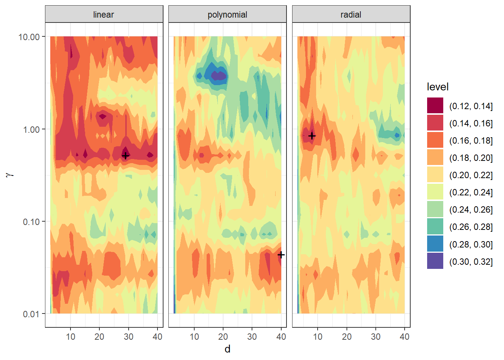
<p class="caption">(\#fig:unnamed-chunk-86)Závislost validační chybovosti na volbě hyperparametrů $d$ a $\gamma$, zvlášť pro všechna tři uvažovaná jádra v metodě SVM.</p>
</div>

Jelikož již máme nalezeny optimální hodnoty hyperparametrů, můžeme zkounstruovat finální modely a určit jejich úspěšnost klasifikace na testovacích datech.


```r
# odstranime posledni sloupec, ve kterem jsou hodnoty Y
data.RKHS <- grid.data[, -dim(grid.data)[2]] |> t()
# pridame i testovaci data
data.RKHS <- cbind(data.RKHS, grid.data.test[, -dim(grid.data.test)[2]] |> t())
```


```r
# pripravime si datovou tabulku pro ulozeni vysledku
Res <- data.frame(model = c('SVM linear - RKHS - radial', 
                            'SVM poly - RKHS - radial', 
                            'SVM rbf - RKHS - radial'), 
                  Err.train = NA,
                  Err.test = NA)

# projdeme jednotliva jadra
for (kernel_number in 1:3) {
  # spocitame matici K
  gamma <- gamma.opt[kernel_number] # hodnota gamma pomoci CV
  K <- Kernel.RKHS(t.seq, gamma = gamma)
  
  # urcime vlastni cisla a vektory
  Eig <- eigen(K)
  eig.vals <- Eig$values
  eig.vectors <- Eig$vectors
  # urceni koeficientu alpha z SVM
  alpha.RKHS <- matrix(0, nrow = dim(data.RKHS)[1],
                       ncol = dim(data.RKHS)[2]) # prazdny objekt
  
  # model
  for(i in 1:dim(data.RKHS)[2]) {
    df.svm <- data.frame(x = t.seq,
                         y = data.RKHS[, i])
    svm.RKHS <- svm(y ~ x, data = df.svm, 
                    kernel = 'radial',
                    type = 'eps-regression',
                    epsilon = 0.1,
                    gamma = gamma)
    # urceni alpha
    alpha.RKHS[svm.RKHS$index, i] <- svm.RKHS$coefs # nahrazeni nul koeficienty
  }
  # d
  d.RKHS <- d.opt[kernel_number]
  
  # urceni vektoru lambda
  Lambda.RKHS <- matrix(NA, 
                        ncol = dim(data.RKHS)[2], 
                        nrow = d.RKHS) # vytvoreni prazdneho objektu
  
  # vypocet reprezentace
  for(l in 1:dim(data.RKHS)[2]) {
    Lambda.RKHS[, l] <- (t(eig.vectors[, 1:d.RKHS]) %*% alpha.RKHS[, l]) * eig.vals[1:d.RKHS]
  }
  
  # rozdeleni na trenovaci a testovaci data
  XX.train <- Lambda.RKHS[, 1:dim(grid.data)[1]]
  XX.test <- Lambda.RKHS[, (dim(grid.data)[1] + 1):dim(Lambda.RKHS)[2]]

  kernel_type <- c('linear', 'polynomial', 'radial')[kernel_number]

  data.RKHS.train <- as.data.frame(t(XX.train))
  data.RKHS.train$Y <- factor(Y.train)
  
  data.RKHS.test <- as.data.frame(t(XX.test))
  data.RKHS.test$Y <- factor(Y.test)
  
  # sestrojeni modelu
  clf.SVM.RKHS <- svm(Y ~ ., data = data.RKHS.train,
                      type = 'C-classification',
                      scale = TRUE,
                      coef0 = 1,
                      kernel = kernel_type)
  
  # presnost na trenovacich datech
  predictions.train <- predict(clf.SVM.RKHS, newdata = data.RKHS.train)
  presnost.train <- table(Y.train, predictions.train) |>
    prop.table() |> diag() |> sum()
    
  # presnost na testovacich datech
  predictions.test <- predict(clf.SVM.RKHS, newdata = data.RKHS.test)
  presnost.test <- table(Y.test, predictions.test) |>
    prop.table() |> diag() |> sum()
  
  # ulozeni vysledku
  Res[kernel_number, c(2, 3)] <- 1 - c(presnost.train, presnost.test)
}
```


Table: (\#tab:unnamed-chunk-89)Souhrnné výsledky metody SVM v kombinaci s RKHS na simulovaných datech. $\widehat{Err}_{train}$ značí odhad trénovací chybovosti a $\widehat{Err}_{test}$ testovací chybovosti.

Model                                $\widehat{Err}_{train}\quad\quad\quad\quad\quad$         $\widehat{Err}_{test}\quad\quad\quad\quad\quad$       
----------------------------------  -------------------------------------------------------  -------------------------------------------------------
SVM linear - RKHS - radial                                                           0.0571                                                   0.1667
SVM poly - RKHS - radial                                                             0.0357                                                   0.2500
SVM rbf - RKHS - radial                                                              0.1000                                                   0.1167

Chybovost metody SVM v kombinaci s projekcí na Reproducing Kernel Hilbert Space je tedy na trénovacích datech rovna 5.71 % pro lineární jádro, 3.57 % pro polynomiální jádro a 10 % pro gaussovské jádro.
Na testovacích datech je potom chybovost metody 16.67 % pro lineární jádro, 25 % pro polynomiální jádro a 11.67 % pro radiální jádro.


```r
RESULTS <- rbind(RESULTS, Res)
```

###### Polynomiální jádro


```r
# odstranime posledni sloupec, ve kterem jsou hodnoty Y
data.RKHS <- grid.data[, -dim(grid.data)[2]] |> t()
# pridame i testovaci data
data.RKHS <- cbind(data.RKHS, grid.data.test[, -dim(grid.data.test)[2]] |> t())

# jadro a jadrova matice ... polynomialni s parametrem p
Poly.kernel <- function(x, y, p) {
  return((1 + x * y)^p)
}

Kernel.RKHS <- function(x, p) {
  K <- matrix(NA, ncol = length(x), nrow = length(x))
  for(i in 1:nrow(K)) {
    for(j in 1:ncol(K)) {
      K[i, j] <- Poly.kernel(x = x[i], y = x[j], p)
    }
  }
  return(K)
}
```


```r
# rozdelime trenovaci data na k casti
folds <- createMultiFolds(1:sum(split), k = k_cv, time = 1)
# odstranime posledni sloupec, ve kterem jsou hodnoty Y
data.RKHS <- grid.data[, -dim(grid.data)[2]] |> t()

# hodnoty hyperparametru, ktere budeme prochazet
dimensions <- 3:40 # rozumny rozsah hodnot d
poly.cv <- 2:5

# list se tremi slozkami ... array pro jednotlive jadra -> linear, poly, radial
# prazdna matice, do ktere vlozime jednotlive vysledky
# ve sloupcich budou hodnoty presnosti pro dane
# v radcich budou hodnoty pro dane p a vrstvy odpovidaji folds
dim.names <- list(p = paste0('p:', poly.cv),
                  d = paste0('d:', dimensions),
                  CV = paste0('cv:', 1:k_cv))

CV.results <- list(
  SVM.l = array(NA, dim = c(length(poly.cv), length(dimensions), k_cv),
                dimnames = dim.names),
  SVM.p = array(NA, dim = c(length(poly.cv), length(dimensions), k_cv),
                dimnames = dim.names),
  SVM.r = array(NA, dim = c(length(poly.cv), length(dimensions), k_cv),
                dimnames = dim.names))
```


```r
# samotna CV
for (p in poly.cv) {
  K <- Kernel.RKHS(t.seq, p = p)
  Eig <- eigen(K)
  eig.vals <- Eig$values
  eig.vectors <- Eig$vectors
  alpha.RKHS <- matrix(0, nrow = dim(data.RKHS)[1], ncol = dim(data.RKHS)[2]) 
  
  # model
  for(i in 1:dim(data.RKHS)[2]) {
    df.svm <- data.frame(x = t.seq,
                         y = data.RKHS[, i])
    svm.RKHS <- svm(y ~ x, data = df.svm, 
                    kernel = 'polynomial',
                    type = 'eps-regression',
                    epsilon = 0.1,
                    coef0 = 1,
                    degree = p)
    alpha.RKHS[svm.RKHS$index, i] <- svm.RKHS$coefs 
  }
  
  # projdeme dimenze
  for(d.RKHS in dimensions) {
    Lambda.RKHS <- matrix(NA, 
                          ncol = dim(data.RKHS)[2], 
                          nrow = d.RKHS) 
    # vypocet reprezentace
    for(l in 1:dim(data.RKHS)[2]) {
      Lambda.RKHS[, l] <- (t(eig.vectors[, 1:d.RKHS]) %*% 
                             alpha.RKHS[, l]) * eig.vals[1:d.RKHS]
    }
    # projdeme folds
    for (index_cv in 1:k_cv) {
      # definice testovaci a trenovaci casti pro CV
      fold <- folds[[index_cv]]
      # rozdeleni na trenovaci a validacni data
      XX.train <- Lambda.RKHS[, fold]
      XX.test <- Lambda.RKHS[, !(1:dim(Lambda.RKHS)[2] %in% fold)]
      # pripravime si datovou tabulku pro ulozeni vysledku
      Res <- data.frame(model = c('SVM linear - RKHS', 
                                  'SVM poly - RKHS', 
                                  'SVM rbf - RKHS'), 
                        Err.test = NA)
      # projdeme jednotliva jadra
      for (kernel_number in 1:3) {
        kernel_type <- c('linear', 'polynomial', 'radial')[kernel_number]
      
        data.RKHS.train <- as.data.frame(t(XX.train))
        data.RKHS.train$Y <- factor(Y.train[fold])
        
        data.RKHS.test <- as.data.frame(t(XX.test))
        data.RKHS.test$Y <- factor(Y.train[!(1:dim(Lambda.RKHS)[2] %in% fold)])
        
        # sestrojeni modelu
        clf.SVM.RKHS <- svm(Y ~ ., data = data.RKHS.train,
                            type = 'C-classification',
                            scale = TRUE,
                            coef0 = 1,
                            kernel = kernel_type)
        
        # presnost na validacnich datech
        predictions.test <- predict(clf.SVM.RKHS, newdata = data.RKHS.test)
        presnost.test <- table(data.RKHS.test$Y, predictions.test) |>
          prop.table() |> diag() |> sum()
        
        # ulozeni vysledku
        Res[kernel_number, 2] <- 1 - presnost.test
      }
      # presnosti vlozime na pozice pro dane d, gamma a fold
      CV.results$SVM.l[paste0('p:', p), 
                       d.RKHS - min(dimensions) + 1, 
                       index_cv] <- Res[1, 2]
      CV.results$SVM.p[paste0('p:', p), 
                       d.RKHS - min(dimensions) + 1, 
                       index_cv] <- Res[2, 2]
      CV.results$SVM.r[paste0('p:', p), 
                       d.RKHS - min(dimensions) + 1, 
                       index_cv] <- Res[3, 2]
    }
  }
}
```


```r
# spocitame prumerne presnosti pro jednotliva d pres folds
for (n_method in 1:length(CV.results)) {
  CV.results[[n_method]] <- apply(CV.results[[n_method]], c(1, 2), mean)
}

poly.opt <- c(which.min(CV.results$SVM.l) %% length(poly.cv), 
               which.min(CV.results$SVM.p) %% length(poly.cv), 
               which.min(CV.results$SVM.r) %% length(poly.cv))
poly.opt[poly.opt == 0] <- length(poly.cv)
poly.opt <- poly.cv[poly.opt]

d.opt <- c(which.min(t(CV.results$SVM.l)) %% length(dimensions), 
           which.min(t(CV.results$SVM.p)) %% length(dimensions), 
           which.min(t(CV.results$SVM.r)) %% length(dimensions))
d.opt[d.opt == 0] <- length(dimensions)
d.opt <- dimensions[d.opt]

err.opt.cv <- c(min(CV.results$SVM.l), 
                     min(CV.results$SVM.p),
                     min(CV.results$SVM.r))
df.RKHS.res <- data.frame(d = d.opt, p = poly.opt, CV = err.opt.cv,
           Kernel = c('linear', 'polynomial', 'radial') |> factor(),
           row.names = c('linear', 'poly', 'radial'))
```


Table: (\#tab:unnamed-chunk-94)Souhrnné výsledky cross-validace pro metodu SVM v kombinaci s RKHS na simulovaných datech. $\widehat{Err}_{train}$ značí odhad trénovací chybovosti a $\widehat{Err}_{test}$ testovací chybovosti.

          $\quad\quad\quad\quad\quad d$   $\quad\quad\quad\quad\quad p$   $\widehat{Err}_{cross\_validace}$  Model                             
-------  ------------------------------  ------------------------------  ----------------------------------  ----------------------------------
linear                               10                               4                              0.1179  linear                            
poly                                 11                               4                              0.1230  polynomial                        
radial                               18                               4                              0.1245  radial                            

Vidíme, že nejlépe vychází hodnota parametru $d={}$ 10 a $p={}$ 4 pro lineární jádro s hodnotou chybovosti spočtenou pomocí 10-násobné CV 0.1179, $d={}$ 11 a $p={}$ 4 pro polynomiální jádro s hodnotou chybovosti spočtenou pomocí 10-násobné CV 0.123 a $d={}$ 18 a $p={}$ 4 pro radiální jádro s hodnotou chybovosti 0.1245.

Jelikož již máme nalezeny optimální hodnoty hyperparametrů, můžeme zkounstruovat finální modely a určit jejich úspěšnost klasifikace na testovacích datech.


```r
# odstranime posledni sloupec, ve kterem jsou hodnoty Y
data.RKHS <- grid.data[, -dim(grid.data)[2]] |> t()
# pridame i testovaci data
data.RKHS <- cbind(data.RKHS, grid.data.test[, -dim(grid.data.test)[2]] |> t())
```


```r
# pripravime si datovou tabulku pro ulozeni vysledku
Res <- data.frame(model = c('SVM linear - RKHS - poly', 
                            'SVM poly - RKHS - poly', 
                            'SVM rbf - RKHS - poly'), 
                  Err.train = NA,
                  Err.test = NA)

# projdeme jednotliva jadra
for (kernel_number in 1:3) {
  # spocitame matici K
  p <- poly.opt[kernel_number] # hodnota gamma pomoci CV
  K <- Kernel.RKHS(t.seq, p = p)
  
  # urcime vlastni cisla a vektory
  Eig <- eigen(K)
  eig.vals <- Eig$values
  eig.vectors <- Eig$vectors
  # urceni koeficientu alpha z SVM
  alpha.RKHS <- matrix(0, nrow = dim(data.RKHS)[1],
                       ncol = dim(data.RKHS)[2]) # prazdny objekt
  
  # model
  for(i in 1:dim(data.RKHS)[2]) {
    df.svm <- data.frame(x = t.seq,
                         y = data.RKHS[, i])
    svm.RKHS <- svm(y ~ x, data = df.svm, 
                    kernel = 'polynomial',
                    type = 'eps-regression',
                    coef0 = 1,
                    epsilon = 0.1,
                    degree = p)
    # urceni alpha
    alpha.RKHS[svm.RKHS$index, i] <- svm.RKHS$coefs # nahrazeni nul koeficienty
  }
  # d
  d.RKHS <- d.opt[kernel_number]
  
  # urceni vektoru lambda
  Lambda.RKHS <- matrix(NA, 
                        ncol = dim(data.RKHS)[2], 
                        nrow = d.RKHS) # vytvoreni prazdneho objektu
  
  # vypocet reprezentace
  for(l in 1:dim(data.RKHS)[2]) {
    Lambda.RKHS[, l] <- (t(eig.vectors[, 1:d.RKHS]) %*% alpha.RKHS[, l]) * eig.vals[1:d.RKHS]
  }
  
  # rozdeleni na trenovaci a testovaci data
  XX.train <- Lambda.RKHS[, 1:dim(grid.data)[1]]
  XX.test <- Lambda.RKHS[, (dim(grid.data)[1] + 1):dim(Lambda.RKHS)[2]]

  kernel_type <- c('linear', 'polynomial', 'radial')[kernel_number]

  data.RKHS.train <- as.data.frame(t(XX.train))
  data.RKHS.train$Y <- factor(Y.train)
  
  data.RKHS.test <- as.data.frame(t(XX.test))
  data.RKHS.test$Y <- factor(Y.test)
  
  # sestrojeni modelu
  clf.SVM.RKHS <- svm(Y ~ ., data = data.RKHS.train,
                      type = 'C-classification',
                      scale = TRUE,
                      coef0 = 1,
                      kernel = kernel_type)
  
  # presnost na trenovacich datech
  predictions.train <- predict(clf.SVM.RKHS, newdata = data.RKHS.train)
  presnost.train <- table(Y.train, predictions.train) |>
    prop.table() |> diag() |> sum()
    
  # presnost na testovacich datech
  predictions.test <- predict(clf.SVM.RKHS, newdata = data.RKHS.test)
  presnost.test <- table(Y.test, predictions.test) |>
    prop.table() |> diag() |> sum()
  
  # ulozeni vysledku
  Res[kernel_number, c(2, 3)] <- 1 - c(presnost.train, presnost.test)
}
```


Table: (\#tab:unnamed-chunk-97)Souhrnné výsledky metody SVM v kombinaci s RKHS na simulovaných datech. $\widehat{Err}_{train}$ značí odhad trénovací chybovosti a $\widehat{Err}_{test}$ testovací chybovosti.

Model                                $\widehat{Err}_{train}\quad\quad\quad\quad\quad$         $\widehat{Err}_{test}\quad\quad\quad\quad\quad$       
----------------------------------  -------------------------------------------------------  -------------------------------------------------------
SVM linear - RKHS - poly                                                             0.1071                                                   0.2167
SVM poly - RKHS - poly                                                               0.0500                                                   0.2833
SVM rbf - RKHS - poly                                                                0.0857                                                   0.2167

Chybovost metody SVM v kombinaci s projekcí na Reproducing Kernel Hilbert Space je tedy na trénovacích datech rovna 10.71 % pro lineární jádro, 5 % pro polynomiální jádro a 8.57 % pro gaussovské jádro.
Na testovacích datech je potom chybovost metody 21.67 % pro lineární jádro, 28.33 % pro polynomiální jádro a 21.67 % pro radiální jádro.


```r
RESULTS <- rbind(RESULTS, Res)
```

###### Lineární jádro


```r
# odstranime posledni sloupec, ve kterem jsou hodnoty Y
data.RKHS <- grid.data[, -dim(grid.data)[2]] |> t()
# pridame i testovaci data
data.RKHS <- cbind(data.RKHS, grid.data.test[, -dim(grid.data.test)[2]] |> t())

# jadro a jadrova matice ... polynomialni s parametrem p
Linear.kernel <- function(x, y) {
  return(x * y)
}

Kernel.RKHS <- function(x) {
  K <- matrix(NA, ncol = length(x), nrow = length(x))
  for(i in 1:nrow(K)) {
    for(j in 1:ncol(K)) {
      K[i, j] <- Linear.kernel(x = x[i], y = x[j])
    }
  }
  return(K)
}
```


```r
# rozdelime trenovaci data na k casti
folds <- createMultiFolds(1:sum(split), k = k_cv, time = 1)
# odstranime posledni sloupec, ve kterem jsou hodnoty Y
data.RKHS <- grid.data[, -dim(grid.data)[2]] |> t()

# hodnoty hyperparametru, ktere budeme prochazet
dimensions <- 3:40 # rozumny rozsah hodnot d

# list se tremi slozkami ... array pro jednotlive jadra -> linear, poly, radial
# prazdna matice, do ktere vlozime jednotlive vysledky
# ve sloupcich budou hodnoty presnosti pro dane d
# v radcich budou hodnoty pro vrstvy odpovidaji folds
dim.names <- list(d = paste0('d:', dimensions),
                  CV = paste0('cv:', 1:k_cv))

CV.results <- list(
  SVM.l = array(NA, dim = c(length(dimensions), k_cv),
                dimnames = dim.names),
  SVM.p = array(NA, dim = c(length(dimensions), k_cv),
                dimnames = dim.names),
  SVM.r = array(NA, dim = c(length(dimensions), k_cv),
                dimnames = dim.names))
```


```r
# samotna CV
K <- Kernel.RKHS(t.seq)
Eig <- eigen(K)
eig.vals <- Eig$values
eig.vectors <- Eig$vectors
alpha.RKHS <- matrix(0, nrow = dim(data.RKHS)[1], ncol = dim(data.RKHS)[2]) 

# model
for(i in 1:dim(data.RKHS)[2]) {
  df.svm <- data.frame(x = t.seq,
                       y = data.RKHS[, i])
  svm.RKHS <- svm(y ~ x, data = df.svm, 
                  kernel = 'linear',
                  type = 'eps-regression',
                  coef0 = 1,
                  epsilon = 0.1)
  alpha.RKHS[svm.RKHS$index, i] <- svm.RKHS$coefs 
}

# projdeme dimenze
for(d.RKHS in dimensions) {
  Lambda.RKHS <- matrix(NA, 
                        ncol = dim(data.RKHS)[2], 
                        nrow = d.RKHS) 
  # vypocet reprezentace
  for(l in 1:dim(data.RKHS)[2]) {
    Lambda.RKHS[, l] <- (t(eig.vectors[, 1:d.RKHS]) %*% 
                           alpha.RKHS[, l]) * eig.vals[1:d.RKHS]
  }
  # projdeme folds
  for (index_cv in 1:k_cv) {
    # definice testovaci a trenovaci casti pro CV
    fold <- folds[[index_cv]]
    # rozdeleni na trenovaci a validacni data
    XX.train <- Lambda.RKHS[, fold]
    XX.test <- Lambda.RKHS[, !(1:dim(Lambda.RKHS)[2] %in% fold)]
    # pripravime si datovou tabulku pro ulozeni vysledku
    Res <- data.frame(model = c('SVM linear - RKHS', 
                                'SVM poly - RKHS', 
                                'SVM rbf - RKHS'), 
                      Err.test = NA)
    # projdeme jednotliva jadra
    for (kernel_number in 1:3) {
      kernel_type <- c('linear', 'polynomial', 'radial')[kernel_number]
    
      data.RKHS.train <- as.data.frame(t(XX.train))
      data.RKHS.train$Y <- factor(Y.train[fold])
      
      data.RKHS.test <- as.data.frame(t(XX.test))
      data.RKHS.test$Y <- factor(Y.train[!(1:dim(Lambda.RKHS)[2] %in% fold)])
      
      # sestrojeni modelu
      clf.SVM.RKHS <- svm(Y ~ ., data = data.RKHS.train,
                          type = 'C-classification',
                          scale = TRUE,
                          coef0 = 1,
                          kernel = kernel_type)
      
      # presnost na validacnich datech
      predictions.test <- predict(clf.SVM.RKHS, newdata = data.RKHS.test)
      presnost.test <- table(data.RKHS.test$Y, predictions.test) |>
        prop.table() |> diag() |> sum()
      
      # ulozeni vysledku
      Res[kernel_number, 2] <- 1 - presnost.test
    }
    # presnosti vlozime na pozice pro dane d, gamma a fold
    CV.results$SVM.l[d.RKHS - min(dimensions) + 1, 
                     index_cv] <- Res[1, 2]
    CV.results$SVM.p[d.RKHS - min(dimensions) + 1, 
                     index_cv] <- Res[2, 2]
    CV.results$SVM.r[d.RKHS - min(dimensions) + 1, 
                     index_cv] <- Res[3, 2]
  }
}
```


```r
# spocitame prumerne presnosti pro jednotliva d pres folds
for (n_method in 1:length(CV.results)) {
  CV.results[[n_method]] <- apply(CV.results[[n_method]], 1, mean)
}

d.opt <- c(which.min(t(CV.results$SVM.l)) %% length(dimensions), 
           which.min(t(CV.results$SVM.p)) %% length(dimensions), 
           which.min(t(CV.results$SVM.r)) %% length(dimensions))
d.opt[d.opt == 0] <- length(dimensions)
d.opt <- dimensions[d.opt]

err.opt.cv <- c(min(CV.results$SVM.l), 
                     min(CV.results$SVM.p),
                     min(CV.results$SVM.r))
df.RKHS.res <- data.frame(d = d.opt, CV = err.opt.cv,
           Kernel = c('linear', 'polynomial', 'radial') |> factor(),
           row.names = c('linear', 'poly', 'radial'))
```


Table: (\#tab:unnamed-chunk-102)Souhrnné výsledky cross-validace pro metodu SVM v kombinaci s RKHS na simulovaných datech. $\widehat{Err}_{train}$ značí odhad trénovací chybovosti a $\widehat{Err}_{test}$ testovací chybovosti.

          $\quad\quad\quad\quad\quad d$   $\widehat{Err}_{cross\_validace}$  Model                             
-------  ------------------------------  ----------------------------------  ----------------------------------
linear                                9                              0.1505  linear                            
poly                                  9                              0.1863  polynomial                        
radial                               31                              0.1643  radial                            

Vidíme, že nejlépe vychází hodnota parametru $d={}$ 9 pro lineární jádro s hodnotou chybovosti spočtenou pomocí 10-násobné CV 0.1505, $d={}$ 9 pro polynomiální jádro s hodnotou chybovosti spočtenou pomocí 10-násobné CV 0.1863 a $d={}$ 31 pro radiální jádro s hodnotou chybovosti 0.1643.

Jelikož již máme nalezeny optimální hodnoty hyperparametrů, můžeme zkounstruovat finální modely a určit jejich úspěšnost klasifikace na testovacích datech.


```r
# odstranime posledni sloupec, ve kterem jsou hodnoty Y
data.RKHS <- grid.data[, -dim(grid.data)[2]] |> t()
# pridame i testovaci data
data.RKHS <- cbind(data.RKHS, grid.data.test[, -dim(grid.data.test)[2]] |> t())
```


```r
# pripravime si datovou tabulku pro ulozeni vysledku
Res <- data.frame(model = c('SVM linear - RKHS - linear', 
                            'SVM poly - RKHS - linear', 
                            'SVM rbf - RKHS - linear'), 
                  Err.train = NA,
                  Err.test = NA)

# projdeme jednotliva jadra
for (kernel_number in 1:3) {
  # spocitame matici K
  K <- Kernel.RKHS(t.seq)
  
  # urcime vlastni cisla a vektory
  Eig <- eigen(K)
  eig.vals <- Eig$values
  eig.vectors <- Eig$vectors
  # urceni koeficientu alpha z SVM
  alpha.RKHS <- matrix(0, nrow = dim(data.RKHS)[1],
                       ncol = dim(data.RKHS)[2]) # prazdny objekt
  
  # model
  for(i in 1:dim(data.RKHS)[2]) {
    df.svm <- data.frame(x = t.seq,
                         y = data.RKHS[, i])
    svm.RKHS <- svm(y ~ x, data = df.svm, 
                    kernel = 'linear',
                    type = 'eps-regression',
                    epsilon = 0.1)
    # urceni alpha
    alpha.RKHS[svm.RKHS$index, i] <- svm.RKHS$coefs # nahrazeni nul koeficienty
  }
  # d
  d.RKHS <- d.opt[kernel_number]
  
  # urceni vektoru lambda
  Lambda.RKHS <- matrix(NA, 
                        ncol = dim(data.RKHS)[2], 
                        nrow = d.RKHS) # vytvoreni prazdneho objektu
  
  # vypocet reprezentace
  for(l in 1:dim(data.RKHS)[2]) {
    Lambda.RKHS[, l] <- (t(eig.vectors[, 1:d.RKHS]) %*% alpha.RKHS[, l]) * eig.vals[1:d.RKHS]
  }
  
  # rozdeleni na trenovaci a testovaci data
  XX.train <- Lambda.RKHS[, 1:dim(grid.data)[1]]
  XX.test <- Lambda.RKHS[, (dim(grid.data)[1] + 1):dim(Lambda.RKHS)[2]]

  kernel_type <- c('linear', 'polynomial', 'radial')[kernel_number]

  data.RKHS.train <- as.data.frame(t(XX.train))
  data.RKHS.train$Y <- factor(Y.train)
  
  data.RKHS.test <- as.data.frame(t(XX.test))
  data.RKHS.test$Y <- factor(Y.test)
  
  # sestrojeni modelu
  clf.SVM.RKHS <- svm(Y ~ ., data = data.RKHS.train,
                      type = 'C-classification',
                      scale = TRUE,
                      coef0 = 1,
                      kernel = kernel_type)
  
  # presnost na trenovacich datech
  predictions.train <- predict(clf.SVM.RKHS, newdata = data.RKHS.train)
  presnost.train <- table(Y.train, predictions.train) |>
    prop.table() |> diag() |> sum()
    
  # presnost na testovacich datech
  predictions.test <- predict(clf.SVM.RKHS, newdata = data.RKHS.test)
  presnost.test <- table(Y.test, predictions.test) |>
    prop.table() |> diag() |> sum()
  
  # ulozeni vysledku
  Res[kernel_number, c(2, 3)] <- 1 - c(presnost.train, presnost.test)
}
```


Table: (\#tab:unnamed-chunk-105)Souhrnné výsledky metody SVM v kombinaci s RKHS na simulovaných datech. $\widehat{Err}_{train}$ značí odhad trénovací chybovosti a $\widehat{Err}_{test}$ testovací chybovosti.

Model                                $\widehat{Err}_{train}\quad\quad\quad\quad\quad$         $\widehat{Err}_{test}\quad\quad\quad\quad\quad$       
----------------------------------  -------------------------------------------------------  -------------------------------------------------------
SVM linear - RKHS - linear                                                           0.1286                                                   0.2333
SVM poly - RKHS - linear                                                             0.0857                                                   0.2500
SVM rbf - RKHS - linear                                                              0.1071                                                   0.2333

Chybovost metody SVM v kombinaci s projekcí na Reproducing Kernel Hilbert Space je tedy na trénovacích datech rovna 12.86 % pro lineární jádro, 8.57 % pro polynomiální jádro a 10.71 % pro gaussovské jádro.
Na testovacích datech je potom chybovost metody 23.33 % pro lineární jádro, 25 % pro polynomiální jádro a 23.33 % pro radiální jádro.


```r
RESULTS <- rbind(RESULTS, Res)
```

## Tabulka výsledků


Table: (\#tab:unnamed-chunk-107)Souhrnné výsledky použitých metod na simulovaných datech. $\widehat{Err}_{train}$ značí odhad trénovací chybovosti a $\widehat{Err}_{test}$ testovací chybovosti.

Model                                $\widehat{Err}_{train}\quad\quad\quad\quad\quad$         $\widehat{Err}_{test}\quad\quad\quad\quad\quad$       
----------------------------------  -------------------------------------------------------  -------------------------------------------------------
KNN                                                                                  0.3071                                                   0.3333
LDA                                                                                  0.1143                                                   0.1500
QDA                                                                                  0.1286                                                   0.1500
LR score                                                                             0.1071                                                   0.1667
Tree - diskr.                                                                        0.3286                                                   0.5333
Tree - score                                                                         0.1000                                                   0.1667
Tree - Fbasis                                                                        0.1286                                                   0.1500
RForest - diskr                                                                      0.0143                                                   0.2833
RForest - score                                                                      0.0357                                                   0.1667
RForest - Fbasis                                                                     0.0000                                                   0.1500
SVM linear - diskr                                                                   0.1071                                                   0.1000
SVM poly - diskr                                                                     0.1286                                                   0.1833
SVM rbf - diskr                                                                      0.1929                                                   0.3000
SVM linear - PCA                                                                     0.1000                                                   0.1833
SVM poly - PCA                                                                       0.1214                                                   0.1833
SVM rbf - PCA                                                                        0.1214                                                   0.1833
SVM linear - Fbasis                                                                  0.0000                                                   0.1333
SVM poly - Fbasis                                                                    0.0000                                                   0.2167
SVM rbf - Fbasis                                                                     0.0000                                                   0.2667
SVM linear - projection                                                              0.0000                                                   0.1833
SVM poly - projection                                                                0.0000                                                   0.1500
SVM rbf - projection                                                                 0.0286                                                   0.1500
SVM linear - RKHS - radial                                                           0.0571                                                   0.1667
SVM poly - RKHS - radial                                                             0.0357                                                   0.2500
SVM rbf - RKHS - radial                                                              0.1000                                                   0.1167
SVM linear - RKHS - poly                                                             0.1071                                                   0.2167
SVM poly - RKHS - poly                                                               0.0500                                                   0.2833
SVM rbf - RKHS - poly                                                                0.0857                                                   0.2167
SVM linear - RKHS - linear                                                           0.1286                                                   0.2333
SVM poly - RKHS - linear                                                             0.0857                                                   0.2500
SVM rbf - RKHS - linear                                                              0.1071                                                   0.2333

## Simulační studie

V celé předchozí části jsme se zabývali pouze jedním náhodně vygenerovaným souborem funkcí ze dvou klasifikačních tříd, který jsme následně opět náhodně rozdělili na testovací a trénovací část.
Poté jsme jednotlivé klasifikátory získané pomocí uvažovaných metod ohodnotili na základě testovací a trénovací chybovosti.

Jelikož se vygenerovaná data (a jejich rozdělení na dvě části) mohou při každém zopakování výrazně lišit, budou se i chybovosti jednotlivých klasifikačních algoritmů výrazně lišit.
Proto dělat jakékoli závěry o metodách a porovnávat je mezi sebou může být na základě jednoho vygenerovaného datového souboru velmi zavádějící.

Z tohoto důvodu se v této části zaměříme na opakování celého předchozího postupu pro různé vygenerované soubory.
Výsledky si budeme ukládat do tabulky a nakonec spočítáme průměrné charakteristiky modelů přes jednotlivá opakování.
Aby byly naše závěry dostatečně obecné, zvolíme počet opakování $n_{sim} = 100$.


```r
# nastaveni generatoru pseudonahodnych cisel
set.seed(42)

# pocet simulaci
n.sim <- 100

## list, do ktereho budeme ukladat hodnoty chybovosti
# ve sloupcich budou metody
# v radcich budou jednotliva opakovani
# list ma dve polozky ... train a test
methods <- c('KNN', 'LDA', 'QDA', 'LR_score', 'Tree_discr',
             'Tree_score', 'Tree_Fbasis', 
             'RF_discr', 'RF_score', 'RF_Fbasis', 
             'SVM linear - diskr', 'SVM poly - diskr', 'SVM rbf - diskr', 
             'SVM linear - PCA', 'SVM poly - PCA', 'SVM rbf - PCA', 
             'SVM linear - Fbasis', 'SVM poly - Fbasis', 'SVM rbf - Fbasis',
             'SVM linear - projection', 'SVM poly - projection', 
             'SVM rbf - projection', 'SVM linear - RKHS - radial', 
             'SVM poly - RKHS - radial', 'SVM rbf - RKHS - radial',
             'SVM linear - RKHS - poly', 'SVM poly - RKHS - poly', 
             'SVM rbf - RKHS - poly', 'SVM linear - RKHS - linear',
             'SVM poly - RKHS - linear', 'SVM rbf - RKHS - linear')

SIMULACE <- list(train = as.data.frame(matrix(NA, ncol = length(methods), 
                                             nrow = n.sim,
                                             dimnames = list(1:n.sim, methods))), 
                 test = as.data.frame(matrix(NA, ncol = length(methods), 
                                             nrow = n.sim,
                                             dimnames = list(1:n.sim, methods))))

# objekt na ulozeni optimalnich hodnot hyperparametru, ktere se urcuji pomoci CV
CV_RESULTS <- data.frame(KNN_K = rep(NA, n.sim), 
                         nharm = NA, 
                         LR_func_n_basis = NA,
                         SVM_d_Linear = NA,
                         SVM_d_Poly = NA,
                         SVM_d_Radial = NA, 
                         SVM_RKHS_radial_gamma1 = NA,
                         SVM_RKHS_radial_gamma2 = NA,
                         SVM_RKHS_radial_gamma3 = NA,
                         SVM_RKHS_radial_d1 = NA,
                         SVM_RKHS_radial_d2 = NA,
                         SVM_RKHS_radial_d3 = NA,
                         SVM_RKHS_poly_p1 = NA,
                         SVM_RKHS_poly_p2 = NA,
                         SVM_RKHS_poly_p3 = NA,
                         SVM_RKHS_poly_d1 = NA,
                         SVM_RKHS_poly_d2 = NA,
                         SVM_RKHS_poly_d3 = NA,
                         SVM_RKHS_linear_d1 = NA,
                         SVM_RKHS_linear_d2 = NA,
                         SVM_RKHS_linear_d3 = NA)
```

Nyní zopakujeme celou předchozí část `n.sim`-krát a hodnoty chybovostí si budeme ukládat to listu `SIMULACE`.
Do datové tabulky `CV_RESULTS` si potom budeme ukládat hodnoty optimálních hyperparametrů -- pro metodu $K$ nejbližších sousedů a pro SVM hodnotu dimenze $d$ v případě projekce na Fourierovu bázi. Také uložíme všechny hodnoty hyperparametrů pro metodu SVM + RKHS.


```r
# nastaveni generatoru pseudonahodnych cisel
set.seed(42)

## SIMULACE

for(sim in 1:n.sim) {
  # pocet vygenerovanych pozorovani pro kazdou tridu
  n <- 100
  # vektor casu ekvidistantni na intervalu [0, 12]
  t <- seq(0, 12, length = 51)
  
  # pro Y = 0
  X0 <- generate_values(t, funkce_0, n, 1, 3.75)
  # pro Y = 1
  X1 <- generate_values(t, funkce_1, n, 1, 3.75)
  
  rangeval <- range(t)
  fbasis <- create.fourier.basis(rangeval = rangeval, 
                                 nbasis = length(t))
  
  omega <- 2 * pi / diff(rangeval)
  acvec <- c(0, omega^2, 0)
  harmLfd <- vec2Lfd(bwtvec = acvec, rangeval = rangeval)
  
  # spojeni pozorovani do jedne matice
  XX <- cbind(X0, X1)
  
  lambda.vect <- 10^seq(from = -3, to = 2, length.out = 25) # vektor lambd
  gcv <- rep(NA, length = length(lambda.vect)) # prazdny vektor pro ulozebi GCV
  
  for(index in 1:length(lambda.vect)) {
    curv.Fdpar <- fdPar(fbasis, harmLfd, lambda.vect[index])
    FSmooth <- smooth.basis(t, XX, curv.Fdpar) # vyhlazeni
    gcv[index] <- mean(FSmooth$gcv) # prumer pres vsechny pozorovane krivky
  }
  
  GCV <- data.frame(
    lambda = round(log10(lambda.vect), 3),
    GCV = gcv
  )
  
  # najdeme hodnotu minima
  lambda.opt <- lambda.vect[which.min(gcv)]
  
  curv.fdPar <- fdPar(fbasis, harmLfd, lambda.opt)
  BSmooth <- smooth.basis(t, XX, curv.fdPar)
  XXfd <- BSmooth$fd
  
  fdobjSmootheval <- eval.fd(fdobj = XXfd, evalarg = t)
  
  # rozdeleni na testovaci a trenovaci cast
  split <- sample.split(XXfd$fdnames$reps, SplitRatio = 0.7)
  
  Y <- rep(c(0, 1), each = n)
  
  X.train <- subset(XXfd, split == TRUE)
  X.test <- subset(XXfd, split == FALSE)
  
  Y.train <- subset(Y, split == TRUE)
  Y.test <- subset(Y, split == FALSE)
  
  x.train <- fdata(X.train)
  y.train <- as.numeric(factor(Y.train))
  
  ## 1) K nejbližších sousedů
  
  k_cv <- 10 # k-fold CV
  neighbours <- c(1:(2 * ceiling(sqrt(length(y.train))))) # pocet sousedu 
  
  # rozdelime trenovaci data na k casti
  folds <- createMultiFolds(X.train$fdnames$reps, k = k_cv, time = 1)
  
  CV.results <- matrix(NA, nrow = length(neighbours), ncol = k_cv)
  
  for (index in 1:k_cv) {
    # definujeme danou indexovou mnozinu
    fold <- folds[[index]]
      
    x.train.cv <- subset(X.train, c(1:length(X.train$fdnames$reps)) %in% fold) |>
      fdata()
    y.train.cv <- subset(Y.train, c(1:length(X.train$fdnames$reps)) %in% fold) |>
      factor() |> as.numeric()
    
    x.test.cv <- subset(X.train, !c(1:length(X.train$fdnames$reps)) %in% fold) |>
      fdata()
    y.test.cv <- subset(Y.train, !c(1:length(X.train$fdnames$reps)) %in% fold) |>
      factor() |> as.numeric()
    
    # projdeme kazdou cast ... k-krat zopakujeme
    for(neighbour in neighbours) {
      # model pro konkretni volbu K
      neighb.model <- classif.knn(group = y.train.cv, 
                                fdataobj = x.train.cv, 
                                knn = neighbour) 
      # predikce na validacni casti
      model.neighb.predict <- predict(neighb.model, 
                                      new.fdataobj = x.test.cv)
      # presnost na validacni casti
      presnost <- table(y.test.cv, model.neighb.predict) |> 
        prop.table() |> diag() |> sum()
      
      # presnost vlozime na pozici pro dane K a fold
      CV.results[neighbour, index] <- presnost
    }
  }
  
  # spocitame prumerne presnosti pro jednotliva K pres folds
  CV.results <- apply(CV.results, 1, mean)
  K.opt <- which.max(CV.results)
  CV_RESULTS$KNN_K[sim] <- K.opt
  presnost.opt.cv <- max(CV.results)
  CV.results <- data.frame(K = neighbours, CV = CV.results)
  
  neighb.model <- classif.knn(group = y.train, fdataobj = x.train, knn = K.opt)
  
  # predikce
  model.neighb.predict <- predict(neighb.model, 
                                  new.fdataobj = fdata(X.test))
  
  presnost <- table(as.numeric(factor(Y.test)), model.neighb.predict) |>
    prop.table() |>
    diag() |>
    sum()
  
  RESULTS <- data.frame(model = 'KNN', 
                        Err.train = 1 - neighb.model$max.prob,
                        Err.test = 1 - presnost)
  
  ## 2) Lineární diskriminační analýza
  
  # analyza hlavnich komponent
  data.PCA <- pca.fd(X.train, nharm = 10) # nharm - maximalni pocet HK
  nharm <- which(cumsum(data.PCA$varprop) >= 0.9)[1] # urceni p
  CV_RESULTS$nharm[sim] <- nharm
  if(nharm == 1) nharm <- 2
  
  data.PCA <- pca.fd(X.train, nharm = nharm) 
  data.PCA.train <- as.data.frame(data.PCA$scores) # skore prvnich p HK
  data.PCA.train$Y <- factor(Y.train) # prislusnost do trid
  
  # vypocet skoru testovacich funkci
  scores <- matrix(NA, ncol = nharm, nrow = length(Y.test)) # prazdna matice 
  
  for(k in 1:dim(scores)[1]) {
    xfd = X.test[k] - data.PCA$meanfd[1] # k-te pozorovani - prumerna funkce
    scores[k, ] = inprod(xfd, data.PCA$harmonics) 
    # skalarni soucin rezidua a vlastnich funkci rho (funkcionalni hlavni komponenty)
  }
  
  data.PCA.test <- as.data.frame(scores)
  data.PCA.test$Y <- factor(Y.test)
  colnames(data.PCA.test) <- colnames(data.PCA.train) 
  
  # model
  clf.LDA <- lda(Y ~ ., data = data.PCA.train)
  
  # presnost na trenovacich datech
  predictions.train <- predict(clf.LDA, newdata = data.PCA.train)
  presnost.train <- table(data.PCA.train$Y, predictions.train$class) |>
    prop.table() |> diag() |> sum()
    
  # presnost na trenovacich datech
  predictions.test <- predict(clf.LDA, newdata = data.PCA.test)
  presnost.test <- table(data.PCA.test$Y, predictions.test$class) |>
    prop.table() |> diag() |> sum()
  
  Res <- data.frame(model = 'LDA', 
                    Err.train = 1 - presnost.train,
                    Err.test = 1 - presnost.test)
  
  RESULTS <- rbind(RESULTS, Res)
  
  ## 3) Kvadratická diskriminační analýza
  
  # model
  clf.QDA <- qda(Y ~ ., data = data.PCA.train)
  
  # presnost na trenovacich datech
  predictions.train <- predict(clf.QDA, newdata = data.PCA.train)
  presnost.train <- table(data.PCA.train$Y, predictions.train$class) |>
    prop.table() |> diag() |> sum()
    
  # presnost na trenovacich datech
  predictions.test <- predict(clf.QDA, newdata = data.PCA.test)
  presnost.test <- table(data.PCA.test$Y, predictions.test$class) |>
    prop.table() |> diag() |> sum()
  
  Res <- data.frame(model = 'QDA', 
                    Err.train = 1 - presnost.train,
                    Err.test = 1 - presnost.test)
  
  RESULTS <- rbind(RESULTS, Res)
  
  ## 4) Logistická regrese
  
  ### 4.2) Logistická regrese s analýzou hlavních komponent
  
  # model
  clf.LR <- glm(Y ~  ., data = data.PCA.train, family = binomial)
  
  # presnost na trenovacich datech
  predictions.train <- predict(clf.LR, newdata = data.PCA.train, type = 'response')
  predictions.train <- ifelse(predictions.train > 0.5, 1, 0)
  presnost.train <- table(data.PCA.train$Y, predictions.train) |>
    prop.table() |> diag() |> sum()
    
  # presnost na trenovacich datech
  predictions.test <- predict(clf.LR, newdata = data.PCA.test, type = 'response')
  predictions.test <- ifelse(predictions.test > 0.5, 1, 0)
  presnost.test <- table(data.PCA.test$Y, predictions.test) |>
    prop.table() |> diag() |> sum()
  
  Res <- data.frame(model = 'LR_score', 
                    Err.train = 1 - presnost.train,
                    Err.test = 1 - presnost.test)
  
  RESULTS <- rbind(RESULTS, Res)
  
  ## 5) Rozhodovací stromy
  ### 5.1) Diskretizace intervalu
  
  # posloupnost bodu, ve kterych funkce vyhodnotime
  t.seq <- seq(0, 12, length = 101)
     
  grid.data <- eval.fd(fdobj = X.train, evalarg = t.seq)
  grid.data <- as.data.frame(t(grid.data)) # transpozice kvuli funkcim v radku
  grid.data$Y <- Y.train |> factor()
  
  grid.data.test <- eval.fd(fdobj = X.test, evalarg = t.seq)
  grid.data.test <- as.data.frame(t(grid.data.test))
  grid.data.test$Y <- Y.test |> factor()
  
  # sestrojeni modelu
  clf.tree <- train(Y ~ ., data = grid.data, 
                   method = "rpart", 
                   trControl = trainControl(method = "CV", number = 10),
                   metric = "Accuracy")
  
  # presnost na trenovacich datech
  predictions.train <- predict(clf.tree, newdata = grid.data)
  presnost.train <- table(Y.train, predictions.train) |>
    prop.table() |> diag() |> sum()
    
  # presnost na trenovacich datech
  predictions.test <- predict(clf.tree, newdata = grid.data.test)
  presnost.test <- table(Y.test, predictions.test) |>
    prop.table() |> diag() |> sum()
  
  Res <- data.frame(model = 'Tree_discr', 
                    Err.train = 1 - presnost.train,
                    Err.test = 1 - presnost.test)
  
  RESULTS <- rbind(RESULTS, Res)
  
  ### 5.2) Skóre hlavních komponent
  
  # sestrojeni modelu
  clf.tree.PCA <- train(Y ~ ., data = data.PCA.train, 
                   method = "rpart", 
                   trControl = trainControl(method = "CV", number = 10),
                   metric = "Accuracy")
  
  # presnost na trenovacich datech
  predictions.train <- predict(clf.tree.PCA, newdata = data.PCA.train)
  presnost.train <- table(Y.train, predictions.train) |>
    prop.table() |> diag() |> sum()
    
  # presnost na trenovacich datech
  predictions.test <- predict(clf.tree.PCA, newdata = data.PCA.test)
  presnost.test <- table(Y.test, predictions.test) |>
    prop.table() |> diag() |> sum()
  
  Res <- data.frame(model = 'Tree_score', 
                    Err.train = 1 - presnost.train,
                    Err.test = 1 - presnost.test)
  
  RESULTS <- rbind(RESULTS, Res)
  
  ### 5.3) Bázové koeficienty
  
  # trenovaci dataset
  data.Bbasis.train <- t(X.train$coefs) |> as.data.frame()
  data.Bbasis.train$Y <- factor(Y.train)
  
  # testovaci dataset
  data.Bbasis.test <- t(X.test$coefs) |> as.data.frame()
  data.Bbasis.test$Y <- factor(Y.test)
  
  # sestrojeni modelu
  clf.tree.Bbasis <- train(Y ~ ., data = data.Bbasis.train, 
                   method = "rpart", 
                   trControl = trainControl(method = "CV", number = 10),
                   metric = "Accuracy")
  
  # presnost na trenovacich datech
  predictions.train <- predict(clf.tree.Bbasis, newdata = data.Bbasis.train)
  presnost.train <- table(Y.train, predictions.train) |>
    prop.table() |> diag() |> sum()
    
  # presnost na trenovacich datech
  predictions.test <- predict(clf.tree.Bbasis, newdata = data.Bbasis.test)
  presnost.test <- table(Y.test, predictions.test) |>
    prop.table() |> diag() |> sum()
  
  Res <- data.frame(model = 'Tree_Fbasis', 
                    Err.train = 1 - presnost.train,
                    Err.test = 1 - presnost.test)
  
  RESULTS <- rbind(RESULTS, Res)
  
  ## 6) Náhodné lesy
  
  ### 6.1) Diskretizace intervalu
  
  # sestrojeni modelu
  clf.RF <- randomForest(Y ~ ., data = grid.data, 
                         ntree = 500, # pocet stromu
                         importance = TRUE,
                         nodesize = 5)
  
  # presnost na trenovacich datech
  predictions.train <- predict(clf.RF, newdata = grid.data)
  presnost.train <- table(Y.train, predictions.train) |>
    prop.table() |> diag() |> sum()
    
  # presnost na trenovacich datech
  predictions.test <- predict(clf.RF, newdata = grid.data.test)
  presnost.test <- table(Y.test, predictions.test) |>
    prop.table() |> diag() |> sum()
  
  Res <- data.frame(model = 'RF_discr', 
                    Err.train = 1 - presnost.train,
                    Err.test = 1 - presnost.test)
  
  RESULTS <- rbind(RESULTS, Res)
  
  ### 6.2) Skóre hlavních komponent
  
  # sestrojeni modelu
  clf.RF.PCA <- randomForest(Y ~ ., data = data.PCA.train, 
                             ntree = 500, # pocet stromu
                             importance = TRUE,
                             nodesize = 5)
  
  # presnost na trenovacich datech
  predictions.train <- predict(clf.RF.PCA, newdata = data.PCA.train)
  presnost.train <- table(Y.train, predictions.train) |>
    prop.table() |> diag() |> sum()
    
  # presnost na trenovacich datech
  predictions.test <- predict(clf.RF.PCA, newdata = data.PCA.test)
  presnost.test <- table(Y.test, predictions.test) |>
    prop.table() |> diag() |> sum()
  
  Res <- data.frame(model = 'RF_score', 
                    Err.train = 1 - presnost.train,
                    Err.test = 1 - presnost.test)
  
  RESULTS <- rbind(RESULTS, Res)
  
  ### 6.3) Bázové koeficienty
  
  # sestrojeni modelu
  clf.RF.Bbasis <- randomForest(Y ~ ., data = data.Bbasis.train, 
                                ntree = 500, # pocet stromu
                                importance = TRUE,
                                nodesize = 5)
  
  # presnost na trenovacich datech
  predictions.train <- predict(clf.RF.Bbasis, newdata = data.Bbasis.train)
  presnost.train <- table(Y.train, predictions.train) |>
    prop.table() |> diag() |> sum()
    
  # presnost na trenovacich datech
  predictions.test <- predict(clf.RF.Bbasis, newdata = data.Bbasis.test)
  presnost.test <- table(Y.test, predictions.test) |>
    prop.table() |> diag() |> sum()
  
  Res <- data.frame(model = 'RF_Fbasis', 
                    Err.train = 1 - presnost.train,
                    Err.test = 1 - presnost.test)
  
  RESULTS <- rbind(RESULTS, Res)
  
  ## 7) SVM
  
  ### 7.1) Diskretizace intervalu
  
  # normovani dat
  norms <- c()
  for (i in 1:dim(XXfd$coefs)[2]) {
    norms <- c(norms, as.numeric(1 / norm.fd(XXfd[i])))
    }
  XXfd_norm <- XXfd 
  XXfd_norm$coefs <- XXfd_norm$coefs * matrix(norms, 
                                              ncol = dim(XXfd$coefs)[2],
                                              nrow = dim(XXfd$coefs)[1],
                                              byrow = T)
  
  # rozdeleni na testovaci a trenovaci cast
  X.train_norm <- subset(XXfd_norm, split == TRUE)
  X.test_norm <- subset(XXfd_norm, split == FALSE)
  
  Y.train_norm <- subset(Y, split == TRUE)
  Y.test_norm <- subset(Y, split == FALSE)
  
  grid.data <- eval.fd(fdobj = X.train_norm, evalarg = t.seq)
  grid.data <- as.data.frame(t(grid.data)) 
  grid.data$Y <- Y.train_norm |> factor()
  
  grid.data.test <- eval.fd(fdobj = X.test_norm, evalarg = t.seq)
  grid.data.test <- as.data.frame(t(grid.data.test))
  grid.data.test$Y <- Y.test_norm |> factor()
  
  clf.SVM.l <- svm(Y ~ ., data = grid.data,
                   type = 'C-classification',
                   scale = TRUE,
                   kernel = 'linear')
  
  clf.SVM.p <- svm(Y ~ ., data = grid.data,
                   type = 'C-classification',
                   scale = TRUE,
                   coef0 = 1,
                   kernel = 'polynomial')
  
  clf.SVM.r <- svm(Y ~ ., data = grid.data,
                   type = 'C-classification',
                   scale = TRUE,
                   kernel = 'radial')
  
  # presnost na trenovacich datech
  predictions.train.l <- predict(clf.SVM.l, newdata = grid.data)
  presnost.train.l <- table(Y.train, predictions.train.l) |>
    prop.table() |> diag() |> sum()
  
  predictions.train.p <- predict(clf.SVM.p, newdata = grid.data)
  presnost.train.p <- table(Y.train, predictions.train.p) |>
    prop.table() |> diag() |> sum()
  
  predictions.train.r <- predict(clf.SVM.r, newdata = grid.data)
  presnost.train.r <- table(Y.train, predictions.train.r) |>
    prop.table() |> diag() |> sum()
  
  # presnost na testovacich datech
  predictions.test.l <- predict(clf.SVM.l, newdata = grid.data.test)
  presnost.test.l <- table(Y.test, predictions.test.l) |>
    prop.table() |> diag() |> sum()
  
  predictions.test.p <- predict(clf.SVM.p, newdata = grid.data.test)
  presnost.test.p <- table(Y.test, predictions.test.p) |>
    prop.table() |> diag() |> sum()
  
  predictions.test.r <- predict(clf.SVM.r, newdata = grid.data.test)
  presnost.test.r <- table(Y.test, predictions.test.r) |>
    prop.table() |> diag() |> sum()
  
  Res <- data.frame(model = c('SVM linear - diskr', 
                              'SVM poly - diskr', 
                              'SVM rbf - diskr'), 
                    Err.train = 1 - c(presnost.train.l,
                                      presnost.train.p, presnost.train.r),
                    Err.test = 1 - c(presnost.test.l, 
                                     presnost.test.p, presnost.test.r))
  
  RESULTS <- rbind(RESULTS, Res)
  
  ### 7.2) Skóre hlavních komponent
  
  # sestrojeni modelu
  clf.SVM.l.PCA <- svm(Y ~ ., data = data.PCA.train,
                       type = 'C-classification',
                       scale = TRUE,
                       kernel = 'linear')
  
  clf.SVM.p.PCA <- svm(Y ~ ., data = data.PCA.train,
                       type = 'C-classification',
                       scale = TRUE,
                       coef0 = 1,
                       kernel = 'polynomial')
  
  clf.SVM.r.PCA <- svm(Y ~ ., data = data.PCA.train,
                       type = 'C-classification',
                       scale = TRUE,
                       kernel = 'radial')
  
  # presnost na trenovacich datech
  predictions.train.l <- predict(clf.SVM.l.PCA, newdata = data.PCA.train)
  presnost.train.l <- table(data.PCA.train$Y, predictions.train.l) |>
    prop.table() |> diag() |> sum()
  
  predictions.train.p <- predict(clf.SVM.p.PCA, newdata = data.PCA.train)
  presnost.train.p <- table(data.PCA.train$Y, predictions.train.p) |>
    prop.table() |> diag() |> sum()
  
  predictions.train.r <- predict(clf.SVM.r.PCA, newdata = data.PCA.train)
  presnost.train.r <- table(data.PCA.train$Y, predictions.train.r) |>
    prop.table() |> diag() |> sum()
    
  # presnost na testovacich datech
  predictions.test.l <- predict(clf.SVM.l.PCA, newdata = data.PCA.test)
  presnost.test.l <- table(data.PCA.test$Y, predictions.test.l) |>
    prop.table() |> diag() |> sum()
  
  predictions.test.p <- predict(clf.SVM.p.PCA, newdata = data.PCA.test)
  presnost.test.p <- table(data.PCA.test$Y, predictions.test.p) |>
    prop.table() |> diag() |> sum()
  
  predictions.test.r <- predict(clf.SVM.r.PCA, newdata = data.PCA.test)
  presnost.test.r <- table(data.PCA.test$Y, predictions.test.r) |>
    prop.table() |> diag() |> sum()
  
  Res <- data.frame(model = c('SVM linear - PCA', 
                              'SVM poly - PCA', 
                              'SVM rbf - PCA'), 
                    Err.train = 1 - c(presnost.train.l, 
                                      presnost.train.p, presnost.train.r),
                    Err.test = 1 - c(presnost.test.l, 
                                     presnost.test.p, presnost.test.r))
  
  RESULTS <- rbind(RESULTS, Res)
  
  ### 7.3) Bázové koeficienty
  
  # sestrojeni modelu
  clf.SVM.l.Bbasis <- svm(Y ~ ., data = data.Bbasis.train,
                          type = 'C-classification',
                          scale = TRUE,
                          kernel = 'linear')
  
  clf.SVM.p.Bbasis <- svm(Y ~ ., data = data.Bbasis.train,
                          type = 'C-classification',
                          scale = TRUE,
                          coef0 = 1,
                          kernel = 'polynomial')
  
  clf.SVM.r.Bbasis <- svm(Y ~ ., data = data.Bbasis.train,
                          type = 'C-classification',
                          scale = TRUE,
                          kernel = 'radial')
  
  # presnost na trenovacich datech
  predictions.train.l <- predict(clf.SVM.l.Bbasis, newdata = data.Bbasis.train)
  presnost.train.l <- table(Y.train, predictions.train.l) |>
    prop.table() |> diag() |> sum()
  
  predictions.train.p <- predict(clf.SVM.p.Bbasis, newdata = data.Bbasis.train)
  presnost.train.p <- table(Y.train, predictions.train.p) |>
    prop.table() |> diag() |> sum()
  
  predictions.train.r <- predict(clf.SVM.r.Bbasis, newdata = data.Bbasis.train)
  presnost.train.r <- table(Y.train, predictions.train.r) |>
    prop.table() |> diag() |> sum()
    
  # presnost na trenovacich datech
  predictions.test.l <- predict(clf.SVM.l.Bbasis, newdata = data.Bbasis.test)
  presnost.test.l <- table(Y.test, predictions.test.l) |>
    prop.table() |> diag() |> sum()
  
  predictions.test.p <- predict(clf.SVM.p.Bbasis, newdata = data.Bbasis.test)
  presnost.test.p <- table(Y.test, predictions.test.p) |>
    prop.table() |> diag() |> sum()
  
  predictions.test.r <- predict(clf.SVM.r.Bbasis, newdata = data.Bbasis.test)
  presnost.test.r <- table(Y.test, predictions.test.r) |>
    prop.table() |> diag() |> sum()
  
  Res <- data.frame(model = c('SVM linear - Fbasis', 
                              'SVM poly - Fbasis', 
                              'SVM rbf - Fbasis'), 
                    Err.train = 1 - c(presnost.train.l, 
                                      presnost.train.p, presnost.train.r),
                    Err.test = 1 - c(presnost.test.l, 
                                     presnost.test.p, presnost.test.r))

  RESULTS <- rbind(RESULTS, Res)
  
  ### 7.4) Projekce na Fourierovu bázi
  
  # hodnoty pro Fourierovu bazi
  rangeval <- range(t)
  n_basis_min <- 3
  n_basis_max <- 40
  dimensions <- n_basis_min:n_basis_max 
  folds <- createMultiFolds(1:sum(split), k = k_cv, time = 1)
  CV.results <- list(SVM.l = matrix(NA, nrow = length(dimensions), ncol = k_cv),
                     SVM.p = matrix(NA, nrow = length(dimensions), ncol = k_cv),
                     SVM.r = matrix(NA, nrow = length(dimensions), ncol = k_cv))
  
  for (d in dimensions) {
    fbasis <- create.fourier.basis(rangeval = rangeval, 
                                   nbasis = d)
    Projection <- project.basis(y = XX, argvals = t, basisobj = fbasis) 
    XX.train <- subset(t(Projection), split == TRUE)
    
    for (index_cv in 1:k_cv) {
      fold <- folds[[index_cv]]
      cv_sample <- 1:dim(XX.train)[1] %in% fold
      
      data.projection.train.cv <- as.data.frame(XX.train[cv_sample, ])
      data.projection.train.cv$Y <- factor(Y.train[cv_sample])
      data.projection.test.cv <- as.data.frame(XX.train[!cv_sample, ])
      Y.test.cv <- Y.train[!cv_sample]
      data.projection.test.cv$Y <- factor(Y.test.cv)
      # sestrojeni modelu
      clf.SVM.l.projection <- svm(Y ~ ., data = data.projection.train.cv,
                              type = 'C-classification',
                              scale = TRUE,
                              kernel = 'linear')
      
      clf.SVM.p.projection <- svm(Y ~ ., data = data.projection.train.cv,
                              type = 'C-classification',
                              scale = TRUE,
                              coef0 = 1,
                              kernel = 'polynomial')
      
      clf.SVM.r.projection <- svm(Y ~ ., data = data.projection.train.cv,
                              type = 'C-classification',
                              scale = TRUE,
                              kernel = 'radial')
      # presnost na validacnich datech
      ## linear kernel
      predictions.test.l <- predict(clf.SVM.l.projection,
                                    newdata = data.projection.test.cv)
      presnost.test.l <- table(Y.test.cv, predictions.test.l) |>
        prop.table() |> diag() |> sum()
      ## polynomial kernel
      predictions.test.p <- predict(clf.SVM.p.projection, 
                                    newdata = data.projection.test.cv)
      presnost.test.p <- table(Y.test.cv, predictions.test.p) |>
        prop.table() |> diag() |> sum()
      ## radial kernel
      predictions.test.r <- predict(clf.SVM.r.projection,
                                    newdata = data.projection.test.cv)
      presnost.test.r <- table(Y.test.cv, predictions.test.r) |>
        prop.table() |> diag() |> sum()
      
      # presnosti vlozime na pozice pro dane d a fold
      CV.results$SVM.l[d - min(dimensions) + 1, index_cv] <- presnost.test.l
      CV.results$SVM.p[d - min(dimensions) + 1, index_cv] <- presnost.test.p
      CV.results$SVM.r[d - min(dimensions) + 1, index_cv] <- presnost.test.r
    }
  }
  
  # spocitame prumerne presnosti pro jednotliva d pres folds
  for (n_method in 1:length(CV.results)) {
    CV.results[[n_method]] <- apply(CV.results[[n_method]], 1, mean)
  }
  
  d.opt <- c(which.max(CV.results$SVM.l) + n_basis_min - 1, 
             which.max(CV.results$SVM.p) + n_basis_min - 1, 
             which.max(CV.results$SVM.r) + n_basis_min - 1)
  
  # ulozime optimalni d do datove tabulky
  CV_RESULTS[sim, 4:6] <- d.opt
  
  # pripravime si datovou tabulku pro ulozeni vysledku
  Res <- data.frame(model = c('SVM linear - projection', 
                              'SVM poly - projection', 
                              'SVM rbf - projection'), 
                    Err.train = NA,
                    Err.test = NA)
  
  for (kernel_number in 1:3) {
    kernel_type <- c('linear', 'polynomial', 'radial')[kernel_number]
    fbasis <- create.fourier.basis(rangeval = rangeval, 
                                   nbasis = d.opt[kernel_number])
    Projection <- project.basis(y = XX, argvals = t, basisobj = fbasis) 
    
    XX.train <- subset(t(Projection), split == TRUE)
    XX.test <- subset(t(Projection), split == FALSE)
    
    data.projection.train <- as.data.frame(XX.train)
    data.projection.train$Y <- factor(Y.train)
    
    data.projection.test <- as.data.frame(XX.test)
    data.projection.test$Y <- factor(Y.test)
    
    # sestrojeni modelu
    clf.SVM.projection <- svm(Y ~ ., data = data.projection.train,
                              type = 'C-classification',
                              scale = TRUE,
                              coef0 = 1,
                              kernel = kernel_type)
    
    # presnost na trenovacich datech
    predictions.train <- predict(clf.SVM.projection, newdata = data.projection.train)
    presnost.train <- table(Y.train, predictions.train) |>
      prop.table() |> diag() |> sum()
      
    # presnost na trenovacich datech
    predictions.test <- predict(clf.SVM.projection, newdata = data.projection.test)
    presnost.test <- table(Y.test, predictions.test) |>
      prop.table() |> diag() |> sum()
    
    # ulozeni vysledku
    Res[kernel_number, c(2, 3)] <- 1 - c(presnost.train, presnost.test)
  }
  
  RESULTS <- rbind(RESULTS, Res)
  
  ## 7.5) SVM + RKHS
  
  ### Gaussovo jadro
  
  # jadro a jadrova matice ... Gaussovske s parametrem gamma
  Gauss.kernel <- function(x, y, gamma) {
    return(exp(-gamma * norm(c(x - y) |> t(), type = 'F')))
  }
  
  Kernel.RKHS <- function(x, gamma) {
    K <- matrix(NA, ncol = length(x), nrow = length(x))
    for(i in 1:nrow(K)) {
      for(j in 1:ncol(K)) {
        K[i, j] <- Gauss.kernel(x = x[i], y = x[j], gamma = gamma)
      }
    }
    return(K)
  }
  
  # rozdelime trenovaci data na k casti
  folds <- createMultiFolds(1:sum(split), k = k_cv, time = 1)
  # odstranime posledni sloupec, ve kterem jsou hodnoty Y
  data.RKHS <- grid.data[, -dim(grid.data)[2]] |> t()
  
  # hodnoty hyperparametru, ktere budeme prochazet
  dimensions <- seq(3, 40, by =2) # rozumny rozsah hodnot d
  gamma.cv <- 10^seq(-1, 2, length = 15)
  
  # list se tremi slozkami ... array pro jednotlive jadra -> linear, poly, radial
  # prazdna matice, do ktere vlozime jednotlive vysledky
  # ve sloupcich budou hodnoty presnosti pro dane
  # v radcich budou hodnoty pro danou gamma a vrstvy odpovidaji folds
  dim.names <- list(gamma = paste0('gamma:', round(gamma.cv, 3)),
                    d = paste0('d:', dimensions),
                    CV = paste0('cv:', 1:k_cv))
  
  CV.results <- list(
    SVM.l = array(NA, dim = c(length(gamma.cv), length(dimensions), k_cv),
                  dimnames = dim.names),
    SVM.p = array(NA, dim = c(length(gamma.cv), length(dimensions), k_cv),
                  dimnames = dim.names),
    SVM.r = array(NA, dim = c(length(gamma.cv), length(dimensions), k_cv),
                  dimnames = dim.names))
  
  # samotna CV
  for (gamma in gamma.cv) {
    K <- Kernel.RKHS(t.seq, gamma = gamma)
    Eig <- eigen(K)
    eig.vals <- Eig$values
    eig.vectors <- Eig$vectors
    alpha.RKHS <- matrix(0, nrow = dim(data.RKHS)[1], ncol = dim(data.RKHS)[2]) 
    
    # model
    for(i in 1:dim(data.RKHS)[2]) {
      df.svm <- data.frame(x = t.seq,
                           y = data.RKHS[, i])
      svm.RKHS <- svm(y ~ x, data = df.svm, 
                      kernel = 'radial',
                      type = 'eps-regression',
                      epsilon = 0.1,
                      gamma = gamma)
      alpha.RKHS[svm.RKHS$index, i] <- svm.RKHS$coefs 
    }
    
    # projdeme dimenze
    for(d.RKHS in dimensions) {
      Lambda.RKHS <- matrix(NA, 
                            ncol = dim(data.RKHS)[2], 
                            nrow = d.RKHS) 
      # vypocet reprezentace
      for(l in 1:dim(data.RKHS)[2]) {
        Lambda.RKHS[, l] <- (t(eig.vectors[, 1:d.RKHS]) %*% 
                               alpha.RKHS[, l]) * eig.vals[1:d.RKHS]
      }
      # projdeme folds
      for (index_cv in 1:k_cv) {
        # definice testovaci a trenovaci casti pro CV
        fold <- folds[[index_cv]]
        # rozdeleni na trenovaci a validacni data
        XX.train <- Lambda.RKHS[, fold]
        XX.test <- Lambda.RKHS[, !(1:dim(Lambda.RKHS)[2] %in% fold)]
        # pripravime si datovou tabulku pro ulozeni vysledku
        Res <- data.frame(model = c('SVM linear - RKHS', 
                                    'SVM poly - RKHS', 
                                    'SVM rbf - RKHS'), 
                          Err.test = NA)
        # projdeme jednotliva jadra
        for (kernel_number in 1:3) {
          kernel_type <- c('linear', 'polynomial', 'radial')[kernel_number]
        
          data.RKHS.train <- as.data.frame(t(XX.train))
          data.RKHS.train$Y <- factor(Y.train[fold])
          
          data.RKHS.test <- as.data.frame(t(XX.test))
          data.RKHS.test$Y <- factor(Y.train[!(1:dim(Lambda.RKHS)[2] %in% fold)])
          
          # sestrojeni modelu
          clf.SVM.RKHS <- svm(Y ~ ., data = data.RKHS.train,
                              type = 'C-classification',
                              scale = TRUE,
                              coef0 = 1,
                              kernel = kernel_type)
          
          # presnost na validacnich datech
          predictions.test <- predict(clf.SVM.RKHS, newdata = data.RKHS.test)
          presnost.test <- table(data.RKHS.test$Y, predictions.test) |>
            prop.table() |> diag() |> sum()
          
          # ulozeni vysledku
          Res[kernel_number, 2] <- 1 - presnost.test
        }
        # presnosti vlozime na pozice pro dane d, gamma a fold
        CV.results$SVM.l[paste0('gamma:', round(gamma, 3)), 
                         paste0('d:', d.RKHS), 
                         index_cv] <- Res[1, 2]
        CV.results$SVM.p[paste0('gamma:', round(gamma, 3)), 
                         paste0('d:', d.RKHS), 
                         index_cv] <- Res[2, 2]
        CV.results$SVM.r[paste0('gamma:', round(gamma, 3)), 
                         paste0('d:', d.RKHS), 
                         index_cv] <- Res[3, 2]
      }
    }
  }
  
  # spocitame prumerne presnosti pro jednotliva d pres folds
  for (n_method in 1:length(CV.results)) {
    CV.results[[n_method]] <- apply(CV.results[[n_method]], c(1, 2), mean)
  }
  
  gamma.opt <- c(which.min(CV.results$SVM.l) %% length(gamma.cv), 
                 which.min(CV.results$SVM.p) %% length(gamma.cv), 
                 which.min(CV.results$SVM.r) %% length(gamma.cv))
  gamma.opt[gamma.opt == 0] <- length(gamma.cv)
  gamma.opt <- gamma.cv[gamma.opt]
  
  d.opt <- c(which.min(t(CV.results$SVM.l)) %% length(dimensions), 
             which.min(t(CV.results$SVM.p)) %% length(dimensions), 
             which.min(t(CV.results$SVM.r)) %% length(dimensions))
  d.opt[d.opt == 0] <- length(dimensions)
  d.opt <- dimensions[d.opt]
  
  err.opt.cv <- c(min(CV.results$SVM.l), 
                       min(CV.results$SVM.p),
                       min(CV.results$SVM.r))
  df.RKHS.res <- data.frame(d = d.opt, gamma = gamma.opt, CV = err.opt.cv,
             Kernel = c('linear', 'polynomial', 'radial') |> factor(),
             row.names = c('linear', 'poly', 'radial'))
  
  CV_RESULTS[sim, 7:9] <- gamma.opt
  CV_RESULTS[sim, 10:12] <- d.opt
  
  # odstranime posledni sloupec, ve kterem jsou hodnoty Y
  data.RKHS <- grid.data[, -dim(grid.data)[2]] |> t()
  # pridame i testovaci data
  data.RKHS <- cbind(data.RKHS, grid.data.test[, -dim(grid.data.test)[2]] |> t())
  # pripravime si datovou tabulku pro ulozeni vysledku
  Res <- data.frame(model = c('SVM linear - RKHS - radial', 
                              'SVM poly - RKHS - radial', 
                              'SVM rbf - RKHS - radial'), 
                    Err.train = NA,
                    Err.test = NA)
  
  # projdeme jednotliva jadra
  for (kernel_number in 1:3) {
    # spocitame matici K
    gamma <- gamma.opt[kernel_number] # hodnota gamma pomoci CV
    K <- Kernel.RKHS(t.seq, gamma = gamma)
    
    # urcime vlastni cisla a vektory
    Eig <- eigen(K)
    eig.vals <- Eig$values
    eig.vectors <- Eig$vectors
    # urceni koeficientu alpha z SVM
    alpha.RKHS <- matrix(0, nrow = dim(data.RKHS)[1],
                         ncol = dim(data.RKHS)[2]) # prazdny objekt
    
    # model
    for(i in 1:dim(data.RKHS)[2]) {
      df.svm <- data.frame(x = t.seq,
                           y = data.RKHS[, i])
      svm.RKHS <- svm(y ~ x, data = df.svm, 
                      kernel = 'radial',
                      type = 'eps-regression',
                      epsilon = 0.1,
                      gamma = gamma)
      # urceni alpha
      alpha.RKHS[svm.RKHS$index, i] <- svm.RKHS$coefs # nahrazeni nul koeficienty
    }
    # d
    d.RKHS <- d.opt[kernel_number]
    
    # urceni vektoru lambda
    Lambda.RKHS <- matrix(NA, 
                          ncol = dim(data.RKHS)[2], 
                          nrow = d.RKHS) # vytvoreni prazdneho objektu
    
    # vypocet reprezentace
    for(l in 1:dim(data.RKHS)[2]) {
      Lambda.RKHS[, l] <- (t(eig.vectors[, 1:d.RKHS]) %*% alpha.RKHS[, l]) * eig.vals[1:d.RKHS]
    }
    
    # rozdeleni na trenovaci a testovaci data
    XX.train <- Lambda.RKHS[, 1:dim(grid.data)[1]]
    XX.test <- Lambda.RKHS[, (dim(grid.data)[1] + 1):dim(Lambda.RKHS)[2]]
  
    kernel_type <- c('linear', 'polynomial', 'radial')[kernel_number]
  
    data.RKHS.train <- as.data.frame(t(XX.train))
    data.RKHS.train$Y <- factor(Y.train)
    
    data.RKHS.test <- as.data.frame(t(XX.test))
    data.RKHS.test$Y <- factor(Y.test)
    
    # sestrojeni modelu
    clf.SVM.RKHS <- svm(Y ~ ., data = data.RKHS.train,
                        type = 'C-classification',
                        scale = TRUE,
                        coef0 = 1,
                        kernel = kernel_type)
    
    # presnost na trenovacich datech
    predictions.train <- predict(clf.SVM.RKHS, newdata = data.RKHS.train)
    presnost.train <- table(Y.train, predictions.train) |>
      prop.table() |> diag() |> sum()
      
    # presnost na testovacich datech
    predictions.test <- predict(clf.SVM.RKHS, newdata = data.RKHS.test)
    presnost.test <- table(Y.test, predictions.test) |>
      prop.table() |> diag() |> sum()
    
    # ulozeni vysledku
    Res[kernel_number, c(2, 3)] <- 1 - c(presnost.train, presnost.test)
  }
  
  RESULTS <- rbind(RESULTS, Res)

  ### Polynomialni jadro
  
  # jadro a jadrova matice ... polynomialni s parametrem p
  Poly.kernel <- function(x, y, p) {
    return((1 + x * y)^p)
  }
  
  Kernel.RKHS <- function(x, p) {
    K <- matrix(NA, ncol = length(x), nrow = length(x))
    for(i in 1:nrow(K)) {
      for(j in 1:ncol(K)) {
        K[i, j] <- Poly.kernel(x = x[i], y = x[j], p)
      }
    }
    return(K)
  }
  
  # rozdelime trenovaci data na k casti
  folds <- createMultiFolds(1:sum(split), k = k_cv, time = 1)
  # odstranime posledni sloupec, ve kterem jsou hodnoty Y
  data.RKHS <- grid.data[, -dim(grid.data)[2]] |> t()
  
  # hodnoty hyperparametru, ktere budeme prochazet
  dimensions <- seq(3, 40, by = 2) # rozumny rozsah hodnot d
  poly.cv <- 2:5
  
  # list se tremi slozkami ... array pro jednotlive jadra -> linear, poly, radial
  # prazdna matice, do ktere vlozime jednotlive vysledky
  # ve sloupcich budou hodnoty presnosti pro dane
  # v radcich budou hodnoty pro dane p a vrstvy odpovidaji folds
  dim.names <- list(p = paste0('p:', poly.cv),
                    d = paste0('d:', dimensions),
                    CV = paste0('cv:', 1:k_cv))
  
  CV.results <- list(
    SVM.l = array(NA, dim = c(length(poly.cv), length(dimensions), k_cv),
                  dimnames = dim.names),
    SVM.p = array(NA, dim = c(length(poly.cv), length(dimensions), k_cv),
                  dimnames = dim.names),
    SVM.r = array(NA, dim = c(length(poly.cv), length(dimensions), k_cv),
                  dimnames = dim.names))
  
  # samotna CV
  for (p in poly.cv) {
    K <- Kernel.RKHS(t.seq, p = p)
    Eig <- eigen(K)
    eig.vals <- Eig$values
    eig.vectors <- Eig$vectors
    alpha.RKHS <- matrix(0, nrow = dim(data.RKHS)[1], ncol = dim(data.RKHS)[2]) 
    
    # model
    for(i in 1:dim(data.RKHS)[2]) {
      df.svm <- data.frame(x = t.seq,
                           y = data.RKHS[, i])
      svm.RKHS <- svm(y ~ x, data = df.svm, 
                      kernel = 'polynomial',
                      type = 'eps-regression',
                      coef0 = 1,
                      epsilon = 0.1,
                      degree = p)
      alpha.RKHS[svm.RKHS$index, i] <- svm.RKHS$coefs 
    }
    
    # projdeme dimenze
    for(d.RKHS in dimensions) {
      Lambda.RKHS <- matrix(NA, 
                            ncol = dim(data.RKHS)[2], 
                            nrow = d.RKHS) 
      # vypocet reprezentace
      for(l in 1:dim(data.RKHS)[2]) {
        Lambda.RKHS[, l] <- (t(eig.vectors[, 1:d.RKHS]) %*% 
                               alpha.RKHS[, l]) * eig.vals[1:d.RKHS]
      }
      # projdeme folds
      for (index_cv in 1:k_cv) {
        # definice testovaci a trenovaci casti pro CV
        fold <- folds[[index_cv]]
        # rozdeleni na trenovaci a validacni data
        XX.train <- Lambda.RKHS[, fold]
        XX.test <- Lambda.RKHS[, !(1:dim(Lambda.RKHS)[2] %in% fold)]
        # pripravime si datovou tabulku pro ulozeni vysledku
        Res <- data.frame(model = c('SVM linear - RKHS', 
                                    'SVM poly - RKHS', 
                                    'SVM rbf - RKHS'), 
                          Err.test = NA)
        # projdeme jednotliva jadra
        for (kernel_number in 1:3) {
          kernel_type <- c('linear', 'polynomial', 'radial')[kernel_number]
        
          data.RKHS.train <- as.data.frame(t(XX.train))
          data.RKHS.train$Y <- factor(Y.train[fold])
          
          data.RKHS.test <- as.data.frame(t(XX.test))
          data.RKHS.test$Y <- factor(Y.train[!(1:dim(Lambda.RKHS)[2] %in% fold)])
          
          # sestrojeni modelu
          clf.SVM.RKHS <- svm(Y ~ ., data = data.RKHS.train,
                              type = 'C-classification',
                              scale = TRUE,
                              coef0 = 1,
                              kernel = kernel_type)
          
          # presnost na validacnich datech
          predictions.test <- predict(clf.SVM.RKHS, newdata = data.RKHS.test)
          presnost.test <- table(data.RKHS.test$Y, predictions.test) |>
            prop.table() |> diag() |> sum()
          
          # ulozeni vysledku
          Res[kernel_number, 2] <- 1 - presnost.test
        }
        # presnosti vlozime na pozice pro dane d, gamma a fold
        CV.results$SVM.l[paste0('p:', p), 
                         paste0('d:', d.RKHS), 
                         index_cv] <- Res[1, 2]
        CV.results$SVM.p[paste0('p:', p), 
                         paste0('d:', d.RKHS), 
                         index_cv] <- Res[2, 2]
        CV.results$SVM.r[paste0('p:', p), 
                         paste0('d:', d.RKHS), 
                         index_cv] <- Res[3, 2]
      }
    }
  }
  
  # spocitame prumerne presnosti pro jednotliva d pres folds
  for (n_method in 1:length(CV.results)) {
    CV.results[[n_method]] <- apply(CV.results[[n_method]], c(1, 2), mean)
  }
  
  poly.opt <- c(which.min(CV.results$SVM.l) %% length(poly.cv), 
                 which.min(CV.results$SVM.p) %% length(poly.cv), 
                 which.min(CV.results$SVM.r) %% length(poly.cv))
  poly.opt[poly.opt == 0] <- length(poly.cv)
  poly.opt <- poly.cv[poly.opt]
  
  d.opt <- c(which.min(t(CV.results$SVM.l)) %% length(dimensions), 
             which.min(t(CV.results$SVM.p)) %% length(dimensions), 
             which.min(t(CV.results$SVM.r)) %% length(dimensions))
  d.opt[d.opt == 0] <- length(dimensions)
  d.opt <- dimensions[d.opt]
  
  err.opt.cv <- c(min(CV.results$SVM.l), 
                       min(CV.results$SVM.p),
                       min(CV.results$SVM.r))
  df.RKHS.res <- data.frame(d = d.opt, p = poly.opt, CV = err.opt.cv,
             Kernel = c('linear', 'polynomial', 'radial') |> factor(),
             row.names = c('linear', 'poly', 'radial'))
  
  CV_RESULTS[sim, 13:15] <- poly.opt
  CV_RESULTS[sim, 16:18] <- d.opt
  
  # odstranime posledni sloupec, ve kterem jsou hodnoty Y
  data.RKHS <- grid.data[, -dim(grid.data)[2]] |> t()
  # pridame i testovaci data
  data.RKHS <- cbind(data.RKHS, grid.data.test[, -dim(grid.data.test)[2]] |> t())
  
  # pripravime si datovou tabulku pro ulozeni vysledku
  Res <- data.frame(model = c('SVM linear - RKHS - poly', 
                              'SVM poly - RKHS - poly', 
                              'SVM rbf - RKHS - poly'), 
                    Err.train = NA,
                    Err.test = NA)
  
  # projdeme jednotliva jadra
  for (kernel_number in 1:3) {
    # spocitame matici K
    p <- poly.opt[kernel_number] # hodnota gamma pomoci CV
    K <- Kernel.RKHS(t.seq, p = p)
    
    # urcime vlastni cisla a vektory
    Eig <- eigen(K)
    eig.vals <- Eig$values
    eig.vectors <- Eig$vectors
    # urceni koeficientu alpha z SVM
    alpha.RKHS <- matrix(0, nrow = dim(data.RKHS)[1],
                         ncol = dim(data.RKHS)[2]) # prazdny objekt
    
    # model
    for(i in 1:dim(data.RKHS)[2]) {
      df.svm <- data.frame(x = t.seq,
                           y = data.RKHS[, i])
      svm.RKHS <- svm(y ~ x, data = df.svm, 
                      kernel = 'polynomial',
                      type = 'eps-regression',
                      epsilon = 0.1,
                      coef0 = 1,
                      degree = p)
      # urceni alpha
      alpha.RKHS[svm.RKHS$index, i] <- svm.RKHS$coefs # nahrazeni nul koeficienty
    }
    # d
    d.RKHS <- d.opt[kernel_number]
    
    # urceni vektoru lambda
    Lambda.RKHS <- matrix(NA, 
                          ncol = dim(data.RKHS)[2], 
                          nrow = d.RKHS) # vytvoreni prazdneho objektu
    
    # vypocet reprezentace
    for(l in 1:dim(data.RKHS)[2]) {
      Lambda.RKHS[, l] <- (t(eig.vectors[, 1:d.RKHS]) %*% alpha.RKHS[, l]) * eig.vals[1:d.RKHS]
    }
    
    # rozdeleni na trenovaci a testovaci data
    XX.train <- Lambda.RKHS[, 1:dim(grid.data)[1]]
    XX.test <- Lambda.RKHS[, (dim(grid.data)[1] + 1):dim(Lambda.RKHS)[2]]
  
    kernel_type <- c('linear', 'polynomial', 'radial')[kernel_number]
  
    data.RKHS.train <- as.data.frame(t(XX.train))
    data.RKHS.train$Y <- factor(Y.train)
    
    data.RKHS.test <- as.data.frame(t(XX.test))
    data.RKHS.test$Y <- factor(Y.test)
    
    # sestrojeni modelu
    clf.SVM.RKHS <- svm(Y ~ ., data = data.RKHS.train,
                        type = 'C-classification',
                        scale = TRUE,
                        coef0 = 1,
                        kernel = kernel_type)
    
    # presnost na trenovacich datech
    predictions.train <- predict(clf.SVM.RKHS, newdata = data.RKHS.train)
    presnost.train <- table(Y.train, predictions.train) |>
      prop.table() |> diag() |> sum()
      
    # presnost na testovacich datech
    predictions.test <- predict(clf.SVM.RKHS, newdata = data.RKHS.test)
    presnost.test <- table(Y.test, predictions.test) |>
      prop.table() |> diag() |> sum()
    
    # ulozeni vysledku
    Res[kernel_number, c(2, 3)] <- 1 - c(presnost.train, presnost.test)
  }
  
  RESULTS <- rbind(RESULTS, Res)
  
  ### Linearni jadro
  
  # jadro a jadrova matice ... polynomialni s parametrem p
  Linear.kernel <- function(x, y) {
    return(x * y)
  }
  
  Kernel.RKHS <- function(x) {
    K <- matrix(NA, ncol = length(x), nrow = length(x))
    for(i in 1:nrow(K)) {
      for(j in 1:ncol(K)) {
        K[i, j] <- Linear.kernel(x = x[i], y = x[j])
      }
    }
    return(K)
  }
  
  # rozdelime trenovaci data na k casti
  folds <- createMultiFolds(1:sum(split), k = k_cv, time = 1)
  # odstranime posledni sloupec, ve kterem jsou hodnoty Y
  data.RKHS <- grid.data[, -dim(grid.data)[2]] |> t()
  
  # hodnoty hyperparametru, ktere budeme prochazet
  dimensions <- seq(3, 40, by = 2) # rozumny rozsah hodnot d
  
  # list se tremi slozkami ... array pro jednotlive jadra -> linear, poly, radial
  # prazdna matice, do ktere vlozime jednotlive vysledky
  # ve sloupcich budou hodnoty presnosti pro dane d
  # v radcich budou hodnoty pro vrstvy odpovidaji folds
  dim.names <- list(d = paste0('d:', dimensions),
                    CV = paste0('cv:', 1:k_cv))
  
  CV.results <- list(
    SVM.l = array(NA, dim = c(length(dimensions), k_cv),
                  dimnames = dim.names),
    SVM.p = array(NA, dim = c(length(dimensions), k_cv),
                  dimnames = dim.names),
    SVM.r = array(NA, dim = c(length(dimensions), k_cv),
                  dimnames = dim.names))
  
  # samotna CV
  K <- Kernel.RKHS(t.seq)
  Eig <- eigen(K)
  eig.vals <- Eig$values
  eig.vectors <- Eig$vectors
  alpha.RKHS <- matrix(0, nrow = dim(data.RKHS)[1], ncol = dim(data.RKHS)[2]) 
  
  # model
  for(i in 1:dim(data.RKHS)[2]) {
    df.svm <- data.frame(x = t.seq,
                         y = data.RKHS[, i])
    svm.RKHS <- svm(y ~ x, data = df.svm, 
                    kernel = 'linear',
                    type = 'eps-regression',
                    epsilon = 0.1)
    alpha.RKHS[svm.RKHS$index, i] <- svm.RKHS$coefs 
  }
  
  # projdeme dimenze
  for(d.RKHS in dimensions) {
    Lambda.RKHS <- matrix(NA, 
                          ncol = dim(data.RKHS)[2], 
                          nrow = d.RKHS) 
    # vypocet reprezentace
    for(l in 1:dim(data.RKHS)[2]) {
      Lambda.RKHS[, l] <- (t(eig.vectors[, 1:d.RKHS]) %*% 
                             alpha.RKHS[, l]) * eig.vals[1:d.RKHS]
    }
    # projdeme folds
    for (index_cv in 1:k_cv) {
      # definice testovaci a trenovaci casti pro CV
      fold <- folds[[index_cv]]
      # rozdeleni na trenovaci a validacni data
      XX.train <- Lambda.RKHS[, fold]
      XX.test <- Lambda.RKHS[, !(1:dim(Lambda.RKHS)[2] %in% fold)]
      # pripravime si datovou tabulku pro ulozeni vysledku
      Res <- data.frame(model = c('SVM linear - RKHS', 
                                  'SVM poly - RKHS', 
                                  'SVM rbf - RKHS'), 
                        Err.test = NA)
      # projdeme jednotliva jadra
      for (kernel_number in 1:3) {
        kernel_type <- c('linear', 'polynomial', 'radial')[kernel_number]
      
        data.RKHS.train <- as.data.frame(t(XX.train))
        data.RKHS.train$Y <- factor(Y.train[fold])
        
        data.RKHS.test <- as.data.frame(t(XX.test))
        data.RKHS.test$Y <- factor(Y.train[!(1:dim(Lambda.RKHS)[2] %in% fold)])
        
        # sestrojeni modelu
        clf.SVM.RKHS <- svm(Y ~ ., data = data.RKHS.train,
                            type = 'C-classification',
                            scale = TRUE,
                            coef0 = 1,
                            kernel = kernel_type)
        
        # presnost na validacnich datech
        predictions.test <- predict(clf.SVM.RKHS, newdata = data.RKHS.test)
        presnost.test <- table(data.RKHS.test$Y, predictions.test) |>
          prop.table() |> diag() |> sum()
        
        # ulozeni vysledku
        Res[kernel_number, 2] <- 1 - presnost.test
      }
      # presnosti vlozime na pozice pro dane d, gamma a fold
      CV.results$SVM.l[paste0('d:', d.RKHS), 
                       index_cv] <- Res[1, 2]
      CV.results$SVM.p[paste0('d:', d.RKHS), 
                       index_cv] <- Res[2, 2]
      CV.results$SVM.r[paste0('d:', d.RKHS), 
                       index_cv] <- Res[3, 2]
    }
  }
  
  # spocitame prumerne presnosti pro jednotliva d pres folds
  for (n_method in 1:length(CV.results)) {
    CV.results[[n_method]] <- apply(CV.results[[n_method]], 1, mean)
  }
  
  d.opt <- c(which.min(t(CV.results$SVM.l)) %% length(dimensions), 
             which.min(t(CV.results$SVM.p)) %% length(dimensions), 
             which.min(t(CV.results$SVM.r)) %% length(dimensions))
  d.opt[d.opt == 0] <- length(dimensions)
  d.opt <- dimensions[d.opt]
  
  err.opt.cv <- c(min(CV.results$SVM.l), 
                       min(CV.results$SVM.p),
                       min(CV.results$SVM.r))
  df.RKHS.res <- data.frame(d = d.opt, CV = err.opt.cv,
             Kernel = c('linear', 'polynomial', 'radial') |> factor(),
             row.names = c('linear', 'poly', 'radial'))
  
  CV_RESULTS[sim, 19:21] <- d.opt
  
  # odstranime posledni sloupec, ve kterem jsou hodnoty Y
  data.RKHS <- grid.data[, -dim(grid.data)[2]] |> t()
  # pridame i testovaci data
  data.RKHS <- cbind(data.RKHS, grid.data.test[, -dim(grid.data.test)[2]] |> t())
  
  # pripravime si datovou tabulku pro ulozeni vysledku
  Res <- data.frame(model = c('SVM linear - RKHS - linear', 
                              'SVM poly - RKHS - linear', 
                              'SVM rbf - RKHS - linear'), 
                    Err.train = NA,
                    Err.test = NA)
  
  # projdeme jednotliva jadra
  for (kernel_number in 1:3) {
    # spocitame matici K
    K <- Kernel.RKHS(t.seq)
    
    # urcime vlastni cisla a vektory
    Eig <- eigen(K)
    eig.vals <- Eig$values
    eig.vectors <- Eig$vectors
    # urceni koeficientu alpha z SVM
    alpha.RKHS <- matrix(0, nrow = dim(data.RKHS)[1],
                         ncol = dim(data.RKHS)[2]) # prazdny objekt
    
    # model
    for(i in 1:dim(data.RKHS)[2]) {
      df.svm <- data.frame(x = t.seq,
                           y = data.RKHS[, i])
      svm.RKHS <- svm(y ~ x, data = df.svm, 
                      kernel = 'linear',
                      type = 'eps-regression',
                      epsilon = 0.1)
      # urceni alpha
      alpha.RKHS[svm.RKHS$index, i] <- svm.RKHS$coefs # nahrazeni nul koeficienty
    }
    # d
    d.RKHS <- d.opt[kernel_number]
    
    # urceni vektoru lambda
    Lambda.RKHS <- matrix(NA, 
                          ncol = dim(data.RKHS)[2], 
                          nrow = d.RKHS) # vytvoreni prazdneho objektu
    
    # vypocet reprezentace
    for(l in 1:dim(data.RKHS)[2]) {
      Lambda.RKHS[, l] <- (t(eig.vectors[, 1:d.RKHS]) %*% alpha.RKHS[, l]) * eig.vals[1:d.RKHS]
    }
    
    # rozdeleni na trenovaci a testovaci data
    XX.train <- Lambda.RKHS[, 1:dim(grid.data)[1]]
    XX.test <- Lambda.RKHS[, (dim(grid.data)[1] + 1):dim(Lambda.RKHS)[2]]
  
    kernel_type <- c('linear', 'polynomial', 'radial')[kernel_number]
  
    data.RKHS.train <- as.data.frame(t(XX.train))
    data.RKHS.train$Y <- factor(Y.train)
    
    data.RKHS.test <- as.data.frame(t(XX.test))
    data.RKHS.test$Y <- factor(Y.test)
    
    # sestrojeni modelu
    clf.SVM.RKHS <- svm(Y ~ ., data = data.RKHS.train,
                        type = 'C-classification',
                        scale = TRUE,
                        coef0 = 1,
                        kernel = kernel_type)
    
    # presnost na trenovacich datech
    predictions.train <- predict(clf.SVM.RKHS, newdata = data.RKHS.train)
    presnost.train <- table(Y.train, predictions.train) |>
      prop.table() |> diag() |> sum()
      
    # presnost na testovacich datech
    predictions.test <- predict(clf.SVM.RKHS, newdata = data.RKHS.test)
    presnost.test <- table(Y.test, predictions.test) |>
      prop.table() |> diag() |> sum()
    
    # ulozeni vysledku
    Res[kernel_number, c(2, 3)] <- 1 - c(presnost.train, presnost.test)
  }
  
  RESULTS <- rbind(RESULTS, Res)
  
  ## pridame vysledky do objektu SIMULACE
  
  SIMULACE$train[sim, ] <- RESULTS$Err.train
  SIMULACE$test[sim, ] <- RESULTS$Err.test
  cat('\r', sim)
}

# ulozime vysledne hodnoty 
save(SIMULACE, CV_RESULTS, file = 'RData/simulace_02.RData')
```

Nyní spočítáme průměrné testovací a trénovací chybovosti pro jednotlivé klasifikační metody.


```r
# dame do vysledne tabulky
SIMULACE.df <- data.frame(Err.train = apply(SIMULACE$train, 2, mean),
                          Err.test = apply(SIMULACE$test, 2, mean),
                          SD.train = apply(SIMULACE$train, 2, sd),
                          SD.test = apply(SIMULACE$test, 2, sd))

# ulozime vysledne hodnoty 
save(SIMULACE.df, file = 'RData/simulace_02_res.RData')
```

### Výsledky


Table: (\#tab:unnamed-chunk-112)Souhrnné výsledky použitých metod na simulovaných datech. $\widehat{Err}_{train}$ značí odhad trénovací chybovosti, $\widehat{Err}_{test}$ testovací chybovosti, $\widehat{SD}_{train}$ odhad směrodatné odchylky trénovacích chybovostí a $\widehat{SD}_{test}$ je odhad směrodatné odchylky testovacích chybovostí.

                              $\widehat{Err}_{train}$   $\widehat{Err}_{test}$   $\widehat{SD}_{train}$   $\widehat{SD}_{test}$
---------------------------  ------------------------  -----------------------  -----------------------  ----------------------
KNN                                            0.2639                   0.3015                   0.0478                  0.0642
LDA                                            0.1161                   0.1222                   0.0288                  0.0443
QDA                                            0.1164                   0.1218                   0.0290                  0.0454
LR_score                                       0.1154                   0.1252                   0.0279                  0.0475
Tree_discr                                     0.2890                   0.4555                   0.0757                  0.0703
Tree_score                                     0.1004                   0.1315                   0.0246                  0.0442
Tree_Fbasis                                    0.1129                   0.1557                   0.0282                  0.0492
RF_discr                                       0.0166                   0.2907                   0.0103                  0.0692
RF_score                                       0.0412                   0.1347                   0.0153                  0.0418
RF_Fbasis                                      0.0000                   0.1145                   0.0000                  0.0427
SVM linear - diskr                             0.0892                   0.1190                   0.0299                  0.0427
SVM poly - diskr                               0.1089                   0.1570                   0.0343                  0.0610
SVM rbf - diskr                                0.1944                   0.2570                   0.0542                  0.0916
SVM linear - PCA                               0.1157                   0.1257                   0.0283                  0.0477
SVM poly - PCA                                 0.1093                   0.1297                   0.0277                  0.0486
SVM rbf - PCA                                  0.1095                   0.1307                   0.0285                  0.0462
SVM linear - Fbasis                            0.0017                   0.1750                   0.0053                  0.0592
SVM poly - Fbasis                              0.0000                   0.1550                   0.0000                  0.0503
SVM rbf - Fbasis                               0.0030                   0.1465                   0.0048                  0.0487
SVM linear - projection                        0.0581                   0.1177                   0.0314                  0.0513
SVM poly - projection                          0.0143                   0.1475                   0.0307                  0.0495
SVM rbf - projection                           0.0291                   0.1237                   0.0240                  0.0487
SVM linear - RKHS - radial                     0.0526                   0.1217                   0.0277                  0.0458
SVM poly - RKHS - radial                       0.0231                   0.1483                   0.0270                  0.0550
SVM rbf - RKHS - radial                        0.0435                   0.1342                   0.0217                  0.0451
SVM linear - RKHS - poly                       0.0834                   0.1467                   0.0314                  0.0461
SVM poly - RKHS - poly                         0.0819                   0.1532                   0.0368                  0.0503
SVM rbf - RKHS - poly                          0.0908                   0.1467                   0.0299                  0.0518
SVM linear - RKHS - linear                     0.1146                   0.1985                   0.0362                  0.0593
SVM poly - RKHS - linear                       0.0721                   0.1975                   0.0306                  0.0565
SVM rbf - RKHS - linear                        0.1068                   0.1892                   0.0290                  0.0550

V tabulce výše jsou uvedeny všechny vypočtené charakteristiky.
Jsou zde uvedeny také směrodatné odchylky, abychom mohli porovnat jakousi stálost či míru variability jednotlivých metod.

Nakonec ještě můžeme graficky zobrazit vypočtené hodnoty ze simulace pro jednotlivé klasifikační metody pomocí krabicových diagramů, zvlášť pro testovací a trénovací chybovosti.


```r
# pro trenovaci data
SIMULACE$train |> 
  pivot_longer(cols = methods, names_to = 'method', values_to = 'Err') |>
  mutate(method = factor(method, levels = methods, labels = methods, ordered = TRUE)) |> 
  as.data.frame() |>
  ggplot(aes(x = method, y = Err, fill = method, colour = method, alpha = 0.3)) + 
  geom_boxplot(outlier.colour = "white", outlier.shape = 16, outlier.size = 0, 
               notch = FALSE, colour = 'black') + 
  theme_bw() + 
  labs(x = 'Klasifikační metoda',
       y = expression(widehat(Err)[train])) + 
  theme(legend.position = 'none',
        axis.text.x = element_text(angle = 40, hjust = 1)) +
  geom_jitter(position = position_jitter(0.15), alpha = 0.7, size = 1, pch = 21,
              colour = 'black') +
  stat_summary(fun = "mean", geom = "point", shape = '+',
               size = 4, color = "black", alpha = 0.9)+ 
  geom_hline(yintercept = min(SIMULACE.df$Err.train), 
             linetype = 'dashed', colour = 'grey')
```

<div class="figure">

<p class="caption">(\#fig:unnamed-chunk-113)Krabicové diagramy trénovacích chybovostí pro 100 simulací zvlášť pro jednotlivé klasifikační metody. Černými symboly $+$ jsou vyznačeny průměry.</p>
</div>


```r
# pro testovaci data
SIMULACE$test |> 
  pivot_longer(cols = methods, names_to = 'method', values_to = 'Err') |>
  mutate(method = factor(method, levels = methods, labels = methods, ordered = TRUE)) |>   
  as.data.frame() |>
  ggplot(aes(x = method, y = Err, fill = method, colour = method, alpha = 0.3)) + 
  geom_boxplot(outlier.colour = "white", outlier.shape = 16, outlier.size = 0, 
               notch = FALSE, colour = 'black') + 
  theme_bw() + 
  labs(x = 'Klasifikační metoda',
       y = expression(widehat(Err)[test])) + 
  theme(legend.position = 'none',
        axis.text.x = element_text(angle = 40, hjust = 1)) +
  geom_jitter(position = position_jitter(0.15), alpha = 0.7, size = 1, pch = 21,
              colour = 'black') +
  stat_summary(fun = "mean", geom = "point", shape = '+',
               size = 4, color = "black", alpha = 0.9) + 
  geom_hline(yintercept = min(SIMULACE.df$Err.test), 
             linetype = 'dashed', colour = 'grey')
```

<div class="figure">
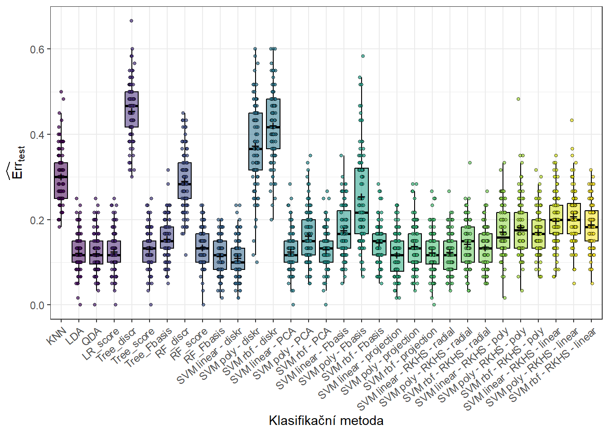
<p class="caption">(\#fig:unnamed-chunk-115)Krabicové diagramy testovacích chybovostí pro 100 simulací zvlášť pro jednotlivé klasifikační metody. Černými symboly $+$ jsou vyznačeny průměry.</p>
</div>


Nakonec se podívejme, jaké hodnoty hyperparametrů byly nejčastější volbou.


Table: (\#tab:unnamed-chunk-117)Mediány hodnot hyperparametrů pro vybrané metody, u nichž se určoval nějaký hyperparametr pomocí cross-validace.

                          Mediánová hodnota hyperparametru
-----------------------  ---------------------------------
KNN_K                                                  3.0
nharm                                                  1.0
LR_func_n_basis                                         NA
SVM_d_Linear                                          12.0
SVM_d_Poly                                            14.0
SVM_d_Radial                                          13.0
SVM_RKHS_radial_gamma1                                 5.2
SVM_RKHS_radial_gamma2                                 8.5
SVM_RKHS_radial_gamma3                                 8.5
SVM_RKHS_radial_d1                                    17.0
SVM_RKHS_radial_d2                                    17.0
SVM_RKHS_radial_d3                                    17.0
SVM_RKHS_poly_p1                                       4.0
SVM_RKHS_poly_p2                                       4.0
SVM_RKHS_poly_p3                                       4.0
SVM_RKHS_poly_d1                                      13.0
SVM_RKHS_poly_d2                                       7.0
SVM_RKHS_poly_d3                                       9.0
SVM_RKHS_linear_d1                                    17.0
SVM_RKHS_linear_d2                                    23.0
SVM_RKHS_linear_d3                                    24.0


```r
CV_res <- CV_RESULTS |> 
  pivot_longer(cols = CV_RESULTS |> colnames(), names_to = 'method', values_to = 'hyperparameter') |>
  mutate(method = factor(method, 
                         levels = CV_RESULTS |> colnames(), 
                         labels = CV_RESULTS |> colnames(), ordered = TRUE)) |> 
  as.data.frame() 

CV_res |> 
  filter(method %in% c('KNN_K', 'nharm')) |>
  ggplot(aes(x = hyperparameter, #y = after_stat(density),
             fill = method, colour = method)) + 
  geom_histogram(binwidth = 1, alpha = 0.6) + 
  theme_bw() + 
  facet_grid(~method, scales = 'free') +
  labs(x = 'Hodnoty hyperparametru',
       y = 'Absolutní počet') + 
  theme(legend.position = 'none')
```

<div class="figure">
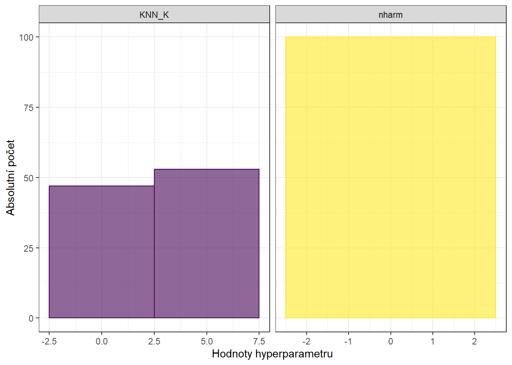
<p class="caption">(\#fig:unnamed-chunk-118)Histogramy hodnot hyperparametrů pro KNN, funkcionální logistickou regresi a také histogram pro počet hlavních komponent.</p>
</div>


```r
CV_res |> 
  filter(method %in% c('SVM_d_Linear', 'SVM_d_Poly', 'SVM_d_Radial')) |>
  ggplot(aes(x = hyperparameter, #y = after_stat(density),
             fill = method, colour = method)) + 
  geom_histogram(binwidth = 5, alpha = 0.6) + 
  theme_bw() + 
  facet_grid(~method, scales = 'free') +
  labs(x = 'Hodnoty hyperparametru',
       y = 'Absolutní počet') + 
  theme(legend.position = 'none')
```

<div class="figure">

<p class="caption">(\#fig:unnamed-chunk-120)Histogramy hodnot hyperparametrů metody SVM s projekcí na B-splinovou bázi.</p>
</div>


```r
CV_res |> 
  filter(method %in% c('SVM_RKHS_radial_gamma1', 'SVM_RKHS_radial_gamma2',
                       'SVM_RKHS_radial_gamma3', 'SVM_RKHS_radial_d1', 
                       'SVM_RKHS_radial_d2', 'SVM_RKHS_radial_d3')) |>
  ggplot(aes(x = hyperparameter, #y = after_stat(density),
             fill = method, colour = method)) + 
  geom_histogram(bins = 10, alpha = 0.6) + 
  theme_bw() + 
  facet_wrap(~method, scales = 'free', ncol = 3) +
  labs(x = 'Hodnoty hyperparametru',
       y = 'Absolutní počet') + 
  theme(legend.position = 'none')
```

<div class="figure">

<p class="caption">(\#fig:unnamed-chunk-122)Histogramy hodnot hyperparametrů metody RKHS + SVM s radiálním jádrem.</p>
</div>


```r
CV_res |> 
  filter(method %in% c('SVM_RKHS_poly_p1', 'SVM_RKHS_poly_p2',
                       'SVM_RKHS_poly_p3', 'SVM_RKHS_poly_d1',
                       'SVM_RKHS_poly_d2', 'SVM_RKHS_poly_d3')) |>
  ggplot(aes(x = hyperparameter, #y = after_stat(density),
             fill = method, colour = method)) + 
  geom_histogram(binwidth = 1, alpha = 0.6) + 
  theme_bw() + 
  facet_wrap(~method, scales = 'free', ncol = 3) +
  labs(x = 'Hodnoty hyperparametru',
       y = 'Absolutní počet') + 
  theme(legend.position = 'none')
```

<div class="figure">
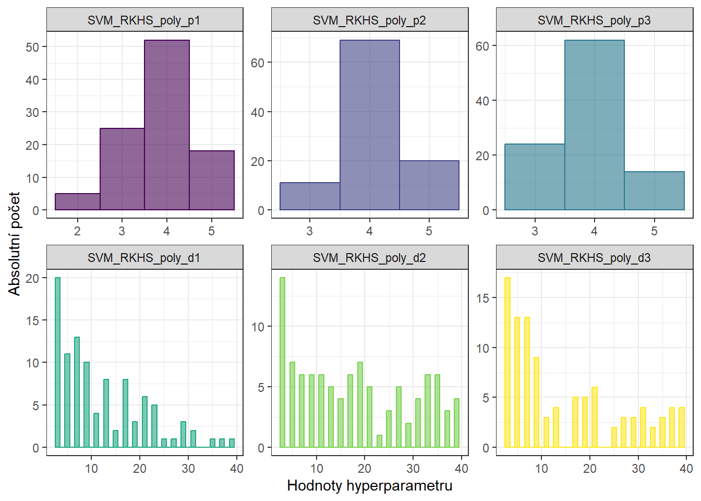
<p class="caption">(\#fig:unnamed-chunk-124)Histogramy hodnot hyperparametrů metody RKHS + SVM s polynomiálním jádrem.</p>
</div>


```r
CV_res |> 
  filter(method %in% c('SVM_RKHS_linear_d1',
                       'SVM_RKHS_linear_d2', 'SVM_RKHS_linear_d3')) |>
  ggplot(aes(x = hyperparameter, #y = after_stat(density),
             fill = method, colour = method)) + 
  geom_histogram(binwidth = 5, alpha = 0.6) + 
  theme_bw() + 
  facet_wrap(~method, scales = 'free', ncol = 3) +
  labs(x = 'Hodnoty hyperparametru',
       y = 'Absolutní počet') + 
  theme(legend.position = 'none')
```

<div class="figure">
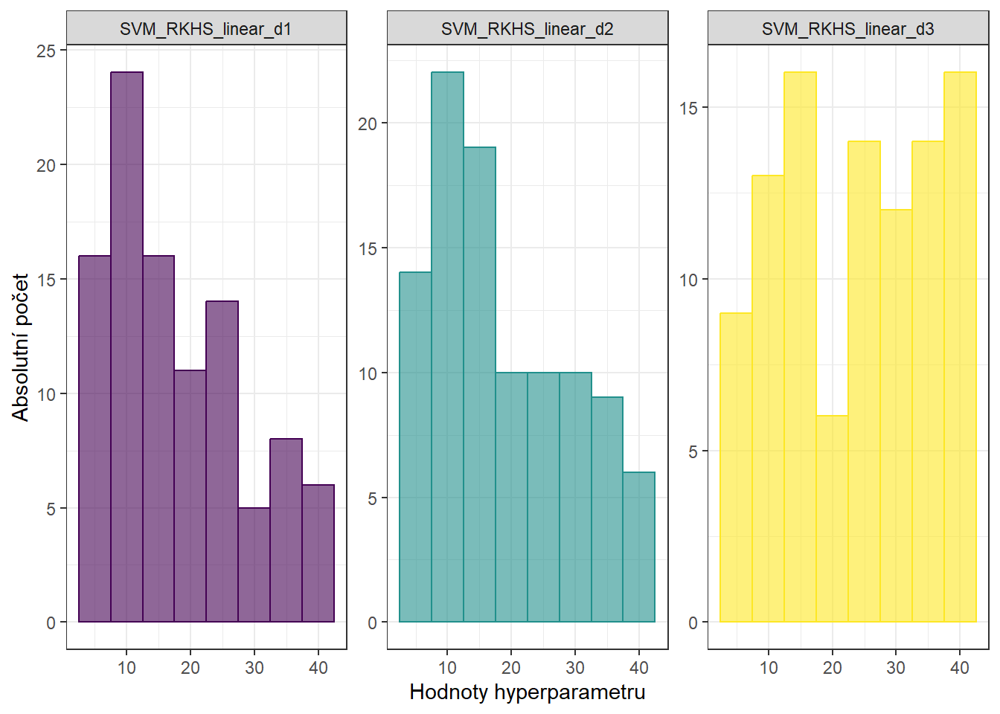
<p class="caption">(\#fig:unnamed-chunk-126)Histogramy hodnot hyperparametrů metody RKHS + SVM s lineárním jádrem.</p>
</div>


