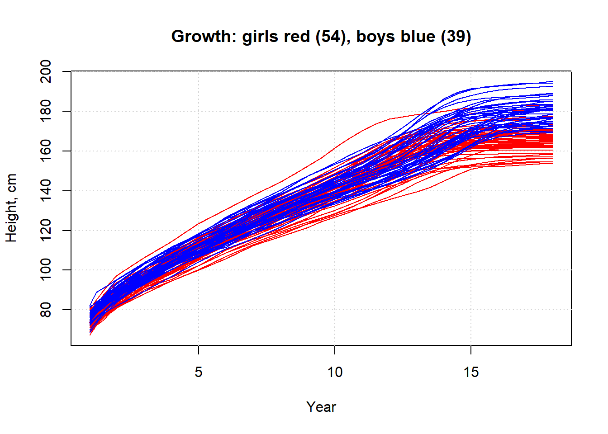

# Aplikace na reálných datech 1

Nyní se věnujme aplikaci na reálných datech. Budeme pracovat s daty `dataf.growth()`, které jsou dostupné v knihovně `ddalpha`.

Nejprve si data načteme a vykreslíme.


```r
# nacteni dat 
library(ddalpha)
```

```
## Loading required package: MASS
```

```
## Loading required package: class
```

```
## Loading required package: robustbase
```

```
## Loading required package: sfsmisc
```

```
## Loading required package: geometry
```

```r
dataf <- dataf.growth()
```



