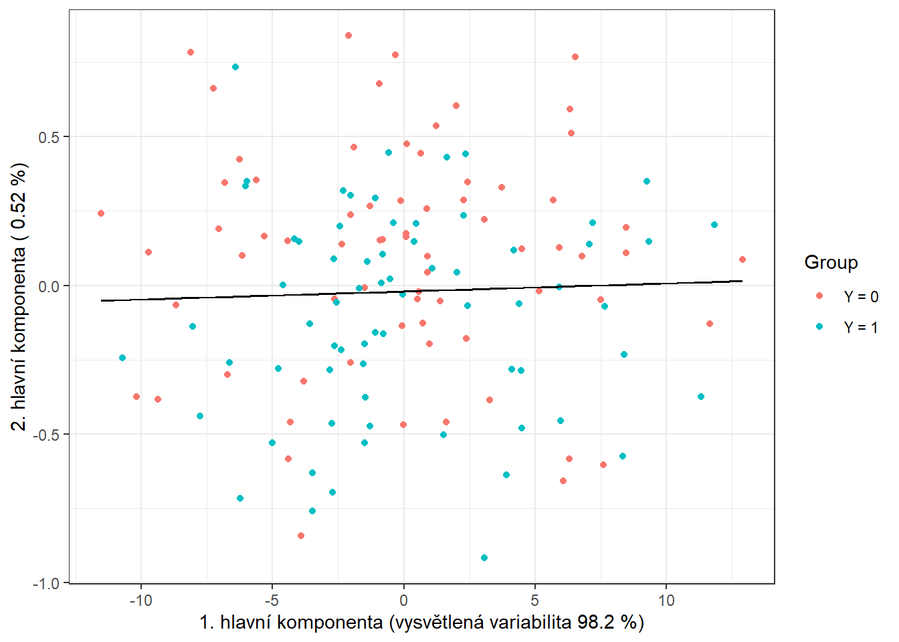
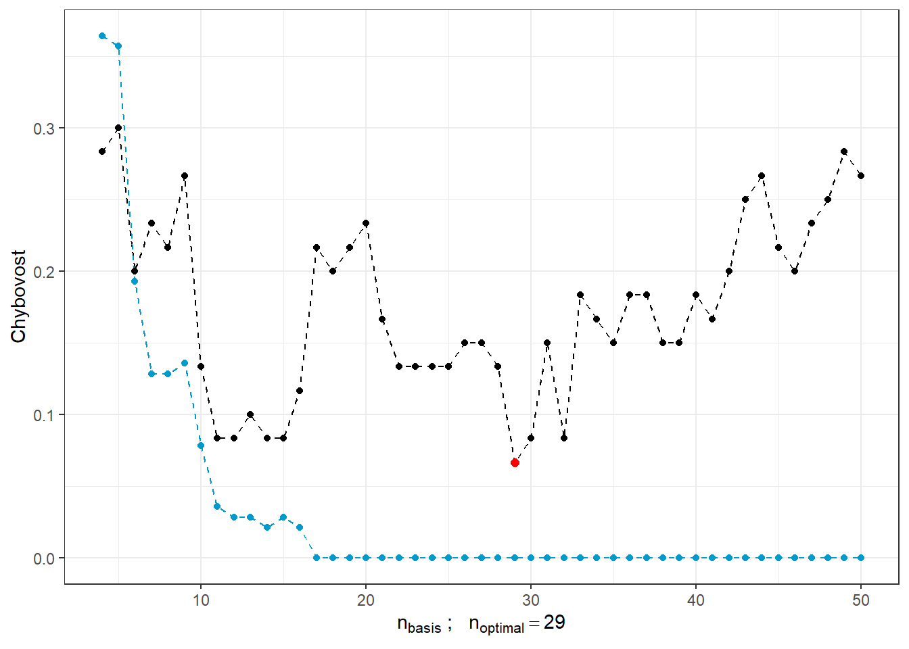
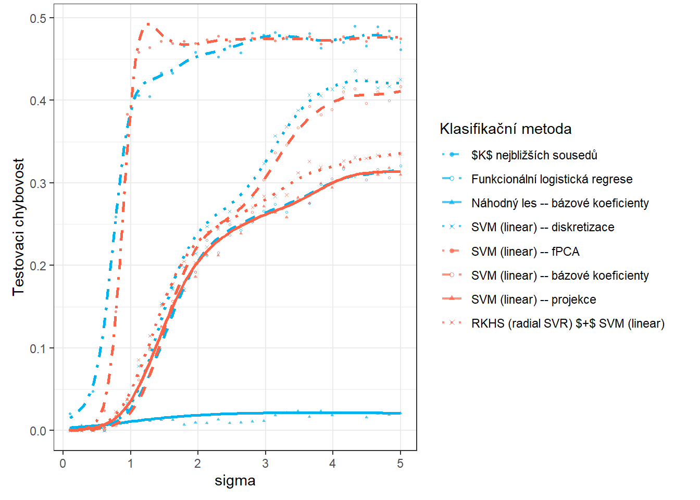

# Závislost na parametru $\sigma^2$ {#simulace3sigma}

V této části se budeme zabývat závislostí výsledků z předchozí Kapitoly \@ref(simulace3) na hodnotě $\sigma^2$, která definuje rozptyl normálního rozdělení, ze kterého generujeme náhodné chyby kolem generujících křivek (můžeme říci, že $\sigma^2$ nese informaci například o chybovosti měření určitého přístroje). Očekáváme, že s rostoucí hodnotou $\sigma^2$ se budou výsledky jednotlivých metod zhoršovat a tudíž klasifikace nebude tak úspěšná. V následující sekci \@ref(simulace3shift) se pak podíváme na závislost výsledků na hodnotě $\sigma^2_{shift}$, tedy na rozptylu normálního rozdělení, ze kterého generujeme posun pro generované křivky.

## Simulace funkcionálních dat

Nejprve si simulujeme funkce, které budeme následně chtít klasifikovat.
Budeme uvažovat pro jednoduchost dvě klasifikační třídy.
Pro simulaci nejprve:

-   zvolíme vhodné funkce,

-   generujeme body ze zvoleného intervalu, které obsahují, například gaussovský, šum,

-   takto získané diskrétní body vyhladíme do podoby funkcionálního objektu pomocí nějakého vhodného bázového systému.

Tímto postupem získáme funkcionální objekty společně s hodnotou kategoriální proměnné $Y$, která rozlišuje příslušnost do klasifikační třídy.


```r
# nacteme potrebne balicky 

library(fda)
library(ggplot2)
library(dplyr)
library(tidyr)
library(ddalpha)
library(polynom)

set.seed(42)
```

Uvažujme tedy dvě klasifikační třídy, $Y \in \{0, 1\}$, pro každou ze tříd stejný počet `n` generovaných funkcí.
Definujme si nejprve dvě funkce, každá bude pro jednu třídu.
Funkce budeme uvažovat na intervalu $I = [0, 6]$.

Nyní vytvoříme funkce pomocí interpolačních polynomů. Nejprve si definujeme body, kterými má procházet naše křivka, a následně jimi proložíme interpolační polynom, který použijeme pro generování křivek pro klasifikaci.


```r
# definujici body pro tridu 0
x.0 <- c(0.00, 0.65, 0.94, 1.42, 2.26, 2.84, 3.73, 4.50, 5.43, 6.00)
y.0 <- c(0, 0.25, 0.86, 1.49, 1.1, 0.15, -0.11, -0.36, 0.23, 0)

# definujici body pro tridu 1
x.1 <- c(0.00, 0.51, 0.91, 1.25, 1.51, 2.14, 2.43, 2.96, 3.70, 4.60,
         5.25, 5.67, 6.00)
y.1 <- c(0.1, 0.4, 0.71, 1.08, 1.47, 1.39, 0.81, 0.05, -0.1, -0.4,
         0.3, 0.37, 0)
```


```r
# graf bodu
dat_points <- data.frame(x = c(x.0, x.1),
                         y = c(y.0, y.1),
                         Class = rep(c('Y = 0', 'Y = 1'), 
                                     c(length(x.0), length(x.1))))

ggplot(dat_points, aes(x = x, y = y, colour = Class)) + 
  geom_point(size=1.5) + 
  theme_bw() + 
  labs(colour = 'Klasifikační\n      třída')
```

<div class="figure">

<p class="caption">(\#fig:unnamed-chunk-3)Body definující interpolační polynomy.</p>
</div>

Pro výpočet interpolačních polynomů využijeme funkci `poly.calc()` z knihovny `polynom`. Dále definujeme funkce `poly.0()` a `poly.1()`, které budou počítat hodnoty polynomů v daném bodě intervalu. K jejich vytvoření použijeme funkci `predict()`, na jejíž vstup zadáme příslušný polynom a bod, ve kterám chceme polynom vyhodnotit.


```r
# vypocet polynomu
polynom.0 <- poly.calc(x.0, y.0)
polynom.1 <- poly.calc(x.1, y.1)
```


```r
poly.0 <- function(x) return(predict(polynom.0, x))
poly.1 <- function(x) return(predict(polynom.1, x))
```


```r
# vykresleni polynomu
xx <- seq(min(x.0), max(x.0), length = 501)
yy.0 <- poly.0(xx)
yy.1 <- poly.1(xx)

dat_poly_plot <- data.frame(x = c(xx, xx),
                            y = c(yy.0, yy.1),
                            Class = rep(c('Y = 0', 'Y = 1'), 
                                        c(length(xx), length(xx))))

ggplot(dat_points, aes(x = x, y = y, colour = Class)) + 
  geom_point(size=1.5) + 
  theme_bw() + 
  geom_line(data = dat_poly_plot,
            aes(x = x, y = y, colour = Class),
            linewidth = 0.8) + 
  labs(colour = 'Klasifikační\n      třída')
```

<div class="figure">

<p class="caption">(\#fig:unnamed-chunk-6)Znázornění dvou funkcí na intervalu $I = [0, 6]$, ze kterých generujeme pozorování ze tříd 0 a 1.</p>
</div>


```r
# generujici funkce pro Y = 0 a Y = 1
funkce_0 <- poly.0
funkce_1 <- poly.1
```


Nyní si vytvoříme funkci pro generování náhodných funkcí s přidaným šumem (resp. bodů na předem dané síti) ze zvolené generující funkce.
Argument `t` označuje vektor hodnot, ve kterých chceme dané funkce vyhodnotit, `fun` značí generující funkci, `n` počet funkcí a `sigma` směrodatnou odchylku $\sigma$ normálního rozdělení $\text{N}(\mu, \sigma^2)$, ze kterého náhodně generujeme gaussovský bílý šum s $\mu = 0$.
Abychom ukázali výhodu použití metod, které pracují s funkcionálními daty, přidáme při generování ke každému simulovanému pozorování navíc i náhodný člen, který bude mít význam vertikálního posunu celé funkce (parametr `sigma_shift`).
Tento posun budeme generovat s normálního rozdělení s parametrem $\sigma^2 = 4$.


```r
generate_values <- function(t, fun, n, sigma, sigma_shift = 0) {
  # Arguments:
  # t ... vector of values, where the function will be evaluated
  # fun ... generating function of t 
  # n ... the number of generated functions / objects
  # sigma ... standard deviation of normal distribution to add noise to data
  # sigma_shift ... parameter of normal distribution for generating shift
  
  # Value:
  # X ... matrix of dimension length(t) times n with generated values of one 
  # function in a column 
  
  X <- matrix(rep(t, times = n), ncol = n, nrow = length(t), byrow = FALSE)
  noise <- matrix(rnorm(n * length(t), mean = 0, sd = sigma),
                  ncol = n, nrow = length(t), byrow = FALSE)
  shift <- matrix(rep(rnorm(n, 0, sigma_shift), each = length(t)),
                  ncol = n, nrow = length(t))
  return(fun(X) + noise + shift)
}
```

Nyní můžeme generovat funkce.
V každé ze dvou tříd budeme uvažovat 100 pozorování, tedy `n = 100`.


```r
# pocet vygenerovanych pozorovani pro kazdou tridu
n <- 100
# vektor casu ekvidistantni na intervalu [0, 6]
t <- seq(0, 6, length = 51)

# pro Y = 0
X0 <- generate_values(t, funkce_0, n, 1, 2)
# pro Y = 1
X1 <- generate_values(t, funkce_1, n, 1, 2)
```

Vykreslíme vygenerované (ještě nevyhlazené) funkce barevně v závislosti na třídě (pouze prvních 10 pozorování z každé třídy pro přehlednost).


```r
n_curves_plot <- 10 # pocet krivek, ktere chceme vykreslit z kazde skupiny

DF0 <- cbind(t, X0[, 1:n_curves_plot]) |> 
  as.data.frame() |> 
  reshape(varying = 2:(n_curves_plot + 1), direction = 'long', sep = '') |> 
  subset(select = -id) |> 
  mutate(
  time = time - 1,
  group = 0
  )

DF1 <- cbind(t, X1[, 1:n_curves_plot]) |> 
  as.data.frame() |> 
  reshape(varying = 2:(n_curves_plot + 1), direction = 'long', sep = '') |> 
  subset(select = -id) |> 
  mutate(
  time = time - 1,
  group = 1
  )

DF <- rbind(DF0, DF1) |>
  mutate(group = factor(group))

DF |> ggplot(aes(x = t, y = V, group = interaction(time, group), 
                 colour = group)) + 
  geom_line(linewidth = 0.5) +
  theme_bw() +
  labs(x = expression(x[1]),
       y = expression(x[2]),
       colour = 'Klasifikační\n      třída') +
  scale_colour_discrete(labels=c('Y = 0', 'Y = 1'))
```

<div class="figure">

<p class="caption">(\#fig:unnamed-chunk-11)Prvních 10 vygenerovaných pozorování z každé ze dvou klasifikačních tříd. Pozorovaná data nejsou vyhlazená.</p>
</div>

## Vyhlazení pozorovaných křivek

Nyní převedeme pozorované diskrétní hodnoty (vektory hodnot) na funkcionální objekty, se kterými budeme následně pracovat.
Opět využijeme k vyhlazení B-sline bázi.

Za uzly bereme celý vektor `t`, standardně uvažujeme kubické spliny, proto volíme (implicitní volba v `R`) `norder = 4`.
Budeme penalizovat druhou derivaci funkcí.


```r
rangeval <- range(t)
breaks <- t
norder <- 4

bbasis <- create.bspline.basis(rangeval = rangeval, 
                               norder = norder, 
                               breaks = breaks)

curv.Lfd <- int2Lfd(2) # penalizujeme 2. derivaci
```

Najdeme vhodnou hodnotu vyhlazovacího parametru $\lambda > 0$ pomocí $GCV(\lambda)$, tedy pomocí zobecněné cross--validace.
Hodnotu $\lambda$ budeme uvažovat pro obě klasifikační skupiny stejnou, neboť pro testovací pozorování bychom dopředu nevěděli, kterou hodnotu $\lambda$, v případě rozdílné volby pro každou třídu, máme volit.


```r
# spojeni pozorovani do jedne matice
XX <- cbind(X0, X1)

lambda.vect <- 10^seq(from = -2, to = 1, length.out = 50) # vektor lambd
gcv <- rep(NA, length = length(lambda.vect)) # prazdny vektor pro ulozebi GCV

for(index in 1:length(lambda.vect)) {
  curv.Fdpar <- fdPar(bbasis, curv.Lfd, lambda.vect[index])
  BSmooth <- smooth.basis(t, XX, curv.Fdpar) # vyhlazeni
  gcv[index] <- mean(BSmooth$gcv) # prumer pres vsechny pozorovane krivky
}

GCV <- data.frame(
  lambda = round(log10(lambda.vect), 3),
  GCV = gcv
)

# najdeme hodnotu minima
lambda.opt <- lambda.vect[which.min(gcv)]
```

Pro lepší znázornění si vykreslíme průběh $GCV(\lambda)$.


```r
GCV |> ggplot(aes(x = lambda, y = GCV)) + 
  geom_line(linetype = 'solid', linewidth = 0.6) + 
  geom_point(size = 1.5) + 
  theme_bw() + 
  labs(x = bquote(paste(log[10](lambda), ' ;   ', 
                        lambda[optimal] == .(round(lambda.opt, 4)))),
       y = expression(GCV(lambda))) + 
  geom_point(aes(x = log10(lambda.opt), y = min(gcv)), colour = 'red', size = 2.5)
```

<div class="figure">

<p class="caption">(\#fig:unnamed-chunk-14)Průběh $GCV(\lambda)$ pro zvolený vektor $\boldsymbol\lambda$. Na ose $x$ jsou hodnoty vyneseny v logaritmické škále. Červeně je znázorněna optimální hodnota vyhlazovacího parametru $\lambda_{optimal}$.</p>
</div>

S touto optimální volbou vyhlazovacího parametru $\lambda$ nyní vyhladíme všechny funkce a opět znázorníme graficky prvních 10 pozorovaných křivek z každé klasifikační třídy.


```r
curv.fdPar <- fdPar(bbasis, curv.Lfd, lambda.opt)
BSmooth <- smooth.basis(t, XX, curv.fdPar)
XXfd <- BSmooth$fd

fdobjSmootheval <- eval.fd(fdobj = XXfd, evalarg = t)
DF$Vsmooth <- c(fdobjSmootheval[, c(1 : n_curves_plot, 
                                    (n + 1) : (n + n_curves_plot))])

DF |> ggplot(aes(x = t, y = Vsmooth, group = interaction(time, group), 
                 colour = group)) + 
  geom_line(linewidth = 0.75) +
  theme_bw() +
  labs(x = expression(x[1]),
       y = expression(x[2]),
       colour = 'Klasifikační\n      třída') +
  scale_colour_discrete(labels=c('Y = 0', 'Y = 1'))
```

<div class="figure">

<p class="caption">(\#fig:unnamed-chunk-15)Prvních 10 vyhlazených křivek z každé klasifikační třídy.</p>
</div>

Ještě znázorněme všechny křivky včetně průměru zvlášť pro každou třídu.


```r
DFsmooth <- data.frame(
  t = rep(t, 2 * n),
  time = rep(rep(1:n, each = length(t)), 2),
  Smooth = c(fdobjSmootheval),
  Mean = c(rep(apply(fdobjSmootheval[ , 1 : n], 1, mean), n),
            rep(apply(fdobjSmootheval[ , (n + 1) : (2 * n)], 1, mean), n)),
  group = factor(rep(c(0, 1), each = n * length(t)))
)

DFmean <- data.frame(
  t = rep(t, 2),
  Mean = c(apply(fdobjSmootheval[ , 1 : n], 1, mean), 
            apply(fdobjSmootheval[ , (n + 1) : (2 * n)], 1, mean)),
  group = factor(rep(c(0, 1), each = length(t)))
)

DFsmooth |> ggplot(aes(x = t, y = Smooth, group = interaction(time, group), 
                 colour = group)) + 
  geom_line(linewidth = 0.25, alpha = 0.5) +
  theme_bw() +
  labs(x = expression(x[1]),
       y = expression(x[2]),
       colour = 'Klasifikační\n      třída') +
  scale_colour_discrete(labels = c('Y = 0', 'Y = 1')) + 
  geom_line(aes(x = t, y = Mean, colour = group), 
            linewidth = 1.2, linetype = 'solid') + 
  scale_x_continuous(expand = c(0.01, 0.01)) + 
  #ylim(c(-1, 2)) + 
  scale_y_continuous(expand = c(0.01, 0.01))#, limits = c(-1, 2))
```

<div class="figure">

<p class="caption">(\#fig:unnamed-chunk-16)Vykreslení všech vyhlazených pozorovaných křivek, barevně jsou odlišeny křivky podle příslušnosti do klasifikační třídy. Tlustou čarou je zakreslen průměr pro každou třídu.</p>
</div>


```r
DFsmooth <- data.frame(
  t = rep(t, 2 * n),
  time = rep(rep(1:n, each = length(t)), 2),
  Smooth = c(fdobjSmootheval),
  Mean = c(rep(apply(fdobjSmootheval[ , 1 : n], 1, mean), n),
            rep(apply(fdobjSmootheval[ , (n + 1) : (2 * n)], 1, mean), n)),
  group = factor(rep(c(0, 1), each = n * length(t)))
)

DFmean <- data.frame(
  t = rep(t, 2),
  Mean = c(apply(fdobjSmootheval[ , 1 : n], 1, mean), 
            apply(fdobjSmootheval[ , (n + 1) : (2 * n)], 1, mean)),
  group = factor(rep(c(0, 1), each = length(t)))
)

DFsmooth |> ggplot(aes(x = t, y = Smooth, group = interaction(time, group), 
                 colour = group)) + 
  geom_line(linewidth = 0.25, alpha = 0.5) +
  theme_bw() +
  labs(x = expression(x[1]),
       y = expression(x[2]),
       colour = 'Klasifikační\n      třída') +
  scale_colour_discrete(labels = c('Y = 0', 'Y = 1')) + 
  geom_line(aes(x = t, y = Mean, colour = group), 
            linewidth = 1.2, linetype = 'solid') + 
  scale_x_continuous(expand = c(0.01, 0.01)) + 
  #ylim(c(-1, 2)) + 
  scale_y_continuous(expand = c(0.01, 0.01), limits = c(-1, 2))
```

<div class="figure">

<p class="caption">(\#fig:unnamed-chunk-17)Vykreslení všech vyhlazených pozorovaných křivek, barevně jsou odlišeny křivky podle příslušnosti do klasifikační třídy. Tlustou čarou je zakreslen průměr pro každou třídu. Přiblížený pohled.</p>
</div>

## Klasifikace křivek

Nejprve načteme potřebné knihovny pro klasifikaci.


```r
library(caTools) # pro rozdeleni na testovaci a trenovaci
library(caret) # pro k-fold CV
library(fda.usc) # pro KNN, fLR
library(MASS) # pro LDA
library(fdapace)
library(pracma)
library(refund) # pro LR na skorech
library(nnet) # pro LR na skorech
library(caret)
library(rpart) # stromy
library(rattle) # grafika
library(e1071)
library(randomForest) # nahodny les
```

Abychom mohli jednotlivé klasifikátory porovnat, rozdělíme množinu vygenerovaných pozorování na dvě části v poměru 70:30, a to na trénovací a testovací (validační) část.
Trénovací část použijeme při konstrukci klasifikátoru a testovací na výpočet chyby klasifikace a případně dalších charakteristik našeho modelu.
Výsledné klasifikátory podle těchto spočtených charakteristik můžeme následně porovnat mezi sebou z pohledu jejich úspěnosti klasifikace.


```r
# rozdeleni na testovaci a trenovaci cast
split <- sample.split(XXfd$fdnames$reps, SplitRatio = 0.7)

Y <- rep(c(0, 1), each = n)

X.train <- subset(XXfd, split == TRUE)
X.test <- subset(XXfd, split == FALSE)

Y.train <- subset(Y, split == TRUE)
Y.test <- subset(Y, split == FALSE)
```

Ještě se podíváme na zastoupení jednotlivých skupin v testovací a trénovací části dat.


```r
# absolutni zastoupeni
table(Y.train)
```

```
## Y.train
##  0  1 
## 71 69
```

```r
table(Y.test)
```

```
## Y.test
##  0  1 
## 29 31
```

```r
# relativni zastoupeni
table(Y.train) / sum(table(Y.train))
```

```
## Y.train
##         0         1 
## 0.5071429 0.4928571
```

```r
table(Y.test) / sum(table(Y.test))
```

```
## Y.test
##         0         1 
## 0.4833333 0.5166667
```

### $K$ nejbližších sousedů

Začněme neparametrickou klasifikační metodou, a to metodou $K$ nejbližších sousedů.
Nejprve si vytvoříme potřebné objekty tak, abychom s nimi mohli pomocí funkce `classif.knn()` z knihovny `fda.usc` dále pracovat.


```r
x.train <- fdata(X.train)
y.train <- as.numeric(factor(Y.train))
```

Nyní můžeme definovat model a podívat se na jeho úspěšnost klasifikace.
Poslední otázkou však zůstává, jak volit optimální počet sousedů $K$.
Mohli bychom tento počet volit jako takové $K$, při kterém nastává minimální chybovost na trénovacích datech.
To by ale mohlo vést k přeučení modelu, proto využijeme cross-validaci.
Vzhledem k výpočetní náročnosti a rozsahu souboru zvolíme $k$-násobnou CV, my zvolíme například hodnotu $k = {10}$.


```r
# model pro vsechna trenovaci data pro K = 1, 2, ..., sqrt(n_train)
neighb.model <- classif.knn(group = y.train, 
                            fdataobj = x.train, 
                            knn = c(1:round(sqrt(length(y.train))))) 

# summary(neighb.model) # shrnuti modelu
# plot(neighb.model$gcv, pch = 16) # vykresleni zavislosti GCV na poctu sousedu K
# neighb.model$max.prob # maximalni presnost
(K.opt <- neighb.model$h.opt) # optimalni hodnota K
```

```
## [1] 5
```

Proveďme předchozí postup pro trénovací data, která rozdělíme na $k$ částí a tedy zopakujeme tuto část kódu $k$-krát.


```r
k_cv <- 10 # k-fold CV
neighbours <- c(1:(2 * ceiling(sqrt(length(y.train))))) # pocet sousedu 

# rozdelime trenovaci data na k casti
folds <- createMultiFolds(X.train$fdnames$reps, k = k_cv, time = 1)

# prazdna matice, do ktere vlozime jednotlive vysledky
# ve sloupcich budou hodnoty presnosti pro danou cast trenovaci mnoziny
# v radcich budou hodnoty pro danou hodnotu K sousedu
CV.results <- matrix(NA, nrow = length(neighbours), ncol = k_cv)

for (index in 1:k_cv) {
  # definujeme danou indexovou mnozinu
  fold <- folds[[index]]
    
  x.train.cv <- subset(X.train, c(1:length(X.train$fdnames$reps)) %in% fold) |>
    fdata()
  y.train.cv <- subset(Y.train, c(1:length(X.train$fdnames$reps)) %in% fold) |>
    factor() |> as.numeric()
  
  x.test.cv <- subset(X.train, !c(1:length(X.train$fdnames$reps)) %in% fold) |>
    fdata()
  y.test.cv <- subset(Y.train, !c(1:length(X.train$fdnames$reps)) %in% fold) |>
    factor() |> as.numeric()
  
  # projdeme kazdou cast ... k-krat zopakujeme
  for(neighbour in neighbours) {
    # model pro konkretni volbu K
    neighb.model <- classif.knn(group = y.train.cv, 
                              fdataobj = x.train.cv, 
                              knn = neighbour) 
    # predikce na validacni casti
    model.neighb.predict <- predict(neighb.model, 
                                    new.fdataobj = x.test.cv)
    # presnost na validacni casti
    presnost <- table(y.test.cv, model.neighb.predict) |> 
      prop.table() |> diag() |> sum()
    
    # presnost vlozime na pozici pro dane K a fold
    CV.results[neighbour, index] <- presnost
  }
}

# spocitame prumerne presnosti pro jednotliva K pres folds
CV.results <- apply(CV.results, 1, mean)
K.opt <- which.max(CV.results)
presnost.opt.cv <- max(CV.results)
# CV.results
```

Vidíme, že nejlépe vychází hodnota parametru $K$ jako 5 s hodnotou chybovosti spočtenou pomocí 10-násobné CV 0.3429.
Pro přehlednost si ještě vykresleme průběh validační chybovosti v závislosti na počtu sousedů $K$.


```r
CV.results <- data.frame(K = neighbours, CV = CV.results)
CV.results |> ggplot(aes(x = K, y = 1 - CV)) + 
  geom_line(linetype = 'dashed', colour = 'grey') + 
  geom_point(size = 1.5) + 
  geom_point(aes(x = K.opt, y = 1 - presnost.opt.cv), colour = 'red', size = 2) +
  theme_bw() + 
  labs(x = bquote(paste(K, ' ;   ', 
                        K[optimal] == .(K.opt))),
       y = 'Validační chybovost') + 
  scale_x_continuous(breaks = neighbours)
```

<div class="figure">

<p class="caption">(\#fig:unnamed-chunk-24)Závislost validační chybovosti na hodnotě $K$, tedy na počtu sousedů.</p>
</div>

Nyní známe optimální hodnotu parametru $K$ a tudíž můžeme sestavit finální model.


```r
neighb.model <- classif.knn(group = y.train, fdataobj = x.train, knn = K.opt)

# predikce
model.neighb.predict <- predict(neighb.model, 
                                new.fdataobj = fdata(X.test))

# summary(neighb.model)

# presnost na testovacich datech
presnost <- table(as.numeric(factor(Y.test)), model.neighb.predict) |>
  prop.table() |>
  diag() |>
  sum()
# chybovost
# 1 - presnost
```

Vidíme tedy, že chybovost modelu sestrojeného pomocí metody $K$ nejbližších sousedů s optimální volbou $K_{optimal}$ rovnou 5, kterou jsme určili cross-validací, je na trénovacích datech rovna 0.3571 a na testovacích datech 0.3833.

K porovnání jendotlivých modelů můžeme použít oba typy chybovostí, pro přehlednost si je budeme ukládat do tabulky.


```r
RESULTS <- data.frame(model = 'KNN', 
                      Err.train = 1 - neighb.model$max.prob,
                      Err.test = 1 - presnost)
```

### Lineární diskriminační analýza

Jako druhou metodu pro sestrojení klasifikátoru budeme uvažovat lineární diskriminační analýzu (LDA).
Jelikož tato metoda nelze aplikovat na funkcionální data, musíme je nejprve diskretizovat, což provedeme pomocí funkcionální analýzy hlavních komponent.
Klasifikační algoritmus následně provedeme na skórech prvních $p$ hlavních komponent.
Počet komponent $p$ zvolíme tak, aby prvních $p$ hlavních komponent dohromady vysvětlovalo alespoň 90 % variability v datech.

Proveďme tedy nejprve funkcionální analýzu hlavních komponent a určeme počet $p$.


```r
# analyza hlavnich komponent
data.PCA <- pca.fd(X.train, nharm = 10) # nharm - maximalni pocet HK
nharm <- which(cumsum(data.PCA$varprop) >= 0.9)[1] # urceni p
if(nharm == 1) nharm <- 2

data.PCA <- pca.fd(X.train, nharm = nharm) 
data.PCA.train <- as.data.frame(data.PCA$scores) # skore prvnich p HK
data.PCA.train$Y <- factor(Y.train) # prislusnost do trid
```

V tomto konkrétním případě jsme za počet hlavních komponent vzali $p$ = 2, které dohromady vysvětlují 98.72 % variability v datech.
První hlavní komponenta potom vysvětluje 98.2 % a druhá 0.52 % variability.
Graficky si můžeme zobrazit hodnoty skórů prvních dvou hlavních komponent, barevně odlišených podle příslušnosti do klasifikační třídy.


```r
data.PCA.train |> ggplot(aes(x = V1, y = V2, colour = Y)) +
  geom_point(size = 1.5) + 
  labs(x = paste('1. hlavní komponenta (vysvětlená variabilita', 
                 round(100 * data.PCA$varprop[1], 2), '%)'),
       y = paste('2. hlavní komponenta (', 
                 round(100 * data.PCA$varprop[2], 2), '%)'),
       colour = 'Group') +
  scale_colour_discrete(labels = c('Y = 0', 'Y = 1')) +
  theme_bw()
```

<div class="figure">

<p class="caption">(\#fig:unnamed-chunk-28)Hodnoty skórů prvních dvou hlavních komponent pro trénovací data. Barevně jsou odlišeny body podle příslušnosti do klasifikační třídy.</p>
</div>

Abychom mohli určit přesnost klasifikace na testovacích datech, potřebujeme spočítat skóre pro první 2 hlavní komponenty pro testovací data.
Tato skóre určíme pomocí vzorce:

$$
\xi_{i, j} = \int \left( X_i(t) - \mu(t)\right) \cdot \rho_j(t)\text dt,
$$ kde $\mu(t)$ je střední hodnota (průměrná funkce) a $\rho_j(t)$ vlastní fukce (funkcionální hlavní komponenty).


```r
# vypocet skoru testovacich funkci
scores <- matrix(NA, ncol = nharm, nrow = length(Y.test)) # prazdna matice 

for(k in 1:dim(scores)[1]) {
  xfd = X.test[k] - data.PCA$meanfd[1] # k-te pozorovani - prumerna funkce
  scores[k, ] = inprod(xfd, data.PCA$harmonics) 
  # skalarni soucin rezidua a vlastnich funkci rho (funkcionalni hlavni komponenty)
}

data.PCA.test <- as.data.frame(scores)
data.PCA.test$Y <- factor(Y.test)
colnames(data.PCA.test) <- colnames(data.PCA.train) 
```

Nyní již můžeme sestrojit klasifikátor na trénovací části dat.


```r
# model
clf.LDA <- lda(Y ~ ., data = data.PCA.train)

# presnost na trenovacich datech
predictions.train <- predict(clf.LDA, newdata = data.PCA.train)
presnost.train <- table(data.PCA.train$Y, predictions.train$class) |>
  prop.table() |> diag() |> sum()
  
# presnost na testovacich datech
predictions.test <- predict(clf.LDA, newdata = data.PCA.test)
presnost.test <- table(data.PCA.test$Y, predictions.test$class) |>
  prop.table() |> diag() |> sum()
```

Spočítali jsme jednak chybovost klasifikátoru na trénovacích (41.43 %), tak i na testovacích datech (40 %).

Pro grafické znázornění metody můžeme zaznačit dělící hranici do grafu skórů prvních dvou hlavních komponent.
Tuto hranici spočítáme na husté síti bodů a zobrazíme ji pomocí funkce `geom_contour()`.


```r
# pridame diskriminacni hranici
np <- 1001 # pocet bodu site
# x-ova osa ... 1. HK
nd.x <- seq(from = min(data.PCA.train$V1), 
            to = max(data.PCA.train$V1), length.out = np)
# y-ova osa ... 2. HK
nd.y <- seq(from = min(data.PCA.train$V2), 
            to = max(data.PCA.train$V2), length.out = np)
# pripad pro 2 HK ... p = 2
nd <- expand.grid(V1 = nd.x, V2 = nd.y)
# pokud p = 3
if(dim(data.PCA.train)[2] == 4) {
  nd <- expand.grid(V1 = nd.x, V2 = nd.y, V3 = data.PCA.train$V3[1])}
# pokud p = 4
if(dim(data.PCA.train)[2] == 5) {
  nd <- expand.grid(V1 = nd.x, V2 = nd.y, V3 = data.PCA.train$V3[1],
                    V4 = data.PCA.train$V4[1])}
# pokud p = 5
if(dim(data.PCA.train)[2] == 6) {
  nd <- expand.grid(V1 = nd.x, V2 = nd.y, V3 = data.PCA.train$V3[1],
                    V4 = data.PCA.train$V4[1], V5 = data.PCA.train$V5[1])}

# pridame Y = 0, 1
nd <- nd |> mutate(prd = as.numeric(predict(clf.LDA, newdata = nd)$class))

data.PCA.train |> ggplot(aes(x = V1, y = V2, colour = Y)) +
  geom_point(size = 1.5) + 
  labs(x = paste('1. hlavní komponenta (vysvětlená variabilita', 
                 round(100 * data.PCA$varprop[1], 2), '%)'),
       y = paste('2. hlavní komponenta (', 
                 round(100 * data.PCA$varprop[2], 2), '%)'),
       colour = 'Group') +
  scale_colour_discrete(labels = c('Y = 0', 'Y = 1')) +
  theme_bw() +
  geom_contour(data = nd, aes(x = V1, y = V2, z = prd), colour = 'black')
```

<div class="figure">

<p class="caption">(\#fig:unnamed-chunk-31)Skóre prvních dvou hlavních komponent, barevně odlišené podle příslušnosti do klasifikační třídy. Černě je vyznačena dělící hranice (přímka v rovině prvních dvou hlavních komponent) mezi třídami sestrojená pomocí LDA.</p>
</div>

Vidíme, že dělící hranicí je přímka, lineární funkce v prostoru 2D, což jsme ostatně od LDA čekali.
Nakonec přidáme chybovosti do souhrnné tabulky.


```r
Res <- data.frame(model = 'LDA', 
                  Err.train = 1 - presnost.train,
                  Err.test = 1 - presnost.test)

RESULTS <- rbind(RESULTS, Res)
```

### Kvadratická diskriminační analýza

Jako další sestrojme klasifikátor pomocí kvadratické diskriminační analýzy (QDA).
Jedná se o analogický případ jako LDA s tím rozdílem, že nyní připouštíme pro každou ze tříd rozdílnou kovarianční matici normálního rozdělení, ze kterého pocházejí příslušné skóry.
Tento vypuštěný předpoklad o rovnosti kovariančních matic vede ke kvadratické hranici mezi třídami.

V `R` se provede QDA analogicky jako LDA v předchozí části, tedy opět bychom pomocí funkcionální analýzy hlavních komponent spočítali skóre pro trénovací i testovací funkce, sestrojili klasifikátor na skórech prvních $p$ hlavních komponent a pomocí něj predikovali příslušnost testovacích křivek do třídy $Y^* \in \{0, 1\}$.

Funkcionální PCA provádět nemusíme, využijeme výsledků z části LDA.


Můžeme tedy rovnou přistoupit k sestrojení klasifikátoru, což provedeme pomocí funkce `qda()`.
Následně spočítáme přesnost klasifikátoru na testovacích a trénovacích datech.


```r
# model
clf.QDA <- qda(Y ~ ., data = data.PCA.train)

# presnost na trenovacich datech
predictions.train <- predict(clf.QDA, newdata = data.PCA.train)
presnost.train <- table(data.PCA.train$Y, predictions.train$class) |>
  prop.table() |> diag() |> sum()
  
# presnost na testovacich datech
predictions.test <- predict(clf.QDA, newdata = data.PCA.test)
presnost.test <- table(data.PCA.test$Y, predictions.test$class) |>
  prop.table() |> diag() |> sum()
```

Spočítali jsme tedy jednak chybovost klasifikátoru na trénovacích (35.71 %), tak i na testovacích datech (40 %).

Pro grafické znázornění metody můžeme zaznačit dělící hranici do grafu skórů prvních dvou hlavních komponent.
Tuto hranici spočítáme na husté síti bodů a zobrazíme ji pomocí funkce `geom_contour()` stejně jako v případě LDA.


```r
nd <- nd |> mutate(prd = as.numeric(predict(clf.QDA, newdata = nd)$class))

data.PCA.train |> ggplot(aes(x = V1, y = V2, colour = Y)) +
  geom_point(size = 1.5) + 
  labs(x = paste('1. hlavní komponenta (vysvětlená variabilita', 
                 round(100 * data.PCA$varprop[1], 2), '%)'),
       y = paste('2. hlavní komponenta (', 
                 round(100 * data.PCA$varprop[2], 2), '%)'),
       colour = 'Group') +
  scale_colour_discrete(labels = c('Y = 0', 'Y = 1')) +
  theme_bw() +
  geom_contour(data = nd, aes(x = V1, y = V2, z = prd), colour = 'black')
```

<div class="figure">

<p class="caption">(\#fig:unnamed-chunk-37)Skóre prvních dvou hlavních komponent, barevně odlišené podle příslušnosti do klasifikační třídy. Černě je vyznačena dělící hranice (parabola v rovině prvních dvou hlavních komponent) mezi třídami sestrojená pomocí QDA.</p>
</div>

Všimněme si, že dělící hranicí mezi klasifikačními třídami je nyní parabola.

Nakonec ještě doplníme chybovosti do souhrnné tabulky.


```r
Res <- data.frame(model = 'QDA', 
                  Err.train = 1 - presnost.train,
                  Err.test = 1 - presnost.test)

RESULTS <- rbind(RESULTS, Res)
```

### Logistická regrese

Logistickou regresi můžeme provést dvěma způsoby.
Jednak použít funkcionální obdobu klasické logistické regrese, druhak klasickou mnohorozměrnou logistickou regresi, kterou provedeme na skórech prvních $p$ hlavních komponent.

#### Funkcionální logistická regrese

Analogicky jako v případě konečné dimenze vstupních dat uvažujeme logistický model ve tvaru:

$$
g\left(\mathbb E [Y|X = x]\right) = \eta (x) = g(\pi(x)) = \alpha + \int \beta(t)\cdot x(t) \text d t,
$$ kde $\eta(x)$ je lineární prediktor nabývající hodnot z intervalu $(-\infty, \infty)$, $g(\cdot)$ je *linková funkce*, v případě logistické regrese se jedná o logitovou funkci $g: (0,1) \rightarrow \mathbb R,\ g(p) = \ln\frac{p}{1-p}$ a $\pi(x)$ podmíněná pravděpodobnost

$$
\pi(x) = \text{Pr}(Y = 1 | X = x) = g^{-1}(\eta(x)) = \frac{\text e^{\alpha + \int \beta(t)\cdot x(t) \text d t}}{1 + \text e^{\alpha + \int \beta(t)\cdot x(t) \text d t}},
$$

přičemž $\alpha$ je konstanta a $\beta(t) \in L^2[a, b]$ je parametrická funkce.
Naším cílem je odhadnout tuto parametrickou funkci.

Pro funkcionální logistickou regresi použijeme funkci `fregre.glm()` z balíčku `fda.usc`.
Nejprve si vytvoříme vhodné objekty pro konstrukci klasifikátoru.


```r
# vytvorime vhodne objekty
x.train <- fdata(X.train)
y.train <- as.numeric(Y.train)

# body, ve kterych jsou funkce vyhodnoceny
tt <- x.train[["argvals"]]

dataf <- as.data.frame(y.train) 
colnames(dataf) <- "Y"
# B-spline baze 
basis1 <- X.train$basis
```

Abychom mohli odhadnout parametrickou funkci $\beta(t)$, potřebujeme ji vyjádřit v nějaké bazické reprezentaci, v našem případě B-splinové bázi.
K tomu však potřebujeme najít vhodný počet bázových funkcí.
To bychom mohli určit na základě chybovosti na trénovacích datech, avšak tato data budou upřenostňovat výběr velkého počtu bází a bude docházet k přeučení modelu.

Ilustrujme si to na následujícím případě.
Pro každý z počtu bází $n_{basis} \in \{4, 5, \dots, 50\}$ natrénujeme model na trénovacích datech, určíme na nich chybovost a také spočítáme chybovost na testovacích datech.
Připomeňme, že k výběru vhodného počtu bází nemůžeme využít stejná data jako pro odhad testovací chybovosti, neboť bychom tuto chybovost podcenili.


```r
n.basis.max <- 50
n.basis <- 4:n.basis.max
pred.baz <- matrix(NA, nrow = length(n.basis), ncol = 2, 
                   dimnames = list(n.basis, c('Err.train', 'Err.test')))

for (i in n.basis) {
  # baze pro bety
  basis2 <- create.bspline.basis(rangeval = range(tt), nbasis = i)
  # vztah
  f <- Y ~ x
  # baze pro x a bety
  basis.x <- list("x" = basis1) # vyhlazene data
  basis.b <- list("x" = basis2)
  # vstupni data do modelu
  ldata <- list("df" = dataf, "x" = x.train)
  # binomicky model ... model logisticke regrese
  model.glm <- fregre.glm(f, family = binomial(), data = ldata,
                          basis.x = basis.x, basis.b = basis.b)
  
  # presnost na trenovacich datech
  predictions.train <- predict(model.glm, newx = ldata)
  predictions.train <- data.frame(Y.pred = ifelse(predictions.train < 1/2, 0, 1))
  presnost.train <- table(Y.train, predictions.train$Y.pred) |>
    prop.table() |> diag() |> sum()
    
  # presnost na testovacich datech
  newldata = list("df" = as.data.frame(Y.test), "x" = fdata(X.test))
  predictions.test <- predict(model.glm, newx = newldata)
  predictions.test <- data.frame(Y.pred = ifelse(predictions.test < 1/2, 0, 1))
  presnost.test <- table(Y.test, predictions.test$Y.pred) |>
    prop.table() |> diag() |> sum()
  
  # vlozime do matice
  pred.baz[as.character(i), ] <- 1 - c(presnost.train, presnost.test)
} 

pred.baz <- as.data.frame(pred.baz)
pred.baz$n.basis <- n.basis
```

Znázorněme si průběh obou typů chybovostí v grafu v závislosti na počtu bazických funkcí.


```r
n.basis.beta.opt <- pred.baz$n.basis[which.min(pred.baz$Err.test)]

pred.baz |> ggplot(aes(x = n.basis, y = Err.test)) + 
  geom_line(linetype = 'dashed', colour = 'black') + 
  geom_line(aes(x = n.basis, y = Err.train), colour = 'deepskyblue3', 
            linetype = 'dashed', linewidth = 0.5) + 
  geom_point(size = 1.5) + 
  geom_point(aes(x = n.basis, y = Err.train), colour = 'deepskyblue3', 
             size = 1.5) + 
  geom_point(aes(x = n.basis.beta.opt, y = min(pred.baz$Err.test)),
             colour = 'red', size = 2) +
  theme_bw() + 
  labs(x = bquote(paste(n[basis], ' ;   ', 
                        n[optimal] == .(n.basis.beta.opt))),
        y = 'Chybovost')
```

<div class="figure">

<p class="caption">(\#fig:unnamed-chunk-41)Závislost testovací a trénovací chybovosti na počtu bázových funkcí pro $\beta$. Červeným bodem je znázorněn optimální počet $n_{optimal}$ zvolený jako minimum testovací chybovosti, černou čarou je vykreslena testovací a modrou přerušovanou čarou je vykreslen průběh trénovací chybovosti.</p>
</div>

Vidíme, že s rostoucím počtem bází pro $\beta(t)$ má trénovací chybovost (modrá čára) tendenci klesat a tedy bychom na jejím základě volili velké hodnoty $n_{basis}$.
Naopak optimální volbou na základě testovací chybovosti je $n$ rovno 29, tedy výrazně menší hodnota než 50.
Naopak s rostoucím $n$ roste testovací chyvost, což ukazuje na přeučení modelu.

Z výše uvedených důvodů pro určení optimálního počtu bazických funkcí pro $\beta(t)$ využijeme 10-ti násobnou cross-validaci.
Jako maximální počet uvažovaných bazických funkcí bereme 25, neboť jak jsme viděli výše, nad touto hodnotou dochází již k přeučení modelu.


```r
### 10-fold cross-validation
n.basis.max <- 25
n.basis <- 4:n.basis.max
k_cv <- 10 # k-fold CV
# rozdelime trenovaci data na k casti
folds <- createMultiFolds(X.train$fdnames$reps, k = k_cv, time = 1)
## prvky, ktere se behem cyklu nemeni
# body, ve kterych jsou funkce vyhodnoceny
tt <- x.train[["argvals"]]
rangeval <- range(tt)
# B-spline baze 
basis1 <- X.train$basis
# vztah
f <- Y ~ x
# baze pro x
basis.x <- list("x" = basis1)
# prazdna matice, do ktere vlozime jednotlive vysledky
# ve sloupcich budou hodnoty presnosti pro danou cast trenovaci mnoziny
# v radcich budou hodnoty pro dany pocet bazi
CV.results <- matrix(NA, nrow = length(n.basis), ncol = k_cv, 
                     dimnames = list(n.basis, 1:k_cv))
```

Nyní již máme vše připravené pro spočítání chybovosti na každé z deseti podmnožin trénovací množiny.
Následně určíme průměr a jako optimální $n$ vezmeme argument minima validační chybovosti.


```r
for (index in 1:k_cv) {
  # definujeme danou indexovou mnozinu
  fold <- folds[[index]]
    
  x.train.cv <- subset(X.train, c(1:length(X.train$fdnames$reps)) %in% fold) |>
    fdata()
  y.train.cv <- subset(Y.train, c(1:length(X.train$fdnames$reps)) %in% fold) |>
    as.numeric()
  
  x.test.cv <- subset(X.train, !c(1:length(X.train$fdnames$reps)) %in% fold) |>
    fdata()
  y.test.cv <- subset(Y.train, !c(1:length(X.train$fdnames$reps)) %in% fold) |>
    as.numeric()
  
  dataf <- as.data.frame(y.train.cv) 
  colnames(dataf) <- "Y"
  
  for (i in n.basis) {
    # baze pro bety
    basis2 <- create.bspline.basis(rangeval = rangeval, nbasis = i)
    
    basis.b <- list("x" = basis2)
    # vstupni data do modelu
    ldata <- list("df" = dataf, "x" = x.train.cv)
    # binomicky model ... model logisticke regrese
    model.glm <- fregre.glm(f, family = binomial(), data = ldata,
                            basis.x = basis.x, basis.b = basis.b)
    
    # presnost na validacni casti 
    newldata = list("df" = as.data.frame(y.test.cv), "x" = x.test.cv)
    predictions.valid <- predict(model.glm, newx = newldata)
    predictions.valid <- data.frame(Y.pred = ifelse(predictions.valid < 1/2, 0, 1))
    presnost.valid <- table(y.test.cv, predictions.valid$Y.pred) |>
      prop.table() |> diag() |> sum()
    
    # vlozime do matice
    CV.results[as.character(i), as.character(index)] <- presnost.valid
  } 
}

# spocitame prumerne presnosti pro jednotliva n pres folds
CV.results <- apply(CV.results, 1, mean)
n.basis.opt <- n.basis[which.max(CV.results)]
presnost.opt.cv <- max(CV.results)
# CV.results
```

Vykresleme si ještě průběh validační chybovosti i se zvýrazněnou optimální hodnotou $n_{optimal}$ rovnou 11 s validační chybovostí 0.072.


```r
CV.results <- data.frame(n.basis = n.basis, CV = CV.results)
CV.results |> ggplot(aes(x = n.basis, y = 1 - CV)) + 
  geom_line(linetype = 'dashed', colour = 'grey') + 
  geom_point(size = 1.5) + 
  geom_point(aes(x = n.basis.opt, y = 1 - presnost.opt.cv), colour = 'red', size = 2) +
  theme_bw() + 
  labs(x = bquote(paste(n[basis], ' ;   ', 
                        n[optimal] == .(n.basis.opt))),
       y = 'Validační chybovost') + 
  scale_x_continuous(breaks = n.basis)
```

<div class="figure">

<p class="caption">(\#fig:unnamed-chunk-44)Závislost validační chybovosti na hodnotě $n_{basis}$, tedy na počtu bází.</p>
</div>

Nyní již tedy můžeme definovat finální model pomocí funkcionální logistické regrese, přičemž bázi pro $\beta(t)$ volíme B-splinovou bázi s 11 bázemi.


```r
# optimalni model
basis2 <- create.bspline.basis(rangeval = range(tt), nbasis = n.basis.opt)
f <- Y ~ x
# baze pro x a bety
basis.x <- list("x" = basis1) 
basis.b <- list("x" = basis2)
# vstupni data do modelu
dataf <- as.data.frame(y.train) 
colnames(dataf) <- "Y"
ldata <- list("df" = dataf, "x" = x.train)
# binomicky model ... model logisticke regrese
model.glm <- fregre.glm(f, family = binomial(), data = ldata,
                        basis.x = basis.x, basis.b = basis.b)

# presnost na trenovacich datech
predictions.train <- predict(model.glm, newx = ldata)
predictions.train <- data.frame(Y.pred = ifelse(predictions.train < 1/2, 0, 1))
presnost.train <- table(Y.train, predictions.train$Y.pred) |>
  prop.table() |> diag() |> sum()
  
# presnost na testovacich datech
newldata = list("df" = as.data.frame(Y.test), "x" = fdata(X.test))
predictions.test <- predict(model.glm, newx = newldata)
predictions.test <- data.frame(Y.pred = ifelse(predictions.test < 1/2, 0, 1))
presnost.test <- table(Y.test, predictions.test$Y.pred) |>
  prop.table() |> diag() |> sum()
```

Spočítali jsme trénovací chybovost (rovna 3.57 %) i testovací chybovost (rovna 8.33 %).
Pro lepší představu si ještě můžeme vykreslit hodnoty odhadnutých pravděpodobností příslušnosti do klasifikační třídy $Y = 1$ na trénovacích datech v závislosti na hodnotách lineárního prediktoru.


```r
data.frame(
  linear.predictor = model.glm$linear.predictors,
  response = model.glm$fitted.values,
  Y = factor(y.train)
) |> ggplot(aes(x = linear.predictor, y = response, colour = Y)) + 
  geom_point(size = 1.5) + 
  scale_colour_discrete(labels = c('Y = 0', 'Y = 1')) +
  geom_abline(aes(slope = 0, intercept = 0.5), linetype = 'dashed') + 
  theme_bw() + 
  labs(x = 'Lineární prediktor',
       y = 'Odhadnuté pravděpodobnosti Pr(Y = 1|X = x)',
       colour = 'Třída') 
```

<div class="figure">

<p class="caption">(\#fig:unnamed-chunk-46)Závoslost odhadnutých pravděpodobností na hodnotách lineárního prediktoru. Barevně jsou odlišeny body podle příslušnosti do klasifikační třídy.</p>
</div>

Můžeme si ještě pro informaci zobrazit průběh odhadnuté parametrické funkce $\beta(t)$.


```r
t.seq <- seq(0, 6, length = 1001)
beta.seq <- eval.fd(evalarg = t.seq, fdobj = model.glm$beta.l$x)

data.frame(t = t.seq, beta = beta.seq) |> 
  ggplot(aes(t, beta)) + 
  geom_line() + 
  theme_bw() +
  labs(x = 'Time',
       y = expression(widehat(beta)(t))) + 
  theme(panel.grid.major = element_blank(), panel.grid.minor = element_blank()) + 
  geom_abline(aes(slope = 0, intercept = 0), linetype = 'dashed', 
              linewidth = 0.5, colour = 'grey')
```

<div class="figure">

<p class="caption">(\#fig:unnamed-chunk-47)Průběh odhadu parametrické funkce $\beta(t), t \in [0, 6]$.</p>
</div>

Výsledky opět přidáme do souhrnné tabulky.


```r
Res <- data.frame(model = 'LR functional', 
                  Err.train = 1 - presnost.train,
                  Err.test = 1 - presnost.test)

RESULTS <- rbind(RESULTS, Res)
```

### Náhodné lesy

Klasifikátor sestrojený pomocí metody náhodných lesů spočívá v sestrojení několika jednotlivých rozhodovacích stromů, které se následně zkombinují a vytvoří společný klasifikátor (společným "hlasováním").

Tak jako v případě rozhodovacích stromů máme několik možností na to, jaká data (konečně-rozměrná) použijeme pro sestrojení modelu.
Budeme opět uvažovat výše diskutované tři přístupy.
Datové soubory s příslušnými veličinami pro všechny tři přístupy již máme připravené z minulé sekce, proto můžeme přímo sestrojit dané modely, spočítat charakteristiky daného klasifikátoru a přidat výsledky do souhrnné tabulky.

#### Diskretizace intervalu

V prvním případě využíváme vyhodnocení funkcí na dané síti bodů intervalu $I = [0, 6]$.


```r
grid.data <- eval.fd(fdobj = X.train, evalarg = t.seq)
grid.data <- as.data.frame(t(grid.data)) # transpozice kvuli funkcim v radku
grid.data$Y <- Y.train |> factor()

grid.data.test <- eval.fd(fdobj = X.test, evalarg = t.seq)
grid.data.test <- as.data.frame(t(grid.data.test))
grid.data.test$Y <- Y.test |> factor()
```


```r
# sestrojeni modelu
clf.RF <- randomForest(Y ~ ., data = grid.data, 
                       ntree = 500, # pocet stromu
                       importance = TRUE,
                       nodesize = 5)

# presnost na trenovacich datech
predictions.train <- predict(clf.RF, newdata = grid.data)
presnost.train <- table(Y.train, predictions.train) |>
  prop.table() |> diag() |> sum()
  
# presnost na testovacich datech
predictions.test <- predict(clf.RF, newdata = grid.data.test)
presnost.test <- table(Y.test, predictions.test) |>
  prop.table() |> diag() |> sum()
```

Chybovost náhodného lesu na trénovacích datech je tedy 0 % a na testovacích datech 38.33 %.


```r
Res <- data.frame(model = 'RForest - diskr', 
                  Err.train = 1 - presnost.train,
                  Err.test = 1 - presnost.test)

RESULTS <- rbind(RESULTS, Res)
```

#### Skóre hlavních komponent

V tomto případě využijeme skóre prvních p = 2 hlavních komponent.


```r
# sestrojeni modelu
clf.RF.PCA <- randomForest(Y ~ ., data = data.PCA.train, 
                           ntree = 500, # pocet stromu
                           importance = TRUE,
                           nodesize = 5)

# presnost na trenovacich datech
predictions.train <- predict(clf.RF.PCA, newdata = data.PCA.train)
presnost.train <- table(Y.train, predictions.train) |>
  prop.table() |> diag() |> sum()
  
# presnost na testovacich datech
predictions.test <- predict(clf.RF.PCA, newdata = data.PCA.test)
presnost.test <- table(Y.test, predictions.test) |>
  prop.table() |> diag() |> sum()
```

Chybovost na trénovacích datech je tedy 3.57 % a na testovacích datech 41.67 %.


```r
Res <- data.frame(model = 'RForest - score', 
                  Err.train = 1 - presnost.train,
                  Err.test = 1 - presnost.test)

RESULTS <- rbind(RESULTS, Res)
```

#### Bázové koeficienty

Nakonec použijeme vyjádření funkcí pomocí B-splinové báze. Nejprve si definujme potřebné datové soubory s koeficienty.


```r
# trenovaci dataset
data.Bbasis.train <- t(X.train$coefs) |> as.data.frame()
data.Bbasis.train$Y <- factor(Y.train)

# testovaci dataset
data.Bbasis.test <- t(X.test$coefs) |> as.data.frame()
data.Bbasis.test$Y <- factor(Y.test)
```


```r
# sestrojeni modelu
clf.RF.Bbasis <- randomForest(Y ~ ., data = data.Bbasis.train, 
                              ntree = 500, # pocet stromu
                              importance = TRUE,
                              nodesize = 5)

# presnost na trenovacich datech
predictions.train <- predict(clf.RF.Bbasis, newdata = data.Bbasis.train)
presnost.train <- table(Y.train, predictions.train) |>
  prop.table() |> diag() |> sum()
  
# presnost na testovacich datech
predictions.test <- predict(clf.RF.Bbasis, newdata = data.Bbasis.test)
presnost.test <- table(Y.test, predictions.test) |>
  prop.table() |> diag() |> sum()
```

Chybovost tohoto klasifikátoru na trénovacích datech je 0 % a na testovacích datech 41.67 %.


```r
Res <- data.frame(model = 'RForest - Bbasis', 
                  Err.train = 1 - presnost.train,
                  Err.test = 1 - presnost.test)

RESULTS <- rbind(RESULTS, Res)
```


### Support Vector Machines

Definujeme pro další metody data.


```r
# posloupnost bodu, ve kterych funkce vyhodnotime
t.seq <- seq(0, 6, length = 101)
   
grid.data <- eval.fd(fdobj = X.train, evalarg = t.seq)
grid.data <- as.data.frame(t(grid.data)) # transpozice kvuli funkcim v radku
grid.data$Y <- Y.train |> factor()

grid.data.test <- eval.fd(fdobj = X.test, evalarg = t.seq)
grid.data.test <- as.data.frame(t(grid.data.test))
grid.data.test$Y <- Y.test |> factor()
```

Nejprve si definujme potřebné datové soubory s koeficienty.


```r
# trenovaci dataset
data.Bbasis.train <- t(X.train$coefs) |> as.data.frame()
data.Bbasis.train$Y <- factor(Y.train)

# testovaci dataset
data.Bbasis.test <- t(X.test$coefs) |> as.data.frame()
data.Bbasis.test$Y <- factor(Y.test)
```

Nyní se podívejme na klasifikaci našich nasimulovaných křivek pomocí metody podpůrných vektorů (ang. Support Vector Machines, SVM).
Výhodou této klasifikační metody je její výpočetní nenáročnost, neboť pro definici hraniční křivky mezi třídami využívá pouze několik (často málo) pozorování.

#### Diskretizace intervalu

Začněme nejprve aplikací metody podpůrných vektorů přímo na diskretizovaná data (vyhodnocení funkce na dané síti bodů na intervalu $I = [0, 6]$), přičemž budeme uvažovat všech tři výše zmíněné jádrové funkce.


```r
# set norm equal to one
norms <- c()
for (i in 1:dim(XXfd$coefs)[2]) {
  norms <- c(norms, as.numeric(1 / norm.fd(XXfd[i])))
  }
XXfd_norm <- XXfd 
XXfd_norm$coefs <- XXfd_norm$coefs * matrix(norms, 
                                            ncol = dim(XXfd$coefs)[2],
                                            nrow = dim(XXfd$coefs)[1],
                                            byrow = T)

# rozdeleni na testovaci a trenovaci cast
X.train_norm <- subset(XXfd_norm, split == TRUE)
X.test_norm <- subset(XXfd_norm, split == FALSE)

Y.train_norm <- subset(Y, split == TRUE)
Y.test_norm <- subset(Y, split == FALSE)

grid.data <- eval.fd(fdobj = X.train_norm, evalarg = t.seq)
grid.data <- as.data.frame(t(grid.data)) 
grid.data$Y <- Y.train_norm |> factor()

grid.data.test <- eval.fd(fdobj = X.test_norm, evalarg = t.seq)
grid.data.test <- as.data.frame(t(grid.data.test))
grid.data.test$Y <- Y.test_norm |> factor()
```

Parametry pro jednotlivá jádra jsme odhadli pomocí CV na jednom vygenerovaném datovém souboru. Tyto hodnoty $C$, $d$ a $\gamma$ použijeme pro všechny datové soubory v této simulaci.


```r
# sestrojeni modelu
clf.SVM.l <- svm(Y ~ ., data = grid.data,
                 type = 'C-classification',
                 scale = TRUE,
                 cost = 100,
                 kernel = 'linear')

clf.SVM.p <- svm(Y ~ ., data = grid.data,
                 type = 'C-classification',
                 scale = TRUE,
                 coef0 = 1,
                 cost = 100,
                 kernel = 'polynomial')

clf.SVM.r <- svm(Y ~ ., data = grid.data,
                 type = 'C-classification',
                 scale = TRUE,
                 cost = 100000,
                 gamma = 0.0001,
                 kernel = 'radial')

# presnost na trenovacich datech
predictions.train.l <- predict(clf.SVM.l, newdata = grid.data)
presnost.train.l <- table(Y.train, predictions.train.l) |>
  prop.table() |> diag() |> sum()

predictions.train.p <- predict(clf.SVM.p, newdata = grid.data)
presnost.train.p <- table(Y.train, predictions.train.p) |>
  prop.table() |> diag() |> sum()

predictions.train.r <- predict(clf.SVM.r, newdata = grid.data)
presnost.train.r <- table(Y.train, predictions.train.r) |>
  prop.table() |> diag() |> sum()

# presnost na testovacich datech
predictions.test.l <- predict(clf.SVM.l, newdata = grid.data.test)
presnost.test.l <- table(Y.test, predictions.test.l) |>
  prop.table() |> diag() |> sum()

predictions.test.p <- predict(clf.SVM.p, newdata = grid.data.test)
presnost.test.p <- table(Y.test, predictions.test.p) |>
  prop.table() |> diag() |> sum()

predictions.test.r <- predict(clf.SVM.r, newdata = grid.data.test)
presnost.test.r <- table(Y.test, predictions.test.r) |>
  prop.table() |> diag() |> sum()
```

Chybovost metody SVM na trénovacích datech je tedy 5.71 % pro lineární jádro, 2.14 % pro polynomiální jádro a 3.57 % pro gaussovské jádro.
Na testovacích datech je potom chybovost metody 16.67 % pro lineární jádro, 16.67 % pro polynomiální jádro a 13.33 % pro radiální jádro.


```r
Res <- data.frame(model = c('SVM linear - diskr', 
                            'SVM poly - diskr', 
                            'SVM rbf - diskr'), 
                  Err.train = 1 - c(presnost.train.l, presnost.train.p, presnost.train.r),
                  Err.test = 1 - c(presnost.test.l, presnost.test.p, presnost.test.r))

RESULTS <- rbind(RESULTS, Res)
```

#### Skóre hlavních komponent

V tomto případě využijeme skóre prvních p = 2 hlavních komponent.


```r
# sestrojeni modelu
clf.SVM.l.PCA <- svm(Y ~ ., data = data.PCA.train,
                     type = 'C-classification',
                     scale = TRUE,
                     cost = 0.01,
                     kernel = 'linear')

clf.SVM.p.PCA <- svm(Y ~ ., data = data.PCA.train,
                     type = 'C-classification',
                     scale = TRUE,
                     coef0 = 1,
                     cost = 0.6,
                     kernel = 'polynomial')

clf.SVM.r.PCA <- svm(Y ~ ., data = data.PCA.train,
                     type = 'C-classification',
                     scale = TRUE,
                     cost = 1000,
                     gamma = 0.01,
                     kernel = 'radial')

# presnost na trenovacich datech
predictions.train.l <- predict(clf.SVM.l.PCA, newdata = data.PCA.train)
presnost.train.l <- table(data.PCA.train$Y, predictions.train.l) |>
  prop.table() |> diag() |> sum()

predictions.train.p <- predict(clf.SVM.p.PCA, newdata = data.PCA.train)
presnost.train.p <- table(data.PCA.train$Y, predictions.train.p) |>
  prop.table() |> diag() |> sum()

predictions.train.r <- predict(clf.SVM.r.PCA, newdata = data.PCA.train)
presnost.train.r <- table(data.PCA.train$Y, predictions.train.r) |>
  prop.table() |> diag() |> sum()
  
# presnost na testovacich datech
predictions.test.l <- predict(clf.SVM.l.PCA, newdata = data.PCA.test)
presnost.test.l <- table(data.PCA.test$Y, predictions.test.l) |>
  prop.table() |> diag() |> sum()

predictions.test.p <- predict(clf.SVM.p.PCA, newdata = data.PCA.test)
presnost.test.p <- table(data.PCA.test$Y, predictions.test.p) |>
  prop.table() |> diag() |> sum()

predictions.test.r <- predict(clf.SVM.r.PCA, newdata = data.PCA.test)
presnost.test.r <- table(data.PCA.test$Y, predictions.test.r) |>
  prop.table() |> diag() |> sum()
```

Chybovost metody SVM aplikované na skóre hlavních komponent na trénovacích datech je tedy 44.29 % pro lineární jádro, 37.86 % pro polynomiální jádro a 37.14 % pro gaussovské jádro.
Na testovacích datech je potom chybovost metody 48.33 % pro lineární jádro, 43.33 % pro polynomiální jádro a 40 % pro radiální jádro.

Pro grafické znázornění metody můžeme zaznačit dělící hranici do grafu skórů prvních dvou hlavních komponent.
Tuto hranici spočítáme na husté síti bodů a zobrazíme ji pomocí funkce `geom_contour()` stejně jako v předchozích případech, kdy jsme také vykreslovali klasifikační hranici.


```r
nd <- rbind(nd, nd, nd) |> mutate(
   prd = c(as.numeric(predict(clf.SVM.l.PCA, newdata = nd, type = 'response')),
           as.numeric(predict(clf.SVM.p.PCA, newdata = nd, type = 'response')),
           as.numeric(predict(clf.SVM.r.PCA, newdata = nd, type = 'response'))),
   kernel = rep(c('linear', 'polynomial', 'radial'),
                each = length(as.numeric(predict(clf.SVM.l.PCA, 
                                                 newdata = nd,
                                                 type = 'response')))))

data.PCA.train |> ggplot(aes(x = V1, y = V2, colour = Y)) +
 geom_point(size = 1.5) + 
 labs(x = paste('1. hlavní komponenta (vysvětlená variabilita', 
                round(100 * data.PCA$varprop[1], 2), '%)'),
      y = paste('2. hlavní komponenta (', 
                round(100 * data.PCA$varprop[2], 2), '%)'),
      colour = 'Group', 
      linetype = 'Kernel type') +
 scale_colour_discrete(labels = c('Y = 0', 'Y = 1')) +
 theme_bw() +
 geom_contour(data = nd, aes(x = V1, y = V2, z = prd, linetype = kernel), 
              colour = 'black') + 
 geom_contour(data = nd, aes(x = V1, y = V2, z = prd, linetype = kernel),
              colour = 'black') + 
 geom_contour(data = nd, aes(x = V1, y = V2, z = prd, linetype = kernel),
              colour = 'black')
```

<div class="figure">

<p class="caption">(\#fig:unnamed-chunk-65)Skóre prvních dvou hlavních komponent, barevně odlišené podle příslušnosti do klasifikační třídy. Černě je vyznačena dělící hranice (přímka, resp. křivky v rovině prvních dvou hlavních komponent) mezi třídami sestrojená pomocí metody SVM.</p>
</div>


```r
Res <- data.frame(model = c('SVM linear - PCA', 
                            'SVM poly - PCA', 
                            'SVM rbf - PCA'), 
                  Err.train = 1 - c(presnost.train.l, presnost.train.p, presnost.train.r),
                  Err.test = 1 - c(presnost.test.l, presnost.test.p, presnost.test.r))

RESULTS <- rbind(RESULTS, Res)
```

#### Bázové koeficienty

Nakonec použijeme vyjádření funkcí pomocí B-splinové báze.


```r
# sestrojeni modelu
clf.SVM.l.Bbasis <- svm(Y ~ ., data = data.Bbasis.train,
                        type = 'C-classification',
                        scale = TRUE,
                        cost = 500,
                        kernel = 'linear')

clf.SVM.p.Bbasis <- svm(Y ~ ., data = data.Bbasis.train,
                        type = 'C-classification',
                        scale = TRUE,
                        coef0 = 1,
                        cost = 500,
                        kernel = 'polynomial')

clf.SVM.r.Bbasis <- svm(Y ~ ., data = data.Bbasis.train,
                        type = 'C-classification',
                        scale = TRUE,
                        cost = 1000,
                        gamma = 0.005,
                        kernel = 'radial')

# presnost na trenovacich datech
predictions.train.l <- predict(clf.SVM.l.Bbasis, newdata = data.Bbasis.train)
presnost.train.l <- table(Y.train, predictions.train.l) |>
  prop.table() |> diag() |> sum()

predictions.train.p <- predict(clf.SVM.p.Bbasis, newdata = data.Bbasis.train)
presnost.train.p <- table(Y.train, predictions.train.p) |>
  prop.table() |> diag() |> sum()

predictions.train.r <- predict(clf.SVM.r.Bbasis, newdata = data.Bbasis.train)
presnost.train.r <- table(Y.train, predictions.train.r) |>
  prop.table() |> diag() |> sum()
  
# presnost na testovacich datech
predictions.test.l <- predict(clf.SVM.l.Bbasis, newdata = data.Bbasis.test)
presnost.test.l <- table(Y.test, predictions.test.l) |>
  prop.table() |> diag() |> sum()

predictions.test.p <- predict(clf.SVM.p.Bbasis, newdata = data.Bbasis.test)
presnost.test.p <- table(Y.test, predictions.test.p) |>
  prop.table() |> diag() |> sum()

predictions.test.r <- predict(clf.SVM.r.Bbasis, newdata = data.Bbasis.test)
presnost.test.r <- table(Y.test, predictions.test.r) |>
  prop.table() |> diag() |> sum()
```

Chybovost metody SVM aplikované na bázové koeficienty na trénovacích datech je tedy 4.29 % pro lineární jádro, 4.29 % pro polynomiální jádro a 7.14 % pro gaussovské jádro.
Na testovacích datech je potom chybovost metody 10 % pro lineární jádro, 11.67 % pro polynomiální jádro a 15 % pro radiální jádro.


```r
Res <- data.frame(model = c('SVM linear - Bbasis', 
                            'SVM poly - Bbasis', 
                            'SVM rbf - Bbasis'), 
                  Err.train = 1 - c(presnost.train.l, presnost.train.p, presnost.train.r),
                  Err.test = 1 - c(presnost.test.l, presnost.test.p, presnost.test.r))

RESULTS <- rbind(RESULTS, Res)
```

#### Projekce na B-splinovou bázi

Další možností, jak použít klasickou metodu SVM pro funkcionální data, je projektovat původní data na nějaký $d$-dimenzionální podprostor našeho Hilbertova prostoru $\mathcal H$, označme jej $V_d$.
Předpokládejme, že tento podprostor $V_d$ má ortonormální bázi $\{\Psi_j\}_{j = 1, \dots, d}$.
Definujeme transformaci $P_{V_d}$ jakožto ortogonální projekci na podprostor $V_d$, tedy můžeme psát

$$
P_{V_d} (x) = \sum_{j = 1}^d \langle x, \Psi_j \rangle \Psi_j.
$$

Nyní můžeme pro klasifikaci použít koeficienty z ortogonální projekce, tedy aplikujeme standardní SVM na vektory $\left( \langle x, \Psi_1 \rangle, \dots, \langle x, \Psi_d \rangle\right)^\top$.
Využitím této transformace jsme tedy definovali nové, tzv.
adaptované jádro, které je složené z ortogonální projekce $P_{V_d}$ a jádrové funkce standardní metody podpůrných vektorů.
Máme tedy (adaptované) jádro $Q(x_i, x_j) = K(P_{V_d}(x_i), P_{V_d}(x_j))$.
Jde tedy o metodu redukce dimenze, kterou můžeme nazvat *filtrace*.

Pro samotnou projekci použijeme v `R` funkci `project.basis()` z knihovny `fda`.
Na jejím vstupu bude matice původních diskrétních (nevyhlazených) dat, hodnoty, ve kterých měříme hodnoty v matici původních dat a bázový objekt, na který chceme data projektovat.
My zvolíme projekci na B-splinovou bázi, protože využití Fourierovy báze není pro naše neperiodická data vhodné.
Další možností je využít *wavelet basis*.

Dimenzi $d$ volíme buď z nějaké předchozí expertní znalosti, nebo pomocí cross-validace.
V našem případě určíme optimální dimenzi podprostoru $V_d$ pomocí $k$-násobné cross-validace (volíme $k \ll n$ kvůli výpočetní náročnosti metody, často se volí $k = 5$ nebo $k = 10$).
Požadujeme B-spliny řádu 4, pro počet bázových funkcí potom platí vztah

$$
n_{basis} = n_{breaks} + n_{order} - 2,
$$

kde $n_{breaks}$ je počet uzlů a $n_{order} = 4$.
Minimální dimenzi tedy (pro $n_{breaks} = 1$) volíme $n_{basis} = 3$ a maximální (pro $n_{breaks} = 51$ odpovídající počtu původních diskrétních dat) $n_{basis} = 53$.
V `R` však hodnota $n_{basis}$ musí být alespoň $n_{order} = 4$ a pro velké hodnoty $n_{basis}$ již dochází k přefitování modelu, tudíž volíme za maximální $n_{basis}$ menší číslo, řekněme 43.


```r
k_cv <- 10 # k-fold CV

# hodnoty pro B-splinovou bazi
rangeval <- range(t)
norder <- 4
n_basis_min <- norder
n_basis_max <- length(t) + norder - 2 - 10

dimensions <- n_basis_min:n_basis_max # vsechny dimenze, ktere chceme vyzkouset

# rozdelime trenovaci data na k casti
folds <- createMultiFolds(1:sum(split), k = k_cv, time = 1)

# list se tremi slozkami ... maticemi pro jednotlive jadra -> linear, poly, radial
# prazdna matice, do ktere vlozime jednotlive vysledky
# ve sloupcich budou hodnoty presnosti pro danou cast trenovaci mnoziny
# v radcich budou hodnoty pro danou hodnotu dimenze
CV.results <- list(SVM.l = matrix(NA, nrow = length(dimensions), ncol = k_cv),
                   SVM.p = matrix(NA, nrow = length(dimensions), ncol = k_cv),
                   SVM.r = matrix(NA, nrow = length(dimensions), ncol = k_cv))

for (d in dimensions) {
  # bazovy objekt
  bbasis <- create.bspline.basis(rangeval = rangeval, 
                                 nbasis = d)
  
  # projekce diskretnich dat na B-splinovou bazi o dimenzi d
  Projection <- project.basis(y = XX, # matice diskretnich dat
                              argvals = t, # vektor argumentu
                              basisobj = bbasis) # bazovy objekt
  
  # rozdeleni na trenovaci a testovaci data v ramci CV
  XX.train <- subset(t(Projection), split == TRUE)
  
  for (index_cv in 1:k_cv) {
    # definice testovaci a trenovaci casti pro CV
    fold <- folds[[index_cv]]
    cv_sample <- 1:dim(XX.train)[1] %in% fold
    
    data.projection.train.cv <- as.data.frame(XX.train[cv_sample, ])
    data.projection.train.cv$Y <- factor(Y.train[cv_sample])
    
    data.projection.test.cv <- as.data.frame(XX.train[!cv_sample, ])
    Y.test.cv <- Y.train[!cv_sample]
    data.projection.test.cv$Y <- factor(Y.test.cv)
  
    # sestrojeni modelu
    clf.SVM.l.projection <- svm(Y ~ ., data = data.projection.train.cv,
                            type = 'C-classification',
                            scale = TRUE,
                            kernel = 'linear')
    
    clf.SVM.p.projection <- svm(Y ~ ., data = data.projection.train.cv,
                            type = 'C-classification',
                            scale = TRUE,
                            coef0 = 1,
                            kernel = 'polynomial')
    
    clf.SVM.r.projection <- svm(Y ~ ., data = data.projection.train.cv,
                            type = 'C-classification',
                            scale = TRUE,
                            kernel = 'radial')
      
    # presnost na validacnich datech
    ## linear kernel
    predictions.test.l <- predict(clf.SVM.l.projection,
                                  newdata = data.projection.test.cv)
    presnost.test.l <- table(Y.test.cv, predictions.test.l) |>
      prop.table() |> diag() |> sum()
    ## polynomial kernel
    predictions.test.p <- predict(clf.SVM.p.projection, 
                                  newdata = data.projection.test.cv)
    presnost.test.p <- table(Y.test.cv, predictions.test.p) |>
      prop.table() |> diag() |> sum()
    ## radial kernel
    predictions.test.r <- predict(clf.SVM.r.projection,
                                  newdata = data.projection.test.cv)
    presnost.test.r <- table(Y.test.cv, predictions.test.r) |>
      prop.table() |> diag() |> sum()
    
    # presnosti vlozime na pozice pro dane d a fold
    CV.results$SVM.l[d - min(dimensions) + 1, index_cv] <- presnost.test.l
    CV.results$SVM.p[d - min(dimensions) + 1, index_cv] <- presnost.test.p
    CV.results$SVM.r[d - min(dimensions) + 1, index_cv] <- presnost.test.r
  }
}
  
# spocitame prumerne presnosti pro jednotliva d pres folds
for (n_method in 1:length(CV.results)) {
  CV.results[[n_method]] <- apply(CV.results[[n_method]], 1, mean)
}

d.opt <- c(which.max(CV.results$SVM.l) + n_basis_min - 1, 
           which.max(CV.results$SVM.p) + n_basis_min - 1, 
           which.max(CV.results$SVM.r) + n_basis_min - 1)
presnost.opt.cv <- c(max(CV.results$SVM.l), 
                     max(CV.results$SVM.p),
                     max(CV.results$SVM.r))
data.frame(d_opt = d.opt, ERR = 1 - presnost.opt.cv,
           row.names = c('linear', 'poly', 'radial'))
```

```
##        d_opt        ERR
## linear    11 0.04306319
## poly      11 0.07699176
## radial    10 0.06449176
```

Vidíme, že nejlépe vychází hodnota parametru $d$ jako 11 pro lineární jádro s hodnotou chybovosti spočtenou pomocí 10-násobné CV 0.0431, 11 pro polynomiální jádro s hodnotou chybovosti spočtenou pomocí 10-násobné CV 0.077 a 10 pro radiální jádro s hodnotou chybovosti 0.0645.
Pro přehlednost si ještě vykresleme průběh validačních chybovostí v závislosti na dimenzi $d$.


```r
CV.results <- data.frame(d = dimensions |> rep(3), 
                         CV = c(CV.results$SVM.l, 
                                CV.results$SVM.p, 
                                CV.results$SVM.r),
                         Kernel = rep(c('linear', 'polynomial', 'radial'), 
                                      each = length(dimensions)) |> factor())
CV.results |> ggplot(aes(x = d, y = 1 - CV, colour = Kernel)) + 
  geom_line(linetype = 'dashed') + 
  geom_point(size = 1.5) + 
  geom_point(data = data.frame(d.opt,
                               presnost.opt.cv),
             aes(x = d.opt, y = 1 - presnost.opt.cv), colour = 'black', size = 2) +
  theme_bw() + 
  labs(x = bquote(paste(d)),
       y = 'Validační chybovost') + 
  theme(legend.position = "bottom") + 
  scale_x_continuous(breaks = dimensions)
```

<div class="figure">

<p class="caption">(\#fig:unnamed-chunk-70)Závislost validační chybovosti na dimenzi podprostoru $V_d$, zvlášť pro všechna tři uvažovaná jádra v metodě SVM. Černými body jsou vyznačeny optimální hodnoty dimenze $V_d$ pro jednotlivé jádrové funkce.</p>
</div>

Nyní již můžeme natrénovat jednotlivé klasifikátory na všech trénovacích datech a podívat se na jejich úspěšnost na testovacích datech.
Pro každou jádrovou funkci volíme dimenzi podprostoru, na který projektujeme, podle výsledků cross-validace.

V proměnné `Projection` máme uloženou matici koeficientů ortogonální projekce, tedy

$$
\texttt{Projection} = \begin{pmatrix}
\langle x_1, \Psi_1 \rangle & \langle x_2, \Psi_1 \rangle & \cdots & \langle x_n, \Psi_1 \rangle\\
\langle x_1, \Psi_2 \rangle & \langle x_2, \Psi_2 \rangle & \cdots & \langle x_n, \Psi_2 \rangle\\
\vdots & \vdots & \ddots & \vdots \\
\langle x_1, \Psi_d \rangle & \langle x_2, \Psi_d \rangle & \dots & \langle x_n, \Psi_d \rangle
\end{pmatrix}_{d \times n}.
$$


```r
# pripravime si datovou tabulku pro ulozeni vysledku
Res <- data.frame(model = c('SVM linear - projection', 
                            'SVM poly - projection', 
                            'SVM rbf - projection'), 
                  Err.train = NA,
                  Err.test = NA)

# projdeme jednotliva jadra
for (kernel_number in 1:3) {
  kernel_type <- c('linear', 'polynomial', 'radial')[kernel_number]
  # bazovy objekt
  bbasis <- create.bspline.basis(rangeval = rangeval, 
                                 nbasis = d.opt[kernel_number])
  
  # projekce diskretnich dat na B-splinovou bazi
  Projection <- project.basis(y = XX, # matice diskretnich dat
                              argvals = t, # vektor argumentu
                              basisobj = bbasis) # bazovy objekt
  
  # rozdeleni na trenovaci a testovaci data
  XX.train <- subset(t(Projection), split == TRUE)
  XX.test <- subset(t(Projection), split == FALSE)
  
  data.projection.train <- as.data.frame(XX.train)
  data.projection.train$Y <- factor(Y.train)
  
  data.projection.test <- as.data.frame(XX.test)
  data.projection.test$Y <- factor(Y.test)
  
  # sestrojeni modelu
  clf.SVM.projection <- svm(Y ~ ., data = data.projection.train,
                            type = 'C-classification',
                            scale = TRUE,
                            coef0 = 1,
                            kernel = kernel_type)
  
  # presnost na trenovacich datech
  predictions.train <- predict(clf.SVM.projection, newdata = data.projection.train)
  presnost.train <- table(Y.train, predictions.train) |>
    prop.table() |> diag() |> sum()
    
  # presnost na testovacich datech
  predictions.test <- predict(clf.SVM.projection, newdata = data.projection.test)
  presnost.test <- table(Y.test, predictions.test) |>
    prop.table() |> diag() |> sum()
  
  # ulozeni vysledku
  Res[kernel_number, c(2, 3)] <- 1 - c(presnost.train, presnost.test)
}
```

Chybovost metody SVM aplikované na bázové koeficienty na trénovacích datech je tedy 4.29 % pro lineární jádro, 3.57 % pro polynomiální jádro a 5 % pro gaussovské jádro.
Na testovacích datech je potom chybovost metody 10 % pro lineární jádro, 8.33 % pro polynomiální jádro a 10 % pro radiální jádro.


```r
RESULTS <- rbind(RESULTS, Res)
```

#### RKHS + SVM {#RKHS-SVM} 

###### Gaussovké jádro


```r
# odstranime posledni sloupec, ve kterem jsou hodnoty Y
data.RKHS <- grid.data[, -dim(grid.data)[2]] |> t()
# pridame i testovaci data
data.RKHS <- cbind(data.RKHS, grid.data.test[, -dim(grid.data.test)[2]] |> t())

# jadro a jadrova matice ... Gaussovske s parametrem gamma
Gauss.kernel <- function(x, y, gamma) {
  return(exp(-gamma * norm(c(x - y) |> t(), type = 'F')))
}

Kernel.RKHS <- function(x, gamma) {
  K <- matrix(NA, ncol = length(x), nrow = length(x))
  for(i in 1:nrow(K)) {
    for(j in 1:ncol(K)) {
      K[i, j] <- Gauss.kernel(x = x[i], y = x[j], gamma = gamma)
    }
  }
  return(K)
}
```

Spočítejme nyní matici $K_S$ a její vlastní čísla a příslušné vlastní vektory.


```r
# spocitame matici K
gamma <- 0.1 # pevna hodnota gamma, optimalni urcime pomoci CV
K <- Kernel.RKHS(t.seq, gamma = gamma)

# urcime vlastni cisla a vektory
Eig <- eigen(K)
eig.vals <- Eig$values
eig.vectors <- Eig$vectors
```

K výpočtu koeficientů v reprezentaci křivek, tedy výpočtu vektorů $\hat{\boldsymbol \lambda}_l^* = \left( \hat\lambda_{1l}^*, \dots, \hat\lambda_{\hat dl}^*\right)^\top, l = 1, 2, \dots, n$, potřebujeme ještě koeficienty z SVM.
Narozdíl od klasifikačního problému nyní řešíme problém regrese, neboť se snažíme vyjádřit naše pozorované křivky v nějaké (námi zvolené pomocí jádra $K$) bázi.
Proto využijeme metodu *Support Vector Regression*, z níž následně získáme koeficienty $\alpha_{il}$.


```r
# urceni koeficientu alpha z SVM
alpha.RKHS <- matrix(0, nrow = dim(data.RKHS)[1],
                     ncol = dim(data.RKHS)[2]) # prazdny objekt

# model
for(i in 1:dim(data.RKHS)[2]) {
  df.svm <- data.frame(x = t.seq,
                       y = data.RKHS[, i])
  svm.RKHS <- svm(y ~ x, data = df.svm, 
                  kernel = 'radial',
                  type = 'eps-regression',
                  epsilon = 0.1,
                  gamma = gamma)
  # urceni alpha
  alpha.RKHS[svm.RKHS$index, i] <- svm.RKHS$coefs # nahrazeni nul koeficienty
}
```

Nyní již můžeme spočítat reprezentace jednotlivých křivek.
Nejprve zvolme za $\hat d$ celou dimenzi, tedy $\hat d = m ={}$ 101, následně určíme optimální $\hat d$ pomocí cross-validace.


```r
# d
d.RKHS <- dim(alpha.RKHS)[1]

# urceni vektoru lambda
Lambda.RKHS <- matrix(NA, 
                      ncol = dim(data.RKHS)[2], 
                      nrow = d.RKHS) # vytvoreni prazdneho objektu

# vypocet reprezentace
for(l in 1:dim(data.RKHS)[2]) {
  Lambda.RKHS[, l] <- (t(eig.vectors[, 1:d.RKHS]) %*% alpha.RKHS[, l]) * eig.vals[1:d.RKHS]
}
```

Nyní máme v matici `Lambda.RKHS` uloženy ve sloupcích vektory $\hat{\boldsymbol \lambda}_l^*, l = 1, 2, \dots, n$ pro každou křivku.
Tyto vektory nyní využijeme jakožto reprezentaci daných křivek a klasifikujeme data podle této diskretizace.


```r
# rozdeleni na trenovaci a testovaci data
XX.train <- Lambda.RKHS[, 1:dim(grid.data)[1]]
XX.test <- Lambda.RKHS[, (dim(grid.data)[1] + 1):dim(Lambda.RKHS)[2]]

# pripravime si datovou tabulku pro ulozeni vysledku
Res <- data.frame(model = c('SVM linear - RKHS', 
                            'SVM poly - RKHS', 
                            'SVM rbf - RKHS'), 
                  Err.train = NA,
                  Err.test = NA)

# projdeme jednotliva jadra
for (kernel_number in 1:3) {
  kernel_type <- c('linear', 'polynomial', 'radial')[kernel_number]

  data.RKHS.train <- as.data.frame(t(XX.train))
  data.RKHS.train$Y <- factor(Y.train)
  
  data.RKHS.test <- as.data.frame(t(XX.test))
  data.RKHS.test$Y <- factor(Y.test)
  
  # sestrojeni modelu
  clf.SVM.RKHS <- svm(Y ~ ., data = data.RKHS.train,
                      type = 'C-classification',
                      scale = TRUE,
                      coef0 = 1,
                      kernel = kernel_type)
  
  # presnost na trenovacich datech
  predictions.train <- predict(clf.SVM.RKHS, newdata = data.RKHS.train)
  presnost.train <- table(Y.train, predictions.train) |>
    prop.table() |> diag() |> sum()
    
  # presnost na testovacich datech
  predictions.test <- predict(clf.SVM.RKHS, newdata = data.RKHS.test)
  presnost.test <- table(Y.test, predictions.test) |>
    prop.table() |> diag() |> sum()
  
  # ulozeni vysledku
  Res[kernel_number, c(2, 3)] <- 1 - c(presnost.train, presnost.test)
}
```


Table: (\#tab:unnamed-chunk-78)Souhrnné výsledky metody SVM v kombinaci s RKHS na simulovaných datech. $\widehat{Err}_{train}$ značí odhad trénovací chybovosti a $\widehat{Err}_{test}$ testovací chybovosti.

Model                                $\widehat{Err}_{train}\quad\quad\quad\quad\quad$         $\widehat{Err}_{test}\quad\quad\quad\quad\quad$       
----------------------------------  -------------------------------------------------------  -------------------------------------------------------
SVM linear - RKHS                                                                    0.1000                                                   0.3833
SVM poly - RKHS                                                                      0.0286                                                   0.3000
SVM rbf - RKHS                                                                       0.0786                                                   0.2667

Vidíme, že model u všech třech jader velmi dobře klasifikuje trénovací data, zatímco jeho úspěšnost na testovacích datech není vůbec dobrá.
Je zřejmé, že došlo k overfittingu, proto využijeme cross-validaci, abychom určili optimální hodnoty $\gamma$ a $d$.


```r
# rozdelime trenovaci data na k casti
folds <- createMultiFolds(1:sum(split), k = k_cv, time = 1)
# odstranime posledni sloupec, ve kterem jsou hodnoty Y
data.RKHS <- grid.data[, -dim(grid.data)[2]] |> t()

# hodnoty hyperparametru, ktere budeme prochazet
dimensions <- 3:40 # rozumny rozsah hodnot d
gamma.cv <- 10^seq(-1, 2, length = 15)

# list se tremi slozkami ... array pro jednotlive jadra -> linear, poly, radial
# prazdna matice, do ktere vlozime jednotlive vysledky
# ve sloupcich budou hodnoty presnosti pro dane
# v radcich budou hodnoty pro danou gamma a vrstvy odpovidaji folds
dim.names <- list(gamma = paste0('gamma:', round(gamma.cv, 3)),
                  d = paste0('d:', dimensions),
                  CV = paste0('cv:', 1:k_cv))

CV.results <- list(
  SVM.l = array(NA, dim = c(length(gamma.cv), length(dimensions), k_cv),
                dimnames = dim.names),
  SVM.p = array(NA, dim = c(length(gamma.cv), length(dimensions), k_cv),
                dimnames = dim.names),
  SVM.r = array(NA, dim = c(length(gamma.cv), length(dimensions), k_cv),
                dimnames = dim.names))
```


```r
# samotna CV
for (gamma in gamma.cv) {
  K <- Kernel.RKHS(t.seq, gamma = gamma)
  Eig <- eigen(K)
  eig.vals <- Eig$values
  eig.vectors <- Eig$vectors
  alpha.RKHS <- matrix(0, nrow = dim(data.RKHS)[1], ncol = dim(data.RKHS)[2]) 
  
  # model
  for(i in 1:dim(data.RKHS)[2]) {
    df.svm <- data.frame(x = t.seq,
                         y = data.RKHS[, i])
    svm.RKHS <- svm(y ~ x, data = df.svm, 
                    kernel = 'radial',
                    type = 'eps-regression',
                    epsilon = 0.1,
                    gamma = gamma)
    alpha.RKHS[svm.RKHS$index, i] <- svm.RKHS$coefs 
  }
  
  # projdeme dimenze
  for(d.RKHS in dimensions) {
    Lambda.RKHS <- matrix(NA, 
                          ncol = dim(data.RKHS)[2], 
                          nrow = d.RKHS) 
    # vypocet reprezentace
    for(l in 1:dim(data.RKHS)[2]) {
      Lambda.RKHS[, l] <- (t(eig.vectors[, 1:d.RKHS]) %*% 
                             alpha.RKHS[, l]) * eig.vals[1:d.RKHS]
    }
    # projdeme folds
    for (index_cv in 1:k_cv) {
      # definice testovaci a trenovaci casti pro CV
      fold <- folds[[index_cv]]
      # rozdeleni na trenovaci a validacni data
      XX.train <- Lambda.RKHS[, fold]
      XX.test <- Lambda.RKHS[, !(1:dim(Lambda.RKHS)[2] %in% fold)]
      # pripravime si datovou tabulku pro ulozeni vysledku
      Res <- data.frame(model = c('SVM linear - RKHS', 
                                  'SVM poly - RKHS', 
                                  'SVM rbf - RKHS'), 
                        Err.test = NA)
      # projdeme jednotliva jadra
      for (kernel_number in 1:3) {
        kernel_type <- c('linear', 'polynomial', 'radial')[kernel_number]
      
        data.RKHS.train <- as.data.frame(t(XX.train))
        data.RKHS.train$Y <- factor(Y.train[fold])
        
        data.RKHS.test <- as.data.frame(t(XX.test))
        data.RKHS.test$Y <- factor(Y.train[!(1:dim(Lambda.RKHS)[2] %in% fold)])
        
        # sestrojeni modelu
        clf.SVM.RKHS <- svm(Y ~ ., data = data.RKHS.train,
                            type = 'C-classification',
                            scale = TRUE,
                            coef0 = 1,
                            kernel = kernel_type)
        
        # presnost na validacnich datech
        predictions.test <- predict(clf.SVM.RKHS, newdata = data.RKHS.test)
        presnost.test <- table(data.RKHS.test$Y, predictions.test) |>
          prop.table() |> diag() |> sum()
        
        # ulozeni vysledku
        Res[kernel_number, 2] <- 1 - presnost.test
      }
      # presnosti vlozime na pozice pro dane d, gamma a fold
      CV.results$SVM.l[paste0('gamma:', round(gamma, 3)), 
                       d.RKHS - min(dimensions) + 1, 
                       index_cv] <- Res[1, 2]
      CV.results$SVM.p[paste0('gamma:', round(gamma, 3)), 
                       d.RKHS - min(dimensions) + 1, 
                       index_cv] <- Res[2, 2]
      CV.results$SVM.r[paste0('gamma:', round(gamma, 3)), 
                       d.RKHS - min(dimensions) + 1, 
                       index_cv] <- Res[3, 2]
    }
  }
}
```


```r
# spocitame prumerne presnosti pro jednotliva d pres folds
for (n_method in 1:length(CV.results)) {
  CV.results[[n_method]] <- apply(CV.results[[n_method]], c(1, 2), mean)
}

gamma.opt <- c(which.min(CV.results$SVM.l) %% length(gamma.cv), 
               which.min(CV.results$SVM.p) %% length(gamma.cv), 
               which.min(CV.results$SVM.r) %% length(gamma.cv))
gamma.opt[gamma.opt == 0] <- length(gamma.cv)
gamma.opt <- gamma.cv[gamma.opt]

d.opt <- c(which.min(t(CV.results$SVM.l)) %% length(dimensions), 
           which.min(t(CV.results$SVM.p)) %% length(dimensions), 
           which.min(t(CV.results$SVM.r)) %% length(dimensions))
d.opt[d.opt == 0] <- length(dimensions)
d.opt <- dimensions[d.opt]

err.opt.cv <- c(min(CV.results$SVM.l), 
                     min(CV.results$SVM.p),
                     min(CV.results$SVM.r))
df.RKHS.res <- data.frame(d = d.opt, gamma = gamma.opt, CV = err.opt.cv,
           Kernel = c('linear', 'polynomial', 'radial') |> factor(),
           row.names = c('linear', 'poly', 'radial'))
```


Table: (\#tab:unnamed-chunk-81)Souhrnné výsledky cross-validace pro metodu SVM v kombinaci s RKHS na simulovaných datech. $\widehat{Err}_{train}$ značí odhad trénovací chybovosti a $\widehat{Err}_{test}$ testovací chybovosti.

          $\quad\quad\quad\quad\quad d$   $\quad\quad\quad\quad\quad\gamma$   $\widehat{Err}_{cross\_validace}$  Model                             
-------  ------------------------------  ----------------------------------  ----------------------------------  ----------------------------------
linear                               10                             13.8950                              0.0630  linear                            
poly                                 19                             22.7585                              0.0912  polynomial                        
radial                               40                              0.4394                              0.1016  radial                            

Vidíme, že nejlépe vychází hodnota parametru $d={}$ 10 a $\gamma={}$ 13.895 pro lineární jádro s hodnotou chybovosti spočtenou pomocí 10-násobné CV 0.063, $d={}$ 19 a $\gamma={}$ 22.7585 pro polynomiální jádro s hodnotou chybovosti spočtenou pomocí 10-násobné CV 0.0912 a $d={}$ 40 a $\gamma={}$ 0.4394 pro radiální jádro s hodnotou chybovosti 0.1016.
Pro zajímavost si ještě vykresleme funkci validační chybovosti v závislosti na dimenzi $d$ a hodnotě hyperparametru $\gamma$.


```r
CV.results.plot <- data.frame(d = rep(dimensions |> rep(3), each = length(gamma.cv)), 
                              gamma = rep(gamma.cv, length(dimensions)) |> rep(3),
                               CV = c(c(CV.results$SVM.l), 
                                      c(CV.results$SVM.p), 
                                      c(CV.results$SVM.r)),
                               Kernel = rep(c('linear', 'polynomial', 'radial'), 
                                            each = length(dimensions) * 
                                              length(gamma.cv)) |> factor())
CV.results.plot |> 
  ggplot(aes(x = d, y = gamma, z = CV)) + 
  geom_contour_filled() +
  scale_y_continuous(trans='log10') +
  facet_wrap(~Kernel) +
  theme_bw() + 
  labs(x = expression(d),
       y = expression(gamma)) + 
  scale_fill_brewer(palette = "Spectral") + 
  geom_point(data = df.RKHS.res, aes(x = d, y = gamma),
             size = 5, pch = '+')
```

<div class="figure">

<p class="caption">(\#fig:unnamed-chunk-82)Závislost validační chybovosti na volbě hyperparametrů $d$ a $\gamma$, zvlášť pro všechna tři uvažovaná jádra v metodě SVM.</p>
</div>

Jelikož již máme nalezeny optimální hodnoty hyperparametrů, můžeme zkounstruovat finální modely a určit jejich úspěšnost klasifikace na testovacích datech.


```r
# odstranime posledni sloupec, ve kterem jsou hodnoty Y
data.RKHS <- grid.data[, -dim(grid.data)[2]] |> t()
# pridame i testovaci data
data.RKHS <- cbind(data.RKHS, grid.data.test[, -dim(grid.data.test)[2]] |> t())
```


```r
# pripravime si datovou tabulku pro ulozeni vysledku
Res <- data.frame(model = c('SVM linear - RKHS - radial', 
                            'SVM poly - RKHS - radial', 
                            'SVM rbf - RKHS - radial'), 
                  Err.train = NA,
                  Err.test = NA)

# projdeme jednotliva jadra
for (kernel_number in 1:3) {
  # spocitame matici K
  gamma <- gamma.opt[kernel_number] # hodnota gamma pomoci CV
  K <- Kernel.RKHS(t.seq, gamma = gamma)
  
  # urcime vlastni cisla a vektory
  Eig <- eigen(K)
  eig.vals <- Eig$values
  eig.vectors <- Eig$vectors
  # urceni koeficientu alpha z SVM
  alpha.RKHS <- matrix(0, nrow = dim(data.RKHS)[1],
                       ncol = dim(data.RKHS)[2]) # prazdny objekt
  
  # model
  for(i in 1:dim(data.RKHS)[2]) {
    df.svm <- data.frame(x = t.seq,
                         y = data.RKHS[, i])
    svm.RKHS <- svm(y ~ x, data = df.svm, 
                    kernel = 'radial',
                    type = 'eps-regression',
                    epsilon = 0.1,
                    gamma = gamma)
    # urceni alpha
    alpha.RKHS[svm.RKHS$index, i] <- svm.RKHS$coefs # nahrazeni nul koeficienty
  }
  # d
  d.RKHS <- d.opt[kernel_number]
  
  # urceni vektoru lambda
  Lambda.RKHS <- matrix(NA, 
                        ncol = dim(data.RKHS)[2], 
                        nrow = d.RKHS) # vytvoreni prazdneho objektu
  
  # vypocet reprezentace
  for(l in 1:dim(data.RKHS)[2]) {
    Lambda.RKHS[, l] <- (t(eig.vectors[, 1:d.RKHS]) %*% alpha.RKHS[, l]) * eig.vals[1:d.RKHS]
  }
  
  # rozdeleni na trenovaci a testovaci data
  XX.train <- Lambda.RKHS[, 1:dim(grid.data)[1]]
  XX.test <- Lambda.RKHS[, (dim(grid.data)[1] + 1):dim(Lambda.RKHS)[2]]

  kernel_type <- c('linear', 'polynomial', 'radial')[kernel_number]

  data.RKHS.train <- as.data.frame(t(XX.train))
  data.RKHS.train$Y <- factor(Y.train)
  
  data.RKHS.test <- as.data.frame(t(XX.test))
  data.RKHS.test$Y <- factor(Y.test)
  
  # sestrojeni modelu
  clf.SVM.RKHS <- svm(Y ~ ., data = data.RKHS.train,
                      type = 'C-classification',
                      scale = TRUE,
                      coef0 = 1,
                      kernel = kernel_type)
  
  # presnost na trenovacich datech
  predictions.train <- predict(clf.SVM.RKHS, newdata = data.RKHS.train)
  presnost.train <- table(Y.train, predictions.train) |>
    prop.table() |> diag() |> sum()
    
  # presnost na testovacich datech
  predictions.test <- predict(clf.SVM.RKHS, newdata = data.RKHS.test)
  presnost.test <- table(Y.test, predictions.test) |>
    prop.table() |> diag() |> sum()
  
  # ulozeni vysledku
  Res[kernel_number, c(2, 3)] <- 1 - c(presnost.train, presnost.test)
}
```


Table: (\#tab:unnamed-chunk-85)Souhrnné výsledky metody SVM v kombinaci s RKHS na simulovaných datech. $\widehat{Err}_{train}$ značí odhad trénovací chybovosti a $\widehat{Err}_{test}$ testovací chybovosti.

Model                                $\widehat{Err}_{train}\quad\quad\quad\quad\quad$         $\widehat{Err}_{test}\quad\quad\quad\quad\quad$       
----------------------------------  -------------------------------------------------------  -------------------------------------------------------
SVM linear - RKHS - radial                                                           0.0571                                                   0.1333
SVM poly - RKHS - radial                                                             0.0571                                                   0.1667
SVM rbf - RKHS - radial                                                              0.0143                                                   0.1500

Chybovost metody SVM v kombinaci s projekcí na Reproducing Kernel Hilbert Space je tedy na trénovacích datech rovna 5.71 % pro lineární jádro, 5.71 % pro polynomiální jádro a 1.43 % pro gaussovské jádro.
Na testovacích datech je potom chybovost metody 13.33 % pro lineární jádro, 16.67 % pro polynomiální jádro a 15 % pro radiální jádro.


```r
RESULTS <- rbind(RESULTS, Res)
```


## Tabulka výsledků


Table: (\#tab:unnamed-chunk-87)Souhrnné výsledky použitých metod na simulovaných datech. $\widehat{Err}_{train}$ značí odhad trénovací chybovosti a $\widehat{Err}_{test}$ testovací chybovosti.

Model                                $\widehat{Err}_{train}\quad\quad\quad\quad\quad$         $\widehat{Err}_{test}\quad\quad\quad\quad\quad$       
----------------------------------  -------------------------------------------------------  -------------------------------------------------------
KNN                                                                                  0.3571                                                   0.3833
LDA                                                                                  0.4143                                                   0.4000
QDA                                                                                  0.3571                                                   0.4000
LR functional                                                                        0.0357                                                   0.0833
RForest - diskr                                                                      0.0000                                                   0.3833
RForest - score                                                                      0.0357                                                   0.4167
RForest - Bbasis                                                                     0.0000                                                   0.4167
SVM linear - diskr                                                                   0.0571                                                   0.1667
SVM poly - diskr                                                                     0.0214                                                   0.1667
SVM rbf - diskr                                                                      0.0357                                                   0.1333
SVM linear - PCA                                                                     0.4429                                                   0.4833
SVM poly - PCA                                                                       0.3786                                                   0.4333
SVM rbf - PCA                                                                        0.3714                                                   0.4000
SVM linear - Bbasis                                                                  0.0429                                                   0.1000
SVM poly - Bbasis                                                                    0.0429                                                   0.1167
SVM rbf - Bbasis                                                                     0.0714                                                   0.1500
SVM linear - projection                                                              0.0429                                                   0.1000
SVM poly - projection                                                                0.0357                                                   0.0833
SVM rbf - projection                                                                 0.0500                                                   0.1000
SVM linear - RKHS - radial                                                           0.0571                                                   0.1333
SVM poly - RKHS - radial                                                             0.0571                                                   0.1667
SVM rbf - RKHS - radial                                                              0.0143                                                   0.1500

## Simulační studie


V celé předchozí části jsme se zabývali pouze jedním náhodně vygenerovaným souborem funkcí ze dvou klasifikačních tříd, který jsme následně opět náhodně rozdělili na testovací a trénovací část.
Poté jsme jednotlivé klasifikátory získané pomocí uvažovaných metod ohodnotili na základě testovací a trénovací chybovosti.

Jelikož se vygenerovaná data (a jejich rozdělení na dvě části) mohou při každém zopakování výrazně lišit, budou se i chybovosti jednotlivých klasifikačních algoritmů výrazně lišit.
Proto dělat jakékoli závěry o metodách a porovnávat je mezi sebou může být na základě jednoho vygenerovaného datového souboru velmi zavádějící.

Z tohoto důvodu se v této části zaměříme na opakování celého předchozího postupu pro různé vygenerované soubory.
Výsledky si budeme ukládat do tabulky a nakonec spočítáme průměrné charakteristiky modelů přes jednotlivá opakování.
Aby byly naše závěry dostatečně obecné, zvolíme počet opakování $n_{sim} = 25$.

Nyní zopakujeme celou předchozí část `n.sim`-krát a hodnoty chybovostí si budeme ukládat to objektu `SIMUL_params`. Přitom budeme měnit hodnotu parametru $\sigma$ a podíváme se, jak se mění výsledky jednotlivých vybraných klasifikačních metod v závislosti na této hodnotě.


```r
# nastaveni generatoru pseudonahodnych cisel
set.seed(42)

# pocet simulaci pro kazdou hodnotu simulacniho parametru
n.sim <- 25

methods <- c('KNN', 'LDA', 'QDA', 'LR_functional', 
             'RF_discr', 'RF_score', 'RF_Bbasis', 
             'SVM linear - diskr', 'SVM poly - diskr', 'SVM rbf - diskr', 
             'SVM linear - PCA', 'SVM poly - PCA', 'SVM rbf - PCA', 
             'SVM linear - Bbasis', 'SVM poly - Bbasis', 
             'SVM rbf - Bbasis', 'SVM linear - projection',
             'SVM poly - projection', 'SVM rbf - projection', 
             'SVM linear - RKHS - radial', 
             'SVM poly - RKHS - radial', 'SVM rbf - RKHS - radial'
             )

# vektor smerodatnych odchylek definujicich rozptyl kolem generujicich krivek
sigma_vector <- seq(0.1, 5, length = 30)

# vysledny objekt, do nehoz ukladame vysledky simulaci
SIMUL_params <- array(data = NA, dim = c(length(methods), 4, length(sigma_vector)),
                      dimnames = list(
                        method = methods,
                        metric = c('ERRtrain', 'Errtest', 'SDtrain', 'SDtest'),
                        sigma = paste0(sigma_vector)))

for (n_sigma in 1:length(sigma_vector)) {
  ## list, do ktereho budeme ukladat hodnoty chybovosti
  # ve sloupcich budou metody
  # v radcich budou jednotliva opakovani
  # list ma dve polozky ... train a test
  SIMULACE <- list(train = as.data.frame(matrix(NA, ncol = length(methods), 
                                               nrow = n.sim,
                                               dimnames = list(1:n.sim, methods))), 
                   test = as.data.frame(matrix(NA, ncol = length(methods), 
                                               nrow = n.sim,
                                               dimnames = list(1:n.sim, methods))))
  
  # objekt na ulozeni optimalnich hodnot hyperparametru, ktere se urcuji pomoci CV
  CV_RESULTS <- data.frame(KNN_K = rep(NA, n.sim), 
                           nharm = NA, 
                           LR_func_n_basis = NA,
                           SVM_d_Linear = NA,
                           SVM_d_Poly = NA,
                           SVM_d_Radial = NA)
  
  ## SIMULACE
  
  for(sim in 1:n.sim) {
    # pocet vygenerovanych pozorovani pro kazdou tridu
    n <- 100
    # vektor casu ekvidistantni na intervalu [0, 6]
    t <- seq(0, 6, length = 51)
    
    # pro Y = 0
    X0 <- generate_values(t, funkce_0, n, sigma_vector[n_sigma], 2)
    # pro Y = 1
    X1 <- generate_values(t, funkce_1, n, sigma_vector[n_sigma], 2)
    
    rangeval <- range(t)
    breaks <- t
    norder <- 4
    
    bbasis <- create.bspline.basis(rangeval = rangeval, 
                                   norder = norder, 
                                   breaks = breaks)
    
    curv.Lfd <- int2Lfd(2) 
    # spojeni pozorovani do jedne matice
    XX <- cbind(X0, X1)
    
    lambda.vect <- 10^seq(from = -5, to = 3, length.out = 25) # vektor lambd
    gcv <- rep(NA, length = length(lambda.vect)) # prazdny vektor pro ulozebi GCV
    
    for(index in 1:length(lambda.vect)) {
      curv.Fdpar <- fdPar(bbasis, curv.Lfd, lambda.vect[index])
      BSmooth <- smooth.basis(t, XX, curv.Fdpar) # vyhlazeni
      gcv[index] <- mean(BSmooth$gcv) # prumer pres vsechny pozorovane krivky
    }
    
    GCV <- data.frame(
      lambda = round(log10(lambda.vect), 3),
      GCV = gcv
    )
    
    # najdeme hodnotu minima
    lambda.opt <- lambda.vect[which.min(gcv)]
    
    curv.fdPar <- fdPar(bbasis, curv.Lfd, lambda.opt)
    BSmooth <- smooth.basis(t, XX, curv.fdPar)
    XXfd <- BSmooth$fd
    
    fdobjSmootheval <- eval.fd(fdobj = XXfd, evalarg = t)
    
    # rozdeleni na testovaci a trenovaci cast
    split <- sample.split(XXfd$fdnames$reps, SplitRatio = 0.7)
    
    Y <- rep(c(0, 1), each = n)
    
    X.train <- subset(XXfd, split == TRUE)
    X.test <- subset(XXfd, split == FALSE)
    
    Y.train <- subset(Y, split == TRUE)
    Y.test <- subset(Y, split == FALSE)
    
    x.train <- fdata(X.train)
    y.train <- as.numeric(factor(Y.train))
    
    ## 1) K nejbližších sousedů
    
    k_cv <- 5 # k-fold CV
    neighbours <- 1:15 #c(1:(2 * ceiling(sqrt(length(y.train))))) # pocet sousedu 
    
    # rozdelime trenovaci data na k casti
    folds <- createMultiFolds(X.train$fdnames$reps, k = k_cv, time = 1)
    
    CV.results <- matrix(NA, nrow = length(neighbours), ncol = k_cv)
    
    for (index in 1:k_cv) {
      # definujeme danou indexovou mnozinu
      fold <- folds[[index]]
        
      x.train.cv <- subset(X.train, c(1:length(X.train$fdnames$reps)) %in% fold) |>
        fdata()
      y.train.cv <- subset(Y.train, c(1:length(X.train$fdnames$reps)) %in% fold) |>
        factor() |> as.numeric()
      
      x.test.cv <- subset(X.train, !c(1:length(X.train$fdnames$reps)) %in% fold) |>
        fdata()
      y.test.cv <- subset(Y.train, !c(1:length(X.train$fdnames$reps)) %in% fold) |>
        factor() |> as.numeric()
      
      # projdeme kazdou cast ... k-krat zopakujeme
      for(neighbour in neighbours) {
        # model pro konkretni volbu K
        neighb.model <- classif.knn(group = y.train.cv, 
                                  fdataobj = x.train.cv, 
                                  knn = neighbour) 
        # predikce na validacni casti
        model.neighb.predict <- predict(neighb.model, 
                                        new.fdataobj = x.test.cv)
        # presnost na validacni casti
        presnost <- table(y.test.cv, model.neighb.predict) |> 
          prop.table() |> diag() |> sum()
        
        # presnost vlozime na pozici pro dane K a fold
        CV.results[neighbour, index] <- presnost
      }
    }
    
    # spocitame prumerne presnosti pro jednotliva K pres folds
    CV.results <- apply(CV.results, 1, mean)
    K.opt <- which.max(CV.results)
    CV_RESULTS$KNN_K[sim] <- K.opt
    presnost.opt.cv <- max(CV.results)
    CV.results <- data.frame(K = neighbours, CV = CV.results)
    
    neighb.model <- classif.knn(group = y.train, fdataobj = x.train, knn = K.opt)
    
    # predikce
    model.neighb.predict <- predict(neighb.model, 
                                    new.fdataobj = fdata(X.test))
    
    presnost <- table(as.numeric(factor(Y.test)), model.neighb.predict) |>
      prop.table() |>
      diag() |>
      sum()
    
    RESULTS <- data.frame(model = 'KNN', 
                          Err.train = 1 - neighb.model$max.prob,
                          Err.test = 1 - presnost)
    
    ## 2) Lineární diskriminační analýza
    
    # analyza hlavnich komponent
    data.PCA <- pca.fd(X.train, nharm = 10) # nharm - maximalni pocet HK
    nharm <- which(cumsum(data.PCA$varprop) >= 0.9)[1] # urceni p
    CV_RESULTS$nharm[sim] <- nharm
    if(nharm == 1) nharm <- 2
    
    data.PCA <- pca.fd(X.train, nharm = nharm) 
    data.PCA.train <- as.data.frame(data.PCA$scores) # skore prvnich p HK
    data.PCA.train$Y <- factor(Y.train) # prislusnost do trid
    
    # vypocet skoru testovacich funkci
    scores <- matrix(NA, ncol = nharm, nrow = length(Y.test)) # prazdna matice 
    
    for(k in 1:dim(scores)[1]) {
      xfd = X.test[k] - data.PCA$meanfd[1] # k-te pozorovani - prumerna funkce
      scores[k, ] = inprod(xfd, data.PCA$harmonics) 
      # skalarni soucin rezidua a vlastnich funkci rho (funkcionalni hlavni komponenty)
    }
    
    data.PCA.test <- as.data.frame(scores)
    data.PCA.test$Y <- factor(Y.test)
    colnames(data.PCA.test) <- colnames(data.PCA.train) 
    
    # model
    clf.LDA <- lda(Y ~ ., data = data.PCA.train)
    
    # presnost na trenovacich datech
    predictions.train <- predict(clf.LDA, newdata = data.PCA.train)
    presnost.train <- table(data.PCA.train$Y, predictions.train$class) |>
      prop.table() |> diag() |> sum()
      
    # presnost na trenovacich datech
    predictions.test <- predict(clf.LDA, newdata = data.PCA.test)
    presnost.test <- table(data.PCA.test$Y, predictions.test$class) |>
      prop.table() |> diag() |> sum()
    
    Res <- data.frame(model = 'LDA', 
                      Err.train = 1 - presnost.train,
                      Err.test = 1 - presnost.test)
    
    RESULTS <- rbind(RESULTS, Res)
    
    ## 3) Kvadratická diskriminační analýza
    
    # model
    clf.QDA <- qda(Y ~ ., data = data.PCA.train)
    
    # presnost na trenovacich datech
    predictions.train <- predict(clf.QDA, newdata = data.PCA.train)
    presnost.train <- table(data.PCA.train$Y, predictions.train$class) |>
      prop.table() |> diag() |> sum()
      
    # presnost na trenovacich datech
    predictions.test <- predict(clf.QDA, newdata = data.PCA.test)
    presnost.test <- table(data.PCA.test$Y, predictions.test$class) |>
      prop.table() |> diag() |> sum()
    
    Res <- data.frame(model = 'QDA', 
                      Err.train = 1 - presnost.train,
                      Err.test = 1 - presnost.test)
    
    RESULTS <- rbind(RESULTS, Res)
    
    ## 4) Logistická regrese
    ### 4.1) Funkcionální logistická regrese
    
    # vytvorime vhodne objekty
    x.train <- fdata(X.train)
    y.train <- as.numeric(Y.train)
    
    # body, ve kterych jsou funkce vyhodnoceny
    tt <- x.train[["argvals"]]
    
    dataf <- as.data.frame(y.train) 
    colnames(dataf) <- "Y"
    # B-spline baze 
    basis1 <- X.train$basis
    
    ### 10-fold cross-validation
    n.basis.max <- 25
    n.basis <- 4:n.basis.max
    # k_cv <- 10 # k-fold CV
    # rozdelime trenovaci data na k casti
    folds <- createMultiFolds(X.train$fdnames$reps, k = k_cv, time = 1)
    ## prvky, ktere se behem cyklu nemeni
    # body, ve kterych jsou funkce vyhodnoceny
    tt <- x.train[["argvals"]]
    rangeval <- range(tt)
    # B-spline baze 
    basis1 <- X.train$basis
    # vztah
    f <- Y ~ x
    # baze pro x
    basis.x <- list("x" = basis1)
    
    CV.results <- matrix(NA, nrow = length(n.basis), ncol = k_cv, 
                         dimnames = list(n.basis, 1:k_cv))
    
    for (index in 1:k_cv) {
      # definujeme danou indexovou mnozinu
      fold <- folds[[index]]
        
      x.train.cv <- subset(X.train, c(1:length(X.train$fdnames$reps)) %in% fold) |>
        fdata()
      y.train.cv <- subset(Y.train, c(1:length(X.train$fdnames$reps)) %in% fold) |>
        as.numeric()
      
      x.test.cv <- subset(X.train, !c(1:length(X.train$fdnames$reps)) %in% fold) |>
        fdata()
      y.test.cv <- subset(Y.train, !c(1:length(X.train$fdnames$reps)) %in% fold) |>
        as.numeric()
      
      dataf <- as.data.frame(y.train.cv) 
      colnames(dataf) <- "Y"
      
      for (i in n.basis) {
        # baze pro bety
        basis2 <- create.bspline.basis(rangeval = rangeval, nbasis = i)
        
        basis.b <- list("x" = basis2)
        # vstupni data do modelu
        ldata <- list("df" = dataf, "x" = x.train.cv)
        # binomicky model ... model logisticke regrese
        model.glm <- fregre.glm(f, family = binomial(), data = ldata,
                                basis.x = basis.x, basis.b = basis.b)
        
        # presnost na validacni casti 
        newldata = list("df" = as.data.frame(y.test.cv), "x" = x.test.cv)
        predictions.valid <- predict(model.glm, newx = newldata)
        predictions.valid <- data.frame(Y.pred = ifelse(predictions.valid < 1/2, 0, 1))
        presnost.valid <- table(y.test.cv, predictions.valid$Y.pred) |>
          prop.table() |> diag() |> sum()
        
        # vlozime do matice
        CV.results[as.character(i), as.character(index)] <- presnost.valid
      } 
    }
    
    # spocitame prumerne presnosti pro jednotliva n pres folds
    CV.results <- apply(CV.results, 1, mean)
    n.basis.opt <- n.basis[which.max(CV.results)]
    CV_RESULTS$LR_func_n_basis[sim] <- n.basis.opt
    presnost.opt.cv <- max(CV.results)
    
    # optimalni model
    basis2 <- create.bspline.basis(rangeval = range(tt), nbasis = n.basis.opt)
    f <- Y ~ x
    # baze pro x a bety
    basis.x <- list("x" = basis1) 
    basis.b <- list("x" = basis2)
    # vstupni data do modelu
    dataf <- as.data.frame(y.train) 
    colnames(dataf) <- "Y"
    ldata <- list("df" = dataf, "x" = x.train)
    # binomicky model ... model logisticke regrese
    model.glm <- fregre.glm(f, family = binomial(), data = ldata,
                            basis.x = basis.x, basis.b = basis.b)
    
    # presnost na trenovacich datech
    predictions.train <- predict(model.glm, newx = ldata)
    predictions.train <- data.frame(Y.pred = ifelse(predictions.train < 1/2, 0, 1))
    presnost.train <- table(Y.train, predictions.train$Y.pred) |>
      prop.table() |> diag() |> sum()
      
    # presnost na trenovacich datech
    newldata = list("df" = as.data.frame(Y.test), "x" = fdata(X.test))
    predictions.test <- predict(model.glm, newx = newldata)
    predictions.test <- data.frame(Y.pred = ifelse(predictions.test < 1/2, 0, 1))
    presnost.test <- table(Y.test, predictions.test$Y.pred) |>
      prop.table() |> diag() |> sum()
    
    Res <- data.frame(model = 'LR_functional', 
                      Err.train = 1 - presnost.train,
                      Err.test = 1 - presnost.test)
    
    RESULTS <- rbind(RESULTS, Res)
    
    ## 6) Náhodné lesy
  
    ### 6.1) Diskretizace intervalu
    
    # posloupnost bodu, ve kterych funkce vyhodnotime
    t.seq <- seq(0, 6, length = 101)
       
    grid.data <- eval.fd(fdobj = X.train, evalarg = t.seq)
    grid.data <- as.data.frame(t(grid.data)) # transpozice kvuli funkcim v radku
    grid.data$Y <- Y.train |> factor()
    
    grid.data.test <- eval.fd(fdobj = X.test, evalarg = t.seq)
    grid.data.test <- as.data.frame(t(grid.data.test))
    grid.data.test$Y <- Y.test |> factor()
    
    # sestrojeni modelu
    clf.RF <- randomForest(Y ~ ., data = grid.data, 
                           ntree = 500, # pocet stromu
                           importance = TRUE,
                           nodesize = 5)
    
    # presnost na trenovacich datech
    predictions.train <- predict(clf.RF, newdata = grid.data)
    presnost.train <- table(Y.train, predictions.train) |>
      prop.table() |> diag() |> sum()
      
    # presnost na trenovacich datech
    predictions.test <- predict(clf.RF, newdata = grid.data.test)
    presnost.test <- table(Y.test, predictions.test) |>
      prop.table() |> diag() |> sum()
    
    Res <- data.frame(model = 'RF_discr', 
                      Err.train = 1 - presnost.train,
                      Err.test = 1 - presnost.test)
    
    RESULTS <- rbind(RESULTS, Res)
    
    ### 6.2) Skóre hlavních komponent
    
    # sestrojeni modelu
    clf.RF.PCA <- randomForest(Y ~ ., data = data.PCA.train, 
                               ntree = 500, # pocet stromu
                               importance = TRUE,
                               nodesize = 5)
    
    # presnost na trenovacich datech
    predictions.train <- predict(clf.RF.PCA, newdata = data.PCA.train)
    presnost.train <- table(Y.train, predictions.train) |>
      prop.table() |> diag() |> sum()
      
    # presnost na trenovacich datech
    predictions.test <- predict(clf.RF.PCA, newdata = data.PCA.test)
    presnost.test <- table(Y.test, predictions.test) |>
      prop.table() |> diag() |> sum()
    
    Res <- data.frame(model = 'RF_score', 
                      Err.train = 1 - presnost.train,
                      Err.test = 1 - presnost.test)
    
    RESULTS <- rbind(RESULTS, Res)
    
    ### 6.3) Bázové koeficienty

    # trenovaci dataset
    data.Bbasis.train <- t(X.train$coefs) |> as.data.frame()
    data.Bbasis.train$Y <- factor(Y.train)
    
    # testovaci dataset
    data.Bbasis.test <- t(X.test$coefs) |> as.data.frame()
    data.Bbasis.test$Y <- factor(Y.test)
    
    # sestrojeni modelu
    clf.RF.Bbasis <- randomForest(Y ~ ., data = data.Bbasis.train, 
                                  ntree = 500, # pocet stromu
                                  importance = TRUE,
                                  nodesize = 5)
    
    # presnost na trenovacich datech
    predictions.train <- predict(clf.RF.Bbasis, newdata = data.Bbasis.train)
    presnost.train <- table(Y.train, predictions.train) |>
      prop.table() |> diag() |> sum()
      
    # presnost na trenovacich datech
    predictions.test <- predict(clf.RF.Bbasis, newdata = data.Bbasis.test)
    presnost.test <- table(Y.test, predictions.test) |>
      prop.table() |> diag() |> sum()
    
    Res <- data.frame(model = 'RF_Bbasis', 
                      Err.train = 1 - presnost.train,
                      Err.test = 1 - presnost.test)
    
    RESULTS <- rbind(RESULTS, Res)
      
    ## 7) SVM
    
    ### 7.1) Diskretizace intervalu
    
    # posloupnost bodu, ve kterych funkce vyhodnotime
    t.seq <- seq(0, 6, length = 101)
    
    # normovani dat
    norms <- c()
    for (i in 1:dim(XXfd$coefs)[2]) {
      norms <- c(norms, as.numeric(1 / norm.fd(XXfd[i])))
      }
    XXfd_norm <- XXfd 
    XXfd_norm$coefs <- XXfd_norm$coefs * matrix(norms, 
                                                ncol = dim(XXfd$coefs)[2],
                                                nrow = dim(XXfd$coefs)[1],
                                                byrow = T)
    
    # rozdeleni na testovaci a trenovaci cast
    X.train_norm <- subset(XXfd_norm, split == TRUE)
    X.test_norm <- subset(XXfd_norm, split == FALSE)
    
    Y.train_norm <- subset(Y, split == TRUE)
    Y.test_norm <- subset(Y, split == FALSE)
    
    grid.data <- eval.fd(fdobj = X.train_norm, evalarg = t.seq)
    grid.data <- as.data.frame(t(grid.data)) 
    grid.data$Y <- Y.train_norm |> factor()
    
    grid.data.test <- eval.fd(fdobj = X.test_norm, evalarg = t.seq)
    grid.data.test <- as.data.frame(t(grid.data.test))
    grid.data.test$Y <- Y.test_norm |> factor()

    clf.SVM.l <- svm(Y ~ ., data = grid.data,
                     type = 'C-classification',
                     scale = TRUE,
                     cost = 100,
                     kernel = 'linear')
    
    clf.SVM.p <- svm(Y ~ ., data = grid.data,
                     type = 'C-classification',
                     scale = TRUE,
                     coef0 = 1,
                     cost = 100,
                     kernel = 'polynomial')
    
    clf.SVM.r <- svm(Y ~ ., data = grid.data,
                     type = 'C-classification',
                     scale = TRUE,
                     cost = 100000,
                     gamma = 0.0001,
                     kernel = 'radial')
    
    # presnost na trenovacich datech
    predictions.train.l <- predict(clf.SVM.l, newdata = grid.data)
    presnost.train.l <- table(Y.train, predictions.train.l) |>
      prop.table() |> diag() |> sum()
    
    predictions.train.p <- predict(clf.SVM.p, newdata = grid.data)
    presnost.train.p <- table(Y.train, predictions.train.p) |>
      prop.table() |> diag() |> sum()
    
    predictions.train.r <- predict(clf.SVM.r, newdata = grid.data)
    presnost.train.r <- table(Y.train, predictions.train.r) |>
      prop.table() |> diag() |> sum()
    
    # presnost na testovacich datech
    predictions.test.l <- predict(clf.SVM.l, newdata = grid.data.test)
    presnost.test.l <- table(Y.test, predictions.test.l) |>
      prop.table() |> diag() |> sum()
    
    predictions.test.p <- predict(clf.SVM.p, newdata = grid.data.test)
    presnost.test.p <- table(Y.test, predictions.test.p) |>
      prop.table() |> diag() |> sum()
    
    predictions.test.r <- predict(clf.SVM.r, newdata = grid.data.test)
    presnost.test.r <- table(Y.test, predictions.test.r) |>
      prop.table() |> diag() |> sum()
    
    Res <- data.frame(model = c('SVM linear - diskr', 
                                'SVM poly - diskr', 
                                'SVM rbf - diskr'), 
                      Err.train = 1 - c(presnost.train.l,
                                        presnost.train.p, presnost.train.r),
                      Err.test = 1 - c(presnost.test.l, 
                                       presnost.test.p, presnost.test.r))
    
    RESULTS <- rbind(RESULTS, Res)
    
    ### 7.2) Skóre hlavních komponent
    
    # sestrojeni modelu
    clf.SVM.l.PCA <- svm(Y ~ ., data = data.PCA.train,
                         type = 'C-classification',
                         scale = TRUE,
                         cost = 0.01,
                         kernel = 'linear')
    
    clf.SVM.p.PCA <- svm(Y ~ ., data = data.PCA.train,
                         type = 'C-classification',
                         scale = TRUE,
                         coef0 = 1,
                         cost = 0.6,
                         kernel = 'polynomial')
    
    clf.SVM.r.PCA <- svm(Y ~ ., data = data.PCA.train,
                         type = 'C-classification',
                         scale = TRUE,
                         cost = 1000,
                         gamma = 0.01,
                         kernel = 'radial')
    
    # presnost na trenovacich datech
    predictions.train.l <- predict(clf.SVM.l.PCA, newdata = data.PCA.train)
    presnost.train.l <- table(data.PCA.train$Y, predictions.train.l) |>
      prop.table() |> diag() |> sum()
    
    predictions.train.p <- predict(clf.SVM.p.PCA, newdata = data.PCA.train)
    presnost.train.p <- table(data.PCA.train$Y, predictions.train.p) |>
      prop.table() |> diag() |> sum()
    
    predictions.train.r <- predict(clf.SVM.r.PCA, newdata = data.PCA.train)
    presnost.train.r <- table(data.PCA.train$Y, predictions.train.r) |>
      prop.table() |> diag() |> sum()
      
    # presnost na testovacich datech
    predictions.test.l <- predict(clf.SVM.l.PCA, newdata = data.PCA.test)
    presnost.test.l <- table(data.PCA.test$Y, predictions.test.l) |>
      prop.table() |> diag() |> sum()
    
    predictions.test.p <- predict(clf.SVM.p.PCA, newdata = data.PCA.test)
    presnost.test.p <- table(data.PCA.test$Y, predictions.test.p) |>
      prop.table() |> diag() |> sum()
    
    predictions.test.r <- predict(clf.SVM.r.PCA, newdata = data.PCA.test)
    presnost.test.r <- table(data.PCA.test$Y, predictions.test.r) |>
      prop.table() |> diag() |> sum()
    
    Res <- data.frame(model = c('SVM linear - PCA', 
                                'SVM poly - PCA', 
                                'SVM rbf - PCA'), 
                      Err.train = 1 - c(presnost.train.l, 
                                        presnost.train.p, presnost.train.r),
                      Err.test = 1 - c(presnost.test.l, 
                                       presnost.test.p, presnost.test.r))
    
    RESULTS <- rbind(RESULTS, Res)
    
    ### 7.3) Bázové koeficienty
    
    # sestrojeni modelu
    clf.SVM.l.Bbasis <- svm(Y ~ ., data = data.Bbasis.train,
                            type = 'C-classification',
                            scale = TRUE,
                            cost = 500,
                            kernel = 'linear')
    
    clf.SVM.p.Bbasis <- svm(Y ~ ., data = data.Bbasis.train,
                            type = 'C-classification',
                            scale = TRUE,
                            coef0 = 1,
                            cost = 500,
                            kernel = 'polynomial')
    
    clf.SVM.r.Bbasis <- svm(Y ~ ., data = data.Bbasis.train,
                            type = 'C-classification',
                            scale = TRUE,
                            cost = 1000,
                            gamma = 0.005,
                            kernel = 'radial')
    
    # presnost na trenovacich datech
    predictions.train.l <- predict(clf.SVM.l.Bbasis, newdata = data.Bbasis.train)
    presnost.train.l <- table(Y.train, predictions.train.l) |>
      prop.table() |> diag() |> sum()
    
    predictions.train.p <- predict(clf.SVM.p.Bbasis, newdata = data.Bbasis.train)
    presnost.train.p <- table(Y.train, predictions.train.p) |>
      prop.table() |> diag() |> sum()
    
    predictions.train.r <- predict(clf.SVM.r.Bbasis, newdata = data.Bbasis.train)
    presnost.train.r <- table(Y.train, predictions.train.r) |>
      prop.table() |> diag() |> sum()
      
    # presnost na trenovacich datech
    predictions.test.l <- predict(clf.SVM.l.Bbasis, newdata = data.Bbasis.test)
    presnost.test.l <- table(Y.test, predictions.test.l) |>
      prop.table() |> diag() |> sum()
    
    predictions.test.p <- predict(clf.SVM.p.Bbasis, newdata = data.Bbasis.test)
    presnost.test.p <- table(Y.test, predictions.test.p) |>
      prop.table() |> diag() |> sum()
    
    predictions.test.r <- predict(clf.SVM.r.Bbasis, newdata = data.Bbasis.test)
    presnost.test.r <- table(Y.test, predictions.test.r) |>
      prop.table() |> diag() |> sum()
    
    Res <- data.frame(model = c('SVM linear - Bbasis', 
                                'SVM poly - Bbasis', 
                                'SVM rbf - Bbasis'), 
                      Err.train = 1 - c(presnost.train.l, 
                                        presnost.train.p, presnost.train.r),
                      Err.test = 1 - c(presnost.test.l, 
                                       presnost.test.p, presnost.test.r))
  
    RESULTS <- rbind(RESULTS, Res)
    
    ### 7.4) Projekce na B-splinovou bázi
    
    # hodnoty pro B-splinovou bazi
    rangeval <- range(t)
    norder <- 4
    n_basis_min <- norder
    n_basis_max <- 20 # length(t) + norder - 2 - 10
    dimensions <- n_basis_min:n_basis_max 
    folds <- createMultiFolds(1:sum(split), k = k_cv, time = 1)
    CV.results <- list(SVM.l = matrix(NA, nrow = length(dimensions), ncol = k_cv),
                       SVM.p = matrix(NA, nrow = length(dimensions), ncol = k_cv),
                       SVM.r = matrix(NA, nrow = length(dimensions), ncol = k_cv))
    
    for (d in dimensions) {
      bbasis <- create.bspline.basis(rangeval = rangeval, 
                                     nbasis = d)
      Projection <- project.basis(y = XX, argvals = t, basisobj = bbasis) 
      XX.train <- subset(t(Projection), split == TRUE)
      
      for (index_cv in 1:k_cv) {
        fold <- folds[[index_cv]]
        cv_sample <- 1:dim(XX.train)[1] %in% fold
        
        data.projection.train.cv <- as.data.frame(XX.train[cv_sample, ])
        data.projection.train.cv$Y <- factor(Y.train[cv_sample])
        data.projection.test.cv <- as.data.frame(XX.train[!cv_sample, ])
        Y.test.cv <- Y.train[!cv_sample]
        data.projection.test.cv$Y <- factor(Y.test.cv)
        # sestrojeni modelu
        clf.SVM.l.projection <- svm(Y ~ ., data = data.projection.train.cv,
                                type = 'C-classification',
                                scale = TRUE,
                                kernel = 'linear')
        
        clf.SVM.p.projection <- svm(Y ~ ., data = data.projection.train.cv,
                                type = 'C-classification',
                                scale = TRUE,
                                coef0 = 1,
                                kernel = 'polynomial')
        
        clf.SVM.r.projection <- svm(Y ~ ., data = data.projection.train.cv,
                                type = 'C-classification',
                                scale = TRUE,
                                kernel = 'radial')
        # presnost na validacnich datech
        ## linear kernel
        predictions.test.l <- predict(clf.SVM.l.projection,
                                      newdata = data.projection.test.cv)
        presnost.test.l <- table(Y.test.cv, predictions.test.l) |>
          prop.table() |> diag() |> sum()
        ## polynomial kernel
        predictions.test.p <- predict(clf.SVM.p.projection, 
                                      newdata = data.projection.test.cv)
        presnost.test.p <- table(Y.test.cv, predictions.test.p) |>
          prop.table() |> diag() |> sum()
        ## radial kernel
        predictions.test.r <- predict(clf.SVM.r.projection,
                                      newdata = data.projection.test.cv)
        presnost.test.r <- table(Y.test.cv, predictions.test.r) |>
          prop.table() |> diag() |> sum()
        
        # presnosti vlozime na pozice pro dane d a fold
        CV.results$SVM.l[d - min(dimensions) + 1, index_cv] <- presnost.test.l
        CV.results$SVM.p[d - min(dimensions) + 1, index_cv] <- presnost.test.p
        CV.results$SVM.r[d - min(dimensions) + 1, index_cv] <- presnost.test.r
      }
    }
    
    # spocitame prumerne presnosti pro jednotliva d pres folds
    for (n_method in 1:length(CV.results)) {
      CV.results[[n_method]] <- apply(CV.results[[n_method]], 1, mean)
    }
    
    d.opt <- c(which.max(CV.results$SVM.l) + n_basis_min - 1, 
               which.max(CV.results$SVM.p) + n_basis_min - 1, 
               which.max(CV.results$SVM.r) + n_basis_min - 1)
    
    # ulozime optimalni d do datove tabulky
    CV_RESULTS[sim, 4:6] <- d.opt
    
    # pripravime si datovou tabulku pro ulozeni vysledku
    Res <- data.frame(model = c('SVM linear - projection', 
                                'SVM poly - projection', 
                                'SVM rbf - projection'), 
                      Err.train = NA,
                      Err.test = NA)
    
    for (kernel_number in 1:3) {
      kernel_type <- c('linear', 'polynomial', 'radial')[kernel_number]
      bbasis <- create.bspline.basis(rangeval = rangeval, 
                                     nbasis = d.opt[kernel_number])
      Projection <- project.basis(y = XX, argvals = t, basisobj = bbasis) 
      
      XX.train <- subset(t(Projection), split == TRUE)
      XX.test <- subset(t(Projection), split == FALSE)
      
      data.projection.train <- as.data.frame(XX.train)
      data.projection.train$Y <- factor(Y.train)
      
      data.projection.test <- as.data.frame(XX.test)
      data.projection.test$Y <- factor(Y.test)
      
      # sestrojeni modelu
      clf.SVM.projection <- svm(Y ~ ., data = data.projection.train,
                                type = 'C-classification',
                                scale = TRUE,
                                coef0 = 1,
                                kernel = kernel_type)
      
      # presnost na trenovacich datech
      predictions.train <- predict(clf.SVM.projection, newdata = data.projection.train)
      presnost.train <- table(Y.train, predictions.train) |>
        prop.table() |> diag() |> sum()
        
      # presnost na trenovacich datech
      predictions.test <- predict(clf.SVM.projection, newdata = data.projection.test)
      presnost.test <- table(Y.test, predictions.test) |>
        prop.table() |> diag() |> sum()
      
      # ulozeni vysledku
      Res[kernel_number, c(2, 3)] <- 1 - c(presnost.train, presnost.test)
    }
    
    RESULTS <- rbind(RESULTS, Res)
    
    ## 7.5) SVM + RKHS
  
    ### Gaussovo jadro
    
    # # jadro a jadrova matice ... Gaussovske s parametrem gamma
    # Gauss.kernel <- function(x, y, gamma) {
    #   return(exp(-gamma * norm(c(x - y) |> t(), type = 'F')))
    # }
    # 
    # Kernel.RKHS <- function(x, gamma) {
    #   K <- matrix(NA, ncol = length(x), nrow = length(x))
    #   for(i in 1:nrow(K)) {
    #     for(j in 1:ncol(K)) {
    #       K[i, j] <- Gauss.kernel(x = x[i], y = x[j], gamma = gamma)
    #     }
    #   }
    #   return(K)
    # }
    
    # rozdelime trenovaci data na k casti
    folds <- createMultiFolds(1:sum(split), k = k_cv, time = 1)
    # odstranime posledni sloupec, ve kterem jsou hodnoty Y
    data.RKHS <- grid.data[, -dim(grid.data)[2]] |> t()
    
    # hodnoty hyperparametru, ktere budeme prochazet
    dimensions <- seq(10, 40, by = 5) # rozumny rozsah hodnot d
    gamma.cv <- 10^seq(-2, 2, length = 5)
    
    # list se tremi slozkami ... array pro jednotlive jadra -> linear, poly, radial
    # prazdna matice, do ktere vlozime jednotlive vysledky
    # ve sloupcich budou hodnoty presnosti pro dane
    # v radcich budou hodnoty pro danou gamma a vrstvy odpovidaji folds
    dim.names <- list(gamma = paste0('gamma:', round(gamma.cv, 3)),
                      d = paste0('d:', dimensions),
                      CV = paste0('cv:', 1:k_cv))
    
    CV.results <- list(
      SVM.l = array(NA, dim = c(length(gamma.cv), length(dimensions), k_cv),
                    dimnames = dim.names),
      SVM.p = array(NA, dim = c(length(gamma.cv), length(dimensions), k_cv),
                    dimnames = dim.names),
      SVM.r = array(NA, dim = c(length(gamma.cv), length(dimensions), k_cv),
                    dimnames = dim.names))
    
    # samotna CV
    for (gamma in gamma.cv) {
      K <- Kernel.RKHS(t.seq, gamma = gamma)
      Eig <- eigen(K)
      eig.vals <- Eig$values
      eig.vectors <- Eig$vectors
      alpha.RKHS <- matrix(0, nrow = dim(data.RKHS)[1], ncol = dim(data.RKHS)[2]) 
      
      # model
      for(i in 1:dim(data.RKHS)[2]) {
        df.svm <- data.frame(x = t.seq,
                             y = data.RKHS[, i])
        svm.RKHS <- svm(y ~ x, data = df.svm, 
                        kernel = 'radial',
                        type = 'eps-regression',
                        epsilon = 0.1,
                        gamma = gamma)
        alpha.RKHS[svm.RKHS$index, i] <- svm.RKHS$coefs 
      }
      
      # projdeme dimenze
      for(d.RKHS in dimensions) {
        Lambda.RKHS <- matrix(NA, 
                              ncol = dim(data.RKHS)[2], 
                              nrow = d.RKHS) 
        # vypocet reprezentace
        for(l in 1:dim(data.RKHS)[2]) {
          Lambda.RKHS[, l] <- (t(eig.vectors[, 1:d.RKHS]) %*% 
                                 alpha.RKHS[, l]) * eig.vals[1:d.RKHS]
        }
        # projdeme folds
        for (index_cv in 1:k_cv) {
          # definice testovaci a trenovaci casti pro CV
          fold <- folds[[index_cv]]
          # rozdeleni na trenovaci a validacni data
          XX.train <- Lambda.RKHS[, fold]
          XX.test <- Lambda.RKHS[, !(1:dim(Lambda.RKHS)[2] %in% fold)]
          # pripravime si datovou tabulku pro ulozeni vysledku
          Res <- data.frame(model = c('SVM linear - RKHS', 
                                      'SVM poly - RKHS', 
                                      'SVM rbf - RKHS'), 
                            Err.test = NA)
          # projdeme jednotliva jadra
          for (kernel_number in 1:3) {
            kernel_type <- c('linear', 'polynomial', 'radial')[kernel_number]
          
            data.RKHS.train <- as.data.frame(t(XX.train))
            data.RKHS.train$Y <- factor(Y.train[fold])
            
            data.RKHS.test <- as.data.frame(t(XX.test))
            data.RKHS.test$Y <- factor(Y.train[!(1:dim(Lambda.RKHS)[2] %in% fold)])
            
            # sestrojeni modelu
            clf.SVM.RKHS <- svm(Y ~ ., data = data.RKHS.train,
                                type = 'C-classification',
                                scale = TRUE,
                                coef0 = 1,
                                kernel = kernel_type)
            
            # presnost na validacnich datech
            predictions.test <- predict(clf.SVM.RKHS, newdata = data.RKHS.test)
            presnost.test <- table(data.RKHS.test$Y, predictions.test) |>
              prop.table() |> diag() |> sum()
            
            # ulozeni vysledku
            Res[kernel_number, 2] <- 1 - presnost.test
          }
          # presnosti vlozime na pozice pro dane d, gamma a fold
          CV.results$SVM.l[paste0('gamma:', round(gamma, 3)), 
                           paste0('d:', d.RKHS), 
                           index_cv] <- Res[1, 2]
          CV.results$SVM.p[paste0('gamma:', round(gamma, 3)), 
                           paste0('d:', d.RKHS), 
                           index_cv] <- Res[2, 2]
          CV.results$SVM.r[paste0('gamma:', round(gamma, 3)), 
                           paste0('d:', d.RKHS), 
                           index_cv] <- Res[3, 2]
        }
      }
    }
    
    # spocitame prumerne presnosti pro jednotliva d pres folds
    for (n_method in 1:length(CV.results)) {
      CV.results[[n_method]] <- apply(CV.results[[n_method]], c(1, 2), mean)
    }
    
    gamma.opt <- c(which.min(CV.results$SVM.l) %% length(gamma.cv), 
                   which.min(CV.results$SVM.p) %% length(gamma.cv), 
                   which.min(CV.results$SVM.r) %% length(gamma.cv))
    gamma.opt[gamma.opt == 0] <- length(gamma.cv)
    gamma.opt <- gamma.cv[gamma.opt]
    
    d.opt <- c(which.min(t(CV.results$SVM.l)) %% length(dimensions), 
               which.min(t(CV.results$SVM.p)) %% length(dimensions), 
               which.min(t(CV.results$SVM.r)) %% length(dimensions))
    d.opt[d.opt == 0] <- length(dimensions)
    d.opt <- dimensions[d.opt]
    
    err.opt.cv <- c(min(CV.results$SVM.l), 
                         min(CV.results$SVM.p),
                         min(CV.results$SVM.r))
    df.RKHS.res <- data.frame(d = d.opt, gamma = gamma.opt, CV = err.opt.cv,
               Kernel = c('linear', 'polynomial', 'radial') |> factor(),
               row.names = c('linear', 'poly', 'radial'))
    
    # CV_RESULTS$SVM_RKHS_radial_gamma[sim] <- gamma.opt
    # CV_RESULTS$SVM_RKHS_radial_d[sim] <- d.opt
    
    # odstranime posledni sloupec, ve kterem jsou hodnoty Y
    data.RKHS <- grid.data[, -dim(grid.data)[2]] |> t()
    # pridame i testovaci data
    data.RKHS <- cbind(data.RKHS, grid.data.test[, -dim(grid.data.test)[2]] |> t())
    # pripravime si datovou tabulku pro ulozeni vysledku
    Res <- data.frame(model = c('SVM linear - RKHS - radial', 
                                'SVM poly - RKHS - radial', 
                                'SVM rbf - RKHS - radial'), 
                      Err.train = NA,
                      Err.test = NA)
    
    # projdeme jednotliva jadra
    for (kernel_number in 1:3) {
      # spocitame matici K
      gamma <- gamma.opt[kernel_number] # hodnota gamma pomoci CV
      K <- Kernel.RKHS(t.seq, gamma = gamma)
      
      # urcime vlastni cisla a vektory
      Eig <- eigen(K)
      eig.vals <- Eig$values
      eig.vectors <- Eig$vectors
      # urceni koeficientu alpha z SVM
      alpha.RKHS <- matrix(0, nrow = dim(data.RKHS)[1],
                           ncol = dim(data.RKHS)[2]) # prazdny objekt
      
      # model
      for(i in 1:dim(data.RKHS)[2]) {
        df.svm <- data.frame(x = t.seq,
                             y = data.RKHS[, i])
        svm.RKHS <- svm(y ~ x, data = df.svm, 
                        kernel = 'radial',
                        type = 'eps-regression',
                        epsilon = 0.1,
                        gamma = gamma)
        # urceni alpha
        alpha.RKHS[svm.RKHS$index, i] <- svm.RKHS$coefs # nahrazeni nul koeficienty
      }
      # d
      d.RKHS <- d.opt[kernel_number]
      
      # urceni vektoru lambda
      Lambda.RKHS <- matrix(NA, 
                            ncol = dim(data.RKHS)[2], 
                            nrow = d.RKHS) # vytvoreni prazdneho objektu
      
      # vypocet reprezentace
      for(l in 1:dim(data.RKHS)[2]) {
        Lambda.RKHS[, l] <- (t(eig.vectors[, 1:d.RKHS]) %*% alpha.RKHS[, l]) * eig.vals[1:d.RKHS]
      }
      
      # rozdeleni na trenovaci a testovaci data
      XX.train <- Lambda.RKHS[, 1:dim(grid.data)[1]]
      XX.test <- Lambda.RKHS[, (dim(grid.data)[1] + 1):dim(Lambda.RKHS)[2]]
    
      kernel_type <- c('linear', 'polynomial', 'radial')[kernel_number]
    
      data.RKHS.train <- as.data.frame(t(XX.train))
      data.RKHS.train$Y <- factor(Y.train)
      
      data.RKHS.test <- as.data.frame(t(XX.test))
      data.RKHS.test$Y <- factor(Y.test)
      
      # sestrojeni modelu
      clf.SVM.RKHS <- svm(Y ~ ., data = data.RKHS.train,
                          type = 'C-classification',
                          scale = TRUE,
                          coef0 = 1,
                          kernel = kernel_type)
      
      # presnost na trenovacich datech
      predictions.train <- predict(clf.SVM.RKHS, newdata = data.RKHS.train)
      presnost.train <- table(Y.train, predictions.train) |>
        prop.table() |> diag() |> sum()
        
      # presnost na testovacich datech
      predictions.test <- predict(clf.SVM.RKHS, newdata = data.RKHS.test)
      presnost.test <- table(Y.test, predictions.test) |>
        prop.table() |> diag() |> sum()
      
      # ulozeni vysledku
      Res[kernel_number, c(2, 3)] <- 1 - c(presnost.train, presnost.test)
    }
    
    RESULTS <- rbind(RESULTS, Res)

    ## pridame vysledky do objektu SIMULACE
    
    SIMULACE$train[sim, ] <- RESULTS$Err.train
    SIMULACE$test[sim, ] <- RESULTS$Err.test
    cat('\r', paste0(n_sigma, ': ', sim))
  }
  
  # Nyní spočítáme průměrné testovací a trénovací chybovosti pro jednotlivé klasifikační metody.
  
  # dame do vysledne tabulky
  
  SIMULACE.df <- data.frame(Err.train = apply(SIMULACE$train, 2, mean),
                            Err.test = apply(SIMULACE$test, 2, mean),
                            SD.train = apply(SIMULACE$train, 2, sd),
                            SD.test = apply(SIMULACE$test, 2, sd))
  
  SIMUL_params[, , n_sigma] <- as.matrix(SIMULACE.df)
}

# ulozime vysledne hodnoty 
save(SIMUL_params, file = 'RData/simulace_parametry_sigma_03_rf_cv.RData')
```

### Grafický výstup


Podívejme se na závislost simulovaných výsledků na hodnotě parametru směrodatné odchylky normálního rozdělení pro chyby měření. Nejprve si vykresleme data pro trénovací chybovosti.


```r
# pro testovaci data
SIMUL_params[, 1, ] |> 
  as.data.frame() |>   
  mutate(method = methods) |>
  pivot_longer(cols = as.character(sigma_vector), 
               names_to = 'sigma', 
               values_to = 'Err') |>
  mutate(method = factor(method, levels = methods, labels = methods, ordered = TRUE), 
         sigma = as.numeric(sigma)) |> 
  # filter(method %in% c('KNN', 'QDA', 'LR_functional',# 'SVM linear - diskr',
  #                      'SVM linear - PCA', 'SVM linear - Bbasis',
  #                      'SVM linear - projection', 'SVM rbf - projection',
  #                      'SVM linear - RKHS - radial', 'SVM poly - RKHS - radial', 
  #            'SVM rbf - RKHS - radial')) |>
  # filter(method %in% c('KNN', 'LR_functional', 'SVM linear - diskr',
  #                      'RF_Bbasis', 'SVM linear - PCA', 'SVM linear - Bbasis',
  #                      'SVM linear - projection', 'SVM linear - RKHS - radial')) |>
  ggplot(aes(x = sigma, y = Err, colour = method)) + 
  geom_line() + 
  theme_bw() + 
  labs(x = expression(sigma[x]),
       y = expression(widehat(Err)[test]),
       colour = 'Klasifikační metoda') + 
  theme(legend.position = 'bottom')
```

<div class="figure">

<p class="caption">(\#fig:unnamed-chunk-91)Graf závislosti trénovací chybovosti pro jednotlivé klasifikační metody na hodnotě parametru $\sigma_{x}$, který definuje směrodatnou odchylku pro generování náhodných odchylek kolem generujících křivek.</p>
</div>

Následně pro testovací chybovosti.


```r
# pro testovaci data
SIMUL_params[, 2, ] |> 
  as.data.frame() |>   
  mutate(method = methods) |>
  pivot_longer(cols = as.character(sigma_vector), 
               names_to = 'sigma', 
               values_to = 'Err') |>
  mutate(method = factor(method, levels = methods, labels = methods, ordered = TRUE), 
         sigma = as.numeric(sigma)) |> 
  # filter(method %in% c('KNN', 'QDA', 'LR_functional',# 'SVM linear - diskr',
  #                      'SVM linear - PCA', 'SVM linear - Bbasis',
  #                      'SVM linear - projection', 'SVM rbf - projection',
  #                      'SVM linear - RKHS - radial', 'SVM poly - RKHS - radial', 
  #            'SVM rbf - RKHS - radial')) |>
  # filter(method %in% c('KNN', 'LR_functional', 'SVM linear - diskr',
  #                      'RF_Bbasis', 'SVM linear - PCA', 'SVM linear - Bbasis',
  #                      'SVM linear - projection', 'SVM linear - RKHS - radial')) |>
  ggplot(aes(x = sigma, y = Err, colour = method)) + 
  geom_line() + 
  theme_bw() + 
  labs(x = expression(sigma[x]),
       y = expression(widehat(Err)[test]),
       colour = 'Klasifikační metoda') + 
  theme(legend.position = 'bottom')
```

<div class="figure">

<p class="caption">(\#fig:unnamed-chunk-92)Graf závislosti testovací chybovosti pro jednotlivé klasifikační metody na hodnotě parametru $\sigma_{x}$, který definuje směrodatnou odchylku pro generování náhodných odchylek kolem generujících křivek.</p>
</div>

Jelikož jsou výsledky zatíženy náhodnými výchylkami a zvýšení počtu opakování `n.sim` by bylo výpočetně velmi náročné, vyhlaďme nyní křivky závislosti průměrné testovací a trénovací chybovosti. Jelikož chybovost je nezáporná veličina, budeme křivky vyhlazovat s tímto vědomím. Navíc (aby vyhlazené křivky dobře kopírovaly pozorované diskrétní hodnoty) uvažujeme jinou váhu pro malé a velké hodnoty $\sigma$. 


```r
methods_subset <- c('KNN', 'LR_functional', 'RF_Bbasis', 'SVM linear - diskr',
                    'SVM linear - PCA', 'SVM linear - Bbasis',
                    'SVM linear - projection', 'SVM linear - RKHS - radial')

Dat <- SIMUL_params[, 1, ] |> 
  as.data.frame() |> t()

breaks <- sigma_vector
rangeval <- range(breaks)
norder <- 4

bbasis <- create.bspline.basis(rangeval = rangeval, 
                               norder = norder, 
                               breaks = breaks)

curv.Lfd <- int2Lfd(2)

# lambda.vect <- 10^seq(from = -2, to = 1, length.out = 50) # vektor lambd
# gcv <- rep(NA, length = length(lambda.vect)) # prazdny vektor pro ulozebi GCV

# for(index in 1:length(lambda.vect)) {
#   curv.Fdpar <- fdPar(bbasis, curv.Lfd, lambda.vect[index])
#   BSmooth <- smooth.basis(breaks, Dat, curv.Fdpar) # vyhlazeni
#   gcv[index] <- mean(BSmooth$gcv) # prumer pres vsechny pozorovane krivky
# }
#
# GCV <- data.frame(
#   lambda = round(log10(lambda.vect), 3),
#   GCV = gcv
# )
#
# # najdeme hodnotu minima
# lambda.opt <- lambda.vect[which.min(gcv)]
#
# curv.fdPar <- fdPar(bbasis, curv.Lfd, lambda.opt)
# BSmooth <- smooth.basis(breaks, Dat, curv.fdPar) # smooth.pos
# XXfd <- BSmooth$fd # Wfdobj
#
# fdobjSmootheval <- eval.fd(fdobj = XXfd,  # eval.posfd
#                            evalarg = seq(min(sigma_vector), max(sigma_vector),
#                                          length = 101))

# df_plot_smooth <- data.frame(
#   method = rep(colnames(fdobjSmootheval), each = dim(fdobjSmootheval)[1]),
#   value = c(fdobjSmootheval),
#   sigma = rep(seq(min(sigma_vector), max(sigma_vector), length = 101), length(methods))
# ) |> 
#   mutate(method = factor(method, levels = methods, labels = methods, ordered = TRUE))

## for positive smoothing

# najdeme hodnotu minima
lambda.opt <- 1e-4

curv.fdPar <- fdPar(bbasis, curv.Lfd, lambda.opt)
BSmooth <- smooth.pos(breaks, Dat, curv.fdPar, dbglev = 0,
                      wtvec = c(rep(1000, 5), rep(8, 5), rep(1, 20))) # smooth.pos
```

```r
XXfd <- BSmooth$Wfdobj # Wfdobj

fdobjSmootheval <- eval.posfd(Wfdobj = XXfd,  # eval.posfd
                           evalarg = seq(min(sigma_vector), max(sigma_vector), 
                                         length = 101))

df_plot_smooth <- data.frame(
  method = rep(methods, each = dim(fdobjSmootheval)[1]),
  value = c(fdobjSmootheval),
  sigma = rep(seq(min(sigma_vector), max(sigma_vector), length = 101), length(methods))
) |> 
  filter(method %in% methods_subset) |>
  mutate(method = factor(method, levels = methods_subset, 
                         labels = methods_subset, ordered = TRUE)) 
```

Grafy ke zvýšení přehlednosti vykreslíme pouze pro podmnožinu metod. 


```r
methods_names <- c(
      '$K$ nejbližších sousedů',
      'Funkcionální logistická regrese',
      'Náhodný les -- bázové koeficienty',
      'SVM (linear) -- diskretizace',
      'SVM (linear) -- fPCA',
      'SVM (linear) -- bázové koeficienty',
      'SVM (linear) -- projekce',
      'RKHS (radial SVR) $+$ SVM (linear)'
)
```


```r
# pro testovaci data
SIMUL_params[, 1, ] |> 
  as.data.frame() |> 
  mutate(method = methods) |>
  pivot_longer(cols = as.character(sigma_vector), 
               names_to = 'sigma', 
               values_to = 'Err') |>
  mutate(method = factor(method, levels = methods, labels = methods, ordered = TRUE), 
         sigma = as.numeric(sigma)) |> 
  # filter(method %in% c('KNN', 'QDA', 'LR_functional', 
  #                      'RF_discr', #'RF_score', 'RF_Bbasis', 
  #                      'SVM linear - diskr',# 'SVM poly - diskr', 'SVM rbf - diskr', 
  #                      # 'SVM linear - PCA',# 'SVM poly - PCA', 'SVM rbf - PCA', 
  #                      'SVM linear - Bbasis',# 'SVM poly - Bbasis', 'SVM rbf - Bbasis',
  #                      'SVM linear - projection',# 'SVM poly - projection',
  #                      # 'SVM rbf - projection', 
  #                      'SVM linear - RKHS - radial'#, 'SVM poly - RKHS - radial', 
  #                      # 'SVM rbf - RKHS - radial'
  #                      )) |>
  filter(method %in% methods_subset) |>
  mutate(method = factor(method, levels = methods_subset, 
                         labels = methods_subset, ordered = TRUE)) |>
  ggplot(aes(x = sigma, y = Err, colour = method, shape = method)) + 
  geom_point(alpha = 0.7, size = 0.6) + 
  theme_bw() + 
  labs(x = 'sigma',
       y = 'Testovaci chybovost',
       colour = 'Klasifikační metoda',
       linetype = 'Klasifikační metoda',
       shape = 'Klasifikační metoda') + 
  theme(legend.position = 'right',
        plot.margin = unit(c(0.1, 0.7, 0.3, 0.3), "cm"),
        panel.grid.minor.x = element_blank()) +
  # guides(colour=guide_legend(direction = 'vertical'),
  #        linetype=guide_legend(direction = 'vertical'),
  #        shape=guide_legend(direction = 'vertical')) + 
    # scale_y_log10() +
  geom_line(data = df_plot_smooth, aes(x = sigma, y = value, col = method,
                                       linetype = method),
            linewidth = 0.95) + 
  scale_colour_manual(values = rep(c('deepskyblue2', 'tomato'), c(4, 4)),
                      labels = methods_names) + 
  scale_linetype_manual(values = rep(c('dotdash', 'dashed', 'solid', 'dotted'), 2),
                        labels = methods_names) + 
  scale_shape_manual(values = rep(c(16, 1, 17, 4, 16, 1, 17, 4)),
                     labels = methods_names) +
  guides(colour = guide_legend(override.aes = list(size = 1.2, alpha = 0.7)),
         linetype = guide_legend(override.aes = list(linewidth = 0.8)))
```

<div class="figure">

<p class="caption">(\#fig:unnamed-chunk-95)Graf závislosti testovací chybovosti pro jednotlivé klasifikační metody na hodnotě parametru $\sigma_{x}$.</p>
</div>

```r
# ggsave("figures/kap6_sim_03sigma_curvesErr.tex", device = tikz, width = 9, height = 4.5)
```

Nyní provedeme totéž pro testovací chybovosti.


```r
methods_subset <- c('KNN', 'LR_functional', 'RF_Bbasis', 'SVM linear - diskr',
                    'SVM linear - PCA', 'SVM linear - Bbasis',
                    'SVM linear - projection', 'SVM linear - RKHS - radial')

Dat <- SIMUL_params[, 2, ] |> 
  as.data.frame() |> t()

breaks <- sigma_vector
rangeval <- range(breaks)
norder <- 4

bbasis <- create.bspline.basis(rangeval = rangeval, 
                               norder = norder, 
                               breaks = breaks)

curv.Lfd <- int2Lfd(2)

# lambda.vect <- 10^seq(from = -2, to = 1, length.out = 50) # vektor lambd
# gcv <- rep(NA, length = length(lambda.vect)) # prazdny vektor pro ulozebi GCV

# for(index in 1:length(lambda.vect)) {
#   curv.Fdpar <- fdPar(bbasis, curv.Lfd, lambda.vect[index])
#   BSmooth <- smooth.basis(breaks, Dat, curv.Fdpar) # vyhlazeni
#   gcv[index] <- mean(BSmooth$gcv) # prumer pres vsechny pozorovane krivky
# }
#
# GCV <- data.frame(
#   lambda = round(log10(lambda.vect), 3),
#   GCV = gcv
# )
#
# # najdeme hodnotu minima
# lambda.opt <- lambda.vect[which.min(gcv)]
#
# curv.fdPar <- fdPar(bbasis, curv.Lfd, lambda.opt)
# BSmooth <- smooth.basis(breaks, Dat, curv.fdPar) # smooth.pos
# XXfd <- BSmooth$fd # Wfdobj
#
# fdobjSmootheval <- eval.fd(fdobj = XXfd,  # eval.posfd
#                            evalarg = seq(min(sigma_vector), max(sigma_vector),
#                                          length = 101))

# df_plot_smooth <- data.frame(
#   method = rep(colnames(fdobjSmootheval), each = dim(fdobjSmootheval)[1]),
#   value = c(fdobjSmootheval),
#   sigma = rep(seq(min(sigma_vector), max(sigma_vector), length = 101), length(methods))
# ) |> 
#   mutate(method = factor(method, levels = methods, labels = methods, ordered = TRUE))

## for positive smoothing

# najdeme hodnotu minima
lambda.opt <- 3e-4

curv.fdPar <- fdPar(bbasis, curv.Lfd, lambda.opt)
BSmooth <- smooth.pos(breaks, Dat, curv.fdPar, dbglev = 0,
                      # wtvec = c(rep(1000, 5), rep(100, 5), rep(1, 20))
                      wtvec = c(rep(1000, 5), seq(100, 10, length = 5), rep(1, 20))
                      ) # smooth.pos
```

```r
XXfd <- BSmooth$Wfdobj # Wfdobj

fdobjSmootheval <- eval.posfd(Wfdobj = XXfd,  # eval.posfd
                           evalarg = seq(min(sigma_vector), max(sigma_vector), 
                                         length = 101))

df_plot_smooth <- data.frame(
  method = rep(methods, each = dim(fdobjSmootheval)[1]),
  value = c(fdobjSmootheval),
  sigma = rep(seq(min(sigma_vector), max(sigma_vector), length = 101), length(methods))
) |> 
  filter(method %in% methods_subset) |>
  mutate(method = factor(method, levels = methods_subset, 
                         labels = methods_subset, ordered = TRUE)) 
```


```r
# pro testovaci data
SIMUL_params[, 2, ] |> 
  as.data.frame() |> 
  mutate(method = methods) |>
  pivot_longer(cols = as.character(sigma_vector), 
               names_to = 'sigma', 
               values_to = 'Err') |>
  mutate(method = factor(method, levels = methods, labels = methods, ordered = TRUE), 
         sigma = as.numeric(sigma)) |> 
  # filter(method %in% c('KNN', 'QDA', 'LR_functional', 
  #                      'RF_discr', #'RF_score', 'RF_Bbasis', 
  #                      'SVM linear - diskr',# 'SVM poly - diskr', 'SVM rbf - diskr', 
  #                      # 'SVM linear - PCA',# 'SVM poly - PCA', 'SVM rbf - PCA', 
  #                      'SVM linear - Bbasis',# 'SVM poly - Bbasis', 'SVM rbf - Bbasis',
  #                      'SVM linear - projection',# 'SVM poly - projection',
  #                      # 'SVM rbf - projection', 
  #                      'SVM linear - RKHS - radial'#, 'SVM poly - RKHS - radial', 
  #                      # 'SVM rbf - RKHS - radial'
  #                      )) |>
  filter(method %in% methods_subset) |>
  mutate(method = factor(method, levels = methods_subset, 
                         labels = methods_subset, ordered = TRUE)) |>
  ggplot(aes(x = sigma, y = Err, colour = method, shape = method)) + 
  geom_point(alpha = 0.7, size = 0.6) + 
  theme_bw() + 
  labs(x = 'sigma',
       y = 'Testovaci chybovost',
       colour = 'Klasifikační metoda',
       linetype = 'Klasifikační metoda',
       shape = 'Klasifikační metoda') + 
  theme(legend.position = 'right',
        plot.margin = unit(c(0.1, 0.7, 0.3, 0.3), "cm"),
        panel.grid.minor.x = element_blank()) +
  # guides(colour=guide_legend(direction = 'vertical'),
  #        linetype=guide_legend(direction = 'vertical'),
  #        shape=guide_legend(direction = 'vertical')) + 
    # scale_y_log10() +
  geom_line(data = df_plot_smooth, aes(x = sigma, y = value, col = method,
                                       linetype = method),
            linewidth = 1.05) + 
  scale_colour_manual(values = rep(c('deepskyblue2', 'tomato'), c(4, 4)),
                      labels = methods_names) + 
  scale_linetype_manual(values = rep(c('dotdash', 'dashed', 'solid', 'dotted'), 2),
                        labels = methods_names) + 
  scale_shape_manual(values = rep(c(16, 1, 17, 4, 16, 1, 17, 4)),
                     labels = methods_names) +
  guides(colour = guide_legend(override.aes = list(size = 1.4, alpha = 0.6)),
         linetype = guide_legend(override.aes = list(linewidth = 0.7)))
```

<div class="figure">

<p class="caption">(\#fig:unnamed-chunk-97)Graf závislosti testovací chybovosti pro jednotlivé klasifikační metody na hodnotě parametru $\sigma_{x}$.</p>
</div>

```r
# ggsave("figures/kap6_sim_03sigma_curvesErr.tex", device = tikz, width = 8, height = 4)
```


Komentáře ke grafům lze najít v Diplomové práci. My si jen všimněme, že s rostoucí hodnotou $\sigma$ roste u všech metod i testovací chybovost. Nejlépe si vede funkcionální logistická regrese a projekce na B-splinovou bázi v kombinaci s metodou SVM s lineárním jádrem.

