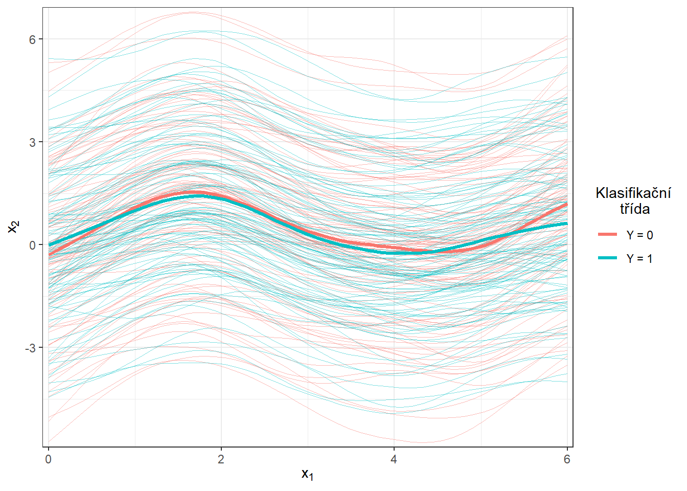

# Závislost na diskretizaci {#simulace3diskr}

V této části se budeme zabývat závislostí výsledků z předchozí sekce \@ref(simulace3) na hodnotě $p$, která definuje délku ekvidistantní posloupnosti bodů, které jsou použity k diskretizaci pozorovaných funkcionálních objektů. Bude nás zajímat, jak se mění chybovosti jednotlivých klasifikačních metod při zjemňování dělení intervalu, tedy při zvětšující se dimenzi diskretizovaných vektorů.

## Simulace funkcionálních dat

Nejprve si simulujeme funkce, které budeme následně chtít klasifikovat.
Budeme uvažovat pro jednoduchost dvě klasifikační třídy.
Pro simulaci nejprve:

-   zvolíme vhodné funkce,

-   generujeme body ze zvoleného intervalu, které obsahují, například gaussovský, šum,

-   takto získané diskrétní body vyhladíme do podoby funkcionálního objektu pomocí nějakého vhodného bázového systému.

Tímto postupem získáme funkcionální objekty společně s hodnotou kategoriální proměnné $Y$, která rozlišuje příslušnost do klasifikační třídy.


```r
# nacteme potrebne balicky 

library(fda)
library(ggplot2)
library(dplyr)
library(tidyr)
library(ddalpha)
library(polynom)

set.seed(42)
```

Uvažujme tedy dvě klasifikační třídy, $Y \in \{0, 1\}$, pro každou ze tříd stejný počet `n` generovaných funkcí.
Definujme si nejprve dvě funkce, každá bude pro jednu třídu.
Funkce budeme uvažovat na intervalu $I = [0, 6]$.

Nyní vytvoříme funkce pomocí interpolačních polynomů. Nejprve si definujeme body, kterými má procházet naše křivka, a následně jimi proložíme interpolační polynom, který použijeme pro generování křivek pro klasifikaci.


```r
# definujici body pro tridu 0
x.0 <- c(0.00, 0.65, 0.94, 1.42, 2.26, 2.84, 3.73, 4.50, 5.43, 6.00)
y.0 <- c(0, 0.25, 0.86, 1.49, 1.1, 0.15, -0.11, -0.36, 0.23, 0)

# definujici body pro tridu 1
x.1 <- c(0.00, 0.51, 0.91, 1.25, 1.51, 2.14, 2.43, 2.96, 3.70, 4.60,
         5.25, 5.67, 6.00)
y.1 <- c(0.1, 0.4, 0.71, 1.08, 1.47, 1.39, 0.81, 0.05, -0.1, -0.4,
         0.3, 0.37, 0)
```


```r
# graf bodu
dat_points <- data.frame(x = c(x.0, x.1),
                         y = c(y.0, y.1),
                         Class = rep(c('Y = 0', 'Y = 1'), 
                                     c(length(x.0), length(x.1))))

ggplot(dat_points, aes(x = x, y = y, colour = Class)) + 
  geom_point(size=1.5) + 
  theme_bw() + 
  labs(colour = 'Klasifikační\n      třída')
```


Pro výpočet interpolačních polynomů využijeme funkci `poly.calc()` z knihovny `polynom`. Dále definujeme funkce `poly.0()` a `poly.1()`, které budou počítat hodnoty polynomů v daném bodě intervalu. K jejich vytvoření použijeme funkci `predict()`, na jejíž vstup zadáme příslušný polynom a bod, ve kterám chceme polynom vyhodnotit.


```r
# vypocet polynomu
polynom.0 <- poly.calc(x.0, y.0)
polynom.1 <- poly.calc(x.1, y.1)
```


```r
poly.0 <- function(x) return(predict(polynom.0, x))
poly.1 <- function(x) return(predict(polynom.1, x))
```


```r
# vykresleni polynomu
xx <- seq(min(x.0), max(x.0), length = 501)
yy.0 <- poly.0(xx)
yy.1 <- poly.1(xx)

dat_poly_plot <- data.frame(x = c(xx, xx),
                            y = c(yy.0, yy.1),
                            Class = rep(c('Y = 0', 'Y = 1'), 
                                        c(length(xx), length(xx))))

ggplot(dat_points, aes(x = x, y = y, colour = Class)) + 
  geom_point(size=1.5) + 
  theme_bw() + 
  geom_line(data = dat_poly_plot,
            aes(x = x, y = y, colour = Class),
            linewidth = 0.8) + 
  labs(colour = 'Klasifikační\n      třída')
```

<div class="figure">

<p class="caption">(\#fig:unnamed-chunk-8)Znázornění dvou funkcí na intervalu $I = [0, 6]$, ze kterých generujeme pozorování ze tříd 0 a 1.</p>
</div>


```r
# generujici funkce pro Y = 0 a Y = 1
funkce_0 <- poly.0
funkce_1 <- poly.1
```


Nyní si vytvoříme funkci pro generování náhodných funkcí s přidaným šumem (resp. bodů na předem dané síti) ze zvolené generující funkce.
Argument `t` označuje vektor hodnot, ve kterých chceme dané funkce vyhodnotit, `fun` značí generující funkci, `n` počet funkcí a `sigma` směrodatnou odchylku $\sigma$ normálního rozdělení $\text{N}(\mu, \sigma^2)$, ze kterého náhodně generujeme gaussovský bílý šum s $\mu = 0$.
Abychom ukázali výhodu použití metod, které pracují s funkcionálními daty, přidáme při generování ke každému simulovanému pozorování navíc i náhodný člen, který bude mít význam vertikálního posunu celé funkce (parametr `sigma_shift`).
Tento posun budeme generovat s normálního rozdělení s parametrem $\sigma^2 = 4$.


```r
generate_values <- function(t, fun, n, sigma, sigma_shift = 0) {
  # Arguments:
  # t ... vector of values, where the function will be evaluated
  # fun ... generating function of t 
  # n ... the number of generated functions / objects
  # sigma ... standard deviation of normal distribution to add noise to data
  # sigma_shift ... parameter of normal distribution for generating shift
  
  # Value:
  # X ... matrix of dimension length(t) times n with generated values of one 
  # function in a column 
  
  X <- matrix(rep(t, times = n), ncol = n, nrow = length(t), byrow = FALSE)
  noise <- matrix(rnorm(n * length(t), mean = 0, sd = sigma),
                  ncol = n, nrow = length(t), byrow = FALSE)
  shift <- matrix(rep(rnorm(n, 0, sigma_shift), each = length(t)),
                  ncol = n, nrow = length(t))
  return(fun(X) + noise + shift)
}
```

Nyní můžeme generovat funkce.
V každé ze dvou tříd budeme uvažovat 100 pozorování, tedy `n = 100`.


```r
# pocet vygenerovanych pozorovani pro kazdou tridu
n <- 100
# vektor casu ekvidistantni na intervalu [0, 6]
t <- seq(0, 6, length = 51)

# pro Y = 0
X0 <- generate_values(t, funkce_0, n, 1, 2)
# pro Y = 1
X1 <- generate_values(t, funkce_1, n, 1, 2)
```

Vykreslíme vygenerované (ještě nevyhlazené) funkce barevně v závislosti na třídě (pouze prvních 10 pozorování z každé třídy pro přehlednost).


```r
n_curves_plot <- 10 # pocet krivek, ktere chceme vykreslit z kazde skupiny

DF0 <- cbind(t, X0[, 1:n_curves_plot]) |> 
  as.data.frame() |> 
  reshape(varying = 2:(n_curves_plot + 1), direction = 'long', sep = '') |> 
  subset(select = -id) |> 
  mutate(
  time = time - 1,
  group = 0
  )

DF1 <- cbind(t, X1[, 1:n_curves_plot]) |> 
  as.data.frame() |> 
  reshape(varying = 2:(n_curves_plot + 1), direction = 'long', sep = '') |> 
  subset(select = -id) |> 
  mutate(
  time = time - 1,
  group = 1
  )

DF <- rbind(DF0, DF1) |>
  mutate(group = factor(group))

DF |> ggplot(aes(x = t, y = V, group = interaction(time, group), 
                 colour = group)) + 
  geom_line(linewidth = 0.5) +
  theme_bw() +
  labs(x = expression(x[1]),
       y = expression(x[2]),
       colour = 'Klasifikační\n      třída') +
  scale_colour_discrete(labels=c('Y = 0', 'Y = 1'))
```

<div class="figure">

<p class="caption">(\#fig:unnamed-chunk-13)Prvních 10 vygenerovaných pozorování z každé ze dvou klasifikačních tříd. Pozorovaná data nejsou vyhlazená.</p>
</div>

## Vyhlazení pozorovaných křivek

Nyní převedeme pozorované diskrétní hodnoty (vektory hodnot) na funkcionální objekty, se kterými budeme následně pracovat.
Opět využijeme k vyhlazení B-sline bázi.

Za uzly bereme celý vektor `t`, standardně uvažujeme kubické spliny, proto volíme (implicitní volba v `R`) `norder = 4`.
Budeme penalizovat druhou derivaci funkcí.


```r
rangeval <- range(t)
breaks <- t
norder <- 4

bbasis <- create.bspline.basis(rangeval = rangeval, 
                               norder = norder, 
                               breaks = breaks)

curv.Lfd <- int2Lfd(2) # penalizujeme 2. derivaci
```

Najdeme vhodnou hodnotu vyhlazovacího parametru $\lambda > 0$ pomocí $GCV(\lambda)$, tedy pomocí zobecněné cross--validace.
Hodnotu $\lambda$ budeme uvažovat pro obě klasifikační skupiny stejnou, neboť pro testovací pozorování bychom dopředu nevěděli, kterou hodnotu $\lambda$, v případě rozdílné volby pro každou třídu, máme volit.


```r
# spojeni pozorovani do jedne matice
XX <- cbind(X0, X1)

lambda.vect <- 10^seq(from = -2, to = 1, length.out = 50) # vektor lambd
gcv <- rep(NA, length = length(lambda.vect)) # prazdny vektor pro ulozebi GCV

for(index in 1:length(lambda.vect)) {
  curv.Fdpar <- fdPar(bbasis, curv.Lfd, lambda.vect[index])
  BSmooth <- smooth.basis(t, XX, curv.Fdpar) # vyhlazeni
  gcv[index] <- mean(BSmooth$gcv) # prumer pres vsechny pozorovane krivky
}

GCV <- data.frame(
  lambda = round(log10(lambda.vect), 3),
  GCV = gcv
)

# najdeme hodnotu minima
lambda.opt <- lambda.vect[which.min(gcv)]
```

Pro lepší znázornění si vykreslíme průběh $GCV(\lambda)$.


```r
GCV |> ggplot(aes(x = lambda, y = GCV)) + 
  geom_line(linetype = 'solid', linewidth = 0.6) + 
  geom_point(size = 1.5) + 
  theme_bw() + 
  labs(x = bquote(paste(log[10](lambda), ' ;   ', 
                        lambda[optimal] == .(round(lambda.opt, 4)))),
       y = expression(GCV(lambda))) + 
  geom_point(aes(x = log10(lambda.opt), y = min(gcv)), colour = 'red', size = 2.5)
```

<div class="figure">

<p class="caption">(\#fig:unnamed-chunk-16)Průběh $GCV(\lambda)$ pro zvolený vektor $\boldsymbol\lambda$. Na ose $x$ jsou hodnoty vyneseny v logaritmické škále. Červeně je znázorněna optimální hodnota vyhlazovacího parametru $\lambda_{optimal}$.</p>
</div>

S touto optimální volbou vyhlazovacího parametru $\lambda$ nyní vyhladíme všechny funkce a opět znázorníme graficky prvních 10 pozorovaných křivek z každé klasifikační třídy.


```r
curv.fdPar <- fdPar(bbasis, curv.Lfd, lambda.opt)
BSmooth <- smooth.basis(t, XX, curv.fdPar)
XXfd <- BSmooth$fd

fdobjSmootheval <- eval.fd(fdobj = XXfd, evalarg = t)
DF$Vsmooth <- c(fdobjSmootheval[, c(1 : n_curves_plot, 
                                    (n + 1) : (n + n_curves_plot))])

DF |> ggplot(aes(x = t, y = Vsmooth, group = interaction(time, group), 
                 colour = group)) + 
  geom_line(linewidth = 0.75) +
  theme_bw() +
  labs(x = expression(x[1]),
       y = expression(x[2]),
       colour = 'Klasifikační\n      třída') +
  scale_colour_discrete(labels=c('Y = 0', 'Y = 1'))
```

<div class="figure">

<p class="caption">(\#fig:unnamed-chunk-17)Prvních 10 vyhlazených křivek z každé klasifikační třídy.</p>
</div>

Ještě znázorněme všechny křivky včetně průměru zvlášť pro každou třídu.


```r
DFsmooth <- data.frame(
  t = rep(t, 2 * n),
  time = rep(rep(1:n, each = length(t)), 2),
  Smooth = c(fdobjSmootheval),
  Mean = c(rep(apply(fdobjSmootheval[ , 1 : n], 1, mean), n),
            rep(apply(fdobjSmootheval[ , (n + 1) : (2 * n)], 1, mean), n)),
  group = factor(rep(c(0, 1), each = n * length(t)))
)

DFmean <- data.frame(
  t = rep(t, 2),
  Mean = c(apply(fdobjSmootheval[ , 1 : n], 1, mean), 
            apply(fdobjSmootheval[ , (n + 1) : (2 * n)], 1, mean)),
  group = factor(rep(c(0, 1), each = length(t)))
)

DFsmooth |> ggplot(aes(x = t, y = Smooth, group = interaction(time, group), 
                 colour = group)) + 
  geom_line(linewidth = 0.25, alpha = 0.5) +
  theme_bw() +
  labs(x = expression(x[1]),
       y = expression(x[2]),
       colour = 'Klasifikační\n      třída') +
  scale_colour_discrete(labels = c('Y = 0', 'Y = 1')) + 
  geom_line(aes(x = t, y = Mean, colour = group), 
            linewidth = 1.2, linetype = 'solid') + 
  scale_x_continuous(expand = c(0.01, 0.01)) + 
  #ylim(c(-1, 2)) + 
  scale_y_continuous(expand = c(0.01, 0.01))#, limits = c(-1, 2))
```

<div class="figure">

<p class="caption">(\#fig:unnamed-chunk-18)Vykreslení všech vyhlazených pozorovaných křivek, barevně jsou odlišeny křivky podle příslušnosti do klasifikační třídy. Černou čerchovanou čarou je zakreslen průměr pro každou třídu.</p>
</div>


```r
DFsmooth <- data.frame(
  t = rep(t, 2 * n),
  time = rep(rep(1:n, each = length(t)), 2),
  Smooth = c(fdobjSmootheval),
  Mean = c(rep(apply(fdobjSmootheval[ , 1 : n], 1, mean), n),
            rep(apply(fdobjSmootheval[ , (n + 1) : (2 * n)], 1, mean), n)),
  group = factor(rep(c(0, 1), each = n * length(t)))
)

DFmean <- data.frame(
  t = rep(t, 2),
  Mean = c(apply(fdobjSmootheval[ , 1 : n], 1, mean), 
            apply(fdobjSmootheval[ , (n + 1) : (2 * n)], 1, mean)),
  group = factor(rep(c(0, 1), each = length(t)))
)

DFsmooth |> ggplot(aes(x = t, y = Smooth, group = interaction(time, group), 
                 colour = group)) + 
  geom_line(linewidth = 0.25, alpha = 0.5) +
  theme_bw() +
  labs(x = expression(x[1]),
       y = expression(x[2]),
       colour = 'Klasifikační\n      třída') +
  scale_colour_discrete(labels = c('Y = 0', 'Y = 1')) + 
  geom_line(aes(x = t, y = Mean, colour = group), 
            linewidth = 1.2, linetype = 'solid') + 
  scale_x_continuous(expand = c(0.01, 0.01)) + 
  #ylim(c(-1, 2)) + 
  scale_y_continuous(expand = c(0.01, 0.01), limits = c(-1, 2))
```

<div class="figure">

<p class="caption">(\#fig:unnamed-chunk-19)Vykreslení všech vyhlazených pozorovaných křivek, barevně jsou odlišeny křivky podle příslušnosti do klasifikační třídy. Černou čerchovanou čarou je zakreslen průměr pro každou třídu. Přiblížený pohled.</p>
</div>

## Klasifikace křivek

Nejprve načteme potřebné knihovny pro klasifikaci.


```r
library(caTools) # pro rozdeleni na testovaci a trenovaci
library(caret) # pro k-fold CV
library(fda.usc) # pro KNN, fLR
library(MASS) # pro LDA
library(fdapace)
library(pracma)
library(refund) # pro LR na skorech
library(nnet) # pro LR na skorech
library(caret)
library(rpart) # stromy
library(rattle) # grafika
library(e1071)
library(randomForest) # nahodny les
```

