# Simulace 4 {#simulace4}

V této poslední sekci věnující se simulovaným datům se budeme zabývat stejnými daty jako v sekci \@ref(simulace3) (případně také v sekcích \@ref(simulace3sigma) a \@ref(simulace3shift)), tedy půjde o generování funkcionálních dat z funkcí vypočtených pomocí interpolačních polynomů. Jelikož jsme v sekci \@ref(simulace3) generovali data s náhodným vertikálním posunem s parametrem směrodatné odchylky $\sigma_{shift}$, mohli bychom se pokusit odstranit tento posun a klasifikovat data po odstranění tohoto posunu. Viděli jsme totiž v sekci \@ref(simulace3shift), že se zvětšující se hodnotou parametru směrodatné odchylky $\sigma_{shift}$ se úspěšnost, zejména klasických klasifikačních metod, poměrně dramaticky zhoršuje. 
Naopak klasifikační metody beroucí do úvahy funkcionální podstatu dat se zpravidla i se zvětšující se hodnotou $\sigma_{shift}$ chovají poměrně stabilně. 

Jednou z možností k odstranění vertikálního posunutí, kterou využijeme v následující části, je klasifikovat data na základě odhadu první derivace dané vygenerované a vyhlazené křivky, neboť jak známo
$$
\frac{\text d}{\text d t} \big( x(t) + c \big) = \frac{\text d}{\text d t} x(t)= x'(t).
$$

## Klasifikace na základě první derivace

Nejprve si simulujeme funkce, které budeme následně chtít klasifikovat.
Budeme uvažovat pro jednoduchost dvě klasifikační třídy.
Pro simulaci nejprve:

-   zvolíme vhodné funkce,

-   generujeme body ze zvoleného intervalu, které obsahují, například gaussovský, šum,

-   takto získané diskrétní body vyhladíme do podoby funkcionálního objektu pomocí nějakého vhodného bázového systému.

Tímto postupem získáme funkcionální objekty společně s hodnotou kategoriální proměnné $Y$, která rozlišuje příslušnost do klasifikační třídy.


```r
# nacteme potrebne balicky 

library(fda)
library(ggplot2)
library(dplyr)
library(tidyr)
library(ddalpha)
library(polynom)
library(tikzDevice)

set.seed(42)
```

Uvažujme tedy dvě klasifikační třídy, $Y \in \{0, 1\}$, pro každou ze tříd stejný počet `n` generovaných funkcí.
Definujme si nejprve dvě funkce, každá bude pro jednu třídu.
Funkce budeme uvažovat na intervalu $I = [0, 6]$.

Nyní vytvoříme funkce pomocí interpolačních polynomů. Nejprve si definujeme body, kterými má procházet naše křivka, a následně jimi proložíme interpolační polynom, který použijeme pro generování křivek pro klasifikaci.


```r
# definujici body pro tridu 0
x.0 <- c(0.00, 0.65, 0.94, 1.42, 2.26, 2.84, 3.73, 4.50, 5.43, 6.00)
y.0 <- c(0, 0.25, 0.86, 1.49, 1.1, 0.15, -0.11, -0.36, 0.23, 0)

# definujici body pro tridu 1
x.1 <- c(0.00, 0.51, 0.91, 1.25, 1.51, 2.14, 2.43, 2.96, 3.70, 4.60,
         5.25, 5.67, 6.00)
y.1 <- c(0.1, 0.4, 0.71, 1.08, 1.47, 1.39, 0.81, 0.05, -0.1, -0.4,
         0.3, 0.37, 0)
```


```r
# graf bodu
dat_points <- data.frame(x = c(x.0, x.1),
                         y = c(y.0, y.1),
                         Class = rep(c('Y = 0', 'Y = 1'), 
                                     c(length(x.0), length(x.1))))

ggplot(dat_points, aes(x = x, y = y, colour = Class)) + 
  geom_point(size=1.5) + 
  theme_bw() + 
  labs(colour = 'Klasifikační\n      třída')
```


Pro výpočet interpolačních polynomů využijeme funkci `poly.calc()` z knihovny `polynom`. Dále definujeme funkce `poly.0()` a `poly.1()`, které budou počítat hodnoty polynomů v daném bodě intervalu. K jejich vytvoření použijeme funkci `predict()`, na jejíž vstup zadáme příslušný polynom a bod, ve kterám chceme polynom vyhodnotit.


```r
# vypocet polynomu
polynom.0 <- poly.calc(x.0, y.0)
polynom.1 <- poly.calc(x.1, y.1)
```


```r
poly.0 <- function(x) return(predict(polynom.0, x))
poly.1 <- function(x) return(predict(polynom.1, x))
```


```r
# vykresleni polynomu
xx <- seq(min(x.0), max(x.0), length = 501)
yy.0 <- poly.0(xx)
yy.1 <- poly.1(xx)

dat_poly_plot <- data.frame(x = c(xx, xx),
                            y = c(yy.0, yy.1),
                            Class = rep(c('Y = 0', 'Y = 1'), 
                                        c(length(xx), length(xx))))

ggplot(dat_points, aes(x = x, y = y, colour = Class)) + 
  geom_point(size=1.5) + 
  theme_bw() + 
  geom_line(data = dat_poly_plot,
            aes(x = x, y = y, colour = Class),
            linewidth = 0.8) + 
  labs(colour = 'Klasifikační\n      třída')
```

<div class="figure">

<p class="caption">(\#fig:unnamed-chunk-8)Znázornění dvou funkcí na intervalu $I = [0, 6]$, ze kterých generujeme pozorování ze tříd 0 a 1.</p>
</div>


```r
# generujici funkce pro Y = 0 a Y = 1
funkce_0 <- poly.0
funkce_1 <- poly.1
```


Nyní si vytvoříme funkci pro generování náhodných funkcí s přidaným šumem (resp. bodů na předem dané síti) ze zvolené generující funkce.
Argument `t` označuje vektor hodnot, ve kterých chceme dané funkce vyhodnotit, `fun` značí generující funkci, `n` počet funkcí a `sigma` směrodatnou odchylku $\sigma$ normálního rozdělení $\text{N}(\mu, \sigma^2)$, ze kterého náhodně generujeme gaussovský bílý šum s $\mu = 0$.
Abychom ukázali výhodu použití metod, které pracují s funkcionálními daty, přidáme při generování ke každému simulovanému pozorování navíc i náhodný člen, který bude mít význam vertikálního posunu celé funkce (parametr `sigma_shift`).
Tento posun budeme generovat s normálního rozdělení s parametrem $\sigma^2 = 4$.


```r
generate_values <- function(t, fun, n, sigma, sigma_shift = 0) {
  # Arguments:
  # t ... vector of values, where the function will be evaluated
  # fun ... generating function of t 
  # n ... the number of generated functions / objects
  # sigma ... standard deviation of normal distribution to add noise to data
  # sigma_shift ... parameter of normal distribution for generating shift
  
  # Value:
  # X ... matrix of dimension length(t) times n with generated values of one 
  # function in a column 
  
  X <- matrix(rep(t, times = n), ncol = n, nrow = length(t), byrow = FALSE)
  noise <- matrix(rnorm(n * length(t), mean = 0, sd = sigma),
                  ncol = n, nrow = length(t), byrow = FALSE)
  shift <- matrix(rep(rnorm(n, 0, sigma_shift), each = length(t)),
                  ncol = n, nrow = length(t))
  return(fun(X) + noise + shift)
}
```

Nyní můžeme generovat funkce.
V každé ze dvou tříd budeme uvažovat 100 pozorování, tedy `n = 100`.


```r
# pocet vygenerovanych pozorovani pro kazdou tridu
n <- 100
# vektor casu ekvidistantni na intervalu [0, 6]
t <- seq(0, 6, length = 51)

# pro Y = 0
X0 <- generate_values(t, funkce_0, n, 1, 2)
# pro Y = 1
X1 <- generate_values(t, funkce_1, n, 1, 2)
```

Vykreslíme vygenerované (ještě nevyhlazené) funkce barevně v závislosti na třídě (pouze prvních 10 pozorování z každé třídy pro přehlednost).


```r
n_curves_plot <- 10 # pocet krivek, ktere chceme vykreslit z kazde skupiny

DF0 <- cbind(t, X0[, 1:n_curves_plot]) |> 
  as.data.frame() |> 
  reshape(varying = 2:(n_curves_plot + 1), direction = 'long', sep = '') |> 
  subset(select = -id) |> 
  mutate(
  time = time - 1,
  group = 0
  )

DF1 <- cbind(t, X1[, 1:n_curves_plot]) |> 
  as.data.frame() |> 
  reshape(varying = 2:(n_curves_plot + 1), direction = 'long', sep = '') |> 
  subset(select = -id) |> 
  mutate(
  time = time - 1,
  group = 1
  )

DF <- rbind(DF0, DF1) |>
  mutate(group = factor(group))

DF |> ggplot(aes(x = t, y = V, group = interaction(time, group), 
                 colour = group)) + 
  geom_line(linewidth = 0.5) +
  theme_bw() +
  labs(x = expression(x[1]),
       y = expression(x[2]),
       colour = 'Klasifikační\n      třída') +
  scale_colour_discrete(labels=c('Y = 0', 'Y = 1'))
```

<div class="figure">

<p class="caption">(\#fig:unnamed-chunk-13)Prvních 10 vygenerovaných pozorování z každé ze dvou klasifikačních tříd. Pozorovaná data nejsou vyhlazená.</p>
</div>

### Vyhlazení pozorovaných křivek

Nyní převedeme pozorované diskrétní hodnoty (vektory hodnot) na funkcionální objekty, se kterými budeme následně pracovat.
Opět využijeme k vyhlazení B-sline bázi.

Za uzly bereme celý vektor `t`, jelikož uvažujeme první derivaci, volíme `norder = 5`.
Budeme penalizovat třetí derivaci funkcí, neboť nyní požadujeme hladké i první derivace.


```r
rangeval <- range(t)
breaks <- t
norder <- 5

bbasis <- create.bspline.basis(rangeval = rangeval, 
                               norder = norder, 
                               breaks = breaks)

curv.Lfd <- int2Lfd(3) # penalizujeme 3. derivaci
```

Najdeme vhodnou hodnotu vyhlazovacího parametru $\lambda > 0$ pomocí $GCV(\lambda)$, tedy pomocí zobecněné cross--validace.
Hodnotu $\lambda$ budeme uvažovat pro obě klasifikační skupiny stejnou, neboť pro testovací pozorování bychom dopředu nevěděli, kterou hodnotu $\lambda$, v případě rozdílné volby pro každou třídu, máme volit.


```r
# spojeni pozorovani do jedne matice
XX <- cbind(X0, X1)

lambda.vect <- 10^seq(from = -3, to = 1, length.out = 50) # vektor lambd
gcv <- rep(NA, length = length(lambda.vect)) # prazdny vektor pro ulozebi GCV

for(index in 1:length(lambda.vect)) {
  curv.Fdpar <- fdPar(bbasis, curv.Lfd, lambda.vect[index])
  BSmooth <- smooth.basis(t, XX, curv.Fdpar) # vyhlazeni
  gcv[index] <- mean(BSmooth$gcv) # prumer pres vsechny pozorovane krivky
}

GCV <- data.frame(
  lambda = round(log10(lambda.vect), 3),
  GCV = gcv
)

# najdeme hodnotu minima
lambda.opt <- lambda.vect[which.min(gcv)]
```

Pro lepší znázornění si vykreslíme průběh $GCV(\lambda)$.


```r
GCV |> ggplot(aes(x = lambda, y = GCV)) + 
  geom_line(linetype = 'solid', linewidth = 0.6) + 
  geom_point(size = 1.5) + 
  theme_bw() + 
  labs(x = bquote(paste(log[10](lambda), ' ;   ', 
                        lambda[optimal] == .(round(lambda.opt, 4)))),
       y = expression(GCV(lambda))) + 
  geom_point(aes(x = log10(lambda.opt), y = min(gcv)), colour = 'red', size = 2.5)
```

<div class="figure">
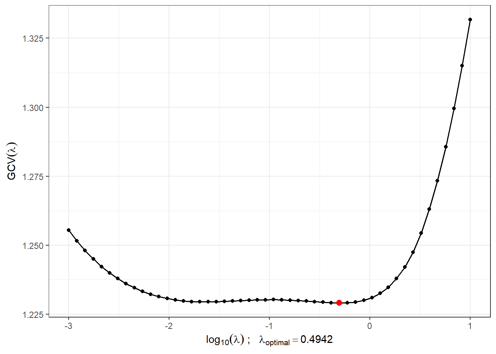
<p class="caption">(\#fig:unnamed-chunk-16)Průběh $GCV(\lambda)$ pro zvolený vektor $\boldsymbol\lambda$. Na ose $x$ jsou hodnoty vyneseny v logaritmické škále. Červeně je znázorněna optimální hodnota vyhlazovacího parametru $\lambda_{optimal}$.</p>
</div>

S touto optimální volbou vyhlazovacího parametru $\lambda$ nyní vyhladíme všechny funkce a opět znázorníme graficky prvních 10 pozorovaných křivek z každé klasifikační třídy.


```r
curv.fdPar <- fdPar(bbasis, curv.Lfd, lambda.opt)
BSmooth <- smooth.basis(t, XX, curv.fdPar)
XXfd <- BSmooth$fd

fdobjSmootheval <- eval.fd(fdobj = XXfd, evalarg = t)
DF$Vsmooth <- c(fdobjSmootheval[, c(1 : n_curves_plot, 
                                    (n + 1) : (n + n_curves_plot))])

DF |> ggplot(aes(x = t, y = Vsmooth, group = interaction(time, group), 
                 colour = group)) + 
  geom_line(linewidth = 0.75) +
  theme_bw() +
  labs(x = expression(x[1]),
       y = expression(x[2]),
       colour = 'Klasifikační\n      třída') +
  scale_colour_discrete(labels=c('Y = 0', 'Y = 1'))
```

<div class="figure">

<p class="caption">(\#fig:unnamed-chunk-17)Prvních 10 vyhlazených křivek z každé klasifikační třídy.</p>
</div>

Ještě znázorněme všechny křivky včetně průměru zvlášť pro každou třídu.


```r
DFsmooth <- data.frame(
  t = rep(t, 2 * n),
  time = rep(rep(1:n, each = length(t)), 2),
  Smooth = c(fdobjSmootheval),
  Mean = c(rep(apply(fdobjSmootheval[ , 1 : n], 1, mean), n),
            rep(apply(fdobjSmootheval[ , (n + 1) : (2 * n)], 1, mean), n)),
  group = factor(rep(c(0, 1), each = n * length(t)))
)

DFmean <- data.frame(
  t = rep(t, 2),
  Mean = c(apply(fdobjSmootheval[ , 1 : n], 1, mean), 
            apply(fdobjSmootheval[ , (n + 1) : (2 * n)], 1, mean)),
  group = factor(rep(c(0, 1), each = length(t)))
)

DFsmooth |> ggplot(aes(x = t, y = Smooth, group = interaction(time, group), 
                 colour = group)) + 
  geom_line(linewidth = 0.25, alpha = 0.5) +
  theme_bw() +
  labs(x = expression(x[1]),
       y = expression(x[2]),
       colour = 'Klasifikační\n      třída') +
  scale_colour_discrete(labels = c('Y = 0', 'Y = 1')) + 
  geom_line(aes(x = t, y = Mean, colour = group), 
            linewidth = 1.2, linetype = 'solid') + 
  scale_x_continuous(expand = c(0.01, 0.01)) + 
  #ylim(c(-1, 2)) + 
  scale_y_continuous(expand = c(0.01, 0.01))#, limits = c(-1, 2))
```

<div class="figure">

<p class="caption">(\#fig:unnamed-chunk-18)Vykreslení všech vyhlazených pozorovaných křivek, barevně jsou odlišeny křivky podle příslušnosti do klasifikační třídy. Černou čerchovanou čarou je zakreslen průměr pro každou třídu.</p>
</div>


```r
DFsmooth <- data.frame(
  t = rep(t, 2 * n),
  time = rep(rep(1:n, each = length(t)), 2),
  Smooth = c(fdobjSmootheval),
  Mean = c(rep(apply(fdobjSmootheval[ , 1 : n], 1, mean), n),
            rep(apply(fdobjSmootheval[ , (n + 1) : (2 * n)], 1, mean), n)),
  group = factor(rep(c(0, 1), each = n * length(t)))
)

DFmean <- data.frame(
  t = rep(t, 2),
  Mean = c(apply(fdobjSmootheval[ , 1 : n], 1, mean), 
            apply(fdobjSmootheval[ , (n + 1) : (2 * n)], 1, mean)),
  group = factor(rep(c(0, 1), each = length(t)))
)

DFsmooth |> ggplot(aes(x = t, y = Smooth, group = interaction(time, group), 
                 colour = group)) + 
  geom_line(linewidth = 0.25, alpha = 0.5) +
  theme_bw() +
  labs(x = expression(x[1]),
       y = expression(x[2]),
       colour = 'Klasifikační\n      třída') +
  scale_colour_discrete(labels = c('Y = 0', 'Y = 1')) + 
  geom_line(aes(x = t, y = Mean, colour = group), 
            linewidth = 1.2, linetype = 'solid') + 
  scale_x_continuous(expand = c(0.01, 0.01)) + 
  #ylim(c(-1, 2)) + 
  scale_y_continuous(expand = c(0.01, 0.01), limits = c(-1, 2))
```

<div class="figure">
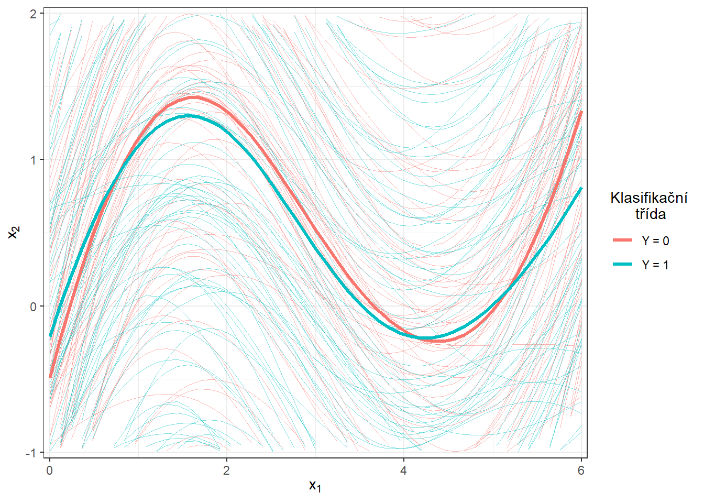
<p class="caption">(\#fig:unnamed-chunk-19)Vykreslení všech vyhlazených pozorovaných křivek, barevně jsou odlišeny křivky podle příslušnosti do klasifikační třídy. Černou čerchovanou čarou je zakreslen průměr pro každou třídu. Přiblížený pohled.</p>
</div>

### Výpočet derivací

K výpočtu derivace pro funkcionální objekt využijeme v `R` funkci `deriv.fd()` z balíčku `fda`. Jelikož chceme klasifikovat na základě první derivace, volíme argument `Lfdobj = 1`.


```r
XXder <- deriv.fd(XXfd, 1)
```

Nyní si vykresleme prvních několik prvních derivací pro obě klasifikační třídy. Všimněme si z obrázku níže, že se opravdu vertikální posun pomocí derivování opravdu podařilo odstranit. Ztratili jsme tím ale do jisté míry rozdílnost mezi křivkami, protože jak z obrázku vyplývá, křivky derivací pro obě třídy se liší primárně až ke konci intervalu, tedy pro argument v rozmezí přibližně $[5, 6]$.


```r
fdobjSmootheval <- eval.fd(fdobj = XXder, evalarg = t)
DF$Vsmooth <- c(fdobjSmootheval[, c(1 : n_curves_plot, 
                                    (n + 1) : (n + n_curves_plot))])

DF |> ggplot(aes(x = t, y = Vsmooth, group = interaction(time, group), 
                 colour = group)) + 
  geom_line(linewidth = 0.75) +
  theme_bw() +
  labs(x = expression(x[1]),
       y = expression(x[2]),
       colour = 'Klasifikační\n      třída') +
  scale_colour_discrete(labels=c('Y = 0', 'Y = 1'))
```


Ještě znázorněme všechny křivky včetně průměru zvlášť pro každou třídu.


```r
abs.labs <- paste("Klasifikační třída:", c("$Y = 0$", "$Y = 1$"))
names(abs.labs) <- c('0', '1')

# fdobjSmootheval <- eval.fd(fdobj = XXfd, evalarg = t)

DFsmooth <- data.frame(
  t = rep(t, 2 * n),
  time = rep(rep(1:n, each = length(t)), 2),
  Smooth = c(fdobjSmootheval),
  group = factor(rep(c(0, 1), each = n * length(t)))
)

DFmean <- data.frame(
  t = rep(t, 2),
  Mean = c(eval.fd(fdobj = mean.fd(XXder[1:n]), evalarg = t),
           eval.fd(fdobj = mean.fd(XXder[(n + 1):(2 * n)]), evalarg = t)),
  group = factor(rep(c(0, 1), each = length(t)))
)

DFsmooth |> ggplot(aes(x = t, y = Smooth, #group = interaction(time, group), 
                 colour = group)) + 
  geom_line(aes(group = time), linewidth = 0.05, alpha = 0.5) +
  theme_bw() +
  labs(x = "$t$",
       # y = "$\\frac{\\text d}{\\text d t} x_i(t)$",
       y ="$x_i'(t)$",
       colour = 'Klasifikační\n      třída') +
  # geom_line(data = DFsmooth |> 
  #             mutate(group = factor(ifelse(group == '0', '1', '0'))) |> 
  #             filter(group == '1'),
  #           aes(x = t, y = Mean, colour = group), 
  #           colour = 'tomato', linewidth = 0.8, linetype = 'solid') + 
  # geom_line(data = DFsmooth |> 
  #             mutate(group = factor(ifelse(group == '0', '1', '0'))) |> 
  #             filter(group == '0'),
  #           aes(x = t, y = Mean, colour = group), 
  #           colour = 'deepskyblue2', linewidth = 0.8, linetype = 'solid') + 
  geom_line(data = DFmean |> 
              mutate(group = factor(ifelse(group == '0', '1', '0'))),
            aes(x = t, y = Mean, colour = group), 
            colour = 'grey2', linewidth = 0.8, linetype = 'dashed') + 
  geom_line(data = DFmean, aes(x = t, y = Mean, colour = group), 
            colour = 'grey2', linewidth = 1.25, linetype = 'solid') + 
  scale_x_continuous(expand = c(0.01, 0.01)) +
  facet_wrap(~group, labeller = labeller(group = abs.labs)) +
  scale_y_continuous(expand = c(0.02, 0.02)) +
  theme(legend.position = 'none',
        plot.margin = unit(c(0.1, 0.1, 0.3, 0.5), "cm")) +
  coord_cartesian(ylim = c(-1.4, 3.5)) +
  scale_colour_manual(values = c('tomato', 'deepskyblue2'))
```

<div class="figure">

<p class="caption">(\#fig:unnamed-chunk-23)Vykreslení všech vyhlazených pozorovaných křivek, barevně jsou odlišeny křivky podle příslušnosti do klasifikační třídy. Černou čerchovanou čarou je zakreslen průměr pro každou třídu.</p>
</div>

```r
# ggsave("figures/kap6_sim_04_curves_1der.tex", device = tikz, width = 8, height = 4)
```


```r
DFsmooth <- data.frame(
  t = rep(t, 2 * n),
  time = rep(rep(1:n, each = length(t)), 2),
  Smooth = c(fdobjSmootheval),
  Mean = c(rep(apply(fdobjSmootheval[ , 1 : n], 1, mean), n),
            rep(apply(fdobjSmootheval[ , (n + 1) : (2 * n)], 1, mean), n)),
  group = factor(rep(c(0, 1), each = n * length(t)))
)

DFmean <- data.frame(
  t = rep(t, 2),
  Mean = c(apply(fdobjSmootheval[ , 1 : n], 1, mean), 
            apply(fdobjSmootheval[ , (n + 1) : (2 * n)], 1, mean)),
  group = factor(rep(c(0, 1), each = length(t)))
)

DFsmooth |> ggplot(aes(x = t, y = Smooth, group = interaction(time, group), 
                 colour = group)) + 
  geom_line(linewidth = 0.25, alpha = 0.5) +
  theme_bw() +
  labs(x = expression(x[1]),
       y = expression(x[2]),
       colour = 'Klasifikační\n      třída') +
  scale_colour_discrete(labels = c('Y = 0', 'Y = 1')) + 
  geom_line(aes(x = t, y = Mean), colour = 'grey3', 
            linewidth = 0.7, linetype = 'dashed') + 
  scale_x_continuous(expand = c(0.01, 0.01)) + 
  #ylim(c(-1, 2)) + 
  scale_y_continuous(expand = c(0.01, 0.01), limits = c(-1.5, 2))
```

<div class="figure">

<p class="caption">(\#fig:unnamed-chunk-24)Vykreslení všech vyhlazených pozorovaných křivek, barevně jsou odlišeny křivky podle příslušnosti do klasifikační třídy. Černou čerchovanou čarou je zakreslen průměr pro každou třídu. Přiblížený pohled.</p>
</div>


### Klasifikace křivek

Nejprve načteme potřebné knihovny pro klasifikaci.


```r
library(caTools) # pro rozdeleni na testovaci a trenovaci
library(caret) # pro k-fold CV
library(fda.usc) # pro KNN, fLR
library(MASS) # pro LDA
library(fdapace)
library(pracma)
library(refund) # pro LR na skorech
library(nnet) # pro LR na skorech
library(caret)
library(rpart) # stromy
library(rattle) # grafika
library(e1071)
library(randomForest) # nahodny les
```

Abychom mohli jednotlivé klasifikátory porovnat, rozdělíme množinu vygenerovaných pozorování na dvě části v poměru 70:30, a to na trénovací a testovací (validační) část.
Trénovací část použijeme při konstrukci klasifikátoru a testovací na výpočet chyby klasifikace a případně dalších charakteristik našeho modelu.
Výsledné klasifikátory podle těchto spočtených charakteristik můžeme následně porovnat mezi sebou z pohledu jejich úspěnosti klasifikace.


```r
# rozdeleni na testovaci a trenovaci cast
split <- sample.split(XXder$fdnames$reps, SplitRatio = 0.7)

Y <- rep(c(0, 1), each = n)

X.train <- subset(XXder, split == TRUE)
X.test <- subset(XXder, split == FALSE)

Y.train <- subset(Y, split == TRUE)
Y.test <- subset(Y, split == FALSE)
```

Ještě se podíváme na zastoupení jednotlivých skupin v testovací a trénovací části dat.


```r
# absolutni zastoupeni
table(Y.train)
```

```
## Y.train
##  0  1 
## 71 69
```

```r
table(Y.test)
```

```
## Y.test
##  0  1 
## 29 31
```

```r
# relativni zastoupeni
table(Y.train) / sum(table(Y.train))
```

```
## Y.train
##         0         1 
## 0.5071429 0.4928571
```

```r
table(Y.test) / sum(table(Y.test))
```

```
## Y.test
##         0         1 
## 0.4833333 0.5166667
```

#### $K$ nejbližších sousedů

Začněme neparametrickou klasifikační metodou, a to metodou $K$ nejbližších sousedů.
Nejprve si vytvoříme potřebné objekty tak, abychom s nimi mohli pomocí funkce `classif.knn()` z knihovny `fda.usc` dále pracovat.


```r
x.train <- fdata(X.train)
y.train <- as.numeric(factor(Y.train))
```

Nyní můžeme definovat model a podívat se na jeho úspěšnost klasifikace.
Poslední otázkou však zůstává, jak volit optimální počet sousedů $K$.
Mohli bychom tento počet volit jako takové $K$, při kterém nastává minimální chybovost na trénovacích datech.
To by ale mohlo vést k přeučení modelu, proto využijeme cross-validaci.
Vzhledem k výpočetní náročnosti a rozsahu souboru zvolíme $k$-násobnou CV, my zvolíme například hodnotu $k = {10}$.


```r
# model pro vsechna trenovaci data pro K = 1, 2, ..., sqrt(n_train)
neighb.model <- classif.knn(group = y.train, 
                            fdataobj = x.train, 
                            knn = c(1:round(sqrt(length(y.train))))) 

summary(neighb.model) # shrnuti modelu
```

```
##      - SUMMARY - 
## 
## -Probability of correct classification by group (prob.classification):
## y
##         1         2 
## 0.7464789 0.6376812 
## 
## -Confusion matrix between the theoretical groups (by rows)
##   and estimated groups (by column) 
##    
##      1  2
##   1 53 18
##   2 25 44
## 
## -Vector of probability of correct classification
##    by number of neighbors (knn):
##      1      2      3      4      5      6      7      8      9     10     11 
## 0.6143 0.6357 0.6357 0.6000 0.6429 0.6286 0.6357 0.6643 0.6786 0.6857 0.6857 
##     12 
## 0.6929 
## 
## -Optimal number of neighbors: knn.opt= 12 
## with highest probability of correct classification max.prob=  0.6928571 
## 
## -Probability of correct classification:  0.6929
```

```r
plot(neighb.model$gcv, pch = 16) # vykresleni zavislosti GCV na poctu sousedu K
```

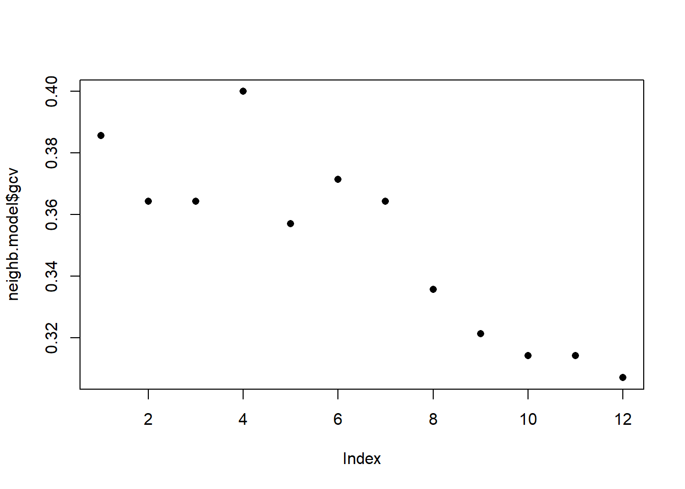

```r
neighb.model$max.prob # maximalni presnost
```

```
## [1] 0.6928571
```

```r
(K.opt <- neighb.model$h.opt) # optimalni hodnota K
```

```
## [1] 12
```

Proveďme předchozí postup pro trénovací data, která rozdělíme na $k$ částí a tedy zopakujeme tuto část kódu $k$-krát.


```r
k_cv <- 10 # k-fold CV
neighbours <- c(1:(2 * ceiling(sqrt(length(y.train))))) # pocet sousedu 

# rozdelime trenovaci data na k casti
folds <- createMultiFolds(X.train$fdnames$reps, k = k_cv, time = 1)

# prazdna matice, do ktere vlozime jednotlive vysledky
# ve sloupcich budou hodnoty presnosti pro danou cast trenovaci mnoziny
# v radcich budou hodnoty pro danou hodnotu K sousedu
CV.results <- matrix(NA, nrow = length(neighbours), ncol = k_cv)

for (index in 1:k_cv) {
  # definujeme danou indexovou mnozinu
  fold <- folds[[index]]
    
  x.train.cv <- subset(X.train, c(1:length(X.train$fdnames$reps)) %in% fold) |>
    fdata()
  y.train.cv <- subset(Y.train, c(1:length(X.train$fdnames$reps)) %in% fold) |>
    factor() |> as.numeric()
  
  x.test.cv <- subset(X.train, !c(1:length(X.train$fdnames$reps)) %in% fold) |>
    fdata()
  y.test.cv <- subset(Y.train, !c(1:length(X.train$fdnames$reps)) %in% fold) |>
    factor() |> as.numeric()
  
  # projdeme kazdou cast ... k-krat zopakujeme
  for(neighbour in neighbours) {
    # model pro konkretni volbu K
    neighb.model <- classif.knn(group = y.train.cv, 
                              fdataobj = x.train.cv, 
                              knn = neighbour) 
    # predikce na validacni casti
    model.neighb.predict <- predict(neighb.model, 
                                    new.fdataobj = x.test.cv)
    # presnost na validacni casti
    presnost <- table(y.test.cv, model.neighb.predict) |> 
      prop.table() |> diag() |> sum()
    
    # presnost vlozime na pozici pro dane K a fold
    CV.results[neighbour, index] <- presnost
  }
}

# spocitame prumerne presnosti pro jednotliva K pres folds
CV.results <- apply(CV.results, 1, mean)
K.opt <- which.max(CV.results)
presnost.opt.cv <- max(CV.results)
CV.results
```

```
##  [1] 0.6527850 0.6398870 0.6691107 0.6308232 0.6556309 0.6512990 0.6556309
##  [8] 0.6772193 0.6875181 0.6799221 0.7086563 0.7174691 0.7338576 0.7406408
## [15] 0.7239741 0.7266985 0.7220261 0.7106165 0.7129975 0.7183088 0.6819286
## [22] 0.7020751 0.6656948 0.6732976
```

Vidíme, že nejlépe vychází hodnota parametru $K$ jako 14 s hodnotou přesnosti spočtenou pomocí 10-násobné CV 0.7406.
Pro přehlednost si ještě vykresleme průběh validační chybovosti v závislosti na počtu sousedů $K$.


```r
CV.results <- data.frame(K = neighbours, CV = CV.results)
CV.results |> ggplot(aes(x = K, y = 1 - CV)) + 
  geom_line(linetype = 'dashed', colour = 'grey') + 
  geom_point(size = 1.5) + 
  geom_point(aes(x = K.opt, y = 1 - presnost.opt.cv), colour = 'red', size = 2) +
  theme_bw() + 
  labs(x = bquote(paste(K, ' ;   ', 
                        K[optimal] == .(K.opt))),
       y = 'Validační chybovost') + 
  scale_x_continuous(breaks = neighbours)
```

<div class="figure">

<p class="caption">(\#fig:unnamed-chunk-31)Závislost validační chybovosti na hodnotě $K$, tedy na počtu sousedů.</p>
</div>

Nyní známe optimální hodnotu parametru $K$ a tudíž můžeme sestavit finální model.


```r
neighb.model <- classif.knn(group = y.train, fdataobj = x.train, knn = K.opt)

# predikce
model.neighb.predict <- predict(neighb.model, 
                                new.fdataobj = fdata(X.test))

summary(neighb.model)
```

```
##      - SUMMARY - 
## 
## -Probability of correct classification by group (prob.classification):
## y
##         1         2 
## 0.7183099 0.6666667 
## 
## -Confusion matrix between the theoretical groups (by rows)
##   and estimated groups (by column) 
##    
##      1  2
##   1 51 20
##   2 23 46
## 
## -Vector of probability of correct classification
##    by number of neighbors (knn):
##     14 
## 0.6929 
## 
## -Optimal number of neighbors: knn.opt= 14 
## with highest probability of correct classification max.prob=  0.6928571 
## 
## -Probability of correct classification:  0.6929
```

```r
# presnost na testovacich datech
presnost <- table(as.numeric(factor(Y.test)), model.neighb.predict) |>
  prop.table() |>
  diag() |>
  sum()
# chybovost
1 - presnost
```

```
## [1] 0.1833333
```

Vidíme tedy, že přesnost modelu sestrojeného pomocí metody $K$ nejbližších sousedů s optimální volbou $K_{optimal}$ rovnou 14, kterou jsme určili cross-validací, je na trénovacích datech rovna 0.3071 a na testovacích datech 0.1833.

K porovnání jendotlivých modelů můžeme použít oba typy chybovostí, pro přehlednost si je budeme ukládat do tabulky.


```r
RESULTS <- data.frame(model = 'KNN', 
                      Err.train = 1 - neighb.model$max.prob,
                      Err.test = 1 - presnost)
```

#### Lineární diskriminační analýza

Jako druhou metodu pro sestrojení klasifikátoru budeme uvažovat lineární diskriminační analýzu (LDA).
Jelikož tato metoda nelze aplikovat na funkcionální data, musíme je nejprve diskretizovat, což provedeme pomocí funkcionální analýzy hlavních komponent.
Klasifikační algoritmus následně provedeme na skórech prvních $p$ hlavních komponent.
Počet komponent $p$ zvolíme tak, aby prvních $p$ hlavních komponent dohromady vysvětlovalo alespoň 90 % variability v datech.

Proveďme tedy nejprve funkcionální analýzu hlavních komponent a určeme počet $p$.


```r
# analyza hlavnich komponent
data.PCA <- pca.fd(X.train, nharm = 10) # nharm - maximalni pocet HK
nharm <- which(cumsum(data.PCA$varprop) >= 0.9)[1] # urceni p
if(nharm == 1) nharm <- 2

data.PCA <- pca.fd(X.train, nharm = nharm) 
data.PCA.train <- as.data.frame(data.PCA$scores) # skore prvnich p HK
data.PCA.train$Y <- factor(Y.train) # prislusnost do trid
```

V tomto konkrétním případě jsme za počet hlavních komponent vzali $p$ = 3, které dohromady vysvětlují 93.96 % variability v datech.
První hlavní komponenta potom vysvětluje 50.6 % a druhá 33.44 % variability.
Graficky si můžeme zobrazit hodnoty skórů prvních dvou hlavních komponent, barevně odlišených podle příslušnosti do klasifikační třídy.


```r
data.PCA.train |> ggplot(aes(x = V1, y = V2, colour = Y)) +
  geom_point(size = 1.5) + 
  labs(x = paste('1. hlavní komponenta (vysvětlená variabilita', 
                 round(100 * data.PCA$varprop[1], 2), '%)'),
       y = paste('2. hlavní komponenta (', 
                 round(100 * data.PCA$varprop[2], 2), '%)'),
       colour = 'Group') +
  scale_colour_discrete(labels = c('Y = 0', 'Y = 1')) +
  theme_bw()
```

<div class="figure">

<p class="caption">(\#fig:unnamed-chunk-35)Hodnoty skórů prvních dvou hlavních komponent pro trénovací data. Barevně jsou odlišeny body podle příslušnosti do klasifikační třídy.</p>
</div>

Abychom mohli určit přesnost klasifikace na testovacích datech, potřebujeme spočítat skóre pro první 3 hlavní komponenty pro testovací data.
Tato skóre určíme pomocí vzorce:

$$
\xi_{i, j} = \int \left( X_i(t) - \mu(t)\right) \cdot \rho_j(t)\text dt,
$$ kde $\mu(t)$ je střední hodnota (průměrná funkce) a $\rho_j(t)$ vlastní fukce (funkcionální hlavní komponenty).


```r
# vypocet skoru testovacich funkci
scores <- matrix(NA, ncol = nharm, nrow = length(Y.test)) # prazdna matice 

for(k in 1:dim(scores)[1]) {
  xfd = X.test[k] - data.PCA$meanfd[1] # k-te pozorovani - prumerna funkce
  scores[k, ] = inprod(xfd, data.PCA$harmonics) 
  # skalarni soucin rezidua a vlastnich funkci rho (funkcionalni hlavni komponenty)
}

data.PCA.test <- as.data.frame(scores)
data.PCA.test$Y <- factor(Y.test)
colnames(data.PCA.test) <- colnames(data.PCA.train) 
```

Nyní již můžeme sestrojit klasifikátor na trénovací části dat.


```r
# model
clf.LDA <- lda(Y ~ ., data = data.PCA.train)

# presnost na trenovacich datech
predictions.train <- predict(clf.LDA, newdata = data.PCA.train)
presnost.train <- table(data.PCA.train$Y, predictions.train$class) |>
  prop.table() |> diag() |> sum()
  
# presnost na testovacich datech
predictions.test <- predict(clf.LDA, newdata = data.PCA.test)
presnost.test <- table(data.PCA.test$Y, predictions.test$class) |>
  prop.table() |> diag() |> sum()
```

Spočítali jsme jednak přesnost klasifikátoru na trénovacích (68.57 %), tak i na testovacích datech (76.67 %).

Pro grafické znázornění metody můžeme zaznačit dělící hranici do grafu skórů prvních dvou hlavních komponent.
Tuto hranici spočítáme na husté síti bodů a zobrazíme ji pomocí funkce `geom_contour()`.


```r
# pridame diskriminacni hranici
np <- 1001 # pocet bodu site
# x-ova osa ... 1. HK
nd.x <- seq(from = min(data.PCA.train$V1), 
            to = max(data.PCA.train$V1), length.out = np)
# y-ova osa ... 2. HK
nd.y <- seq(from = min(data.PCA.train$V2), 
            to = max(data.PCA.train$V2), length.out = np)
# pripad pro 2 HK ... p = 2
nd <- expand.grid(V1 = nd.x, V2 = nd.y)
# pokud p = 3
if(dim(data.PCA.train)[2] == 4) {
  nd <- expand.grid(V1 = nd.x, V2 = nd.y, V3 = data.PCA.train$V3[1])}
# pokud p = 4
if(dim(data.PCA.train)[2] == 5) {
  nd <- expand.grid(V1 = nd.x, V2 = nd.y, V3 = data.PCA.train$V3[1],
                    V4 = data.PCA.train$V4[1])}
# pokud p = 5
if(dim(data.PCA.train)[2] == 6) {
  nd <- expand.grid(V1 = nd.x, V2 = nd.y, V3 = data.PCA.train$V3[1],
                    V4 = data.PCA.train$V4[1], V5 = data.PCA.train$V5[1])}

# pridame Y = 0, 1
nd <- nd |> mutate(prd = as.numeric(predict(clf.LDA, newdata = nd)$class))

data.PCA.train |> ggplot(aes(x = V1, y = V2, colour = Y)) +
  geom_point(size = 1.5) + 
  labs(x = paste('1. hlavní komponenta (vysvětlená variabilita', 
                 round(100 * data.PCA$varprop[1], 2), '%)'),
       y = paste('2. hlavní komponenta (', 
                 round(100 * data.PCA$varprop[2], 2), '%)'),
       colour = 'Group') +
  scale_colour_discrete(labels = c('Y = 0', 'Y = 1')) +
  theme_bw() +
  geom_contour(data = nd, aes(x = V1, y = V2, z = prd), colour = 'black')
```

<div class="figure">

<p class="caption">(\#fig:unnamed-chunk-38)Skóre prvních dvou hlavních komponent, barevně odlišené podle příslušnosti do klasifikační třídy. Černě je vyznačena dělící hranice (přímka v rovině prvních dvou hlavních komponent) mezi třídami sestrojená pomocí LDA.</p>
</div>

Vidíme, že dělící hranicí je přímka, lineární funkce v prostoru 2D, což jsme ostatně od LDA čekali.
Nakonec přidáme chybovosti do souhrnné tabulky.


```r
Res <- data.frame(model = 'LDA', 
                  Err.train = 1 - presnost.train,
                  Err.test = 1 - presnost.test)

RESULTS <- rbind(RESULTS, Res)
```

#### Kvadratická diskriminační analýza

Jako další sestrojme klasifikátor pomocí kvadratické diskriminační analýzy (QDA).
Jedná se o analogický případ jako LDA s tím rozdílem, že nyní připouštíme pro každou ze tříd rozdílnou kovarianční matici normálního rozdělení, ze kterého pocházejí příslušné skóry.
Tento vypuštěný předpoklad o rovnosti kovariančních matic vede ke kvadratické hranici mezi třídami.

V `R` se provede QDA analogicky jako LDA v předchozí části, tedy opět bychom pomocí funkcionální analýzy hlavních komponent spočítali skóre pro trénovací i testovací funkce, sestrojili klasifikátor na skórech prvních $p$ hlavních komponent a pomocí něj predikovali příslušnost testovacích křivek do třídy $Y^* \in \{0, 1\}$.

Funkcionální PCA provádět nemusíme, využijeme výsledků z části LDA.


Můžeme tedy rovnou přistoupit k sestrojení klasifikátoru, což provedeme pomocí funkce `qda()`.
Následně spočítáme přesnost klasifikátoru na testovacích a trénovacích datech.


```r
# model
clf.QDA <- qda(Y ~ ., data = data.PCA.train)

# presnost na trenovacich datech
predictions.train <- predict(clf.QDA, newdata = data.PCA.train)
presnost.train <- table(data.PCA.train$Y, predictions.train$class) |>
  prop.table() |> diag() |> sum()
  
# presnost na testovacich datech
predictions.test <- predict(clf.QDA, newdata = data.PCA.test)
presnost.test <- table(data.PCA.test$Y, predictions.test$class) |>
  prop.table() |> diag() |> sum()
```

Spočítali jsme tedy jednak přesnost klasifikátoru na trénovacích (65 %), tak i na testovacích datech (80 %).

Pro grafické znázornění metody můžeme zaznačit dělící hranici do grafu skórů prvních dvou hlavních komponent.
Tuto hranici spočítáme na husté síti bodů a zobrazíme ji pomocí funkce `geom_contour()` stejně jako v případě LDA.


```r
nd <- nd |> mutate(prd = as.numeric(predict(clf.QDA, newdata = nd)$class))

data.PCA.train |> ggplot(aes(x = V1, y = V2, colour = Y)) +
  geom_point(size = 1.5) + 
  labs(x = paste('1. hlavní komponenta (vysvětlená variabilita', 
                 round(100 * data.PCA$varprop[1], 2), '%)'),
       y = paste('2. hlavní komponenta (', 
                 round(100 * data.PCA$varprop[2], 2), '%)'),
       colour = 'Group') +
  scale_colour_discrete(labels = c('Y = 0', 'Y = 1')) +
  theme_bw() +
  geom_contour(data = nd, aes(x = V1, y = V2, z = prd), colour = 'black')
```

<div class="figure">

<p class="caption">(\#fig:unnamed-chunk-44)Skóre prvních dvou hlavních komponent, barevně odlišené podle příslušnosti do klasifikační třídy. Černě je vyznačena dělící hranice (parabola v rovině prvních dvou hlavních komponent) mezi třídami sestrojená pomocí QDA.</p>
</div>

Všimněme si, že dělící hranicí mezi klasifikačními třídami je nyní parabola.

Nakonec ještě doplníme chybovosti do souhrnné tabulky.


```r
Res <- data.frame(model = 'QDA', 
                  Err.train = 1 - presnost.train,
                  Err.test = 1 - presnost.test)

RESULTS <- rbind(RESULTS, Res)
```

#### Logistická regrese

Logistickou regresi můžeme provést dvěma způsoby.
Jednak použít funkcionální obdobu klasické logistické regrese, druhak klasickou mnohorozměrnou logistickou regresi, kterou provedeme na skórech prvních $p$ hlavních komponent.

##### Funkcionální logistická regrese

Analogicky jako v případě konečné dimenze vstupních dat uvažujeme logistický model ve tvaru:

$$
g\left(\mathbb E [Y|X = x]\right) = \eta (x) = g(\pi(x)) = \alpha + \int \beta(t)\cdot x(t) \text d t,
$$ kde $\eta(x)$ je lineární prediktor nabývající hodnot z intervalu $(-\infty, \infty)$, $g(\cdot)$ je *linková funkce*, v případě logistické regrese se jedná o logitovou funkci $g: (0,1) \rightarrow \mathbb R,\ g(p) = \ln\frac{p}{1-p}$ a $\pi(x)$ podmíněná pravděpodobnost

$$
\pi(x) = \text{Pr}(Y = 1 | X = x) = g^{-1}(\eta(x)) = \frac{\text e^{\alpha + \int \beta(t)\cdot x(t) \text d t}}{1 + \text e^{\alpha + \int \beta(t)\cdot x(t) \text d t}},
$$

přičemž $\alpha$ je konstanta a $\beta(t) \in L^2[a, b]$ je parametrická funkce.
Naším cílem je odhadnout tuto parametrickou funkci.

Pro funkcionální logistickou regresi použijeme funkci `fregre.glm()` z balíčku `fda.usc`.
Nejprve si vytvoříme vhodné objekty pro konstrukci klasifikátoru.


```r
# vytvorime vhodne objekty
x.train <- fdata(X.train)
y.train <- as.numeric(Y.train)

# body, ve kterych jsou funkce vyhodnoceny
tt <- x.train[["argvals"]]

dataf <- as.data.frame(y.train) 
colnames(dataf) <- "Y"
# B-spline baze 
basis1 <- X.train$basis
```

Abychom mohli odhadnout parametrickou funkci $\beta(t)$, potřebujeme ji vyjádřit v nějaké bazické reprezentaci, v našem případě B-splinové bázi.
K tomu však potřebujeme najít vhodný počet bázových funkcí.
To bychom mohli určit na základě chybovosti na trénovacích datech, avšak tato data budou upřenostňovat výběr velkého počtu bází a bude docházet k přeučení modelu.

Ilustrujme si to na následujícím případě.
Pro každý z počtu bází $n_{basis} \in \{4, 5, \dots, 50\}$ natrénujeme model na trénovacích datech, určíme na nich chybovost a také spočítáme chybovost na testovacích datech.
Připomeňme, že k výběru vhodného počtu bází nemůžeme využít stejná data jako pro odhad testovací chybovosti, neboť bychom tuto chybovost podcenili.


```r
n.basis.max <- 50
n.basis <- 4:n.basis.max
pred.baz <- matrix(NA, nrow = length(n.basis), ncol = 2, 
                   dimnames = list(n.basis, c('Err.train', 'Err.test')))

for (i in n.basis) {
  # baze pro bety
  basis2 <- create.bspline.basis(rangeval = range(tt), nbasis = i)
  # vztah
  f <- Y ~ x
  # baze pro x a bety
  basis.x <- list("x" = basis1) # vyhlazene data
  basis.b <- list("x" = basis2)
  # vstupni data do modelu
  ldata <- list("df" = dataf, "x" = x.train)
  # binomicky model ... model logisticke regrese
  model.glm <- fregre.glm(f, family = binomial(), data = ldata,
                          basis.x = basis.x, basis.b = basis.b)
  
  # presnost na trenovacich datech
  predictions.train <- predict(model.glm, newx = ldata)
  predictions.train <- data.frame(Y.pred = ifelse(predictions.train < 1/2, 0, 1))
  presnost.train <- table(Y.train, predictions.train$Y.pred) |>
    prop.table() |> diag() |> sum()
    
  # presnost na testovacich datech
  newldata = list("df" = as.data.frame(Y.test), "x" = fdata(X.test))
  predictions.test <- predict(model.glm, newx = newldata)
  predictions.test <- data.frame(Y.pred = ifelse(predictions.test < 1/2, 0, 1))
  presnost.test <- table(Y.test, predictions.test$Y.pred) |>
    prop.table() |> diag() |> sum()
  
  # vlozime do matice
  pred.baz[as.character(i), ] <- 1 - c(presnost.train, presnost.test)
} 

pred.baz <- as.data.frame(pred.baz)
pred.baz$n.basis <- n.basis
```

Znázorněme si průběh obou typů chybovostí v grafu v závislosti na počtu bazických funkcí.


```r
n.basis.beta.opt <- pred.baz$n.basis[which.min(pred.baz$Err.test)]

pred.baz |> ggplot(aes(x = n.basis, y = Err.test)) + 
  geom_line(linetype = 'dashed', colour = 'black') + 
  geom_line(aes(x = n.basis, y = Err.train), colour = 'deepskyblue3', 
            linetype = 'dashed', linewidth = 0.5) + 
  geom_point(size = 1.5) + 
  geom_point(aes(x = n.basis, y = Err.train), colour = 'deepskyblue3', 
             size = 1.5) + 
  geom_point(aes(x = n.basis.beta.opt, y = min(pred.baz$Err.test)),
             colour = 'red', size = 2) +
  theme_bw() + 
  labs(x = bquote(paste(n[basis], ' ;   ', 
                        n[optimal] == .(n.basis.beta.opt))),
        y = 'Chybovost')
```

<div class="figure">
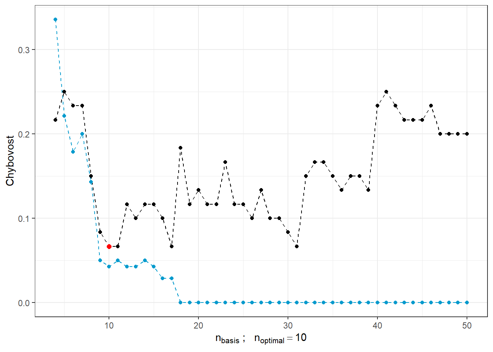
<p class="caption">(\#fig:unnamed-chunk-48)Závislost testovací a trénovací chybovosti na počtu bázových funkcí pro $\beta$. Červeným bodem je znázorněn optimální počet $n_{optimal}$ zvolený jako minimum testovací chybovosti, černou čarou je vykreslena testovací a modrou přerušovanou čarou je vykreslen průběh trénovací chybovosti.</p>
</div>

Vidíme, že s rostoucím počtem bází pro $\beta(t)$ má trénovací chybovost (modrá čára) tendenci klesat a tedy bychom na jejím základě volili velké hodnoty $n_{basis}$.
Naopak optimální volbou na základě testovací chybovosti je $n$ rovno 10, tedy výrazně menší hodnota než 50.
Naopak s rostoucím $n$ roste testovací chyvost, což ukazuje na přeučení modelu.

Z výše uvedených důvodů pro určení optimálního počtu bazických funkcí pro $\beta(t)$ využijeme 10-ti násobnou cross-validaci.
Jako maximální počet uvažovaných bazických funkcí bereme 25, neboť jak jsme viděli výše, nad touto hodnotou dochází již k přeučení modelu.


```r
### 10-fold cross-validation
n.basis.max <- 25
n.basis <- 4:n.basis.max
k_cv <- 10 # k-fold CV
# rozdelime trenovaci data na k casti
folds <- createMultiFolds(X.train$fdnames$reps, k = k_cv, time = 1)
## prvky, ktere se behem cyklu nemeni
# body, ve kterych jsou funkce vyhodnoceny
tt <- x.train[["argvals"]]
rangeval <- range(tt)
# B-spline baze 
basis1 <- X.train$basis
# vztah
f <- Y ~ x
# baze pro x
basis.x <- list("x" = basis1)
# prazdna matice, do ktere vlozime jednotlive vysledky
# ve sloupcich budou hodnoty presnosti pro danou cast trenovaci mnoziny
# v radcich budou hodnoty pro dany pocet bazi
CV.results <- matrix(NA, nrow = length(n.basis), ncol = k_cv, 
                     dimnames = list(n.basis, 1:k_cv))
```

Nyní již máme vše připravené pro spočítání chybovosti na každé z deseti podmnožin trénovací množiny.
Následně určíme průměr a jako optimální $n$ vezmeme argument minima validační chybovosti.


```r
for (index in 1:k_cv) {
  # definujeme danou indexovou mnozinu
  fold <- folds[[index]]
    
  x.train.cv <- subset(X.train, c(1:length(X.train$fdnames$reps)) %in% fold) |>
    fdata()
  y.train.cv <- subset(Y.train, c(1:length(X.train$fdnames$reps)) %in% fold) |>
    as.numeric()
  
  x.test.cv <- subset(X.train, !c(1:length(X.train$fdnames$reps)) %in% fold) |>
    fdata()
  y.test.cv <- subset(Y.train, !c(1:length(X.train$fdnames$reps)) %in% fold) |>
    as.numeric()
  
  dataf <- as.data.frame(y.train.cv) 
  colnames(dataf) <- "Y"
  
  for (i in n.basis) {
    # baze pro bety
    basis2 <- create.bspline.basis(rangeval = rangeval, nbasis = i)
    
    basis.b <- list("x" = basis2)
    # vstupni data do modelu
    ldata <- list("df" = dataf, "x" = x.train.cv)
    # binomicky model ... model logisticke regrese
    model.glm <- fregre.glm(f, family = binomial(), data = ldata,
                            basis.x = basis.x, basis.b = basis.b)
    
    # presnost na validacni casti 
    newldata = list("df" = as.data.frame(y.test.cv), "x" = x.test.cv)
    predictions.valid <- predict(model.glm, newx = newldata)
    predictions.valid <- data.frame(Y.pred = ifelse(predictions.valid < 1/2, 0, 1))
    presnost.valid <- table(y.test.cv, predictions.valid$Y.pred) |>
      prop.table() |> diag() |> sum()
    
    # vlozime do matice
    CV.results[as.character(i), as.character(index)] <- presnost.valid
  } 
}

# spocitame prumerne presnosti pro jednotliva n pres folds
CV.results <- apply(CV.results, 1, mean)
n.basis.opt <- n.basis[which.max(CV.results)]
presnost.opt.cv <- max(CV.results)
CV.results
```

```
##         4         5         6         7         8         9        10        11 
## 0.6490101 0.8110996 0.8217872 0.8241638 0.8574350 0.9140240 0.9127461 0.9251521 
##        12        13        14        15        16        17        18        19 
## 0.9152450 0.9043956 0.9315667 0.9155411 0.8812271 0.8873666 0.8741551 0.8754722 
##        20        21        22        23        24        25 
## 0.8862554 0.8714900 0.8847026 0.8727723 0.8679267 0.9137971
```

Vykresleme si ještě průběh validační chybovosti i se zvýrazněnou optimální hodnotou $n_{optimal}$ rovnou 14 s validační chybovostí 0.0684.


```r
CV.results <- data.frame(n.basis = n.basis, CV = CV.results)
CV.results |> ggplot(aes(x = n.basis, y = 1 - CV)) + 
  geom_line(linetype = 'dashed', colour = 'grey') + 
  geom_point(size = 1.5) + 
  geom_point(aes(x = n.basis.opt, y = 1 - presnost.opt.cv), colour = 'red', size = 2) +
  theme_bw() + 
  labs(x = bquote(paste(n[basis], ' ;   ', 
                        n[optimal] == .(n.basis.opt))),
       y = 'Validační chybovost') + 
  scale_x_continuous(breaks = n.basis)
```

<div class="figure">

<p class="caption">(\#fig:unnamed-chunk-51)Závislost validační chybovosti na hodnotě $n_{basis}$, tedy na počtu bází.</p>
</div>

Nyní již tedy můžeme definovat finální model pomocí funkcionální logistické regrese, přičemž bázi pro $\beta(t)$ volíme B-splinovou bázi s 14 bázemi.


```r
# optimalni model
basis2 <- create.bspline.basis(rangeval = range(tt), nbasis = n.basis.opt)
f <- Y ~ x
# baze pro x a bety
basis.x <- list("x" = basis1) 
basis.b <- list("x" = basis2)
# vstupni data do modelu
dataf <- as.data.frame(y.train) 
colnames(dataf) <- "Y"
ldata <- list("df" = dataf, "x" = x.train)
# binomicky model ... model logisticke regrese
model.glm <- fregre.glm(f, family = binomial(), data = ldata,
                        basis.x = basis.x, basis.b = basis.b)
```

```
## Warning in Minverse(t(B) %*% B): System is computationally singular (rank  54)
## 
##           The  matrix inverse is computed by svd (effective rank 52)
```

```r
# presnost na trenovacich datech
predictions.train <- predict(model.glm, newx = ldata)
```

```
## Warning in Minverse(t(B) %*% B): System is computationally singular (rank  54)
## 
##           The  matrix inverse is computed by svd (effective rank 52)
```

```r
predictions.train <- data.frame(Y.pred = ifelse(predictions.train < 1/2, 0, 1))
presnost.train <- table(Y.train, predictions.train$Y.pred) |>
  prop.table() |> diag() |> sum()
  
# presnost na testovacich datech
newldata = list("df" = as.data.frame(Y.test), "x" = fdata(X.test))
predictions.test <- predict(model.glm, newx = newldata)
```

```
## Warning in Minverse(t(B) %*% B): System is computationally singular (rank  54)
## 
##           The  matrix inverse is computed by svd (effective rank 52)
```

```r
predictions.test <- data.frame(Y.pred = ifelse(predictions.test < 1/2, 0, 1))
presnost.test <- table(Y.test, predictions.test$Y.pred) |>
  prop.table() |> diag() |> sum()
```

Spočítali jsme trénovací chybovost (rovna 5 %) i testovací chybovost (rovna 11.67 %).
Pro lepší představu si ještě můžeme vykreslit hodnoty odhadnutých pravděpodobností příslušnosti do klasifikační třídy $Y = 1$ na trénovacích datech v závislosti na hodnotách lineárního prediktoru.


```r
data.frame(
  linear.predictor = model.glm$linear.predictors,
  response = model.glm$fitted.values,
  Y = factor(y.train)
) |> ggplot(aes(x = linear.predictor, y = response, colour = Y)) + 
  geom_point(size = 1.5) + 
  scale_colour_discrete(labels = c('Y = 0', 'Y = 1')) +
  geom_abline(aes(slope = 0, intercept = 0.5), linetype = 'dashed') + 
  theme_bw() + 
  labs(x = 'Lineární prediktor',
       y = 'Odhadnuté pravděpodobnosti Pr(Y = 1|X = x)',
       colour = 'Třída') 
```

<div class="figure">

<p class="caption">(\#fig:unnamed-chunk-53)Závoslost odhadnutých pravděpodobností na hodnotách lineárního prediktoru. Barevně jsou odlišeny body podle příslušnosti do klasifikační třídy.</p>
</div>

Můžeme si ještě pro informaci zobrazit průběh odhadnuté parametrické funkce $\beta(t)$.


```r
t.seq <- seq(0, 6, length = 1001)
beta.seq <- eval.fd(evalarg = t.seq, fdobj = model.glm$beta.l$x)

data.frame(t = t.seq, beta = beta.seq) |> 
  ggplot(aes(t, beta)) + 
  geom_line() + 
  theme_bw() +
  labs(x = 'Time',
       y = expression(widehat(beta)(t))) + 
  theme(panel.grid.major = element_blank(), panel.grid.minor = element_blank()) + 
  geom_abline(aes(slope = 0, intercept = 0), linetype = 'dashed', 
              linewidth = 0.5, colour = 'grey')
```

<div class="figure">

<p class="caption">(\#fig:unnamed-chunk-54)Průběh odhadu parametrické funkce $\beta(t), t \in [0, 6]$.</p>
</div>

Výsledky opět přidáme do souhrnné tabulky.


```r
Res <- data.frame(model = 'LR functional', 
                  Err.train = 1 - presnost.train,
                  Err.test = 1 - presnost.test)

RESULTS <- rbind(RESULTS, Res)
```


##### Logistická regrese s analýzou hlavních komponent

Abychom mohli sesrojit tento klasifikátor, potřebujeme provést funkcionální analýzu hlavních komponent, určit vhodný počet komponent a spočítat hodnoty skórů pro testovací data.
To jsme již provedli v části u lineární diskriminační analýzy, proto využijeme tyto výsledky v následující části.


Můžeme tedy rovnou sestrojit model logistické regrese pomocí funkce `glm(, family = binomial)`.


```r
# model
clf.LR <- glm(Y ~  ., data = data.PCA.train, family = binomial)

# presnost na trenovacich datech
predictions.train <- predict(clf.LR, newdata = data.PCA.train, type = 'response')
predictions.train <- ifelse(predictions.train > 0.5, 1, 0)
presnost.train <- table(data.PCA.train$Y, predictions.train) |>
  prop.table() |> diag() |> sum()
  
# presnost na testovacich datech
predictions.test <- predict(clf.LR, newdata = data.PCA.test, type = 'response')
predictions.test <- ifelse(predictions.test > 0.5, 1, 0)
presnost.test <- table(data.PCA.test$Y, predictions.test) |>
  prop.table() |> diag() |> sum()
```

Spočítali jsme tedy přesnost klasifikátoru na trénovacích (68.57 %) i na testovacích datech (76.67 %).

Pro grafické znázornění metody můžeme zaznačit dělící hranici do grafu skórů prvních dvou hlavních komponent.
Tuto hranici spočítáme na husté síti bodů a zobrazíme ji pomocí funkce `geom_contour()` stejně jako v případě LDA i QDA.


```r
nd <- nd |> mutate(prd = as.numeric(predict(clf.LR, newdata = nd,
                                            type = 'response')))
nd$prd <- ifelse(nd$prd > 0.5, 1, 0)

data.PCA.train |> ggplot(aes(x = V1, y = V2, colour = Y)) +
  geom_point(size = 1.5) + 
  labs(x = paste('1. hlavní komponenta (vysvětlená variabilita', 
                 round(100 * data.PCA$varprop[1], 2), '%)'),
       y = paste('2. hlavní komponenta (', 
                 round(100 * data.PCA$varprop[2], 2), '%)'),
       colour = 'Group') +
  scale_colour_discrete(labels = c('Y = 0', 'Y = 1')) +
  theme_bw() +
  geom_contour(data = nd, aes(x = V1, y = V2, z = prd), colour = 'black')
```

<div class="figure">

<p class="caption">(\#fig:unnamed-chunk-61)Skóre prvních dvou hlavních komponent, barevně odlišené podle příslušnosti do klasifikační třídy. Černě je vyznačena dělící hranice (přímka v rovině prvních dvou hlavních komponent) mezi třídami sestrojená pomocí logistické regrese.</p>
</div>

Všimněme si, že dělící hranicí mezi klasifikačními třídami je nyní přímka jako v případě LDA.

Nakonec ještě doplníme chybovosti do souhrnné tabulky.


```r
Res <- data.frame(model = 'LR score', 
                  Err.train = 1 - presnost.train,
                  Err.test = 1 - presnost.test)

RESULTS <- rbind(RESULTS, Res)
```

#### Rozhodovací stromy

V této části se podíváme na velmi odlišný přístup k sestrojení klasifikátoru, než byly například LDA či logistická regrese.
Rozhodovací stromy jsou velmi oblíbeným nástrojem ke klasifikaci, avšak jako v případě některých předchozích metod nejsou přímo určeny pro funkcionální data.
Existují však postupy, jak funkcionální objekty převést na mnohorozměrné a následně na ně aplikovat algoritmus rozhodovacích stromů.
Můžeme uvažovat následující postupy:

-   algoritmus sestrojený na bázových koeficientech,

-   využití skórů hlavních komponent,

-   použít diskretizaci intervalu a vyhodnotit funkci jen na nějaké konečné síti bodů.

My se nejprve zaměříme na diskretizaci intervalu a následně porovnáme výsledky se zbylými dvěma přístupy k sestrojení rozhodovacího stromu.

##### Diskretizace intervalu

Nejprve si musíme definovat body z intervalu $I = [0, 6]$, ve kterých funkce vyhodnotíme.
Následně vytvoříme objekt, ve kterém budou řádky představovat jednotlivé (diskretizované) funkce a sloupce časy.
Nakonec připojíme sloupec $Y$ s informací o příslušnosti do klasifikační třídy a totéž zopakujeme i pro testovací data.


```r
# posloupnost bodu, ve kterych funkce vyhodnotime
t.seq <- seq(0, 6, length = 101)
   
grid.data <- eval.fd(fdobj = X.train, evalarg = t.seq)
grid.data <- as.data.frame(t(grid.data)) # transpozice kvuli funkcim v radku
grid.data$Y <- Y.train |> factor()

grid.data.test <- eval.fd(fdobj = X.test, evalarg = t.seq)
grid.data.test <- as.data.frame(t(grid.data.test))
grid.data.test$Y <- Y.test |> factor()
```

Nyní mážeme sestrojit rozhodovací strom, ve kterém budou jakožto prediktory vystupovat všechny časy z vektoru `t.seq`.
Tato klasifikační není náchylná na multikolinearitu, tudíž se jí nemusíme zabývat.
Jako metriku zvolíme přesnost.


```r
# sestrojeni modelu
clf.tree <- train(Y ~ ., data = grid.data, 
                 method = "rpart", 
                 trControl = trainControl(method = "CV", number = 10),
                 metric = "Accuracy")

# presnost na trenovacich datech
predictions.train <- predict(clf.tree, newdata = grid.data)
presnost.train <- table(Y.train, predictions.train) |>
  prop.table() |> diag() |> sum()
  
# presnost na testovacich datech
predictions.test <- predict(clf.tree, newdata = grid.data.test)
presnost.test <- table(Y.test, predictions.test) |>
  prop.table() |> diag() |> sum()
```

Přesnost klasifikátoru na testovacích datech je tedy 81.67 % a na trénovacích datech 73.57 %.

Graficky si rozhodovací strom můžeme vykreslit pomocí funkce `fancyRpartPlot()`.
Nastavíme barvy uzlů tak, aby reflektovaly předchozí barevné odlišení.
Jedná se o neprořezaný strom.


```r
colnames(grid.data) <- c(paste0('time:', t.seq), 'Y')
fancyRpartPlot(rpart(Y ~ ., data = grid.data, method = "class"),
               sub = '', palettes = c('Reds', 'Blues')) 
```

<div class="figure">

<p class="caption">(\#fig:unnamed-chunk-65)Grafické znázornění neprořezaného rozhodovacího stromu. Modrými odstíny jsou vykresleny uzly příslušející klasifikační třídě 1 a červenými odstíny třídě 0.</p>
</div>

Můžeme si také vykreslit již prořezaný finální rozhodovací strom.


```r
rpart.plot::rpart.plot(clf.tree$finalModel, # finalni model ... prorezany strom
                       extra = 104, # zobrazeni pozadovanych informaci
                       box.palette = c('Reds', 'Blues'),
                       branch.lty = 3, # dotted branch lines
                       shadow.col = 0, # shadows under the node boxes
                       nn = FALSE, 
                       under = FALSE, 
                       digits = 2)
```

<div class="figure">

<p class="caption">(\#fig:unnamed-chunk-66)Finální prořezaný rozhodovací strom.</p>
</div>

Nakonec opět přidejme trénovací a testovací chybovost do souhrnné tabulky.


```r
Res <- data.frame(model = 'Tree - diskr.', 
                  Err.train = 1 - presnost.train,
                  Err.test = 1 - presnost.test)

RESULTS <- rbind(RESULTS, Res)
```

##### Skóre hlavních komponent

Další možností pro sestrojení rozhodovacího stromu je použít skóre hlavních komponent.
Jelikož jsme již skóre počítali pro předchozí klasifikační metody, využijeme těchto poznatků a sestrojíme rozhodovací strom na skórech prvních 3 hlavních komponent.


```r
# sestrojeni modelu
clf.tree.PCA <- train(Y ~ ., data = data.PCA.train, 
                 method = "rpart", 
                 trControl = trainControl(method = "CV", number = 10),
                 metric = "Accuracy")

# presnost na trenovacich datech
predictions.train <- predict(clf.tree.PCA, newdata = data.PCA.train)
presnost.train <- table(Y.train, predictions.train) |>
  prop.table() |> diag() |> sum()
  
# presnost na testovacich datech
predictions.test <- predict(clf.tree.PCA, newdata = data.PCA.test)
presnost.test <- table(Y.test, predictions.test) |>
  prop.table() |> diag() |> sum()
```

Přesnost rozhodovacího stromu na testovacích datech je tedy 76.67 % a na trénovacích datech 70 %.

Graficky si rozhodovací strom sestrojený na skórech hlavních komponent můžeme vykreslit pomocí funkce `fancyRpartPlot()`.
Nastavíme barvy uzlů tak, aby reflektovaly předchozí barevné odlišení.
Jedná se o neprořezaný strom.


```r
fancyRpartPlot(rpart(Y ~ ., data = data.PCA.train, method = "class"),
               sub = '', palettes = c('Reds', 'Blues')) 
```

<div class="figure">

<p class="caption">(\#fig:unnamed-chunk-69)Grafické znázornění neprořezaného rozhodovacího stromu sestrojeného na skórech hlavních komponent. Modrými odstíny jsou vykresleny uzly příslušející klasifikační třídě 1 a červenými odstíny třídě 0.</p>
</div>

Můžeme si také vykreslit již prořezaný finální rozhodovací strom.


```r
rpart.plot::rpart.plot(clf.tree.PCA$finalModel, # finalni model 
                       extra = 104, # zobrazeni pozadovanych informaci
                       box.palette = c('Reds', 'Blues'),
                       branch.lty = 3, # dotted branch lines
                       shadow.col = 0, # shadows under the node boxes
                       nn = FALSE, under = FALSE, digits = 2)
```

<div class="figure">

<p class="caption">(\#fig:unnamed-chunk-70)Finální prořezaný rozhodovací strom.</p>
</div>

Nakonec opět přidejme trénovací a testovací chybovost do souhrnné tabulky.


```r
Res <- data.frame(model = 'Tree - score', 
                  Err.train = 1 - presnost.train,
                  Err.test = 1 - presnost.test)

RESULTS <- rbind(RESULTS, Res)
```

##### Bázové koeficienty

Poslední možností, kterou využijeme pro sestrojení rozhodovacího stromu, je použití koeficientů ve vyjádření funkcí v B-splinové bázi.

Nejprve si definujme potřebné datové soubory s koeficienty.


```r
# trenovaci dataset
data.Bbasis.train <- t(X.train$coefs) |> as.data.frame()
data.Bbasis.train$Y <- factor(Y.train)

# testovaci dataset
data.Bbasis.test <- t(X.test$coefs) |> as.data.frame()
data.Bbasis.test$Y <- factor(Y.test)
```

Nyní již můžeme sestrojit klasifikátor.


```r
# sestrojeni modelu
clf.tree.Bbasis <- train(Y ~ ., data = data.Bbasis.train, 
                 method = "rpart", 
                 trControl = trainControl(method = "CV", number = 10),
                 metric = "Accuracy")

# presnost na trenovacich datech
predictions.train <- predict(clf.tree.Bbasis, newdata = data.Bbasis.train)
presnost.train <- table(Y.train, predictions.train) |>
  prop.table() |> diag() |> sum()
  
# presnost na testovacich datech
predictions.test <- predict(clf.tree.Bbasis, newdata = data.Bbasis.test)
presnost.test <- table(Y.test, predictions.test) |>
  prop.table() |> diag() |> sum()
```

Přesnost rozhodovacího stromu na trénovacích datech je tedy 73.57 % a na testovacích datech 81.67 %.

Graficky si rozhodovací strom sestrojený na koeficientech B-splinového vyjádření můžeme vykreslit pomocí funkce `fancyRpartPlot()`.
Nastavíme barvy uzlů tak, aby reflektovaly předchozí barevné odlišení.
Jedná se o neprořezaný strom.


```r
fancyRpartPlot(rpart(Y ~ ., data = data.Bbasis.train, method = "class"),
               sub = '', palettes = c('Reds', 'Blues')) 
```

<div class="figure">

<p class="caption">(\#fig:unnamed-chunk-74)Grafické znázornění neprořezaného rozhodovacího stromu sestrojeného na bázových koeficientech. Modrými odstíny jsou vykresleny uzly příslušející klasifikační třídě 1 a červenými odstíny třídě 0.</p>
</div>

Můžeme si také vykreslit již prořezaný finální rozhodovací strom.


```r
rpart.plot::rpart.plot(clf.tree.Bbasis$finalModel, # finalni model 
                       extra = 104, # zobrazeni pozadovanych informaci
                       box.palette = c('Reds', 'Blues'),
                       branch.lty = 3, # dotted branch lines
                       shadow.col = 0, # shadows under the node boxes
                       nn = FALSE, under = FALSE, digits = 2)
```

<div class="figure">

<p class="caption">(\#fig:unnamed-chunk-75)Finální prořezaný rozhodovací strom.</p>
</div>

Nakonec opět přidejme trénovací a testovací chybovost do souhrnné tabulky.


```r
Res <- data.frame(model = 'Tree - Bbasis', 
                  Err.train = 1 - presnost.train,
                  Err.test = 1 - presnost.test)

RESULTS <- rbind(RESULTS, Res)
```

#### Náhodné lesy

Klasifikátor sestrojený pomocí metody náhodných lesů spočívá v sestrojení několika jednotlivých rozhodovacích stromů, které se následně zkombinují a vytvoří společný klasifikátor (společným "hlasováním").

Tak jako v případě rozhodovacích stromů máme několik možností na to, jaká data (konečně-rozměrná) použijeme pro sestrojení modelu.
Budeme opět uvažovat výše diskutované tři přístupy.
Datové soubory s příslušnými veličinami pro všechny tři přístupy již máme připravené z minulé sekce, proto můžeme přímo sestrojit dané modely, spočítat charakteristiky daného klasifikátoru a přidat výsledky do souhrnné tabulky.

##### Diskretizace intervalu

V prvním případě využíváme vyhodnocení funkcí na dané síti bodů intervalu $I = [0, 6]$.


```r
# sestrojeni modelu
clf.RF <- randomForest(Y ~ ., data = grid.data, 
                       ntree = 500, # pocet stromu
                       importance = TRUE,
                       nodesize = 5)

# presnost na trenovacich datech
predictions.train <- predict(clf.RF, newdata = grid.data)
presnost.train <- table(Y.train, predictions.train) |>
  prop.table() |> diag() |> sum()
  
# presnost na testovacich datech
predictions.test <- predict(clf.RF, newdata = grid.data.test)
presnost.test <- table(Y.test, predictions.test) |>
  prop.table() |> diag() |> sum()
```

Přesnost náhodného lesu na trénovacích datech je tedy 100 % a na testovacích datech 80 %.


```r
Res <- data.frame(model = 'RForest - diskr', 
                  Err.train = 1 - presnost.train,
                  Err.test = 1 - presnost.test)

RESULTS <- rbind(RESULTS, Res)
```

##### Skóre hlavních komponent

V tomto případě využijeme skóre prvních $p =$ 3 hlavních komponent.


```r
# sestrojeni modelu
clf.RF.PCA <- randomForest(Y ~ ., data = data.PCA.train, 
                           ntree = 500, # pocet stromu
                           importance = TRUE,
                           nodesize = 5)

# presnost na trenovacich datech
predictions.train <- predict(clf.RF.PCA, newdata = data.PCA.train)
presnost.train <- table(Y.train, predictions.train) |>
  prop.table() |> diag() |> sum()
  
# presnost na testovacich datech
predictions.test <- predict(clf.RF.PCA, newdata = data.PCA.test)
presnost.test <- table(Y.test, predictions.test) |>
  prop.table() |> diag() |> sum()
```

Přesnost rozhodovacího stromu na trénovacích datech je tedy 98.57 % a na testovacích datech 70 %.


```r
Res <- data.frame(model = 'RForest - score', 
                  Err.train = 1 - presnost.train,
                  Err.test = 1 - presnost.test)

RESULTS <- rbind(RESULTS, Res)
```

##### Bázové koeficienty

Nakonec použijeme vyjádření funkcí pomocí B-splinové báze.


```r
# sestrojeni modelu
clf.RF.Bbasis <- randomForest(Y ~ ., data = data.Bbasis.train, 
                              ntree = 500, # pocet stromu
                              importance = TRUE,
                              nodesize = 5)

# presnost na trenovacich datech
predictions.train <- predict(clf.RF.Bbasis, newdata = data.Bbasis.train)
presnost.train <- table(Y.train, predictions.train) |>
  prop.table() |> diag() |> sum()
  
# presnost na testovacich datech
predictions.test <- predict(clf.RF.Bbasis, newdata = data.Bbasis.test)
presnost.test <- table(Y.test, predictions.test) |>
  prop.table() |> diag() |> sum()
```

Přesnost tohoto klasifikátoru na trénovacích datech je 100 % a na testovacích datech 81.67 %.


```r
Res <- data.frame(model = 'RForest - Bbasis', 
                  Err.train = 1 - presnost.train,
                  Err.test = 1 - presnost.test)

RESULTS <- rbind(RESULTS, Res)
```

#### Support Vector Machines

Nyní se podívejme na klasifikaci našich nasimulovaných křivek pomocí metody podpůrných vektorů (ang. Support Vector Machines, SVM).
Výhodou této klasifikační metody je její výpočetní nenáročnost, neboť pro definici hraniční křivky mezi třídami využívá pouze několik (často málo) pozorování.

Hlavní výhodou SVM je použití tzv.
*jádrového triku* (kernel trick), pomocí kterého nahradíme obyčejný skalární součin jiným skalárním součinem transformovaných dat, aniž bychom tuto transformaci museli přímo definovat.
Tím dostaneme obecně nelineární dělící hranici mezi klasifikačními třídami.
*Jádro* (jádrová funkce, ang. kernel, kernel function) $K$ je taková funkce, která splňuje

$$
K(x_i, x_j) = \langle \phi(x_i), \phi(x_j) \rangle_{\mathcal H}, 
$$ kde $\phi$ je nějaká (neznámá) transformace (ang. feature map), $\mathcal H$ je Hilbertův prostor a $\langle \cdot, \cdot \rangle_{\mathcal H}$ je nějaký skalární součin na tomto Hilbertově prostoru.

Nejčastěji se v praxi volí tři typy jádrových funkcí:

-   lineární jádro -- $K(x_i, x_j) = \langle x_i, x_j \rangle$,
-   polynomiální jádro -- $K(x_i, x_j) = \big(\alpha_0 + \gamma \langle x_i, x_j \rangle \big)^d$,
-   radiální (gaussovské) jádro -- $\displaystyle{K(x_i, x_j) = \text e^{-\gamma \|x_i - x_j \|^2}}$.

U všech výše zmíněných jader musíme zvolit konstantu $C > 0$, která udává míru penalizace za překročení dělící hranice mezi třídami (ang. inverse regularization parameter).
S rostoucí hodnotou $C$ bude metoda více penalizovat špatně klasifikovaná data a méně tvar hranice, naopak pro malé hodnoty $C$ metoda nedává takový význam špatně klasifikovaným datům, ale zaměřuje se více na penalizaci tvaru hranice.
Tato konstanta $C$ se defaultně volí rovna 1, můžeme ji určit i přímo například pomocí cross-validace.

Využitím cross-validace můžeme také určit optimální hodnoty ostatních hyperparametrů, které nyní závisí na naší volbě jádrové funkce.
V případě lineárního jádra nevolíme žádný další parametr kromě konstanty $C$, u polynomiálního jádra musíme určit hodnoty hyperparametrů $\alpha_0, \gamma \text{ a } d$, jejichž defaultní hodnoty v `R` jsou postupně $\alpha_0^{default} = 0, \gamma^{default} = \frac{1}{dim(\texttt{data})} \text{ a } d^{default} = 3$.
Při volbě radiálního jádra máme pouze jeden další hyperparametr $\gamma$, jehož defaultní hodnota v `R` je totožná jako u polynomiálního jádra.
Opět bychom mohli hodnoty hyperparametrů určit jako optimální pro naše data, avšak vzhledem k relativní výpočetní náročnosti necháme hodnoty příslušných hyperparametrů na jejich defaultních hodnotách.

V případě funkcionálních dat máme několik možností, jak použít metodu SVM.
Nejjednodušší variantou je použít tuto klasifikační metodu přímo na diskretizovanou funkci (sekce \@ref(diskr3)).
Další možností je opět využít skóre hlavních komponent a klasifikovat křivky pomocí jejich reprezentace \@ref(PCA-SVM3).
Další přímočarou variantou je využít vyjádření křivek pomocí B-splinové báze a klasifikovat křivky na základě koeficientů jejich vyjádření v této bázi (sekce \@ref(basis-SVM3)).

Složitější úvahou můžeme dospět k několika dalším možnostem, které využívají funkcionální podstatu dat.
Jednak můžeme místo klasifikace původní křivky využít její derivaci (případně druhou derivaci, třetí, ...), druhak můžeme využít projekce funkcí na podprostor generovaný, např. B-splinovými, funkcemi (sekce \@ref(projection-SVM3)). Poslední metoda, kterou použijeme pro klasifikaci funkcionálních dat, spočívá v kombinaci projekce na určitý podprostor generovaný funkcemi (Reproducing Kernel Hilbert Space, RKHS) a klasifikace příslušné reprezentace. Tato metoda využívá kromě klasického SVM i SVM pro regresi, více uvádíme v sekci RKHS + SVM \@ref(RKHS-SVM3).

##### Diskretizace intervalu

Začněme nejprve aplikací metody podpůrných vektorů přímo na diskretizovaná data (vyhodnocení funkce na dané síti bodů na intervalu $I = [0, 6]$), přičemž budeme uvažovat všech tři výše zmíněné jádrové funkce.


```r
# set norm equal to one
norms <- c()
for (i in 1:dim(XXder$coefs)[2]) {
  norms <- c(norms, as.numeric(1 / norm.fd(XXder[i])))
  }
XXfd_norm <- XXder 
XXfd_norm$coefs <- XXfd_norm$coefs * matrix(norms, 
                                            ncol = dim(XXder$coefs)[2],
                                            nrow = dim(XXder$coefs)[1],
                                            byrow = T)

# rozdeleni na testovaci a trenovaci cast
X.train_norm <- subset(XXfd_norm, split == TRUE)
X.test_norm <- subset(XXfd_norm, split == FALSE)

Y.train_norm <- subset(Y, split == TRUE)
Y.test_norm <- subset(Y, split == FALSE)

grid.data <- eval.fd(fdobj = X.train_norm, evalarg = t.seq)
grid.data <- as.data.frame(t(grid.data)) 
grid.data$Y <- Y.train_norm |> factor()

grid.data.test <- eval.fd(fdobj = X.test_norm, evalarg = t.seq)
grid.data.test <- as.data.frame(t(grid.data.test))
grid.data.test$Y <- Y.test_norm |> factor()
```


```r
# sestrojeni modelu
clf.SVM.l <- svm(Y ~ ., data = grid.data,
                 type = 'C-classification',
                 scale = TRUE,
                 cost = 25,
                 kernel = 'linear')

clf.SVM.p <- svm(Y ~ ., data = grid.data,
                 type = 'C-classification',
                 scale = TRUE,
                 coef0 = 1,
                 cost = 0.7,
                 kernel = 'polynomial')

clf.SVM.r <- svm(Y ~ ., data = grid.data,
                 type = 'C-classification',
                 scale = TRUE,
                 cost = 55,
                 gamma = 0.0005,
                 kernel = 'radial')

# presnost na trenovacich datech
predictions.train.l <- predict(clf.SVM.l, newdata = grid.data)
presnost.train.l <- table(Y.train, predictions.train.l) |>
  prop.table() |> diag() |> sum()

predictions.train.p <- predict(clf.SVM.p, newdata = grid.data)
presnost.train.p <- table(Y.train, predictions.train.p) |>
  prop.table() |> diag() |> sum()

predictions.train.r <- predict(clf.SVM.r, newdata = grid.data)
presnost.train.r <- table(Y.train, predictions.train.r) |>
  prop.table() |> diag() |> sum()

# presnost na testovacich datech
predictions.test.l <- predict(clf.SVM.l, newdata = grid.data.test)
presnost.test.l <- table(Y.test, predictions.test.l) |>
  prop.table() |> diag() |> sum()

predictions.test.p <- predict(clf.SVM.p, newdata = grid.data.test)
presnost.test.p <- table(Y.test, predictions.test.p) |>
  prop.table() |> diag() |> sum()

predictions.test.r <- predict(clf.SVM.r, newdata = grid.data.test)
presnost.test.r <- table(Y.test, predictions.test.r) |>
  prop.table() |> diag() |> sum()
```

Přesnost metody SVM na trénovacích datech je tedy 92.14 % pro lineární jádro, 87.14 % pro polynomiální jádro a 85.71 % pro gaussovské jádro.
Na testovacích datech je potom přesnost metody 90 % pro lineární jádro, 76.67 % pro polynomiální jádro a 76.67 % pro radiální jádro.


```r
Res <- data.frame(model = c('SVM linear - diskr', 
                            'SVM poly - diskr', 
                            'SVM rbf - diskr'), 
                  Err.train = 1 - c(presnost.train.l, presnost.train.p, presnost.train.r),
                  Err.test = 1 - c(presnost.test.l, presnost.test.p, presnost.test.r))

RESULTS <- rbind(RESULTS, Res)
```

##### Skóre hlavních komponent

V tomto případě využijeme skóre prvních $p =$ 3 hlavních komponent.


```r
# sestrojeni modelu
clf.SVM.l.PCA <- svm(Y ~ ., data = data.PCA.train,
                     type = 'C-classification',
                     scale = TRUE,
                     cost = 0.1,
                     kernel = 'linear')

clf.SVM.p.PCA <- svm(Y ~ ., data = data.PCA.train,
                     type = 'C-classification',
                     scale = TRUE,
                     coef0 = 1,
                     cost = 0.01,
                     kernel = 'polynomial')

clf.SVM.r.PCA <- svm(Y ~ ., data = data.PCA.train,
                     type = 'C-classification',
                     scale = TRUE,
                     cost = 1,
                     gamma = 0.01,
                     kernel = 'radial')

# presnost na trenovacich datech
predictions.train.l <- predict(clf.SVM.l.PCA, newdata = data.PCA.train)
presnost.train.l <- table(data.PCA.train$Y, predictions.train.l) |>
  prop.table() |> diag() |> sum()

predictions.train.p <- predict(clf.SVM.p.PCA, newdata = data.PCA.train)
presnost.train.p <- table(data.PCA.train$Y, predictions.train.p) |>
  prop.table() |> diag() |> sum()

predictions.train.r <- predict(clf.SVM.r.PCA, newdata = data.PCA.train)
presnost.train.r <- table(data.PCA.train$Y, predictions.train.r) |>
  prop.table() |> diag() |> sum()
  
# presnost na testovacich datech
predictions.test.l <- predict(clf.SVM.l.PCA, newdata = data.PCA.test)
presnost.test.l <- table(data.PCA.test$Y, predictions.test.l) |>
  prop.table() |> diag() |> sum()

predictions.test.p <- predict(clf.SVM.p.PCA, newdata = data.PCA.test)
presnost.test.p <- table(data.PCA.test$Y, predictions.test.p) |>
  prop.table() |> diag() |> sum()

predictions.test.r <- predict(clf.SVM.r.PCA, newdata = data.PCA.test)
presnost.test.r <- table(data.PCA.test$Y, predictions.test.r) |>
  prop.table() |> diag() |> sum()
```

Přesnost metody SVM aplikované na skóre hlavních komponent na trénovacích datech je tedy 68.57 % pro lineární jádro, 68.57 % pro polynomiální jádro a 67.86 % pro gaussovské jádro.
Na testovacích datech je potom přesnost metody 76.67 % pro lineární jádro, 76.67 % pro polynomiální jádro a 76.67 % pro radiální jádro.

Pro grafické znázornění metody můžeme zaznačit dělící hranici do grafu skórů prvních dvou hlavních komponent.
Tuto hranici spočítáme na husté síti bodů a zobrazíme ji pomocí funkce `geom_contour()` stejně jako v předchozích případech, kdy jsme také vykreslovali klasifikační hranici.


```r
nd <- rbind(nd, nd, nd) |> mutate(
   prd = c(as.numeric(predict(clf.SVM.l.PCA, newdata = nd, type = 'response')),
           as.numeric(predict(clf.SVM.p.PCA, newdata = nd, type = 'response')),
           as.numeric(predict(clf.SVM.r.PCA, newdata = nd, type = 'response'))),
   kernel = rep(c('linear', 'polynomial', 'radial'),
                each = length(as.numeric(predict(clf.SVM.l.PCA, 
                                                 newdata = nd,
                                                 type = 'response')))))

data.PCA.train |> ggplot(aes(x = V1, y = V2, colour = Y)) +
 geom_point(size = 1.5) + 
 labs(x = paste('1. hlavní komponenta (vysvětlená variabilita', 
                round(100 * data.PCA$varprop[1], 2), '%)'),
      y = paste('2. hlavní komponenta (', 
                round(100 * data.PCA$varprop[2], 2), '%)'),
      colour = 'Group', 
      linetype = 'Kernel type') +
 scale_colour_discrete(labels = c('Y = 0', 'Y = 1')) +
 theme_bw() +
 geom_contour(data = nd, aes(x = V1, y = V2, z = prd, linetype = kernel), 
              colour = 'black') + 
 geom_contour(data = nd, aes(x = V1, y = V2, z = prd, linetype = kernel),
              colour = 'black') + 
 geom_contour(data = nd, aes(x = V1, y = V2, z = prd, linetype = kernel),
              colour = 'black')
```

<div class="figure">

<p class="caption">(\#fig:unnamed-chunk-90)Skóre prvních dvou hlavních komponent, barevně odlišené podle příslušnosti do klasifikační třídy. Černě je vyznačena dělící hranice (přímka, resp. křivky v rovině prvních dvou hlavních komponent) mezi třídami sestrojená pomocí metody SVM.</p>
</div>


```r
Res <- data.frame(model = c('SVM linear - PCA', 
                            'SVM poly - PCA', 
                            'SVM rbf - PCA'), 
                  Err.train = 1 - c(presnost.train.l, presnost.train.p, presnost.train.r),
                  Err.test = 1 - c(presnost.test.l, presnost.test.p, presnost.test.r))

RESULTS <- rbind(RESULTS, Res)
```

##### Bázové koeficienty

Nakonec použijeme vyjádření funkcí pomocí B-splinové báze.


```r
# sestrojeni modelu
clf.SVM.l.Bbasis <- svm(Y ~ ., data = data.Bbasis.train,
                        type = 'C-classification',
                        scale = TRUE,
                        cost = 50,
                        kernel = 'linear')

clf.SVM.p.Bbasis <- svm(Y ~ ., data = data.Bbasis.train,
                        type = 'C-classification',
                        scale = TRUE,
                        coef0 = 1,
                        cost = 0.1,
                        kernel = 'polynomial')

clf.SVM.r.Bbasis <- svm(Y ~ ., data = data.Bbasis.train,
                        type = 'C-classification',
                        scale = TRUE,
                        cost = 100,
                        gamma = 0.001,
                        kernel = 'radial')

# presnost na trenovacich datech
predictions.train.l <- predict(clf.SVM.l.Bbasis, newdata = data.Bbasis.train)
presnost.train.l <- table(Y.train, predictions.train.l) |>
  prop.table() |> diag() |> sum()

predictions.train.p <- predict(clf.SVM.p.Bbasis, newdata = data.Bbasis.train)
presnost.train.p <- table(Y.train, predictions.train.p) |>
  prop.table() |> diag() |> sum()

predictions.train.r <- predict(clf.SVM.r.Bbasis, newdata = data.Bbasis.train)
presnost.train.r <- table(Y.train, predictions.train.r) |>
  prop.table() |> diag() |> sum()
  
# presnost na testovacich datech
predictions.test.l <- predict(clf.SVM.l.Bbasis, newdata = data.Bbasis.test)
presnost.test.l <- table(Y.test, predictions.test.l) |>
  prop.table() |> diag() |> sum()

predictions.test.p <- predict(clf.SVM.p.Bbasis, newdata = data.Bbasis.test)
presnost.test.p <- table(Y.test, predictions.test.p) |>
  prop.table() |> diag() |> sum()

predictions.test.r <- predict(clf.SVM.r.Bbasis, newdata = data.Bbasis.test)
presnost.test.r <- table(Y.test, predictions.test.r) |>
  prop.table() |> diag() |> sum()
```

Přesnost metody SVM aplikované na bázové koeficienty na trénovacích datech je tedy 92.86 % pro lineární jádro, 80 % pro polynomiální jádro a 87.14 % pro gaussovské jádro.
Na testovacích datech je potom přesnost metody 93.33 % pro lineární jádro, 78.33 % pro polynomiální jádro a 80 % pro radiální jádro.


```r
Res <- data.frame(model = c('SVM linear - Bbasis', 
                            'SVM poly - Bbasis', 
                            'SVM rbf - Bbasis'), 
                  Err.train = 1 - c(presnost.train.l, presnost.train.p, presnost.train.r),
                  Err.test = 1 - c(presnost.test.l, presnost.test.p, presnost.test.r))

RESULTS <- rbind(RESULTS, Res)
```

##### Projekce na B-splinovou bázi

Další možností, jak použít klasickou metodu SVM pro funkcionální data, je projektovat původní data na nějaký $d$-dimenzionální podprostor našeho Hilbertova prostoru $\mathcal H$, označme jej $V_d$.
Předpokládejme, že tento podprostor $V_d$ má ortonormální bázi $\{\Psi_j\}_{j = 1, \dots, d}$.
Definujeme transformaci $P_{V_d}$ jakožto ortogonální projekci na podprostor $V_d$, tedy můžeme psát

$$
P_{V_d} (x) = \sum_{j = 1}^d \langle x, \Psi_j \rangle \Psi_j.
$$

Nyní můžeme pro klasifikaci použít koeficienty z ortogonální projekce, tedy aplikujeme standardní SVM na vektory $\left( \langle x, \Psi_1 \rangle, \dots, \langle x, \Psi_d \rangle\right)^\top$.
Využitím této transformace jsme tedy definovali nové, tzv.
adaptované jádro, které je složené z ortogonální projekce $P_{V_d}$ a jádrové funkce standardní metody podpůrných vektorů.
Máme tedy (adaptované) jádro $Q(x_i, x_j) = K(P_{V_d}(x_i), P_{V_d}(x_j))$.
Jde tedy o metodu redukce dimenze, kterou můžeme nazvat *filtrace*.

Pro samotnou projekci použijeme v `R` funkci `project.basis()` z knihovny `fda`.
Na jejím vstupu bude matice původních diskrétních (nevyhlazených) dat, hodnoty, ve kterých měříme hodnoty v matici původních dat a bázový objekt, na který chceme data projektovat.
My zvolíme projekci na B-splinovou bázi, protože využití Fourierovy báze není pro naše neperiodická data vhodné.
Další možností je využít *wavelet basis*.

Dimenzi $d$ volíme buď z nějaké předchozí expertní znalosti, nebo pomocí cross-validace.
V našem případě určíme optimální dimenzi podprostoru $V_d$ pomocí $k$-násobné cross-validace (volíme $k \ll n$ kvůli výpočetní náročnosti metody, často se volí $k = 5$ nebo $k = 10$).
Požadujeme B-spliny řádu 4, pro počet bázových funkcí potom platí vztah

$$
n_{basis} = n_{breaks} + n_{order} - 2,
$$

kde $n_{breaks}$ je počet uzlů a $n_{order} = 4$.
Minimální dimenzi tedy (pro $n_{breaks} = 1$) volíme $n_{basis} = 3$ a maximální (pro $n_{breaks} = 51$ odpovídající počtu původních diskrétních dat) $n_{basis} = 53$.
V `R` však hodnota $n_{basis}$ musí být alespoň $n_{order} = 4$ a pro velké hodnoty $n_{basis}$ již dochází k přefitování modelu, tudíž volíme za maximální $n_{basis}$ menší číslo, řekněme 43.


```r
k_cv <- 10 # k-fold CV

# hodnoty pro B-splinovou bazi
rangeval <- range(t)
norder <- 4
n_basis_min <- norder
n_basis_max <- length(t) + norder - 2 - 10

dimensions <- n_basis_min:n_basis_max # vsechny dimenze, ktere chceme vyzkouset

# rozdelime trenovaci data na k casti
folds <- createMultiFolds(1:sum(split), k = k_cv, time = 1)

# list se tremi slozkami ... maticemi pro jednotlive jadra -> linear, poly, radial
# prazdna matice, do ktere vlozime jednotlive vysledky
# ve sloupcich budou hodnoty presnosti pro danou cast trenovaci mnoziny
# v radcich budou hodnoty pro danou hodnotu dimenze
CV.results <- list(SVM.l = matrix(NA, nrow = length(dimensions), ncol = k_cv),
                   SVM.p = matrix(NA, nrow = length(dimensions), ncol = k_cv),
                   SVM.r = matrix(NA, nrow = length(dimensions), ncol = k_cv))

for (d in dimensions) {
  # bazovy objekt
  bbasis <- create.bspline.basis(rangeval = rangeval, 
                                 nbasis = d)
  
  # projekce diskretnich dat na B-splinovou bazi o dimenzi d
  Projection <- project.basis(y = grid.data |> select(!contains('Y')) |> as.matrix() |> t(), # matice diskretnich dat
                              argvals = t.seq, # vektor argumentu
                              basisobj = bbasis) # bazovy objekt
  
  # rozdeleni na trenovaci a testovaci data v ramci CV
  XX.train <- t(Projection) # subset(t(Projection), split == TRUE)
  
  for (index_cv in 1:k_cv) {
    # definice testovaci a trenovaci casti pro CV
    fold <- folds[[index_cv]]
    cv_sample <- 1:dim(XX.train)[1] %in% fold
    
    data.projection.train.cv <- as.data.frame(XX.train[cv_sample, ])
    data.projection.train.cv$Y <- factor(Y.train[cv_sample])
    
    data.projection.test.cv <- as.data.frame(XX.train[!cv_sample, ])
    Y.test.cv <- Y.train[!cv_sample]
    data.projection.test.cv$Y <- factor(Y.test.cv)
  
    # sestrojeni modelu
    clf.SVM.l.projection <- svm(Y ~ ., data = data.projection.train.cv,
                            type = 'C-classification',
                            scale = TRUE,
                            kernel = 'linear')
    
    clf.SVM.p.projection <- svm(Y ~ ., data = data.projection.train.cv,
                            type = 'C-classification',
                            scale = TRUE,
                            coef0 = 1,
                            kernel = 'polynomial')
    
    clf.SVM.r.projection <- svm(Y ~ ., data = data.projection.train.cv,
                            type = 'C-classification',
                            scale = TRUE,
                            kernel = 'radial')
      
    # presnost na validacnich datech
    ## linear kernel
    predictions.test.l <- predict(clf.SVM.l.projection,
                                  newdata = data.projection.test.cv)
    presnost.test.l <- table(Y.test.cv, predictions.test.l) |>
      prop.table() |> diag() |> sum()
    ## polynomial kernel
    predictions.test.p <- predict(clf.SVM.p.projection, 
                                  newdata = data.projection.test.cv)
    presnost.test.p <- table(Y.test.cv, predictions.test.p) |>
      prop.table() |> diag() |> sum()
    ## radial kernel
    predictions.test.r <- predict(clf.SVM.r.projection,
                                  newdata = data.projection.test.cv)
    presnost.test.r <- table(Y.test.cv, predictions.test.r) |>
      prop.table() |> diag() |> sum()
    
    # presnosti vlozime na pozice pro dane d a fold
    CV.results$SVM.l[d - min(dimensions) + 1, index_cv] <- presnost.test.l
    CV.results$SVM.p[d - min(dimensions) + 1, index_cv] <- presnost.test.p
    CV.results$SVM.r[d - min(dimensions) + 1, index_cv] <- presnost.test.r
  }
}
  
# spocitame prumerne presnosti pro jednotliva d pres folds
for (n_method in 1:length(CV.results)) {
  CV.results[[n_method]] <- apply(CV.results[[n_method]], 1, mean)
}

d.opt <- c(which.max(CV.results$SVM.l) + n_basis_min - 1, 
           which.max(CV.results$SVM.p) + n_basis_min - 1, 
           which.max(CV.results$SVM.r) + n_basis_min - 1)
presnost.opt.cv <- c(max(CV.results$SVM.l), 
                     max(CV.results$SVM.p),
                     max(CV.results$SVM.r))
data.frame(d_opt = d.opt, ERR = 1 - presnost.opt.cv,
           row.names = c('linear', 'poly', 'radial'))
```

```
##        d_opt       ERR
## linear    12 0.1559432
## poly       8 0.1982189
## radial     8 0.1918956
```

Vidíme, že nejlépe vychází hodnota parametru $d$ jako 12 pro lineární jádro s hodnotou přesnosti spočtenou pomocí 10-násobné CV 0.8441, 8 pro polynomiální jádro s hodnotou přesnosti spočtenou pomocí 10-násobné CV 0.8018 a 8 pro radiální jádro s hodnotou přesnosti 0.8081.
Pro přehlednost si ještě vykresleme průběh validačních chybovostí v závislosti na dimenzi $d$.


```r
CV.results <- data.frame(d = dimensions |> rep(3), 
                         CV = c(CV.results$SVM.l, 
                                CV.results$SVM.p, 
                                CV.results$SVM.r),
                         Kernel = rep(c('linear', 'polynomial', 'radial'), 
                                      each = length(dimensions)) |> factor())
CV.results |> ggplot(aes(x = d, y = 1 - CV, colour = Kernel)) + 
  geom_line(linetype = 'dashed') + 
  geom_point(size = 1.5) + 
  geom_point(data = data.frame(d.opt,
                               presnost.opt.cv),
             aes(x = d.opt, y = 1 - presnost.opt.cv), colour = 'black', size = 2) +
  theme_bw() + 
  labs(x = bquote(paste(d)),
       y = 'Validační chybovost') + 
  theme(legend.position = "bottom") + 
  scale_x_continuous(breaks = dimensions)
```

<div class="figure">
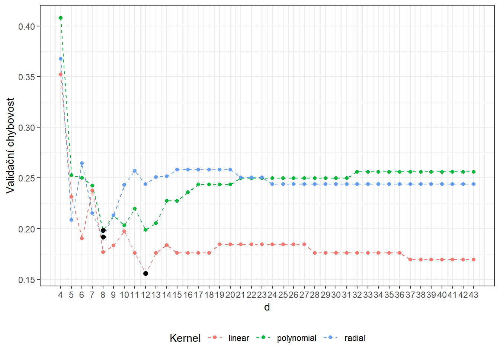
<p class="caption">(\#fig:unnamed-chunk-95)Závislost validační chybovosti na dimenzi podprostoru $V_d$, zvlášť pro všechna tři uvažovaná jádra v metodě SVM. Černými body jsou vyznačeny optimální hodnoty dimenze $V_d$ pro jednotlivé jádrové funkce.</p>
</div>

Nyní již můžeme natrénovat jednotlivé klasifikátory na všech trénovacích datech a podívat se na jejich úspěšnost na testovacích datech.
Pro každou jádrovou funkci volíme dimenzi podprostoru, na který projektujeme, podle výsledků cross-validace.

V proměnné `Projection` máme uloženou matici koeficientů ortogonální projekce, tedy

$$
\texttt{Projection} = \begin{pmatrix}
\langle x_1, \Psi_1 \rangle & \langle x_2, \Psi_1 \rangle & \cdots & \langle x_n, \Psi_1 \rangle\\
\langle x_1, \Psi_2 \rangle & \langle x_2, \Psi_2 \rangle & \cdots & \langle x_n, \Psi_2 \rangle\\
\vdots & \vdots & \ddots & \vdots \\
\langle x_1, \Psi_d \rangle & \langle x_2, \Psi_d \rangle & \dots & \langle x_n, \Psi_d \rangle
\end{pmatrix}_{d \times n}.
$$


```r
# pripravime si datovou tabulku pro ulozeni vysledku
Res <- data.frame(model = c('SVM linear - projection', 
                            'SVM poly - projection', 
                            'SVM rbf - projection'), 
                  Err.train = NA,
                  Err.test = NA)

# projdeme jednotliva jadra
for (kernel_number in 1:3) {
  kernel_type <- c('linear', 'polynomial', 'radial')[kernel_number]
  # bazovy objekt
  bbasis <- create.bspline.basis(rangeval = rangeval, 
                                 nbasis = d.opt[kernel_number])
  
  # projekce diskretnich dat na B-splinovou bazi
  Projection <- project.basis(y = rbind(
    grid.data |> select(!contains('Y')),
    grid.data.test |> select(!contains('Y'))) |>
      as.matrix() |> t(), # matice diskretnich dat
                              argvals = t.seq, # vektor argumentu
                              basisobj = bbasis) # bazovy objekt
  
  # rozdeleni na trenovaci a testovaci data
  XX.train <- t(Projection)[1:sum(split), ]
  XX.test <- t(Projection)[(sum(split) + 1):length(split), ]
  
  data.projection.train <- as.data.frame(XX.train)
  data.projection.train$Y <- factor(Y.train)
  
  data.projection.test <- as.data.frame(XX.test)
  data.projection.test$Y <- factor(Y.test)
  
  # sestrojeni modelu
  clf.SVM.projection <- svm(Y ~ ., data = data.projection.train,
                            type = 'C-classification',
                            scale = TRUE,
                            coef0 = 1,
                            kernel = kernel_type)
  
  # presnost na trenovacich datech
  predictions.train <- predict(clf.SVM.projection, newdata = data.projection.train)
  presnost.train <- table(Y.train, predictions.train) |>
    prop.table() |> diag() |> sum()
    
  # presnost na testovacich datech
  predictions.test <- predict(clf.SVM.projection, newdata = data.projection.test)
  presnost.test <- table(Y.test, predictions.test) |>
    prop.table() |> diag() |> sum()
  
  # ulozeni vysledku
  Res[kernel_number, c(2, 3)] <- 1 - c(presnost.train, presnost.test)
}
```

Přesnost metody SVM aplikované na bázové koeficienty na trénovacích datech je tedy 13.57 % pro lineární jádro, 13.57 % pro polynomiální jádro a 13.57 % pro gaussovské jádro.
Na testovacích datech je potom přesnost metody 21.67 % pro lineární jádro, 26.67 % pro polynomiální jádro a 26.67 % pro radiální jádro.


```r
RESULTS <- rbind(RESULTS, Res)
```

##### RKHS + SVM {#RKHS-SVM3} 

V této sekci se podíváme na další možnost, jak využít metodu podpůrných vektorů pro klasifikaci funkcionálních dat.
V tomto případě půjde opět o již nám známý princip, kdy nejprve funkcionální data vyjádříme jakožto nějaké konečně-rozměrné objekty a na tyto objekty následně aplikujeme klasickou metodu SVM.

Nyní však metodu SVM použijeme i pro samotnou reprezentaci funkcionálních dat pomocí určitého konečně-rozměrného objektu.
Jak již název napovídá, půjde o kombinaci dvou konceptů -- jednak metody podpůrných vektorů a druhak prostoru, který se nazývá v anglické literatuře *Reproducing Kernel Hilbert Space*.
Pro tento prostor je klíčovým pojmem *jádro* -- *kernel*.

::: {.definition #kernel name="Jádro"} 
Jádro je taková funkce $K : \mathcal X \times \mathcal X \rightarrow \mathbb R$, že pro každou dvojici $\boldsymbol x, \tilde{\boldsymbol x} \in \mathcal X$ platí 
\begin{equation*}
K(\boldsymbol x, \tilde{\boldsymbol x}) = \big\langle \boldsymbol\phi(\boldsymbol x), \boldsymbol\phi(\tilde{\boldsymbol x}) \big\rangle_{\mathcal H},
\end{equation*}
kde $\boldsymbol\phi : \mathcal X \rightarrow \mathcal H$ je zobrazení z prostoru $\mathcal X$ do prostoru $\mathcal H$.
:::

Aby funkce byla jádrem, musí splňovat určité podmínky.

::: {.lemma} 
Nechť $\mathcal X$ je nějaký Hilbertův prostor. Potom symetrická funkce $K : \mathcal X \times \mathcal X \rightarrow \mathbb R$ je jádrem, pokud $\forall k \geq 1, \boldsymbol x_1, \dots, \boldsymbol x_k \in \mathcal X$ a $c_1, \dots, c_k \in \mathbb R$ platí
\begin{equation*}
\sum_{i, j = 1}^k c_ic_j K(\boldsymbol x_i, \boldsymbol x_j) \geq 0.
\end{equation*}
:::

Vlastnost výše se nazývá pozitivní semidefinitnost.
Platí také následující tvrzení.

::: {.theorem} 
Funkce $K: \mathcal X \times \mathcal X \rightarrow \mathbb R$ je jádrem právě tehdy, když existuje Hilbertův prostor $\mathcal H$ a zobrazení $\boldsymbol\phi : \mathcal X \rightarrow \mathcal H$ takové, že
\begin{equation*}
K(\boldsymbol x, \tilde{\boldsymbol x}) = \big\langle \boldsymbol\phi(\boldsymbol x), \boldsymbol\phi(\tilde{\boldsymbol x}) \big\rangle_{\mathcal H} \quad \forall \boldsymbol x, \tilde{\boldsymbol x}\in \mathcal X.
\end{equation*}
:::

Nyní již máme připravenou půdu pro zavedení pojmu *Reproducing Kernel Hilbert Space*.

###### Reproducing Kernel Hilbert Space (RKHS)

Uvažujme Hilbertův prostor $\mathcal H$ jakožto prostor funkcí.
Naším cílem je definovat prostor $\mathcal H$ a zobrazení $\phi$ takové, že $\phi(x) \in \mathcal H, \ \forall x \in \mathcal X$.
Označme $\phi(x) = k_x$.
Každé funkci $x \in \mathcal X$ tedy přiřadíme funkci $x \mapsto k_x \in \mathcal H, k_x := K(x, \cdot), k_x: \mathcal X \rightarrow \mathbb R$.
Potom $\phi: \mathcal X \rightarrow \mathbb R^{\mathcal X}$, můžeme tedy souhrnně napsat

$$
x \in \mathcal X \mapsto \phi(x) = k_x = K(x, \cdot) \in \mathcal H,
$$

Bod (funkce) $x \in \mathcal X$ je zobrazen na funkci $k_x: \mathcal X \rightarrow \mathbb R, k_x(y) = K(x, y)$.

Uvažujme množinu všech obrazů $\{k_x | x \in \mathcal X\}$ a definujme lineární obal této množiny vektorů jakožto

$$
\mathcal G := \text{span}\{k_x | x \in \mathcal X\} = \left\{\sum_{i = 1}^r\alpha_i K(x_i, \cdot)\ \Big|\ \alpha_i \in \mathbb R, r \in \mathbb N, x_i \in \mathcal X\right\}.
$$

Potom skalární součin

$$
\langle k_x, k_y \rangle = \langle K(x, \cdot), K(y, \cdot) \rangle = K(x, y),\quad x, y \in \mathcal X
$$

a obecně

$$
f, g \in \mathcal G, f = \sum_i \alpha_i K(x_i, \cdot), g = \sum_j \beta_j K(y_j, \cdot), \\
\langle f, g \rangle_{\mathcal G} = \Big\langle \sum_i \alpha_i K(x_i, \cdot), \sum_j \beta_j K(y_j, \cdot) \Big\rangle = \sum_i\sum_j\alpha_i\beta_j \langle K(x_i, \cdot), K(y_j, \cdot) \rangle = \sum_i\sum_j\alpha_i\beta_j K(x_i, y_j).
$$

Prostor $\mathcal H := \overline{\mathcal G}$, který je zúplněním prostoru $\mathcal G$, nazýváme *Reproducing Kernel Hilbert Space* (RKHS).
Významnou vlastností tohoto prostoru je

$$
K(x, y) = \Big\langle \phi(x), \phi(y) \Big\rangle_{\mathcal H}.
$$

*Poznámka:* Jméno Reproducing vychází z následujícího faktu.
Mějme libovolnou funkci $f = \sum_i \alpha_i K(x_i, \cdot)$.
Potom

```{=tex}
\begin{align*}
\langle K(x, \cdot), f\rangle &= \langle K(x, \cdot), \sum_i \alpha_i K(x_i, \cdot) \rangle =\\
&= \sum_i \alpha_i \langle K(x, \cdot), K(x_i, \cdot) \rangle = \sum_i \alpha_i K(x_i, x) = \\
&= f(x)
\end{align*}
```

*Vlastnosti:*

-   nechť $\mathcal H$ je Hilbertův prostor funkcí $g: \mathcal X \rightarrow \mathbb R$.
    Potom $\mathcal H$ je RKHS $\Leftrightarrow$ všechny funkcionály (evaluation functionals) $\delta_x: \mathcal H \rightarrow \mathbb R, g \mapsto g(x)$ jsou spojité,

-   pro dané jádro $K$ existuje právě jeden prostor RKHS (až na isometrickou izomofrii),

-   pro daný RKHS je jádro $K$ určeno jednoznačně,

-   funkce v RKHS jsou bodově korektně definovány,

-   RKHS je obecně nekonečně-rozměrný vektorový prostor, v praxi však pracujeme pouze s jeho konečně-rozměrným podprostorem.

Na konec této sekce si uveďme jedno důležité tvrzení.

::: {.theorem #representer name="The representer theorem"} 
Nechť $K$ je jádro a $\mathcal H$ je příslušný RKHS s normou a skalárním součinem $\|\cdot\|_{\mathcal H}$ a $\langle \cdot, \cdot \rangle_{\mathcal H}$. Předpokládejme, že chceme zjistit lineární funkci $f: \mathcal H \rightarrow \mathbb R$ na Hilbertově prostoru $\mathcal H$ definovaného jádrem $K$. Funkce $f$ má tvar $f(x) = \langle \omega, x \rangle_{\mathcal H}$ pro nějaké $\omega \in \mathcal H$. Uvažujme regularizovaný minimalizační problém 
\begin{equation}
\min_{\omega \in \mathcal H} R_n(\omega) + \lambda \Omega(\|\omega\|_{\mathcal H}),
(\#eq:repr-thm)
\end{equation}
kde $\Omega: [0, \infty) \rightarrow \mathbb R$ je striktně monotonně rostoucí funkce (regularizer), $R_n(\cdot)$ je empirická ztráta (empirical risk) klasifikátoru vzhledem ke ztrátové funkci $\ell$. Potom optimalizační úloha \@ref(eq:repr-thm) má vždy optimální řešení a to je tvaru 
\begin{equation}
\omega^* = \sum_{i = 1}^n \alpha_i K(x_i, \cdot),
(\#eq:optimal-thm)
\end{equation}
kde $(x_i, y_i)_{i = 1, 2, \dots, n} \in \mathcal X \times \mathcal Y$ je množina trénovacích hodnot.
:::

$\mathcal H$ je obecně nekočně-rozměrný prostor, ale pro konečný datový soubor velikosti $n$ má $\mathcal H$ dimenzi nejvýše $n$.
Každý $n$-dimenzionální podprostor Hilbertova prostoru je navíc izometrický s $\mathbb R^n$, tudíž můžeme předpokládat, že zobrazení (feature map) zobrazuje právě do $\mathbb R^n$.

Jádro $K$ je *univerzální* pokud RKHS $\mathcal H$ je hustá množina v $\mathcal C(\mathcal X)$ (množina spojitých funkcí).
Navíc platí následující poznatky:

-   univerzální jádra jsou dobrá pro aproximaci,
-   Gaussovo jádro s pevnou hodnotou $\sigma$ je univerzální,
-   univerzalita je nutnou podmínkou pro konzistenci.

###### Klasifikace pomocí RKHS

Základní myšlenkou je projekce původních dat na podprostor prostoru RKHS, označme jej $\mathcal H_K$ (index ${}_K$ odkazuje na fakt, že tento prostor je definován jádrem $K$).
Cílem je tedy transformovat křivku (pozorovaný objekt, funkce) na bod v RKHS.
Označme $\{\hat c_1, \dots, \hat c_n\}$ množinu pozorovaných křivek, přičemž každá křivka $\hat c_l$ je definována daty $\{(\boldsymbol x_i, \boldsymbol y_{il}) \in \mathcal X \times \mathcal Y\}_{i = 1}^m$, kde $\mathcal X$ je prostor vstupních proměnných a nejčastěji $\mathcal Y = \mathbb R$.
Předpokládejme, že pro každou funkci $\hat c_l$ existuje spojitá funkce $c_l:\mathcal X \rightarrow \mathcal Y, \mathbb E[y_l|\boldsymbol x] = c_l(\boldsymbol x)$.
Předpokládejme také, že $\boldsymbol x_i$ jsou společné pro všechny křivky.

Muñoz a González ve svém článku[^1] navrhují následující postup.
Křivku $c_l^*$ můžeme napsat ve tvaru

[^1]: Muñoz, A.
    and González, J.
    (2010) *Representing functional data using support vector machines*, Pattern Recognition Letters, 31(6), pp. 511--516.
    [doi:10.1016/j.patrec.2009.07.014](https://www.sciencedirect.com/science/article/pii/S0167865509001913).

$$
c_l^*(\boldsymbol x) = \sum_{i = 1}^m \alpha_{il} K(\boldsymbol x_i, \boldsymbol x), \quad \forall \boldsymbol x \in \mathcal X,
$$

kde $\alpha_{il} \in \mathbb R$.
Tyto koeficienty získáme v praxi řešením optimalizačního problému $$
\text{argmin}_{c \in \mathcal H_K} \frac{1}{m} \sum_{i = 1}^m \big[|c(\boldsymbol x_i) - y_i| - \varepsilon\big]_+ + \gamma \|c\|_{K}^2, \gamma > 0, \varepsilon \geq 0,
$$ tedy právě například pomocí metody SVM.
Díky známé vlastnosti této metody pak bude mnoho koeficientů $\alpha_{il} = 0$.
Minimalizací výše uvedeného výrazu získáme funkce $c_1^*, \dots, c_n^*$ odpovídající původním křivkám $\hat c_1, \dots, \hat c_n$.
Metoda SVM tedy dává smysluplnou reprezentaci původních křivek pomocí vektoru koeficientů $\boldsymbol \alpha_l = (\alpha_{1l}, \dots, \alpha_{ml})^\top$ pro $\hat c_l$.
Tato reprezentace je však velmi nestabilní, neboť i při malé změně původních hodnot může dojít ke změně v množině podpůrných vektorů pro danou funkci, a tedy dojde k výrazné změně celé reprezentace této křivky (reprezentace není spojitá ve vstupních hodnotách).
Definujeme proto novou reprezentaci původních křivek, která již nebude trpět tímto nedostatkem.

::: {.theorem #MaG name="Muñoz-González"} 
Nechť $c$ je funkce, jejíž pozorovaná verze je $\hat c = \{(\boldsymbol x_i, y_{i}) \in \mathcal X \times \mathcal Y\}_{i = 1}^m$ a $K$ je jádro s vlastními funkcemi $\{\phi_1, \dots, \phi_d, \dots\}$ (báze $\mathcal H_K$). Potom funkce $c^*(\boldsymbol x)$ může být vyjádřena ve tvaru
\begin{equation*}
c^*(\boldsymbol x) = \sum_{j = 1}^d \lambda_j^* \phi_j(\boldsymbol x),
\end{equation*}
kde $\lambda_j^*$ jsou váhy projekce $c^*(\boldsymbol x)$ na prostor funkcí generovaný vlastními funkcemi jádra $K$ a $d$ je dimenze prostoru $\mathcal H$. V praxi, kdy máme k dispozici pouze konečně mnoho pozorování, $\lambda_j^*$ mohou být odhadnuty pomocí
\begin{equation*}
\hat\lambda_j^* = \hat\lambda_j \sum_{i = 1}^m \alpha_i\hat\phi_{ji}, \quad j = 1, 2, \dots, \hat d,
\end{equation*}
kde $\hat\lambda_j$ je $j$-té vlastní číslo příslušné $j$-tému vlastnímu vektoru $\hat\phi_j$ matice $K_S = \big(K(\boldsymbol x_i, \boldsymbol x_j)\big)_{i, j = 1}^m, \hat d = \text{rank}(K_S)$ a $\alpha_i$ jsou řešením optimalizačního problému.
:::

###### Implementace metody v `R`

Z poslední části Tvrzení \@ref(thm:MaG) vyplývá, jak máme spočítat v praxi reprezentace křivek.
Budeme pracovat s diskretizovanými daty po vyhlazení křivek.
Nejprve si definujeme jádro pro prostor RKHS.
Využijeme Gaussovské jádro s parametrem $\gamma$.
Hodnota tohoto hyperparametru výrazně ovlivňuje chování a tedy i úspěšnost metody, proto jeho volbě musíme věnovat zvláštní pozornost (volíme pomocí cross-validace).

###### Gaussovké jádro


```r
# odstranime posledni sloupec, ve kterem jsou hodnoty Y
data.RKHS <- grid.data[, -dim(grid.data)[2]] |> t()
# pridame i testovaci data
data.RKHS <- cbind(data.RKHS, grid.data.test[, -dim(grid.data.test)[2]] |> t())

# jadro a jadrova matice ... Gaussovske s parametrem gamma
Gauss.kernel <- function(x, y, gamma) {
  return(exp(-gamma * norm(c(x - y) |> t(), type = 'F')))
}

Kernel.RKHS <- function(x, gamma) {
  K <- matrix(NA, ncol = length(x), nrow = length(x))
  for(i in 1:nrow(K)) {
    for(j in 1:ncol(K)) {
      K[i, j] <- Gauss.kernel(x = x[i], y = x[j], gamma = gamma)
    }
  }
  return(K)
}
```

Spočítejme nyní matici $K_S$ a její vlastní čísla a příslušné vlastní vektory.


```r
# spocitame matici K
gamma <- 0.1 # pevna hodnota gamma, optimalni urcime pomoci CV
K <- Kernel.RKHS(t.seq, gamma = gamma)

# urcime vlastni cisla a vektory
Eig <- eigen(K)
eig.vals <- Eig$values
eig.vectors <- Eig$vectors
```

K výpočtu koeficientů v reprezentaci křivek, tedy výpočtu vektorů $\hat{\boldsymbol \lambda}_l^* = \left( \hat\lambda_{1l}^*, \dots, \hat\lambda_{\hat dl}^*\right)^\top, l = 1, 2, \dots, n$, potřebujeme ještě koeficienty z SVM.
Narozdíl od klasifikačního problému nyní řešíme problém regrese, neboť se snažíme vyjádřit naše pozorované křivky v nějaké (námi zvolené pomocí jádra $K$) bázi.
Proto využijeme metodu *Support Vector Regression*, z níž následně získáme koeficienty $\alpha_{il}$.


```r
# urceni koeficientu alpha z SVM
alpha.RKHS <- matrix(0, nrow = dim(data.RKHS)[1],
                     ncol = dim(data.RKHS)[2]) # prazdny objekt

# model
for(i in 1:dim(data.RKHS)[2]) {
  df.svm <- data.frame(x = t.seq,
                       y = data.RKHS[, i])
  svm.RKHS <- svm(y ~ x, data = df.svm, 
                  kernel = 'radial',
                  type = 'eps-regression',
                  epsilon = 0.1,
                  gamma = gamma)
  # urceni alpha
  alpha.RKHS[svm.RKHS$index, i] <- svm.RKHS$coefs # nahrazeni nul koeficienty
}
```

Nyní již můžeme spočítat reprezentace jednotlivých křivek.
Nejprve zvolme za $\hat d$ celou dimenzi, tedy $\hat d = m ={}$ 101, následně určíme optimální $\hat d$ pomocí cross-validace.


```r
# d
d.RKHS <- dim(alpha.RKHS)[1]

# urceni vektoru lambda
Lambda.RKHS <- matrix(NA, 
                      ncol = dim(data.RKHS)[2], 
                      nrow = d.RKHS) # vytvoreni prazdneho objektu

# vypocet reprezentace
for(l in 1:dim(data.RKHS)[2]) {
  Lambda.RKHS[, l] <- (t(eig.vectors[, 1:d.RKHS]) %*% alpha.RKHS[, l]) * eig.vals[1:d.RKHS]
}
```

Nyní máme v matici `Lambda.RKHS` uloženy ve sloupcích vektory $\hat{\boldsymbol \lambda}_l^*, l = 1, 2, \dots, n$ pro každou křivku.
Tyto vektory nyní využijeme jakožto reprezentaci daných křivek a klasifikujeme data podle této diskretizace.


```r
# rozdeleni na trenovaci a testovaci data
XX.train <- Lambda.RKHS[, 1:dim(grid.data)[1]]
XX.test <- Lambda.RKHS[, (dim(grid.data)[1] + 1):dim(Lambda.RKHS)[2]]

# pripravime si datovou tabulku pro ulozeni vysledku
Res <- data.frame(model = c('SVM linear - RKHS', 
                            'SVM poly - RKHS', 
                            'SVM rbf - RKHS'), 
                  Err.train = NA,
                  Err.test = NA)

# projdeme jednotliva jadra
for (kernel_number in 1:3) {
  kernel_type <- c('linear', 'polynomial', 'radial')[kernel_number]

  data.RKHS.train <- as.data.frame(t(XX.train))
  data.RKHS.train$Y <- factor(Y.train)
  
  data.RKHS.test <- as.data.frame(t(XX.test))
  data.RKHS.test$Y <- factor(Y.test)
  
  # sestrojeni modelu
  clf.SVM.RKHS <- svm(Y ~ ., data = data.RKHS.train,
                      type = 'C-classification',
                      scale = TRUE,
                      coef0 = 1,
                      kernel = kernel_type)
  
  # presnost na trenovacich datech
  predictions.train <- predict(clf.SVM.RKHS, newdata = data.RKHS.train)
  presnost.train <- table(Y.train, predictions.train) |>
    prop.table() |> diag() |> sum()
    
  # presnost na testovacich datech
  predictions.test <- predict(clf.SVM.RKHS, newdata = data.RKHS.test)
  presnost.test <- table(Y.test, predictions.test) |>
    prop.table() |> diag() |> sum()
  
  # ulozeni vysledku
  Res[kernel_number, c(2, 3)] <- 1 - c(presnost.train, presnost.test)
}
```


Table: (\#tab:unnamed-chunk-103)Souhrnné výsledky metody SVM v kombinaci s RKHS na simulovaných datech. $\widehat{Err}_{train}$ značí odhad trénovací chybovosti a $\widehat{Err}_{test}$ testovací chybovosti.

Model                                $\widehat{Err}_{train}\quad\quad\quad\quad\quad$         $\widehat{Err}_{test}\quad\quad\quad\quad\quad$       
----------------------------------  -------------------------------------------------------  -------------------------------------------------------
SVM linear - RKHS                                                                    0.0000                                                   0.4833
SVM poly - RKHS                                                                      0.0000                                                   0.4167
SVM rbf - RKHS                                                                       0.0214                                                   0.3000

Vidíme, že model u všech třech jader velmi dobře klasifikuje trénovací data, zatímco jeho úspěšnost na testovacích datech není vůbec dobrá.
Je zřejmé, že došlo k overfittingu, proto využijeme cross-validaci, abychom určili optimální hodnoty $\gamma$ a $d$.


```r
# rozdelime trenovaci data na k casti
folds <- createMultiFolds(1:sum(split), k = k_cv, time = 1)
# odstranime posledni sloupec, ve kterem jsou hodnoty Y
data.RKHS <- grid.data[, -dim(grid.data)[2]] |> t()

# hodnoty hyperparametru, ktere budeme prochazet
dimensions <- 3:40 # rozumny rozsah hodnot d
gamma.cv <- 10^seq(-2, 3, length = 15)

# list se tremi slozkami ... array pro jednotlive jadra -> linear, poly, radial
# prazdna matice, do ktere vlozime jednotlive vysledky
# ve sloupcich budou hodnoty presnosti pro dane
# v radcich budou hodnoty pro danou gamma a vrstvy odpovidaji folds
dim.names <- list(gamma = paste0('gamma:', round(gamma.cv, 3)),
                  d = paste0('d:', dimensions),
                  CV = paste0('cv:', 1:k_cv))

CV.results <- list(
  SVM.l = array(NA, dim = c(length(gamma.cv), length(dimensions), k_cv),
                dimnames = dim.names),
  SVM.p = array(NA, dim = c(length(gamma.cv), length(dimensions), k_cv),
                dimnames = dim.names),
  SVM.r = array(NA, dim = c(length(gamma.cv), length(dimensions), k_cv),
                dimnames = dim.names))
```


```r
# samotna CV
for (gamma in gamma.cv) {
  K <- Kernel.RKHS(t.seq, gamma = gamma)
  Eig <- eigen(K)
  eig.vals <- Eig$values
  eig.vectors <- Eig$vectors
  alpha.RKHS <- matrix(0, nrow = dim(data.RKHS)[1], ncol = dim(data.RKHS)[2]) 
  
  # model
  for(i in 1:dim(data.RKHS)[2]) {
    df.svm <- data.frame(x = t.seq,
                         y = data.RKHS[, i])
    svm.RKHS <- svm(y ~ x, data = df.svm, 
                    kernel = 'radial',
                    type = 'eps-regression',
                    epsilon = 0.1,
                    gamma = gamma)
    alpha.RKHS[svm.RKHS$index, i] <- svm.RKHS$coefs 
  }
  
  # projdeme dimenze
  for(d.RKHS in dimensions) {
    Lambda.RKHS <- matrix(NA, 
                          ncol = dim(data.RKHS)[2], 
                          nrow = d.RKHS) 
    # vypocet reprezentace
    for(l in 1:dim(data.RKHS)[2]) {
      Lambda.RKHS[, l] <- (t(eig.vectors[, 1:d.RKHS]) %*% 
                             alpha.RKHS[, l]) * eig.vals[1:d.RKHS]
    }
    # projdeme folds
    for (index_cv in 1:k_cv) {
      # definice testovaci a trenovaci casti pro CV
      fold <- folds[[index_cv]]
      # rozdeleni na trenovaci a validacni data
      XX.train <- Lambda.RKHS[, fold]
      XX.test <- Lambda.RKHS[, !(1:dim(Lambda.RKHS)[2] %in% fold)]
      # pripravime si datovou tabulku pro ulozeni vysledku
      Res <- data.frame(model = c('SVM linear - RKHS', 
                                  'SVM poly - RKHS', 
                                  'SVM rbf - RKHS'), 
                        Err.test = NA)
      # projdeme jednotliva jadra
      for (kernel_number in 1:3) {
        kernel_type <- c('linear', 'polynomial', 'radial')[kernel_number]
      
        data.RKHS.train <- as.data.frame(t(XX.train))
        data.RKHS.train$Y <- factor(Y.train[fold])
        
        data.RKHS.test <- as.data.frame(t(XX.test))
        data.RKHS.test$Y <- factor(Y.train[!(1:dim(Lambda.RKHS)[2] %in% fold)])
        
        # sestrojeni modelu
        clf.SVM.RKHS <- svm(Y ~ ., data = data.RKHS.train,
                            type = 'C-classification',
                            scale = TRUE,
                            coef0 = 1,
                            kernel = kernel_type)
        
        # presnost na validacnich datech
        predictions.test <- predict(clf.SVM.RKHS, newdata = data.RKHS.test)
        presnost.test <- table(data.RKHS.test$Y, predictions.test) |>
          prop.table() |> diag() |> sum()
        
        # ulozeni vysledku
        Res[kernel_number, 2] <- 1 - presnost.test
      }
      # presnosti vlozime na pozice pro dane d, gamma a fold
      CV.results$SVM.l[paste0('gamma:', round(gamma, 3)), 
                       d.RKHS - min(dimensions) + 1, 
                       index_cv] <- Res[1, 2]
      CV.results$SVM.p[paste0('gamma:', round(gamma, 3)), 
                       d.RKHS - min(dimensions) + 1, 
                       index_cv] <- Res[2, 2]
      CV.results$SVM.r[paste0('gamma:', round(gamma, 3)), 
                       d.RKHS - min(dimensions) + 1, 
                       index_cv] <- Res[3, 2]
    }
  }
}
```


```r
# spocitame prumerne presnosti pro jednotliva d pres folds
for (n_method in 1:length(CV.results)) {
  CV.results[[n_method]] <- apply(CV.results[[n_method]], c(1, 2), mean)
}

gamma.opt <- c(which.min(CV.results$SVM.l) %% length(gamma.cv), 
               which.min(CV.results$SVM.p) %% length(gamma.cv), 
               which.min(CV.results$SVM.r) %% length(gamma.cv))
gamma.opt[gamma.opt == 0] <- length(gamma.cv)
gamma.opt <- gamma.cv[gamma.opt]

d.opt <- c(which.min(t(CV.results$SVM.l)) %% length(dimensions), 
           which.min(t(CV.results$SVM.p)) %% length(dimensions), 
           which.min(t(CV.results$SVM.r)) %% length(dimensions))
d.opt[d.opt == 0] <- length(dimensions)
d.opt <- dimensions[d.opt]

err.opt.cv <- c(min(CV.results$SVM.l), 
                     min(CV.results$SVM.p),
                     min(CV.results$SVM.r))
df.RKHS.res <- data.frame(d = d.opt, gamma = gamma.opt, CV = err.opt.cv,
           Kernel = c('linear', 'polynomial', 'radial') |> factor(),
           row.names = c('linear', 'poly', 'radial'))
```


Table: (\#tab:unnamed-chunk-106)Souhrnné výsledky cross-validace pro metodu SVM v kombinaci s RKHS na simulovaných datech. $\widehat{Err}_{train}$ značí odhad trénovací chybovosti a $\widehat{Err}_{test}$ testovací chybovosti.

          $\quad\quad\quad\quad\quad d$   $\quad\quad\quad\quad\quad\gamma$   $\widehat{Err}_{cross\_validace}$  Model                             
-------  ------------------------------  ----------------------------------  ----------------------------------  ----------------------------------
linear                               33                           1000.0000                              0.1278  linear                            
poly                                 22                              7.1969                              0.1965  polynomial                        
radial                               12                              0.2683                              0.1782  radial                            

Vidíme, že nejlépe vychází hodnota parametru $d={}$ 33 a $\gamma={}$ 1000 pro lineární jádro s hodnotou přesnosti spočtenou pomocí 10-násobné CV 0.8722, $d={}$ 22 a $\gamma={}$ 7.1969 pro polynomiální jádro s hodnotou přesnosti spočtenou pomocí 10-násobné CV 0.8035 a $d={}$ 12 a $\gamma={}$ 0.2683 pro radiální jádro s hodnotou přesnosti 0.8218.
Pro zajímavost si ještě vykresleme funkci validační chybovosti v závislosti na dimenzi $d$ a hodnotě hyperparametru $\gamma$.


```r
CV.results.plot <- data.frame(d = rep(dimensions |> rep(3), each = length(gamma.cv)), 
                              gamma = rep(gamma.cv, length(dimensions)) |> rep(3),
                               CV = c(c(CV.results$SVM.l), 
                                      c(CV.results$SVM.p), 
                                      c(CV.results$SVM.r)),
                               Kernel = rep(c('linear', 'polynomial', 'radial'), 
                                            each = length(dimensions) * 
                                              length(gamma.cv)) |> factor())
CV.results.plot |> 
  ggplot(aes(x = d, y = gamma, z = CV)) + 
  geom_contour_filled() +
  scale_y_continuous(trans='log10') +
  facet_wrap(~Kernel) +
  theme_bw() + 
  labs(x = expression(d),
       y = expression(gamma)) + 
  scale_fill_brewer(palette = "Spectral") + 
  geom_point(data = df.RKHS.res, aes(x = d, y = gamma),
             size = 5, pch = '+')
```

<div class="figure">

<p class="caption">(\#fig:unnamed-chunk-107)Závislost validační chybovosti na volbě hyperparametrů $d$ a $\gamma$, zvlášť pro všechna tři uvažovaná jádra v metodě SVM.</p>
</div>

Na grafech výše vidíme, jak se měnila validační chybovost v závislosti na hodnotách hyperparametrů $d$ a $\gamma$.
Všimněme si zejména, že ve všech třech grafech pro jednotlivá jádra jsou patrné výrazné horizontální útvary.
Z toho můžeme usoudit významné teoretické i praktické zjištění -- uvažovaná klasifikační metoda (projekce na RKHS pomocí SVM + klasifikace SVM) je robustní na volbu hyperparametru $d$ (tj. při malé změně v hodnotě tohoto parametru nedojde k výraznému zhoršení validační chybovosti), zatímco při volbě hyperparametru $\gamma$ musíme být velmi obezřetní (i malá změna v jeho hodnotě může vést k velké změně validační chybovosti).
Toto chování je nejlépe patrné u Gaussova jádra.

Jelikož již máme nalezeny optimální hodnoty hyperparametrů, můžeme zkounstruovat finální modely a určit jejich úspěšnost klasifikace na testovacích datech.


```r
# odstranime posledni sloupec, ve kterem jsou hodnoty Y
data.RKHS <- grid.data[, -dim(grid.data)[2]] |> t()
# pridame i testovaci data
data.RKHS <- cbind(data.RKHS, grid.data.test[, -dim(grid.data.test)[2]] |> t())
```


```r
# pripravime si datovou tabulku pro ulozeni vysledku
Res <- data.frame(model = c('SVM linear - RKHS - radial', 
                            'SVM poly - RKHS - radial', 
                            'SVM rbf - RKHS - radial'), 
                  Err.train = NA,
                  Err.test = NA)

# projdeme jednotliva jadra
for (kernel_number in 1:3) {
  # spocitame matici K
  gamma <- gamma.opt[kernel_number] # hodnota gamma pomoci CV
  K <- Kernel.RKHS(t.seq, gamma = gamma)
  
  # urcime vlastni cisla a vektory
  Eig <- eigen(K)
  eig.vals <- Eig$values
  eig.vectors <- Eig$vectors
  # urceni koeficientu alpha z SVM
  alpha.RKHS <- matrix(0, nrow = dim(data.RKHS)[1],
                       ncol = dim(data.RKHS)[2]) # prazdny objekt
  
  # model
  for(i in 1:dim(data.RKHS)[2]) {
    df.svm <- data.frame(x = t.seq,
                         y = data.RKHS[, i])
    svm.RKHS <- svm(y ~ x, data = df.svm, 
                    kernel = 'radial',
                    type = 'eps-regression',
                    epsilon = 0.1,
                    gamma = gamma)
    # urceni alpha
    alpha.RKHS[svm.RKHS$index, i] <- svm.RKHS$coefs # nahrazeni nul koeficienty
  }
  # d
  d.RKHS <- d.opt[kernel_number]
  
  # urceni vektoru lambda
  Lambda.RKHS <- matrix(NA, 
                        ncol = dim(data.RKHS)[2], 
                        nrow = d.RKHS) # vytvoreni prazdneho objektu
  
  # vypocet reprezentace
  for(l in 1:dim(data.RKHS)[2]) {
    Lambda.RKHS[, l] <- (t(eig.vectors[, 1:d.RKHS]) %*% alpha.RKHS[, l]) * eig.vals[1:d.RKHS]
  }
  
  # rozdeleni na trenovaci a testovaci data
  XX.train <- Lambda.RKHS[, 1:dim(grid.data)[1]]
  XX.test <- Lambda.RKHS[, (dim(grid.data)[1] + 1):dim(Lambda.RKHS)[2]]

  kernel_type <- c('linear', 'polynomial', 'radial')[kernel_number]

  data.RKHS.train <- as.data.frame(t(XX.train))
  data.RKHS.train$Y <- factor(Y.train)
  
  data.RKHS.test <- as.data.frame(t(XX.test))
  data.RKHS.test$Y <- factor(Y.test)
  
  # sestrojeni modelu
  clf.SVM.RKHS <- svm(Y ~ ., data = data.RKHS.train,
                      type = 'C-classification',
                      scale = TRUE,
                      coef0 = 1,
                      kernel = kernel_type)
  
  # presnost na trenovacich datech
  predictions.train <- predict(clf.SVM.RKHS, newdata = data.RKHS.train)
  presnost.train <- table(Y.train, predictions.train) |>
    prop.table() |> diag() |> sum()
    
  # presnost na testovacich datech
  predictions.test <- predict(clf.SVM.RKHS, newdata = data.RKHS.test)
  presnost.test <- table(Y.test, predictions.test) |>
    prop.table() |> diag() |> sum()
  
  # ulozeni vysledku
  Res[kernel_number, c(2, 3)] <- 1 - c(presnost.train, presnost.test)
}
```


Table: (\#tab:unnamed-chunk-110)Souhrnné výsledky metody SVM v kombinaci s RKHS na simulovaných datech. $\widehat{Err}_{train}$ značí odhad trénovací chybovosti a $\widehat{Err}_{test}$ testovací chybovosti.

Model                                $\widehat{Err}_{train}\quad\quad\quad\quad\quad$         $\widehat{Err}_{test}\quad\quad\quad\quad\quad$       
----------------------------------  -------------------------------------------------------  -------------------------------------------------------
SVM linear - RKHS - radial                                                           0.1071                                                   0.3000
SVM poly - RKHS - radial                                                             0.1071                                                   0.2500
SVM rbf - RKHS - radial                                                              0.1357                                                   0.3333

Přesnost metody SVM v kombinaci s projekcí na Reproducing Kernel Hilbert Space je tedy na trénovacích datech rovna 10.71 % pro lineární jádro, 10.71 % pro polynomiální jádro a 13.57 % pro gaussovské jádro.
Na testovacích datech je potom přesnost metody 30 % pro lineární jádro, 25 % pro polynomiální jádro a 33.33 % pro radiální jádro.


```r
RESULTS <- rbind(RESULTS, Res)
```

###### Polynomiální jádro


```r
# odstranime posledni sloupec, ve kterem jsou hodnoty Y
data.RKHS <- grid.data[, -dim(grid.data)[2]] |> t()
# pridame i testovaci data
data.RKHS <- cbind(data.RKHS, grid.data.test[, -dim(grid.data.test)[2]] |> t())

# jadro a jadrova matice ... polynomialni s parametrem p
Poly.kernel <- function(x, y, p) {
  return((1 + x * y)^p)
}

Kernel.RKHS <- function(x, p) {
  K <- matrix(NA, ncol = length(x), nrow = length(x))
  for(i in 1:nrow(K)) {
    for(j in 1:ncol(K)) {
      K[i, j] <- Poly.kernel(x = x[i], y = x[j], p)
    }
  }
  return(K)
}
```


```r
# rozdelime trenovaci data na k casti
folds <- createMultiFolds(1:sum(split), k = k_cv, time = 1)
# odstranime posledni sloupec, ve kterem jsou hodnoty Y
data.RKHS <- grid.data[, -dim(grid.data)[2]] |> t()

# hodnoty hyperparametru, ktere budeme prochazet
dimensions <- 3:40 # rozumny rozsah hodnot d
poly.cv <- 2:5

# list se tremi slozkami ... array pro jednotlive jadra -> linear, poly, radial
# prazdna matice, do ktere vlozime jednotlive vysledky
# ve sloupcich budou hodnoty presnosti pro dane
# v radcich budou hodnoty pro dane p a vrstvy odpovidaji folds
dim.names <- list(p = paste0('p:', poly.cv),
                  d = paste0('d:', dimensions),
                  CV = paste0('cv:', 1:k_cv))

CV.results <- list(
  SVM.l = array(NA, dim = c(length(poly.cv), length(dimensions), k_cv),
                dimnames = dim.names),
  SVM.p = array(NA, dim = c(length(poly.cv), length(dimensions), k_cv),
                dimnames = dim.names),
  SVM.r = array(NA, dim = c(length(poly.cv), length(dimensions), k_cv),
                dimnames = dim.names))
```


```r
# samotna CV
for (p in poly.cv) {
  K <- Kernel.RKHS(t.seq, p = p)
  Eig <- eigen(K)
  eig.vals <- Eig$values
  eig.vectors <- Eig$vectors
  alpha.RKHS <- matrix(0, nrow = dim(data.RKHS)[1], ncol = dim(data.RKHS)[2]) 
  
  # model
  for(i in 1:dim(data.RKHS)[2]) {
    df.svm <- data.frame(x = t.seq,
                         y = data.RKHS[, i])
    svm.RKHS <- svm(y ~ x, data = df.svm, 
                    kernel = 'polynomial',
                    type = 'eps-regression',
                    epsilon = 0.1,
                    coef0 = 1,
                    degree = p)
    alpha.RKHS[svm.RKHS$index, i] <- svm.RKHS$coefs 
  }
  
  # projdeme dimenze
  for(d.RKHS in dimensions) {
    Lambda.RKHS <- matrix(NA, 
                          ncol = dim(data.RKHS)[2], 
                          nrow = d.RKHS) 
    # vypocet reprezentace
    for(l in 1:dim(data.RKHS)[2]) {
      Lambda.RKHS[, l] <- (t(eig.vectors[, 1:d.RKHS]) %*% 
                             alpha.RKHS[, l]) * eig.vals[1:d.RKHS]
    }
    # projdeme folds
    for (index_cv in 1:k_cv) {
      # definice testovaci a trenovaci casti pro CV
      fold <- folds[[index_cv]]
      # rozdeleni na trenovaci a validacni data
      XX.train <- Lambda.RKHS[, fold]
      XX.test <- Lambda.RKHS[, !(1:dim(Lambda.RKHS)[2] %in% fold)]
      # pripravime si datovou tabulku pro ulozeni vysledku
      Res <- data.frame(model = c('SVM linear - RKHS', 
                                  'SVM poly - RKHS', 
                                  'SVM rbf - RKHS'), 
                        Err.test = NA)
      # projdeme jednotliva jadra
      for (kernel_number in 1:3) {
        kernel_type <- c('linear', 'polynomial', 'radial')[kernel_number]
      
        data.RKHS.train <- as.data.frame(t(XX.train))
        data.RKHS.train$Y <- factor(Y.train[fold])
        
        data.RKHS.test <- as.data.frame(t(XX.test))
        data.RKHS.test$Y <- factor(Y.train[!(1:dim(Lambda.RKHS)[2] %in% fold)])
        
        # sestrojeni modelu
        clf.SVM.RKHS <- svm(Y ~ ., data = data.RKHS.train,
                            type = 'C-classification',
                            scale = TRUE,
                            coef0 = 1,
                            kernel = kernel_type)
        
        # presnost na validacnich datech
        predictions.test <- predict(clf.SVM.RKHS, newdata = data.RKHS.test)
        presnost.test <- table(data.RKHS.test$Y, predictions.test) |>
          prop.table() |> diag() |> sum()
        
        # ulozeni vysledku
        Res[kernel_number, 2] <- 1 - presnost.test
      }
      # presnosti vlozime na pozice pro dane d, gamma a fold
      CV.results$SVM.l[paste0('p:', p), 
                       d.RKHS - min(dimensions) + 1, 
                       index_cv] <- Res[1, 2]
      CV.results$SVM.p[paste0('p:', p), 
                       d.RKHS - min(dimensions) + 1, 
                       index_cv] <- Res[2, 2]
      CV.results$SVM.r[paste0('p:', p), 
                       d.RKHS - min(dimensions) + 1, 
                       index_cv] <- Res[3, 2]
    }
  }
}
```


```r
# spocitame prumerne presnosti pro jednotliva d pres folds
for (n_method in 1:length(CV.results)) {
  CV.results[[n_method]] <- apply(CV.results[[n_method]], c(1, 2), mean)
}

poly.opt <- c(which.min(CV.results$SVM.l) %% length(poly.cv), 
               which.min(CV.results$SVM.p) %% length(poly.cv), 
               which.min(CV.results$SVM.r) %% length(poly.cv))
poly.opt[poly.opt == 0] <- length(poly.cv)
poly.opt <- poly.cv[poly.opt]

d.opt <- c(which.min(t(CV.results$SVM.l)) %% length(dimensions), 
           which.min(t(CV.results$SVM.p)) %% length(dimensions), 
           which.min(t(CV.results$SVM.r)) %% length(dimensions))
d.opt[d.opt == 0] <- length(dimensions)
d.opt <- dimensions[d.opt]

err.opt.cv <- c(min(CV.results$SVM.l), 
                     min(CV.results$SVM.p),
                     min(CV.results$SVM.r))
df.RKHS.res <- data.frame(d = d.opt, p = poly.opt, CV = err.opt.cv,
           Kernel = c('linear', 'polynomial', 'radial') |> factor(),
           row.names = c('linear', 'poly', 'radial'))
```


Table: (\#tab:unnamed-chunk-115)Souhrnné výsledky cross-validace pro metodu SVM v kombinaci s RKHS na simulovaných datech. $\widehat{Err}_{train}$ značí odhad trénovací chybovosti a $\widehat{Err}_{test}$ testovací chybovosti.

          $\quad\quad\quad\quad\quad d$   $\quad\quad\quad\quad\quad p$   $\widehat{Err}_{cross\_validace}$  Model                             
-------  ------------------------------  ------------------------------  ----------------------------------  ----------------------------------
linear                               21                               3                              0.1945  linear                            
poly                                  7                               5                              0.1715  polynomial                        
radial                                8                               5                              0.2013  radial                            

Vidíme, že nejlépe vychází hodnota parametru $d={}$ 21 a $p={}$ 3 pro lineární jádro s hodnotou přesnosti spočtenou pomocí 10-násobné CV 0.8055, $d={}$ 7 a $p={}$ 5 pro polynomiální jádro s hodnotou přesnosti spočtenou pomocí 10-násobné CV 0.8285 a $d={}$ 8 a $p={}$ 5 pro radiální jádro s hodnotou přesnosti 0.7987.

Jelikož již máme nalezeny optimální hodnoty hyperparametrů, můžeme zkounstruovat finální modely a určit jejich úspěšnost klasifikace na testovacích datech.


```r
# odstranime posledni sloupec, ve kterem jsou hodnoty Y
data.RKHS <- grid.data[, -dim(grid.data)[2]] |> t()
# pridame i testovaci data
data.RKHS <- cbind(data.RKHS, grid.data.test[, -dim(grid.data.test)[2]] |> t())
```


```r
# pripravime si datovou tabulku pro ulozeni vysledku
Res <- data.frame(model = c('SVM linear - RKHS - poly', 
                            'SVM poly - RKHS - poly', 
                            'SVM rbf - RKHS - poly'), 
                  Err.train = NA,
                  Err.test = NA)

# projdeme jednotliva jadra
for (kernel_number in 1:3) {
  # spocitame matici K
  p <- poly.opt[kernel_number] # hodnota gamma pomoci CV
  K <- Kernel.RKHS(t.seq, p = p)
  
  # urcime vlastni cisla a vektory
  Eig <- eigen(K)
  eig.vals <- Eig$values
  eig.vectors <- Eig$vectors
  # urceni koeficientu alpha z SVM
  alpha.RKHS <- matrix(0, nrow = dim(data.RKHS)[1],
                       ncol = dim(data.RKHS)[2]) # prazdny objekt
  
  # model
  for(i in 1:dim(data.RKHS)[2]) {
    df.svm <- data.frame(x = t.seq,
                         y = data.RKHS[, i])
    svm.RKHS <- svm(y ~ x, data = df.svm, 
                    kernel = 'polynomial',
                    type = 'eps-regression',
                    epsilon = 0.1,
                    coef0 = 1,
                    degree = p)
    # urceni alpha
    alpha.RKHS[svm.RKHS$index, i] <- svm.RKHS$coefs # nahrazeni nul koeficienty
  }
  # d
  d.RKHS <- d.opt[kernel_number]
  
  # urceni vektoru lambda
  Lambda.RKHS <- matrix(NA, 
                        ncol = dim(data.RKHS)[2], 
                        nrow = d.RKHS) # vytvoreni prazdneho objektu
  
  # vypocet reprezentace
  for(l in 1:dim(data.RKHS)[2]) {
    Lambda.RKHS[, l] <- (t(eig.vectors[, 1:d.RKHS]) %*% alpha.RKHS[, l]) * eig.vals[1:d.RKHS]
  }
  
  # rozdeleni na trenovaci a testovaci data
  XX.train <- Lambda.RKHS[, 1:dim(grid.data)[1]]
  XX.test <- Lambda.RKHS[, (dim(grid.data)[1] + 1):dim(Lambda.RKHS)[2]]

  kernel_type <- c('linear', 'polynomial', 'radial')[kernel_number]

  data.RKHS.train <- as.data.frame(t(XX.train))
  data.RKHS.train$Y <- factor(Y.train)
  
  data.RKHS.test <- as.data.frame(t(XX.test))
  data.RKHS.test$Y <- factor(Y.test)
  
  # sestrojeni modelu
  clf.SVM.RKHS <- svm(Y ~ ., data = data.RKHS.train,
                      type = 'C-classification',
                      scale = TRUE,
                      coef0 = 1,
                      kernel = kernel_type)
  
  # presnost na trenovacich datech
  predictions.train <- predict(clf.SVM.RKHS, newdata = data.RKHS.train)
  presnost.train <- table(Y.train, predictions.train) |>
    prop.table() |> diag() |> sum()
    
  # presnost na testovacich datech
  predictions.test <- predict(clf.SVM.RKHS, newdata = data.RKHS.test)
  presnost.test <- table(Y.test, predictions.test) |>
    prop.table() |> diag() |> sum()
  
  # ulozeni vysledku
  Res[kernel_number, c(2, 3)] <- 1 - c(presnost.train, presnost.test)
}
```


Table: (\#tab:unnamed-chunk-118)Souhrnné výsledky metody SVM v kombinaci s RKHS na simulovaných datech. $\widehat{Err}_{train}$ značí odhad trénovací chybovosti a $\widehat{Err}_{test}$ testovací chybovosti.

Model                                $\widehat{Err}_{train}\quad\quad\quad\quad\quad$         $\widehat{Err}_{test}\quad\quad\quad\quad\quad$       
----------------------------------  -------------------------------------------------------  -------------------------------------------------------
SVM linear - RKHS - poly                                                             0.1714                                                   0.2333
SVM poly - RKHS - poly                                                               0.1500                                                   0.2833
SVM rbf - RKHS - poly                                                                0.1786                                                   0.3000

Přesnost metody SVM v kombinaci s projekcí na Reproducing Kernel Hilbert Space je tedy na trénovacích datech rovna 17.14 % pro lineární jádro, 15 % pro polynomiální jádro a 17.86 % pro gaussovské jádro.
Na testovacích datech je potom přesnost metody 23.33 % pro lineární jádro, 28.33 % pro polynomiální jádro a 30 % pro radiální jádro.


```r
RESULTS <- rbind(RESULTS, Res)
```

###### Lineární jádro


```r
# odstranime posledni sloupec, ve kterem jsou hodnoty Y
data.RKHS <- grid.data[, -dim(grid.data)[2]] |> t()
# pridame i testovaci data
data.RKHS <- cbind(data.RKHS, grid.data.test[, -dim(grid.data.test)[2]] |> t())

# jadro a jadrova matice ... polynomialni s parametrem p
Linear.kernel <- function(x, y) {
  return(x * y)
}

Kernel.RKHS <- function(x) {
  K <- matrix(NA, ncol = length(x), nrow = length(x))
  for(i in 1:nrow(K)) {
    for(j in 1:ncol(K)) {
      K[i, j] <- Linear.kernel(x = x[i], y = x[j])
    }
  }
  return(K)
}
```


```r
# rozdelime trenovaci data na k casti
folds <- createMultiFolds(1:sum(split), k = k_cv, time = 1)
# odstranime posledni sloupec, ve kterem jsou hodnoty Y
data.RKHS <- grid.data[, -dim(grid.data)[2]] |> t()

# hodnoty hyperparametru, ktere budeme prochazet
dimensions <- 3:40 # rozumny rozsah hodnot d

# list se tremi slozkami ... array pro jednotlive jadra -> linear, poly, radial
# prazdna matice, do ktere vlozime jednotlive vysledky
# ve sloupcich budou hodnoty presnosti pro dane d
# v radcich budou hodnoty pro vrstvy odpovidaji folds
dim.names <- list(d = paste0('d:', dimensions),
                  CV = paste0('cv:', 1:k_cv))

CV.results <- list(
  SVM.l = array(NA, dim = c(length(dimensions), k_cv),
                dimnames = dim.names),
  SVM.p = array(NA, dim = c(length(dimensions), k_cv),
                dimnames = dim.names),
  SVM.r = array(NA, dim = c(length(dimensions), k_cv),
                dimnames = dim.names))
```


```r
# samotna CV
K <- Kernel.RKHS(t.seq)
Eig <- eigen(K)
eig.vals <- Eig$values
eig.vectors <- Eig$vectors
alpha.RKHS <- matrix(0, nrow = dim(data.RKHS)[1], ncol = dim(data.RKHS)[2]) 

# model
for(i in 1:dim(data.RKHS)[2]) {
  df.svm <- data.frame(x = t.seq,
                       y = data.RKHS[, i])
  svm.RKHS <- svm(y ~ x, data = df.svm, 
                  kernel = 'linear',
                  type = 'eps-regression',
                  epsilon = 0.1)
  alpha.RKHS[svm.RKHS$index, i] <- svm.RKHS$coefs 
}

# projdeme dimenze
for(d.RKHS in dimensions) {
  Lambda.RKHS <- matrix(NA, 
                        ncol = dim(data.RKHS)[2], 
                        nrow = d.RKHS) 
  # vypocet reprezentace
  for(l in 1:dim(data.RKHS)[2]) {
    Lambda.RKHS[, l] <- (t(eig.vectors[, 1:d.RKHS]) %*% 
                           alpha.RKHS[, l]) * eig.vals[1:d.RKHS]
  }
  # projdeme folds
  for (index_cv in 1:k_cv) {
    # definice testovaci a trenovaci casti pro CV
    fold <- folds[[index_cv]]
    # rozdeleni na trenovaci a validacni data
    XX.train <- Lambda.RKHS[, fold]
    XX.test <- Lambda.RKHS[, !(1:dim(Lambda.RKHS)[2] %in% fold)]
    # pripravime si datovou tabulku pro ulozeni vysledku
    Res <- data.frame(model = c('SVM linear - RKHS', 
                                'SVM poly - RKHS', 
                                'SVM rbf - RKHS'), 
                      Err.test = NA)
    # projdeme jednotliva jadra
    for (kernel_number in 1:3) {
      kernel_type <- c('linear', 'polynomial', 'radial')[kernel_number]
    
      data.RKHS.train <- as.data.frame(t(XX.train))
      data.RKHS.train$Y <- factor(Y.train[fold])
      
      data.RKHS.test <- as.data.frame(t(XX.test))
      data.RKHS.test$Y <- factor(Y.train[!(1:dim(Lambda.RKHS)[2] %in% fold)])
      
      # sestrojeni modelu
      clf.SVM.RKHS <- svm(Y ~ ., data = data.RKHS.train,
                          type = 'C-classification',
                          scale = TRUE,
                          coef0 = 1,
                          kernel = kernel_type)
      
      # presnost na validacnich datech
      predictions.test <- predict(clf.SVM.RKHS, newdata = data.RKHS.test)
      presnost.test <- table(data.RKHS.test$Y, predictions.test) |>
        prop.table() |> diag() |> sum()
      
      # ulozeni vysledku
      Res[kernel_number, 2] <- 1 - presnost.test
    }
    # presnosti vlozime na pozice pro dane d, gamma a fold
    CV.results$SVM.l[d.RKHS - min(dimensions) + 1, 
                     index_cv] <- Res[1, 2]
    CV.results$SVM.p[d.RKHS - min(dimensions) + 1, 
                     index_cv] <- Res[2, 2]
    CV.results$SVM.r[d.RKHS - min(dimensions) + 1, 
                     index_cv] <- Res[3, 2]
  }
}
```


```r
# spocitame prumerne presnosti pro jednotliva d pres folds
for (n_method in 1:length(CV.results)) {
  CV.results[[n_method]] <- apply(CV.results[[n_method]], 1, mean)
}

d.opt <- c(which.min(t(CV.results$SVM.l)) %% length(dimensions), 
           which.min(t(CV.results$SVM.p)) %% length(dimensions), 
           which.min(t(CV.results$SVM.r)) %% length(dimensions))
d.opt[d.opt == 0] <- length(dimensions)
d.opt <- dimensions[d.opt]

err.opt.cv <- c(min(CV.results$SVM.l), 
                     min(CV.results$SVM.p),
                     min(CV.results$SVM.r))
df.RKHS.res <- data.frame(d = d.opt, CV = err.opt.cv,
           Kernel = c('linear', 'polynomial', 'radial') |> factor(),
           row.names = c('linear', 'poly', 'radial'))
```


Table: (\#tab:unnamed-chunk-123)Souhrnné výsledky cross-validace pro metodu SVM v kombinaci s RKHS na simulovaných datech. $\widehat{Err}_{train}$ značí odhad trénovací chybovosti a $\widehat{Err}_{test}$ testovací chybovosti.

          $\quad\quad\quad\quad\quad d$   $\widehat{Err}_{cross\_validace}$  Model                             
-------  ------------------------------  ----------------------------------  ----------------------------------
linear                                9                              0.3417  linear                            
poly                                 17                              0.3395  polynomial                        
radial                               19                              0.3257  radial                            

Vidíme, že nejlépe vychází hodnota parametru $d={}$ 9 pro lineární jádro s hodnotou přesnosti spočtenou pomocí 10-násobné CV 0.6583, $d={}$ 17 pro polynomiální jádro s hodnotou přesnosti spočtenou pomocí 10-násobné CV 0.6605 a $d={}$ 19 pro radiální jádro s hodnotou přesnosti 0.6743.

Jelikož již máme nalezeny optimální hodnoty hyperparametrů, můžeme zkounstruovat finální modely a určit jejich úspěšnost klasifikace na testovacích datech.


```r
# odstranime posledni sloupec, ve kterem jsou hodnoty Y
data.RKHS <- grid.data[, -dim(grid.data)[2]] |> t()
# pridame i testovaci data
data.RKHS <- cbind(data.RKHS, grid.data.test[, -dim(grid.data.test)[2]] |> t())
```


```r
# pripravime si datovou tabulku pro ulozeni vysledku
Res <- data.frame(model = c('SVM linear - RKHS - linear', 
                            'SVM poly - RKHS - linear', 
                            'SVM rbf - RKHS - linear'), 
                  Err.train = NA,
                  Err.test = NA)

# projdeme jednotliva jadra
for (kernel_number in 1:3) {
  # spocitame matici K
  K <- Kernel.RKHS(t.seq)
  
  # urcime vlastni cisla a vektory
  Eig <- eigen(K)
  eig.vals <- Eig$values
  eig.vectors <- Eig$vectors
  # urceni koeficientu alpha z SVM
  alpha.RKHS <- matrix(0, nrow = dim(data.RKHS)[1],
                       ncol = dim(data.RKHS)[2]) # prazdny objekt
  
  # model
  for(i in 1:dim(data.RKHS)[2]) {
    df.svm <- data.frame(x = t.seq,
                         y = data.RKHS[, i])
    svm.RKHS <- svm(y ~ x, data = df.svm, 
                    kernel = 'linear',
                    type = 'eps-regression',
                    epsilon = 0.1)
    # urceni alpha
    alpha.RKHS[svm.RKHS$index, i] <- svm.RKHS$coefs # nahrazeni nul koeficienty
  }
  # d
  d.RKHS <- d.opt[kernel_number]
  
  # urceni vektoru lambda
  Lambda.RKHS <- matrix(NA, 
                        ncol = dim(data.RKHS)[2], 
                        nrow = d.RKHS) # vytvoreni prazdneho objektu
  
  # vypocet reprezentace
  for(l in 1:dim(data.RKHS)[2]) {
    Lambda.RKHS[, l] <- (t(eig.vectors[, 1:d.RKHS]) %*% alpha.RKHS[, l]) * eig.vals[1:d.RKHS]
  }
  
  # rozdeleni na trenovaci a testovaci data
  XX.train <- Lambda.RKHS[, 1:dim(grid.data)[1]]
  XX.test <- Lambda.RKHS[, (dim(grid.data)[1] + 1):dim(Lambda.RKHS)[2]]

  kernel_type <- c('linear', 'polynomial', 'radial')[kernel_number]

  data.RKHS.train <- as.data.frame(t(XX.train))
  data.RKHS.train$Y <- factor(Y.train)
  
  data.RKHS.test <- as.data.frame(t(XX.test))
  data.RKHS.test$Y <- factor(Y.test)
  
  # sestrojeni modelu
  clf.SVM.RKHS <- svm(Y ~ ., data = data.RKHS.train,
                      type = 'C-classification',
                      scale = TRUE,
                      coef0 = 1,
                      kernel = kernel_type)
  
  # presnost na trenovacich datech
  predictions.train <- predict(clf.SVM.RKHS, newdata = data.RKHS.train)
  presnost.train <- table(Y.train, predictions.train) |>
    prop.table() |> diag() |> sum()
    
  # presnost na testovacich datech
  predictions.test <- predict(clf.SVM.RKHS, newdata = data.RKHS.test)
  presnost.test <- table(Y.test, predictions.test) |>
    prop.table() |> diag() |> sum()
  
  # ulozeni vysledku
  Res[kernel_number, c(2, 3)] <- 1 - c(presnost.train, presnost.test)
}
```


Table: (\#tab:unnamed-chunk-126)Souhrnné výsledky metody SVM v kombinaci s RKHS na simulovaných datech. $\widehat{Err}_{train}$ značí odhad trénovací chybovosti a $\widehat{Err}_{test}$ testovací chybovosti.

Model                                $\widehat{Err}_{train}\quad\quad\quad\quad\quad$         $\widehat{Err}_{test}\quad\quad\quad\quad\quad$       
----------------------------------  -------------------------------------------------------  -------------------------------------------------------
SVM linear - RKHS - linear                                                           0.3000                                                   0.2833
SVM poly - RKHS - linear                                                             0.2857                                                   0.2333
SVM rbf - RKHS - linear                                                              0.3071                                                   0.2667

Přesnost metody SVM v kombinaci s projekcí na Reproducing Kernel Hilbert Space je tedy na trénovacích datech rovna 30 % pro lineární jádro, 28.57 % pro polynomiální jádro a 30.71 % pro gaussovské jádro.
Na testovacích datech je potom přesnost metody 28.33 % pro lineární jádro, 23.33 % pro polynomiální jádro a 26.67 % pro radiální jádro.


```r
RESULTS <- rbind(RESULTS, Res)
```

#### Tabulka výsledků


Table: (\#tab:unnamed-chunk-128)Souhrnné výsledky použitých metod na simulovaných datech. $\widehat{Err}_{train}$ značí odhad trénovací chybovosti a $\widehat{Err}_{test}$ testovací chybovosti.

Model                                $\widehat{Err}_{train}\quad\quad\quad\quad\quad$         $\widehat{Err}_{test}\quad\quad\quad\quad\quad$       
----------------------------------  -------------------------------------------------------  -------------------------------------------------------
KNN                                                                                  0.3071                                                   0.1833
LDA                                                                                  0.3143                                                   0.2333
QDA                                                                                  0.3500                                                   0.2000
LR functional                                                                        0.0500                                                   0.1167
LR score                                                                             0.3143                                                   0.2333
Tree - diskr.                                                                        0.2643                                                   0.1833
Tree - score                                                                         0.3000                                                   0.2333
Tree - Bbasis                                                                        0.2643                                                   0.1833
RForest - diskr                                                                      0.0000                                                   0.2000
RForest - score                                                                      0.0143                                                   0.3000
RForest - Bbasis                                                                     0.0000                                                   0.1833
SVM linear - diskr                                                                   0.0786                                                   0.1000
SVM poly - diskr                                                                     0.1286                                                   0.2333
SVM rbf - diskr                                                                      0.1429                                                   0.2333
SVM linear - PCA                                                                     0.3143                                                   0.2333
SVM poly - PCA                                                                       0.3143                                                   0.2333
SVM rbf - PCA                                                                        0.3214                                                   0.2333
SVM linear - Bbasis                                                                  0.0714                                                   0.0667
SVM poly - Bbasis                                                                    0.2000                                                   0.2167
SVM rbf - Bbasis                                                                     0.1286                                                   0.2000
SVM linear - projection                                                              0.1357                                                   0.2167
SVM poly - projection                                                                0.1357                                                   0.2667
SVM rbf - projection                                                                 0.1357                                                   0.2667
SVM linear - RKHS - radial                                                           0.1071                                                   0.3000
SVM poly - RKHS - radial                                                             0.1071                                                   0.2500
SVM rbf - RKHS - radial                                                              0.1357                                                   0.3333
SVM linear - RKHS - poly                                                             0.1714                                                   0.2333
SVM poly - RKHS - poly                                                               0.1500                                                   0.2833
SVM rbf - RKHS - poly                                                                0.1786                                                   0.3000
SVM linear - RKHS - linear                                                           0.3000                                                   0.2833
SVM poly - RKHS - linear                                                             0.2857                                                   0.2333
SVM rbf - RKHS - linear                                                              0.3071                                                   0.2667

### Simulační studie

V celé předchozí části jsme se zabývali pouze jedním náhodně vygenerovaným souborem funkcí ze dvou klasifikačních tříd, který jsme následně opět náhodně rozdělili na testovací a trénovací část.
Poté jsme jednotlivé klasifikátory získané pomocí uvažovaných metod ohodnotili na základě testovací a trénovací chybovosti.

Jelikož se vygenerovaná data (a jejich rozdělení na dvě části) mohou při každém zopakování výrazně lišit, budou se i chybovosti jednotlivých klasifikačních algoritmů výrazně lišit.
Proto dělat jakékoli závěry o metodách a porovnávat je mezi sebou může být na základě jednoho vygenerovaného datového souboru velmi zavádějící.

Z tohoto důvodu se v této části zaměříme na opakování celého předchozího postupu pro různé vygenerované soubory.
Výsledky si budeme ukládat do tabulky a nakonec spočítáme průměrné charakteristiky modelů přes jednotlivá opakování.
Aby byly naše závěry dostatečně obecné, zvolíme počet opakování $n_{sim} = 100$.


```r
# nastaveni generatoru pseudonahodnych cisel
set.seed(42)

# pocet simulaci
n.sim <- 100

## list, do ktereho budeme ukladat hodnoty chybovosti
# ve sloupcich budou metody
# v radcich budou jednotliva opakovani
# list ma dve polozky ... train a test
methods <- c('KNN', 'LDA', 'QDA', 'LR_functional', 'LR_score', 'Tree_discr',
             'Tree_score', 'Tree_Bbasis', 'RF_discr', 'RF_score', 'RF_Bbasis', 
             'SVM linear - diskr', 'SVM poly - diskr', 'SVM rbf - diskr', 
             'SVM linear - PCA', 'SVM poly - PCA', 'SVM rbf - PCA', 
             'SVM linear - Bbasis', 'SVM poly - Bbasis', 'SVM rbf - Bbasis',
             'SVM linear - projection', 'SVM poly - projection', 
             'SVM rbf - projection', 'SVM linear - RKHS - radial', 
             'SVM poly - RKHS - radial', 'SVM rbf - RKHS - radial', 
             'SVM linear - RKHS - poly', 'SVM poly - RKHS - poly', 
             'SVM rbf - RKHS - poly', 'SVM linear - RKHS - linear', 
             'SVM poly - RKHS - linear', 'SVM rbf - RKHS - linear')

SIMULACE <- list(train = as.data.frame(matrix(NA, ncol = length(methods), 
                                             nrow = n.sim,
                                             dimnames = list(1:n.sim, methods))), 
                 test = as.data.frame(matrix(NA, ncol = length(methods), 
                                             nrow = n.sim,
                                             dimnames = list(1:n.sim, methods))))

# objekt na ulozeni optimalnich hodnot hyperparametru, ktere se urcuji pomoci CV
CV_RESULTS <- data.frame(KNN_K = rep(NA, n.sim), 
                         nharm = NA, 
                         LR_func_n_basis = NA,
                         SVM_d_Linear = NA,
                         SVM_d_Poly = NA,
                         SVM_d_Radial = NA, 
                         SVM_RKHS_radial_gamma1 = NA,
                         SVM_RKHS_radial_gamma2 = NA,
                         SVM_RKHS_radial_gamma3 = NA,
                         SVM_RKHS_radial_d1 = NA,
                         SVM_RKHS_radial_d2 = NA,
                         SVM_RKHS_radial_d3 = NA,
                         SVM_RKHS_poly_p1 = NA,
                         SVM_RKHS_poly_p2 = NA,
                         SVM_RKHS_poly_p3 = NA,
                         SVM_RKHS_poly_d1 = NA,
                         SVM_RKHS_poly_d2 = NA,
                         SVM_RKHS_poly_d3 = NA,
                         SVM_RKHS_linear_d1 = NA,
                         SVM_RKHS_linear_d2 = NA,
                         SVM_RKHS_linear_d3 = NA)
```

Nyní zopakujeme celou předchozí část 100-krát a hodnoty chybovostí si budeme ukládat to listu `SIMULACE`.
Do datové tabulky `CV_RESULTS` si potom budeme ukládat hodnoty optimálních hyperparametrů -- pro metodu $K$ nejbližších sousedů a pro SVM hodnotu dimenze $d$ v případě projekce na B-splinovou bázi. Také uložíme všechny hodnoty hyperparametrů pro metodu SVM + RKHS.


```r
# nastaveni generatoru pseudonahodnych cisel
set.seed(42)

## SIMULACE

for(sim in 1:n.sim) {
  # pocet vygenerovanych pozorovani pro kazdou tridu
  n <- 100
  # vektor casu ekvidistantni na intervalu [0, 6]
  t <- seq(0, 6, length = 51)
  
  # pro Y = 0
  X0 <- generate_values(t, funkce_0, n, 1, 2)
  # pro Y = 1
  X1 <- generate_values(t, funkce_1, n, 1, 2)
  
  rangeval <- range(t)
  breaks <- t
  norder <- 5
  
  bbasis <- create.bspline.basis(rangeval = rangeval, 
                                 norder = norder, 
                                 breaks = breaks)
  
  curv.Lfd <- int2Lfd(3) 
  # spojeni pozorovani do jedne matice
  XX <- cbind(X0, X1)
  
  lambda.vect <- 10^seq(from = -3, to = 2, length.out = 25) # vektor lambd
  gcv <- rep(NA, length = length(lambda.vect)) # prazdny vektor pro ulozebi GCV
  
  for(index in 1:length(lambda.vect)) {
    curv.Fdpar <- fdPar(bbasis, curv.Lfd, lambda.vect[index])
    BSmooth <- smooth.basis(t, XX, curv.Fdpar) # vyhlazeni
    gcv[index] <- mean(BSmooth$gcv) # prumer pres vsechny pozorovane krivky
  }
  
  GCV <- data.frame(
    lambda = round(log10(lambda.vect), 3),
    GCV = gcv
  )
  
  # najdeme hodnotu minima
  lambda.opt <- lambda.vect[which.min(gcv)]
  
  curv.fdPar <- fdPar(bbasis, curv.Lfd, lambda.opt)
  BSmooth <- smooth.basis(t, XX, curv.fdPar)
  XXfd <- BSmooth$fd
  
  # vypocet derivace
  XXder <- deriv.fd(XXfd, 1)
  
  fdobjSmootheval <- eval.fd(fdobj = XXder, evalarg = t)
  
  # rozdeleni na testovaci a trenovaci cast
  split <- sample.split(XXder$fdnames$reps, SplitRatio = 0.7)
  
  Y <- rep(c(0, 1), each = n)
  
  X.train <- subset(XXder, split == TRUE)
  X.test <- subset(XXder, split == FALSE)
  
  Y.train <- subset(Y, split == TRUE)
  Y.test <- subset(Y, split == FALSE)
  
  x.train <- fdata(X.train)
  y.train <- as.numeric(factor(Y.train))
  
  ## 1) K nejbližších sousedů
  
  k_cv <- 10 # k-fold CV
  neighbours <- 1:20 #c(1:(2 * ceiling(sqrt(length(y.train))))) # pocet sousedu 
  
  # rozdelime trenovaci data na k casti
  folds <- createMultiFolds(X.train$fdnames$reps, k = k_cv, time = 1)
  
  CV.results <- matrix(NA, nrow = length(neighbours), ncol = k_cv)
  
  for (index in 1:k_cv) {
    # definujeme danou indexovou mnozinu
    fold <- folds[[index]]
      
    x.train.cv <- subset(X.train, c(1:length(X.train$fdnames$reps)) %in% fold) |>
      fdata()
    y.train.cv <- subset(Y.train, c(1:length(X.train$fdnames$reps)) %in% fold) |>
      factor() |> as.numeric()
    
    x.test.cv <- subset(X.train, !c(1:length(X.train$fdnames$reps)) %in% fold) |>
      fdata()
    y.test.cv <- subset(Y.train, !c(1:length(X.train$fdnames$reps)) %in% fold) |>
      factor() |> as.numeric()
    
    # projdeme kazdou cast ... k-krat zopakujeme
    for(neighbour in neighbours) {
      # model pro konkretni volbu K
      neighb.model <- classif.knn(group = y.train.cv, 
                                fdataobj = x.train.cv, 
                                knn = neighbour) 
      # predikce na validacni casti
      model.neighb.predict <- predict(neighb.model, 
                                      new.fdataobj = x.test.cv)
      # presnost na validacni casti
      presnost <- table(y.test.cv, model.neighb.predict) |> 
        prop.table() |> diag() |> sum()
      
      # presnost vlozime na pozici pro dane K a fold
      CV.results[neighbour, index] <- presnost
    }
  }
  
  # spocitame prumerne presnosti pro jednotliva K pres folds
  CV.results <- apply(CV.results, 1, mean)
  K.opt <- which.max(CV.results)
  CV_RESULTS$KNN_K[sim] <- K.opt
  presnost.opt.cv <- max(CV.results)
  CV.results <- data.frame(K = neighbours, CV = CV.results)
  
  neighb.model <- classif.knn(group = y.train, fdataobj = x.train, knn = K.opt)
  
  # predikce
  model.neighb.predict <- predict(neighb.model, 
                                  new.fdataobj = fdata(X.test))
  
  presnost <- table(as.numeric(factor(Y.test)), model.neighb.predict) |>
    prop.table() |>
    diag() |>
    sum()
  
  RESULTS <- data.frame(model = 'KNN', 
                        Err.train = 1 - neighb.model$max.prob,
                        Err.test = 1 - presnost)
  
  ## 2) Lineární diskriminační analýza
  
  # analyza hlavnich komponent
  data.PCA <- pca.fd(X.train, nharm = 10) # nharm - maximalni pocet HK
  nharm <- which(cumsum(data.PCA$varprop) >= 0.9)[1] # urceni p
  CV_RESULTS$nharm[sim] <- nharm
  if(nharm == 1) nharm <- 2
  
  data.PCA <- pca.fd(X.train, nharm = nharm) 
  data.PCA.train <- as.data.frame(data.PCA$scores) # skore prvnich p HK
  data.PCA.train$Y <- factor(Y.train) # prislusnost do trid
  
  # vypocet skoru testovacich funkci
  scores <- matrix(NA, ncol = nharm, nrow = length(Y.test)) # prazdna matice 
  
  for(k in 1:dim(scores)[1]) {
    xfd = X.test[k] - data.PCA$meanfd[1] # k-te pozorovani - prumerna funkce
    scores[k, ] = inprod(xfd, data.PCA$harmonics) 
    # skalarni soucin rezidua a vlastnich funkci rho (funkcionalni hlavni komponenty)
  }
  
  data.PCA.test <- as.data.frame(scores)
  data.PCA.test$Y <- factor(Y.test)
  colnames(data.PCA.test) <- colnames(data.PCA.train) 
  
  # model
  clf.LDA <- lda(Y ~ ., data = data.PCA.train)
  
  # presnost na trenovacich datech
  predictions.train <- predict(clf.LDA, newdata = data.PCA.train)
  presnost.train <- table(data.PCA.train$Y, predictions.train$class) |>
    prop.table() |> diag() |> sum()
    
  # presnost na trenovacich datech
  predictions.test <- predict(clf.LDA, newdata = data.PCA.test)
  presnost.test <- table(data.PCA.test$Y, predictions.test$class) |>
    prop.table() |> diag() |> sum()
  
  Res <- data.frame(model = 'LDA', 
                    Err.train = 1 - presnost.train,
                    Err.test = 1 - presnost.test)
  
  RESULTS <- rbind(RESULTS, Res)
  
  ## 3) Kvadratická diskriminační analýza
  
  # model
  clf.QDA <- qda(Y ~ ., data = data.PCA.train)
  
  # presnost na trenovacich datech
  predictions.train <- predict(clf.QDA, newdata = data.PCA.train)
  presnost.train <- table(data.PCA.train$Y, predictions.train$class) |>
    prop.table() |> diag() |> sum()
    
  # presnost na trenovacich datech
  predictions.test <- predict(clf.QDA, newdata = data.PCA.test)
  presnost.test <- table(data.PCA.test$Y, predictions.test$class) |>
    prop.table() |> diag() |> sum()
  
  Res <- data.frame(model = 'QDA', 
                    Err.train = 1 - presnost.train,
                    Err.test = 1 - presnost.test)
  
  RESULTS <- rbind(RESULTS, Res)
  
  ## 4) Logistická regrese
  ### 4.1) Funkcionální logistická regrese
  
  # vytvorime vhodne objekty
  x.train <- fdata(X.train)
  y.train <- as.numeric(Y.train)
  
  # body, ve kterych jsou funkce vyhodnoceny
  tt <- x.train[["argvals"]]
  
  dataf <- as.data.frame(y.train) 
  colnames(dataf) <- "Y"
  # B-spline baze 
  basis1 <- X.train$basis
  
  ### 10-fold cross-validation
  n.basis.max <- 25
  n.basis <- 4:n.basis.max
  k_cv <- 10 # k-fold CV
  # rozdelime trenovaci data na k casti
  folds <- createMultiFolds(X.train$fdnames$reps, k = k_cv, time = 1)
  ## prvky, ktere se behem cyklu nemeni
  # body, ve kterych jsou funkce vyhodnoceny
  tt <- x.train[["argvals"]]
  rangeval <- range(tt)
  # B-spline baze 
  basis1 <- X.train$basis
  # vztah
  f <- Y ~ x
  # baze pro x
  basis.x <- list("x" = basis1)
  
  CV.results <- matrix(NA, nrow = length(n.basis), ncol = k_cv, 
                       dimnames = list(n.basis, 1:k_cv))
  
  for (index in 1:k_cv) {
    # definujeme danou indexovou mnozinu
    fold <- folds[[index]]
      
    x.train.cv <- subset(X.train, c(1:length(X.train$fdnames$reps)) %in% fold) |>
      fdata()
    y.train.cv <- subset(Y.train, c(1:length(X.train$fdnames$reps)) %in% fold) |>
      as.numeric()
    
    x.test.cv <- subset(X.train, !c(1:length(X.train$fdnames$reps)) %in% fold) |>
      fdata()
    y.test.cv <- subset(Y.train, !c(1:length(X.train$fdnames$reps)) %in% fold) |>
      as.numeric()
    
    dataf <- as.data.frame(y.train.cv) 
    colnames(dataf) <- "Y"
    
    for (i in n.basis) {
      # baze pro bety
      basis2 <- create.bspline.basis(rangeval = rangeval, nbasis = i)
      
      basis.b <- list("x" = basis2)
      # vstupni data do modelu
      ldata <- list("df" = dataf, "x" = x.train.cv)
      # binomicky model ... model logisticke regrese
      model.glm <- fregre.glm(f, family = binomial(), data = ldata,
                              basis.x = basis.x, basis.b = basis.b)
      
      # presnost na validacni casti 
      newldata = list("df" = as.data.frame(y.test.cv), "x" = x.test.cv)
      predictions.valid <- predict(model.glm, newx = newldata)
      predictions.valid <- data.frame(Y.pred = ifelse(predictions.valid < 1/2, 0, 1))
      presnost.valid <- table(y.test.cv, predictions.valid$Y.pred) |>
        prop.table() |> diag() |> sum()
      
      # vlozime do matice
      CV.results[as.character(i), as.character(index)] <- presnost.valid
    } 
  }
  
  # spocitame prumerne presnosti pro jednotliva n pres folds
  CV.results <- apply(CV.results, 1, mean)
  n.basis.opt <- n.basis[which.max(CV.results)]
  CV_RESULTS$LR_func_n_basis[sim] <- n.basis.opt
  presnost.opt.cv <- max(CV.results)
  
  # optimalni model
  basis2 <- create.bspline.basis(rangeval = range(tt), nbasis = n.basis.opt)
  f <- Y ~ x
  # baze pro x a bety
  basis.x <- list("x" = basis1) 
  basis.b <- list("x" = basis2)
  # vstupni data do modelu
  dataf <- as.data.frame(y.train) 
  colnames(dataf) <- "Y"
  ldata <- list("df" = dataf, "x" = x.train)
  # binomicky model ... model logisticke regrese
  model.glm <- fregre.glm(f, family = binomial(), data = ldata,
                          basis.x = basis.x, basis.b = basis.b)
  
  # presnost na trenovacich datech
  predictions.train <- predict(model.glm, newx = ldata)
  predictions.train <- data.frame(Y.pred = ifelse(predictions.train < 1/2, 0, 1))
  presnost.train <- table(Y.train, predictions.train$Y.pred) |>
    prop.table() |> diag() |> sum()
    
  # presnost na trenovacich datech
  newldata = list("df" = as.data.frame(Y.test), "x" = fdata(X.test))
  predictions.test <- predict(model.glm, newx = newldata)
  predictions.test <- data.frame(Y.pred = ifelse(predictions.test < 1/2, 0, 1))
  presnost.test <- table(Y.test, predictions.test$Y.pred) |>
    prop.table() |> diag() |> sum()
  
  Res <- data.frame(model = 'LR_functional', 
                    Err.train = 1 - presnost.train,
                    Err.test = 1 - presnost.test)
  
  RESULTS <- rbind(RESULTS, Res)
  
  ### 4.2) Logistická regrese s analýzou hlavních komponent
  
  # model
  clf.LR <- glm(Y ~  ., data = data.PCA.train, family = binomial)
  
  # presnost na trenovacich datech
  predictions.train <- predict(clf.LR, newdata = data.PCA.train, type = 'response')
  predictions.train <- ifelse(predictions.train > 0.5, 1, 0)
  presnost.train <- table(data.PCA.train$Y, predictions.train) |>
    prop.table() |> diag() |> sum()
    
  # presnost na trenovacich datech
  predictions.test <- predict(clf.LR, newdata = data.PCA.test, type = 'response')
  predictions.test <- ifelse(predictions.test > 0.5, 1, 0)
  presnost.test <- table(data.PCA.test$Y, predictions.test) |>
    prop.table() |> diag() |> sum()
  
  Res <- data.frame(model = 'LR_score', 
                    Err.train = 1 - presnost.train,
                    Err.test = 1 - presnost.test)
  
  RESULTS <- rbind(RESULTS, Res)
  
  ## 5) Rozhodovací stromy
  ### 5.1) Diskretizace intervalu
  
  # posloupnost bodu, ve kterych funkce vyhodnotime
  t.seq <- seq(0, 6, length = 101)
     
  grid.data <- eval.fd(fdobj = X.train, evalarg = t.seq)
  grid.data <- as.data.frame(t(grid.data)) # transpozice kvuli funkcim v radku
  grid.data$Y <- Y.train |> factor()
  
  grid.data.test <- eval.fd(fdobj = X.test, evalarg = t.seq)
  grid.data.test <- as.data.frame(t(grid.data.test))
  grid.data.test$Y <- Y.test |> factor()
  
  # sestrojeni modelu
  clf.tree <- train(Y ~ ., data = grid.data, 
                   method = "rpart", 
                   trControl = trainControl(method = "CV", number = 10),
                   metric = "Accuracy")
  
  # presnost na trenovacich datech
  predictions.train <- predict(clf.tree, newdata = grid.data)
  presnost.train <- table(Y.train, predictions.train) |>
    prop.table() |> diag() |> sum()
    
  # presnost na trenovacich datech
  predictions.test <- predict(clf.tree, newdata = grid.data.test)
  presnost.test <- table(Y.test, predictions.test) |>
    prop.table() |> diag() |> sum()
  
  Res <- data.frame(model = 'Tree_discr', 
                    Err.train = 1 - presnost.train,
                    Err.test = 1 - presnost.test)
  
  RESULTS <- rbind(RESULTS, Res)
  
  ### 5.2) Skóre hlavních komponent
  
  # sestrojeni modelu
  clf.tree.PCA <- train(Y ~ ., data = data.PCA.train, 
                   method = "rpart", 
                   trControl = trainControl(method = "CV", number = 10),
                   metric = "Accuracy")
  
  # presnost na trenovacich datech
  predictions.train <- predict(clf.tree.PCA, newdata = data.PCA.train)
  presnost.train <- table(Y.train, predictions.train) |>
    prop.table() |> diag() |> sum()
    
  # presnost na trenovacich datech
  predictions.test <- predict(clf.tree.PCA, newdata = data.PCA.test)
  presnost.test <- table(Y.test, predictions.test) |>
    prop.table() |> diag() |> sum()
  
  Res <- data.frame(model = 'Tree_score', 
                    Err.train = 1 - presnost.train,
                    Err.test = 1 - presnost.test)
  
  RESULTS <- rbind(RESULTS, Res)
  
  ### 5.3) Bázové koeficienty
  
  # trenovaci dataset
  data.Bbasis.train <- t(X.train$coefs) |> as.data.frame()
  data.Bbasis.train$Y <- factor(Y.train)
  
  # testovaci dataset
  data.Bbasis.test <- t(X.test$coefs) |> as.data.frame()
  data.Bbasis.test$Y <- factor(Y.test)
  
  # sestrojeni modelu
  clf.tree.Bbasis <- train(Y ~ ., data = data.Bbasis.train, 
                   method = "rpart", 
                   trControl = trainControl(method = "CV", number = 10),
                   metric = "Accuracy")
  
  # presnost na trenovacich datech
  predictions.train <- predict(clf.tree.Bbasis, newdata = data.Bbasis.train)
  presnost.train <- table(Y.train, predictions.train) |>
    prop.table() |> diag() |> sum()
    
  # presnost na trenovacich datech
  predictions.test <- predict(clf.tree.Bbasis, newdata = data.Bbasis.test)
  presnost.test <- table(Y.test, predictions.test) |>
    prop.table() |> diag() |> sum()
  
  Res <- data.frame(model = 'Tree_Bbasis', 
                    Err.train = 1 - presnost.train,
                    Err.test = 1 - presnost.test)
  
  RESULTS <- rbind(RESULTS, Res)
  
  ## 6) Náhodné lesy
  
  ### 6.1) Diskretizace intervalu
  
  # sestrojeni modelu
  clf.RF <- randomForest(Y ~ ., data = grid.data, 
                         ntree = 500, # pocet stromu
                         importance = TRUE,
                         nodesize = 5)
  
  # presnost na trenovacich datech
  predictions.train <- predict(clf.RF, newdata = grid.data)
  presnost.train <- table(Y.train, predictions.train) |>
    prop.table() |> diag() |> sum()
    
  # presnost na trenovacich datech
  predictions.test <- predict(clf.RF, newdata = grid.data.test)
  presnost.test <- table(Y.test, predictions.test) |>
    prop.table() |> diag() |> sum()
  
  Res <- data.frame(model = 'RF_discr', 
                    Err.train = 1 - presnost.train,
                    Err.test = 1 - presnost.test)
  
  RESULTS <- rbind(RESULTS, Res)
  
  ### 6.2) Skóre hlavních komponent
  
  # sestrojeni modelu
  clf.RF.PCA <- randomForest(Y ~ ., data = data.PCA.train, 
                             ntree = 500, # pocet stromu
                             importance = TRUE,
                             nodesize = 5)
  
  # presnost na trenovacich datech
  predictions.train <- predict(clf.RF.PCA, newdata = data.PCA.train)
  presnost.train <- table(Y.train, predictions.train) |>
    prop.table() |> diag() |> sum()
    
  # presnost na trenovacich datech
  predictions.test <- predict(clf.RF.PCA, newdata = data.PCA.test)
  presnost.test <- table(Y.test, predictions.test) |>
    prop.table() |> diag() |> sum()
  
  Res <- data.frame(model = 'RF_score', 
                    Err.train = 1 - presnost.train,
                    Err.test = 1 - presnost.test)
  
  RESULTS <- rbind(RESULTS, Res)
  
  ### 6.3) Bázové koeficienty
  
  # sestrojeni modelu
  clf.RF.Bbasis <- randomForest(Y ~ ., data = data.Bbasis.train, 
                                ntree = 500, # pocet stromu
                                importance = TRUE,
                                nodesize = 5)
  
  # presnost na trenovacich datech
  predictions.train <- predict(clf.RF.Bbasis, newdata = data.Bbasis.train)
  presnost.train <- table(Y.train, predictions.train) |>
    prop.table() |> diag() |> sum()
    
  # presnost na trenovacich datech
  predictions.test <- predict(clf.RF.Bbasis, newdata = data.Bbasis.test)
  presnost.test <- table(Y.test, predictions.test) |>
    prop.table() |> diag() |> sum()
  
  Res <- data.frame(model = 'RF_Bbasis', 
                    Err.train = 1 - presnost.train,
                    Err.test = 1 - presnost.test)
  
  RESULTS <- rbind(RESULTS, Res)
  
  ## 7) SVM
  
  ### 7.1) Diskretizace intervalu
  
  # normovani dat
  norms <- c()
  for (i in 1:dim(XXder$coefs)[2]) {
    norms <- c(norms, as.numeric(1 / norm.fd(XXder[i])))
    }
  XXfd_norm <- XXder
  XXfd_norm$coefs <- XXfd_norm$coefs * matrix(norms, 
                                              ncol = dim(XXder$coefs)[2],
                                              nrow = dim(XXder$coefs)[1],
                                              byrow = T)
  
  # rozdeleni na testovaci a trenovaci cast
  X.train_norm <- subset(XXfd_norm, split == TRUE)
  X.test_norm <- subset(XXfd_norm, split == FALSE)
  
  Y.train_norm <- subset(Y, split == TRUE)
  Y.test_norm <- subset(Y, split == FALSE)
  
  grid.data <- eval.fd(fdobj = X.train_norm, evalarg = t.seq)
  grid.data <- as.data.frame(t(grid.data)) 
  grid.data$Y <- Y.train_norm |> factor()
  
  grid.data.test <- eval.fd(fdobj = X.test_norm, evalarg = t.seq)
  grid.data.test <- as.data.frame(t(grid.data.test))
  grid.data.test$Y <- Y.test_norm |> factor()
  
  clf.SVM.l <- svm(Y ~ ., data = grid.data,
                   type = 'C-classification',
                   scale = TRUE,
                   cost = 25,
                   kernel = 'linear')
  
  clf.SVM.p <- svm(Y ~ ., data = grid.data,
                   type = 'C-classification',
                   scale = TRUE,
                   coef0 = 1,
                   cost = 0.7,
                   kernel = 'polynomial')
  
  clf.SVM.r <- svm(Y ~ ., data = grid.data,
                   type = 'C-classification',
                   scale = TRUE,
                   cost = 55,
                   gamma = 0.0005,
                   kernel = 'radial')
  
  # presnost na trenovacich datech
  predictions.train.l <- predict(clf.SVM.l, newdata = grid.data)
  presnost.train.l <- table(Y.train, predictions.train.l) |>
    prop.table() |> diag() |> sum()
  
  predictions.train.p <- predict(clf.SVM.p, newdata = grid.data)
  presnost.train.p <- table(Y.train, predictions.train.p) |>
    prop.table() |> diag() |> sum()
  
  predictions.train.r <- predict(clf.SVM.r, newdata = grid.data)
  presnost.train.r <- table(Y.train, predictions.train.r) |>
    prop.table() |> diag() |> sum()
  
  # presnost na testovacich datech
  predictions.test.l <- predict(clf.SVM.l, newdata = grid.data.test)
  presnost.test.l <- table(Y.test, predictions.test.l) |>
    prop.table() |> diag() |> sum()
  
  predictions.test.p <- predict(clf.SVM.p, newdata = grid.data.test)
  presnost.test.p <- table(Y.test, predictions.test.p) |>
    prop.table() |> diag() |> sum()
  
  predictions.test.r <- predict(clf.SVM.r, newdata = grid.data.test)
  presnost.test.r <- table(Y.test, predictions.test.r) |>
    prop.table() |> diag() |> sum()
  
  Res <- data.frame(model = c('SVM linear - diskr', 
                              'SVM poly - diskr', 
                              'SVM rbf - diskr'), 
                    Err.train = 1 - c(presnost.train.l,
                                      presnost.train.p, presnost.train.r),
                    Err.test = 1 - c(presnost.test.l, 
                                     presnost.test.p, presnost.test.r))
  
  RESULTS <- rbind(RESULTS, Res)
  
  ### 7.2) Skóre hlavních komponent
  
  # sestrojeni modelu
  clf.SVM.l.PCA <- svm(Y ~ ., data = data.PCA.train,
                       type = 'C-classification',
                       scale = TRUE,
                       cost = 0.1,
                       kernel = 'linear')
  
  clf.SVM.p.PCA <- svm(Y ~ ., data = data.PCA.train,
                       type = 'C-classification',
                       scale = TRUE,
                       coef0 = 1,
                       cost = 0.01,
                       kernel = 'polynomial')
  
  clf.SVM.r.PCA <- svm(Y ~ ., data = data.PCA.train,
                       type = 'C-classification',
                       scale = TRUE,
                       cost = 1,
                       gamma = 0.01,
                       kernel = 'radial')
  
  # presnost na trenovacich datech
  predictions.train.l <- predict(clf.SVM.l.PCA, newdata = data.PCA.train)
  presnost.train.l <- table(data.PCA.train$Y, predictions.train.l) |>
    prop.table() |> diag() |> sum()
  
  predictions.train.p <- predict(clf.SVM.p.PCA, newdata = data.PCA.train)
  presnost.train.p <- table(data.PCA.train$Y, predictions.train.p) |>
    prop.table() |> diag() |> sum()
  
  predictions.train.r <- predict(clf.SVM.r.PCA, newdata = data.PCA.train)
  presnost.train.r <- table(data.PCA.train$Y, predictions.train.r) |>
    prop.table() |> diag() |> sum()
    
  # presnost na testovacich datech
  predictions.test.l <- predict(clf.SVM.l.PCA, newdata = data.PCA.test)
  presnost.test.l <- table(data.PCA.test$Y, predictions.test.l) |>
    prop.table() |> diag() |> sum()
  
  predictions.test.p <- predict(clf.SVM.p.PCA, newdata = data.PCA.test)
  presnost.test.p <- table(data.PCA.test$Y, predictions.test.p) |>
    prop.table() |> diag() |> sum()
  
  predictions.test.r <- predict(clf.SVM.r.PCA, newdata = data.PCA.test)
  presnost.test.r <- table(data.PCA.test$Y, predictions.test.r) |>
    prop.table() |> diag() |> sum()
  
  Res <- data.frame(model = c('SVM linear - PCA', 
                              'SVM poly - PCA', 
                              'SVM rbf - PCA'), 
                    Err.train = 1 - c(presnost.train.l, 
                                      presnost.train.p, presnost.train.r),
                    Err.test = 1 - c(presnost.test.l, 
                                     presnost.test.p, presnost.test.r))
  
  RESULTS <- rbind(RESULTS, Res)
  
  ### 7.3) Bázové koeficienty
  
  # sestrojeni modelu
  clf.SVM.l.Bbasis <- svm(Y ~ ., data = data.Bbasis.train,
                          type = 'C-classification',
                          scale = TRUE,
                          cost = 50,
                          kernel = 'linear')
  
  clf.SVM.p.Bbasis <- svm(Y ~ ., data = data.Bbasis.train,
                          type = 'C-classification',
                          scale = TRUE,
                          coef0 = 1,
                          cost = 0.1,
                          kernel = 'polynomial')
  
  clf.SVM.r.Bbasis <- svm(Y ~ ., data = data.Bbasis.train,
                          type = 'C-classification',
                          scale = TRUE,
                          cost = 100,
                          gamma = 0.001,
                          kernel = 'radial')
    
  # presnost na trenovacich datech
  predictions.train.l <- predict(clf.SVM.l.Bbasis, newdata = data.Bbasis.train)
  presnost.train.l <- table(Y.train, predictions.train.l) |>
    prop.table() |> diag() |> sum()
  
  predictions.train.p <- predict(clf.SVM.p.Bbasis, newdata = data.Bbasis.train)
  presnost.train.p <- table(Y.train, predictions.train.p) |>
    prop.table() |> diag() |> sum()
  
  predictions.train.r <- predict(clf.SVM.r.Bbasis, newdata = data.Bbasis.train)
  presnost.train.r <- table(Y.train, predictions.train.r) |>
    prop.table() |> diag() |> sum()
    
  # presnost na trenovacich datech
  predictions.test.l <- predict(clf.SVM.l.Bbasis, newdata = data.Bbasis.test)
  presnost.test.l <- table(Y.test, predictions.test.l) |>
    prop.table() |> diag() |> sum()
  
  predictions.test.p <- predict(clf.SVM.p.Bbasis, newdata = data.Bbasis.test)
  presnost.test.p <- table(Y.test, predictions.test.p) |>
    prop.table() |> diag() |> sum()
  
  predictions.test.r <- predict(clf.SVM.r.Bbasis, newdata = data.Bbasis.test)
  presnost.test.r <- table(Y.test, predictions.test.r) |>
    prop.table() |> diag() |> sum()
  
  Res <- data.frame(model = c('SVM linear - Bbasis', 
                              'SVM poly - Bbasis', 
                              'SVM rbf - Bbasis'), 
                    Err.train = 1 - c(presnost.train.l, 
                                      presnost.train.p, presnost.train.r),
                    Err.test = 1 - c(presnost.test.l, 
                                     presnost.test.p, presnost.test.r))

  RESULTS <- rbind(RESULTS, Res)
  
  ### 7.4) Projekce na B-splinovou bázi
  
  # hodnoty pro B-splinovou bazi
  rangeval <- range(t)
  norder <- 4
  n_basis_min <- norder
  n_basis_max <- 20 #length(t) + norder - 2 - 10
  dimensions <- n_basis_min:n_basis_max 
  folds <- createMultiFolds(1:sum(split), k = k_cv, time = 1)
  CV.results <- list(SVM.l = matrix(NA, nrow = length(dimensions), ncol = k_cv),
                     SVM.p = matrix(NA, nrow = length(dimensions), ncol = k_cv),
                     SVM.r = matrix(NA, nrow = length(dimensions), ncol = k_cv))
  
  for (d in dimensions) {
    bbasis <- create.bspline.basis(rangeval = rangeval, 
                                   nbasis = d)
    Projection <- project.basis(y = grid.data |> select(!contains('Y')) |>
                                  as.matrix() |> t(), 
                                argvals = t.seq, basisobj = bbasis)
    
    # rozdeleni na trenovaci a testovaci data v ramci CV
    XX.train <- t(Projection) 
  
    for (index_cv in 1:k_cv) {
      fold <- folds[[index_cv]]
      cv_sample <- 1:dim(XX.train)[1] %in% fold
      
      data.projection.train.cv <- as.data.frame(XX.train[cv_sample, ])
      data.projection.train.cv$Y <- factor(Y.train[cv_sample])
      data.projection.test.cv <- as.data.frame(XX.train[!cv_sample, ])
      Y.test.cv <- Y.train[!cv_sample]
      data.projection.test.cv$Y <- factor(Y.test.cv)
      # sestrojeni modelu
      clf.SVM.l.projection <- svm(Y ~ ., data = data.projection.train.cv,
                              type = 'C-classification',
                              scale = TRUE,
                              kernel = 'linear')
      
      clf.SVM.p.projection <- svm(Y ~ ., data = data.projection.train.cv,
                              type = 'C-classification',
                              scale = TRUE,
                              coef0 = 1,
                              kernel = 'polynomial')
      
      clf.SVM.r.projection <- svm(Y ~ ., data = data.projection.train.cv,
                              type = 'C-classification',
                              scale = TRUE,
                              kernel = 'radial')
      # presnost na validacnich datech
      ## linear kernel
      predictions.test.l <- predict(clf.SVM.l.projection,
                                    newdata = data.projection.test.cv)
      presnost.test.l <- table(Y.test.cv, predictions.test.l) |>
        prop.table() |> diag() |> sum()
      ## polynomial kernel
      predictions.test.p <- predict(clf.SVM.p.projection, 
                                    newdata = data.projection.test.cv)
      presnost.test.p <- table(Y.test.cv, predictions.test.p) |>
        prop.table() |> diag() |> sum()
      ## radial kernel
      predictions.test.r <- predict(clf.SVM.r.projection,
                                    newdata = data.projection.test.cv)
      presnost.test.r <- table(Y.test.cv, predictions.test.r) |>
        prop.table() |> diag() |> sum()
      
      # presnosti vlozime na pozice pro dane d a fold
      CV.results$SVM.l[d - min(dimensions) + 1, index_cv] <- presnost.test.l
      CV.results$SVM.p[d - min(dimensions) + 1, index_cv] <- presnost.test.p
      CV.results$SVM.r[d - min(dimensions) + 1, index_cv] <- presnost.test.r
    }
  }
  
  # spocitame prumerne presnosti pro jednotliva d pres folds
  for (n_method in 1:length(CV.results)) {
    CV.results[[n_method]] <- apply(CV.results[[n_method]], 1, mean)
  }
  
  d.opt <- c(which.max(CV.results$SVM.l) + n_basis_min - 1, 
             which.max(CV.results$SVM.p) + n_basis_min - 1, 
             which.max(CV.results$SVM.r) + n_basis_min - 1)
  
  # ulozime optimalni d do datove tabulky
  CV_RESULTS[sim, 4:6] <- d.opt
  
  # pripravime si datovou tabulku pro ulozeni vysledku
  Res <- data.frame(model = c('SVM linear - projection', 
                              'SVM poly - projection', 
                              'SVM rbf - projection'), 
                    Err.train = NA,
                    Err.test = NA)
  
  for (kernel_number in 1:3) {
    kernel_type <- c('linear', 'polynomial', 'radial')[kernel_number]
    bbasis <- create.bspline.basis(rangeval = rangeval, 
                                   nbasis = d.opt[kernel_number])
    Projection <- project.basis(y = rbind(
      grid.data |> select(!contains('Y')),
      grid.data.test |> select(!contains('Y'))) |>
        as.matrix() |> t(), argvals = t.seq, basisobj = bbasis) 

    XX.train <- t(Projection)[1:sum(split), ]
    XX.test <- t(Projection)[(sum(split) + 1):length(split), ]
    
    data.projection.train <- as.data.frame(XX.train)
    data.projection.train$Y <- factor(Y.train)
    
    data.projection.test <- as.data.frame(XX.test)
    data.projection.test$Y <- factor(Y.test)
    
    # sestrojeni modelu
    clf.SVM.projection <- svm(Y ~ ., data = data.projection.train,
                              type = 'C-classification',
                              scale = TRUE,
                              coef0 = 1,
                              kernel = kernel_type)
    
    # presnost na trenovacich datech
    predictions.train <- predict(clf.SVM.projection, newdata = data.projection.train)
    presnost.train <- table(Y.train, predictions.train) |>
      prop.table() |> diag() |> sum()
      
    # presnost na trenovacich datech
    predictions.test <- predict(clf.SVM.projection, newdata = data.projection.test)
    presnost.test <- table(Y.test, predictions.test) |>
      prop.table() |> diag() |> sum()
    
    # ulozeni vysledku
    Res[kernel_number, c(2, 3)] <- 1 - c(presnost.train, presnost.test)
  }
  
  RESULTS <- rbind(RESULTS, Res)
  
  ## 7.5) SVM + RKHS
  
  ### Gaussovo jadro
  
  # jadro a jadrova matice ... Gaussovske s parametrem gamma
  Gauss.kernel <- function(x, y, gamma) {
    return(exp(-gamma * norm(c(x - y) |> t(), type = 'F')))
  }
  
  Kernel.RKHS <- function(x, gamma) {
    K <- matrix(NA, ncol = length(x), nrow = length(x))
    for(i in 1:nrow(K)) {
      for(j in 1:ncol(K)) {
        K[i, j] <- Gauss.kernel(x = x[i], y = x[j], gamma = gamma)
      }
    }
    return(K)
  }
  
  # rozdelime trenovaci data na k casti
  folds <- createMultiFolds(1:sum(split), k = k_cv, time = 1)
  # odstranime posledni sloupec, ve kterem jsou hodnoty Y
  data.RKHS <- grid.data[, -dim(grid.data)[2]] |> t()
  
  # hodnoty hyperparametru, ktere budeme prochazet
  dimensions <- seq(5, 40, by = 5) # rozumny rozsah hodnot d
  gamma.cv <- 10^seq(-1, 2, length = 5)
  
  # list se tremi slozkami ... array pro jednotlive jadra -> linear, poly, radial
  # prazdna matice, do ktere vlozime jednotlive vysledky
  # ve sloupcich budou hodnoty presnosti pro dane
  # v radcich budou hodnoty pro danou gamma a vrstvy odpovidaji folds
  dim.names <- list(gamma = paste0('gamma:', round(gamma.cv, 3)),
                    d = paste0('d:', dimensions),
                    CV = paste0('cv:', 1:k_cv))
  
  CV.results <- list(
    SVM.l = array(NA, dim = c(length(gamma.cv), length(dimensions), k_cv),
                  dimnames = dim.names),
    SVM.p = array(NA, dim = c(length(gamma.cv), length(dimensions), k_cv),
                  dimnames = dim.names),
    SVM.r = array(NA, dim = c(length(gamma.cv), length(dimensions), k_cv),
                  dimnames = dim.names))
  
  # samotna CV
  for (gamma in gamma.cv) {
    K <- Kernel.RKHS(t.seq, gamma = gamma)
    Eig <- eigen(K)
    eig.vals <- Eig$values
    eig.vectors <- Eig$vectors
    alpha.RKHS <- matrix(0, nrow = dim(data.RKHS)[1], ncol = dim(data.RKHS)[2]) 
    
    # model
    for(i in 1:dim(data.RKHS)[2]) {
      df.svm <- data.frame(x = t.seq,
                           y = data.RKHS[, i])
      svm.RKHS <- svm(y ~ x, data = df.svm, 
                      kernel = 'radial',
                      type = 'eps-regression',
                      epsilon = 0.1,
                      gamma = gamma)
      alpha.RKHS[svm.RKHS$index, i] <- svm.RKHS$coefs 
    }
    
    # projdeme dimenze
    for(d.RKHS in dimensions) {
      Lambda.RKHS <- matrix(NA, 
                            ncol = dim(data.RKHS)[2], 
                            nrow = d.RKHS) 
      # vypocet reprezentace
      for(l in 1:dim(data.RKHS)[2]) {
        Lambda.RKHS[, l] <- (t(eig.vectors[, 1:d.RKHS]) %*% 
                               alpha.RKHS[, l]) * eig.vals[1:d.RKHS]
      }
      # projdeme folds
      for (index_cv in 1:k_cv) {
        # definice testovaci a trenovaci casti pro CV
        fold <- folds[[index_cv]]
        # rozdeleni na trenovaci a validacni data
        XX.train <- Lambda.RKHS[, fold]
        XX.test <- Lambda.RKHS[, !(1:dim(Lambda.RKHS)[2] %in% fold)]
        # pripravime si datovou tabulku pro ulozeni vysledku
        Res <- data.frame(model = c('SVM linear - RKHS', 
                                    'SVM poly - RKHS', 
                                    'SVM rbf - RKHS'), 
                          Err.test = NA)
        # projdeme jednotliva jadra
        for (kernel_number in 1:3) {
          kernel_type <- c('linear', 'polynomial', 'radial')[kernel_number]
        
          data.RKHS.train <- as.data.frame(t(XX.train))
          data.RKHS.train$Y <- factor(Y.train[fold])
          
          data.RKHS.test <- as.data.frame(t(XX.test))
          data.RKHS.test$Y <- factor(Y.train[!(1:dim(Lambda.RKHS)[2] %in% fold)])
          
          # sestrojeni modelu
          clf.SVM.RKHS <- svm(Y ~ ., data = data.RKHS.train,
                              type = 'C-classification',
                              scale = TRUE,
                              coef0 = 1,
                              kernel = kernel_type)
          
          # presnost na validacnich datech
          predictions.test <- predict(clf.SVM.RKHS, newdata = data.RKHS.test)
          presnost.test <- table(data.RKHS.test$Y, predictions.test) |>
            prop.table() |> diag() |> sum()
          
          # ulozeni vysledku
          Res[kernel_number, 2] <- 1 - presnost.test
        }
        # presnosti vlozime na pozice pro dane d, gamma a fold
        CV.results$SVM.l[paste0('gamma:', round(gamma, 3)), 
                         paste0('d:', d.RKHS), 
                         index_cv] <- Res[1, 2]
        CV.results$SVM.p[paste0('gamma:', round(gamma, 3)), 
                         paste0('d:', d.RKHS), 
                         index_cv] <- Res[2, 2]
        CV.results$SVM.r[paste0('gamma:', round(gamma, 3)), 
                         paste0('d:', d.RKHS), 
                         index_cv] <- Res[3, 2]
      }
    }
  }
  
  # spocitame prumerne presnosti pro jednotliva d pres folds
  for (n_method in 1:length(CV.results)) {
    CV.results[[n_method]] <- apply(CV.results[[n_method]], c(1, 2), mean)
  }
  
  gamma.opt <- c(which.min(CV.results$SVM.l) %% length(gamma.cv), 
                 which.min(CV.results$SVM.p) %% length(gamma.cv), 
                 which.min(CV.results$SVM.r) %% length(gamma.cv))
  gamma.opt[gamma.opt == 0] <- length(gamma.cv)
  gamma.opt <- gamma.cv[gamma.opt]
  
  d.opt <- c(which.min(t(CV.results$SVM.l)) %% length(dimensions), 
             which.min(t(CV.results$SVM.p)) %% length(dimensions), 
             which.min(t(CV.results$SVM.r)) %% length(dimensions))
  d.opt[d.opt == 0] <- length(dimensions)
  d.opt <- dimensions[d.opt]
  
  err.opt.cv <- c(min(CV.results$SVM.l), 
                       min(CV.results$SVM.p),
                       min(CV.results$SVM.r))
  df.RKHS.res <- data.frame(d = d.opt, gamma = gamma.opt, CV = err.opt.cv,
             Kernel = c('linear', 'polynomial', 'radial') |> factor(),
             row.names = c('linear', 'poly', 'radial'))
  
  CV_RESULTS[sim, 7:9] <- gamma.opt
  CV_RESULTS[sim, 10:12] <- d.opt
  
  # odstranime posledni sloupec, ve kterem jsou hodnoty Y
  data.RKHS <- grid.data[, -dim(grid.data)[2]] |> t()
  # pridame i testovaci data
  data.RKHS <- cbind(data.RKHS, grid.data.test[, -dim(grid.data.test)[2]] |> t())
  # pripravime si datovou tabulku pro ulozeni vysledku
  Res <- data.frame(model = c('SVM linear - RKHS - radial', 
                              'SVM poly - RKHS - radial', 
                              'SVM rbf - RKHS - radial'), 
                    Err.train = NA,
                    Err.test = NA)
  
  # projdeme jednotliva jadra
  for (kernel_number in 1:3) {
    # spocitame matici K
    gamma <- gamma.opt[kernel_number] # hodnota gamma pomoci CV
    K <- Kernel.RKHS(t.seq, gamma = gamma)
    
    # urcime vlastni cisla a vektory
    Eig <- eigen(K)
    eig.vals <- Eig$values
    eig.vectors <- Eig$vectors
    # urceni koeficientu alpha z SVM
    alpha.RKHS <- matrix(0, nrow = dim(data.RKHS)[1],
                         ncol = dim(data.RKHS)[2]) # prazdny objekt
    
    # model
    for(i in 1:dim(data.RKHS)[2]) {
      df.svm <- data.frame(x = t.seq,
                           y = data.RKHS[, i])
      svm.RKHS <- svm(y ~ x, data = df.svm, 
                      kernel = 'radial',
                      type = 'eps-regression',
                      epsilon = 0.1,
                      gamma = gamma)
      # urceni alpha
      alpha.RKHS[svm.RKHS$index, i] <- svm.RKHS$coefs # nahrazeni nul koeficienty
    }
    # d
    d.RKHS <- d.opt[kernel_number]
    
    # urceni vektoru lambda
    Lambda.RKHS <- matrix(NA, 
                          ncol = dim(data.RKHS)[2], 
                          nrow = d.RKHS) # vytvoreni prazdneho objektu
    
    # vypocet reprezentace
    for(l in 1:dim(data.RKHS)[2]) {
      Lambda.RKHS[, l] <- (t(eig.vectors[, 1:d.RKHS]) %*% alpha.RKHS[, l]) * eig.vals[1:d.RKHS]
    }
    
    # rozdeleni na trenovaci a testovaci data
    XX.train <- Lambda.RKHS[, 1:dim(grid.data)[1]]
    XX.test <- Lambda.RKHS[, (dim(grid.data)[1] + 1):dim(Lambda.RKHS)[2]]
  
    kernel_type <- c('linear', 'polynomial', 'radial')[kernel_number]
  
    data.RKHS.train <- as.data.frame(t(XX.train))
    data.RKHS.train$Y <- factor(Y.train)
    
    data.RKHS.test <- as.data.frame(t(XX.test))
    data.RKHS.test$Y <- factor(Y.test)
    
    # sestrojeni modelu
    clf.SVM.RKHS <- svm(Y ~ ., data = data.RKHS.train,
                        type = 'C-classification',
                        scale = TRUE,
                        coef0 = 1,
                        kernel = kernel_type)
    
    # presnost na trenovacich datech
    predictions.train <- predict(clf.SVM.RKHS, newdata = data.RKHS.train)
    presnost.train <- table(Y.train, predictions.train) |>
      prop.table() |> diag() |> sum()
      
    # presnost na testovacich datech
    predictions.test <- predict(clf.SVM.RKHS, newdata = data.RKHS.test)
    presnost.test <- table(Y.test, predictions.test) |>
      prop.table() |> diag() |> sum()
    
    # ulozeni vysledku
    Res[kernel_number, c(2, 3)] <- 1 - c(presnost.train, presnost.test)
  }
  
  RESULTS <- rbind(RESULTS, Res)

  ### Polynomialni jadro
  
  # jadro a jadrova matice ... polynomialni s parametrem p
  Poly.kernel <- function(x, y, p) {
    return((1 + x * y)^p)
  }
  
  Kernel.RKHS <- function(x, p) {
    K <- matrix(NA, ncol = length(x), nrow = length(x))
    for(i in 1:nrow(K)) {
      for(j in 1:ncol(K)) {
        K[i, j] <- Poly.kernel(x = x[i], y = x[j], p)
      }
    }
    return(K)
  }
  
  # rozdelime trenovaci data na k casti
  folds <- createMultiFolds(1:sum(split), k = k_cv, time = 1)
  # odstranime posledni sloupec, ve kterem jsou hodnoty Y
  data.RKHS <- grid.data[, -dim(grid.data)[2]] |> t()
  
  # hodnoty hyperparametru, ktere budeme prochazet
  dimensions <- seq(5, 40, by = 5) # rozumny rozsah hodnot d
  poly.cv <- 2:5
  
  # list se tremi slozkami ... array pro jednotlive jadra -> linear, poly, radial
  # prazdna matice, do ktere vlozime jednotlive vysledky
  # ve sloupcich budou hodnoty presnosti pro dane
  # v radcich budou hodnoty pro dane p a vrstvy odpovidaji folds
  dim.names <- list(p = paste0('p:', poly.cv),
                    d = paste0('d:', dimensions),
                    CV = paste0('cv:', 1:k_cv))
  
  CV.results <- list(
    SVM.l = array(NA, dim = c(length(poly.cv), length(dimensions), k_cv),
                  dimnames = dim.names),
    SVM.p = array(NA, dim = c(length(poly.cv), length(dimensions), k_cv),
                  dimnames = dim.names),
    SVM.r = array(NA, dim = c(length(poly.cv), length(dimensions), k_cv),
                  dimnames = dim.names))
  
  # samotna CV
  for (p in poly.cv) {
    K <- Kernel.RKHS(t.seq, p = p)
    Eig <- eigen(K)
    eig.vals <- Eig$values
    eig.vectors <- Eig$vectors
    alpha.RKHS <- matrix(0, nrow = dim(data.RKHS)[1], ncol = dim(data.RKHS)[2]) 
    
    # model
    for(i in 1:dim(data.RKHS)[2]) {
      df.svm <- data.frame(x = t.seq,
                           y = data.RKHS[, i])
      svm.RKHS <- svm(y ~ x, data = df.svm, 
                      kernel = 'polynomial',
                      type = 'eps-regression',
                      epsilon = 0.1,
                      coef0 = 1,
                      degree = p)
      alpha.RKHS[svm.RKHS$index, i] <- svm.RKHS$coefs 
    }
    
    # projdeme dimenze
    for(d.RKHS in dimensions) {
      Lambda.RKHS <- matrix(NA, 
                            ncol = dim(data.RKHS)[2], 
                            nrow = d.RKHS) 
      # vypocet reprezentace
      for(l in 1:dim(data.RKHS)[2]) {
        Lambda.RKHS[, l] <- (t(eig.vectors[, 1:d.RKHS]) %*% 
                               alpha.RKHS[, l]) * eig.vals[1:d.RKHS]
      }
      # projdeme folds
      for (index_cv in 1:k_cv) {
        # definice testovaci a trenovaci casti pro CV
        fold <- folds[[index_cv]]
        # rozdeleni na trenovaci a validacni data
        XX.train <- Lambda.RKHS[, fold]
        XX.test <- Lambda.RKHS[, !(1:dim(Lambda.RKHS)[2] %in% fold)]
        # pripravime si datovou tabulku pro ulozeni vysledku
        Res <- data.frame(model = c('SVM linear - RKHS', 
                                    'SVM poly - RKHS', 
                                    'SVM rbf - RKHS'), 
                          Err.test = NA)
        # projdeme jednotliva jadra
        for (kernel_number in 1:3) {
          kernel_type <- c('linear', 'polynomial', 'radial')[kernel_number]
        
          data.RKHS.train <- as.data.frame(t(XX.train))
          data.RKHS.train$Y <- factor(Y.train[fold])
          
          data.RKHS.test <- as.data.frame(t(XX.test))
          data.RKHS.test$Y <- factor(Y.train[!(1:dim(Lambda.RKHS)[2] %in% fold)])
          
          # sestrojeni modelu
          clf.SVM.RKHS <- svm(Y ~ ., data = data.RKHS.train,
                              type = 'C-classification',
                              scale = TRUE,
                              coef0 = 1,
                              kernel = kernel_type)
          
          # presnost na validacnich datech
          predictions.test <- predict(clf.SVM.RKHS, newdata = data.RKHS.test)
          presnost.test <- table(data.RKHS.test$Y, predictions.test) |>
            prop.table() |> diag() |> sum()
          
          # ulozeni vysledku
          Res[kernel_number, 2] <- 1 - presnost.test
        }
        # presnosti vlozime na pozice pro dane d, gamma a fold
        CV.results$SVM.l[paste0('p:', p), 
                         paste0('d:', d.RKHS), 
                         index_cv] <- Res[1, 2]
        CV.results$SVM.p[paste0('p:', p), 
                         paste0('d:', d.RKHS), 
                         index_cv] <- Res[2, 2]
        CV.results$SVM.r[paste0('p:', p), 
                         paste0('d:', d.RKHS), 
                         index_cv] <- Res[3, 2]
      }
    }
  }
  
  # spocitame prumerne presnosti pro jednotliva d pres folds
  for (n_method in 1:length(CV.results)) {
    CV.results[[n_method]] <- apply(CV.results[[n_method]], c(1, 2), mean)
  }
  
  poly.opt <- c(which.min(CV.results$SVM.l) %% length(poly.cv), 
                 which.min(CV.results$SVM.p) %% length(poly.cv), 
                 which.min(CV.results$SVM.r) %% length(poly.cv))
  poly.opt[poly.opt == 0] <- length(poly.cv)
  poly.opt <- poly.cv[poly.opt]
  
  d.opt <- c(which.min(t(CV.results$SVM.l)) %% length(dimensions), 
             which.min(t(CV.results$SVM.p)) %% length(dimensions), 
             which.min(t(CV.results$SVM.r)) %% length(dimensions))
  d.opt[d.opt == 0] <- length(dimensions)
  d.opt <- dimensions[d.opt]
  
  err.opt.cv <- c(min(CV.results$SVM.l), 
                       min(CV.results$SVM.p),
                       min(CV.results$SVM.r))
  df.RKHS.res <- data.frame(d = d.opt, p = poly.opt, CV = err.opt.cv,
             Kernel = c('linear', 'polynomial', 'radial') |> factor(),
             row.names = c('linear', 'poly', 'radial'))
  
  CV_RESULTS[sim, 13:15] <- poly.opt
  CV_RESULTS[sim, 16:18] <- d.opt
  
  # odstranime posledni sloupec, ve kterem jsou hodnoty Y
  data.RKHS <- grid.data[, -dim(grid.data)[2]] |> t()
  # pridame i testovaci data
  data.RKHS <- cbind(data.RKHS, grid.data.test[, -dim(grid.data.test)[2]] |> t())
  
  # pripravime si datovou tabulku pro ulozeni vysledku
  Res <- data.frame(model = c('SVM linear - RKHS - poly', 
                              'SVM poly - RKHS - poly', 
                              'SVM rbf - RKHS - poly'), 
                    Err.train = NA,
                    Err.test = NA)
  
  # projdeme jednotliva jadra
  for (kernel_number in 1:3) {
    # spocitame matici K
    p <- poly.opt[kernel_number] # hodnota gamma pomoci CV
    K <- Kernel.RKHS(t.seq, p = p)
    
    # urcime vlastni cisla a vektory
    Eig <- eigen(K)
    eig.vals <- Eig$values
    eig.vectors <- Eig$vectors
    # urceni koeficientu alpha z SVM
    alpha.RKHS <- matrix(0, nrow = dim(data.RKHS)[1],
                         ncol = dim(data.RKHS)[2]) # prazdny objekt
    
    # model
    for(i in 1:dim(data.RKHS)[2]) {
      df.svm <- data.frame(x = t.seq,
                           y = data.RKHS[, i])
      svm.RKHS <- svm(y ~ x, data = df.svm, 
                      kernel = 'polynomial',
                      type = 'eps-regression',
                      epsilon = 0.1,
                      coef0 = 1,
                      degree = p)
      # urceni alpha
      alpha.RKHS[svm.RKHS$index, i] <- svm.RKHS$coefs # nahrazeni nul koeficienty
    }
    # d
    d.RKHS <- d.opt[kernel_number]
    
    # urceni vektoru lambda
    Lambda.RKHS <- matrix(NA, 
                          ncol = dim(data.RKHS)[2], 
                          nrow = d.RKHS) # vytvoreni prazdneho objektu
    
    # vypocet reprezentace
    for(l in 1:dim(data.RKHS)[2]) {
      Lambda.RKHS[, l] <- (t(eig.vectors[, 1:d.RKHS]) %*% alpha.RKHS[, l]) * eig.vals[1:d.RKHS]
    }
    
    # rozdeleni na trenovaci a testovaci data
    XX.train <- Lambda.RKHS[, 1:dim(grid.data)[1]]
    XX.test <- Lambda.RKHS[, (dim(grid.data)[1] + 1):dim(Lambda.RKHS)[2]]
  
    kernel_type <- c('linear', 'polynomial', 'radial')[kernel_number]
  
    data.RKHS.train <- as.data.frame(t(XX.train))
    data.RKHS.train$Y <- factor(Y.train)
    
    data.RKHS.test <- as.data.frame(t(XX.test))
    data.RKHS.test$Y <- factor(Y.test)
    
    # sestrojeni modelu
    clf.SVM.RKHS <- svm(Y ~ ., data = data.RKHS.train,
                        type = 'C-classification',
                        scale = TRUE,
                        coef0 = 1,
                        kernel = kernel_type)
    
    # presnost na trenovacich datech
    predictions.train <- predict(clf.SVM.RKHS, newdata = data.RKHS.train)
    presnost.train <- table(Y.train, predictions.train) |>
      prop.table() |> diag() |> sum()
      
    # presnost na testovacich datech
    predictions.test <- predict(clf.SVM.RKHS, newdata = data.RKHS.test)
    presnost.test <- table(Y.test, predictions.test) |>
      prop.table() |> diag() |> sum()
    
    # ulozeni vysledku
    Res[kernel_number, c(2, 3)] <- 1 - c(presnost.train, presnost.test)
  }
  
  RESULTS <- rbind(RESULTS, Res)
  
  ### Linearni jadro
  
  # jadro a jadrova matice ... polynomialni s parametrem p
  Linear.kernel <- function(x, y) {
    return(x * y)
  }
  
  Kernel.RKHS <- function(x) {
    K <- matrix(NA, ncol = length(x), nrow = length(x))
    for(i in 1:nrow(K)) {
      for(j in 1:ncol(K)) {
        K[i, j] <- Linear.kernel(x = x[i], y = x[j])
      }
    }
    return(K)
  }
  
  # rozdelime trenovaci data na k casti
  folds <- createMultiFolds(1:sum(split), k = k_cv, time = 1)
  # odstranime posledni sloupec, ve kterem jsou hodnoty Y
  data.RKHS <- grid.data[, -dim(grid.data)[2]] |> t()
  
  # hodnoty hyperparametru, ktere budeme prochazet
  dimensions <- seq(5, 40, by = 5) # rozumny rozsah hodnot d
  
  # list se tremi slozkami ... array pro jednotlive jadra -> linear, poly, radial
  # prazdna matice, do ktere vlozime jednotlive vysledky
  # ve sloupcich budou hodnoty presnosti pro dane d
  # v radcich budou hodnoty pro vrstvy odpovidaji folds
  dim.names <- list(d = paste0('d:', dimensions),
                    CV = paste0('cv:', 1:k_cv))
  
  CV.results <- list(
    SVM.l = array(NA, dim = c(length(dimensions), k_cv),
                  dimnames = dim.names),
    SVM.p = array(NA, dim = c(length(dimensions), k_cv),
                  dimnames = dim.names),
    SVM.r = array(NA, dim = c(length(dimensions), k_cv),
                  dimnames = dim.names))
  
  # samotna CV
  K <- Kernel.RKHS(t.seq)
  Eig <- eigen(K)
  eig.vals <- Eig$values
  eig.vectors <- Eig$vectors
  alpha.RKHS <- matrix(0, nrow = dim(data.RKHS)[1], ncol = dim(data.RKHS)[2]) 
  
  # model
  for(i in 1:dim(data.RKHS)[2]) {
    df.svm <- data.frame(x = t.seq,
                         y = data.RKHS[, i])
    svm.RKHS <- svm(y ~ x, data = df.svm, 
                    kernel = 'linear',
                    type = 'eps-regression',
                    epsilon = 0.1)
    alpha.RKHS[svm.RKHS$index, i] <- svm.RKHS$coefs 
  }
  
  # projdeme dimenze
  for(d.RKHS in dimensions) {
    Lambda.RKHS <- matrix(NA, 
                          ncol = dim(data.RKHS)[2], 
                          nrow = d.RKHS) 
    # vypocet reprezentace
    for(l in 1:dim(data.RKHS)[2]) {
      Lambda.RKHS[, l] <- (t(eig.vectors[, 1:d.RKHS]) %*% 
                             alpha.RKHS[, l]) * eig.vals[1:d.RKHS]
    }
    # projdeme folds
    for (index_cv in 1:k_cv) {
      # definice testovaci a trenovaci casti pro CV
      fold <- folds[[index_cv]]
      # rozdeleni na trenovaci a validacni data
      XX.train <- Lambda.RKHS[, fold]
      XX.test <- Lambda.RKHS[, !(1:dim(Lambda.RKHS)[2] %in% fold)]
      # pripravime si datovou tabulku pro ulozeni vysledku
      Res <- data.frame(model = c('SVM linear - RKHS', 
                                  'SVM poly - RKHS', 
                                  'SVM rbf - RKHS'), 
                        Err.test = NA)
      # projdeme jednotliva jadra
      for (kernel_number in 1:3) {
        kernel_type <- c('linear', 'polynomial', 'radial')[kernel_number]
      
        data.RKHS.train <- as.data.frame(t(XX.train))
        data.RKHS.train$Y <- factor(Y.train[fold])
        
        data.RKHS.test <- as.data.frame(t(XX.test))
        data.RKHS.test$Y <- factor(Y.train[!(1:dim(Lambda.RKHS)[2] %in% fold)])
        
        # sestrojeni modelu
        clf.SVM.RKHS <- svm(Y ~ ., data = data.RKHS.train,
                            type = 'C-classification',
                            scale = TRUE,
                            coef0 = 1,
                            kernel = kernel_type)
        
        # presnost na validacnich datech
        predictions.test <- predict(clf.SVM.RKHS, newdata = data.RKHS.test)
        presnost.test <- table(data.RKHS.test$Y, predictions.test) |>
          prop.table() |> diag() |> sum()
        
        # ulozeni vysledku
        Res[kernel_number, 2] <- 1 - presnost.test
      }
      # presnosti vlozime na pozice pro dane d, gamma a fold
      CV.results$SVM.l[paste0('d:', d.RKHS), 
                       index_cv] <- Res[1, 2]
      CV.results$SVM.p[paste0('d:', d.RKHS), 
                       index_cv] <- Res[2, 2]
      CV.results$SVM.r[paste0('d:', d.RKHS), 
                       index_cv] <- Res[3, 2]
    }
  }
  
  # spocitame prumerne presnosti pro jednotliva d pres folds
  for (n_method in 1:length(CV.results)) {
    CV.results[[n_method]] <- apply(CV.results[[n_method]], 1, mean)
  }
  
  d.opt <- c(which.min(t(CV.results$SVM.l)) %% length(dimensions), 
             which.min(t(CV.results$SVM.p)) %% length(dimensions), 
             which.min(t(CV.results$SVM.r)) %% length(dimensions))
  d.opt[d.opt == 0] <- length(dimensions)
  d.opt <- dimensions[d.opt]
  
  err.opt.cv <- c(min(CV.results$SVM.l), 
                       min(CV.results$SVM.p),
                       min(CV.results$SVM.r))
  df.RKHS.res <- data.frame(d = d.opt, CV = err.opt.cv,
             Kernel = c('linear', 'polynomial', 'radial') |> factor(),
             row.names = c('linear', 'poly', 'radial'))
  
  CV_RESULTS[sim, 19:21] <- d.opt
  
  # odstranime posledni sloupec, ve kterem jsou hodnoty Y
  data.RKHS <- grid.data[, -dim(grid.data)[2]] |> t()
  # pridame i testovaci data
  data.RKHS <- cbind(data.RKHS, grid.data.test[, -dim(grid.data.test)[2]] |> t())
  
  # pripravime si datovou tabulku pro ulozeni vysledku
  Res <- data.frame(model = c('SVM linear - RKHS - linear', 
                              'SVM poly - RKHS - linear', 
                              'SVM rbf - RKHS - linear'), 
                    Err.train = NA,
                    Err.test = NA)
  
  # projdeme jednotliva jadra
  for (kernel_number in 1:3) {
    # spocitame matici K
    K <- Kernel.RKHS(t.seq)
    
    # urcime vlastni cisla a vektory
    Eig <- eigen(K)
    eig.vals <- Eig$values
    eig.vectors <- Eig$vectors
    # urceni koeficientu alpha z SVM
    alpha.RKHS <- matrix(0, nrow = dim(data.RKHS)[1],
                         ncol = dim(data.RKHS)[2]) # prazdny objekt
    
    # model
    for(i in 1:dim(data.RKHS)[2]) {
      df.svm <- data.frame(x = t.seq,
                           y = data.RKHS[, i])
      svm.RKHS <- svm(y ~ x, data = df.svm, 
                      kernel = 'linear',
                      type = 'eps-regression',
                      epsilon = 0.1)
      # urceni alpha
      alpha.RKHS[svm.RKHS$index, i] <- svm.RKHS$coefs # nahrazeni nul koeficienty
    }
    # d
    d.RKHS <- d.opt[kernel_number]
    
    # urceni vektoru lambda
    Lambda.RKHS <- matrix(NA, 
                          ncol = dim(data.RKHS)[2], 
                          nrow = d.RKHS) # vytvoreni prazdneho objektu
    
    # vypocet reprezentace
    for(l in 1:dim(data.RKHS)[2]) {
      Lambda.RKHS[, l] <- (t(eig.vectors[, 1:d.RKHS]) %*% alpha.RKHS[, l]) * eig.vals[1:d.RKHS]
    }
    
    # rozdeleni na trenovaci a testovaci data
    XX.train <- Lambda.RKHS[, 1:dim(grid.data)[1]]
    XX.test <- Lambda.RKHS[, (dim(grid.data)[1] + 1):dim(Lambda.RKHS)[2]]
  
    kernel_type <- c('linear', 'polynomial', 'radial')[kernel_number]
  
    data.RKHS.train <- as.data.frame(t(XX.train))
    data.RKHS.train$Y <- factor(Y.train)
    
    data.RKHS.test <- as.data.frame(t(XX.test))
    data.RKHS.test$Y <- factor(Y.test)
    
    # sestrojeni modelu
    clf.SVM.RKHS <- svm(Y ~ ., data = data.RKHS.train,
                        type = 'C-classification',
                        scale = TRUE,
                        coef0 = 1,
                        kernel = kernel_type)
    
    # presnost na trenovacich datech
    predictions.train <- predict(clf.SVM.RKHS, newdata = data.RKHS.train)
    presnost.train <- table(Y.train, predictions.train) |>
      prop.table() |> diag() |> sum()
      
    # presnost na testovacich datech
    predictions.test <- predict(clf.SVM.RKHS, newdata = data.RKHS.test)
    presnost.test <- table(Y.test, predictions.test) |>
      prop.table() |> diag() |> sum()
    
    # ulozeni vysledku
    Res[kernel_number, c(2, 3)] <- 1 - c(presnost.train, presnost.test)
  }
  
  RESULTS <- rbind(RESULTS, Res)
  
  ## pridame vysledky do objektu SIMULACE
  
  SIMULACE$train[sim, ] <- RESULTS$Err.train
  SIMULACE$test[sim, ] <- RESULTS$Err.test
  
  cat('\r', sim)
}

# ulozime vysledne hodnoty 
save(SIMULACE, CV_RESULTS, file = 'RData/simulace_04_cv.RData')
```

Nyní spočítáme průměrné testovací a trénovací chybovosti pro jednotlivé klasifikační metody.


```r
# dame do vysledne tabulky

SIMULACE.df <- data.frame(Err.train = apply(SIMULACE$train, 2, mean),
                          Err.test = apply(SIMULACE$test, 2, mean),
                          SD.train = apply(SIMULACE$train, 2, sd),
                          SD.test = apply(SIMULACE$test, 2, sd))

# ulozime vysledne hodnoty 
save(SIMULACE.df, file = 'RData/simulace_04_res_cv.RData')
```

#### Výsledky


Table: (\#tab:unnamed-chunk-133)Souhrnné výsledky použitých metod na simulovaných datech. $\widehat{Err}_{train}$ značí odhad trénovací chybovosti, $\widehat{Err}_{test}$ testovací chybovosti, $\widehat{SD}_{train}$ odhad směrodatné odchylky trénovacích chybovostí a $\widehat{SD}_{test}$ je odhad směrodatné odchylky testovacích chybovostí.

                              $\widehat{Err}_{train}$   $\widehat{Err}_{test}$   $\widehat{SD}_{train}$   $\widehat{SD}_{test}$
---------------------------  ------------------------  -----------------------  -----------------------  ----------------------
KNN                                            0.2288                   0.2557                   0.0418                  0.0633
LDA                                            0.2295                   0.2383                   0.0415                  0.0645
QDA                                            0.2234                   0.2485                   0.0440                  0.0620
LR_functional                                  0.0384                   0.1067                   0.0273                  0.0433
LR_score                                       0.2284                   0.2400                   0.0429                  0.0635
Tree_discr                                     0.1823                   0.2493                   0.0477                  0.0701
Tree_score                                     0.2092                   0.2848                   0.0461                  0.0693
Tree_Bbasis                                    0.1854                   0.2447                   0.0542                  0.0723
RF_discr                                       0.0106                   0.2323                   0.0085                  0.0706
RF_score                                       0.0359                   0.2693                   0.0179                  0.0694
RF_Bbasis                                      0.0111                   0.2315                   0.0082                  0.0676
SVM linear - diskr                             0.0649                   0.1060                   0.0277                  0.0427
SVM poly - diskr                               0.1147                   0.2187                   0.0537                  0.0678
SVM rbf - diskr                                0.1393                   0.1868                   0.0481                  0.0611
SVM linear - PCA                               0.2289                   0.2427                   0.0422                  0.0646
SVM poly - PCA                                 0.2389                   0.2860                   0.0478                  0.0720
SVM rbf - PCA                                  0.2292                   0.2477                   0.0434                  0.0660
SVM linear - Bbasis                            0.0584                   0.0958                   0.0271                  0.0397
SVM poly - Bbasis                              0.1506                   0.2205                   0.0492                  0.0605
SVM rbf - Bbasis                               0.1165                   0.1747                   0.0491                  0.0617
SVM linear - projection                        0.1192                   0.1522                   0.0428                  0.0564
SVM poly - projection                          0.0994                   0.2043                   0.0527                  0.0632
SVM rbf - projection                           0.1284                   0.1995                   0.0508                  0.0676
SVM linear - RKHS - radial                     0.1069                   0.1782                   0.0444                  0.0581
SVM poly - RKHS - radial                       0.0744                   0.1973                   0.0443                  0.0680
SVM rbf - RKHS - radial                        0.1091                   0.1958                   0.0473                  0.0644
SVM linear - RKHS - poly                       0.1430                   0.2552                   0.0626                  0.0921
SVM poly - RKHS - poly                         0.1032                   0.2527                   0.0747                  0.0826
SVM rbf - RKHS - poly                          0.1465                   0.2355                   0.0499                  0.0796
SVM linear - RKHS - linear                     0.2829                   0.3630                   0.0868                  0.0907
SVM poly - RKHS - linear                       0.2543                   0.3568                   0.0889                  0.0855
SVM rbf - RKHS - linear                        0.2802                   0.3433                   0.0768                  0.0893

V tabulce výše jsou uvedeny všechny vypočtené charakteristiky.
Jsou zde uvedeny také směrodatné odchylky, abychom mohli porovnat jakousi stálost či míru variability jednotlivých metod.

Nakonec ještě můžeme graficky zobrazit vypočtené hodnoty ze simulace pro jednotlivé klasifikační metody pomocí krabicových diagramů, zvlášť pro testovací a trénovací chybovosti.


```r
# nastavime jinak nazvy klasifikacnich metod
methods_names <- c(
      '$K$ nejbližších sousedů',
      'Lineární diskriminační analýza',
      'Kvadratická diskriminační analýza',
      'Funkcionální logistická regrese',
      'Logistické regrese s fPCA',
      'Rozhodovací strom -- diskretizace',
      'Rozhodovací strom -- fPCA',
      'Rozhodovací strom -- bázové koeficienty',
      'Náhodný les -- diskretizace',
      'Náhodný les -- fPCA',
      'Náhodný les -- bázové koeficienty',
      'SVM (linear) -- diskretizace',
      'SVM (poly) -- diskretizace',
      'SVM (radial) -- diskretizace',
      'SVM (linear) -- fPCA',
      'SVM (poly) -- fPCA',
      'SVM (radial) -- fPCA',
      'SVM (linear) -- bázové koeficienty',
      'SVM (poly) -- bázové koeficienty',
      'SVM (radial) -- bázové koeficienty',
      'SVM (linear) -- projekce',
      'SVM (poly) -- projekce',
      'SVM (radial) -- projekce',
      'RKHS (radial SVR) $+$ SVM (linear)',
      'RKHS (radial SVR) $+$ SVM (poly)',
      'RKHS (radial SVR) $+$ SVM (radial)',
      'RKHS (poly SVR) $+$ SVM (linear)',
      'RKHS (poly SVR) $+$ SVM (poly)',
      'RKHS (poly SVR) $+$ SVM (radial)',
      'RKHS (linear SVR) $+$ SVM (linear)',
      'RKHS (linear SVR) $+$ SVM (poly)',
      'RKHS (linear SVR) $+$ SVM (radial)'
)


# barvy pro boxploty 
box_col <- c('#4dd2ff', '#0099cc', '#00ace6', '#00bfff',
             '#1ac5ff', rep('#33ccff', 3), rep('#0086b3', 3),
             rep('#ff3814', 3), rep('#ff6347', 3), rep('#ff7961', 3),
             rep('#ff4d2e', 3), rep('#fa2600', 9))

# box_col <- c('#CA0A0A', '#fa2600', '#fa2600', '#D15804',
#              '#D15804', rep('#D3006D', 3), rep('#BE090F', 3), c("#12DEE8", "#4ECBF3", "#127DE8", "#4C3CD3", "#4E65F3", "#4E9EF3", "#081D58") |> rep(each = 3))

# alpha pro boxploty
box_alpha <- c(0.9, 0.9, 0.8, 0.9, 0.8, 0.9, 0.8, 0.7, 0.9, 0.8, 0.7,
               0.9, 0.8, 0.7, 0.9, 0.8, 0.7, 0.9, 0.8, 0.7, 0.9, 0.8, 0.7,
               seq(0.9, 0.6, length = 9)) #- 0.3
```


```r
# pro trenovaci data
SIMULACE$train |> 
  pivot_longer(cols = methods, names_to = 'method', values_to = 'Err') |>
  mutate(method = factor(method, levels = methods, labels = methods, ordered = TRUE)) |> 
  as.data.frame() |>
  ggplot(aes(x = method, y = Err, fill = method, colour = method, alpha = 0.3)) + 
  geom_boxplot(outlier.colour = "white", outlier.shape = 16, outlier.size = 0, 
               notch = FALSE, colour = 'black') + 
  theme_bw() + 
  labs(x = 'Klasifikační metoda',
       y = expression(widehat(Err)[train])) + 
  theme(legend.position = 'none',
        axis.text.x = element_text(angle = 40, hjust = 1)) +
  geom_jitter(position = position_jitter(0.15), alpha = 0.7, size = 1, pch = 21,
              colour = 'black') +
  stat_summary(fun = "mean", geom = "point", shape = '+',
               size = 4, color = "black", alpha = 0.9)+ 
  geom_hline(yintercept = min(SIMULACE.df$Err.train), 
             linetype = 'dashed', colour = 'grey')
```

<div class="figure">

<p class="caption">(\#fig:unnamed-chunk-135)Krabicové diagramy trénovacích chybovostí pro 100 simulací zvlášť pro jednotlivé klasifikační metody. Černými symboly $+$ jsou vyznačeny průměry.</p>
</div>


```r
# pro testovaci data
SIMULACE$test |> 
  pivot_longer(cols = methods, names_to = 'method', values_to = 'Err') |>
  mutate(method = factor(method, levels = methods, labels = methods, ordered = TRUE)) |> 
  as.data.frame() |>
  ggplot(aes(x = method, y = Err, fill = method, colour = method, alpha = method)) + 
  geom_boxplot(outlier.colour = "white", outlier.shape = 16, outlier.size = 0, 
               notch = FALSE, colour = 'black') + 
  theme_bw() + 
  labs(x = 'Klasifikační metoda',
       y = "$\\widehat{\\textnormal{Err}}_{test}$"
       # y = expression(widehat(Err)[test])
       ) + 
  theme(legend.position = 'none',
        axis.text.x = element_text(angle = 50, hjust = 1)) +
  geom_jitter(position = position_jitter(0.15), alpha = 0.6, size = 0.9, pch = 21,
              colour = "black") +
  stat_summary(fun = "mean", geom = "point", shape = '+',
               size = 3, color = "black", alpha = 0.9) +
  # scale_x_discrete(labels = methods_names) +
  # theme(plot.margin = unit(c(0.5, 0.5, 2, 2), "cm")) +
  # scale_fill_manual(values = box_col) +
  # scale_alpha_manual(values = box_alpha) +
  geom_hline(yintercept = min(SIMULACE.df$Err.test), 
             linetype = 'dashed', colour = 'gray20', alpha = 0.8)
```

<div class="figure">

<p class="caption">(\#fig:unnamed-chunk-137)Krabicové diagramy testovacích chybovostí pro 100 simulací zvlášť pro jednotlivé klasifikační metody. Černými symboly $+$ jsou vyznačeny průměry.</p>
</div>

```r
# ggsave("figures/kap6_sim_04_boxplot_test_1der.tex", device = tikz, width = 9, height = 7)
```


Nakonec se podívejme, jaké hodnoty hyperparametrů byly nejčastější volbou.


Table: (\#tab:unnamed-chunk-139)Mediány hodnot hyperparametrů pro vybrané metody, u nichž se určoval nějaký hyperparametr pomocí cross-validace.

                          Mediánová hodnota hyperparametru
-----------------------  ---------------------------------
KNN_K                                                 11.0
nharm                                                  3.0
LR_func_n_basis                                       12.0
SVM_d_Linear                                          11.5
SVM_d_Poly                                            11.0
SVM_d_Radial                                          10.5
SVM_RKHS_radial_gamma1                                 3.2
SVM_RKHS_radial_gamma2                                 3.2
SVM_RKHS_radial_gamma3                                 3.2
SVM_RKHS_radial_d1                                    20.0
SVM_RKHS_radial_d2                                    15.0
SVM_RKHS_radial_d3                                    15.0
SVM_RKHS_poly_p1                                       4.0
SVM_RKHS_poly_p2                                       4.0
SVM_RKHS_poly_p3                                       4.0
SVM_RKHS_poly_d1                                      25.0
SVM_RKHS_poly_d2                                      25.0
SVM_RKHS_poly_d3                                      25.0
SVM_RKHS_linear_d1                                    15.0
SVM_RKHS_linear_d2                                    15.0
SVM_RKHS_linear_d3                                    15.0


```r
CV_res <- CV_RESULTS |> 
  pivot_longer(cols = CV_RESULTS |> colnames(), names_to = 'method', values_to = 'hyperparameter') |>
  mutate(method = factor(method, 
                         levels = CV_RESULTS |> colnames(), 
                         labels = CV_RESULTS |> colnames(), ordered = TRUE)) |> 
  as.data.frame() 

CV_res |> 
  filter(method %in% c('KNN_K', 'nharm', 'LR_func_n_basis')) |>
  ggplot(aes(x = hyperparameter, #y = after_stat(density),
             fill = method, colour = method)) + 
  geom_histogram(binwidth = 5, alpha = 0.6) + 
  theme_bw() + 
  facet_grid(~method, scales = 'free') +
  labs(x = 'Hodnoty hyperparametru',
       y = 'Absolutní počet') + 
  theme(legend.position = 'none')
```

<div class="figure">

<p class="caption">(\#fig:unnamed-chunk-140)Histogramy hodnot hyperparametrů pro KNN, funkcionální logistickou regresi a také histogram pro počet hlavních komponent.</p>
</div>


```r
CV_res |> 
  filter(method %in% c('SVM_d_Linear', 'SVM_d_Poly', 'SVM_d_Radial')) |>
  ggplot(aes(x = hyperparameter, #y = after_stat(density),
             fill = method, colour = method)) + 
  geom_histogram(binwidth = 5, alpha = 0.6) + 
  theme_bw() + 
  facet_grid(~method, scales = 'free') +
  labs(x = 'Hodnoty hyperparametru',
       y = 'Absolutní počet') + 
  theme(legend.position = 'none')
```

<div class="figure">

<p class="caption">(\#fig:unnamed-chunk-142)Histogramy hodnot hyperparametrů metody SVM s projekcí na B-splinovou bázi.</p>
</div>


```r
CV_res |> 
  filter(method %in% c('SVM_RKHS_radial_gamma1', 'SVM_RKHS_radial_gamma2',
                       'SVM_RKHS_radial_gamma3', 'SVM_RKHS_radial_d1', 
                       'SVM_RKHS_radial_d2', 'SVM_RKHS_radial_d3')) |>
  ggplot(aes(x = hyperparameter, #y = after_stat(density),
             fill = method, colour = method)) + 
  geom_histogram(bins = 10, alpha = 0.6) + 
  theme_bw() + 
  facet_wrap(~method, scales = 'free', ncol = 3) +
  labs(x = 'Hodnoty hyperparametru',
       y = 'Absolutní počet') + 
  theme(legend.position = 'none')
```

<div class="figure">

<p class="caption">(\#fig:unnamed-chunk-144)Histogramy hodnot hyperparametrů metody RKHS + SVM s radiálním jádrem.</p>
</div>


```r
CV_res |> 
  filter(method %in% c('SVM_RKHS_poly_p1', 'SVM_RKHS_poly_p2',
                       'SVM_RKHS_poly_p3', 'SVM_RKHS_poly_d1',
                       'SVM_RKHS_poly_d2', 'SVM_RKHS_poly_d3')) |>
  ggplot(aes(x = hyperparameter, #y = after_stat(density),
             fill = method, colour = method)) + 
  geom_histogram(binwidth = 1, alpha = 0.6) + 
  theme_bw() + 
  facet_wrap(~method, scales = 'free', ncol = 3) +
  labs(x = 'Hodnoty hyperparametru',
       y = 'Absolutní počet') + 
  theme(legend.position = 'none')
```

<div class="figure">

<p class="caption">(\#fig:unnamed-chunk-146)Histogramy hodnot hyperparametrů metody RKHS + SVM s polynomiálním jádrem.</p>
</div>


```r
CV_res |> 
  filter(method %in% c('SVM_RKHS_linear_d1',
                       'SVM_RKHS_linear_d2', 'SVM_RKHS_linear_d3')) |>
  ggplot(aes(x = hyperparameter, #y = after_stat(density),
             fill = method, colour = method)) + 
  geom_histogram(binwidth = 5, alpha = 0.6) + 
  theme_bw() + 
  facet_wrap(~method, scales = 'free', ncol = 3) +
  labs(x = 'Hodnoty hyperparametru',
       y = 'Absolutní počet') + 
  theme(legend.position = 'none')
```

<div class="figure">
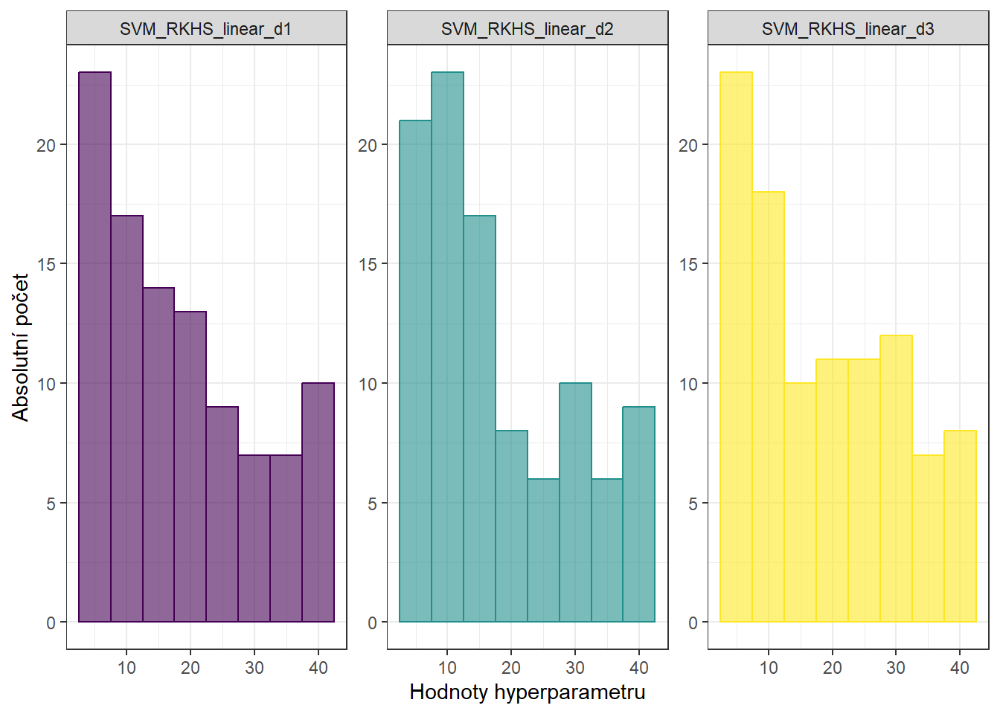
<p class="caption">(\#fig:unnamed-chunk-148)Histogramy hodnot hyperparametrů metody RKHS + SVM s lineárním jádrem.</p>
</div>


## Klasifikace na základě druhé derivace

V předchozí části jsme uvažovali první derivaci křivek. Nyní zopakujme celý proces na druhých derivacích.
V každé ze dvou tříd budeme uvažovat 100 pozorování, tedy `n = 100`.


```r
# pocet vygenerovanych pozorovani pro kazdou tridu
set.seed(42)
n <- 100
# vektor casu ekvidistantni na intervalu [0, 6]
t <- seq(0, 6, length = 51)

# pro Y = 0
X0 <- generate_values(t, funkce_0, n, 1, 2)
# pro Y = 1
X1 <- generate_values(t, funkce_1, n, 1, 2)
```

Vykreslíme vygenerované (ještě nevyhlazené) funkce barevně v závislosti na třídě (pouze prvních 10 pozorování z každé třídy pro přehlednost).


```r
n_curves_plot <- 10 # pocet krivek, ktere chceme vykreslit z kazde skupiny

DF0 <- cbind(t, X0[, 1:n_curves_plot]) |> 
  as.data.frame() |> 
  reshape(varying = 2:(n_curves_plot + 1), direction = 'long', sep = '') |> 
  subset(select = -id) |> 
  mutate(
  time = time - 1,
  group = 0
  )

DF1 <- cbind(t, X1[, 1:n_curves_plot]) |> 
  as.data.frame() |> 
  reshape(varying = 2:(n_curves_plot + 1), direction = 'long', sep = '') |> 
  subset(select = -id) |> 
  mutate(
  time = time - 1,
  group = 1
  )

DF <- rbind(DF0, DF1) |>
  mutate(group = factor(group))

DF |> ggplot(aes(x = t, y = V, group = interaction(time, group), 
                 colour = group)) + 
  geom_line(linewidth = 0.5) +
  theme_bw() +
  labs(x = expression(x[1]),
       y = expression(x[2]),
       colour = 'Klasifikační\n      třída') +
  scale_colour_discrete(labels=c('Y = 0', 'Y = 1'))
```

<div class="figure">

<p class="caption">(\#fig:unnamed-chunk-151)Prvních 10 vygenerovaných pozorování z každé ze dvou klasifikačních tříd. Pozorovaná data nejsou vyhlazená.</p>
</div>

### Vyhlazení pozorovaných křivek

Nyní převedeme pozorované diskrétní hodnoty (vektory hodnot) na funkcionální objekty, se kterými budeme následně pracovat.
Opět využijeme k vyhlazení B-sline bázi.

Za uzly bereme celý vektor `t`, jelikož uvažujeme první derivaci, volíme `norder = 6`.
Budeme penalizovat čtvrtou derivaci funkcí, neboť nyní požadujeme hladké i druhé derivace.


```r
rangeval <- range(t)
breaks <- t
norder <- 6

bbasis <- create.bspline.basis(rangeval = rangeval, 
                               norder = norder, 
                               breaks = breaks)

curv.Lfd <- int2Lfd(4) # penalizujeme 4. derivaci
```

Najdeme vhodnou hodnotu vyhlazovacího parametru $\lambda > 0$ pomocí $GCV(\lambda)$, tedy pomocí zobecněné cross--validace.
Hodnotu $\lambda$ budeme uvažovat pro obě klasifikační skupiny stejnou, neboť pro testovací pozorování bychom dopředu nevěděli, kterou hodnotu $\lambda$, v případě rozdílné volby pro každou třídu, máme volit.


```r
# spojeni pozorovani do jedne matice
XX <- cbind(X0, X1)

lambda.vect <- 10^seq(from = -4, to = -2, length.out = 50) # vektor lambd
gcv <- rep(NA, length = length(lambda.vect)) # prazdny vektor pro ulozebi GCV

for(index in 1:length(lambda.vect)) {
  curv.Fdpar <- fdPar(bbasis, curv.Lfd, lambda.vect[index])
  BSmooth <- smooth.basis(t, XX, curv.Fdpar) # vyhlazeni
  gcv[index] <- mean(BSmooth$gcv) # prumer pres vsechny pozorovane krivky
}

GCV <- data.frame(
  lambda = round(log10(lambda.vect), 3),
  GCV = gcv
)

# najdeme hodnotu minima
lambda.opt <- lambda.vect[which.min(gcv)]
```

Pro lepší znázornění si vykreslíme průběh $GCV(\lambda)$.


```r
GCV |> ggplot(aes(x = lambda, y = GCV)) + 
  geom_line(linetype = 'solid', linewidth = 0.6) + 
  geom_point(size = 1.5) + 
  theme_bw() + 
  labs(x = bquote(paste(log[10](lambda), ' ;   ', 
                        lambda[optimal] == .(round(lambda.opt, 4)))),
       y = expression(GCV(lambda))) + 
  geom_point(aes(x = log10(lambda.opt), y = min(gcv)), colour = 'red', size = 2.5)
```

<div class="figure">

<p class="caption">(\#fig:unnamed-chunk-154)Průběh $GCV(\lambda)$ pro zvolený vektor $\boldsymbol\lambda$. Na ose $x$ jsou hodnoty vyneseny v logaritmické škále. Červeně je znázorněna optimální hodnota vyhlazovacího parametru $\lambda_{optimal}$.</p>
</div>

S touto optimální volbou vyhlazovacího parametru $\lambda$ nyní vyhladíme všechny funkce a opět znázorníme graficky prvních 10 pozorovaných křivek z každé klasifikační třídy.


```r
curv.fdPar <- fdPar(bbasis, curv.Lfd, lambda.opt)
BSmooth <- smooth.basis(t, XX, curv.fdPar)
XXfd <- BSmooth$fd

fdobjSmootheval <- eval.fd(fdobj = XXfd, evalarg = t)
DF$Vsmooth <- c(fdobjSmootheval[, c(1 : n_curves_plot, 
                                    (n + 1) : (n + n_curves_plot))])

DF |> ggplot(aes(x = t, y = Vsmooth, group = interaction(time, group), 
                 colour = group)) + 
  geom_line(linewidth = 0.75) +
  theme_bw() +
  labs(x = expression(x[1]),
       y = expression(x[2]),
       colour = 'Klasifikační\n      třída') +
  scale_colour_discrete(labels=c('Y = 0', 'Y = 1'))
```

<div class="figure">
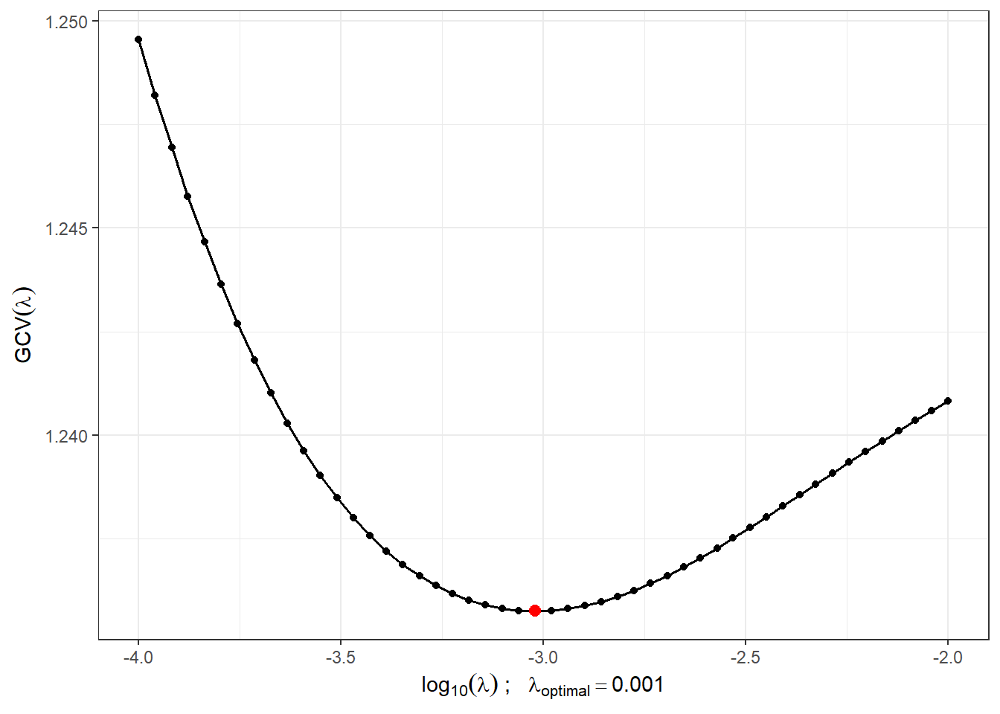
<p class="caption">(\#fig:unnamed-chunk-155)Prvních 10 vyhlazených křivek z každé klasifikační třídy.</p>
</div>

Ještě znázorněme všechny křivky včetně průměru zvlášť pro každou třídu.


```r
DFsmooth <- data.frame(
  t = rep(t, 2 * n),
  time = rep(rep(1:n, each = length(t)), 2),
  Smooth = c(fdobjSmootheval),
  Mean = c(rep(apply(fdobjSmootheval[ , 1 : n], 1, mean), n),
            rep(apply(fdobjSmootheval[ , (n + 1) : (2 * n)], 1, mean), n)),
  group = factor(rep(c(0, 1), each = n * length(t)))
)

DFmean <- data.frame(
  t = rep(t, 2),
  Mean = c(apply(fdobjSmootheval[ , 1 : n], 1, mean), 
            apply(fdobjSmootheval[ , (n + 1) : (2 * n)], 1, mean)),
  group = factor(rep(c(0, 1), each = length(t)))
)

DFsmooth |> ggplot(aes(x = t, y = Smooth, group = interaction(time, group), 
                 colour = group)) + 
  geom_line(linewidth = 0.25, alpha = 0.5) +
  theme_bw() +
  labs(x = expression(x[1]),
       y = expression(x[2]),
       colour = 'Klasifikační\n      třída') +
  scale_colour_discrete(labels = c('Y = 0', 'Y = 1')) + 
  geom_line(aes(x = t, y = Mean, colour = group), 
            linewidth = 1.2, linetype = 'solid') + 
  scale_x_continuous(expand = c(0.01, 0.01)) + 
  #ylim(c(-1, 2)) + 
  scale_y_continuous(expand = c(0.01, 0.01))#, limits = c(-1, 2))
```

<div class="figure">
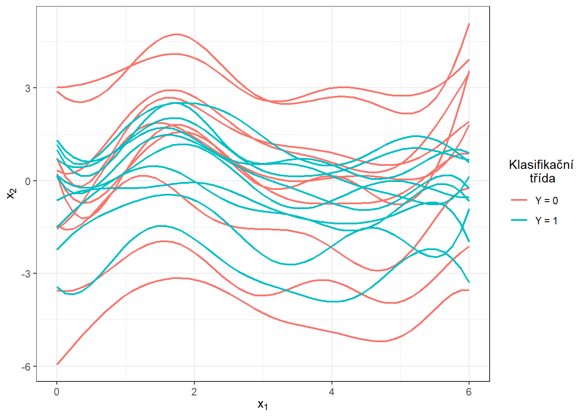
<p class="caption">(\#fig:unnamed-chunk-156)Vykreslení všech vyhlazených pozorovaných křivek, barevně jsou odlišeny křivky podle příslušnosti do klasifikační třídy. Černou čerchovanou čarou je zakreslen průměr pro každou třídu.</p>
</div>


```r
DFsmooth <- data.frame(
  t = rep(t, 2 * n),
  time = rep(rep(1:n, each = length(t)), 2),
  Smooth = c(fdobjSmootheval),
  Mean = c(rep(apply(fdobjSmootheval[ , 1 : n], 1, mean), n),
            rep(apply(fdobjSmootheval[ , (n + 1) : (2 * n)], 1, mean), n)),
  group = factor(rep(c(0, 1), each = n * length(t)))
)

DFmean <- data.frame(
  t = rep(t, 2),
  Mean = c(apply(fdobjSmootheval[ , 1 : n], 1, mean), 
            apply(fdobjSmootheval[ , (n + 1) : (2 * n)], 1, mean)),
  group = factor(rep(c(0, 1), each = length(t)))
)

DFsmooth |> ggplot(aes(x = t, y = Smooth, group = interaction(time, group), 
                 colour = group)) + 
  geom_line(linewidth = 0.25, alpha = 0.5) +
  theme_bw() +
  labs(x = expression(x[1]),
       y = expression(x[2]),
       colour = 'Klasifikační\n      třída') +
  scale_colour_discrete(labels = c('Y = 0', 'Y = 1')) + 
  geom_line(aes(x = t, y = Mean, colour = group), 
            linewidth = 1.2, linetype = 'solid') + 
  scale_x_continuous(expand = c(0.01, 0.01)) + 
  #ylim(c(-1, 2)) + 
  scale_y_continuous(expand = c(0.01, 0.01), limits = c(-1, 2))
```

<div class="figure">

<p class="caption">(\#fig:unnamed-chunk-157)Vykreslení všech vyhlazených pozorovaných křivek, barevně jsou odlišeny křivky podle příslušnosti do klasifikační třídy. Černou čerchovanou čarou je zakreslen průměr pro každou třídu. Přiblížený pohled.</p>
</div>

### Výpočet derivací

K výpočtu derivace pro funkcionální objekt využijeme v `R` funkci `deriv.fd()` z balíčku `fda`. Jelikož chceme klasifikovat na základě 2. derivace, volíme argument `Lfdobj = 2`.


```r
XXder <- deriv.fd(XXfd, 2)
```

Nyní si vykresleme prvních několik prvních derivací pro obě klasifikační třídy. Všimněme si z obrázku níže, že se opravdu vertikální posun pomocí derivování opravdu podařilo odstranit. Ztratili jsme tím ale do jisté míry rozdílnost mezi křivkami, protože jak z obrázku vyplývá, křivky derivací pro obě třídy se liší primárně až ke konci intervalu, tedy pro argument v rozmezí přibližně $[5, 6]$.


```r
fdobjSmootheval <- eval.fd(fdobj = XXder, evalarg = t)
DF$Vsmooth <- c(fdobjSmootheval[, c(1 : n_curves_plot, 
                                    (n + 1) : (n + n_curves_plot))])

DF |> ggplot(aes(x = t, y = Vsmooth, group = interaction(time, group), 
                 colour = group)) + 
  geom_line(linewidth = 0.75) +
  theme_bw() +
  labs(x = expression(x[1]),
       y = expression(x[2]),
       colour = 'Klasifikační\n      třída') +
  scale_colour_discrete(labels=c('Y = 0', 'Y = 1'))
```

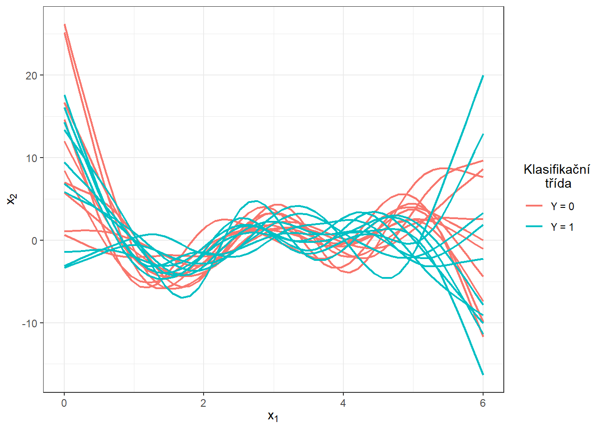

Ještě znázorněme všechny křivky včetně průměru zvlášť pro každou třídu.


```r
abs.labs <- paste("Klasifikační třída:", c("$Y = 0$", "$Y = 1$"))
names(abs.labs) <- c('0', '1')

# fdobjSmootheval <- eval.fd(fdobj = XXfd, evalarg = t)

DFsmooth <- data.frame(
  t = rep(t, 2 * n),
  time = rep(rep(1:n, each = length(t)), 2),
  Smooth = c(fdobjSmootheval),
  group = factor(rep(c(0, 1), each = n * length(t)))
)

DFmean <- data.frame(
  t = rep(t, 2),
  Mean = c(eval.fd(fdobj = mean.fd(XXder[1:n]), evalarg = t),
           eval.fd(fdobj = mean.fd(XXder[(n + 1):(2 * n)]), evalarg = t)),
  group = factor(rep(c(0, 1), each = length(t)))
)

DFsmooth |> ggplot(aes(x = t, y = Smooth, #group = interaction(time, group), 
                 colour = group)) + 
  geom_line(aes(group = time), linewidth = 0.05, alpha = 0.5) +
  theme_bw() +
  labs(x = "$t$",
       # y = "$\\frac{\\text d}{\\text d t} x_i(t)$",
       y ="$x_i'(t)$",
       colour = 'Klasifikační\n      třída') +
  # geom_line(data = DFsmooth |> 
  #             mutate(group = factor(ifelse(group == '0', '1', '0'))) |> 
  #             filter(group == '1'),
  #           aes(x = t, y = Mean, colour = group), 
  #           colour = 'tomato', linewidth = 0.8, linetype = 'solid') + 
  # geom_line(data = DFsmooth |> 
  #             mutate(group = factor(ifelse(group == '0', '1', '0'))) |> 
  #             filter(group == '0'),
  #           aes(x = t, y = Mean, colour = group), 
  #           colour = 'deepskyblue2', linewidth = 0.8, linetype = 'solid') + 
  geom_line(data = DFmean |> 
              mutate(group = factor(ifelse(group == '0', '1', '0'))),
            aes(x = t, y = Mean, colour = group), 
            colour = 'grey2', linewidth = 0.8, linetype = 'dashed') + 
  geom_line(data = DFmean, aes(x = t, y = Mean, colour = group), 
            colour = 'grey2', linewidth = 1.25, linetype = 'solid') + 
  scale_x_continuous(expand = c(0.01, 0.01)) +
  facet_wrap(~group, labeller = labeller(group = abs.labs)) +
  scale_y_continuous(expand = c(0.02, 0.02)) +
  theme(legend.position = 'none',
        plot.margin = unit(c(0.1, 0.1, 0.3, 0.5), "cm")) +
  coord_cartesian(ylim = c(-20, 20)) +
  scale_colour_manual(values = c('tomato', 'deepskyblue2'))
```

<div class="figure">
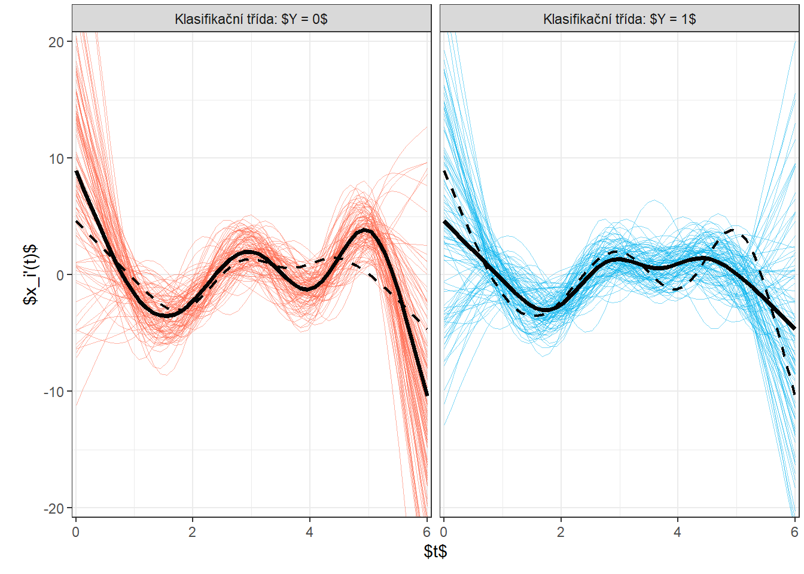
<p class="caption">(\#fig:unnamed-chunk-161)Vykreslení všech vyhlazených pozorovaných křivek, barevně jsou odlišeny křivky podle příslušnosti do klasifikační třídy. Černou čerchovanou čarou je zakreslen průměr pro každou třídu.</p>
</div>

```r
# ggsave("figures/kap6_sim_04_curves_2der.tex", device = tikz, width = 8, height = 4)
```


```r
DFsmooth <- data.frame(
  t = rep(t, 2 * n),
  time = rep(rep(1:n, each = length(t)), 2),
  Smooth = c(fdobjSmootheval),
  Mean = c(rep(apply(fdobjSmootheval[ , 1 : n], 1, mean), n),
            rep(apply(fdobjSmootheval[ , (n + 1) : (2 * n)], 1, mean), n)),
  group = factor(rep(c(0, 1), each = n * length(t)))
)

DFmean <- data.frame(
  t = rep(t, 2),
  Mean = c(apply(fdobjSmootheval[ , 1 : n], 1, mean), 
            apply(fdobjSmootheval[ , (n + 1) : (2 * n)], 1, mean)),
  group = factor(rep(c(0, 1), each = length(t)))
)

DFsmooth |> ggplot(aes(x = t, y = Smooth, group = interaction(time, group), 
                 colour = group)) + 
  geom_line(linewidth = 0.25, alpha = 0.5) +
  theme_bw() +
  labs(x = expression(x[1]),
       y = expression(x[2]),
       colour = 'Klasifikační\n      třída') +
  scale_colour_discrete(labels = c('Y = 0', 'Y = 1')) + 
  geom_line(aes(x = t, y = Mean), colour = 'grey3', 
            linewidth = 0.7, linetype = 'dashed') + 
  scale_x_continuous(expand = c(0.01, 0.01)) + 
  #ylim(c(-1, 2)) + 
  scale_y_continuous(expand = c(0.01, 0.01), limits = c(-12, 10))
```

<div class="figure">

<p class="caption">(\#fig:unnamed-chunk-162)Vykreslení všech vyhlazených pozorovaných křivek, barevně jsou odlišeny křivky podle příslušnosti do klasifikační třídy. Černou čerchovanou čarou je zakreslen průměr pro každou třídu. Přiblížený pohled.</p>
</div>


### Klasifikace křivek

Nejprve načteme potřebné knihovny pro klasifikaci.


```r
library(caTools) # pro rozdeleni na testovaci a trenovaci
library(caret) # pro k-fold CV
library(fda.usc) # pro KNN, fLR
library(MASS) # pro LDA
library(fdapace)
library(pracma)
library(refund) # pro LR na skorech
library(nnet) # pro LR na skorech
library(caret)
library(rpart) # stromy
library(rattle) # grafika
library(e1071)
library(randomForest) # nahodny les
```

Abychom mohli jednotlivé klasifikátory porovnat, rozdělíme množinu vygenerovaných pozorování na dvě části v poměru 70:30, a to na trénovací a testovací (validační) část.
Trénovací část použijeme při konstrukci klasifikátoru a testovací na výpočet chyby klasifikace a případně dalších charakteristik našeho modelu.
Výsledné klasifikátory podle těchto spočtených charakteristik můžeme následně porovnat mezi sebou z pohledu jejich úspěnosti klasifikace.


```r
# rozdeleni na testovaci a trenovaci cast
split <- sample.split(XXder$fdnames$reps, SplitRatio = 0.7)

Y <- rep(c(0, 1), each = n)

X.train <- subset(XXder, split == TRUE)
X.test <- subset(XXder, split == FALSE)

Y.train <- subset(Y, split == TRUE)
Y.test <- subset(Y, split == FALSE)
```

Ještě se podíváme na zastoupení jednotlivých skupin v testovací a trénovací části dat.


```r
# absolutni zastoupeni
table(Y.train)
```

```
## Y.train
##  0  1 
## 71 69
```

```r
table(Y.test)
```

```
## Y.test
##  0  1 
## 29 31
```

```r
# relativni zastoupeni
table(Y.train) / sum(table(Y.train))
```

```
## Y.train
##         0         1 
## 0.5071429 0.4928571
```

```r
table(Y.test) / sum(table(Y.test))
```

```
## Y.test
##         0         1 
## 0.4833333 0.5166667
```

#### $K$ nejbližších sousedů

Začněme neparametrickou klasifikační metodou, a to metodou $K$ nejbližších sousedů.
Nejprve si vytvoříme potřebné objekty tak, abychom s nimi mohli pomocí funkce `classif.knn()` z knihovny `fda.usc` dále pracovat.


```r
x.train <- fdata(X.train)
y.train <- as.numeric(factor(Y.train))
```

Nyní můžeme definovat model a podívat se na jeho úspěšnost klasifikace.
Poslední otázkou však zůstává, jak volit optimální počet sousedů $K$.
Mohli bychom tento počet volit jako takové $K$, při kterém nastává minimální chybovost na trénovacích datech.
To by ale mohlo vést k přeučení modelu, proto využijeme cross-validaci.
Vzhledem k výpočetní náročnosti a rozsahu souboru zvolíme $k$-násobnou CV, my zvolíme například hodnotu $k = {10}$.


```r
# model pro vsechna trenovaci data pro K = 1, 2, ..., sqrt(n_train)
neighb.model <- classif.knn(group = y.train, 
                            fdataobj = x.train, 
                            knn = c(1:round(sqrt(length(y.train))))) 

summary(neighb.model) # shrnuti modelu
```

```
##      - SUMMARY - 
## 
## -Probability of correct classification by group (prob.classification):
## y
##         1         2 
## 0.9154930 0.7826087 
## 
## -Confusion matrix between the theoretical groups (by rows)
##   and estimated groups (by column) 
##    
##      1  2
##   1 65  6
##   2 15 54
## 
## -Vector of probability of correct classification
##    by number of neighbors (knn):
##      1      2      3      4      5      6      7      8      9     10     11 
## 0.8071 0.8071 0.8000 0.8214 0.8071 0.8000 0.8143 0.8357 0.8286 0.8214 0.8357 
##     12 
## 0.8500 
## 
## -Optimal number of neighbors: knn.opt= 12 
## with highest probability of correct classification max.prob=  0.85 
## 
## -Probability of correct classification:  0.85
```

```r
plot(neighb.model$gcv, pch = 16) # vykresleni zavislosti GCV na poctu sousedu K
```

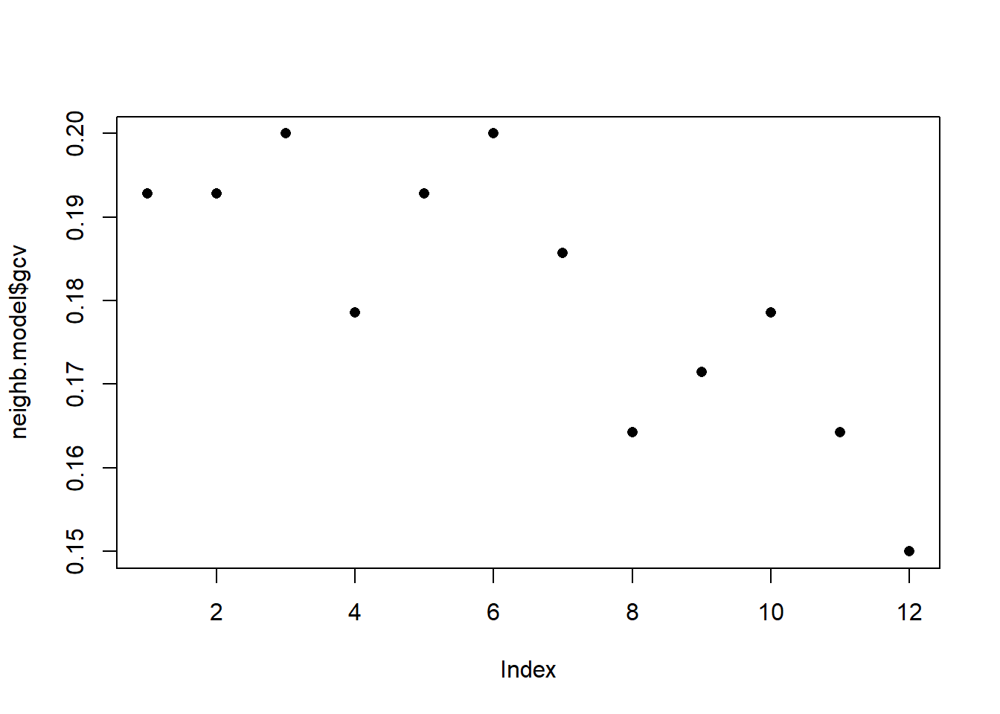

```r
neighb.model$max.prob # maximalni presnost
```

```
## [1] 0.85
```

```r
(K.opt <- neighb.model$h.opt) # optimalni hodnota K
```

```
## [1] 12
```

Proveďme předchozí postup pro trénovací data, která rozdělíme na $k$ částí a tedy zopakujeme tuto část kódu $k$-krát.


```r
k_cv <- 10 # k-fold CV
neighbours <- c(1:(2 * ceiling(sqrt(length(y.train))))) # pocet sousedu 

# rozdelime trenovaci data na k casti
folds <- createMultiFolds(X.train$fdnames$reps, k = k_cv, time = 1)

# prazdna matice, do ktere vlozime jednotlive vysledky
# ve sloupcich budou hodnoty presnosti pro danou cast trenovaci mnoziny
# v radcich budou hodnoty pro danou hodnotu K sousedu
CV.results <- matrix(NA, nrow = length(neighbours), ncol = k_cv)

for (index in 1:k_cv) {
  # definujeme danou indexovou mnozinu
  fold <- folds[[index]]
    
  x.train.cv <- subset(X.train, c(1:length(X.train$fdnames$reps)) %in% fold) |>
    fdata()
  y.train.cv <- subset(Y.train, c(1:length(X.train$fdnames$reps)) %in% fold) |>
    factor() |> as.numeric()
  
  x.test.cv <- subset(X.train, !c(1:length(X.train$fdnames$reps)) %in% fold) |>
    fdata()
  y.test.cv <- subset(Y.train, !c(1:length(X.train$fdnames$reps)) %in% fold) |>
    factor() |> as.numeric()
  
  # projdeme kazdou cast ... k-krat zopakujeme
  for(neighbour in neighbours) {
    # model pro konkretni volbu K
    neighb.model <- classif.knn(group = y.train.cv, 
                              fdataobj = x.train.cv, 
                              knn = neighbour) 
    # predikce na validacni casti
    model.neighb.predict <- predict(neighb.model, 
                                    new.fdataobj = x.test.cv)
    # presnost na validacni casti
    presnost <- table(y.test.cv, model.neighb.predict) |> 
      prop.table() |> diag() |> sum()
    
    # presnost vlozime na pozici pro dane K a fold
    CV.results[neighbour, index] <- presnost
  }
}

# spocitame prumerne presnosti pro jednotliva K pres folds
CV.results <- apply(CV.results, 1, mean)
K.opt <- which.max(CV.results)
presnost.opt.cv <- max(CV.results)
CV.results
```

```
##  [1] 0.8041265 0.7883817 0.7897586 0.7879866 0.8094504 0.8133647 0.8367856
##  [8] 0.7900529 0.8276922 0.8008575 0.8232979 0.8382659 0.8213426 0.8099140
## [15] 0.8060450 0.8006226 0.8212531 0.8165782 0.7892888 0.7642423 0.7881684
## [22] 0.7851269 0.7988126 0.7761255
```

Vidíme, že nejlépe vychází hodnota parametru $K$ jako 12 s hodnotou přesnosti spočtenou pomocí 10-násobné CV 0.8383.
Pro přehlednost si ještě vykresleme průběh validační chybovosti v závislosti na počtu sousedů $K$.


```r
CV.results <- data.frame(K = neighbours, CV = CV.results)
CV.results |> ggplot(aes(x = K, y = 1 - CV)) + 
  geom_line(linetype = 'dashed', colour = 'grey') + 
  geom_point(size = 1.5) + 
  geom_point(aes(x = K.opt, y = 1 - presnost.opt.cv), colour = 'red', size = 2) +
  theme_bw() + 
  labs(x = bquote(paste(K, ' ;   ', 
                        K[optimal] == .(K.opt))),
       y = 'Validační chybovost') + 
  scale_x_continuous(breaks = neighbours)
```

<div class="figure">
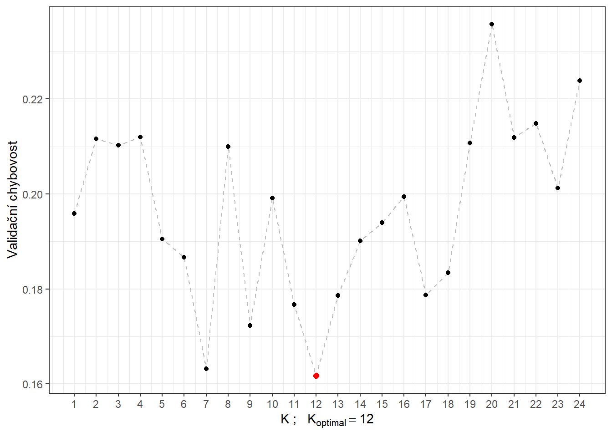
<p class="caption">(\#fig:unnamed-chunk-169)Závislost validační chybovosti na hodnotě $K$, tedy na počtu sousedů.</p>
</div>

Nyní známe optimální hodnotu parametru $K$ a tudíž můžeme sestavit finální model.


```r
neighb.model <- classif.knn(group = y.train, fdataobj = x.train, knn = K.opt)

# predikce
model.neighb.predict <- predict(neighb.model, 
                                new.fdataobj = fdata(X.test))

summary(neighb.model)
```

```
##      - SUMMARY - 
## 
## -Probability of correct classification by group (prob.classification):
## y
##         1         2 
## 0.9154930 0.7826087 
## 
## -Confusion matrix between the theoretical groups (by rows)
##   and estimated groups (by column) 
##    
##      1  2
##   1 65  6
##   2 15 54
## 
## -Vector of probability of correct classification
##    by number of neighbors (knn):
##   12 
## 0.85 
## 
## -Optimal number of neighbors: knn.opt= 12 
## with highest probability of correct classification max.prob=  0.85 
## 
## -Probability of correct classification:  0.85
```

```r
# presnost na testovacich datech
presnost <- table(as.numeric(factor(Y.test)), model.neighb.predict) |>
  prop.table() |>
  diag() |>
  sum()
# chybovost
1 - presnost
```

```
## [1] 0.15
```

Vidíme tedy, že přesnost modelu sestrojeného pomocí metody $K$ nejbližších sousedů s optimální volbou $K_{optimal}$ rovnou 12, kterou jsme určili cross-validací, je na trénovacích datech rovna 0.15 a na testovacích datech 0.15.

K porovnání jendotlivých modelů můžeme použít oba typy chybovostí, pro přehlednost si je budeme ukládat do tabulky.


```r
RESULTS <- data.frame(model = 'KNN', 
                      Err.train = 1 - neighb.model$max.prob,
                      Err.test = 1 - presnost)
```

#### Lineární diskriminační analýza

Jako druhou metodu pro sestrojení klasifikátoru budeme uvažovat lineární diskriminační analýzu (LDA).
Jelikož tato metoda nelze aplikovat na funkcionální data, musíme je nejprve diskretizovat, což provedeme pomocí funkcionální analýzy hlavních komponent.
Klasifikační algoritmus následně provedeme na skórech prvních $p$ hlavních komponent.
Počet komponent $p$ zvolíme tak, aby prvních $p$ hlavních komponent dohromady vysvětlovalo alespoň 90 % variability v datech.

Proveďme tedy nejprve funkcionální analýzu hlavních komponent a určeme počet $p$.


```r
# analyza hlavnich komponent
data.PCA <- pca.fd(X.train, nharm = 10) # nharm - maximalni pocet HK
nharm <- which(cumsum(data.PCA$varprop) >= 0.9)[1] # urceni p
if(nharm == 1) nharm <- 2

data.PCA <- pca.fd(X.train, nharm = nharm) 
data.PCA.train <- as.data.frame(data.PCA$scores) # skore prvnich p HK
data.PCA.train$Y <- factor(Y.train) # prislusnost do trid
```

V tomto konkrétním případě jsme za počet hlavních komponent vzali $p$ = 3, které dohromady vysvětlují 90.88 % variability v datech.
První hlavní komponenta potom vysvětluje 45.83 % a druhá 36.91 % variability.
Graficky si můžeme zobrazit hodnoty skórů prvních dvou hlavních komponent, barevně odlišených podle příslušnosti do klasifikační třídy.


```r
data.PCA.train |> ggplot(aes(x = V1, y = V2, colour = Y)) +
  geom_point(size = 1.5) + 
  labs(x = paste('1. hlavní komponenta (vysvětlená variabilita', 
                 round(100 * data.PCA$varprop[1], 2), '%)'),
       y = paste('2. hlavní komponenta (', 
                 round(100 * data.PCA$varprop[2], 2), '%)'),
       colour = 'Group') +
  scale_colour_discrete(labels = c('Y = 0', 'Y = 1')) +
  theme_bw()
```

<div class="figure">

<p class="caption">(\#fig:unnamed-chunk-173)Hodnoty skórů prvních dvou hlavních komponent pro trénovací data. Barevně jsou odlišeny body podle příslušnosti do klasifikační třídy.</p>
</div>

Abychom mohli určit přesnost klasifikace na testovacích datech, potřebujeme spočítat skóre pro první 3 hlavní komponenty pro testovací data.
Tato skóre určíme pomocí vzorce:

$$
\xi_{i, j} = \int \left( X_i(t) - \mu(t)\right) \cdot \rho_j(t)\text dt,
$$ kde $\mu(t)$ je střední hodnota (průměrná funkce) a $\rho_j(t)$ vlastní fukce (funkcionální hlavní komponenty).


```r
# vypocet skoru testovacich funkci
scores <- matrix(NA, ncol = nharm, nrow = length(Y.test)) # prazdna matice 

for(k in 1:dim(scores)[1]) {
  xfd = X.test[k] - data.PCA$meanfd[1] # k-te pozorovani - prumerna funkce
  scores[k, ] = inprod(xfd, data.PCA$harmonics) 
  # skalarni soucin rezidua a vlastnich funkci rho (funkcionalni hlavni komponenty)
}

data.PCA.test <- as.data.frame(scores)
data.PCA.test$Y <- factor(Y.test)
colnames(data.PCA.test) <- colnames(data.PCA.train) 
```

Nyní již můžeme sestrojit klasifikátor na trénovací části dat.


```r
# model
clf.LDA <- lda(Y ~ ., data = data.PCA.train)

# presnost na trenovacich datech
predictions.train <- predict(clf.LDA, newdata = data.PCA.train)
presnost.train <- table(data.PCA.train$Y, predictions.train$class) |>
  prop.table() |> diag() |> sum()
  
# presnost na testovacich datech
predictions.test <- predict(clf.LDA, newdata = data.PCA.test)
presnost.test <- table(data.PCA.test$Y, predictions.test$class) |>
  prop.table() |> diag() |> sum()
```

Spočítali jsme jednak přesnost klasifikátoru na trénovacích (86.43 %), tak i na testovacích datech (81.67 %).

Pro grafické znázornění metody můžeme zaznačit dělící hranici do grafu skórů prvních dvou hlavních komponent.
Tuto hranici spočítáme na husté síti bodů a zobrazíme ji pomocí funkce `geom_contour()`.


```r
# pridame diskriminacni hranici
np <- 1001 # pocet bodu site
# x-ova osa ... 1. HK
nd.x <- seq(from = min(data.PCA.train$V1), 
            to = max(data.PCA.train$V1), length.out = np)
# y-ova osa ... 2. HK
nd.y <- seq(from = min(data.PCA.train$V2), 
            to = max(data.PCA.train$V2), length.out = np)
# pripad pro 2 HK ... p = 2
nd <- expand.grid(V1 = nd.x, V2 = nd.y)
# pokud p = 3
if(dim(data.PCA.train)[2] == 4) {
  nd <- expand.grid(V1 = nd.x, V2 = nd.y, V3 = data.PCA.train$V3[1])}
# pokud p = 4
if(dim(data.PCA.train)[2] == 5) {
  nd <- expand.grid(V1 = nd.x, V2 = nd.y, V3 = data.PCA.train$V3[1],
                    V4 = data.PCA.train$V4[1])}
# pokud p = 5
if(dim(data.PCA.train)[2] == 6) {
  nd <- expand.grid(V1 = nd.x, V2 = nd.y, V3 = data.PCA.train$V3[1],
                    V4 = data.PCA.train$V4[1], V5 = data.PCA.train$V5[1])}

# pridame Y = 0, 1
nd <- nd |> mutate(prd = as.numeric(predict(clf.LDA, newdata = nd)$class))

data.PCA.train |> ggplot(aes(x = V1, y = V2, colour = Y)) +
  geom_point(size = 1.5) + 
  labs(x = paste('1. hlavní komponenta (vysvětlená variabilita', 
                 round(100 * data.PCA$varprop[1], 2), '%)'),
       y = paste('2. hlavní komponenta (', 
                 round(100 * data.PCA$varprop[2], 2), '%)'),
       colour = 'Group') +
  scale_colour_discrete(labels = c('Y = 0', 'Y = 1')) +
  theme_bw() +
  geom_contour(data = nd, aes(x = V1, y = V2, z = prd), colour = 'black')
```

<div class="figure">
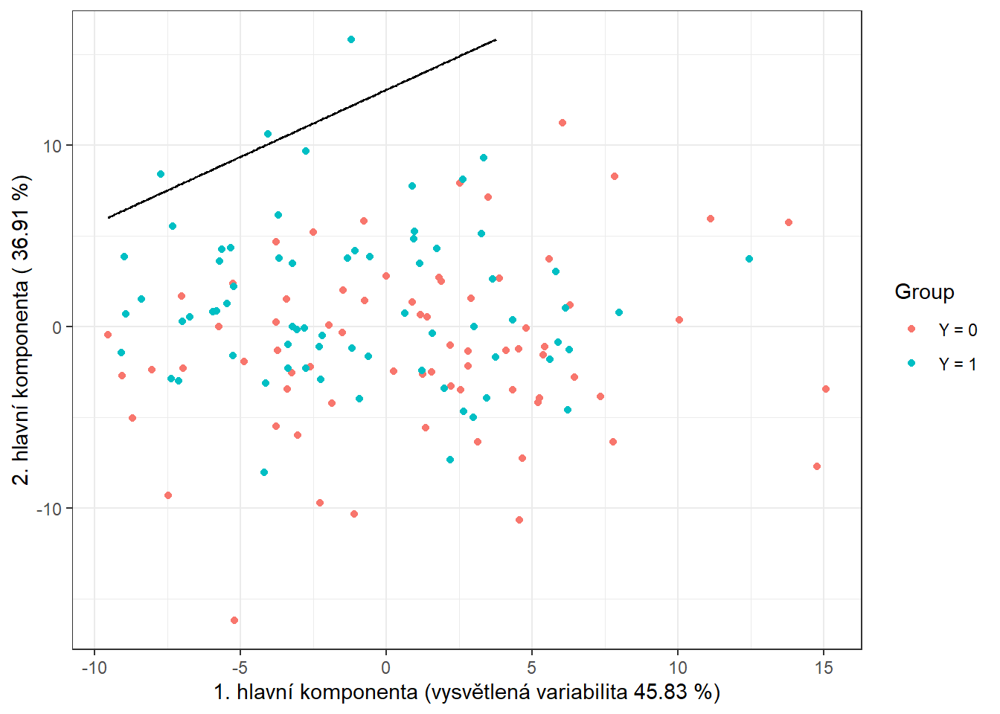
<p class="caption">(\#fig:unnamed-chunk-176)Skóre prvních dvou hlavních komponent, barevně odlišené podle příslušnosti do klasifikační třídy. Černě je vyznačena dělící hranice (přímka v rovině prvních dvou hlavních komponent) mezi třídami sestrojená pomocí LDA.</p>
</div>

Vidíme, že dělící hranicí je přímka, lineární funkce v prostoru 2D, což jsme ostatně od LDA čekali.
Nakonec přidáme chybovosti do souhrnné tabulky.


```r
Res <- data.frame(model = 'LDA', 
                  Err.train = 1 - presnost.train,
                  Err.test = 1 - presnost.test)

RESULTS <- rbind(RESULTS, Res)
```

#### Kvadratická diskriminační analýza

Jako další sestrojme klasifikátor pomocí kvadratické diskriminační analýzy (QDA).
Jedná se o analogický případ jako LDA s tím rozdílem, že nyní připouštíme pro každou ze tříd rozdílnou kovarianční matici normálního rozdělení, ze kterého pocházejí příslušné skóry.
Tento vypuštěný předpoklad o rovnosti kovariančních matic vede ke kvadratické hranici mezi třídami.

V `R` se provede QDA analogicky jako LDA v předchozí části, tedy opět bychom pomocí funkcionální analýzy hlavních komponent spočítali skóre pro trénovací i testovací funkce, sestrojili klasifikátor na skórech prvních $p$ hlavních komponent a pomocí něj predikovali příslušnost testovacích křivek do třídy $Y^* \in \{0, 1\}$.

Funkcionální PCA provádět nemusíme, využijeme výsledků z části LDA.


Můžeme tedy rovnou přistoupit k sestrojení klasifikátoru, což provedeme pomocí funkce `qda()`.
Následně spočítáme přesnost klasifikátoru na testovacích a trénovacích datech.


```r
# model
clf.QDA <- qda(Y ~ ., data = data.PCA.train)

# presnost na trenovacich datech
predictions.train <- predict(clf.QDA, newdata = data.PCA.train)
presnost.train <- table(data.PCA.train$Y, predictions.train$class) |>
  prop.table() |> diag() |> sum()
  
# presnost na testovacich datech
predictions.test <- predict(clf.QDA, newdata = data.PCA.test)
presnost.test <- table(data.PCA.test$Y, predictions.test$class) |>
  prop.table() |> diag() |> sum()
```

Spočítali jsme tedy jednak přesnost klasifikátoru na trénovacích (85.71 %), tak i na testovacích datech (85 %).

Pro grafické znázornění metody můžeme zaznačit dělící hranici do grafu skórů prvních dvou hlavních komponent.
Tuto hranici spočítáme na husté síti bodů a zobrazíme ji pomocí funkce `geom_contour()` stejně jako v případě LDA.


```r
nd <- nd |> mutate(prd = as.numeric(predict(clf.QDA, newdata = nd)$class))

data.PCA.train |> ggplot(aes(x = V1, y = V2, colour = Y)) +
  geom_point(size = 1.5) + 
  labs(x = paste('1. hlavní komponenta (vysvětlená variabilita', 
                 round(100 * data.PCA$varprop[1], 2), '%)'),
       y = paste('2. hlavní komponenta (', 
                 round(100 * data.PCA$varprop[2], 2), '%)'),
       colour = 'Group') +
  scale_colour_discrete(labels = c('Y = 0', 'Y = 1')) +
  theme_bw() +
  geom_contour(data = nd, aes(x = V1, y = V2, z = prd), colour = 'black')
```

<div class="figure">

<p class="caption">(\#fig:unnamed-chunk-182)Skóre prvních dvou hlavních komponent, barevně odlišené podle příslušnosti do klasifikační třídy. Černě je vyznačena dělící hranice (parabola v rovině prvních dvou hlavních komponent) mezi třídami sestrojená pomocí QDA.</p>
</div>

Všimněme si, že dělící hranicí mezi klasifikačními třídami je nyní parabola.

Nakonec ještě doplníme chybovosti do souhrnné tabulky.


```r
Res <- data.frame(model = 'QDA', 
                  Err.train = 1 - presnost.train,
                  Err.test = 1 - presnost.test)

RESULTS <- rbind(RESULTS, Res)
```

#### Logistická regrese

Logistickou regresi můžeme provést dvěma způsoby.
Jednak použít funkcionální obdobu klasické logistické regrese, druhak klasickou mnohorozměrnou logistickou regresi, kterou provedeme na skórech prvních $p$ hlavních komponent.

##### Funkcionální logistická regrese

Analogicky jako v případě konečné dimenze vstupních dat uvažujeme logistický model ve tvaru:

$$
g\left(\mathbb E [Y|X = x]\right) = \eta (x) = g(\pi(x)) = \alpha + \int \beta(t)\cdot x(t) \text d t,
$$ kde $\eta(x)$ je lineární prediktor nabývající hodnot z intervalu $(-\infty, \infty)$, $g(\cdot)$ je *linková funkce*, v případě logistické regrese se jedná o logitovou funkci $g: (0,1) \rightarrow \mathbb R,\ g(p) = \ln\frac{p}{1-p}$ a $\pi(x)$ podmíněná pravděpodobnost

$$
\pi(x) = \text{Pr}(Y = 1 | X = x) = g^{-1}(\eta(x)) = \frac{\text e^{\alpha + \int \beta(t)\cdot x(t) \text d t}}{1 + \text e^{\alpha + \int \beta(t)\cdot x(t) \text d t}},
$$

přičemž $\alpha$ je konstanta a $\beta(t) \in L^2[a, b]$ je parametrická funkce.
Naším cílem je odhadnout tuto parametrickou funkci.

Pro funkcionální logistickou regresi použijeme funkci `fregre.glm()` z balíčku `fda.usc`.
Nejprve si vytvoříme vhodné objekty pro konstrukci klasifikátoru.


```r
# vytvorime vhodne objekty
x.train <- fdata(X.train)
y.train <- as.numeric(Y.train)

# body, ve kterych jsou funkce vyhodnoceny
tt <- x.train[["argvals"]]

dataf <- as.data.frame(y.train) 
colnames(dataf) <- "Y"
# B-spline baze 
# basis1 <- X.train$basis
nbasis.x <- 20
basis1 <- create.bspline.basis(rangeval = rangeval, 
                               norder = norder, 
                               nbasis = nbasis.x)
```

Abychom mohli odhadnout parametrickou funkci $\beta(t)$, potřebujeme ji vyjádřit v nějaké bazické reprezentaci, v našem případě B-splinové bázi.
K tomu však potřebujeme najít vhodný počet bázových funkcí.
To bychom mohli určit na základě chybovosti na trénovacích datech, avšak tato data budou upřenostňovat výběr velkého počtu bází a bude docházet k přeučení modelu.

Ilustrujme si to na následujícím případě.
Pro každý z počtu bází $n_{basis} \in \{4, 5, \dots, 50\}$ natrénujeme model na trénovacích datech, určíme na nich chybovost a také spočítáme chybovost na testovacích datech.
Připomeňme, že k výběru vhodného počtu bází nemůžeme využít stejná data jako pro odhad testovací chybovosti, neboť bychom tuto chybovost podcenili.


```r
n.basis.max <- 30
n.basis <- 4:n.basis.max
pred.baz <- matrix(NA, nrow = length(n.basis), ncol = 2, 
                   dimnames = list(n.basis, c('Err.train', 'Err.test')))

for (i in n.basis) {
  # baze pro bety
  basis2 <- create.bspline.basis(rangeval = range(tt), nbasis = i)
  # vztah
  f <- Y ~ x
  # baze pro x a bety
  basis.x <- list("x" = basis1) # vyhlazene data
  basis.b <- list("x" = basis2)
  # vstupni data do modelu
  ldata <- list("df" = dataf, "x" = x.train)
  # binomicky model ... model logisticke regrese
  model.glm <- fregre.glm(f, family = binomial(), data = ldata,
                          basis.x = basis.x, basis.b = basis.b)
  
  # presnost na trenovacich datech
  predictions.train <- predict(model.glm, newx = ldata)
  predictions.train <- data.frame(Y.pred = ifelse(predictions.train < 1/2, 0, 1))
  presnost.train <- table(Y.train, predictions.train$Y.pred) |>
    prop.table() |> diag() |> sum()
    
  # presnost na testovacich datech
  newldata = list("df" = as.data.frame(Y.test), "x" = fdata(X.test))
  predictions.test <- predict(model.glm, newx = newldata)
  predictions.test <- data.frame(Y.pred = ifelse(predictions.test < 1/2, 0, 1))
  presnost.test <- table(Y.test, predictions.test$Y.pred) |>
    prop.table() |> diag() |> sum()
  
  # vlozime do matice
  pred.baz[as.character(i), ] <- 1 - c(presnost.train, presnost.test)
} 

pred.baz <- as.data.frame(pred.baz)
pred.baz$n.basis <- n.basis
```

Znázorněme si průběh obou typů chybovostí v grafu v závislosti na počtu bazických funkcí.


```r
n.basis.beta.opt <- pred.baz$n.basis[which.min(pred.baz$Err.test)]

pred.baz |> ggplot(aes(x = n.basis, y = Err.test)) + 
  geom_line(linetype = 'dashed', colour = 'black') + 
  geom_line(aes(x = n.basis, y = Err.train), colour = 'deepskyblue3', 
            linetype = 'dashed', linewidth = 0.5) + 
  geom_point(size = 1.5) + 
  geom_point(aes(x = n.basis, y = Err.train), colour = 'deepskyblue3', 
             size = 1.5) + 
  geom_point(aes(x = n.basis.beta.opt, y = min(pred.baz$Err.test)),
             colour = 'red', size = 2) +
  theme_bw() + 
  labs(x = bquote(paste(n[basis], ' ;   ', 
                        n[optimal] == .(n.basis.beta.opt))),
        y = 'Chybovost')
```

<div class="figure">
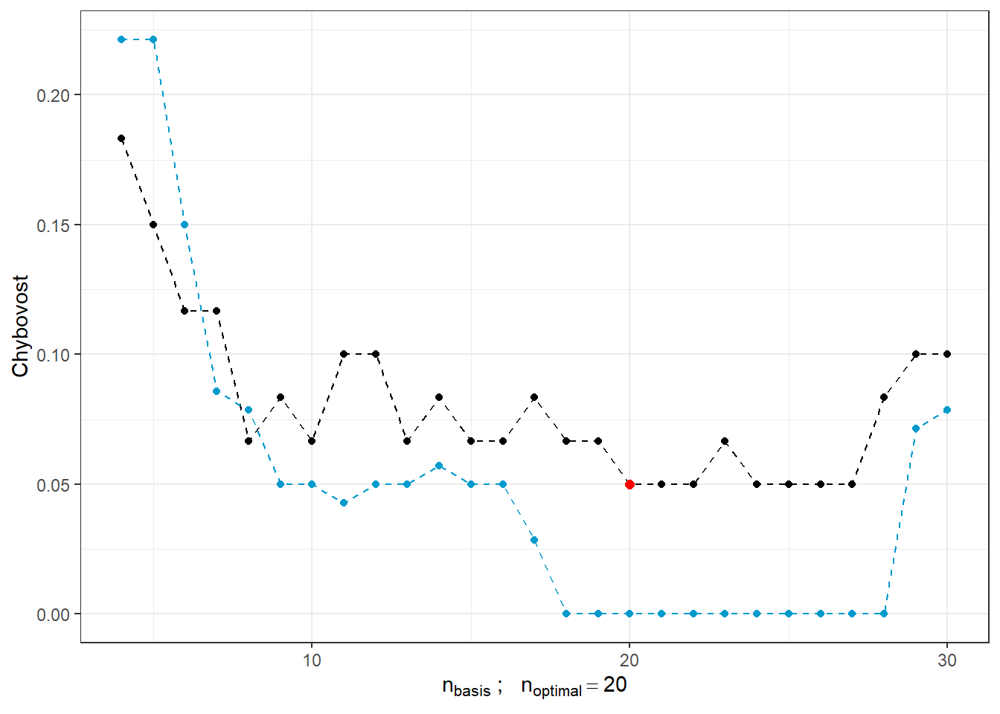
<p class="caption">(\#fig:unnamed-chunk-186)Závislost testovací a trénovací chybovosti na počtu bázových funkcí pro $\beta$. Červeným bodem je znázorněn optimální počet $n_{optimal}$ zvolený jako minimum testovací chybovosti, černou čarou je vykreslena testovací a modrou přerušovanou čarou je vykreslen průběh trénovací chybovosti.</p>
</div>

Vidíme, že s rostoucím počtem bází pro $\beta(t)$ má trénovací chybovost (modrá čára) tendenci klesat a tedy bychom na jejím základě volili velké hodnoty $n_{basis}$.
Naopak optimální volbou na základě testovací chybovosti je $n$ rovno 20, tedy výrazně menší hodnota než 50.
Naopak s rostoucím $n$ roste testovací chyvost, což ukazuje na přeučení modelu.

Z výše uvedených důvodů pro určení optimálního počtu bazických funkcí pro $\beta(t)$ využijeme 10-ti násobnou cross-validaci.
Jako maximální počet uvažovaných bazických funkcí bereme 25, neboť jak jsme viděli výše, nad touto hodnotou dochází již k přeučení modelu.


```r
### 10-fold cross-validation
n.basis.max <- 30
n.basis <- 4:n.basis.max
k_cv <- 10 # k-fold CV
# rozdelime trenovaci data na k casti
folds <- createMultiFolds(X.train$fdnames$reps, k = k_cv, time = 1)
## prvky, ktere se behem cyklu nemeni
# body, ve kterych jsou funkce vyhodnoceny
tt <- x.train[["argvals"]]
rangeval <- range(tt)
# B-spline baze 
basis1 <- create.bspline.basis(rangeval = rangeval, 
                               norder = norder, 
                               nbasis = nbasis.x)
# vztah
f <- Y ~ x
# baze pro x
basis.x <- list("x" = basis1)
# prazdna matice, do ktere vlozime jednotlive vysledky
# ve sloupcich budou hodnoty presnosti pro danou cast trenovaci mnoziny
# v radcich budou hodnoty pro dany pocet bazi
CV.results <- matrix(NA, nrow = length(n.basis), ncol = k_cv, 
                     dimnames = list(n.basis, 1:k_cv))
```

Nyní již máme vše připravené pro spočítání chybovosti na každé z deseti podmnožin trénovací množiny.
Následně určíme průměr a jako optimální $n$ vezmeme argument minima validační chybovosti.


```r
for (index in 1:k_cv) {
  # definujeme danou indexovou mnozinu
  fold <- folds[[index]]
    
  x.train.cv <- subset(X.train, c(1:length(X.train$fdnames$reps)) %in% fold) |>
    fdata()
  y.train.cv <- subset(Y.train, c(1:length(X.train$fdnames$reps)) %in% fold) |>
    as.numeric()
  
  x.test.cv <- subset(X.train, !c(1:length(X.train$fdnames$reps)) %in% fold) |>
    fdata()
  y.test.cv <- subset(Y.train, !c(1:length(X.train$fdnames$reps)) %in% fold) |>
    as.numeric()
  
  dataf <- as.data.frame(y.train.cv) 
  colnames(dataf) <- "Y"
  
  for (i in n.basis) {
    # baze pro bety
    basis2 <- create.bspline.basis(rangeval = rangeval, nbasis = i)
    
    basis.b <- list("x" = basis2)
    # vstupni data do modelu
    ldata <- list("df" = dataf, "x" = x.train.cv)
    # binomicky model ... model logisticke regrese
    model.glm <- fregre.glm(f, family = binomial(), data = ldata,
                            basis.x = basis.x, basis.b = basis.b)
    
    # presnost na validacni casti 
    newldata = list("df" = as.data.frame(y.test.cv), "x" = x.test.cv)
    predictions.valid <- predict(model.glm, newx = newldata)
    predictions.valid <- data.frame(Y.pred = ifelse(predictions.valid < 1/2, 0, 1))
    presnost.valid <- table(y.test.cv, predictions.valid$Y.pred) |>
      prop.table() |> diag() |> sum()
    
    # vlozime do matice
    CV.results[as.character(i), as.character(index)] <- presnost.valid
  } 
}

# spocitame prumerne presnosti pro jednotliva n pres folds
CV.results <- apply(CV.results, 1, mean)
n.basis.opt <- n.basis[which.max(CV.results)]
presnost.opt.cv <- max(CV.results)
CV.results
```

```
##         4         5         6         7         8         9        10        11 
## 0.7101786 0.7122836 0.8241269 0.8909731 0.8767027 0.8636775 0.8689406 0.8791537 
##        12        13        14        15        16        17        18        19 
## 0.8720108 0.8811017 0.8863649 0.8935077 0.8760835 0.8526347 0.8687242 0.8492797 
##        20        21        22        23        24        25        26        27 
## 0.8467943 0.8467943 0.8480549 0.8592004 0.8539372 0.8520575 0.8539372 0.8498837 
##        28        29        30 
## 0.8578635 0.8587242 0.8765452
```

Vykresleme si ještě průběh validační chybovosti i se zvýrazněnou optimální hodnotou $n_{optimal}$ rovnou 15 s validační chybovostí 0.1065.


```r
CV.results <- data.frame(n.basis = n.basis, CV = CV.results)
CV.results |> ggplot(aes(x = n.basis, y = 1 - CV)) + 
  geom_line(linetype = 'dashed', colour = 'grey') + 
  geom_point(size = 1.5) + 
  geom_point(aes(x = n.basis.opt, y = 1 - presnost.opt.cv), colour = 'red', size = 2) +
  theme_bw() + 
  labs(x = bquote(paste(n[basis], ' ;   ', 
                        n[optimal] == .(n.basis.opt))),
       y = 'Validační chybovost') + 
  scale_x_continuous(breaks = n.basis)
```

<div class="figure">

<p class="caption">(\#fig:unnamed-chunk-189)Závislost validační chybovosti na hodnotě $n_{basis}$, tedy na počtu bází.</p>
</div>

Nyní již tedy můžeme definovat finální model pomocí funkcionální logistické regrese, přičemž bázi pro $\beta(t)$ volíme B-splinovou bázi s 15 bázemi.


```r
# optimalni model
basis2 <- create.bspline.basis(rangeval = range(tt), nbasis = n.basis.opt)
f <- Y ~ x
# baze pro x a bety
basis.x <- list("x" = basis1) 
basis.b <- list("x" = basis2)
# vstupni data do modelu
dataf <- as.data.frame(y.train) 
colnames(dataf) <- "Y"
ldata <- list("df" = dataf, "x" = x.train)
# binomicky model ... model logisticke regrese
model.glm <- fregre.glm(f, family = binomial(), data = ldata,
                        basis.x = basis.x, basis.b = basis.b)

# presnost na trenovacich datech
predictions.train <- predict(model.glm, newx = ldata)
predictions.train <- data.frame(Y.pred = ifelse(predictions.train < 1/2, 0, 1))
presnost.train <- table(Y.train, predictions.train$Y.pred) |>
  prop.table() |> diag() |> sum()
  
# presnost na testovacich datech
newldata = list("df" = as.data.frame(Y.test), "x" = fdata(X.test))
predictions.test <- predict(model.glm, newx = newldata)
predictions.test <- data.frame(Y.pred = ifelse(predictions.test < 1/2, 0, 1))
presnost.test <- table(Y.test, predictions.test$Y.pred) |>
  prop.table() |> diag() |> sum()
```

Spočítali jsme trénovací chybovost (rovna 5 %) i testovací chybovost (rovna 6.67 %).
Pro lepší představu si ještě můžeme vykreslit hodnoty odhadnutých pravděpodobností příslušnosti do klasifikační třídy $Y = 1$ na trénovacích datech v závislosti na hodnotách lineárního prediktoru.


```r
data.frame(
  linear.predictor = model.glm$linear.predictors,
  response = model.glm$fitted.values,
  Y = factor(y.train)
) |> ggplot(aes(x = linear.predictor, y = response, colour = Y)) + 
  geom_point(size = 1.5) + 
  scale_colour_discrete(labels = c('Y = 0', 'Y = 1')) +
  geom_abline(aes(slope = 0, intercept = 0.5), linetype = 'dashed') + 
  theme_bw() + 
  labs(x = 'Lineární prediktor',
       y = 'Odhadnuté pravděpodobnosti Pr(Y = 1|X = x)',
       colour = 'Třída') 
```

<div class="figure">

<p class="caption">(\#fig:unnamed-chunk-191)Závoslost odhadnutých pravděpodobností na hodnotách lineárního prediktoru. Barevně jsou odlišeny body podle příslušnosti do klasifikační třídy.</p>
</div>

Můžeme si ještě pro informaci zobrazit průběh odhadnuté parametrické funkce $\beta(t)$.


```r
t.seq <- seq(0, 6, length = 1001)
beta.seq <- eval.fd(evalarg = t.seq, fdobj = model.glm$beta.l$x)

data.frame(t = t.seq, beta = beta.seq) |> 
  ggplot(aes(t, beta)) + 
  geom_line() + 
  theme_bw() +
  labs(x = 'Time',
       y = expression(widehat(beta)(t))) + 
  theme(panel.grid.major = element_blank(), panel.grid.minor = element_blank()) + 
  geom_abline(aes(slope = 0, intercept = 0), linetype = 'dashed', 
              linewidth = 0.5, colour = 'grey')
```

<div class="figure">

<p class="caption">(\#fig:unnamed-chunk-192)Průběh odhadu parametrické funkce $\beta(t), t \in [0, 1]$.</p>
</div>

Výsledky opět přidáme do souhrnné tabulky.


```r
Res <- data.frame(model = 'LR functional', 
                  Err.train = 1 - presnost.train,
                  Err.test = 1 - presnost.test)

RESULTS <- rbind(RESULTS, Res)
```


##### Logistická regrese s analýzou hlavních komponent

Abychom mohli sesrojit tento klasifikátor, potřebujeme provést funkcionální analýzu hlavních komponent, určit vhodný počet komponent a spočítat hodnoty skórů pro testovací data.
To jsme již provedli v části u lineární diskriminační analýzy, proto využijeme tyto výsledky v následující části.


Můžeme tedy rovnou sestrojit model logistické regrese pomocí funkce `glm(, family = binomial)`.


```r
# model
clf.LR <- glm(Y ~  ., data = data.PCA.train, family = binomial)

# presnost na trenovacich datech
predictions.train <- predict(clf.LR, newdata = data.PCA.train, type = 'response')
predictions.train <- ifelse(predictions.train > 0.5, 1, 0)
presnost.train <- table(data.PCA.train$Y, predictions.train) |>
  prop.table() |> diag() |> sum()
  
# presnost na testovacich datech
predictions.test <- predict(clf.LR, newdata = data.PCA.test, type = 'response')
predictions.test <- ifelse(predictions.test > 0.5, 1, 0)
presnost.test <- table(data.PCA.test$Y, predictions.test) |>
  prop.table() |> diag() |> sum()
```

Spočítali jsme tedy přesnost klasifikátoru na trénovacích (86.43 %) i na testovacích datech (81.67 %).

Pro grafické znázornění metody můžeme zaznačit dělící hranici do grafu skórů prvních dvou hlavních komponent.
Tuto hranici spočítáme na husté síti bodů a zobrazíme ji pomocí funkce `geom_contour()` stejně jako v případě LDA i QDA.


```r
nd <- nd |> mutate(prd = as.numeric(predict(clf.LR, newdata = nd,
                                            type = 'response')))
nd$prd <- ifelse(nd$prd > 0.5, 1, 0)

data.PCA.train |> ggplot(aes(x = V1, y = V2, colour = Y)) +
  geom_point(size = 1.5) + 
  labs(x = paste('1. hlavní komponenta (vysvětlená variabilita', 
                 round(100 * data.PCA$varprop[1], 2), '%)'),
       y = paste('2. hlavní komponenta (', 
                 round(100 * data.PCA$varprop[2], 2), '%)'),
       colour = 'Group') +
  scale_colour_discrete(labels = c('Y = 0', 'Y = 1')) +
  theme_bw() +
  geom_contour(data = nd, aes(x = V1, y = V2, z = prd), colour = 'black')
```

<div class="figure">
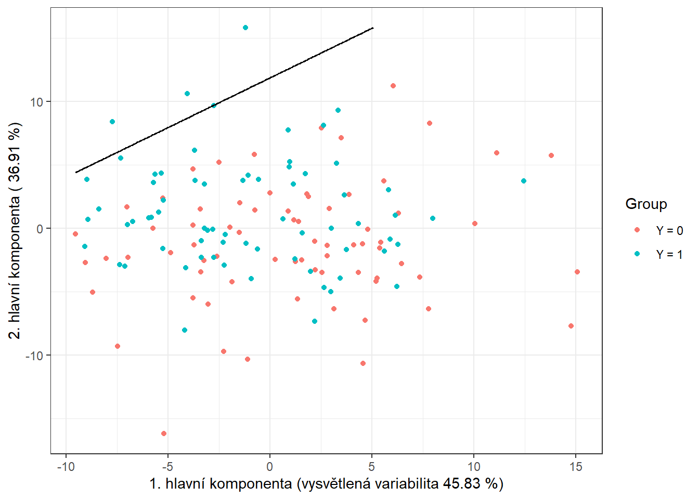
<p class="caption">(\#fig:unnamed-chunk-199)Skóre prvních dvou hlavních komponent, barevně odlišené podle příslušnosti do klasifikační třídy. Černě je vyznačena dělící hranice (přímka v rovině prvních dvou hlavních komponent) mezi třídami sestrojená pomocí logistické regrese.</p>
</div>

Všimněme si, že dělící hranicí mezi klasifikačními třídami je nyní přímka jako v případě LDA.

Nakonec ještě doplníme chybovosti do souhrnné tabulky.


```r
Res <- data.frame(model = 'LR score', 
                  Err.train = 1 - presnost.train,
                  Err.test = 1 - presnost.test)

RESULTS <- rbind(RESULTS, Res)
```

#### Rozhodovací stromy

V této části se podíváme na velmi odlišný přístup k sestrojení klasifikátoru, než byly například LDA či logistická regrese.
Rozhodovací stromy jsou velmi oblíbeným nástrojem ke klasifikaci, avšak jako v případě některých předchozích metod nejsou přímo určeny pro funkcionální data.
Existují však postupy, jak funkcionální objekty převést na mnohorozměrné a následně na ně aplikovat algoritmus rozhodovacích stromů.
Můžeme uvažovat následující postupy:

-   algoritmus sestrojený na bázových koeficientech,

-   využití skórů hlavních komponent,

-   použít diskretizaci intervalu a vyhodnotit funkci jen na nějaké konečné síti bodů.

My se nejprve zaměříme na diskretizaci intervalu a následně porovnáme výsledky se zbylými dvěma přístupy k sestrojení rozhodovacího stromu.

##### Diskretizace intervalu

Nejprve si musíme definovat body z intervalu $I = [0, 6]$, ve kterých funkce vyhodnotíme.
Následně vytvoříme objekt, ve kterém budou řádky představovat jednotlivé (diskretizované) funkce a sloupce časy.
Nakonec připojíme sloupec $Y$ s informací o příslušnosti do klasifikační třídy a totéž zopakujeme i pro testovací data.


```r
# posloupnost bodu, ve kterych funkce vyhodnotime
t.seq <- seq(0, 6, length = 101)
   
grid.data <- eval.fd(fdobj = X.train, evalarg = t.seq)
grid.data <- as.data.frame(t(grid.data)) # transpozice kvuli funkcim v radku
grid.data$Y <- Y.train |> factor()

grid.data.test <- eval.fd(fdobj = X.test, evalarg = t.seq)
grid.data.test <- as.data.frame(t(grid.data.test))
grid.data.test$Y <- Y.test |> factor()
```

Nyní mážeme sestrojit rozhodovací strom, ve kterém budou jakožto prediktory vystupovat všechny časy z vektoru `t.seq`.
Tato klasifikační není náchylná na multikolinearitu, tudíž se jí nemusíme zabývat.
Jako metriku zvolíme přesnost.


```r
# sestrojeni modelu
clf.tree <- train(Y ~ ., data = grid.data, 
                 method = "rpart", 
                 trControl = trainControl(method = "CV", number = 10),
                 metric = "Accuracy")

# presnost na trenovacich datech
predictions.train <- predict(clf.tree, newdata = grid.data)
presnost.train <- table(Y.train, predictions.train) |>
  prop.table() |> diag() |> sum()
  
# presnost na testovacich datech
predictions.test <- predict(clf.tree, newdata = grid.data.test)
presnost.test <- table(Y.test, predictions.test) |>
  prop.table() |> diag() |> sum()
```

Přesnost klasifikátoru na testovacích datech je tedy 85 % a na trénovacích datech 91.43 %.

Graficky si rozhodovací strom můžeme vykreslit pomocí funkce `fancyRpartPlot()`.
Nastavíme barvy uzlů tak, aby reflektovaly předchozí barevné odlišení.
Jedná se o neprořezaný strom.


```r
colnames(grid.data) <- c(paste0('time:', t.seq), 'Y')
fancyRpartPlot(rpart(Y ~ ., data = grid.data, method = "class"),
               sub = '', palettes = c('Reds', 'Blues')) 
```

<div class="figure">

<p class="caption">(\#fig:unnamed-chunk-203)Grafické znázornění neprořezaného rozhodovacího stromu. Modrými odstíny jsou vykresleny uzly příslušející klasifikační třídě 1 a červenými odstíny třídě 0.</p>
</div>

Můžeme si také vykreslit již prořezaný finální rozhodovací strom.


```r
rpart.plot::rpart.plot(clf.tree$finalModel, # finalni model ... prorezany strom
                       extra = 104, # zobrazeni pozadovanych informaci
                       box.palette = c('Reds', 'Blues'),
                       branch.lty = 3, # dotted branch lines
                       shadow.col = 0, # shadows under the node boxes
                       nn = FALSE, 
                       under = FALSE, 
                       digits = 2)
```

<div class="figure">

<p class="caption">(\#fig:unnamed-chunk-204)Finální prořezaný rozhodovací strom.</p>
</div>

Nakonec opět přidejme trénovací a testovací chybovost do souhrnné tabulky.


```r
Res <- data.frame(model = 'Tree - diskr.', 
                  Err.train = 1 - presnost.train,
                  Err.test = 1 - presnost.test)

RESULTS <- rbind(RESULTS, Res)
```

##### Skóre hlavních komponent

Další možností pro sestrojení rozhodovacího stromu je použít skóre hlavních komponent.
Jelikož jsme již skóre počítali pro předchozí klasifikační metody, využijeme těchto poznatků a sestrojíme rozhodovací strom na skórech prvních 3 hlavních komponent.


```r
# sestrojeni modelu
clf.tree.PCA <- train(Y ~ ., data = data.PCA.train, 
                 method = "rpart", 
                 trControl = trainControl(method = "CV", number = 10),
                 metric = "Accuracy")

# presnost na trenovacich datech
predictions.train <- predict(clf.tree.PCA, newdata = data.PCA.train)
presnost.train <- table(Y.train, predictions.train) |>
  prop.table() |> diag() |> sum()
  
# presnost na testovacich datech
predictions.test <- predict(clf.tree.PCA, newdata = data.PCA.test)
presnost.test <- table(Y.test, predictions.test) |>
  prop.table() |> diag() |> sum()
```

Přesnost rozhodovacího stromu na testovacích datech je tedy 71.67 % a na trénovacích datech 83.57 %.

Graficky si rozhodovací strom sestrojený na skórech hlavních komponent můžeme vykreslit pomocí funkce `fancyRpartPlot()`.
Nastavíme barvy uzlů tak, aby reflektovaly předchozí barevné odlišení.
Jedná se o neprořezaný strom.


```r
fancyRpartPlot(rpart(Y ~ ., data = data.PCA.train, method = "class"),
               sub = '', palettes = c('Reds', 'Blues')) 
```

<div class="figure">

<p class="caption">(\#fig:unnamed-chunk-207)Grafické znázornění neprořezaného rozhodovacího stromu sestrojeného na skórech hlavních komponent. Modrými odstíny jsou vykresleny uzly příslušející klasifikační třídě 1 a červenými odstíny třídě 0.</p>
</div>

Můžeme si také vykreslit již prořezaný finální rozhodovací strom.


```r
rpart.plot::rpart.plot(clf.tree.PCA$finalModel, # finalni model 
                       extra = 104, # zobrazeni pozadovanych informaci
                       box.palette = c('Reds', 'Blues'),
                       branch.lty = 3, # dotted branch lines
                       shadow.col = 0, # shadows under the node boxes
                       nn = FALSE, under = FALSE, digits = 2)
```

<div class="figure">
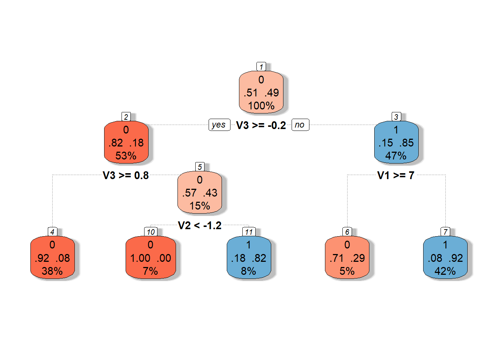
<p class="caption">(\#fig:unnamed-chunk-208)Finální prořezaný rozhodovací strom.</p>
</div>

Nakonec opět přidejme trénovací a testovací chybovost do souhrnné tabulky.


```r
Res <- data.frame(model = 'Tree - score', 
                  Err.train = 1 - presnost.train,
                  Err.test = 1 - presnost.test)

RESULTS <- rbind(RESULTS, Res)
```

##### Bázové koeficienty

Poslední možností, kterou využijeme pro sestrojení rozhodovacího stromu, je použití koeficientů ve vyjádření funkcí v B-splinové bázi.

Nejprve si definujme potřebné datové soubory s koeficienty.


```r
# trenovaci dataset
data.Bbasis.train <- t(X.train$coefs) |> as.data.frame()
data.Bbasis.train$Y <- factor(Y.train)

# testovaci dataset
data.Bbasis.test <- t(X.test$coefs) |> as.data.frame()
data.Bbasis.test$Y <- factor(Y.test)
```

Nyní již můžeme sestrojit klasifikátor.


```r
# sestrojeni modelu
clf.tree.Bbasis <- train(Y ~ ., data = data.Bbasis.train, 
                 method = "rpart", 
                 trControl = trainControl(method = "CV", number = 10),
                 metric = "Accuracy")

# presnost na trenovacich datech
predictions.train <- predict(clf.tree.Bbasis, newdata = data.Bbasis.train)
presnost.train <- table(Y.train, predictions.train) |>
  prop.table() |> diag() |> sum()
  
# presnost na testovacich datech
predictions.test <- predict(clf.tree.Bbasis, newdata = data.Bbasis.test)
presnost.test <- table(Y.test, predictions.test) |>
  prop.table() |> diag() |> sum()
```

Přesnost rozhodovacího stromu na trénovacích datech je tedy 90 % a na testovacích datech 88.33 %.

Graficky si rozhodovací strom sestrojený na koeficientech B-splinového vyjádření můžeme vykreslit pomocí funkce `fancyRpartPlot()`.
Nastavíme barvy uzlů tak, aby reflektovaly předchozí barevné odlišení.
Jedná se o neprořezaný strom.


```r
fancyRpartPlot(rpart(Y ~ ., data = data.Bbasis.train, method = "class"),
               sub = '', palettes = c('Reds', 'Blues')) 
```

<div class="figure">
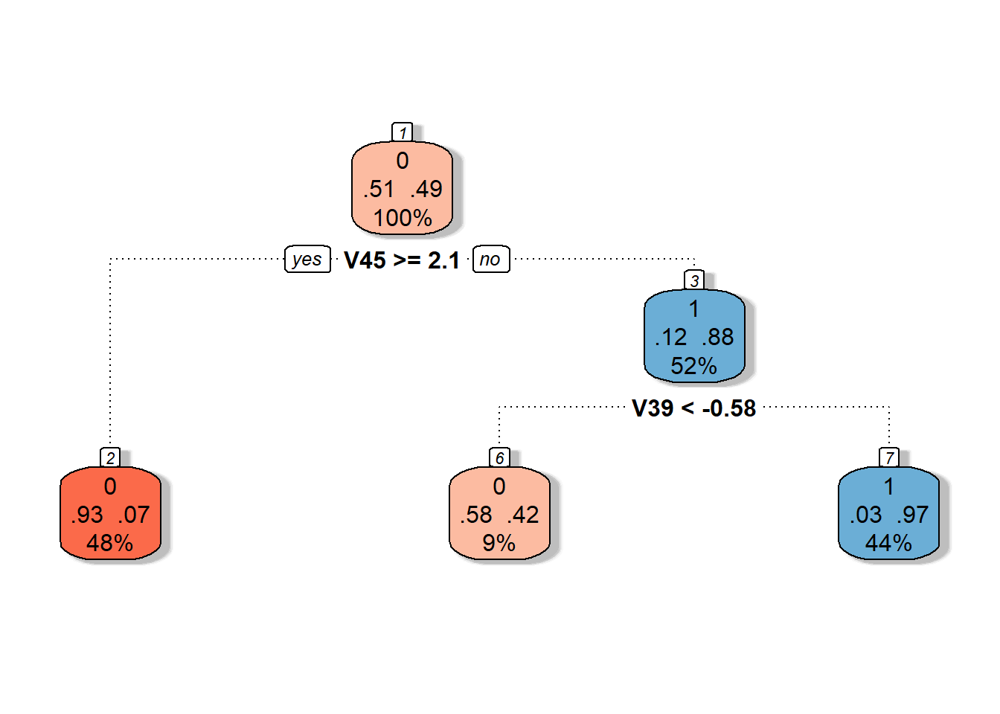
<p class="caption">(\#fig:unnamed-chunk-212)Grafické znázornění neprořezaného rozhodovacího stromu sestrojeného na bázových koeficientech. Modrými odstíny jsou vykresleny uzly příslušející klasifikační třídě 1 a červenými odstíny třídě 0.</p>
</div>

Můžeme si také vykreslit již prořezaný finální rozhodovací strom.


```r
rpart.plot::rpart.plot(clf.tree.Bbasis$finalModel, # finalni model 
                       extra = 104, # zobrazeni pozadovanych informaci
                       box.palette = c('Reds', 'Blues'),
                       branch.lty = 3, # dotted branch lines
                       shadow.col = 0, # shadows under the node boxes
                       nn = FALSE, under = FALSE, digits = 2)
```

<div class="figure">

<p class="caption">(\#fig:unnamed-chunk-213)Finální prořezaný rozhodovací strom.</p>
</div>

Nakonec opět přidejme trénovací a testovací chybovost do souhrnné tabulky.


```r
Res <- data.frame(model = 'Tree - Bbasis', 
                  Err.train = 1 - presnost.train,
                  Err.test = 1 - presnost.test)

RESULTS <- rbind(RESULTS, Res)
```

#### Náhodné lesy

Klasifikátor sestrojený pomocí metody náhodných lesů spočívá v sestrojení několika jednotlivých rozhodovacích stromů, které se následně zkombinují a vytvoří společný klasifikátor (společným "hlasováním").

Tak jako v případě rozhodovacích stromů máme několik možností na to, jaká data (konečně-rozměrná) použijeme pro sestrojení modelu.
Budeme opět uvažovat výše diskutované tři přístupy.
Datové soubory s příslušnými veličinami pro všechny tři přístupy již máme připravené z minulé sekce, proto můžeme přímo sestrojit dané modely, spočítat charakteristiky daného klasifikátoru a přidat výsledky do souhrnné tabulky.

##### Diskretizace intervalu

V prvním případě využíváme vyhodnocení funkcí na dané síti bodů intervalu $I = [0, 6]$.


```r
# sestrojeni modelu
clf.RF <- randomForest(Y ~ ., data = grid.data, 
                       ntree = 500, # pocet stromu
                       importance = TRUE,
                       nodesize = 5)

# presnost na trenovacich datech
predictions.train <- predict(clf.RF, newdata = grid.data)
presnost.train <- table(Y.train, predictions.train) |>
  prop.table() |> diag() |> sum()
  
# presnost na testovacich datech
predictions.test <- predict(clf.RF, newdata = grid.data.test)
presnost.test <- table(Y.test, predictions.test) |>
  prop.table() |> diag() |> sum()
```

Přesnost náhodného lesu na trénovacích datech je tedy 99.29 % a na testovacích datech 86.67 %.


```r
Res <- data.frame(model = 'RForest - diskr', 
                  Err.train = 1 - presnost.train,
                  Err.test = 1 - presnost.test)

RESULTS <- rbind(RESULTS, Res)
```

##### Skóre hlavních komponent

V tomto případě využijeme skóre prvních $p =$ 3 hlavních komponent.


```r
# sestrojeni modelu
clf.RF.PCA <- randomForest(Y ~ ., data = data.PCA.train, 
                           ntree = 500, # pocet stromu
                           importance = TRUE,
                           nodesize = 5)

# presnost na trenovacich datech
predictions.train <- predict(clf.RF.PCA, newdata = data.PCA.train)
presnost.train <- table(Y.train, predictions.train) |>
  prop.table() |> diag() |> sum()
  
# presnost na testovacich datech
predictions.test <- predict(clf.RF.PCA, newdata = data.PCA.test)
presnost.test <- table(Y.test, predictions.test) |>
  prop.table() |> diag() |> sum()
```

Přesnost rozhodovacího stromu na trénovacích datech je tedy 97.14 % a na testovacích datech 80 %.


```r
Res <- data.frame(model = 'RForest - score', 
                  Err.train = 1 - presnost.train,
                  Err.test = 1 - presnost.test)

RESULTS <- rbind(RESULTS, Res)
```

##### Bázové koeficienty

Nakonec použijeme vyjádření funkcí pomocí B-splinové báze.


```r
# sestrojeni modelu
clf.RF.Bbasis <- randomForest(Y ~ ., data = data.Bbasis.train, 
                              ntree = 500, # pocet stromu
                              importance = TRUE,
                              nodesize = 5)

# presnost na trenovacich datech
predictions.train <- predict(clf.RF.Bbasis, newdata = data.Bbasis.train)
presnost.train <- table(Y.train, predictions.train) |>
  prop.table() |> diag() |> sum()
  
# presnost na testovacich datech
predictions.test <- predict(clf.RF.Bbasis, newdata = data.Bbasis.test)
presnost.test <- table(Y.test, predictions.test) |>
  prop.table() |> diag() |> sum()
```

Přesnost tohoto klasifikátoru na trénovacích datech je 99.29 % a na testovacích datech 90 %.


```r
Res <- data.frame(model = 'RForest - Bbasis', 
                  Err.train = 1 - presnost.train,
                  Err.test = 1 - presnost.test)

RESULTS <- rbind(RESULTS, Res)
```

#### Support Vector Machines

Nyní se podívejme na klasifikaci našich nasimulovaných křivek pomocí metody podpůrných vektorů (ang. Support Vector Machines, SVM).
Výhodou této klasifikační metody je její výpočetní nenáročnost, neboť pro definici hraniční křivky mezi třídami využívá pouze několik (často málo) pozorování.

Hlavní výhodou SVM je použití tzv.
*jádrového triku* (kernel trick), pomocí kterého nahradíme obyčejný skalární součin jiným skalárním součinem transformovaných dat, aniž bychom tuto transformaci museli přímo definovat.
Tím dostaneme obecně nelineární dělící hranici mezi klasifikačními třídami.
*Jádro* (jádrová funkce, ang. kernel, kernel function) $K$ je taková funkce, která splňuje

$$
K(x_i, x_j) = \langle \phi(x_i), \phi(x_j) \rangle_{\mathcal H}, 
$$ kde $\phi$ je nějaká (neznámá) transformace (ang. feature map), $\mathcal H$ je Hilbertův prostor a $\langle \cdot, \cdot \rangle_{\mathcal H}$ je nějaký skalární součin na tomto Hilbertově prostoru.

Nejčastěji se v praxi volí tři typy jádrových funkcí:

-   lineární jádro -- $K(x_i, x_j) = \langle x_i, x_j \rangle$,
-   polynomiální jádro -- $K(x_i, x_j) = \big(\alpha_0 + \gamma \langle x_i, x_j \rangle \big)^d$,
-   radiální (gaussovské) jádro -- $\displaystyle{K(x_i, x_j) = \text e^{-\gamma \|x_i - x_j \|^2}}$.

U všech výše zmíněných jader musíme zvolit konstantu $C > 0$, která udává míru penalizace za překročení dělící hranice mezi třídami (ang. inverse regularization parameter).
S rostoucí hodnotou $C$ bude metoda více penalizovat špatně klasifikovaná data a méně tvar hranice, naopak pro malé hodnoty $C$ metoda nedává takový význam špatně klasifikovaným datům, ale zaměřuje se více na penalizaci tvaru hranice.
Tato konstanta $C$ se defaultně volí rovna 1, můžeme ji určit i přímo například pomocí cross-validace.

Využitím cross-validace můžeme také určit optimální hodnoty ostatních hyperparametrů, které nyní závisí na naší volbě jádrové funkce.
V případě lineárního jádra nevolíme žádný další parametr kromě konstanty $C$, u polynomiálního jádra musíme určit hodnoty hyperparametrů $\alpha_0, \gamma \text{ a } d$, jejichž defaultní hodnoty v `R` jsou postupně $\alpha_0^{default} = 0, \gamma^{default} = \frac{1}{dim(\texttt{data})} \text{ a } d^{default} = 3$.
Při volbě radiálního jádra máme pouze jeden další hyperparametr $\gamma$, jehož defaultní hodnota v `R` je totožná jako u polynomiálního jádra.
Opět bychom mohli hodnoty hyperparametrů určit jako optimální pro naše data, avšak vzhledem k relativní výpočetní náročnosti necháme hodnoty příslušných hyperparametrů na jejich defaultních hodnotách.

V případě funkcionálních dat máme několik možností, jak použít metodu SVM.
Nejjednodušší variantou je použít tuto klasifikační metodu přímo na diskretizovanou funkci (sekce \@ref(diskr3)).
Další možností je opět využít skóre hlavních komponent a klasifikovat křivky pomocí jejich reprezentace \@ref(PCA-SVM3).
Další přímočarou variantou je využít vyjádření křivek pomocí B-splinové báze a klasifikovat křivky na základě koeficientů jejich vyjádření v této bázi (sekce \@ref(basis-SVM3)).

Složitější úvahou můžeme dospět k několika dalším možnostem, které využívají funkcionální podstatu dat.
Jednak můžeme místo klasifikace původní křivky využít její derivaci (případně druhou derivaci, třetí, ...), druhak můžeme využít projekce funkcí na podprostor generovaný, např. B-splinovými, funkcemi (sekce \@ref(projection-SVM3)). Poslední metoda, kterou použijeme pro klasifikaci funkcionálních dat, spočívá v kombinaci projekce na určitý podprostor generovaný funkcemi (Reproducing Kernel Hilbert Space, RKHS) a klasifikace příslušné reprezentace. Tato metoda využívá kromě klasického SVM i SVM pro regresi, více uvádíme v sekci RKHS + SVM \@ref(RKHS-SVM3).

##### Diskretizace intervalu

Začněme nejprve aplikací metody podpůrných vektorů přímo na diskretizovaná data (vyhodnocení funkce na dané síti bodů na intervalu $I = [0, 6]$), přičemž budeme uvažovat všech tři výše zmíněné jádrové funkce.


```r
# set norm equal to one
norms <- c()
for (i in 1:dim(XXder$coefs)[2]) {
  norms <- c(norms, as.numeric(1 / norm.fd(XXder[i])))
  }
XXfd_norm <- XXder 
XXfd_norm$coefs <- XXfd_norm$coefs * matrix(norms, 
                                            ncol = dim(XXder$coefs)[2],
                                            nrow = dim(XXder$coefs)[1],
                                            byrow = T)

# rozdeleni na testovaci a trenovaci cast
X.train_norm <- subset(XXfd_norm, split == TRUE)
X.test_norm <- subset(XXfd_norm, split == FALSE)

Y.train_norm <- subset(Y, split == TRUE)
Y.test_norm <- subset(Y, split == FALSE)

grid.data <- eval.fd(fdobj = X.train_norm, evalarg = t.seq)
grid.data <- as.data.frame(t(grid.data)) 
grid.data$Y <- Y.train_norm |> factor()

grid.data.test <- eval.fd(fdobj = X.test_norm, evalarg = t.seq)
grid.data.test <- as.data.frame(t(grid.data.test))
grid.data.test$Y <- Y.test_norm |> factor()
```


```r
# sestrojeni modelu
clf.SVM.l <- svm(Y ~ ., data = grid.data,
                 type = 'C-classification',
                 scale = TRUE,
                 cost = 0.04,
                 kernel = 'linear')

clf.SVM.p <- svm(Y ~ ., data = grid.data,
                 type = 'C-classification',
                 scale = TRUE,
                 coef0 = 1,
                 cost = 3,
                 kernel = 'polynomial')

clf.SVM.r <- svm(Y ~ ., data = grid.data,
                 type = 'C-classification',
                 scale = TRUE,
                 cost = 12,
                 gamma = 0.001,
                 kernel = 'radial')

# presnost na trenovacich datech
predictions.train.l <- predict(clf.SVM.l, newdata = grid.data)
presnost.train.l <- table(Y.train, predictions.train.l) |>
  prop.table() |> diag() |> sum()

predictions.train.p <- predict(clf.SVM.p, newdata = grid.data)
presnost.train.p <- table(Y.train, predictions.train.p) |>
  prop.table() |> diag() |> sum()

predictions.train.r <- predict(clf.SVM.r, newdata = grid.data)
presnost.train.r <- table(Y.train, predictions.train.r) |>
  prop.table() |> diag() |> sum()

# presnost na testovacich datech
predictions.test.l <- predict(clf.SVM.l, newdata = grid.data.test)
presnost.test.l <- table(Y.test, predictions.test.l) |>
  prop.table() |> diag() |> sum()

predictions.test.p <- predict(clf.SVM.p, newdata = grid.data.test)
presnost.test.p <- table(Y.test, predictions.test.p) |>
  prop.table() |> diag() |> sum()

predictions.test.r <- predict(clf.SVM.r, newdata = grid.data.test)
presnost.test.r <- table(Y.test, predictions.test.r) |>
  prop.table() |> diag() |> sum()
```

Přesnost metody SVM na trénovacích datech je tedy 92.14 % pro lineární jádro, 97.14 % pro polynomiální jádro a 92.14 % pro gaussovské jádro.
Na testovacích datech je potom přesnost metody 93.33 % pro lineární jádro, 85 % pro polynomiální jádro a 91.67 % pro radiální jádro.


```r
Res <- data.frame(model = c('SVM linear - diskr', 
                            'SVM poly - diskr', 
                            'SVM rbf - diskr'), 
                  Err.train = 1 - c(presnost.train.l, presnost.train.p, presnost.train.r),
                  Err.test = 1 - c(presnost.test.l, presnost.test.p, presnost.test.r))

RESULTS <- rbind(RESULTS, Res)
```

##### Skóre hlavních komponent

V tomto případě využijeme skóre prvních $p =$ 3 hlavních komponent.


```r
# sestrojeni modelu
clf.SVM.l.PCA <- svm(Y ~ ., data = data.PCA.train,
                     type = 'C-classification',
                     scale = TRUE,
                     cost = 0.01,
                     kernel = 'linear')

clf.SVM.p.PCA <- svm(Y ~ ., data = data.PCA.train,
                     type = 'C-classification',
                     scale = TRUE,
                     coef0 = 1,
                     cost = 0.01,
                     kernel = 'polynomial')

clf.SVM.r.PCA <- svm(Y ~ ., data = data.PCA.train,
                     type = 'C-classification',
                     scale = TRUE,
                     cost = 25,
                     gamma = 0.0001,
                     kernel = 'radial')

# presnost na trenovacich datech
predictions.train.l <- predict(clf.SVM.l.PCA, newdata = data.PCA.train)
presnost.train.l <- table(data.PCA.train$Y, predictions.train.l) |>
  prop.table() |> diag() |> sum()

predictions.train.p <- predict(clf.SVM.p.PCA, newdata = data.PCA.train)
presnost.train.p <- table(data.PCA.train$Y, predictions.train.p) |>
  prop.table() |> diag() |> sum()

predictions.train.r <- predict(clf.SVM.r.PCA, newdata = data.PCA.train)
presnost.train.r <- table(data.PCA.train$Y, predictions.train.r) |>
  prop.table() |> diag() |> sum()
  
# presnost na testovacich datech
predictions.test.l <- predict(clf.SVM.l.PCA, newdata = data.PCA.test)
presnost.test.l <- table(data.PCA.test$Y, predictions.test.l) |>
  prop.table() |> diag() |> sum()

predictions.test.p <- predict(clf.SVM.p.PCA, newdata = data.PCA.test)
presnost.test.p <- table(data.PCA.test$Y, predictions.test.p) |>
  prop.table() |> diag() |> sum()

predictions.test.r <- predict(clf.SVM.r.PCA, newdata = data.PCA.test)
presnost.test.r <- table(data.PCA.test$Y, predictions.test.r) |>
  prop.table() |> diag() |> sum()
```

Přesnost metody SVM aplikované na skóre hlavních komponent na trénovacích datech je tedy 86.43 % pro lineární jádro, 87.14 % pro polynomiální jádro a 86.43 % pro gaussovské jádro.
Na testovacích datech je potom přesnost metody 81.67 % pro lineární jádro, 81.67 % pro polynomiální jádro a 83.33 % pro radiální jádro.

Pro grafické znázornění metody můžeme zaznačit dělící hranici do grafu skórů prvních dvou hlavních komponent.
Tuto hranici spočítáme na husté síti bodů a zobrazíme ji pomocí funkce `geom_contour()` stejně jako v předchozích případech, kdy jsme také vykreslovali klasifikační hranici.


```r
nd <- rbind(nd, nd, nd) |> mutate(
   prd = c(as.numeric(predict(clf.SVM.l.PCA, newdata = nd, type = 'response')),
           as.numeric(predict(clf.SVM.p.PCA, newdata = nd, type = 'response')),
           as.numeric(predict(clf.SVM.r.PCA, newdata = nd, type = 'response'))),
   kernel = rep(c('linear', 'polynomial', 'radial'),
                each = length(as.numeric(predict(clf.SVM.l.PCA, 
                                                 newdata = nd,
                                                 type = 'response')))))

data.PCA.train |> ggplot(aes(x = V1, y = V2, colour = Y)) +
 geom_point(size = 1.5) + 
 labs(x = paste('1. hlavní komponenta (vysvětlená variabilita', 
                round(100 * data.PCA$varprop[1], 2), '%)'),
      y = paste('2. hlavní komponenta (', 
                round(100 * data.PCA$varprop[2], 2), '%)'),
      colour = 'Group', 
      linetype = 'Kernel type') +
 scale_colour_discrete(labels = c('Y = 0', 'Y = 1')) +
 theme_bw() +
 geom_contour(data = nd, aes(x = V1, y = V2, z = prd, linetype = kernel), 
              colour = 'black') + 
 geom_contour(data = nd, aes(x = V1, y = V2, z = prd, linetype = kernel),
              colour = 'black') + 
 geom_contour(data = nd, aes(x = V1, y = V2, z = prd, linetype = kernel),
              colour = 'black')
```

<div class="figure">

<p class="caption">(\#fig:unnamed-chunk-228)Skóre prvních dvou hlavních komponent, barevně odlišené podle příslušnosti do klasifikační třídy. Černě je vyznačena dělící hranice (přímka, resp. křivky v rovině prvních dvou hlavních komponent) mezi třídami sestrojená pomocí metody SVM.</p>
</div>


```r
Res <- data.frame(model = c('SVM linear - PCA', 
                            'SVM poly - PCA', 
                            'SVM rbf - PCA'), 
                  Err.train = 1 - c(presnost.train.l, presnost.train.p, presnost.train.r),
                  Err.test = 1 - c(presnost.test.l, presnost.test.p, presnost.test.r))

RESULTS <- rbind(RESULTS, Res)
```

##### Bázové koeficienty

Nakonec použijeme vyjádření funkcí pomocí B-splinové báze.


```r
# sestrojeni modelu
clf.SVM.l.Bbasis <- svm(Y ~ ., data = data.Bbasis.train,
                        type = 'C-classification',
                        scale = TRUE,
                        cost = 55,
                        kernel = 'linear')

clf.SVM.p.Bbasis <- svm(Y ~ ., data = data.Bbasis.train,
                        type = 'C-classification',
                        scale = TRUE,
                        coef0 = 1,
                        cost = 0.2,
                        kernel = 'polynomial')

clf.SVM.r.Bbasis <- svm(Y ~ ., data = data.Bbasis.train,
                        type = 'C-classification',
                        scale = TRUE,
                        cost = 110,
                        gamma = 0.001,
                        kernel = 'radial')

# presnost na trenovacich datech
predictions.train.l <- predict(clf.SVM.l.Bbasis, newdata = data.Bbasis.train)
presnost.train.l <- table(Y.train, predictions.train.l) |>
  prop.table() |> diag() |> sum()

predictions.train.p <- predict(clf.SVM.p.Bbasis, newdata = data.Bbasis.train)
presnost.train.p <- table(Y.train, predictions.train.p) |>
  prop.table() |> diag() |> sum()

predictions.train.r <- predict(clf.SVM.r.Bbasis, newdata = data.Bbasis.train)
presnost.train.r <- table(Y.train, predictions.train.r) |>
  prop.table() |> diag() |> sum()
  
# presnost na testovacich datech
predictions.test.l <- predict(clf.SVM.l.Bbasis, newdata = data.Bbasis.test)
presnost.test.l <- table(Y.test, predictions.test.l) |>
  prop.table() |> diag() |> sum()

predictions.test.p <- predict(clf.SVM.p.Bbasis, newdata = data.Bbasis.test)
presnost.test.p <- table(Y.test, predictions.test.p) |>
  prop.table() |> diag() |> sum()

predictions.test.r <- predict(clf.SVM.r.Bbasis, newdata = data.Bbasis.test)
presnost.test.r <- table(Y.test, predictions.test.r) |>
  prop.table() |> diag() |> sum()
```

Přesnost metody SVM aplikované na bázové koeficienty na trénovacích datech je tedy 97.14 % pro lineární jádro, 95 % pro polynomiální jádro a 96.43 % pro gaussovské jádro.
Na testovacích datech je potom přesnost metody 91.67 % pro lineární jádro, 90 % pro polynomiální jádro a 93.33 % pro radiální jádro.


```r
Res <- data.frame(model = c('SVM linear - Bbasis', 
                            'SVM poly - Bbasis', 
                            'SVM rbf - Bbasis'), 
                  Err.train = 1 - c(presnost.train.l, presnost.train.p, presnost.train.r),
                  Err.test = 1 - c(presnost.test.l, presnost.test.p, presnost.test.r))

RESULTS <- rbind(RESULTS, Res)
```

##### Projekce na B-splinovou bázi

Další možností, jak použít klasickou metodu SVM pro funkcionální data, je projektovat původní data na nějaký $d$-dimenzionální podprostor našeho Hilbertova prostoru $\mathcal H$, označme jej $V_d$.
Předpokládejme, že tento podprostor $V_d$ má ortonormální bázi $\{\Psi_j\}_{j = 1, \dots, d}$.
Definujeme transformaci $P_{V_d}$ jakožto ortogonální projekci na podprostor $V_d$, tedy můžeme psát

$$
P_{V_d} (x) = \sum_{j = 1}^d \langle x, \Psi_j \rangle \Psi_j.
$$

Nyní můžeme pro klasifikaci použít koeficienty z ortogonální projekce, tedy aplikujeme standardní SVM na vektory $\left( \langle x, \Psi_1 \rangle, \dots, \langle x, \Psi_d \rangle\right)^\top$.
Využitím této transformace jsme tedy definovali nové, tzv.
adaptované jádro, které je složené z ortogonální projekce $P_{V_d}$ a jádrové funkce standardní metody podpůrných vektorů.
Máme tedy (adaptované) jádro $Q(x_i, x_j) = K(P_{V_d}(x_i), P_{V_d}(x_j))$.
Jde tedy o metodu redukce dimenze, kterou můžeme nazvat *filtrace*.

Pro samotnou projekci použijeme v `R` funkci `project.basis()` z knihovny `fda`.
Na jejím vstupu bude matice původních diskrétních (nevyhlazených) dat, hodnoty, ve kterých měříme hodnoty v matici původních dat a bázový objekt, na který chceme data projektovat.
My zvolíme projekci na B-splinovou bázi, protože využití Fourierovy báze není pro naše neperiodická data vhodné.
Další možností je využít *wavelet basis*.

Dimenzi $d$ volíme buď z nějaké předchozí expertní znalosti, nebo pomocí cross-validace.
V našem případě určíme optimální dimenzi podprostoru $V_d$ pomocí $k$-násobné cross-validace (volíme $k \ll n$ kvůli výpočetní náročnosti metody, často se volí $k = 5$ nebo $k = 10$).
Požadujeme B-spliny řádu 4, pro počet bázových funkcí potom platí vztah

$$
n_{basis} = n_{breaks} + n_{order} - 2,
$$

kde $n_{breaks}$ je počet uzlů a $n_{order} = 4$.
Minimální dimenzi tedy (pro $n_{breaks} = 1$) volíme $n_{basis} = 3$ a maximální (pro $n_{breaks} = 51$ odpovídající počtu původních diskrétních dat) $n_{basis} = 53$.
V `R` však hodnota $n_{basis}$ musí být alespoň $n_{order} = 4$ a pro velké hodnoty $n_{basis}$ již dochází k přefitování modelu, tudíž volíme za maximální $n_{basis}$ menší číslo, řekněme 43.


```r
k_cv <- 10 # k-fold CV

# hodnoty pro B-splinovou bazi
rangeval <- range(t)
norder <- 4
n_basis_min <- norder
n_basis_max <- length(t) + norder - 2 - 10

dimensions <- n_basis_min:n_basis_max # vsechny dimenze, ktere chceme vyzkouset

# rozdelime trenovaci data na k casti
folds <- createMultiFolds(1:sum(split), k = k_cv, time = 1)

# list se tremi slozkami ... maticemi pro jednotlive jadra -> linear, poly, radial
# prazdna matice, do ktere vlozime jednotlive vysledky
# ve sloupcich budou hodnoty presnosti pro danou cast trenovaci mnoziny
# v radcich budou hodnoty pro danou hodnotu dimenze
CV.results <- list(SVM.l = matrix(NA, nrow = length(dimensions), ncol = k_cv),
                   SVM.p = matrix(NA, nrow = length(dimensions), ncol = k_cv),
                   SVM.r = matrix(NA, nrow = length(dimensions), ncol = k_cv))

for (d in dimensions) {
  # bazovy objekt
  bbasis <- create.bspline.basis(rangeval = rangeval, 
                                 nbasis = d)
  
  # projekce diskretnich dat na B-splinovou bazi o dimenzi d
  Projection <- project.basis(y = grid.data |> select(!contains('Y')) |> as.matrix() |> t(), # matice diskretnich dat
                              argvals = t.seq, # vektor argumentu
                              basisobj = bbasis) # bazovy objekt
  
  # rozdeleni na trenovaci a testovaci data v ramci CV
  XX.train <- t(Projection) # subset(t(Projection), split == TRUE)
  
  for (index_cv in 1:k_cv) {
    # definice testovaci a trenovaci casti pro CV
    fold <- folds[[index_cv]]
    cv_sample <- 1:dim(XX.train)[1] %in% fold
    
    data.projection.train.cv <- as.data.frame(XX.train[cv_sample, ])
    data.projection.train.cv$Y <- factor(Y.train[cv_sample])
    
    data.projection.test.cv <- as.data.frame(XX.train[!cv_sample, ])
    Y.test.cv <- Y.train[!cv_sample]
    data.projection.test.cv$Y <- factor(Y.test.cv)
  
    # sestrojeni modelu
    clf.SVM.l.projection <- svm(Y ~ ., data = data.projection.train.cv,
                            type = 'C-classification',
                            scale = TRUE,
                            kernel = 'linear')
    
    clf.SVM.p.projection <- svm(Y ~ ., data = data.projection.train.cv,
                            type = 'C-classification',
                            scale = TRUE,
                            coef0 = 1,
                            kernel = 'polynomial')
    
    clf.SVM.r.projection <- svm(Y ~ ., data = data.projection.train.cv,
                            type = 'C-classification',
                            scale = TRUE,
                            kernel = 'radial')
      
    # presnost na validacnich datech
    ## linear kernel
    predictions.test.l <- predict(clf.SVM.l.projection,
                                  newdata = data.projection.test.cv)
    presnost.test.l <- table(Y.test.cv, predictions.test.l) |>
      prop.table() |> diag() |> sum()
    ## polynomial kernel
    predictions.test.p <- predict(clf.SVM.p.projection, 
                                  newdata = data.projection.test.cv)
    presnost.test.p <- table(Y.test.cv, predictions.test.p) |>
      prop.table() |> diag() |> sum()
    ## radial kernel
    predictions.test.r <- predict(clf.SVM.r.projection,
                                  newdata = data.projection.test.cv)
    presnost.test.r <- table(Y.test.cv, predictions.test.r) |>
      prop.table() |> diag() |> sum()
    
    # presnosti vlozime na pozice pro dane d a fold
    CV.results$SVM.l[d - min(dimensions) + 1, index_cv] <- presnost.test.l
    CV.results$SVM.p[d - min(dimensions) + 1, index_cv] <- presnost.test.p
    CV.results$SVM.r[d - min(dimensions) + 1, index_cv] <- presnost.test.r
  }
}
  
# spocitame prumerne presnosti pro jednotliva d pres folds
for (n_method in 1:length(CV.results)) {
  CV.results[[n_method]] <- apply(CV.results[[n_method]], 1, mean)
}

d.opt <- c(which.max(CV.results$SVM.l) + n_basis_min - 1, 
           which.max(CV.results$SVM.p) + n_basis_min - 1, 
           which.max(CV.results$SVM.r) + n_basis_min - 1)
presnost.opt.cv <- c(max(CV.results$SVM.l), 
                     max(CV.results$SVM.p),
                     max(CV.results$SVM.r))
data.frame(d_opt = d.opt, ERR = 1 - presnost.opt.cv,
           row.names = c('linear', 'poly', 'radial'))
```

```
##        d_opt        ERR
## linear    15 0.07711081
## poly      14 0.10463828
## radial    15 0.10325549
```

Vidíme, že nejlépe vychází hodnota parametru $d$ jako 15 pro lineární jádro s hodnotou přesnosti spočtenou pomocí 10-násobné CV 0.9229, 14 pro polynomiální jádro s hodnotou přesnosti spočtenou pomocí 10-násobné CV 0.8954 a 15 pro radiální jádro s hodnotou přesnosti 0.8967.
Pro přehlednost si ještě vykresleme průběh validačních chybovostí v závislosti na dimenzi $d$.


```r
CV.results <- data.frame(d = dimensions |> rep(3), 
                         CV = c(CV.results$SVM.l, 
                                CV.results$SVM.p, 
                                CV.results$SVM.r),
                         Kernel = rep(c('linear', 'polynomial', 'radial'), 
                                      each = length(dimensions)) |> factor())
CV.results |> ggplot(aes(x = d, y = 1 - CV, colour = Kernel)) + 
  geom_line(linetype = 'dashed') + 
  geom_point(size = 1.5) + 
  geom_point(data = data.frame(d.opt,
                               presnost.opt.cv),
             aes(x = d.opt, y = 1 - presnost.opt.cv), colour = 'black', size = 2) +
  theme_bw() + 
  labs(x = bquote(paste(d)),
       y = 'Validační chybovost') + 
  theme(legend.position = "bottom") + 
  scale_x_continuous(breaks = dimensions)
```

<div class="figure">

<p class="caption">(\#fig:unnamed-chunk-233)Závislost validační chybovosti na dimenzi podprostoru $V_d$, zvlášť pro všechna tři uvažovaná jádra v metodě SVM. Černými body jsou vyznačeny optimální hodnoty dimenze $V_d$ pro jednotlivé jádrové funkce.</p>
</div>

Nyní již můžeme natrénovat jednotlivé klasifikátory na všech trénovacích datech a podívat se na jejich úspěšnost na testovacích datech.
Pro každou jádrovou funkci volíme dimenzi podprostoru, na který projektujeme, podle výsledků cross-validace.

V proměnné `Projection` máme uloženou matici koeficientů ortogonální projekce, tedy

$$
\texttt{Projection} = \begin{pmatrix}
\langle x_1, \Psi_1 \rangle & \langle x_2, \Psi_1 \rangle & \cdots & \langle x_n, \Psi_1 \rangle\\
\langle x_1, \Psi_2 \rangle & \langle x_2, \Psi_2 \rangle & \cdots & \langle x_n, \Psi_2 \rangle\\
\vdots & \vdots & \ddots & \vdots \\
\langle x_1, \Psi_d \rangle & \langle x_2, \Psi_d \rangle & \dots & \langle x_n, \Psi_d \rangle
\end{pmatrix}_{d \times n}.
$$


```r
# pripravime si datovou tabulku pro ulozeni vysledku
Res <- data.frame(model = c('SVM linear - projection', 
                            'SVM poly - projection', 
                            'SVM rbf - projection'), 
                  Err.train = NA,
                  Err.test = NA)

# projdeme jednotliva jadra
for (kernel_number in 1:3) {
  kernel_type <- c('linear', 'polynomial', 'radial')[kernel_number]
  # bazovy objekt
  bbasis <- create.bspline.basis(rangeval = rangeval, 
                                 nbasis = d.opt[kernel_number])
  
  # projekce diskretnich dat na B-splinovou bazi
  Projection <- project.basis(y = rbind(
    grid.data |> select(!contains('Y')),
    grid.data.test |> select(!contains('Y'))) |>
      as.matrix() |> t(), # matice diskretnich dat
                              argvals = t.seq, # vektor argumentu
                              basisobj = bbasis) # bazovy objekt
  
  # rozdeleni na trenovaci a testovaci data
  XX.train <- t(Projection)[1:sum(split), ]
  XX.test <- t(Projection)[(sum(split) + 1):length(split), ]
  
  data.projection.train <- as.data.frame(XX.train)
  data.projection.train$Y <- factor(Y.train)
  
  data.projection.test <- as.data.frame(XX.test)
  data.projection.test$Y <- factor(Y.test)
  
  # sestrojeni modelu
  clf.SVM.projection <- svm(Y ~ ., data = data.projection.train,
                            type = 'C-classification',
                            scale = TRUE,
                            coef0 = 1,
                            kernel = kernel_type)
  
  # presnost na trenovacich datech
  predictions.train <- predict(clf.SVM.projection, newdata = data.projection.train)
  presnost.train <- table(Y.train, predictions.train) |>
    prop.table() |> diag() |> sum()
    
  # presnost na testovacich datech
  predictions.test <- predict(clf.SVM.projection, newdata = data.projection.test)
  presnost.test <- table(Y.test, predictions.test) |>
    prop.table() |> diag() |> sum()
  
  # ulozeni vysledku
  Res[kernel_number, c(2, 3)] <- 1 - c(presnost.train, presnost.test)
}
```

Přesnost metody SVM aplikované na bázové koeficienty na trénovacích datech je tedy 6.43 % pro lineární jádro, 3.57 % pro polynomiální jádro a 6.43 % pro gaussovské jádro.
Na testovacích datech je potom přesnost metody 8.33 % pro lineární jádro, 8.33 % pro polynomiální jádro a 8.33 % pro radiální jádro.


```r
RESULTS <- rbind(RESULTS, Res)
```

##### RKHS + SVM {#RKHS-SVM3} 

V této sekci se podíváme na další možnost, jak využít metodu podpůrných vektorů pro klasifikaci funkcionálních dat.
V tomto případě půjde opět o již nám známý princip, kdy nejprve funkcionální data vyjádříme jakožto nějaké konečně-rozměrné objekty a na tyto objekty následně aplikujeme klasickou metodu SVM.

Nyní však metodu SVM použijeme i pro samotnou reprezentaci funkcionálních dat pomocí určitého konečně-rozměrného objektu.
Jak již název napovídá, půjde o kombinaci dvou konceptů -- jednak metody podpůrných vektorů a druhak prostoru, který se nazývá v anglické literatuře *Reproducing Kernel Hilbert Space*.
Pro tento prostor je klíčovým pojmem *jádro* -- *kernel*.

::: {.definition #kernel name="Jádro"} 
Jádro je taková funkce $K : \mathcal X \times \mathcal X \rightarrow \mathbb R$, že pro každou dvojici $\boldsymbol x, \tilde{\boldsymbol x} \in \mathcal X$ platí 
\begin{equation*}
K(\boldsymbol x, \tilde{\boldsymbol x}) = \big\langle \boldsymbol\phi(\boldsymbol x), \boldsymbol\phi(\tilde{\boldsymbol x}) \big\rangle_{\mathcal H},
\end{equation*}
kde $\boldsymbol\phi : \mathcal X \rightarrow \mathcal H$ je zobrazení z prostoru $\mathcal X$ do prostoru $\mathcal H$.
:::

Aby funkce byla jádrem, musí splňovat určité podmínky.

::: {.lemma} 
Nechť $\mathcal X$ je nějaký Hilbertův prostor. Potom symetrická funkce $K : \mathcal X \times \mathcal X \rightarrow \mathbb R$ je jádrem, pokud $\forall k \geq 1, \boldsymbol x_1, \dots, \boldsymbol x_k \in \mathcal X$ a $c_1, \dots, c_k \in \mathbb R$ platí
\begin{equation*}
\sum_{i, j = 1}^k c_ic_j K(\boldsymbol x_i, \boldsymbol x_j) \geq 0.
\end{equation*}
:::

Vlastnost výše se nazývá pozitivní semidefinitnost.
Platí také následující tvrzení.

::: {.theorem} 
Funkce $K: \mathcal X \times \mathcal X \rightarrow \mathbb R$ je jádrem právě tehdy, když existuje Hilbertův prostor $\mathcal H$ a zobrazení $\boldsymbol\phi : \mathcal X \rightarrow \mathcal H$ takové, že
\begin{equation*}
K(\boldsymbol x, \tilde{\boldsymbol x}) = \big\langle \boldsymbol\phi(\boldsymbol x), \boldsymbol\phi(\tilde{\boldsymbol x}) \big\rangle_{\mathcal H} \quad \forall \boldsymbol x, \tilde{\boldsymbol x}\in \mathcal X.
\end{equation*}
:::

Nyní již máme připravenou půdu pro zavedení pojmu *Reproducing Kernel Hilbert Space*.

###### Reproducing Kernel Hilbert Space (RKHS)

Uvažujme Hilbertův prostor $\mathcal H$ jakožto prostor funkcí.
Naším cílem je definovat prostor $\mathcal H$ a zobrazení $\phi$ takové, že $\phi(x) \in \mathcal H, \ \forall x \in \mathcal X$.
Označme $\phi(x) = k_x$.
Každé funkci $x \in \mathcal X$ tedy přiřadíme funkci $x \mapsto k_x \in \mathcal H, k_x := K(x, \cdot), k_x: \mathcal X \rightarrow \mathbb R$.
Potom $\phi: \mathcal X \rightarrow \mathbb R^{\mathcal X}$, můžeme tedy souhrnně napsat

$$
x \in \mathcal X \mapsto \phi(x) = k_x = K(x, \cdot) \in \mathcal H,
$$

Bod (funkce) $x \in \mathcal X$ je zobrazen na funkci $k_x: \mathcal X \rightarrow \mathbb R, k_x(y) = K(x, y)$.

Uvažujme množinu všech obrazů $\{k_x | x \in \mathcal X\}$ a definujme lineární obal této množiny vektorů jakožto

$$
\mathcal G := \text{span}\{k_x | x \in \mathcal X\} = \left\{\sum_{i = 1}^r\alpha_i K(x_i, \cdot)\ \Big|\ \alpha_i \in \mathbb R, r \in \mathbb N, x_i \in \mathcal X\right\}.
$$

Potom skalární součin

$$
\langle k_x, k_y \rangle = \langle K(x, \cdot), K(y, \cdot) \rangle = K(x, y),\quad x, y \in \mathcal X
$$

a obecně

$$
f, g \in \mathcal G, f = \sum_i \alpha_i K(x_i, \cdot), g = \sum_j \beta_j K(y_j, \cdot), \\
\langle f, g \rangle_{\mathcal G} = \Big\langle \sum_i \alpha_i K(x_i, \cdot), \sum_j \beta_j K(y_j, \cdot) \Big\rangle = \sum_i\sum_j\alpha_i\beta_j \langle K(x_i, \cdot), K(y_j, \cdot) \rangle = \sum_i\sum_j\alpha_i\beta_j K(x_i, y_j).
$$

Prostor $\mathcal H := \overline{\mathcal G}$, který je zúplněním prostoru $\mathcal G$, nazýváme *Reproducing Kernel Hilbert Space* (RKHS).
Významnou vlastností tohoto prostoru je

$$
K(x, y) = \Big\langle \phi(x), \phi(y) \Big\rangle_{\mathcal H}.
$$

*Poznámka:* Jméno Reproducing vychází z následujícího faktu.
Mějme libovolnou funkci $f = \sum_i \alpha_i K(x_i, \cdot)$.
Potom

```{=tex}
\begin{align*}
\langle K(x, \cdot), f\rangle &= \langle K(x, \cdot), \sum_i \alpha_i K(x_i, \cdot) \rangle =\\
&= \sum_i \alpha_i \langle K(x, \cdot), K(x_i, \cdot) \rangle = \sum_i \alpha_i K(x_i, x) = \\
&= f(x)
\end{align*}
```

*Vlastnosti:*

-   nechť $\mathcal H$ je Hilbertův prostor funkcí $g: \mathcal X \rightarrow \mathbb R$.
    Potom $\mathcal H$ je RKHS $\Leftrightarrow$ všechny funkcionály (evaluation functionals) $\delta_x: \mathcal H \rightarrow \mathbb R, g \mapsto g(x)$ jsou spojité,

-   pro dané jádro $K$ existuje právě jeden prostor RKHS (až na isometrickou izomofrii),

-   pro daný RKHS je jádro $K$ určeno jednoznačně,

-   funkce v RKHS jsou bodově korektně definovány,

-   RKHS je obecně nekonečně-rozměrný vektorový prostor, v praxi však pracujeme pouze s jeho konečně-rozměrným podprostorem.

Na konec této sekce si uveďme jedno důležité tvrzení.

::: {.theorem #representer name="The representer theorem"} 
Nechť $K$ je jádro a $\mathcal H$ je příslušný RKHS s normou a skalárním součinem $\|\cdot\|_{\mathcal H}$ a $\langle \cdot, \cdot \rangle_{\mathcal H}$. Předpokládejme, že chceme zjistit lineární funkci $f: \mathcal H \rightarrow \mathbb R$ na Hilbertově prostoru $\mathcal H$ definovaného jádrem $K$. Funkce $f$ má tvar $f(x) = \langle \omega, x \rangle_{\mathcal H}$ pro nějaké $\omega \in \mathcal H$. Uvažujme regularizovaný minimalizační problém 
\begin{equation}
\min_{\omega \in \mathcal H} R_n(\omega) + \lambda \Omega(\|\omega\|_{\mathcal H}),
(\#eq:repr-thm)
\end{equation}
kde $\Omega: [0, \infty) \rightarrow \mathbb R$ je striktně monotonně rostoucí funkce (regularizer), $R_n(\cdot)$ je empirická ztráta (empirical risk) klasifikátoru vzhledem ke ztrátové funkci $\ell$. Potom optimalizační úloha \@ref(eq:repr-thm) má vždy optimální řešení a to je tvaru 
\begin{equation}
\omega^* = \sum_{i = 1}^n \alpha_i K(x_i, \cdot),
(\#eq:optimal-thm)
\end{equation}
kde $(x_i, y_i)_{i = 1, 2, \dots, n} \in \mathcal X \times \mathcal Y$ je množina trénovacích hodnot.
:::

$\mathcal H$ je obecně nekočně-rozměrný prostor, ale pro konečný datový soubor velikosti $n$ má $\mathcal H$ dimenzi nejvýše $n$.
Každý $n$-dimenzionální podprostor Hilbertova prostoru je navíc izometrický s $\mathbb R^n$, tudíž můžeme předpokládat, že zobrazení (feature map) zobrazuje právě do $\mathbb R^n$.

Jádro $K$ je *univerzální* pokud RKHS $\mathcal H$ je hustá množina v $\mathcal C(\mathcal X)$ (množina spojitých funkcí).
Navíc platí následující poznatky:

-   univerzální jádra jsou dobrá pro aproximaci,
-   Gaussovo jádro s pevnou hodnotou $\sigma$ je univerzální,
-   univerzalita je nutnou podmínkou pro konzistenci.

###### Klasifikace pomocí RKHS

Základní myšlenkou je projekce původních dat na podprostor prostoru RKHS, označme jej $\mathcal H_K$ (index ${}_K$ odkazuje na fakt, že tento prostor je definován jádrem $K$).
Cílem je tedy transformovat křivku (pozorovaný objekt, funkce) na bod v RKHS.
Označme $\{\hat c_1, \dots, \hat c_n\}$ množinu pozorovaných křivek, přičemž každá křivka $\hat c_l$ je definována daty $\{(\boldsymbol x_i, \boldsymbol y_{il}) \in \mathcal X \times \mathcal Y\}_{i = 1}^m$, kde $\mathcal X$ je prostor vstupních proměnných a nejčastěji $\mathcal Y = \mathbb R$.
Předpokládejme, že pro každou funkci $\hat c_l$ existuje spojitá funkce $c_l:\mathcal X \rightarrow \mathcal Y, \mathbb E[y_l|\boldsymbol x] = c_l(\boldsymbol x)$.
Předpokládejme také, že $\boldsymbol x_i$ jsou společné pro všechny křivky.

Muñoz a González ve svém článku[^1] navrhují následující postup.
Křivku $c_l^*$ můžeme napsat ve tvaru

[^1]: Muñoz, A.
    and González, J.
    (2010) *Representing functional data using support vector machines*, Pattern Recognition Letters, 31(6), pp. 511--516.
    [doi:10.1016/j.patrec.2009.07.014](https://www.sciencedirect.com/science/article/pii/S0167865509001913).

$$
c_l^*(\boldsymbol x) = \sum_{i = 1}^m \alpha_{il} K(\boldsymbol x_i, \boldsymbol x), \quad \forall \boldsymbol x \in \mathcal X,
$$

kde $\alpha_{il} \in \mathbb R$.
Tyto koeficienty získáme v praxi řešením optimalizačního problému $$
\text{argmin}_{c \in \mathcal H_K} \frac{1}{m} \sum_{i = 1}^m \big[|c(\boldsymbol x_i) - y_i| - \varepsilon\big]_+ + \gamma \|c\|_{K}^2, \gamma > 0, \varepsilon \geq 0,
$$ tedy právě například pomocí metody SVM.
Díky známé vlastnosti této metody pak bude mnoho koeficientů $\alpha_{il} = 0$.
Minimalizací výše uvedeného výrazu získáme funkce $c_1^*, \dots, c_n^*$ odpovídající původním křivkám $\hat c_1, \dots, \hat c_n$.
Metoda SVM tedy dává smysluplnou reprezentaci původních křivek pomocí vektoru koeficientů $\boldsymbol \alpha_l = (\alpha_{1l}, \dots, \alpha_{ml})^\top$ pro $\hat c_l$.
Tato reprezentace je však velmi nestabilní, neboť i při malé změně původních hodnot může dojít ke změně v množině podpůrných vektorů pro danou funkci, a tedy dojde k výrazné změně celé reprezentace této křivky (reprezentace není spojitá ve vstupních hodnotách).
Definujeme proto novou reprezentaci původních křivek, která již nebude trpět tímto nedostatkem.

::: {.theorem #MaG name="Muñoz-González"} 
Nechť $c$ je funkce, jejíž pozorovaná verze je $\hat c = \{(\boldsymbol x_i, y_{i}) \in \mathcal X \times \mathcal Y\}_{i = 1}^m$ a $K$ je jádro s vlastními funkcemi $\{\phi_1, \dots, \phi_d, \dots\}$ (báze $\mathcal H_K$). Potom funkce $c^*(\boldsymbol x)$ může být vyjádřena ve tvaru
\begin{equation*}
c^*(\boldsymbol x) = \sum_{j = 1}^d \lambda_j^* \phi_j(\boldsymbol x),
\end{equation*}
kde $\lambda_j^*$ jsou váhy projekce $c^*(\boldsymbol x)$ na prostor funkcí generovaný vlastními funkcemi jádra $K$ a $d$ je dimenze prostoru $\mathcal H$. V praxi, kdy máme k dispozici pouze konečně mnoho pozorování, $\lambda_j^*$ mohou být odhadnuty pomocí
\begin{equation*}
\hat\lambda_j^* = \hat\lambda_j \sum_{i = 1}^m \alpha_i\hat\phi_{ji}, \quad j = 1, 2, \dots, \hat d,
\end{equation*}
kde $\hat\lambda_j$ je $j$-té vlastní číslo příslušné $j$-tému vlastnímu vektoru $\hat\phi_j$ matice $K_S = \big(K(\boldsymbol x_i, \boldsymbol x_j)\big)_{i, j = 1}^m, \hat d = \text{rank}(K_S)$ a $\alpha_i$ jsou řešením optimalizačního problému.
:::

###### Implementace metody v `R`

Z poslední části Tvrzení \@ref(thm:MaG) vyplývá, jak máme spočítat v praxi reprezentace křivek.
Budeme pracovat s diskretizovanými daty po vyhlazení křivek.
Nejprve si definujeme jádro pro prostor RKHS.
Využijeme Gaussovské jádro s parametrem $\gamma$.
Hodnota tohoto hyperparametru výrazně ovlivňuje chování a tedy i úspěšnost metody, proto jeho volbě musíme věnovat zvláštní pozornost (volíme pomocí cross-validace).

###### Gaussovké jádro


```r
# odstranime posledni sloupec, ve kterem jsou hodnoty Y
data.RKHS <- grid.data[, -dim(grid.data)[2]] |> t()
# pridame i testovaci data
data.RKHS <- cbind(data.RKHS, grid.data.test[, -dim(grid.data.test)[2]] |> t())

# jadro a jadrova matice ... Gaussovske s parametrem gamma
Gauss.kernel <- function(x, y, gamma) {
  return(exp(-gamma * norm(c(x - y) |> t(), type = 'F')))
}

Kernel.RKHS <- function(x, gamma) {
  K <- matrix(NA, ncol = length(x), nrow = length(x))
  for(i in 1:nrow(K)) {
    for(j in 1:ncol(K)) {
      K[i, j] <- Gauss.kernel(x = x[i], y = x[j], gamma = gamma)
    }
  }
  return(K)
}
```

Spočítejme nyní matici $K_S$ a její vlastní čísla a příslušné vlastní vektory.


```r
# spocitame matici K
gamma <- 0.1 # pevna hodnota gamma, optimalni urcime pomoci CV
K <- Kernel.RKHS(t.seq, gamma = gamma)

# urcime vlastni cisla a vektory
Eig <- eigen(K)
eig.vals <- Eig$values
eig.vectors <- Eig$vectors
```

K výpočtu koeficientů v reprezentaci křivek, tedy výpočtu vektorů $\hat{\boldsymbol \lambda}_l^* = \left( \hat\lambda_{1l}^*, \dots, \hat\lambda_{\hat dl}^*\right)^\top, l = 1, 2, \dots, n$, potřebujeme ještě koeficienty z SVM.
Narozdíl od klasifikačního problému nyní řešíme problém regrese, neboť se snažíme vyjádřit naše pozorované křivky v nějaké (námi zvolené pomocí jádra $K$) bázi.
Proto využijeme metodu *Support Vector Regression*, z níž následně získáme koeficienty $\alpha_{il}$.


```r
# urceni koeficientu alpha z SVM
alpha.RKHS <- matrix(0, nrow = dim(data.RKHS)[1],
                     ncol = dim(data.RKHS)[2]) # prazdny objekt

# model
for(i in 1:dim(data.RKHS)[2]) {
  df.svm <- data.frame(x = t.seq,
                       y = data.RKHS[, i])
  svm.RKHS <- svm(y ~ x, data = df.svm, 
                  kernel = 'radial',
                  type = 'eps-regression',
                  epsilon = 0.1,
                  gamma = gamma)
  # urceni alpha
  alpha.RKHS[svm.RKHS$index, i] <- svm.RKHS$coefs # nahrazeni nul koeficienty
}
```

Nyní již můžeme spočítat reprezentace jednotlivých křivek.
Nejprve zvolme za $\hat d$ celou dimenzi, tedy $\hat d = m ={}$ 101, následně určíme optimální $\hat d$ pomocí cross-validace.


```r
# d
d.RKHS <- dim(alpha.RKHS)[1]

# urceni vektoru lambda
Lambda.RKHS <- matrix(NA, 
                      ncol = dim(data.RKHS)[2], 
                      nrow = d.RKHS) # vytvoreni prazdneho objektu

# vypocet reprezentace
for(l in 1:dim(data.RKHS)[2]) {
  Lambda.RKHS[, l] <- (t(eig.vectors[, 1:d.RKHS]) %*% alpha.RKHS[, l]) * eig.vals[1:d.RKHS]
}
```

Nyní máme v matici `Lambda.RKHS` uloženy ve sloupcích vektory $\hat{\boldsymbol \lambda}_l^*, l = 1, 2, \dots, n$ pro každou křivku.
Tyto vektory nyní využijeme jakožto reprezentaci daných křivek a klasifikujeme data podle této diskretizace.


```r
# rozdeleni na trenovaci a testovaci data
XX.train <- Lambda.RKHS[, 1:dim(grid.data)[1]]
XX.test <- Lambda.RKHS[, (dim(grid.data)[1] + 1):dim(Lambda.RKHS)[2]]

# pripravime si datovou tabulku pro ulozeni vysledku
Res <- data.frame(model = c('SVM linear - RKHS', 
                            'SVM poly - RKHS', 
                            'SVM rbf - RKHS'), 
                  Err.train = NA,
                  Err.test = NA)

# projdeme jednotliva jadra
for (kernel_number in 1:3) {
  kernel_type <- c('linear', 'polynomial', 'radial')[kernel_number]

  data.RKHS.train <- as.data.frame(t(XX.train))
  data.RKHS.train$Y <- factor(Y.train)
  
  data.RKHS.test <- as.data.frame(t(XX.test))
  data.RKHS.test$Y <- factor(Y.test)
  
  # sestrojeni modelu
  clf.SVM.RKHS <- svm(Y ~ ., data = data.RKHS.train,
                      type = 'C-classification',
                      scale = TRUE,
                      coef0 = 1,
                      kernel = kernel_type)
  
  # presnost na trenovacich datech
  predictions.train <- predict(clf.SVM.RKHS, newdata = data.RKHS.train)
  presnost.train <- table(Y.train, predictions.train) |>
    prop.table() |> diag() |> sum()
    
  # presnost na testovacich datech
  predictions.test <- predict(clf.SVM.RKHS, newdata = data.RKHS.test)
  presnost.test <- table(Y.test, predictions.test) |>
    prop.table() |> diag() |> sum()
  
  # ulozeni vysledku
  Res[kernel_number, c(2, 3)] <- 1 - c(presnost.train, presnost.test)
}
```


Table: (\#tab:unnamed-chunk-241)Souhrnné výsledky metody SVM v kombinaci s RKHS na simulovaných datech. $\widehat{Err}_{train}$ značí odhad trénovací chybovosti a $\widehat{Err}_{test}$ testovací chybovosti.

Model                                $\widehat{Err}_{train}\quad\quad\quad\quad\quad$         $\widehat{Err}_{test}\quad\quad\quad\quad\quad$       
----------------------------------  -------------------------------------------------------  -------------------------------------------------------
SVM linear - RKHS                                                                    0.0000                                                   0.3833
SVM poly - RKHS                                                                      0.0000                                                   0.2500
SVM rbf - RKHS                                                                       0.0143                                                   0.2333

Vidíme, že model u všech třech jader velmi dobře klasifikuje trénovací data, zatímco jeho úspěšnost na testovacích datech není vůbec dobrá.
Je zřejmé, že došlo k overfittingu, proto využijeme cross-validaci, abychom určili optimální hodnoty $\gamma$ a $d$.


```r
# rozdelime trenovaci data na k casti
folds <- createMultiFolds(1:sum(split), k = k_cv, time = 1)
# odstranime posledni sloupec, ve kterem jsou hodnoty Y
data.RKHS <- grid.data[, -dim(grid.data)[2]] |> t()

# hodnoty hyperparametru, ktere budeme prochazet
dimensions <- 3:40 # rozumny rozsah hodnot d
gamma.cv <- 10^seq(-2, 1, length = 15)

# list se tremi slozkami ... array pro jednotlive jadra -> linear, poly, radial
# prazdna matice, do ktere vlozime jednotlive vysledky
# ve sloupcich budou hodnoty presnosti pro dane
# v radcich budou hodnoty pro danou gamma a vrstvy odpovidaji folds
dim.names <- list(gamma = paste0('gamma:', round(gamma.cv, 3)),
                  d = paste0('d:', dimensions),
                  CV = paste0('cv:', 1:k_cv))

CV.results <- list(
  SVM.l = array(NA, dim = c(length(gamma.cv), length(dimensions), k_cv),
                dimnames = dim.names),
  SVM.p = array(NA, dim = c(length(gamma.cv), length(dimensions), k_cv),
                dimnames = dim.names),
  SVM.r = array(NA, dim = c(length(gamma.cv), length(dimensions), k_cv),
                dimnames = dim.names))
```


```r
# samotna CV
for (gamma in gamma.cv) {
  K <- Kernel.RKHS(t.seq, gamma = gamma)
  Eig <- eigen(K)
  eig.vals <- Eig$values
  eig.vectors <- Eig$vectors
  alpha.RKHS <- matrix(0, nrow = dim(data.RKHS)[1], ncol = dim(data.RKHS)[2]) 
  
  # model
  for(i in 1:dim(data.RKHS)[2]) {
    df.svm <- data.frame(x = t.seq,
                         y = data.RKHS[, i])
    svm.RKHS <- svm(y ~ x, data = df.svm, 
                    kernel = 'radial',
                    type = 'eps-regression',
                    epsilon = 0.1,
                    gamma = gamma)
    alpha.RKHS[svm.RKHS$index, i] <- svm.RKHS$coefs 
  }
  
  # projdeme dimenze
  for(d.RKHS in dimensions) {
    Lambda.RKHS <- matrix(NA, 
                          ncol = dim(data.RKHS)[2], 
                          nrow = d.RKHS) 
    # vypocet reprezentace
    for(l in 1:dim(data.RKHS)[2]) {
      Lambda.RKHS[, l] <- (t(eig.vectors[, 1:d.RKHS]) %*% 
                             alpha.RKHS[, l]) * eig.vals[1:d.RKHS]
    }
    # projdeme folds
    for (index_cv in 1:k_cv) {
      # definice testovaci a trenovaci casti pro CV
      fold <- folds[[index_cv]]
      # rozdeleni na trenovaci a validacni data
      XX.train <- Lambda.RKHS[, fold]
      XX.test <- Lambda.RKHS[, !(1:dim(Lambda.RKHS)[2] %in% fold)]
      # pripravime si datovou tabulku pro ulozeni vysledku
      Res <- data.frame(model = c('SVM linear - RKHS', 
                                  'SVM poly - RKHS', 
                                  'SVM rbf - RKHS'), 
                        Err.test = NA)
      # projdeme jednotliva jadra
      for (kernel_number in 1:3) {
        kernel_type <- c('linear', 'polynomial', 'radial')[kernel_number]
      
        data.RKHS.train <- as.data.frame(t(XX.train))
        data.RKHS.train$Y <- factor(Y.train[fold])
        
        data.RKHS.test <- as.data.frame(t(XX.test))
        data.RKHS.test$Y <- factor(Y.train[!(1:dim(Lambda.RKHS)[2] %in% fold)])
        
        # sestrojeni modelu
        clf.SVM.RKHS <- svm(Y ~ ., data = data.RKHS.train,
                            type = 'C-classification',
                            scale = TRUE,
                            coef0 = 1,
                            kernel = kernel_type)
        
        # presnost na validacnich datech
        predictions.test <- predict(clf.SVM.RKHS, newdata = data.RKHS.test)
        presnost.test <- table(data.RKHS.test$Y, predictions.test) |>
          prop.table() |> diag() |> sum()
        
        # ulozeni vysledku
        Res[kernel_number, 2] <- 1 - presnost.test
      }
      # presnosti vlozime na pozice pro dane d, gamma a fold
      CV.results$SVM.l[paste0('gamma:', round(gamma, 3)), 
                       d.RKHS - min(dimensions) + 1, 
                       index_cv] <- Res[1, 2]
      CV.results$SVM.p[paste0('gamma:', round(gamma, 3)), 
                       d.RKHS - min(dimensions) + 1, 
                       index_cv] <- Res[2, 2]
      CV.results$SVM.r[paste0('gamma:', round(gamma, 3)), 
                       d.RKHS - min(dimensions) + 1, 
                       index_cv] <- Res[3, 2]
    }
  }
}
```


```r
# spocitame prumerne presnosti pro jednotliva d pres folds
for (n_method in 1:length(CV.results)) {
  CV.results[[n_method]] <- apply(CV.results[[n_method]], c(1, 2), mean)
}

gamma.opt <- c(which.min(CV.results$SVM.l) %% length(gamma.cv), 
               which.min(CV.results$SVM.p) %% length(gamma.cv), 
               which.min(CV.results$SVM.r) %% length(gamma.cv))
gamma.opt[gamma.opt == 0] <- length(gamma.cv)
gamma.opt <- gamma.cv[gamma.opt]

d.opt <- c(which.min(t(CV.results$SVM.l)) %% length(dimensions), 
           which.min(t(CV.results$SVM.p)) %% length(dimensions), 
           which.min(t(CV.results$SVM.r)) %% length(dimensions))
d.opt[d.opt == 0] <- length(dimensions)
d.opt <- dimensions[d.opt]

err.opt.cv <- c(min(CV.results$SVM.l), 
                     min(CV.results$SVM.p),
                     min(CV.results$SVM.r))
df.RKHS.res <- data.frame(d = d.opt, gamma = gamma.opt, CV = err.opt.cv,
           Kernel = c('linear', 'polynomial', 'radial') |> factor(),
           row.names = c('linear', 'poly', 'radial'))
```


Table: (\#tab:unnamed-chunk-244)Souhrnné výsledky cross-validace pro metodu SVM v kombinaci s RKHS na simulovaných datech. $\widehat{Err}_{train}$ značí odhad trénovací chybovosti a $\widehat{Err}_{test}$ testovací chybovosti.

          $\quad\quad\quad\quad\quad d$   $\quad\quad\quad\quad\quad\gamma$   $\widehat{Err}_{cross\_validace}$  Model                             
-------  ------------------------------  ----------------------------------  ----------------------------------  ----------------------------------
linear                               38                              1.3895                              0.0782  linear                            
poly                                 38                              1.3895                              0.0978  polynomial                        
radial                                9                              2.2758                              0.0792  radial                            

Vidíme, že nejlépe vychází hodnota parametru $d={}$ 38 a $\gamma={}$ 1.3895 pro lineární jádro s hodnotou přesnosti spočtenou pomocí 10-násobné CV 0.9218, $d={}$ 38 a $\gamma={}$ 1.3895 pro polynomiální jádro s hodnotou přesnosti spočtenou pomocí 10-násobné CV 0.9022 a $d={}$ 9 a $\gamma={}$ 2.2758 pro radiální jádro s hodnotou přesnosti 0.9208.
Pro zajímavost si ještě vykresleme funkci validační chybovosti v závislosti na dimenzi $d$ a hodnotě hyperparametru $\gamma$.


```r
CV.results.plot <- data.frame(d = rep(dimensions |> rep(3), each = length(gamma.cv)), 
                              gamma = rep(gamma.cv, length(dimensions)) |> rep(3),
                               CV = c(c(CV.results$SVM.l), 
                                      c(CV.results$SVM.p), 
                                      c(CV.results$SVM.r)),
                               Kernel = rep(c('linear', 'polynomial', 'radial'), 
                                            each = length(dimensions) * 
                                              length(gamma.cv)) |> factor())
CV.results.plot |> 
  ggplot(aes(x = d, y = gamma, z = CV)) + 
  geom_contour_filled() +
  scale_y_continuous(trans='log10') +
  facet_wrap(~Kernel) +
  theme_bw() + 
  labs(x = expression(d),
       y = expression(gamma)) + 
  scale_fill_brewer(palette = "Spectral") + 
  geom_point(data = df.RKHS.res, aes(x = d, y = gamma),
             size = 5, pch = '+')
```

<div class="figure">

<p class="caption">(\#fig:unnamed-chunk-245)Závislost validační chybovosti na volbě hyperparametrů $d$ a $\gamma$, zvlášť pro všechna tři uvažovaná jádra v metodě SVM.</p>
</div>

Na grafech výše vidíme, jak se měnila validační chybovost v závislosti na hodnotách hyperparametrů $d$ a $\gamma$.
Všimněme si zejména, že ve všech třech grafech pro jednotlivá jádra jsou patrné výrazné horizontální útvary.
Z toho můžeme usoudit významné teoretické i praktické zjištění -- uvažovaná klasifikační metoda (projekce na RKHS pomocí SVM + klasifikace SVM) je robustní na volbu hyperparametru $d$ (tj. při malé změně v hodnotě tohoto parametru nedojde k výraznému zhoršení validační chybovosti), zatímco při volbě hyperparametru $\gamma$ musíme být velmi obezřetní (i malá změna v jeho hodnotě může vést k velké změně validační chybovosti).
Toto chování je nejlépe patrné u Gaussova jádra.

Jelikož již máme nalezeny optimální hodnoty hyperparametrů, můžeme zkounstruovat finální modely a určit jejich úspěšnost klasifikace na testovacích datech.


```r
# odstranime posledni sloupec, ve kterem jsou hodnoty Y
data.RKHS <- grid.data[, -dim(grid.data)[2]] |> t()
# pridame i testovaci data
data.RKHS <- cbind(data.RKHS, grid.data.test[, -dim(grid.data.test)[2]] |> t())
```


```r
# pripravime si datovou tabulku pro ulozeni vysledku
Res <- data.frame(model = c('SVM linear - RKHS - radial', 
                            'SVM poly - RKHS - radial', 
                            'SVM rbf - RKHS - radial'), 
                  Err.train = NA,
                  Err.test = NA)

# projdeme jednotliva jadra
for (kernel_number in 1:3) {
  # spocitame matici K
  gamma <- gamma.opt[kernel_number] # hodnota gamma pomoci CV
  K <- Kernel.RKHS(t.seq, gamma = gamma)
  
  # urcime vlastni cisla a vektory
  Eig <- eigen(K)
  eig.vals <- Eig$values
  eig.vectors <- Eig$vectors
  # urceni koeficientu alpha z SVM
  alpha.RKHS <- matrix(0, nrow = dim(data.RKHS)[1],
                       ncol = dim(data.RKHS)[2]) # prazdny objekt
  
  # model
  for(i in 1:dim(data.RKHS)[2]) {
    df.svm <- data.frame(x = t.seq,
                         y = data.RKHS[, i])
    svm.RKHS <- svm(y ~ x, data = df.svm, 
                    kernel = 'radial',
                    type = 'eps-regression',
                    epsilon = 0.1,
                    gamma = gamma)
    # urceni alpha
    alpha.RKHS[svm.RKHS$index, i] <- svm.RKHS$coefs # nahrazeni nul koeficienty
  }
  # d
  d.RKHS <- d.opt[kernel_number]
  
  # urceni vektoru lambda
  Lambda.RKHS <- matrix(NA, 
                        ncol = dim(data.RKHS)[2], 
                        nrow = d.RKHS) # vytvoreni prazdneho objektu
  
  # vypocet reprezentace
  for(l in 1:dim(data.RKHS)[2]) {
    Lambda.RKHS[, l] <- (t(eig.vectors[, 1:d.RKHS]) %*% alpha.RKHS[, l]) * eig.vals[1:d.RKHS]
  }
  
  # rozdeleni na trenovaci a testovaci data
  XX.train <- Lambda.RKHS[, 1:dim(grid.data)[1]]
  XX.test <- Lambda.RKHS[, (dim(grid.data)[1] + 1):dim(Lambda.RKHS)[2]]

  kernel_type <- c('linear', 'polynomial', 'radial')[kernel_number]

  data.RKHS.train <- as.data.frame(t(XX.train))
  data.RKHS.train$Y <- factor(Y.train)
  
  data.RKHS.test <- as.data.frame(t(XX.test))
  data.RKHS.test$Y <- factor(Y.test)
  
  # sestrojeni modelu
  clf.SVM.RKHS <- svm(Y ~ ., data = data.RKHS.train,
                      type = 'C-classification',
                      scale = TRUE,
                      coef0 = 1,
                      kernel = kernel_type)
  
  # presnost na trenovacich datech
  predictions.train <- predict(clf.SVM.RKHS, newdata = data.RKHS.train)
  presnost.train <- table(Y.train, predictions.train) |>
    prop.table() |> diag() |> sum()
    
  # presnost na testovacich datech
  predictions.test <- predict(clf.SVM.RKHS, newdata = data.RKHS.test)
  presnost.test <- table(Y.test, predictions.test) |>
    prop.table() |> diag() |> sum()
  
  # ulozeni vysledku
  Res[kernel_number, c(2, 3)] <- 1 - c(presnost.train, presnost.test)
}
```


Table: (\#tab:unnamed-chunk-248)Souhrnné výsledky metody SVM v kombinaci s RKHS na simulovaných datech. $\widehat{Err}_{train}$ značí odhad trénovací chybovosti a $\widehat{Err}_{test}$ testovací chybovosti.

Model                                $\widehat{Err}_{train}\quad\quad\quad\quad\quad$         $\widehat{Err}_{test}\quad\quad\quad\quad\quad$       
----------------------------------  -------------------------------------------------------  -------------------------------------------------------
SVM linear - RKHS - radial                                                             0.00                                                   0.1833
SVM poly - RKHS - radial                                                               0.00                                                   0.1500
SVM rbf - RKHS - radial                                                                0.05                                                   0.0667

Přesnost metody SVM v kombinaci s projekcí na Reproducing Kernel Hilbert Space je tedy na trénovacích datech rovna 0 % pro lineární jádro, 0 % pro polynomiální jádro a 5 % pro gaussovské jádro.
Na testovacích datech je potom přesnost metody 18.33 % pro lineární jádro, 15 % pro polynomiální jádro a 6.67 % pro radiální jádro.


```r
RESULTS <- rbind(RESULTS, Res)
```

###### Polynomiální jádro


```r
# odstranime posledni sloupec, ve kterem jsou hodnoty Y
data.RKHS <- grid.data[, -dim(grid.data)[2]] |> t()
# pridame i testovaci data
data.RKHS <- cbind(data.RKHS, grid.data.test[, -dim(grid.data.test)[2]] |> t())

# jadro a jadrova matice ... polynomialni s parametrem p
Poly.kernel <- function(x, y, p) {
  return((1 + x * y)^p)
}

Kernel.RKHS <- function(x, p) {
  K <- matrix(NA, ncol = length(x), nrow = length(x))
  for(i in 1:nrow(K)) {
    for(j in 1:ncol(K)) {
      K[i, j] <- Poly.kernel(x = x[i], y = x[j], p)
    }
  }
  return(K)
}
```


```r
# rozdelime trenovaci data na k casti
folds <- createMultiFolds(1:sum(split), k = k_cv, time = 1)
# odstranime posledni sloupec, ve kterem jsou hodnoty Y
data.RKHS <- grid.data[, -dim(grid.data)[2]] |> t()

# hodnoty hyperparametru, ktere budeme prochazet
dimensions <- 3:40 # rozumny rozsah hodnot d
poly.cv <- 2:5

# list se tremi slozkami ... array pro jednotlive jadra -> linear, poly, radial
# prazdna matice, do ktere vlozime jednotlive vysledky
# ve sloupcich budou hodnoty presnosti pro dane
# v radcich budou hodnoty pro dane p a vrstvy odpovidaji folds
dim.names <- list(p = paste0('p:', poly.cv),
                  d = paste0('d:', dimensions),
                  CV = paste0('cv:', 1:k_cv))

CV.results <- list(
  SVM.l = array(NA, dim = c(length(poly.cv), length(dimensions), k_cv),
                dimnames = dim.names),
  SVM.p = array(NA, dim = c(length(poly.cv), length(dimensions), k_cv),
                dimnames = dim.names),
  SVM.r = array(NA, dim = c(length(poly.cv), length(dimensions), k_cv),
                dimnames = dim.names))
```


```r
# samotna CV
for (p in poly.cv) {
  K <- Kernel.RKHS(t.seq, p = p)
  Eig <- eigen(K)
  eig.vals <- Eig$values
  eig.vectors <- Eig$vectors
  alpha.RKHS <- matrix(0, nrow = dim(data.RKHS)[1], ncol = dim(data.RKHS)[2]) 
  
  # model
  for(i in 1:dim(data.RKHS)[2]) {
    df.svm <- data.frame(x = t.seq,
                         y = data.RKHS[, i])
    svm.RKHS <- svm(y ~ x, data = df.svm, 
                    kernel = 'polynomial',
                    type = 'eps-regression',
                    epsilon = 0.1,
                    coef0 = 1,
                    degree = p)
    alpha.RKHS[svm.RKHS$index, i] <- svm.RKHS$coefs 
  }
  
  # projdeme dimenze
  for(d.RKHS in dimensions) {
    Lambda.RKHS <- matrix(NA, 
                          ncol = dim(data.RKHS)[2], 
                          nrow = d.RKHS) 
    # vypocet reprezentace
    for(l in 1:dim(data.RKHS)[2]) {
      Lambda.RKHS[, l] <- (t(eig.vectors[, 1:d.RKHS]) %*% 
                             alpha.RKHS[, l]) * eig.vals[1:d.RKHS]
    }
    # projdeme folds
    for (index_cv in 1:k_cv) {
      # definice testovaci a trenovaci casti pro CV
      fold <- folds[[index_cv]]
      # rozdeleni na trenovaci a validacni data
      XX.train <- Lambda.RKHS[, fold]
      XX.test <- Lambda.RKHS[, !(1:dim(Lambda.RKHS)[2] %in% fold)]
      # pripravime si datovou tabulku pro ulozeni vysledku
      Res <- data.frame(model = c('SVM linear - RKHS', 
                                  'SVM poly - RKHS', 
                                  'SVM rbf - RKHS'), 
                        Err.test = NA)
      # projdeme jednotliva jadra
      for (kernel_number in 1:3) {
        kernel_type <- c('linear', 'polynomial', 'radial')[kernel_number]
      
        data.RKHS.train <- as.data.frame(t(XX.train))
        data.RKHS.train$Y <- factor(Y.train[fold])
        
        data.RKHS.test <- as.data.frame(t(XX.test))
        data.RKHS.test$Y <- factor(Y.train[!(1:dim(Lambda.RKHS)[2] %in% fold)])
        
        # sestrojeni modelu
        clf.SVM.RKHS <- svm(Y ~ ., data = data.RKHS.train,
                            type = 'C-classification',
                            scale = TRUE,
                            coef0 = 1,
                            kernel = kernel_type)
        
        # presnost na validacnich datech
        predictions.test <- predict(clf.SVM.RKHS, newdata = data.RKHS.test)
        presnost.test <- table(data.RKHS.test$Y, predictions.test) |>
          prop.table() |> diag() |> sum()
        
        # ulozeni vysledku
        Res[kernel_number, 2] <- 1 - presnost.test
      }
      # presnosti vlozime na pozice pro dane d, gamma a fold
      CV.results$SVM.l[paste0('p:', p), 
                       d.RKHS - min(dimensions) + 1, 
                       index_cv] <- Res[1, 2]
      CV.results$SVM.p[paste0('p:', p), 
                       d.RKHS - min(dimensions) + 1, 
                       index_cv] <- Res[2, 2]
      CV.results$SVM.r[paste0('p:', p), 
                       d.RKHS - min(dimensions) + 1, 
                       index_cv] <- Res[3, 2]
    }
  }
}
```


```r
# spocitame prumerne presnosti pro jednotliva d pres folds
for (n_method in 1:length(CV.results)) {
  CV.results[[n_method]] <- apply(CV.results[[n_method]], c(1, 2), mean)
}

poly.opt <- c(which.min(CV.results$SVM.l) %% length(poly.cv), 
               which.min(CV.results$SVM.p) %% length(poly.cv), 
               which.min(CV.results$SVM.r) %% length(poly.cv))
poly.opt[poly.opt == 0] <- length(poly.cv)
poly.opt <- poly.cv[poly.opt]

d.opt <- c(which.min(t(CV.results$SVM.l)) %% length(dimensions), 
           which.min(t(CV.results$SVM.p)) %% length(dimensions), 
           which.min(t(CV.results$SVM.r)) %% length(dimensions))
d.opt[d.opt == 0] <- length(dimensions)
d.opt <- dimensions[d.opt]

err.opt.cv <- c(min(CV.results$SVM.l), 
                     min(CV.results$SVM.p),
                     min(CV.results$SVM.r))
df.RKHS.res <- data.frame(d = d.opt, p = poly.opt, CV = err.opt.cv,
           Kernel = c('linear', 'polynomial', 'radial') |> factor(),
           row.names = c('linear', 'poly', 'radial'))
```


Table: (\#tab:unnamed-chunk-253)Souhrnné výsledky cross-validace pro metodu SVM v kombinaci s RKHS na simulovaných datech. $\widehat{Err}_{train}$ značí odhad trénovací chybovosti a $\widehat{Err}_{test}$ testovací chybovosti.

          $\quad\quad\quad\quad\quad d$   $\quad\quad\quad\quad\quad p$   $\widehat{Err}_{cross\_validace}$  Model                             
-------  ------------------------------  ------------------------------  ----------------------------------  ----------------------------------
linear                               20                               2                              0.0772  linear                            
poly                                 39                               3                              0.0907  polynomial                        
radial                               33                               3                              0.1127  radial                            

Vidíme, že nejlépe vychází hodnota parametru $d={}$ 20 a $p={}$ 2 pro lineární jádro s hodnotou přesnosti spočtenou pomocí 10-násobné CV 0.9228, $d={}$ 39 a $p={}$ 3 pro polynomiální jádro s hodnotou přesnosti spočtenou pomocí 10-násobné CV 0.9093 a $d={}$ 33 a $p={}$ 3 pro radiální jádro s hodnotou přesnosti 0.8873.

Jelikož již máme nalezeny optimální hodnoty hyperparametrů, můžeme zkounstruovat finální modely a určit jejich úspěšnost klasifikace na testovacích datech.


```r
# odstranime posledni sloupec, ve kterem jsou hodnoty Y
data.RKHS <- grid.data[, -dim(grid.data)[2]] |> t()
# pridame i testovaci data
data.RKHS <- cbind(data.RKHS, grid.data.test[, -dim(grid.data.test)[2]] |> t())
```


```r
# pripravime si datovou tabulku pro ulozeni vysledku
Res <- data.frame(model = c('SVM linear - RKHS - poly', 
                            'SVM poly - RKHS - poly', 
                            'SVM rbf - RKHS - poly'), 
                  Err.train = NA,
                  Err.test = NA)

# projdeme jednotliva jadra
for (kernel_number in 1:3) {
  # spocitame matici K
  p <- poly.opt[kernel_number] # hodnota gamma pomoci CV
  K <- Kernel.RKHS(t.seq, p = p)
  
  # urcime vlastni cisla a vektory
  Eig <- eigen(K)
  eig.vals <- Eig$values
  eig.vectors <- Eig$vectors
  # urceni koeficientu alpha z SVM
  alpha.RKHS <- matrix(0, nrow = dim(data.RKHS)[1],
                       ncol = dim(data.RKHS)[2]) # prazdny objekt
  
  # model
  for(i in 1:dim(data.RKHS)[2]) {
    df.svm <- data.frame(x = t.seq,
                         y = data.RKHS[, i])
    svm.RKHS <- svm(y ~ x, data = df.svm, 
                    kernel = 'polynomial',
                    type = 'eps-regression',
                    epsilon = 0.1,
                    coef0 = 1,
                    degree = p)
    # urceni alpha
    alpha.RKHS[svm.RKHS$index, i] <- svm.RKHS$coefs # nahrazeni nul koeficienty
  }
  # d
  d.RKHS <- d.opt[kernel_number]
  
  # urceni vektoru lambda
  Lambda.RKHS <- matrix(NA, 
                        ncol = dim(data.RKHS)[2], 
                        nrow = d.RKHS) # vytvoreni prazdneho objektu
  
  # vypocet reprezentace
  for(l in 1:dim(data.RKHS)[2]) {
    Lambda.RKHS[, l] <- (t(eig.vectors[, 1:d.RKHS]) %*% alpha.RKHS[, l]) * eig.vals[1:d.RKHS]
  }
  
  # rozdeleni na trenovaci a testovaci data
  XX.train <- Lambda.RKHS[, 1:dim(grid.data)[1]]
  XX.test <- Lambda.RKHS[, (dim(grid.data)[1] + 1):dim(Lambda.RKHS)[2]]

  kernel_type <- c('linear', 'polynomial', 'radial')[kernel_number]

  data.RKHS.train <- as.data.frame(t(XX.train))
  data.RKHS.train$Y <- factor(Y.train)
  
  data.RKHS.test <- as.data.frame(t(XX.test))
  data.RKHS.test$Y <- factor(Y.test)
  
  # sestrojeni modelu
  clf.SVM.RKHS <- svm(Y ~ ., data = data.RKHS.train,
                      type = 'C-classification',
                      scale = TRUE,
                      coef0 = 1,
                      kernel = kernel_type)
  
  # presnost na trenovacich datech
  predictions.train <- predict(clf.SVM.RKHS, newdata = data.RKHS.train)
  presnost.train <- table(Y.train, predictions.train) |>
    prop.table() |> diag() |> sum()
    
  # presnost na testovacich datech
  predictions.test <- predict(clf.SVM.RKHS, newdata = data.RKHS.test)
  presnost.test <- table(Y.test, predictions.test) |>
    prop.table() |> diag() |> sum()
  
  # ulozeni vysledku
  Res[kernel_number, c(2, 3)] <- 1 - c(presnost.train, presnost.test)
}
```


Table: (\#tab:unnamed-chunk-256)Souhrnné výsledky metody SVM v kombinaci s RKHS na simulovaných datech. $\widehat{Err}_{train}$ značí odhad trénovací chybovosti a $\widehat{Err}_{test}$ testovací chybovosti.

Model                                $\widehat{Err}_{train}\quad\quad\quad\quad\quad$         $\widehat{Err}_{test}\quad\quad\quad\quad\quad$       
----------------------------------  -------------------------------------------------------  -------------------------------------------------------
SVM linear - RKHS - poly                                                             0.0643                                                   0.2333
SVM poly - RKHS - poly                                                               0.0286                                                   0.2000
SVM rbf - RKHS - poly                                                                0.0571                                                   0.1167

Přesnost metody SVM v kombinaci s projekcí na Reproducing Kernel Hilbert Space je tedy na trénovacích datech rovna 6.43 % pro lineární jádro, 2.86 % pro polynomiální jádro a 5.71 % pro gaussovské jádro.
Na testovacích datech je potom přesnost metody 23.33 % pro lineární jádro, 20 % pro polynomiální jádro a 11.67 % pro radiální jádro.


```r
RESULTS <- rbind(RESULTS, Res)
```

###### Lineární jádro


```r
# odstranime posledni sloupec, ve kterem jsou hodnoty Y
data.RKHS <- grid.data[, -dim(grid.data)[2]] |> t()
# pridame i testovaci data
data.RKHS <- cbind(data.RKHS, grid.data.test[, -dim(grid.data.test)[2]] |> t())

# jadro a jadrova matice ... polynomialni s parametrem p
Linear.kernel <- function(x, y) {
  return(x * y)
}

Kernel.RKHS <- function(x) {
  K <- matrix(NA, ncol = length(x), nrow = length(x))
  for(i in 1:nrow(K)) {
    for(j in 1:ncol(K)) {
      K[i, j] <- Linear.kernel(x = x[i], y = x[j])
    }
  }
  return(K)
}
```


```r
# rozdelime trenovaci data na k casti
folds <- createMultiFolds(1:sum(split), k = k_cv, time = 1)
# odstranime posledni sloupec, ve kterem jsou hodnoty Y
data.RKHS <- grid.data[, -dim(grid.data)[2]] |> t()

# hodnoty hyperparametru, ktere budeme prochazet
dimensions <- 3:40 # rozumny rozsah hodnot d

# list se tremi slozkami ... array pro jednotlive jadra -> linear, poly, radial
# prazdna matice, do ktere vlozime jednotlive vysledky
# ve sloupcich budou hodnoty presnosti pro dane d
# v radcich budou hodnoty pro vrstvy odpovidaji folds
dim.names <- list(d = paste0('d:', dimensions),
                  CV = paste0('cv:', 1:k_cv))

CV.results <- list(
  SVM.l = array(NA, dim = c(length(dimensions), k_cv),
                dimnames = dim.names),
  SVM.p = array(NA, dim = c(length(dimensions), k_cv),
                dimnames = dim.names),
  SVM.r = array(NA, dim = c(length(dimensions), k_cv),
                dimnames = dim.names))
```


```r
# samotna CV
K <- Kernel.RKHS(t.seq)
Eig <- eigen(K)
eig.vals <- Eig$values
eig.vectors <- Eig$vectors
alpha.RKHS <- matrix(0, nrow = dim(data.RKHS)[1], ncol = dim(data.RKHS)[2]) 

# model
for(i in 1:dim(data.RKHS)[2]) {
  df.svm <- data.frame(x = t.seq,
                       y = data.RKHS[, i])
  svm.RKHS <- svm(y ~ x, data = df.svm, 
                  kernel = 'linear',
                  type = 'eps-regression',
                  epsilon = 0.1)
  alpha.RKHS[svm.RKHS$index, i] <- svm.RKHS$coefs 
}

# projdeme dimenze
for(d.RKHS in dimensions) {
  Lambda.RKHS <- matrix(NA, 
                        ncol = dim(data.RKHS)[2], 
                        nrow = d.RKHS) 
  # vypocet reprezentace
  for(l in 1:dim(data.RKHS)[2]) {
    Lambda.RKHS[, l] <- (t(eig.vectors[, 1:d.RKHS]) %*% 
                           alpha.RKHS[, l]) * eig.vals[1:d.RKHS]
  }
  # projdeme folds
  for (index_cv in 1:k_cv) {
    # definice testovaci a trenovaci casti pro CV
    fold <- folds[[index_cv]]
    # rozdeleni na trenovaci a validacni data
    XX.train <- Lambda.RKHS[, fold]
    XX.test <- Lambda.RKHS[, !(1:dim(Lambda.RKHS)[2] %in% fold)]
    # pripravime si datovou tabulku pro ulozeni vysledku
    Res <- data.frame(model = c('SVM linear - RKHS', 
                                'SVM poly - RKHS', 
                                'SVM rbf - RKHS'), 
                      Err.test = NA)
    # projdeme jednotliva jadra
    for (kernel_number in 1:3) {
      kernel_type <- c('linear', 'polynomial', 'radial')[kernel_number]
    
      data.RKHS.train <- as.data.frame(t(XX.train))
      data.RKHS.train$Y <- factor(Y.train[fold])
      
      data.RKHS.test <- as.data.frame(t(XX.test))
      data.RKHS.test$Y <- factor(Y.train[!(1:dim(Lambda.RKHS)[2] %in% fold)])
      
      # sestrojeni modelu
      clf.SVM.RKHS <- svm(Y ~ ., data = data.RKHS.train,
                          type = 'C-classification',
                          scale = TRUE,
                          coef0 = 1,
                          kernel = kernel_type)
      
      # presnost na validacnich datech
      predictions.test <- predict(clf.SVM.RKHS, newdata = data.RKHS.test)
      presnost.test <- table(data.RKHS.test$Y, predictions.test) |>
        prop.table() |> diag() |> sum()
      
      # ulozeni vysledku
      Res[kernel_number, 2] <- 1 - presnost.test
    }
    # presnosti vlozime na pozice pro dane d, gamma a fold
    CV.results$SVM.l[d.RKHS - min(dimensions) + 1, 
                     index_cv] <- Res[1, 2]
    CV.results$SVM.p[d.RKHS - min(dimensions) + 1, 
                     index_cv] <- Res[2, 2]
    CV.results$SVM.r[d.RKHS - min(dimensions) + 1, 
                     index_cv] <- Res[3, 2]
  }
}
```


```r
# spocitame prumerne presnosti pro jednotliva d pres folds
for (n_method in 1:length(CV.results)) {
  CV.results[[n_method]] <- apply(CV.results[[n_method]], 1, mean)
}

d.opt <- c(which.min(t(CV.results$SVM.l)) %% length(dimensions), 
           which.min(t(CV.results$SVM.p)) %% length(dimensions), 
           which.min(t(CV.results$SVM.r)) %% length(dimensions))
d.opt[d.opt == 0] <- length(dimensions)
d.opt <- dimensions[d.opt]

err.opt.cv <- c(min(CV.results$SVM.l), 
                     min(CV.results$SVM.p),
                     min(CV.results$SVM.r))
df.RKHS.res <- data.frame(d = d.opt, CV = err.opt.cv,
           Kernel = c('linear', 'polynomial', 'radial') |> factor(),
           row.names = c('linear', 'poly', 'radial'))
```


Table: (\#tab:unnamed-chunk-261)Souhrnné výsledky cross-validace pro metodu SVM v kombinaci s RKHS na simulovaných datech. $\widehat{Err}_{train}$ značí odhad trénovací chybovosti a $\widehat{Err}_{test}$ testovací chybovosti.

          $\quad\quad\quad\quad\quad d$   $\widehat{Err}_{cross\_validace}$  Model                             
-------  ------------------------------  ----------------------------------  ----------------------------------
linear                               17                              0.1407  linear                            
poly                                 27                              0.1665  polynomial                        
radial                               16                              0.1575  radial                            

Vidíme, že nejlépe vychází hodnota parametru $d={}$ 17 pro lineární jádro s hodnotou přesnosti spočtenou pomocí 10-násobné CV 0.8593, $d={}$ 27 pro polynomiální jádro s hodnotou přesnosti spočtenou pomocí 10-násobné CV 0.8335 a $d={}$ 16 pro radiální jádro s hodnotou přesnosti 0.8425.

Jelikož již máme nalezeny optimální hodnoty hyperparametrů, můžeme zkounstruovat finální modely a určit jejich úspěšnost klasifikace na testovacích datech.


```r
# odstranime posledni sloupec, ve kterem jsou hodnoty Y
data.RKHS <- grid.data[, -dim(grid.data)[2]] |> t()
# pridame i testovaci data
data.RKHS <- cbind(data.RKHS, grid.data.test[, -dim(grid.data.test)[2]] |> t())
```


```r
# pripravime si datovou tabulku pro ulozeni vysledku
Res <- data.frame(model = c('SVM linear - RKHS - linear', 
                            'SVM poly - RKHS - linear', 
                            'SVM rbf - RKHS - linear'), 
                  Err.train = NA,
                  Err.test = NA)

# projdeme jednotliva jadra
for (kernel_number in 1:3) {
  # spocitame matici K
  K <- Kernel.RKHS(t.seq)
  
  # urcime vlastni cisla a vektory
  Eig <- eigen(K)
  eig.vals <- Eig$values
  eig.vectors <- Eig$vectors
  # urceni koeficientu alpha z SVM
  alpha.RKHS <- matrix(0, nrow = dim(data.RKHS)[1],
                       ncol = dim(data.RKHS)[2]) # prazdny objekt
  
  # model
  for(i in 1:dim(data.RKHS)[2]) {
    df.svm <- data.frame(x = t.seq,
                         y = data.RKHS[, i])
    svm.RKHS <- svm(y ~ x, data = df.svm, 
                    kernel = 'linear',
                    type = 'eps-regression',
                    epsilon = 0.1)
    # urceni alpha
    alpha.RKHS[svm.RKHS$index, i] <- svm.RKHS$coefs # nahrazeni nul koeficienty
  }
  # d
  d.RKHS <- d.opt[kernel_number]
  
  # urceni vektoru lambda
  Lambda.RKHS <- matrix(NA, 
                        ncol = dim(data.RKHS)[2], 
                        nrow = d.RKHS) # vytvoreni prazdneho objektu
  
  # vypocet reprezentace
  for(l in 1:dim(data.RKHS)[2]) {
    Lambda.RKHS[, l] <- (t(eig.vectors[, 1:d.RKHS]) %*% alpha.RKHS[, l]) * eig.vals[1:d.RKHS]
  }
  
  # rozdeleni na trenovaci a testovaci data
  XX.train <- Lambda.RKHS[, 1:dim(grid.data)[1]]
  XX.test <- Lambda.RKHS[, (dim(grid.data)[1] + 1):dim(Lambda.RKHS)[2]]

  kernel_type <- c('linear', 'polynomial', 'radial')[kernel_number]

  data.RKHS.train <- as.data.frame(t(XX.train))
  data.RKHS.train$Y <- factor(Y.train)
  
  data.RKHS.test <- as.data.frame(t(XX.test))
  data.RKHS.test$Y <- factor(Y.test)
  
  # sestrojeni modelu
  clf.SVM.RKHS <- svm(Y ~ ., data = data.RKHS.train,
                      type = 'C-classification',
                      scale = TRUE,
                      coef0 = 1,
                      kernel = kernel_type)
  
  # presnost na trenovacich datech
  predictions.train <- predict(clf.SVM.RKHS, newdata = data.RKHS.train)
  presnost.train <- table(Y.train, predictions.train) |>
    prop.table() |> diag() |> sum()
    
  # presnost na testovacich datech
  predictions.test <- predict(clf.SVM.RKHS, newdata = data.RKHS.test)
  presnost.test <- table(Y.test, predictions.test) |>
    prop.table() |> diag() |> sum()
  
  # ulozeni vysledku
  Res[kernel_number, c(2, 3)] <- 1 - c(presnost.train, presnost.test)
}
```


Table: (\#tab:unnamed-chunk-264)Souhrnné výsledky metody SVM v kombinaci s RKHS na simulovaných datech. $\widehat{Err}_{train}$ značí odhad trénovací chybovosti a $\widehat{Err}_{test}$ testovací chybovosti.

Model                                $\widehat{Err}_{train}\quad\quad\quad\quad\quad$         $\widehat{Err}_{test}\quad\quad\quad\quad\quad$       
----------------------------------  -------------------------------------------------------  -------------------------------------------------------
SVM linear - RKHS - linear                                                           0.0929                                                   0.2000
SVM poly - RKHS - linear                                                             0.0500                                                   0.1667
SVM rbf - RKHS - linear                                                              0.0929                                                   0.1833

Přesnost metody SVM v kombinaci s projekcí na Reproducing Kernel Hilbert Space je tedy na trénovacích datech rovna 9.29 % pro lineární jádro, 5 % pro polynomiální jádro a 9.29 % pro gaussovské jádro.
Na testovacích datech je potom přesnost metody 20 % pro lineární jádro, 16.67 % pro polynomiální jádro a 18.33 % pro radiální jádro.


```r
RESULTS <- rbind(RESULTS, Res)
```

#### Tabulka výsledků


Table: (\#tab:unnamed-chunk-266)Souhrnné výsledky použitých metod na simulovaných datech. $\widehat{Err}_{train}$ značí odhad trénovací chybovosti a $\widehat{Err}_{test}$ testovací chybovosti.

Model                                $\widehat{Err}_{train}\quad\quad\quad\quad\quad$         $\widehat{Err}_{test}\quad\quad\quad\quad\quad$       
----------------------------------  -------------------------------------------------------  -------------------------------------------------------
KNN                                                                                  0.1500                                                   0.1500
LDA                                                                                  0.1357                                                   0.1833
QDA                                                                                  0.1429                                                   0.1500
LR functional                                                                        0.0500                                                   0.0667
LR score                                                                             0.1357                                                   0.1833
Tree - diskr.                                                                        0.0857                                                   0.1500
Tree - score                                                                         0.1643                                                   0.2833
Tree - Bbasis                                                                        0.1000                                                   0.1167
RForest - diskr                                                                      0.0071                                                   0.1333
RForest - score                                                                      0.0286                                                   0.2000
RForest - Bbasis                                                                     0.0071                                                   0.1000
SVM linear - diskr                                                                   0.0786                                                   0.0667
SVM poly - diskr                                                                     0.0286                                                   0.1500
SVM rbf - diskr                                                                      0.0786                                                   0.0833
SVM linear - PCA                                                                     0.1357                                                   0.1833
SVM poly - PCA                                                                       0.1286                                                   0.1833
SVM rbf - PCA                                                                        0.1357                                                   0.1667
SVM linear - Bbasis                                                                  0.0286                                                   0.0833
SVM poly - Bbasis                                                                    0.0500                                                   0.1000
SVM rbf - Bbasis                                                                     0.0357                                                   0.0667
SVM linear - projection                                                              0.0643                                                   0.0833
SVM poly - projection                                                                0.0357                                                   0.0833
SVM rbf - projection                                                                 0.0643                                                   0.0833
SVM linear - RKHS - radial                                                           0.0000                                                   0.1833
SVM poly - RKHS - radial                                                             0.0000                                                   0.1500
SVM rbf - RKHS - radial                                                              0.0500                                                   0.0667
SVM linear - RKHS - poly                                                             0.0643                                                   0.2333
SVM poly - RKHS - poly                                                               0.0286                                                   0.2000
SVM rbf - RKHS - poly                                                                0.0571                                                   0.1167
SVM linear - RKHS - linear                                                           0.0929                                                   0.2000
SVM poly - RKHS - linear                                                             0.0500                                                   0.1667
SVM rbf - RKHS - linear                                                              0.0929                                                   0.1833

### Simulační studie

V celé předchozí části jsme se zabývali pouze jedním náhodně vygenerovaným souborem funkcí ze dvou klasifikačních tříd, který jsme následně opět náhodně rozdělili na testovací a trénovací část.
Poté jsme jednotlivé klasifikátory získané pomocí uvažovaných metod ohodnotili na základě testovací a trénovací chybovosti.

Jelikož se vygenerovaná data (a jejich rozdělení na dvě části) mohou při každém zopakování výrazně lišit, budou se i chybovosti jednotlivých klasifikačních algoritmů výrazně lišit.
Proto dělat jakékoli závěry o metodách a porovnávat je mezi sebou může být na základě jednoho vygenerovaného datového souboru velmi zavádějící.

Z tohoto důvodu se v této části zaměříme na opakování celého předchozího postupu pro různé vygenerované soubory.
Výsledky si budeme ukládat do tabulky a nakonec spočítáme průměrné charakteristiky modelů přes jednotlivá opakování.
Aby byly naše závěry dostatečně obecné, zvolíme počet opakování $n_{sim} = 100$.


```r
# nastaveni generatoru pseudonahodnych cisel
set.seed(42)

# pocet simulaci
n.sim <- 100

## list, do ktereho budeme ukladat hodnoty chybovosti
# ve sloupcich budou metody
# v radcich budou jednotliva opakovani
# list ma dve polozky ... train a test
methods <- c('KNN', 'LDA', 'QDA', 'LR_functional', 'LR_score', 'Tree_discr',
             'Tree_score', 'Tree_Bbasis', 'RF_discr', 'RF_score', 'RF_Bbasis', 
             'SVM linear - diskr', 'SVM poly - diskr', 'SVM rbf - diskr', 
             'SVM linear - PCA', 'SVM poly - PCA', 'SVM rbf - PCA', 
             'SVM linear - Bbasis', 'SVM poly - Bbasis', 'SVM rbf - Bbasis',
             'SVM linear - projection', 'SVM poly - projection', 
             'SVM rbf - projection', 'SVM linear - RKHS - radial', 
             'SVM poly - RKHS - radial', 'SVM rbf - RKHS - radial', 
             'SVM linear - RKHS - poly', 'SVM poly - RKHS - poly', 
             'SVM rbf - RKHS - poly', 'SVM linear - RKHS - linear', 
             'SVM poly - RKHS - linear', 'SVM rbf - RKHS - linear')

SIMULACE <- list(train = as.data.frame(matrix(NA, ncol = length(methods), 
                                             nrow = n.sim,
                                             dimnames = list(1:n.sim, methods))), 
                 test = as.data.frame(matrix(NA, ncol = length(methods), 
                                             nrow = n.sim,
                                             dimnames = list(1:n.sim, methods))))

# objekt na ulozeni optimalnich hodnot hyperparametru, ktere se urcuji pomoci CV
CV_RESULTS <- data.frame(KNN_K = rep(NA, n.sim), 
                         nharm = NA, 
                         LR_func_n_basis = NA,
                         SVM_d_Linear = NA,
                         SVM_d_Poly = NA,
                         SVM_d_Radial = NA, 
                         SVM_RKHS_radial_gamma1 = NA,
                         SVM_RKHS_radial_gamma2 = NA,
                         SVM_RKHS_radial_gamma3 = NA,
                         SVM_RKHS_radial_d1 = NA,
                         SVM_RKHS_radial_d2 = NA,
                         SVM_RKHS_radial_d3 = NA,
                         SVM_RKHS_poly_p1 = NA,
                         SVM_RKHS_poly_p2 = NA,
                         SVM_RKHS_poly_p3 = NA,
                         SVM_RKHS_poly_d1 = NA,
                         SVM_RKHS_poly_d2 = NA,
                         SVM_RKHS_poly_d3 = NA,
                         SVM_RKHS_linear_d1 = NA,
                         SVM_RKHS_linear_d2 = NA,
                         SVM_RKHS_linear_d3 = NA)
```

Nyní zopakujeme celou předchozí část 100-krát a hodnoty chybovostí si budeme ukládat to listu `SIMULACE`.
Do datové tabulky `CV_RESULTS` si potom budeme ukládat hodnoty optimálních hyperparametrů -- pro metodu $K$ nejbližších sousedů a pro SVM hodnotu dimenze $d$ v případě projekce na B-splinovou bázi. Také uložíme všechny hodnoty hyperparametrů pro metodu SVM + RKHS.


```r
# nastaveni generatoru pseudonahodnych cisel
set.seed(42)

## SIMULACE

for(sim in 1:n.sim) {
  # pocet vygenerovanych pozorovani pro kazdou tridu
  n <- 100
  # vektor casu ekvidistantni na intervalu [0, 6]
  t <- seq(0, 6, length = 51)
  
  # pro Y = 0
  X0 <- generate_values(t, funkce_0, n, 1, 2)
  # pro Y = 1
  X1 <- generate_values(t, funkce_1, n, 1, 2)
  
  rangeval <- range(t)
  breaks <- t
  norder <- 6
  
  bbasis <- create.bspline.basis(rangeval = rangeval, 
                                 norder = norder, 
                                 breaks = breaks)
  
  curv.Lfd <- int2Lfd(4) 
  # spojeni pozorovani do jedne matice
  XX <- cbind(X0, X1)
  
  lambda.vect <- 10^seq(from = -4.5, to = -1.5, length.out = 25) # vektor lambd
  gcv <- rep(NA, length = length(lambda.vect)) # prazdny vektor pro ulozebi GCV
  
  for(index in 1:length(lambda.vect)) {
    curv.Fdpar <- fdPar(bbasis, curv.Lfd, lambda.vect[index])
    BSmooth <- smooth.basis(t, XX, curv.Fdpar) # vyhlazeni
    gcv[index] <- mean(BSmooth$gcv) # prumer pres vsechny pozorovane krivky
  }
  
  GCV <- data.frame(
    lambda = round(log10(lambda.vect), 3),
    GCV = gcv
  )
  
  # najdeme hodnotu minima
  lambda.opt <- lambda.vect[which.min(gcv)]
  
  curv.fdPar <- fdPar(bbasis, curv.Lfd, lambda.opt)
  BSmooth <- smooth.basis(t, XX, curv.fdPar)
  XXfd <- BSmooth$fd
  
  # vypocet derivace
  XXder <- deriv.fd(XXfd, 2)
  
  fdobjSmootheval <- eval.fd(fdobj = XXder, evalarg = t)
  
  # rozdeleni na testovaci a trenovaci cast
  split <- sample.split(XXder$fdnames$reps, SplitRatio = 0.7)
  
  Y <- rep(c(0, 1), each = n)
  
  X.train <- subset(XXder, split == TRUE)
  X.test <- subset(XXder, split == FALSE)
  
  Y.train <- subset(Y, split == TRUE)
  Y.test <- subset(Y, split == FALSE)
  
  x.train <- fdata(X.train)
  y.train <- as.numeric(factor(Y.train))
  
  ## 1) K nejbližších sousedů
  
  k_cv <- 10 # k-fold CV
  neighbours <- 1:20 #c(1:(2 * ceiling(sqrt(length(y.train))))) # pocet sousedu 
  
  # rozdelime trenovaci data na k casti
  folds <- createMultiFolds(X.train$fdnames$reps, k = k_cv, time = 1)
  
  CV.results <- matrix(NA, nrow = length(neighbours), ncol = k_cv)
  
  for (index in 1:k_cv) {
    # definujeme danou indexovou mnozinu
    fold <- folds[[index]]
      
    x.train.cv <- subset(X.train, c(1:length(X.train$fdnames$reps)) %in% fold) |>
      fdata()
    y.train.cv <- subset(Y.train, c(1:length(X.train$fdnames$reps)) %in% fold) |>
      factor() |> as.numeric()
    
    x.test.cv <- subset(X.train, !c(1:length(X.train$fdnames$reps)) %in% fold) |>
      fdata()
    y.test.cv <- subset(Y.train, !c(1:length(X.train$fdnames$reps)) %in% fold) |>
      factor() |> as.numeric()
    
    # projdeme kazdou cast ... k-krat zopakujeme
    for(neighbour in neighbours) {
      # model pro konkretni volbu K
      neighb.model <- classif.knn(group = y.train.cv, 
                                fdataobj = x.train.cv, 
                                knn = neighbour) 
      # predikce na validacni casti
      model.neighb.predict <- predict(neighb.model, 
                                      new.fdataobj = x.test.cv)
      # presnost na validacni casti
      presnost <- table(y.test.cv, model.neighb.predict) |> 
        prop.table() |> diag() |> sum()
      
      # presnost vlozime na pozici pro dane K a fold
      CV.results[neighbour, index] <- presnost
    }
  }
  
  # spocitame prumerne presnosti pro jednotliva K pres folds
  CV.results <- apply(CV.results, 1, mean)
  K.opt <- which.max(CV.results)
  CV_RESULTS$KNN_K[sim] <- K.opt
  presnost.opt.cv <- max(CV.results)
  CV.results <- data.frame(K = neighbours, CV = CV.results)
  
  neighb.model <- classif.knn(group = y.train, fdataobj = x.train, knn = K.opt)
  
  # predikce
  model.neighb.predict <- predict(neighb.model, 
                                  new.fdataobj = fdata(X.test))
  
  presnost <- table(as.numeric(factor(Y.test)), model.neighb.predict) |>
    prop.table() |>
    diag() |>
    sum()
  
  RESULTS <- data.frame(model = 'KNN', 
                        Err.train = 1 - neighb.model$max.prob,
                        Err.test = 1 - presnost)
  
  ## 2) Lineární diskriminační analýza
  
  # analyza hlavnich komponent
  data.PCA <- pca.fd(X.train, nharm = 10) # nharm - maximalni pocet HK
  nharm <- which(cumsum(data.PCA$varprop) >= 0.9)[1] # urceni p
  CV_RESULTS$nharm[sim] <- nharm
  if(nharm == 1) nharm <- 2
  
  data.PCA <- pca.fd(X.train, nharm = nharm) 
  data.PCA.train <- as.data.frame(data.PCA$scores) # skore prvnich p HK
  data.PCA.train$Y <- factor(Y.train) # prislusnost do trid
  
  # vypocet skoru testovacich funkci
  scores <- matrix(NA, ncol = nharm, nrow = length(Y.test)) # prazdna matice 
  
  for(k in 1:dim(scores)[1]) {
    xfd = X.test[k] - data.PCA$meanfd[1] # k-te pozorovani - prumerna funkce
    scores[k, ] = inprod(xfd, data.PCA$harmonics) 
    # skalarni soucin rezidua a vlastnich funkci rho (funkcionalni hlavni komponenty)
  }
  
  data.PCA.test <- as.data.frame(scores)
  data.PCA.test$Y <- factor(Y.test)
  colnames(data.PCA.test) <- colnames(data.PCA.train) 
  
  # model
  clf.LDA <- lda(Y ~ ., data = data.PCA.train)
  
  # presnost na trenovacich datech
  predictions.train <- predict(clf.LDA, newdata = data.PCA.train)
  presnost.train <- table(data.PCA.train$Y, predictions.train$class) |>
    prop.table() |> diag() |> sum()
    
  # presnost na trenovacich datech
  predictions.test <- predict(clf.LDA, newdata = data.PCA.test)
  presnost.test <- table(data.PCA.test$Y, predictions.test$class) |>
    prop.table() |> diag() |> sum()
  
  Res <- data.frame(model = 'LDA', 
                    Err.train = 1 - presnost.train,
                    Err.test = 1 - presnost.test)
  
  RESULTS <- rbind(RESULTS, Res)
  
  ## 3) Kvadratická diskriminační analýza
  
  # model
  clf.QDA <- qda(Y ~ ., data = data.PCA.train)
  
  # presnost na trenovacich datech
  predictions.train <- predict(clf.QDA, newdata = data.PCA.train)
  presnost.train <- table(data.PCA.train$Y, predictions.train$class) |>
    prop.table() |> diag() |> sum()
    
  # presnost na trenovacich datech
  predictions.test <- predict(clf.QDA, newdata = data.PCA.test)
  presnost.test <- table(data.PCA.test$Y, predictions.test$class) |>
    prop.table() |> diag() |> sum()
  
  Res <- data.frame(model = 'QDA', 
                    Err.train = 1 - presnost.train,
                    Err.test = 1 - presnost.test)
  
  RESULTS <- rbind(RESULTS, Res)
  
  ## 4) Logistická regrese
  ### 4.1) Funkcionální logistická regrese
  
  # vytvorime vhodne objekty
  x.train <- fdata(X.train)
  y.train <- as.numeric(Y.train)
  
  # body, ve kterych jsou funkce vyhodnoceny
  tt <- x.train[["argvals"]]
  
  dataf <- as.data.frame(y.train) 
  colnames(dataf) <- "Y"
  # B-spline baze 
  # basis1 <- X.train$basis
  nbasis.x <- 20
  rangeval <- range(tt)
  norder <- 6
  basis1 <- create.bspline.basis(rangeval = rangeval, 
                                 norder = norder, 
                                 nbasis = nbasis.x)
  
  ### 10-fold cross-validation
  n.basis.max <- 15
  n.basis <- 4:n.basis.max
  k_cv <- 10 # k-fold CV
  # rozdelime trenovaci data na k casti
  folds <- createMultiFolds(X.train$fdnames$reps, k = k_cv, time = 1)
  ## prvky, ktere se behem cyklu nemeni
  # body, ve kterych jsou funkce vyhodnoceny
  tt <- x.train[["argvals"]]
  # B-spline baze 
  # basis1 <- X.train$basis
  # vztah
  f <- Y ~ x
  # baze pro x
  basis.x <- list("x" = basis1)
  
  CV.results <- matrix(NA, nrow = length(n.basis), ncol = k_cv, 
                       dimnames = list(n.basis, 1:k_cv))
  
  for (index in 1:k_cv) {
    # definujeme danou indexovou mnozinu
    fold <- folds[[index]]
      
    x.train.cv <- subset(X.train, c(1:length(X.train$fdnames$reps)) %in% fold) |>
      fdata()
    y.train.cv <- subset(Y.train, c(1:length(X.train$fdnames$reps)) %in% fold) |>
      as.numeric()
    
    x.test.cv <- subset(X.train, !c(1:length(X.train$fdnames$reps)) %in% fold) |>
      fdata()
    y.test.cv <- subset(Y.train, !c(1:length(X.train$fdnames$reps)) %in% fold) |>
      as.numeric()
    
    dataf <- as.data.frame(y.train.cv) 
    colnames(dataf) <- "Y"
    
    for (i in n.basis) {
      # baze pro bety
      basis2 <- create.bspline.basis(rangeval = rangeval, nbasis = i)
      
      basis.b <- list("x" = basis2)
      # vstupni data do modelu
      ldata <- list("df" = dataf, "x" = x.train.cv)
      # binomicky model ... model logisticke regrese
      model.glm <- fregre.glm(f, family = binomial(), data = ldata,
                              basis.x = basis.x, basis.b = basis.b)
      
      # presnost na validacni casti 
      newldata = list("df" = as.data.frame(y.test.cv), "x" = x.test.cv)
      predictions.valid <- predict(model.glm, newx = newldata)
      predictions.valid <- data.frame(Y.pred = ifelse(predictions.valid < 1/2, 0, 1))
      presnost.valid <- table(y.test.cv, predictions.valid$Y.pred) |>
        prop.table() |> diag() |> sum()
      
      # vlozime do matice
      CV.results[as.character(i), as.character(index)] <- presnost.valid
    } 
  }
  
  # spocitame prumerne presnosti pro jednotliva n pres folds
  CV.results <- apply(CV.results, 1, mean)
  n.basis.opt <- n.basis[which.max(CV.results)]
  CV_RESULTS$LR_func_n_basis[sim] <- n.basis.opt
  presnost.opt.cv <- max(CV.results)
  
  # optimalni model
  basis2 <- create.bspline.basis(rangeval = range(tt), nbasis = n.basis.opt)
  f <- Y ~ x
  # baze pro x a bety
  basis.x <- list("x" = basis1) 
  basis.b <- list("x" = basis2)
  # vstupni data do modelu
  dataf <- as.data.frame(y.train) 
  colnames(dataf) <- "Y"
  ldata <- list("df" = dataf, "x" = x.train)
  # binomicky model ... model logisticke regrese
  model.glm <- fregre.glm(f, family = binomial(), data = ldata,
                          basis.x = basis.x, basis.b = basis.b)
  
  # presnost na trenovacich datech
  predictions.train <- predict(model.glm, newx = ldata)
  predictions.train <- data.frame(Y.pred = ifelse(predictions.train < 1/2, 0, 1))
  presnost.train <- table(Y.train, predictions.train$Y.pred) |>
    prop.table() |> diag() |> sum()
    
  # presnost na trenovacich datech
  newldata = list("df" = as.data.frame(Y.test), "x" = fdata(X.test))
  predictions.test <- predict(model.glm, newx = newldata)
  predictions.test <- data.frame(Y.pred = ifelse(predictions.test < 1/2, 0, 1))
  presnost.test <- table(Y.test, predictions.test$Y.pred) |>
    prop.table() |> diag() |> sum()
  
  Res <- data.frame(model = 'LR_functional', 
                    Err.train = 1 - presnost.train,
                    Err.test = 1 - presnost.test)
  
  RESULTS <- rbind(RESULTS, Res)
  
  ### 4.2) Logistická regrese s analýzou hlavních komponent
  
  # model
  clf.LR <- glm(Y ~  ., data = data.PCA.train, family = binomial)
  
  # presnost na trenovacich datech
  predictions.train <- predict(clf.LR, newdata = data.PCA.train, type = 'response')
  predictions.train <- ifelse(predictions.train > 0.5, 1, 0)
  presnost.train <- table(data.PCA.train$Y, predictions.train) |>
    prop.table() |> diag() |> sum()
    
  # presnost na trenovacich datech
  predictions.test <- predict(clf.LR, newdata = data.PCA.test, type = 'response')
  predictions.test <- ifelse(predictions.test > 0.5, 1, 0)
  presnost.test <- table(data.PCA.test$Y, predictions.test) |>
    prop.table() |> diag() |> sum()
  
  Res <- data.frame(model = 'LR_score', 
                    Err.train = 1 - presnost.train,
                    Err.test = 1 - presnost.test)
  
  RESULTS <- rbind(RESULTS, Res)
  
  ## 5) Rozhodovací stromy
  ### 5.1) Diskretizace intervalu
  
  # posloupnost bodu, ve kterych funkce vyhodnotime
  t.seq <- seq(0, 6, length = 101)
     
  grid.data <- eval.fd(fdobj = X.train, evalarg = t.seq)
  grid.data <- as.data.frame(t(grid.data)) # transpozice kvuli funkcim v radku
  grid.data$Y <- Y.train |> factor()
  
  grid.data.test <- eval.fd(fdobj = X.test, evalarg = t.seq)
  grid.data.test <- as.data.frame(t(grid.data.test))
  grid.data.test$Y <- Y.test |> factor()
  
  # sestrojeni modelu
  clf.tree <- train(Y ~ ., data = grid.data, 
                   method = "rpart", 
                   trControl = trainControl(method = "CV", number = 10),
                   metric = "Accuracy")
  
  # presnost na trenovacich datech
  predictions.train <- predict(clf.tree, newdata = grid.data)
  presnost.train <- table(Y.train, predictions.train) |>
    prop.table() |> diag() |> sum()
    
  # presnost na trenovacich datech
  predictions.test <- predict(clf.tree, newdata = grid.data.test)
  presnost.test <- table(Y.test, predictions.test) |>
    prop.table() |> diag() |> sum()
  
  Res <- data.frame(model = 'Tree_discr', 
                    Err.train = 1 - presnost.train,
                    Err.test = 1 - presnost.test)
  
  RESULTS <- rbind(RESULTS, Res)
  
  ### 5.2) Skóre hlavních komponent
  
  # sestrojeni modelu
  clf.tree.PCA <- train(Y ~ ., data = data.PCA.train, 
                   method = "rpart", 
                   trControl = trainControl(method = "CV", number = 10),
                   metric = "Accuracy")
  
  # presnost na trenovacich datech
  predictions.train <- predict(clf.tree.PCA, newdata = data.PCA.train)
  presnost.train <- table(Y.train, predictions.train) |>
    prop.table() |> diag() |> sum()
    
  # presnost na trenovacich datech
  predictions.test <- predict(clf.tree.PCA, newdata = data.PCA.test)
  presnost.test <- table(Y.test, predictions.test) |>
    prop.table() |> diag() |> sum()
  
  Res <- data.frame(model = 'Tree_score', 
                    Err.train = 1 - presnost.train,
                    Err.test = 1 - presnost.test)
  
  RESULTS <- rbind(RESULTS, Res)
  
  ### 5.3) Bázové koeficienty
  
  # trenovaci dataset
  data.Bbasis.train <- t(X.train$coefs) |> as.data.frame()
  data.Bbasis.train$Y <- factor(Y.train)
  
  # testovaci dataset
  data.Bbasis.test <- t(X.test$coefs) |> as.data.frame()
  data.Bbasis.test$Y <- factor(Y.test)
  
  # sestrojeni modelu
  clf.tree.Bbasis <- train(Y ~ ., data = data.Bbasis.train, 
                   method = "rpart", 
                   trControl = trainControl(method = "CV", number = 10),
                   metric = "Accuracy")
  
  # presnost na trenovacich datech
  predictions.train <- predict(clf.tree.Bbasis, newdata = data.Bbasis.train)
  presnost.train <- table(Y.train, predictions.train) |>
    prop.table() |> diag() |> sum()
    
  # presnost na trenovacich datech
  predictions.test <- predict(clf.tree.Bbasis, newdata = data.Bbasis.test)
  presnost.test <- table(Y.test, predictions.test) |>
    prop.table() |> diag() |> sum()
  
  Res <- data.frame(model = 'Tree_Bbasis', 
                    Err.train = 1 - presnost.train,
                    Err.test = 1 - presnost.test)
  
  RESULTS <- rbind(RESULTS, Res)
  
  ## 6) Náhodné lesy
  
  ### 6.1) Diskretizace intervalu
  
  # sestrojeni modelu
  clf.RF <- randomForest(Y ~ ., data = grid.data, 
                         ntree = 500, # pocet stromu
                         importance = TRUE,
                         nodesize = 5)
  
  # presnost na trenovacich datech
  predictions.train <- predict(clf.RF, newdata = grid.data)
  presnost.train <- table(Y.train, predictions.train) |>
    prop.table() |> diag() |> sum()
    
  # presnost na trenovacich datech
  predictions.test <- predict(clf.RF, newdata = grid.data.test)
  presnost.test <- table(Y.test, predictions.test) |>
    prop.table() |> diag() |> sum()
  
  Res <- data.frame(model = 'RF_discr', 
                    Err.train = 1 - presnost.train,
                    Err.test = 1 - presnost.test)
  
  RESULTS <- rbind(RESULTS, Res)
  
  ### 6.2) Skóre hlavních komponent
  
  # sestrojeni modelu
  clf.RF.PCA <- randomForest(Y ~ ., data = data.PCA.train, 
                             ntree = 500, # pocet stromu
                             importance = TRUE,
                             nodesize = 5)
  
  # presnost na trenovacich datech
  predictions.train <- predict(clf.RF.PCA, newdata = data.PCA.train)
  presnost.train <- table(Y.train, predictions.train) |>
    prop.table() |> diag() |> sum()
    
  # presnost na trenovacich datech
  predictions.test <- predict(clf.RF.PCA, newdata = data.PCA.test)
  presnost.test <- table(Y.test, predictions.test) |>
    prop.table() |> diag() |> sum()
  
  Res <- data.frame(model = 'RF_score', 
                    Err.train = 1 - presnost.train,
                    Err.test = 1 - presnost.test)
  
  RESULTS <- rbind(RESULTS, Res)
  
  ### 6.3) Bázové koeficienty
  
  # sestrojeni modelu
  clf.RF.Bbasis <- randomForest(Y ~ ., data = data.Bbasis.train, 
                                ntree = 500, # pocet stromu
                                importance = TRUE,
                                nodesize = 5)
  
  # presnost na trenovacich datech
  predictions.train <- predict(clf.RF.Bbasis, newdata = data.Bbasis.train)
  presnost.train <- table(Y.train, predictions.train) |>
    prop.table() |> diag() |> sum()
    
  # presnost na trenovacich datech
  predictions.test <- predict(clf.RF.Bbasis, newdata = data.Bbasis.test)
  presnost.test <- table(Y.test, predictions.test) |>
    prop.table() |> diag() |> sum()
  
  Res <- data.frame(model = 'RF_Bbasis', 
                    Err.train = 1 - presnost.train,
                    Err.test = 1 - presnost.test)
  
  RESULTS <- rbind(RESULTS, Res)
  
  ## 7) SVM
  
  ### 7.1) Diskretizace intervalu
  
  # normovani dat
  norms <- c()
  for (i in 1:dim(XXder$coefs)[2]) {
    norms <- c(norms, as.numeric(1 / norm.fd(XXder[i])))
    }
  XXfd_norm <- XXder
  XXfd_norm$coefs <- XXfd_norm$coefs * matrix(norms, 
                                              ncol = dim(XXder$coefs)[2],
                                              nrow = dim(XXder$coefs)[1],
                                              byrow = T)
  
  # rozdeleni na testovaci a trenovaci cast
  X.train_norm <- subset(XXfd_norm, split == TRUE)
  X.test_norm <- subset(XXfd_norm, split == FALSE)
  
  Y.train_norm <- subset(Y, split == TRUE)
  Y.test_norm <- subset(Y, split == FALSE)
  
  grid.data <- eval.fd(fdobj = X.train_norm, evalarg = t.seq)
  grid.data <- as.data.frame(t(grid.data)) 
  grid.data$Y <- Y.train_norm |> factor()
  
  grid.data.test <- eval.fd(fdobj = X.test_norm, evalarg = t.seq)
  grid.data.test <- as.data.frame(t(grid.data.test))
  grid.data.test$Y <- Y.test_norm |> factor()
  
  clf.SVM.l <- svm(Y ~ ., data = grid.data,
                   type = 'C-classification',
                   scale = TRUE,
                   cost = 0.04,
                   kernel = 'linear')
  
  clf.SVM.p <- svm(Y ~ ., data = grid.data,
                   type = 'C-classification',
                   scale = TRUE,
                   coef0 = 1,
                   cost = 3,
                   kernel = 'polynomial')
  
  clf.SVM.r <- svm(Y ~ ., data = grid.data,
                   type = 'C-classification',
                   scale = TRUE,
                   cost = 12,
                   gamma = 0.001,
                   kernel = 'radial')
  
  # presnost na trenovacich datech
  predictions.train.l <- predict(clf.SVM.l, newdata = grid.data)
  presnost.train.l <- table(Y.train, predictions.train.l) |>
    prop.table() |> diag() |> sum()
  
  predictions.train.p <- predict(clf.SVM.p, newdata = grid.data)
  presnost.train.p <- table(Y.train, predictions.train.p) |>
    prop.table() |> diag() |> sum()
  
  predictions.train.r <- predict(clf.SVM.r, newdata = grid.data)
  presnost.train.r <- table(Y.train, predictions.train.r) |>
    prop.table() |> diag() |> sum()
  
  # presnost na testovacich datech
  predictions.test.l <- predict(clf.SVM.l, newdata = grid.data.test)
  presnost.test.l <- table(Y.test, predictions.test.l) |>
    prop.table() |> diag() |> sum()
  
  predictions.test.p <- predict(clf.SVM.p, newdata = grid.data.test)
  presnost.test.p <- table(Y.test, predictions.test.p) |>
    prop.table() |> diag() |> sum()
  
  predictions.test.r <- predict(clf.SVM.r, newdata = grid.data.test)
  presnost.test.r <- table(Y.test, predictions.test.r) |>
    prop.table() |> diag() |> sum()
  
  Res <- data.frame(model = c('SVM linear - diskr', 
                              'SVM poly - diskr', 
                              'SVM rbf - diskr'), 
                    Err.train = 1 - c(presnost.train.l,
                                      presnost.train.p, presnost.train.r),
                    Err.test = 1 - c(presnost.test.l, 
                                     presnost.test.p, presnost.test.r))
  
  RESULTS <- rbind(RESULTS, Res)
  
  ### 7.2) Skóre hlavních komponent
  
  # sestrojeni modelu
  clf.SVM.l.PCA <- svm(Y ~ ., data = data.PCA.train,
                       type = 'C-classification',
                       scale = TRUE,
                       cost = 0.01,
                       kernel = 'linear')
  
  clf.SVM.p.PCA <- svm(Y ~ ., data = data.PCA.train,
                       type = 'C-classification',
                       scale = TRUE,
                       coef0 = 1,
                       cost = 0.01,
                       kernel = 'polynomial')
  
  clf.SVM.r.PCA <- svm(Y ~ ., data = data.PCA.train,
                       type = 'C-classification',
                       scale = TRUE,
                       cost = 25,
                       gamma = 0.0001,
                       kernel = 'radial')
  
  # presnost na trenovacich datech
  predictions.train.l <- predict(clf.SVM.l.PCA, newdata = data.PCA.train)
  presnost.train.l <- table(data.PCA.train$Y, predictions.train.l) |>
    prop.table() |> diag() |> sum()
  
  predictions.train.p <- predict(clf.SVM.p.PCA, newdata = data.PCA.train)
  presnost.train.p <- table(data.PCA.train$Y, predictions.train.p) |>
    prop.table() |> diag() |> sum()
  
  predictions.train.r <- predict(clf.SVM.r.PCA, newdata = data.PCA.train)
  presnost.train.r <- table(data.PCA.train$Y, predictions.train.r) |>
    prop.table() |> diag() |> sum()
    
  # presnost na testovacich datech
  predictions.test.l <- predict(clf.SVM.l.PCA, newdata = data.PCA.test)
  presnost.test.l <- table(data.PCA.test$Y, predictions.test.l) |>
    prop.table() |> diag() |> sum()
  
  predictions.test.p <- predict(clf.SVM.p.PCA, newdata = data.PCA.test)
  presnost.test.p <- table(data.PCA.test$Y, predictions.test.p) |>
    prop.table() |> diag() |> sum()
  
  predictions.test.r <- predict(clf.SVM.r.PCA, newdata = data.PCA.test)
  presnost.test.r <- table(data.PCA.test$Y, predictions.test.r) |>
    prop.table() |> diag() |> sum()
  
  Res <- data.frame(model = c('SVM linear - PCA', 
                              'SVM poly - PCA', 
                              'SVM rbf - PCA'), 
                    Err.train = 1 - c(presnost.train.l, 
                                      presnost.train.p, presnost.train.r),
                    Err.test = 1 - c(presnost.test.l, 
                                     presnost.test.p, presnost.test.r))
  
  RESULTS <- rbind(RESULTS, Res)
  
  ### 7.3) Bázové koeficienty
  
  # sestrojeni modelu
  clf.SVM.l.Bbasis <- svm(Y ~ ., data = data.Bbasis.train,
                          type = 'C-classification',
                          scale = TRUE,
                          cost = 55,
                          kernel = 'linear')
  
  clf.SVM.p.Bbasis <- svm(Y ~ ., data = data.Bbasis.train,
                          type = 'C-classification',
                          scale = TRUE,
                          coef0 = 1,
                          cost = 0.2,
                          kernel = 'polynomial')
  
  clf.SVM.r.Bbasis <- svm(Y ~ ., data = data.Bbasis.train,
                          type = 'C-classification',
                          scale = TRUE,
                          cost = 110,
                          gamma = 0.001,
                          kernel = 'radial')
  
  # presnost na trenovacich datech
  predictions.train.l <- predict(clf.SVM.l.Bbasis, newdata = data.Bbasis.train)
  presnost.train.l <- table(Y.train, predictions.train.l) |>
    prop.table() |> diag() |> sum()
  
  predictions.train.p <- predict(clf.SVM.p.Bbasis, newdata = data.Bbasis.train)
  presnost.train.p <- table(Y.train, predictions.train.p) |>
    prop.table() |> diag() |> sum()
  
  predictions.train.r <- predict(clf.SVM.r.Bbasis, newdata = data.Bbasis.train)
  presnost.train.r <- table(Y.train, predictions.train.r) |>
    prop.table() |> diag() |> sum()
    
  # presnost na trenovacich datech
  predictions.test.l <- predict(clf.SVM.l.Bbasis, newdata = data.Bbasis.test)
  presnost.test.l <- table(Y.test, predictions.test.l) |>
    prop.table() |> diag() |> sum()
  
  predictions.test.p <- predict(clf.SVM.p.Bbasis, newdata = data.Bbasis.test)
  presnost.test.p <- table(Y.test, predictions.test.p) |>
    prop.table() |> diag() |> sum()
  
  predictions.test.r <- predict(clf.SVM.r.Bbasis, newdata = data.Bbasis.test)
  presnost.test.r <- table(Y.test, predictions.test.r) |>
    prop.table() |> diag() |> sum()
  
  Res <- data.frame(model = c('SVM linear - Bbasis', 
                              'SVM poly - Bbasis', 
                              'SVM rbf - Bbasis'), 
                    Err.train = 1 - c(presnost.train.l, 
                                      presnost.train.p, presnost.train.r),
                    Err.test = 1 - c(presnost.test.l, 
                                     presnost.test.p, presnost.test.r))

  RESULTS <- rbind(RESULTS, Res)
  
  ### 7.4) Projekce na B-splinovou bázi
  
  # hodnoty pro B-splinovou bazi
  rangeval <- range(t)
  norder <- 4
  n_basis_min <- norder
  n_basis_max <- 20 # length(t) + norder - 2 - 10
  dimensions <- n_basis_min:n_basis_max 
  folds <- createMultiFolds(1:sum(split), k = k_cv, time = 1)
  CV.results <- list(SVM.l = matrix(NA, nrow = length(dimensions), ncol = k_cv),
                     SVM.p = matrix(NA, nrow = length(dimensions), ncol = k_cv),
                     SVM.r = matrix(NA, nrow = length(dimensions), ncol = k_cv))
  
  for (d in dimensions) {
    bbasis <- create.bspline.basis(rangeval = rangeval, 
                                   nbasis = d)
    Projection <- project.basis(y = grid.data |> select(!contains('Y')) |>
                                  as.matrix() |> t(), 
                                argvals = t.seq, basisobj = bbasis)
    
    # rozdeleni na trenovaci a testovaci data v ramci CV
    XX.train <- t(Projection) 
  
    for (index_cv in 1:k_cv) {
      fold <- folds[[index_cv]]
      cv_sample <- 1:dim(XX.train)[1] %in% fold
      
      data.projection.train.cv <- as.data.frame(XX.train[cv_sample, ])
      data.projection.train.cv$Y <- factor(Y.train[cv_sample])
      data.projection.test.cv <- as.data.frame(XX.train[!cv_sample, ])
      Y.test.cv <- Y.train[!cv_sample]
      data.projection.test.cv$Y <- factor(Y.test.cv)
      # sestrojeni modelu
      clf.SVM.l.projection <- svm(Y ~ ., data = data.projection.train.cv,
                              type = 'C-classification',
                              scale = TRUE,
                              kernel = 'linear')
      
      clf.SVM.p.projection <- svm(Y ~ ., data = data.projection.train.cv,
                              type = 'C-classification',
                              scale = TRUE,
                              coef0 = 1,
                              kernel = 'polynomial')
      
      clf.SVM.r.projection <- svm(Y ~ ., data = data.projection.train.cv,
                              type = 'C-classification',
                              scale = TRUE,
                              kernel = 'radial')
      # presnost na validacnich datech
      ## linear kernel
      predictions.test.l <- predict(clf.SVM.l.projection,
                                    newdata = data.projection.test.cv)
      presnost.test.l <- table(Y.test.cv, predictions.test.l) |>
        prop.table() |> diag() |> sum()
      ## polynomial kernel
      predictions.test.p <- predict(clf.SVM.p.projection, 
                                    newdata = data.projection.test.cv)
      presnost.test.p <- table(Y.test.cv, predictions.test.p) |>
        prop.table() |> diag() |> sum()
      ## radial kernel
      predictions.test.r <- predict(clf.SVM.r.projection,
                                    newdata = data.projection.test.cv)
      presnost.test.r <- table(Y.test.cv, predictions.test.r) |>
        prop.table() |> diag() |> sum()
      
      # presnosti vlozime na pozice pro dane d a fold
      CV.results$SVM.l[d - min(dimensions) + 1, index_cv] <- presnost.test.l
      CV.results$SVM.p[d - min(dimensions) + 1, index_cv] <- presnost.test.p
      CV.results$SVM.r[d - min(dimensions) + 1, index_cv] <- presnost.test.r
    }
  }
  
  # spocitame prumerne presnosti pro jednotliva d pres folds
  for (n_method in 1:length(CV.results)) {
    CV.results[[n_method]] <- apply(CV.results[[n_method]], 1, mean)
  }
  
  d.opt <- c(which.max(CV.results$SVM.l) + n_basis_min - 1, 
             which.max(CV.results$SVM.p) + n_basis_min - 1, 
             which.max(CV.results$SVM.r) + n_basis_min - 1)
  
  # ulozime optimalni d do datove tabulky
  CV_RESULTS[sim, 4:6] <- d.opt
  
  # pripravime si datovou tabulku pro ulozeni vysledku
  Res <- data.frame(model = c('SVM linear - projection', 
                              'SVM poly - projection', 
                              'SVM rbf - projection'), 
                    Err.train = NA,
                    Err.test = NA)
  
  for (kernel_number in 1:3) {
    kernel_type <- c('linear', 'polynomial', 'radial')[kernel_number]
    bbasis <- create.bspline.basis(rangeval = rangeval, 
                                   nbasis = d.opt[kernel_number])
    Projection <- project.basis(y = rbind(
      grid.data |> select(!contains('Y')),
      grid.data.test |> select(!contains('Y'))) |>
        as.matrix() |> t(), argvals = t.seq, basisobj = bbasis) 

    XX.train <- t(Projection)[1:sum(split), ]
    XX.test <- t(Projection)[(sum(split) + 1):length(split), ]
    
    data.projection.train <- as.data.frame(XX.train)
    data.projection.train$Y <- factor(Y.train)
    
    data.projection.test <- as.data.frame(XX.test)
    data.projection.test$Y <- factor(Y.test)
    
    # sestrojeni modelu
    clf.SVM.projection <- svm(Y ~ ., data = data.projection.train,
                              type = 'C-classification',
                              scale = TRUE,
                              coef0 = 1,
                              kernel = kernel_type)
    
    # presnost na trenovacich datech
    predictions.train <- predict(clf.SVM.projection, newdata = data.projection.train)
    presnost.train <- table(Y.train, predictions.train) |>
      prop.table() |> diag() |> sum()
      
    # presnost na trenovacich datech
    predictions.test <- predict(clf.SVM.projection, newdata = data.projection.test)
    presnost.test <- table(Y.test, predictions.test) |>
      prop.table() |> diag() |> sum()
    
    # ulozeni vysledku
    Res[kernel_number, c(2, 3)] <- 1 - c(presnost.train, presnost.test)
  }
  
  RESULTS <- rbind(RESULTS, Res)
  
  ## 7.5) SVM + RKHS
  
  ### Gaussovo jadro
  
  # jadro a jadrova matice ... Gaussovske s parametrem gamma
  Gauss.kernel <- function(x, y, gamma) {
    return(exp(-gamma * norm(c(x - y) |> t(), type = 'F')))
  }
  
  Kernel.RKHS <- function(x, gamma) {
    K <- matrix(NA, ncol = length(x), nrow = length(x))
    for(i in 1:nrow(K)) {
      for(j in 1:ncol(K)) {
        K[i, j] <- Gauss.kernel(x = x[i], y = x[j], gamma = gamma)
      }
    }
    return(K)
  }
  
  # rozdelime trenovaci data na k casti
  folds <- createMultiFolds(1:sum(split), k = k_cv, time = 1)
  # odstranime posledni sloupec, ve kterem jsou hodnoty Y
  data.RKHS <- grid.data[, -dim(grid.data)[2]] |> t()
  
  # hodnoty hyperparametru, ktere budeme prochazet
  dimensions <- seq(5, 40, by = 5) # rozumny rozsah hodnot d
  gamma.cv <- 10^seq(-2, 3, length = 6)
  
  # list se tremi slozkami ... array pro jednotlive jadra -> linear, poly, radial
  # prazdna matice, do ktere vlozime jednotlive vysledky
  # ve sloupcich budou hodnoty presnosti pro dane
  # v radcich budou hodnoty pro danou gamma a vrstvy odpovidaji folds
  dim.names <- list(gamma = paste0('gamma:', round(gamma.cv, 3)),
                    d = paste0('d:', dimensions),
                    CV = paste0('cv:', 1:k_cv))
  
  CV.results <- list(
    SVM.l = array(NA, dim = c(length(gamma.cv), length(dimensions), k_cv),
                  dimnames = dim.names),
    SVM.p = array(NA, dim = c(length(gamma.cv), length(dimensions), k_cv),
                  dimnames = dim.names),
    SVM.r = array(NA, dim = c(length(gamma.cv), length(dimensions), k_cv),
                  dimnames = dim.names))
  
  # samotna CV
  for (gamma in gamma.cv) {
    K <- Kernel.RKHS(t.seq, gamma = gamma)
    Eig <- eigen(K)
    eig.vals <- Eig$values
    eig.vectors <- Eig$vectors
    alpha.RKHS <- matrix(0, nrow = dim(data.RKHS)[1], ncol = dim(data.RKHS)[2]) 
    
    # model
    for(i in 1:dim(data.RKHS)[2]) {
      df.svm <- data.frame(x = t.seq,
                           y = data.RKHS[, i])
      svm.RKHS <- svm(y ~ x, data = df.svm, 
                      kernel = 'radial',
                      type = 'eps-regression',
                      epsilon = 0.1,
                      gamma = gamma)
      alpha.RKHS[svm.RKHS$index, i] <- svm.RKHS$coefs 
    }
    
    # projdeme dimenze
    for(d.RKHS in dimensions) {
      Lambda.RKHS <- matrix(NA, 
                            ncol = dim(data.RKHS)[2], 
                            nrow = d.RKHS) 
      # vypocet reprezentace
      for(l in 1:dim(data.RKHS)[2]) {
        Lambda.RKHS[, l] <- (t(eig.vectors[, 1:d.RKHS]) %*% 
                               alpha.RKHS[, l]) * eig.vals[1:d.RKHS]
      }
      # projdeme folds
      for (index_cv in 1:k_cv) {
        # definice testovaci a trenovaci casti pro CV
        fold <- folds[[index_cv]]
        # rozdeleni na trenovaci a validacni data
        XX.train <- Lambda.RKHS[, fold]
        XX.test <- Lambda.RKHS[, !(1:dim(Lambda.RKHS)[2] %in% fold)]
        # pripravime si datovou tabulku pro ulozeni vysledku
        Res <- data.frame(model = c('SVM linear - RKHS', 
                                    'SVM poly - RKHS', 
                                    'SVM rbf - RKHS'), 
                          Err.test = NA)
        # projdeme jednotliva jadra
        for (kernel_number in 1:3) {
          kernel_type <- c('linear', 'polynomial', 'radial')[kernel_number]
        
          data.RKHS.train <- as.data.frame(t(XX.train))
          data.RKHS.train$Y <- factor(Y.train[fold])
          
          data.RKHS.test <- as.data.frame(t(XX.test))
          data.RKHS.test$Y <- factor(Y.train[!(1:dim(Lambda.RKHS)[2] %in% fold)])
          
          # sestrojeni modelu
          clf.SVM.RKHS <- svm(Y ~ ., data = data.RKHS.train,
                              type = 'C-classification',
                              scale = TRUE,
                              coef0 = 1,
                              kernel = kernel_type)
          
          # presnost na validacnich datech
          predictions.test <- predict(clf.SVM.RKHS, newdata = data.RKHS.test)
          presnost.test <- table(data.RKHS.test$Y, predictions.test) |>
            prop.table() |> diag() |> sum()
          
          # ulozeni vysledku
          Res[kernel_number, 2] <- 1 - presnost.test
        }
        # presnosti vlozime na pozice pro dane d, gamma a fold
        CV.results$SVM.l[paste0('gamma:', round(gamma, 3)), 
                         paste0('d:', d.RKHS), 
                         index_cv] <- Res[1, 2]
        CV.results$SVM.p[paste0('gamma:', round(gamma, 3)), 
                         paste0('d:', d.RKHS), 
                         index_cv] <- Res[2, 2]
        CV.results$SVM.r[paste0('gamma:', round(gamma, 3)), 
                         paste0('d:', d.RKHS), 
                         index_cv] <- Res[3, 2]
      }
    }
  }
  
  # spocitame prumerne presnosti pro jednotliva d pres folds
  for (n_method in 1:length(CV.results)) {
    CV.results[[n_method]] <- apply(CV.results[[n_method]], c(1, 2), mean)
  }
  
  gamma.opt <- c(which.min(CV.results$SVM.l) %% length(gamma.cv), 
                 which.min(CV.results$SVM.p) %% length(gamma.cv), 
                 which.min(CV.results$SVM.r) %% length(gamma.cv))
  gamma.opt[gamma.opt == 0] <- length(gamma.cv)
  gamma.opt <- gamma.cv[gamma.opt]
  
  d.opt <- c(which.min(t(CV.results$SVM.l)) %% length(dimensions), 
             which.min(t(CV.results$SVM.p)) %% length(dimensions), 
             which.min(t(CV.results$SVM.r)) %% length(dimensions))
  d.opt[d.opt == 0] <- length(dimensions)
  d.opt <- dimensions[d.opt]
  
  err.opt.cv <- c(min(CV.results$SVM.l), 
                       min(CV.results$SVM.p),
                       min(CV.results$SVM.r))
  df.RKHS.res <- data.frame(d = d.opt, gamma = gamma.opt, CV = err.opt.cv,
             Kernel = c('linear', 'polynomial', 'radial') |> factor(),
             row.names = c('linear', 'poly', 'radial'))
  
  CV_RESULTS[sim, 7:9] <- gamma.opt
  CV_RESULTS[sim, 10:12] <- d.opt
  
  # odstranime posledni sloupec, ve kterem jsou hodnoty Y
  data.RKHS <- grid.data[, -dim(grid.data)[2]] |> t()
  # pridame i testovaci data
  data.RKHS <- cbind(data.RKHS, grid.data.test[, -dim(grid.data.test)[2]] |> t())
  # pripravime si datovou tabulku pro ulozeni vysledku
  Res <- data.frame(model = c('SVM linear - RKHS - radial', 
                              'SVM poly - RKHS - radial', 
                              'SVM rbf - RKHS - radial'), 
                    Err.train = NA,
                    Err.test = NA)
  
  # projdeme jednotliva jadra
  for (kernel_number in 1:3) {
    # spocitame matici K
    gamma <- gamma.opt[kernel_number] # hodnota gamma pomoci CV
    K <- Kernel.RKHS(t.seq, gamma = gamma)
    
    # urcime vlastni cisla a vektory
    Eig <- eigen(K)
    eig.vals <- Eig$values
    eig.vectors <- Eig$vectors
    # urceni koeficientu alpha z SVM
    alpha.RKHS <- matrix(0, nrow = dim(data.RKHS)[1],
                         ncol = dim(data.RKHS)[2]) # prazdny objekt
    
    # model
    for(i in 1:dim(data.RKHS)[2]) {
      df.svm <- data.frame(x = t.seq,
                           y = data.RKHS[, i])
      svm.RKHS <- svm(y ~ x, data = df.svm, 
                      kernel = 'radial',
                      type = 'eps-regression',
                      epsilon = 0.1,
                      gamma = gamma)
      # urceni alpha
      alpha.RKHS[svm.RKHS$index, i] <- svm.RKHS$coefs # nahrazeni nul koeficienty
    }
    # d
    d.RKHS <- d.opt[kernel_number]
    
    # urceni vektoru lambda
    Lambda.RKHS <- matrix(NA, 
                          ncol = dim(data.RKHS)[2], 
                          nrow = d.RKHS) # vytvoreni prazdneho objektu
    
    # vypocet reprezentace
    for(l in 1:dim(data.RKHS)[2]) {
      Lambda.RKHS[, l] <- (t(eig.vectors[, 1:d.RKHS]) %*% alpha.RKHS[, l]) * eig.vals[1:d.RKHS]
    }
    
    # rozdeleni na trenovaci a testovaci data
    XX.train <- Lambda.RKHS[, 1:dim(grid.data)[1]]
    XX.test <- Lambda.RKHS[, (dim(grid.data)[1] + 1):dim(Lambda.RKHS)[2]]
  
    kernel_type <- c('linear', 'polynomial', 'radial')[kernel_number]
  
    data.RKHS.train <- as.data.frame(t(XX.train))
    data.RKHS.train$Y <- factor(Y.train)
    
    data.RKHS.test <- as.data.frame(t(XX.test))
    data.RKHS.test$Y <- factor(Y.test)
    
    # sestrojeni modelu
    clf.SVM.RKHS <- svm(Y ~ ., data = data.RKHS.train,
                        type = 'C-classification',
                        scale = TRUE,
                        coef0 = 1,
                        kernel = kernel_type)
    
    # presnost na trenovacich datech
    predictions.train <- predict(clf.SVM.RKHS, newdata = data.RKHS.train)
    presnost.train <- table(Y.train, predictions.train) |>
      prop.table() |> diag() |> sum()
      
    # presnost na testovacich datech
    predictions.test <- predict(clf.SVM.RKHS, newdata = data.RKHS.test)
    presnost.test <- table(Y.test, predictions.test) |>
      prop.table() |> diag() |> sum()
    
    # ulozeni vysledku
    Res[kernel_number, c(2, 3)] <- 1 - c(presnost.train, presnost.test)
  }
  
  RESULTS <- rbind(RESULTS, Res)

  ### Polynomialni jadro
  
  # jadro a jadrova matice ... polynomialni s parametrem p
  Poly.kernel <- function(x, y, p) {
    return((1 + x * y)^p)
  }
  
  Kernel.RKHS <- function(x, p) {
    K <- matrix(NA, ncol = length(x), nrow = length(x))
    for(i in 1:nrow(K)) {
      for(j in 1:ncol(K)) {
        K[i, j] <- Poly.kernel(x = x[i], y = x[j], p)
      }
    }
    return(K)
  }
  
  # rozdelime trenovaci data na k casti
  folds <- createMultiFolds(1:sum(split), k = k_cv, time = 1)
  # odstranime posledni sloupec, ve kterem jsou hodnoty Y
  data.RKHS <- grid.data[, -dim(grid.data)[2]] |> t()
  
  # hodnoty hyperparametru, ktere budeme prochazet
  dimensions <- seq(5, 40, by = 5) # rozumny rozsah hodnot d
  poly.cv <- 2:5
  
  # list se tremi slozkami ... array pro jednotlive jadra -> linear, poly, radial
  # prazdna matice, do ktere vlozime jednotlive vysledky
  # ve sloupcich budou hodnoty presnosti pro dane
  # v radcich budou hodnoty pro dane p a vrstvy odpovidaji folds
  dim.names <- list(p = paste0('p:', poly.cv),
                    d = paste0('d:', dimensions),
                    CV = paste0('cv:', 1:k_cv))
  
  CV.results <- list(
    SVM.l = array(NA, dim = c(length(poly.cv), length(dimensions), k_cv),
                  dimnames = dim.names),
    SVM.p = array(NA, dim = c(length(poly.cv), length(dimensions), k_cv),
                  dimnames = dim.names),
    SVM.r = array(NA, dim = c(length(poly.cv), length(dimensions), k_cv),
                  dimnames = dim.names))
  
  # samotna CV
  for (p in poly.cv) {
    K <- Kernel.RKHS(t.seq, p = p)
    Eig <- eigen(K)
    eig.vals <- Eig$values
    eig.vectors <- Eig$vectors
    alpha.RKHS <- matrix(0, nrow = dim(data.RKHS)[1], ncol = dim(data.RKHS)[2]) 
    
    # model
    for(i in 1:dim(data.RKHS)[2]) {
      df.svm <- data.frame(x = t.seq,
                           y = data.RKHS[, i])
      svm.RKHS <- svm(y ~ x, data = df.svm, 
                      kernel = 'polynomial',
                      type = 'eps-regression',
                      epsilon = 0.1,
                      coef0 = 1,
                      degree = p)
      alpha.RKHS[svm.RKHS$index, i] <- svm.RKHS$coefs 
    }
    
    # projdeme dimenze
    for(d.RKHS in dimensions) {
      Lambda.RKHS <- matrix(NA, 
                            ncol = dim(data.RKHS)[2], 
                            nrow = d.RKHS) 
      # vypocet reprezentace
      for(l in 1:dim(data.RKHS)[2]) {
        Lambda.RKHS[, l] <- (t(eig.vectors[, 1:d.RKHS]) %*% 
                               alpha.RKHS[, l]) * eig.vals[1:d.RKHS]
      }
      # projdeme folds
      for (index_cv in 1:k_cv) {
        # definice testovaci a trenovaci casti pro CV
        fold <- folds[[index_cv]]
        # rozdeleni na trenovaci a validacni data
        XX.train <- Lambda.RKHS[, fold]
        XX.test <- Lambda.RKHS[, !(1:dim(Lambda.RKHS)[2] %in% fold)]
        # pripravime si datovou tabulku pro ulozeni vysledku
        Res <- data.frame(model = c('SVM linear - RKHS', 
                                    'SVM poly - RKHS', 
                                    'SVM rbf - RKHS'), 
                          Err.test = NA)
        # projdeme jednotliva jadra
        for (kernel_number in 1:3) {
          kernel_type <- c('linear', 'polynomial', 'radial')[kernel_number]
        
          data.RKHS.train <- as.data.frame(t(XX.train))
          data.RKHS.train$Y <- factor(Y.train[fold])
          
          data.RKHS.test <- as.data.frame(t(XX.test))
          data.RKHS.test$Y <- factor(Y.train[!(1:dim(Lambda.RKHS)[2] %in% fold)])
          
          # sestrojeni modelu
          clf.SVM.RKHS <- svm(Y ~ ., data = data.RKHS.train,
                              type = 'C-classification',
                              scale = TRUE,
                              coef0 = 1,
                              kernel = kernel_type)
          
          # presnost na validacnich datech
          predictions.test <- predict(clf.SVM.RKHS, newdata = data.RKHS.test)
          presnost.test <- table(data.RKHS.test$Y, predictions.test) |>
            prop.table() |> diag() |> sum()
          
          # ulozeni vysledku
          Res[kernel_number, 2] <- 1 - presnost.test
        }
        # presnosti vlozime na pozice pro dane d, gamma a fold
        CV.results$SVM.l[paste0('p:', p), 
                         paste0('d:', d.RKHS), 
                         index_cv] <- Res[1, 2]
        CV.results$SVM.p[paste0('p:', p), 
                         paste0('d:', d.RKHS), 
                         index_cv] <- Res[2, 2]
        CV.results$SVM.r[paste0('p:', p), 
                         paste0('d:', d.RKHS), 
                         index_cv] <- Res[3, 2]
      }
    }
  }
  
  # spocitame prumerne presnosti pro jednotliva d pres folds
  for (n_method in 1:length(CV.results)) {
    CV.results[[n_method]] <- apply(CV.results[[n_method]], c(1, 2), mean)
  }
  
  poly.opt <- c(which.min(CV.results$SVM.l) %% length(poly.cv), 
                 which.min(CV.results$SVM.p) %% length(poly.cv), 
                 which.min(CV.results$SVM.r) %% length(poly.cv))
  poly.opt[poly.opt == 0] <- length(poly.cv)
  poly.opt <- poly.cv[poly.opt]
  
  d.opt <- c(which.min(t(CV.results$SVM.l)) %% length(dimensions), 
             which.min(t(CV.results$SVM.p)) %% length(dimensions), 
             which.min(t(CV.results$SVM.r)) %% length(dimensions))
  d.opt[d.opt == 0] <- length(dimensions)
  d.opt <- dimensions[d.opt]
  
  err.opt.cv <- c(min(CV.results$SVM.l), 
                       min(CV.results$SVM.p),
                       min(CV.results$SVM.r))
  df.RKHS.res <- data.frame(d = d.opt, p = poly.opt, CV = err.opt.cv,
             Kernel = c('linear', 'polynomial', 'radial') |> factor(),
             row.names = c('linear', 'poly', 'radial'))
  
  CV_RESULTS[sim, 13:15] <- poly.opt
  CV_RESULTS[sim, 16:18] <- d.opt
  
  # odstranime posledni sloupec, ve kterem jsou hodnoty Y
  data.RKHS <- grid.data[, -dim(grid.data)[2]] |> t()
  # pridame i testovaci data
  data.RKHS <- cbind(data.RKHS, grid.data.test[, -dim(grid.data.test)[2]] |> t())
  
  # pripravime si datovou tabulku pro ulozeni vysledku
  Res <- data.frame(model = c('SVM linear - RKHS - poly', 
                              'SVM poly - RKHS - poly', 
                              'SVM rbf - RKHS - poly'), 
                    Err.train = NA,
                    Err.test = NA)
  
  # projdeme jednotliva jadra
  for (kernel_number in 1:3) {
    # spocitame matici K
    p <- poly.opt[kernel_number] # hodnota gamma pomoci CV
    K <- Kernel.RKHS(t.seq, p = p)
    
    # urcime vlastni cisla a vektory
    Eig <- eigen(K)
    eig.vals <- Eig$values
    eig.vectors <- Eig$vectors
    # urceni koeficientu alpha z SVM
    alpha.RKHS <- matrix(0, nrow = dim(data.RKHS)[1],
                         ncol = dim(data.RKHS)[2]) # prazdny objekt
    
    # model
    for(i in 1:dim(data.RKHS)[2]) {
      df.svm <- data.frame(x = t.seq,
                           y = data.RKHS[, i])
      svm.RKHS <- svm(y ~ x, data = df.svm, 
                      kernel = 'polynomial',
                      type = 'eps-regression',
                      epsilon = 0.1,
                      coef0 = 1,
                      degree = p)
      # urceni alpha
      alpha.RKHS[svm.RKHS$index, i] <- svm.RKHS$coefs # nahrazeni nul koeficienty
    }
    # d
    d.RKHS <- d.opt[kernel_number]
    
    # urceni vektoru lambda
    Lambda.RKHS <- matrix(NA, 
                          ncol = dim(data.RKHS)[2], 
                          nrow = d.RKHS) # vytvoreni prazdneho objektu
    
    # vypocet reprezentace
    for(l in 1:dim(data.RKHS)[2]) {
      Lambda.RKHS[, l] <- (t(eig.vectors[, 1:d.RKHS]) %*% alpha.RKHS[, l]) * eig.vals[1:d.RKHS]
    }
    
    # rozdeleni na trenovaci a testovaci data
    XX.train <- Lambda.RKHS[, 1:dim(grid.data)[1]]
    XX.test <- Lambda.RKHS[, (dim(grid.data)[1] + 1):dim(Lambda.RKHS)[2]]
  
    kernel_type <- c('linear', 'polynomial', 'radial')[kernel_number]
  
    data.RKHS.train <- as.data.frame(t(XX.train))
    data.RKHS.train$Y <- factor(Y.train)
    
    data.RKHS.test <- as.data.frame(t(XX.test))
    data.RKHS.test$Y <- factor(Y.test)
    
    # sestrojeni modelu
    clf.SVM.RKHS <- svm(Y ~ ., data = data.RKHS.train,
                        type = 'C-classification',
                        scale = TRUE,
                        coef0 = 1,
                        kernel = kernel_type)
    
    # presnost na trenovacich datech
    predictions.train <- predict(clf.SVM.RKHS, newdata = data.RKHS.train)
    presnost.train <- table(Y.train, predictions.train) |>
      prop.table() |> diag() |> sum()
      
    # presnost na testovacich datech
    predictions.test <- predict(clf.SVM.RKHS, newdata = data.RKHS.test)
    presnost.test <- table(Y.test, predictions.test) |>
      prop.table() |> diag() |> sum()
    
    # ulozeni vysledku
    Res[kernel_number, c(2, 3)] <- 1 - c(presnost.train, presnost.test)
  }
  
  RESULTS <- rbind(RESULTS, Res)
  
  ### Linearni jadro
  
  # jadro a jadrova matice ... polynomialni s parametrem p
  Linear.kernel <- function(x, y) {
    return(x * y)
  }
  
  Kernel.RKHS <- function(x) {
    K <- matrix(NA, ncol = length(x), nrow = length(x))
    for(i in 1:nrow(K)) {
      for(j in 1:ncol(K)) {
        K[i, j] <- Linear.kernel(x = x[i], y = x[j])
      }
    }
    return(K)
  }
  
  # rozdelime trenovaci data na k casti
  folds <- createMultiFolds(1:sum(split), k = k_cv, time = 1)
  # odstranime posledni sloupec, ve kterem jsou hodnoty Y
  data.RKHS <- grid.data[, -dim(grid.data)[2]] |> t()
  
  # hodnoty hyperparametru, ktere budeme prochazet
  dimensions <- seq(5, 40, by = 5) # rozumny rozsah hodnot d
  
  # list se tremi slozkami ... array pro jednotlive jadra -> linear, poly, radial
  # prazdna matice, do ktere vlozime jednotlive vysledky
  # ve sloupcich budou hodnoty presnosti pro dane d
  # v radcich budou hodnoty pro vrstvy odpovidaji folds
  dim.names <- list(d = paste0('d:', dimensions),
                    CV = paste0('cv:', 1:k_cv))
  
  CV.results <- list(
    SVM.l = array(NA, dim = c(length(dimensions), k_cv),
                  dimnames = dim.names),
    SVM.p = array(NA, dim = c(length(dimensions), k_cv),
                  dimnames = dim.names),
    SVM.r = array(NA, dim = c(length(dimensions), k_cv),
                  dimnames = dim.names))
  
  # samotna CV
  K <- Kernel.RKHS(t.seq)
  Eig <- eigen(K)
  eig.vals <- Eig$values
  eig.vectors <- Eig$vectors
  alpha.RKHS <- matrix(0, nrow = dim(data.RKHS)[1], ncol = dim(data.RKHS)[2]) 
  
  # model
  for(i in 1:dim(data.RKHS)[2]) {
    df.svm <- data.frame(x = t.seq,
                         y = data.RKHS[, i])
    svm.RKHS <- svm(y ~ x, data = df.svm, 
                    kernel = 'linear',
                    type = 'eps-regression',
                    epsilon = 0.1)
    alpha.RKHS[svm.RKHS$index, i] <- svm.RKHS$coefs 
  }
  
  # projdeme dimenze
  for(d.RKHS in dimensions) {
    Lambda.RKHS <- matrix(NA, 
                          ncol = dim(data.RKHS)[2], 
                          nrow = d.RKHS) 
    # vypocet reprezentace
    for(l in 1:dim(data.RKHS)[2]) {
      Lambda.RKHS[, l] <- (t(eig.vectors[, 1:d.RKHS]) %*% 
                             alpha.RKHS[, l]) * eig.vals[1:d.RKHS]
    }
    # projdeme folds
    for (index_cv in 1:k_cv) {
      # definice testovaci a trenovaci casti pro CV
      fold <- folds[[index_cv]]
      # rozdeleni na trenovaci a validacni data
      XX.train <- Lambda.RKHS[, fold]
      XX.test <- Lambda.RKHS[, !(1:dim(Lambda.RKHS)[2] %in% fold)]
      # pripravime si datovou tabulku pro ulozeni vysledku
      Res <- data.frame(model = c('SVM linear - RKHS', 
                                  'SVM poly - RKHS', 
                                  'SVM rbf - RKHS'), 
                        Err.test = NA)
      # projdeme jednotliva jadra
      for (kernel_number in 1:3) {
        kernel_type <- c('linear', 'polynomial', 'radial')[kernel_number]
      
        data.RKHS.train <- as.data.frame(t(XX.train))
        data.RKHS.train$Y <- factor(Y.train[fold])
        
        data.RKHS.test <- as.data.frame(t(XX.test))
        data.RKHS.test$Y <- factor(Y.train[!(1:dim(Lambda.RKHS)[2] %in% fold)])
        
        # sestrojeni modelu
        clf.SVM.RKHS <- svm(Y ~ ., data = data.RKHS.train,
                            type = 'C-classification',
                            scale = TRUE,
                            coef0 = 1,
                            kernel = kernel_type)
        
        # presnost na validacnich datech
        predictions.test <- predict(clf.SVM.RKHS, newdata = data.RKHS.test)
        presnost.test <- table(data.RKHS.test$Y, predictions.test) |>
          prop.table() |> diag() |> sum()
        
        # ulozeni vysledku
        Res[kernel_number, 2] <- 1 - presnost.test
      }
      # presnosti vlozime na pozice pro dane d, gamma a fold
      CV.results$SVM.l[paste0('d:', d.RKHS), 
                       index_cv] <- Res[1, 2]
      CV.results$SVM.p[paste0('d:', d.RKHS), 
                       index_cv] <- Res[2, 2]
      CV.results$SVM.r[paste0('d:', d.RKHS), 
                       index_cv] <- Res[3, 2]
    }
  }
  
  # spocitame prumerne presnosti pro jednotliva d pres folds
  for (n_method in 1:length(CV.results)) {
    CV.results[[n_method]] <- apply(CV.results[[n_method]], 1, mean)
  }
  
  d.opt <- c(which.min(t(CV.results$SVM.l)) %% length(dimensions), 
             which.min(t(CV.results$SVM.p)) %% length(dimensions), 
             which.min(t(CV.results$SVM.r)) %% length(dimensions))
  d.opt[d.opt == 0] <- length(dimensions)
  d.opt <- dimensions[d.opt]
  
  err.opt.cv <- c(min(CV.results$SVM.l), 
                       min(CV.results$SVM.p),
                       min(CV.results$SVM.r))
  df.RKHS.res <- data.frame(d = d.opt, CV = err.opt.cv,
             Kernel = c('linear', 'polynomial', 'radial') |> factor(),
             row.names = c('linear', 'poly', 'radial'))
  
  CV_RESULTS[sim, 19:21] <- d.opt
  
  # odstranime posledni sloupec, ve kterem jsou hodnoty Y
  data.RKHS <- grid.data[, -dim(grid.data)[2]] |> t()
  # pridame i testovaci data
  data.RKHS <- cbind(data.RKHS, grid.data.test[, -dim(grid.data.test)[2]] |> t())
  
  # pripravime si datovou tabulku pro ulozeni vysledku
  Res <- data.frame(model = c('SVM linear - RKHS - linear', 
                              'SVM poly - RKHS - linear', 
                              'SVM rbf - RKHS - linear'), 
                    Err.train = NA,
                    Err.test = NA)
  
  # projdeme jednotliva jadra
  for (kernel_number in 1:3) {
    # spocitame matici K
    K <- Kernel.RKHS(t.seq)
    
    # urcime vlastni cisla a vektory
    Eig <- eigen(K)
    eig.vals <- Eig$values
    eig.vectors <- Eig$vectors
    # urceni koeficientu alpha z SVM
    alpha.RKHS <- matrix(0, nrow = dim(data.RKHS)[1],
                         ncol = dim(data.RKHS)[2]) # prazdny objekt
    
    # model
    for(i in 1:dim(data.RKHS)[2]) {
      df.svm <- data.frame(x = t.seq,
                           y = data.RKHS[, i])
      svm.RKHS <- svm(y ~ x, data = df.svm, 
                      kernel = 'linear',
                      type = 'eps-regression',
                      epsilon = 0.1)
      # urceni alpha
      alpha.RKHS[svm.RKHS$index, i] <- svm.RKHS$coefs # nahrazeni nul koeficienty
    }
    # d
    d.RKHS <- d.opt[kernel_number]
    
    # urceni vektoru lambda
    Lambda.RKHS <- matrix(NA, 
                          ncol = dim(data.RKHS)[2], 
                          nrow = d.RKHS) # vytvoreni prazdneho objektu
    
    # vypocet reprezentace
    for(l in 1:dim(data.RKHS)[2]) {
      Lambda.RKHS[, l] <- (t(eig.vectors[, 1:d.RKHS]) %*% alpha.RKHS[, l]) * eig.vals[1:d.RKHS]
    }
    
    # rozdeleni na trenovaci a testovaci data
    XX.train <- Lambda.RKHS[, 1:dim(grid.data)[1]]
    XX.test <- Lambda.RKHS[, (dim(grid.data)[1] + 1):dim(Lambda.RKHS)[2]]
  
    kernel_type <- c('linear', 'polynomial', 'radial')[kernel_number]
  
    data.RKHS.train <- as.data.frame(t(XX.train))
    data.RKHS.train$Y <- factor(Y.train)
    
    data.RKHS.test <- as.data.frame(t(XX.test))
    data.RKHS.test$Y <- factor(Y.test)
    
    # sestrojeni modelu
    clf.SVM.RKHS <- svm(Y ~ ., data = data.RKHS.train,
                        type = 'C-classification',
                        scale = TRUE,
                        coef0 = 1,
                        kernel = kernel_type)
    
    # presnost na trenovacich datech
    predictions.train <- predict(clf.SVM.RKHS, newdata = data.RKHS.train)
    presnost.train <- table(Y.train, predictions.train) |>
      prop.table() |> diag() |> sum()
      
    # presnost na testovacich datech
    predictions.test <- predict(clf.SVM.RKHS, newdata = data.RKHS.test)
    presnost.test <- table(Y.test, predictions.test) |>
      prop.table() |> diag() |> sum()
    
    # ulozeni vysledku
    Res[kernel_number, c(2, 3)] <- 1 - c(presnost.train, presnost.test)
  }
  
  RESULTS <- rbind(RESULTS, Res)
  
  ## pridame vysledky do objektu SIMULACE
  
  SIMULACE$train[sim, ] <- RESULTS$Err.train
  SIMULACE$test[sim, ] <- RESULTS$Err.test
  
  cat('\r', sim)
}

# ulozime vysledne hodnoty 
save(SIMULACE, CV_RESULTS, file = 'RData/simulace_04_2der_cv.RData')
```

Nyní spočítáme průměrné testovací a trénovací chybovosti pro jednotlivé klasifikační metody.


```r
# dame do vysledne tabulky

SIMULACE.df <- data.frame(Err.train = apply(SIMULACE$train, 2, mean),
                          Err.test = apply(SIMULACE$test, 2, mean),
                          SD.train = apply(SIMULACE$train, 2, sd),
                          SD.test = apply(SIMULACE$test, 2, sd))

# ulozime vysledne hodnoty 
save(SIMULACE.df, file = 'RData/simulace_04_res_2der_cv.RData')
```

#### Výsledky


Table: (\#tab:unnamed-chunk-271)Souhrnné výsledky použitých metod na simulovaných datech. $\widehat{Err}_{train}$ značí odhad trénovací chybovosti, $\widehat{Err}_{test}$ testovací chybovosti, $\widehat{SD}_{train}$ odhad směrodatné odchylky trénovacích chybovostí a $\widehat{SD}_{test}$ je odhad směrodatné odchylky testovacích chybovostí.

                              $\widehat{Err}_{train}$   $\widehat{Err}_{test}$   $\widehat{SD}_{train}$   $\widehat{SD}_{test}$
---------------------------  ------------------------  -----------------------  -----------------------  ----------------------
KNN                                            0.1775                   0.1895                   0.0539                  0.0618
LDA                                            0.1589                   0.1610                   0.0688                  0.0736
QDA                                            0.1541                   0.1665                   0.0677                  0.0756
LR_functional                                  0.0518                   0.0985                   0.0272                  0.0431
LR_score                                       0.1594                   0.1640                   0.0681                  0.0722
Tree_discr                                     0.1060                   0.1443                   0.0446                  0.0731
Tree_score                                     0.1690                   0.2282                   0.0583                  0.0812
Tree_Bbasis                                    0.1031                   0.1453                   0.0461                  0.0765
RF_discr                                       0.0105                   0.1315                   0.0077                  0.0646
RF_score                                       0.0311                   0.1902                   0.0193                  0.0867
RF_Bbasis                                      0.0094                   0.1303                   0.0071                  0.0653
SVM linear - diskr                             0.1031                   0.1215                   0.0473                  0.0617
SVM poly - diskr                               0.0311                   0.1612                   0.0249                  0.0675
SVM rbf - diskr                                0.0962                   0.1268                   0.0499                  0.0666
SVM linear - PCA                               0.1656                   0.1772                   0.0732                  0.0918
SVM poly - PCA                                 0.1696                   0.1923                   0.0737                  0.0941
SVM rbf - PCA                                  0.2364                   0.2755                   0.1167                  0.1536
SVM linear - Bbasis                            0.0396                   0.0932                   0.0231                  0.0386
SVM poly - Bbasis                              0.0764                   0.1278                   0.0437                  0.0676
SVM rbf - Bbasis                               0.0586                   0.1070                   0.0309                  0.0523
SVM linear - projection                        0.0815                   0.1062                   0.0259                  0.0413
SVM poly - projection                          0.0547                   0.1463                   0.0325                  0.0598
SVM rbf - projection                           0.0821                   0.1397                   0.0481                  0.0656
SVM linear - RKHS - radial                     0.0729                   0.1227                   0.0312                  0.0544
SVM poly - RKHS - radial                       0.0424                   0.1465                   0.0297                  0.0572
SVM rbf - RKHS - radial                        0.0676                   0.1428                   0.0362                  0.0642
SVM linear - RKHS - poly                       0.0830                   0.1585                   0.0388                  0.0635
SVM poly - RKHS - poly                         0.0465                   0.1660                   0.0268                  0.0650
SVM rbf - RKHS - poly                          0.0864                   0.1552                   0.0335                  0.0637
SVM linear - RKHS - linear                     0.1194                   0.2052                   0.0563                  0.0636
SVM poly - RKHS - linear                       0.0755                   0.2047                   0.0468                  0.0644
SVM rbf - RKHS - linear                        0.1177                   0.1972                   0.0526                  0.0655

V tabulce výše jsou uvedeny všechny vypočtené charakteristiky.
Jsou zde uvedeny také směrodatné odchylky, abychom mohli porovnat jakousi stálost či míru variability jednotlivých metod.

Nakonec ještě můžeme graficky zobrazit vypočtené hodnoty ze simulace pro jednotlivé klasifikační metody pomocí krabicových diagramů, zvlášť pro testovací a trénovací chybovosti.


```r
# pro trenovaci data
SIMULACE$train |> 
  pivot_longer(cols = methods, names_to = 'method', values_to = 'Err') |>
  mutate(method = factor(method, levels = methods, labels = methods, ordered = TRUE)) |> 
  as.data.frame() |>
  ggplot(aes(x = method, y = Err, fill = method, colour = method, alpha = 0.3)) + 
  geom_boxplot(outlier.colour = "white", outlier.shape = 16, outlier.size = 0, 
               notch = FALSE, colour = 'black') + 
  theme_bw() + 
  labs(x = 'Klasifikační metoda',
       y = expression(widehat(Err)[train])) + 
  theme(legend.position = 'none',
        axis.text.x = element_text(angle = 40, hjust = 1)) +
  geom_jitter(position = position_jitter(0.15), alpha = 0.7, size = 1, pch = 21,
              colour = 'black') +
  stat_summary(fun = "mean", geom = "point", shape = '+',
               size = 4, color = "black", alpha = 0.9)+ 
  geom_hline(yintercept = min(SIMULACE.df$Err.train), 
             linetype = 'dashed', colour = 'grey')
```

<div class="figure">
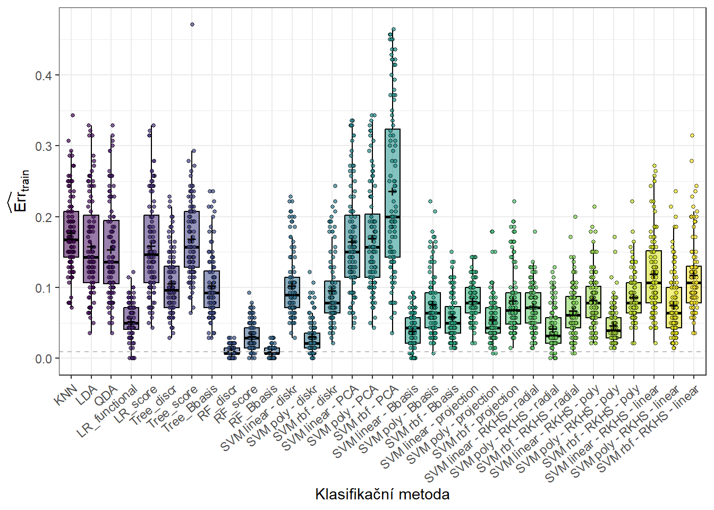
<p class="caption">(\#fig:unnamed-chunk-272)Krabicové diagramy trénovacích chybovostí pro 100 simulací zvlášť pro jednotlivé klasifikační metody. Černými symboly $+$ jsou vyznačeny průměry.</p>
</div>


```r
# pro testovaci data
SIMULACE$test |> 
  pivot_longer(cols = methods, names_to = 'method', values_to = 'Err') |>
  mutate(method = factor(method, levels = methods, labels = methods, ordered = TRUE)) |> 
  as.data.frame() |>
  ggplot(aes(x = method, y = Err, fill = method, colour = method, alpha = method)) + 
  geom_boxplot(outlier.colour = "white", outlier.shape = 16, outlier.size = 0, 
               notch = FALSE, colour = 'black') + 
  theme_bw() + 
  labs(x = 'Klasifikační metoda',
       y = "$\\widehat{\\textnormal{Err}}_{test}$"
       # y = expression(widehat(Err)[test])
       ) + 
  theme(legend.position = 'none',
        axis.text.x = element_text(angle = 50, hjust = 1)) +
  geom_jitter(position = position_jitter(0.15), alpha = 0.6, size = 0.9, pch = 21,
              colour = "black") +
  stat_summary(fun = "mean", geom = "point", shape = '+',
               size = 3, color = "black", alpha = 0.9) +
  # scale_x_discrete(labels = methods_names) +
  # theme(plot.margin = unit(c(0.5, 0.5, 2, 2), "cm")) +
  # scale_fill_manual(values = box_col) +
  # scale_alpha_manual(values = box_alpha) +
  geom_hline(yintercept = min(SIMULACE.df$Err.test), 
             linetype = 'dashed', colour = 'gray20', alpha = 0.8)
```

<div class="figure">
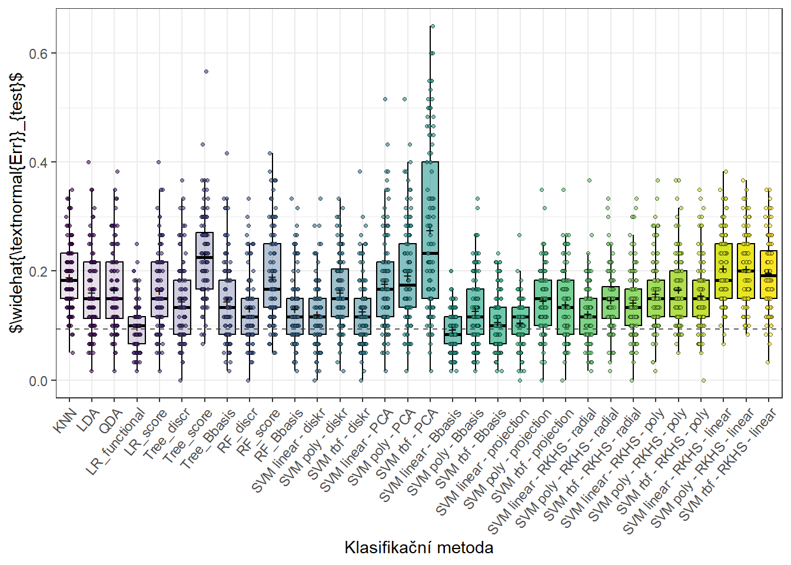
<p class="caption">(\#fig:unnamed-chunk-274)Krabicové diagramy testovacích chybovostí pro 100 simulací zvlášť pro jednotlivé klasifikační metody. Černými symboly $+$ jsou vyznačeny průměry.</p>
</div>

```r
# ggsave("figures/kap6_sim_04_boxplot_test_2der.tex", device = tikz, width = 9, height = 7)
```


Nakonec se podívejme, jaké hodnoty hyperparametrů byly nejčastější volbou.


Table: (\#tab:unnamed-chunk-276)Mediány hodnot hyperparametrů pro vybrané metody, u nichž se určoval nějaký hyperparametr pomocí cross-validace.

                          Mediánová hodnota hyperparametru
-----------------------  ---------------------------------
KNN_K                                                  8.5
nharm                                                  3.0
LR_func_n_basis                                        9.0
SVM_d_Linear                                          10.0
SVM_d_Poly                                            10.0
SVM_d_Radial                                          12.0
SVM_RKHS_radial_gamma1                                10.0
SVM_RKHS_radial_gamma2                                10.0
SVM_RKHS_radial_gamma3                                10.0
SVM_RKHS_radial_d1                                    17.5
SVM_RKHS_radial_d2                                    20.0
SVM_RKHS_radial_d3                                    15.0
SVM_RKHS_poly_p1                                       4.0
SVM_RKHS_poly_p2                                       4.0
SVM_RKHS_poly_p3                                       4.0
SVM_RKHS_poly_d1                                      22.5
SVM_RKHS_poly_d2                                      30.0
SVM_RKHS_poly_d3                                      30.0
SVM_RKHS_linear_d1                                    20.0
SVM_RKHS_linear_d2                                    25.0
SVM_RKHS_linear_d3                                    25.0


```r
CV_res <- CV_RESULTS |> 
  pivot_longer(cols = CV_RESULTS |> colnames(), names_to = 'method', values_to = 'hyperparameter') |>
  mutate(method = factor(method, 
                         levels = CV_RESULTS |> colnames(), 
                         labels = CV_RESULTS |> colnames(), ordered = TRUE)) |> 
  as.data.frame() 

CV_res |> 
  filter(method %in% c('KNN_K', 'nharm', 'LR_func_n_basis')) |>
  ggplot(aes(x = hyperparameter, #y = after_stat(density),
             fill = method, colour = method)) + 
  geom_histogram(binwidth = 1, alpha = 0.6) + 
  theme_bw() + 
  facet_grid(~method, scales = 'free') +
  labs(x = 'Hodnoty hyperparametru',
       y = 'Absolutní počet') + 
  theme(legend.position = 'none')
```

<div class="figure">

<p class="caption">(\#fig:unnamed-chunk-277)Histogramy hodnot hyperparametrů pro KNN, funkcionální logistickou regresi a také histogram pro počet hlavních komponent.</p>
</div>


```r
CV_res |> 
  filter(method %in% c('SVM_d_Linear', 'SVM_d_Poly', 'SVM_d_Radial')) |>
  ggplot(aes(x = hyperparameter, #y = after_stat(density),
             fill = method, colour = method)) + 
  geom_histogram(binwidth = 1, alpha = 0.6) + 
  theme_bw() + 
  facet_grid(~method, scales = 'free') +
  labs(x = 'Hodnoty hyperparametru',
       y = 'Absolutní počet') + 
  theme(legend.position = 'none')
```

<div class="figure">

<p class="caption">(\#fig:unnamed-chunk-279)Histogramy hodnot hyperparametrů metody SVM s projekcí na B-splinovou bázi.</p>
</div>


```r
CV_res |> 
  filter(method %in% c('SVM_RKHS_radial_gamma1', 'SVM_RKHS_radial_gamma2',
                       'SVM_RKHS_radial_gamma3', 'SVM_RKHS_radial_d1', 
                       'SVM_RKHS_radial_d2', 'SVM_RKHS_radial_d3')) |>
  ggplot(aes(x = hyperparameter, #y = after_stat(density),
             fill = method, colour = method)) + 
  geom_histogram(bins = 10, alpha = 0.6) + 
  theme_bw() + 
  facet_wrap(~method, scales = 'free', ncol = 3) +
  labs(x = 'Hodnoty hyperparametru',
       y = 'Absolutní počet') + 
  theme(legend.position = 'none')
```

<div class="figure">

<p class="caption">(\#fig:unnamed-chunk-281)Histogramy hodnot hyperparametrů metody RKHS + SVM s radiálním jádrem.</p>
</div>


```r
CV_res |> 
  filter(method %in% c('SVM_RKHS_poly_p1', 'SVM_RKHS_poly_p2',
                       'SVM_RKHS_poly_p3', 'SVM_RKHS_poly_d1',
                       'SVM_RKHS_poly_d2', 'SVM_RKHS_poly_d3')) |>
  ggplot(aes(x = hyperparameter, #y = after_stat(density),
             fill = method, colour = method)) + 
  geom_histogram(binwidth = 1, alpha = 0.6) + 
  theme_bw() + 
  facet_wrap(~method, scales = 'free', ncol = 3) +
  labs(x = 'Hodnoty hyperparametru',
       y = 'Absolutní počet') + 
  theme(legend.position = 'none')
```

<div class="figure">

<p class="caption">(\#fig:unnamed-chunk-283)Histogramy hodnot hyperparametrů metody RKHS + SVM s polynomiálním jádrem.</p>
</div>


```r
CV_res |> 
  filter(method %in% c('SVM_RKHS_linear_d1',
                       'SVM_RKHS_linear_d2', 'SVM_RKHS_linear_d3')) |>
  ggplot(aes(x = hyperparameter, #y = after_stat(density),
             fill = method, colour = method)) + 
  geom_histogram(binwidth = 5, alpha = 0.6) + 
  theme_bw() + 
  facet_wrap(~method, scales = 'free', ncol = 3) +
  labs(x = 'Hodnoty hyperparametru',
       y = 'Absolutní počet') + 
  theme(legend.position = 'none')
```

<div class="figure">
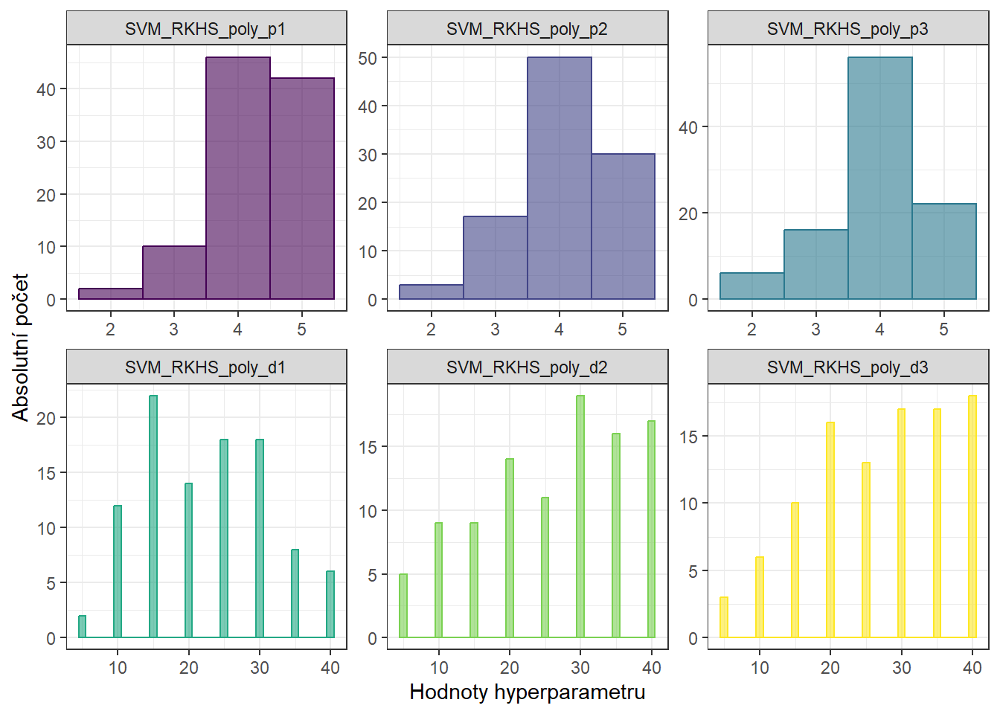
<p class="caption">(\#fig:unnamed-chunk-285)Histogramy hodnot hyperparametrů metody RKHS + SVM s lineárním jádrem.</p>
</div>


