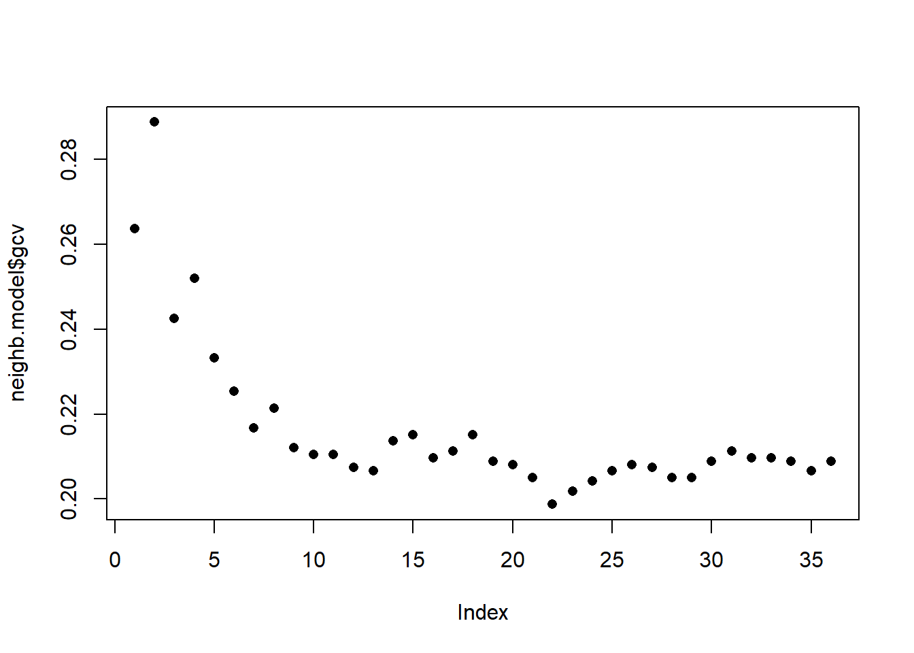

# Aplikace na reálných datech 2 {#aplikace2}

V této části dokumentu se budeme zabývat aplikací dříve popsaných metod (pro více podrobností viz například Kapitolu \@ref(simulace3)) na reálná data `phoneme`, která jsou dostupná například na [této adrese](https://hastie.su.domains/ElemStatLearn/datasets/phoneme.data). Podrobný popis dat pak můžeme nalézt [zde](https://hastie.su.domains/ElemStatLearn/datasets/phoneme.info.txt). Jedná se o datový soubor obsahující log-periodogramy (zvukový záznam řeči) celkem 50 mužů, přičemž od každého jedince máme k dispozici několik zvukových záznamů. V datovém souboru rozlišujeme celkem pět různých hlásek -- *aa*, *ao*, *dcl*, *iy*, *sh*. Naší úlohou bude klasifikovat log-periodogramy do těchto skupin, tedy bude nás zajímat predikce pro nový log-periodogram. 


Nejprve si data načteme z textového souboru `phoneme.txt` a upravíme datový soubor tak, aby byl vhodný pro další analýzu.


```r
# nacteme potrebne balicky 
library(fda)
library(ggplot2)
library(dplyr)
library(tidyr)
library(ddalpha)
library(tidyverse)

set.seed(42)

# nacteni dat
data <- read.delim2('phoneme.txt', header = T, sep = ',')

# zmenime dve promenne na typ factor
data <- data |> 
  mutate(g = factor(g),
         speaker = factor(speaker))

# numericke promenne prevedeme opravdu na numericke
data[, 2:257] <- as.numeric(data[, 2:257] |> as.matrix())
```

Podíváme se na popisné statistiky faktorových proměnných, tedy zejména nás zajímají absolutní a relativní četnosti hlásek v datovém souboru.


```r
data.frame(phoneme = table(data$g) |> names(),
           count = as.numeric(table(data$g)),
           proportion = as.numeric(table(data$g) / sum(table(data$g))))
```

```
##   phoneme count proportion
## 1      aa   695  0.1541362
## 2      ao  1022  0.2266578
## 3     dcl   757  0.1678864
## 4      iy  1163  0.2579286
## 5      sh   872  0.1933910
```

V posledním sloupci datového souboru `phoneme` jsou uvedeny názvy jednotlivých záznamů, přičemž kromě dalších obsahují i informaci o tom, zda se jedná o trénovací (označení `train`) nebo testovací (označení `test`) pozorování. To má pro nás klíčovou roli, neboť podle tohoto označení rozdělíme záznamy na testovací a trénovací množinu.


```r
tr_vs_test <- str_split(data$speaker, '\\.') |> unlist()
tr_vs_test <- tr_vs_test[seq(1, length(tr_vs_test), by = 4)]
data$train <- ifelse(tr_vs_test == 'train', TRUE, FALSE)
data.frame(count = tr_vs_test |> factor() |> summary(),
           proportion = tr_vs_test |> factor() |> 
             summary() / length(tr_vs_test))
```

```
##       count proportion
## test   1169  0.2592593
## train  3340  0.7407407
```

Vykresleme si pro lepší představu log-periodogramy jednotlivých fonémů. Z obrázku níže můžeme vidět, že nejvíce si podobné co do průběhu jsou log-periodogramy pro fonémy *aa* a *ao*. Vybereme si pro klasifikaci tyto dva fonémy a naším cílem bude porovnat metody popsané v předchozích kapitolách z hlediska úspěšnosti klasifikace.


```r
n_plot <- 5
data[c(1, 2, 3, 5, 9), ] |>
  pivot_longer(cols = x.1:x.256, names_to = 'time',
               values_to = 'value') |>
  mutate(time = rep(1:256, n_plot)) |>
  ggplot(aes(x = time, y = value, colour = g, group = interaction(speaker, g))) + 
  geom_line() + 
  theme_bw() + 
  facet_grid(~ g) + 
  labs(x = 'Frekvence',
       y = 'Log-periodogram',
       colour = 'Foném') + 
  # scale_colour_manual(values = rep('deepskyblue2', 5)) +
  theme(aspect.ratio = 1,
        legend.position = "none",
        plot.margin = unit(c(0.1, 0.1, 0.1, 0.3), "cm")) 
```

<div class="figure">

<p class="caption">(\#fig:unnamed-chunk-5)Log-periodogramy fonémů pro vybrané záznamy.</p>
</div>

```r
# ggsave('figures/app_02_log_periodogramy.tex', device = tikz, width = 9, height = 2.5)
```

Vytvořme si ještě vhodné proměnné v `R`, do kterých uložíme trénovací a testovací záznamy a také informaci o druhu fonému.


```r
# nastaveni generatoru cisel
set.seed(42)

# pocet trenovacich a testovacich dat
# n_train <- 500
# n_test <- 300

# vybrane fonemy ke klasifikaci
phoneme_subset <- c('aa', 'ao')

# testovaci a trenovaci data
data_train <- data |> filter(train) |> filter(g %in% phoneme_subset)
data_test <- data |> filter(!train) |> filter(g %in% phoneme_subset)

# omezime se pouze na nejakou podmnozinu
# data_train <- data_train[sample(1:dim(data_train)[1], n_train), ]
# data_test <- data_test[sample(1:dim(data_test)[1], n_test), ]

# odstranime sloupce, ktere nenesou informaci o frekvenci a 
# transponujeme tak, aby ve sloupcich byly jednotlive zaznamy
X_train <- data_train[, -c(1, 258, 259, 260)] |> t()
X_test <- data_test[, -c(1, 258, 259, 260)] |> t()

# prejmenujeme radky a sloupce
rownames(X_train) <- 1:256
colnames(X_train) <- paste0('train', data_train$row.names)
rownames(X_test) <- 1:256
colnames(X_test) <- paste0('test', data_test$row.names)

# definujeme vektor fonemu
y_train <- data_train[, 258] |> factor(levels = phoneme_subset)
y_test <- data_test[, 258] |> factor(levels = phoneme_subset)

# absolutni cetnosti
data.frame(phoneme = phoneme_subset, 
           train = table(y_train) |> as.numeric(),
           test = table(y_test) |> as.numeric())
```

```
##   phoneme train test
## 1      aa   519  176
## 2      ao   759  263
```

## Vyhlazení pozorovaných křivek

Nyní převedeme pozorované diskrétní hodnoty (vektory hodnot) na funkcionální objekty, se kterými budeme následně pracovat.
Jelikož se nejedná o periodické křivky, využijeme k vyhlazení B-sline bázi.

Za uzly bereme celý vektor frekvencí (1 až 256), standardně uvažujeme kubické spliny, proto volíme (implicitní volba v `R`) `norder = 4`.
Budeme penalizovat druhou derivaci funkcí.


```r
t <- 1:256
rangeval <- range(t)
breaks <- t
norder <- 4

bbasis <- create.bspline.basis(rangeval = rangeval, 
                               norder = norder, 
                               breaks = breaks)

curv.Lfd <- int2Lfd(2) # penalizujeme 2. derivaci
```

Najdeme vhodnou hodnotu vyhlazovacího parametru $\lambda > 0$ pomocí $GCV(\lambda)$, tedy pomocí zobecněné cross--validace.
Hodnotu $\lambda$ budeme uvažovat pro obě klasifikační skupiny stejnou, neboť pro testovací pozorování bychom dopředu nevěděli, kterou hodnotu $\lambda$, v případě rozdílné volby pro každou třídu, máme volit.


```r
# spojeni pozorovani do jedne matice
XX <- cbind(X_train, X_test) |> as.matrix()

lambda.vect <- 10^seq(from = 1, to = 3, length.out = 35) # vektor lambd
gcv <- rep(NA, length = length(lambda.vect)) # prazdny vektor pro ulozebi GCV

for(index in 1:length(lambda.vect)) {
  curv.Fdpar <- fdPar(bbasis, curv.Lfd, lambda.vect[index])
  BSmooth <- smooth.basis(t, XX, curv.Fdpar) # vyhlazeni
  gcv[index] <- mean(BSmooth$gcv) # prumer pres vsechny pozorovane krivky
}

GCV <- data.frame(
  lambda = round(log10(lambda.vect), 3),
  GCV = gcv
)

# najdeme hodnotu minima
lambda.opt <- lambda.vect[which.min(gcv)]
```

Pro lepší znázornění si vykreslíme průběh $GCV(\lambda)$.


```r
GCV |> ggplot(aes(x = lambda, y = GCV)) + 
  geom_line(linetype = 'solid', linewidth = 0.6) + 
  geom_point(size = 1.5) + 
  theme_bw() + 
  labs(x = bquote(paste(log[10](lambda), ' ;   ', 
                        lambda[optimal] == .(round(lambda.opt, 4)))),
       y = expression(GCV(lambda))) + 
  geom_point(aes(x = log10(lambda.opt), y = min(gcv)), colour = 'red', size = 3)
```

<div class="figure">

<p class="caption">(\#fig:unnamed-chunk-9)Průběh $GCV(\lambda)$ pro zvolený vektor $\boldsymbol\lambda$. Na ose $x$ jsou hodnoty vyneseny v logaritmické škále. Červeně je znázorněna optimální hodnota vyhlazovacího parametru $\lambda_{optimal}$.</p>
</div>

S touto optimální volbou vyhlazovacího parametru $\lambda$ nyní vyhladíme všechny funkce.


```r
curv.fdPar <- fdPar(bbasis, curv.Lfd, lambda.opt)
BSmooth <- smooth.basis(t, XX, curv.fdPar)
XXfd <- BSmooth$fd

fdobjSmootheval <- eval.fd(fdobj = XXfd, evalarg = t)
```

Ještě znázorněme křivky včetně průměru zvlášť pro každou třídu.


```r
# library(tikzDevice)
n <- dim(XX)[2]
y <- c(y_train, y_test)
DFsmooth <- data.frame(
  t = rep(t, n),
  time = factor(rep(1:n, each = length(t))),
  Smooth = c(fdobjSmootheval),
  Phoneme = rep(y, each = length(t)))

DFmean <- data.frame(
  t = rep(t, 2),
  Mean = c(eval.fd(fdobj = mean.fd(XXfd[y == phoneme_subset[1]]), evalarg = t),
           eval.fd(fdobj = mean.fd(XXfd[y == phoneme_subset[2]]), evalarg = t)),
  Phoneme = factor(rep(phoneme_subset, each = length(t)),
                 levels = levels(y))
)

DFsmooth |> 
  filter(time %in% as.character(1:50)) |>
  ggplot(aes(x = t, y = Smooth, color = Phoneme)) + 
  geom_line(aes(group = time), linewidth = 0.05, alpha = 0.7) +
  theme_bw() +
  labs(x = 'Frekvence',
       y = 'Log-periodogram',
       colour = 'Phoneme') +
  geom_line(data = DFmean, aes(x = t, y = Mean, 
                               group = Phoneme), 
            linewidth = 1.25, linetype = 'solid', colour = 'grey2') + 
  facet_wrap(~Phoneme) + 
  theme(legend.position = 'none') +
  scale_colour_manual(values = c('tomato', 'deepskyblue2'),
                      labels = phoneme_subset)
```

<div class="figure">

<p class="caption">(\#fig:unnamed-chunk-11)Vykreslení prvních 50 vyhlazených pozorovaných křivek, barevně jsou odlišeny křivky podle příslušnosti do klasifikační třídy. Černou čarou je zakreslen průměr pro každou třídu.</p>
</div>

```r
# ggsave("figures/kap7_phoneme_curves_mean.tex", device = tikz, width = 9, height = 4.5)
```

Nakonec této podkapitoly si ještě vykresleme vyhlazené křivky pro vybrané záznamy z grafu pro všechny fonémy výše.


```r
n_plot <- 5
data[c(1, 2, 3, 5, 9), ] |>
  pivot_longer(cols = x.1:x.256, names_to = 'time',
               values_to = 'value') |>
  mutate(time = rep(1:256, n_plot)) |>
  filter(g %in% phoneme_subset) |>
  ggplot(aes(x = time, y = value, colour = g, group = interaction(speaker, g))) + 
  geom_line(alpha = 0.4) + 
  theme_bw() + 
  facet_grid(~ g) + 
  labs(x = 'Frekvence',
       y = 'Log-periodogram',
       colour = 'Foném') + 
  theme(aspect.ratio = 1,
        legend.position = "none") + 
  geom_line(
    data = DFsmooth |> filter(time %in% as.character(c(1, 3))) |>
      mutate(g = Phoneme),
    aes(x = t, y = Smooth, color = g, group = time), linewidth = 0.8
  )
```

<div class="figure">

<p class="caption">(\#fig:unnamed-chunk-12)Log-periodogramy fonémů pro vybrané záznamy.</p>
</div>

```r
# ggsave('figures/app_02_log_periodogramy_plus_smooth.pdf', width = 10, height = 5)
```

## Klasifikace křivek

Nejprve načteme potřebné knihovny pro klasifikaci.


```r
library(caTools) # pro rozdeleni na testovaci a trenovaci
library(caret) # pro k-fold CV
library(fda.usc) # pro KNN, fLR
library(MASS) # pro LDA
library(fdapace)
library(pracma)
library(refund) # pro LR na skorech
library(nnet) # pro LR na skorech
library(caret)
library(rpart) # stromy
library(rattle) # grafika
library(e1071)
library(randomForest) # nahodny les
```


```r
# rozdeleni na testovaci a trenovaci cast
split <- ifelse(substr(XXfd$fdnames$reps, 1, 2) == 'tr', TRUE, FALSE)

X.train <- subset(XXfd, split == TRUE)
X.test <- subset(XXfd, split == FALSE)

Y.train <- subset(y, split == TRUE)
Y.test <- subset(y, split == FALSE)
```

Ještě se podíváme na zastoupení jednotlivých skupin v testovací a trénovací části dat.


```r
# absolutni zastoupeni
table(Y.train)
```

```
## Y.train
##  aa  ao 
## 519 759
```

```r
table(Y.test)
```

```
## Y.test
##  aa  ao 
## 176 263
```

```r
# relativni zastoupeni
table(Y.train) / sum(table(Y.train))
```

```
## Y.train
##        aa        ao 
## 0.4061033 0.5938967
```

```r
table(Y.test) / sum(table(Y.test))
```

```
## Y.test
##        aa        ao 
## 0.4009112 0.5990888
```

### $K$ nejbližších sousedů

Začněme neparametrickou klasifikační metodou, a to metodou $K$ nejbližších sousedů.
Nejprve si vytvoříme potřebné objekty tak, abychom s nimi mohli pomocí funkce `classif.knn()` z knihovny `fda.usc` dále pracovat.


```r
x.train <- fdata(X.train)
y.train <- as.numeric(factor(Y.train))
```

Nyní můžeme definovat model a podívat se na jeho úspěšnost klasifikace.
Poslední otázkou však zůstává, jak volit optimální počet sousedů $K$.
Mohli bychom tento počet volit jako takové $K$, při kterém nastává minimální chybovost na trénovacích datech.
To by ale mohlo vést k přeučení modelu, proto využijeme cross-validaci.
Vzhledem k výpočetní náročnosti a rozsahu souboru zvolíme $k$-násobnou CV, my zvolíme hodnotu $k = {5}$, neboť výpočet je nyní velmi časově náročný.


```r
# model pro vsechna trenovaci data pro K = 1, 2, ..., sqrt(n_train)
neighb.model <- classif.knn(group = y.train, 
                            fdataobj = x.train, 
                            knn = c(1:round(sqrt(length(y.train))))) 

summary(neighb.model) # shrnuti modelu
```

```
##      - SUMMARY - 
## 
## -Probability of correct classification by group (prob.classification):
## y
##         1         2 
## 0.6782274 0.8853755 
## 
## -Confusion matrix between the theoretical groups (by rows)
##   and estimated groups (by column) 
##    
##       1   2
##   1 352 167
##   2  87 672
## 
## -Vector of probability of correct classification
##    by number of neighbors (knn):
##      1      2      3      4      5      6      7      8      9     10     11 
## 0.7363 0.7113 0.7574 0.7480 0.7668 0.7746 0.7833 0.7786 0.7879 0.7895 0.7895 
##     12     13     14     15     16     17     18     19     20     21     22 
## 0.7926 0.7934 0.7864 0.7848 0.7903 0.7887 0.7848 0.7911 0.7919 0.7950 0.8013 
##     23     24     25     26     27     28     29     30     31     32     33 
## 0.7981 0.7958 0.7934 0.7919 0.7926 0.7950 0.7950 0.7911 0.7887 0.7903 0.7903 
##     34     35     36 
## 0.7911 0.7934 0.7911 
## 
## -Optimal number of neighbors: knn.opt= 22 
## with highest probability of correct classification max.prob=  0.801252 
## 
## -Probability of correct classification:  0.8013
```

```r
plot(neighb.model$gcv, pch = 16) # vykresleni zavislosti GCV na poctu sousedu K
```



```r
neighb.model$max.prob # maximalni presnost
```

```
## [1] 0.801252
```

```r
(K.opt <- neighb.model$h.opt) # optimalni hodnota K
```

```
## [1] 22
```

Proveďme předchozí postup pro trénovací data, která rozdělíme na $k$ částí a tedy zopakujeme tuto část kódu $k$-krát.


```r
k_cv <- 5 # k-fold CV
neighbours <- seq(2, 35, by = 5) # pocet sousedu 

# rozdelime trenovaci data na k casti
folds <- createMultiFolds(X.train$fdnames$reps, k = k_cv, time = 1)

# prazdna matice, do ktere vlozime jednotlive vysledky
# ve sloupcich budou hodnoty presnosti pro danou cast trenovaci mnoziny
# v radcich budou hodnoty pro danou hodnotu K sousedu
CV.results <- matrix(NA, nrow = length(neighbours), ncol = k_cv)

for (index in 1:k_cv) {
  # definujeme danou indexovou mnozinu
  fold <- folds[[index]]
    
  x.train.cv <- subset(X.train, c(1:length(X.train$fdnames$reps)) %in% fold) |>
    fdata()
  y.train.cv <- subset(Y.train, c(1:length(X.train$fdnames$reps)) %in% fold) |>
    factor() |> as.numeric()
  
  x.test.cv <- subset(X.train, !c(1:length(X.train$fdnames$reps)) %in% fold) |>
    fdata()
  y.test.cv <- subset(Y.train, !c(1:length(X.train$fdnames$reps)) %in% fold) |>
    factor() |> as.numeric()
  
  # projdeme kazdou cast ... k-krat zopakujeme
  for(neighbour in neighbours) {
    # model pro konkretni volbu K
    neighb.model <- classif.knn(group = y.train.cv, 
                              fdataobj = x.train.cv, 
                              knn = neighbour) 
    # predikce na validacni casti
    model.neighb.predict <- predict(neighb.model, 
                                    new.fdataobj = x.test.cv)
    # presnost na validacni casti
    presnost <- table(y.test.cv, model.neighb.predict) |> 
      prop.table() |> diag() |> sum()
    
    # presnost vlozime na pozici pro dane K a fold
    CV.results[(1:length(neighbours))[neighbour == neighbours], index] <- presnost
    
    #cat('\r', paste0(index, ': ', neighbour))
  }
}

# spocitame prumerne presnosti pro jednotliva K pres folds
CV.results <- apply(CV.results, 1, mean)
K.opt <- neighbours[which.max(CV.results)]
presnost.opt.cv <- max(CV.results)
CV.results <- data.frame(K = neighbours, CV = CV.results)
```

Vidíme, že nejlépe vychází hodnota parametru $K$ jako 22 s hodnotou chybovosti spočtenou pomocí 10-násobné CV 0.202.
Pro přehlednost si ještě vykresleme průběh validační chybovosti v závislosti na počtu sousedů $K$.


```r
CV.results |> ggplot(aes(x = K, y = 1 - CV)) + 
  geom_line(linetype = 'dashed', colour = 'grey') + 
  geom_point(size = 1.5) + 
  geom_point(aes(x = K.opt, y = 1 - presnost.opt.cv), colour = 'red', size = 2) +
  theme_bw() + 
  labs(x = bquote(paste(K, ' ;   ', 
                        K[optimal] == .(K.opt))),
       y = 'Validační chybovost') + 
  scale_x_continuous(breaks = neighbours)
```

<div class="figure">

<p class="caption">(\#fig:unnamed-chunk-19)Závislost validační chybovosti na hodnotě $K$, tedy na počtu sousedů.</p>
</div>

Nyní známe optimální hodnotu parametru $K$ a tudíž můžeme sestavit finální model.


```r
neighb.model <- classif.knn(group = y.train, fdataobj = x.train, knn = K.opt)

# predikce
model.neighb.predict <- predict(neighb.model, 
                                new.fdataobj = fdata(X.test))

summary(neighb.model)
```

```
##      - SUMMARY - 
## 
## -Probability of correct classification by group (prob.classification):
## y
##         1         2 
## 0.6782274 0.8853755 
## 
## -Confusion matrix between the theoretical groups (by rows)
##   and estimated groups (by column) 
##    
##       1   2
##   1 352 167
##   2  87 672
## 
## -Vector of probability of correct classification
##    by number of neighbors (knn):
##     22 
## 0.8013 
## 
## -Optimal number of neighbors: knn.opt= 22 
## with highest probability of correct classification max.prob=  0.801252 
## 
## -Probability of correct classification:  0.8013
```

```r
# presnost na testovacich datech
presnost <- table(as.numeric(factor(Y.test)), model.neighb.predict) |>
  prop.table() |>
  diag() |>
  sum()
```

Vidíme tedy, že chybovost modelu sestrojeného pomocí metody $K$ nejbližších sousedů s optimální volbou $K_{optimal}$ rovnou 22, kterou jsme určili cross-validací, je na trénovacích datech rovna 0.1987 a na testovacích datech 0.2073.

K porovnání jendotlivých modelů můžeme použít oba typy chybovostí, pro přehlednost si je budeme ukládat do tabulky.


```r
RESULTS <- data.frame(model = 'KNN', 
                      Err.train = 1 - neighb.model$max.prob,
                      Err.test = 1 - presnost)
```

### Lineární diskriminační analýza

Jako druhou metodu pro sestrojení klasifikátoru budeme uvažovat lineární diskriminační analýzu (LDA).
Jelikož tato metoda nelze aplikovat na funkcionální data, musíme je nejprve diskretizovat, což provedeme pomocí funkcionální analýzy hlavních komponent.
Klasifikační algoritmus následně provedeme na skórech prvních $p$ hlavních komponent.
Počet komponent $p$ zvolíme tak, aby prvních $p$ hlavních komponent dohromady vysvětlovalo alespoň 90 % variability v datech.

Proveďme tedy nejprve funkcionální analýzu hlavních komponent a určeme počet $p$.


```r
# analyza hlavnich komponent
data.PCA <- pca.fd(X.train, nharm = 10) # nharm - maximalni pocet HK
nharm <- which(cumsum(data.PCA$varprop) >= 0.9)[1] # urceni p
if(nharm == 1) nharm <- 2 # aby bylo mozne vykreslovat grafy,
# potrebujeme alespon 2 HK

data.PCA <- pca.fd(X.train, nharm = nharm) 
data.PCA.train <- as.data.frame(data.PCA$scores) # skore prvnich p HK
data.PCA.train$Y <- factor(Y.train) # prislusnost do trid
```

V tomto konkrétním případě jsme za počet hlavních komponent vzali $p$ = 9, které dohromady vysvětlují 90.26 % variability v datech.
První hlavní komponenta potom vysvětluje 44.16 % a druhá 13.79 % variability.
Graficky si můžeme zobrazit hodnoty skórů prvních dvou hlavních komponent, barevně odlišených podle příslušnosti do klasifikační třídy.


```r
data.PCA.train |> ggplot(aes(x = V1, y = V2, colour = Y)) +
  geom_point(size = 1.5) + 
  labs(x = paste('1. hlavní komponenta (vysvětlená variabilita', 
                 round(100 * data.PCA$varprop[1], 2), '%)'),
       y = paste('2. hlavní komponenta (', 
                 round(100 * data.PCA$varprop[2], 2), '%)'),
       colour = 'Foném') +
  scale_colour_discrete(labels = phoneme_subset) +
  theme_bw()
```

<div class="figure">

<p class="caption">(\#fig:unnamed-chunk-23)Hodnoty skórů prvních dvou hlavních komponent pro trénovací data. Barevně jsou odlišeny body podle příslušnosti do klasifikační třídy.</p>
</div>

Abychom mohli určit přesnost klasifikace na testovacích datech, potřebujeme spočítat skóre pro první 9 hlavní komponenty pro testovací data.
Tato skóre určíme pomocí vzorce:

$$
\xi_{i, j} = \int \left( X_i(t) - \mu(t)\right) \cdot \rho_j(t)\text dt,
$$ 
kde $\mu(t)$ je střední hodnota (průměrná funkce) a $\rho_j(t)$ vlastní fukce (funkcionální hlavní komponenty).


```r
# vypocet skoru testovacich funkci
scores <- matrix(NA, ncol = nharm, nrow = length(Y.test)) # prazdna matice

for(k in 1:dim(scores)[1]) {
  xfd = X.test[k] - data.PCA$meanfd[1] # k-te pozorovani - prumerna funkce
  scores[k, ] = inprod(xfd, data.PCA$harmonics) 
  # skalarni soucin rezidua a vlastnich funkci rho (funkcionalni hlavni komponenty)
}

data.PCA.test <- as.data.frame(scores)
data.PCA.test$Y <- factor(Y.test)
colnames(data.PCA.test) <- colnames(data.PCA.train) 
```

Nyní již můžeme sestrojit klasifikátor na trénovací části dat.


```r
# model
clf.LDA <- lda(Y ~ ., data = data.PCA.train)

# presnost na trenovacich datech
predictions.train <- predict(clf.LDA, newdata = data.PCA.train)
presnost.train <- table(data.PCA.train$Y, predictions.train$class) |>
  prop.table() |> diag() |> sum()
  
# presnost na testovacich datech
predictions.test <- predict(clf.LDA, newdata = data.PCA.test)
presnost.test <- table(data.PCA.test$Y, predictions.test$class) |>
  prop.table() |> diag() |> sum()
```

Spočítali jsme jednak chybovost klasifikátoru na trénovacích (19.95 %), tak i na testovacích datech (20.96 %).

Pro grafické znázornění metody můžeme zaznačit dělící hranici do grafu skórů prvních dvou hlavních komponent.
Tuto hranici spočítáme na husté síti bodů a zobrazíme ji pomocí funkce `geom_contour()`.


```r
# pridame diskriminacni hranici
np <- 1001 # pocet bodu site
# x-ova osa ... 1. HK
nd.x <- seq(from = min(data.PCA.train$V1), 
            to = max(data.PCA.train$V1), length.out = np)
# y-ova osa ... 2. HK
nd.y <- seq(from = min(data.PCA.train$V2), 
            to = max(data.PCA.train$V2), length.out = np)
# pripad pro 2 HK ... p = 2
nd <- expand.grid(V1 = nd.x, V2 = nd.y)
# pokud p = 3
if(dim(data.PCA.train)[2] == 4) {
  nd <- expand.grid(V1 = nd.x, V2 = nd.y, V3 = data.PCA.train$V3[1])}
# pokud p = 4
if(dim(data.PCA.train)[2] == 5) {
  nd <- expand.grid(V1 = nd.x, V2 = nd.y, V3 = data.PCA.train$V3[1],
                    V4 = data.PCA.train$V4[1])}
# pokud p = 5
if(dim(data.PCA.train)[2] == 6) {
  nd <- expand.grid(V1 = nd.x, V2 = nd.y, V3 = data.PCA.train$V3[1],
                    V4 = data.PCA.train$V4[1], V5 = data.PCA.train$V5[1])}
# pokud p = 9
if(dim(data.PCA.train)[2] == 10) {
  nd <- expand.grid(V1 = nd.x, V2 = nd.y, V3 = data.PCA.train$V3[1],
                    V4 = data.PCA.train$V4[1], V5 = data.PCA.train$V5[1],
                    V6 = data.PCA.train$V5[1], V7 = data.PCA.train$V5[1],
                    V8 = data.PCA.train$V5[1], V9 = data.PCA.train$V5[1])}

# pridame Y = 0, 1
nd <- nd |> mutate(prd = as.numeric(predict(clf.LDA, newdata = nd)$class))

data.PCA.train |> ggplot(aes(x = V1, y = V2, colour = Y)) +
  geom_point(size = 1.5) + 
  labs(x = paste('1. hlavní komponenta (vysvětlená variabilita', 
                 round(100 * data.PCA$varprop[1], 2), '%)'),
       y = paste('2. hlavní komponenta (', 
                 round(100 * data.PCA$varprop[2], 2), '%)'),
       colour = 'Foném') +
  scale_colour_discrete(labels = phoneme_subset) +
  theme_bw() +
  geom_contour(data = nd, aes(x = V1, y = V2, z = prd), colour = 'black')
```

<div class="figure">

<p class="caption">(\#fig:unnamed-chunk-26)Skóre prvních dvou hlavních komponent, barevně odlišené podle příslušnosti do klasifikační třídy. Černě je vyznačena dělící hranice (přímka v rovině prvních dvou hlavních komponent) mezi třídami sestrojená pomocí LDA.</p>
</div>

Vidíme, že dělící hranicí je přímka, lineární funkce v prostoru 2D, což jsme ostatně od LDA čekali.
Nakonec přidáme chybovosti do souhrnné tabulky.


```r
Res <- data.frame(model = 'LDA', 
                  Err.train = 1 - presnost.train,
                  Err.test = 1 - presnost.test)

RESULTS <- rbind(RESULTS, Res)
```

### Kvadratická diskriminační analýza

Jako další sestrojme klasifikátor pomocí kvadratické diskriminační analýzy (QDA).
Jedná se o analogický případ jako LDA s tím rozdílem, že nyní připouštíme pro každou ze tříd rozdílnou kovarianční matici normálního rozdělení, ze kterého pocházejí příslušné skóry.
Tento vypuštěný předpoklad o rovnosti kovariančních matic vede ke kvadratické hranici mezi třídami.

V `R` se provede QDA analogicky jako LDA v předchozí části, tedy opět bychom pomocí funkcionální analýzy hlavních komponent spočítali skóre pro trénovací i testovací funkce, sestrojili klasifikátor na skórech prvních $p$ hlavních komponent a pomocí něj predikovali příslušnost testovacích křivek do třídy $Y^* \in \{\texttt{aa}, \texttt{ao}\}$.

Funkcionální PCA provádět nemusíme, využijeme výsledků z části LDA.


Můžeme tedy rovnou přistoupit k sestrojení klasifikátoru, což provedeme pomocí funkce `qda()`.
Následně spočítáme přesnost klasifikátoru na testovacích a trénovacích datech.


```r
# model
clf.QDA <- qda(Y ~ ., data = data.PCA.train)

# presnost na trenovacich datech
predictions.train <- predict(clf.QDA, newdata = data.PCA.train)
presnost.train <- table(data.PCA.train$Y, predictions.train$class) |>
  prop.table() |> diag() |> sum()
  
# presnost na testovacich datech
predictions.test <- predict(clf.QDA, newdata = data.PCA.test)
presnost.test <- table(data.PCA.test$Y, predictions.test$class) |>
  prop.table() |> diag() |> sum()
```

Spočítali jsme tedy jednak chybovost klasifikátoru na trénovacích (20.19 %), tak i na testovacích datech (20.96 %).

Pro grafické znázornění metody můžeme zaznačit dělící hranici do grafu skórů prvních dvou hlavních komponent.
Tuto hranici spočítáme na husté síti bodů a zobrazíme ji pomocí funkce `geom_contour()` stejně jako v případě LDA.


```r
nd <- nd |> mutate(prd = as.numeric(predict(clf.QDA, newdata = nd)$class))

data.PCA.train |> ggplot(aes(x = V1, y = V2, colour = Y)) +
  geom_point(size = 1.5) + 
  labs(x = paste('1. hlavní komponenta (vysvětlená variabilita', 
                 round(100 * data.PCA$varprop[1], 2), '%)'),
       y = paste('2. hlavní komponenta (', 
                 round(100 * data.PCA$varprop[2], 2), '%)'),
       colour = 'Foném') +
  scale_colour_discrete(labels = phoneme_subset) +
  theme_bw() +
  geom_contour(data = nd, aes(x = V1, y = V2, z = prd), colour = 'black')
```

<div class="figure">

<p class="caption">(\#fig:unnamed-chunk-32)Skóre prvních dvou hlavních komponent, barevně odlišené podle příslušnosti do klasifikační třídy. Černě je vyznačena dělící hranice (parabola v rovině prvních dvou hlavních komponent) mezi třídami sestrojená pomocí QDA.</p>
</div>

Všimněme si, že dělící hranicí mezi klasifikačními třídami je nyní parabola.

Nakonec ještě doplníme chybovosti do souhrnné tabulky.


```r
Res <- data.frame(model = 'QDA', 
                  Err.train = 1 - presnost.train,
                  Err.test = 1 - presnost.test)

RESULTS <- rbind(RESULTS, Res)
```

### Logistická regrese

Logistickou regresi můžeme provést dvěma způsoby.
Jednak použít funkcionální obdobu klasické logistické regrese, druhak klasickou mnohorozměrnou logistickou regresi, kterou provedeme na skórech prvních $p$ hlavních komponent.

#### Funkcionální logistická regrese

Analogicky jako v případě konečné dimenze vstupních dat uvažujeme logistický model ve tvaru:

$$
g\left(\mathbb E [Y|X = x]\right) = \eta (x) = g(\pi(x)) = \alpha + \int \beta(t)\cdot x(t) \text d t,
$$ 
kde $\eta(x)$ je lineární prediktor nabývající hodnot z intervalu $(-\infty, \infty)$, $g(\cdot)$ je *linková funkce*, v případě logistické regrese se jedná o logitovou funkci $g: (0,1) \rightarrow \mathbb R,\ g(p) = \ln\frac{p}{1-p}$ a $\pi(x)$ podmíněná pravděpodobnost

$$
\pi(x) = \text{Pr}(Y = 1 | X = x) = g^{-1}(\eta(x)) = \frac{\text e^{\alpha + \int \beta(t)\cdot x(t) \text d t}}{1 + \text e^{\alpha + \int \beta(t)\cdot x(t) \text d t}},
$$

přičemž $\alpha$ je konstanta a $\beta(t) \in L^2[a, b]$ je parametrická funkce.
Naším cílem je odhadnout tuto parametrickou funkci.

Pro funkcionální logistickou regresi použijeme funkci `fregre.glm()` z balíčku `fda.usc`.
Nejprve si vytvoříme vhodné objekty pro konstrukci klasifikátoru.


```r
# vytvorime vhodne objekty
x.train <- fdata(X.train)
y.train <- as.numeric(Y.train)

# body, ve kterych jsou funkce vyhodnoceny
tt <- x.train[["argvals"]]

dataf <- as.data.frame(y.train) - 1
colnames(dataf) <- "Y"

# B-spline baze 
# potrebujeme zvolit bazi pro funkcionalni pozorovani, klasicky volime 
# stejnou bazi jako je ta pouzita pro vyhlazeni krivek. Tato volba vsak
# vede k numericke chybe, zvolime proto bazi s mensim poctem bazovych funkci.
# Po vyzkouseni nekolika moznosti se zda, ze 100 funkci je dostatecne mnoho.
nbasis.x <- 100
basis1 <- create.bspline.basis(rangeval = range(tt), nbasis = nbasis.x)
```

Abychom mohli odhadnout parametrickou funkci $\beta(t)$, potřebujeme ji vyjádřit v nějaké bazické reprezentaci, v našem případě B-splinové bázi.
K tomu však potřebujeme najít vhodný počet bázových funkcí.
To bychom mohli určit na základě chybovosti na trénovacích datech, avšak tato data budou upřenostňovat výběr velkého počtu bází a bude docházet k přeučení modelu.

Ilustrujme si to na následujícím případě.
Pro každý z počtu bází $n_{basis} \in \{4, 5, \dots, 30\}$ natrénujeme model na trénovacích datech, určíme na nich chybovost a také spočítáme chybovost na testovacích datech.
Připomeňme, že k výběru vhodného počtu bází nemůžeme využít stejná data jako pro odhad testovací chybovosti, neboť bychom tuto chybovost podcenili.


```r
n.basis.max <- 30
n.basis <- 4:n.basis.max
pred.baz <- matrix(NA, nrow = length(n.basis), ncol = 2, 
                   dimnames = list(n.basis, c('Err.train', 'Err.test')))

for (i in n.basis) {
  # baze pro bety
  basis2 <- create.bspline.basis(rangeval = range(tt), nbasis = i)
  # vztah
  f <- Y ~ x
  # baze pro x a bety
  basis.x <- list("x" = basis1) # vyhlazene data
  basis.b <- list("x" = basis2)
  # vstupni data do modelu
  ldata <- list("df" = dataf, "x" = x.train)
  # binomicky model ... model logisticke regrese
  model.glm <- fregre.glm(f, family = binomial(), data = ldata,
                          basis.x = basis.x, basis.b = basis.b)
  
  # presnost na trenovacich datech
  predictions.train <- predict(model.glm, newx = ldata)
  predictions.train <- data.frame(Y.pred = ifelse(predictions.train < 1/2, 0, 1))
  presnost.train <- table(Y.train, predictions.train$Y.pred) |>
    prop.table() |> diag() |> sum()
    
  # presnost na testovacich datech
  newldata = list("df" = as.data.frame(Y.test), "x" = fdata(X.test))
  predictions.test <- predict(model.glm, newx = newldata)
  predictions.test <- data.frame(Y.pred = ifelse(predictions.test < 1/2, 0, 1))
  presnost.test <- table(Y.test, predictions.test$Y.pred) |>
    prop.table() |> diag() |> sum()
  
  # vlozime do matice
  pred.baz[as.character(i), ] <- 1 - c(presnost.train, presnost.test)
} 

pred.baz <- as.data.frame(pred.baz)
pred.baz$n.basis <- n.basis
```

Znázorněme si průběh obou typů chybovostí v grafu v závislosti na počtu bazických funkcí.


```r
n.basis.beta.opt <- pred.baz$n.basis[which.min(pred.baz$Err.test)]

pred.baz |> ggplot(aes(x = n.basis, y = Err.test)) + 
  geom_line(linetype = 'dashed', colour = 'black') + 
  geom_line(aes(x = n.basis, y = Err.train), colour = 'deepskyblue3', 
            linetype = 'dashed', linewidth = 0.5) + 
  geom_point(size = 1.5) + 
  geom_point(aes(x = n.basis, y = Err.train), colour = 'deepskyblue3', 
             size = 1.5) + 
  geom_point(aes(x = n.basis.beta.opt, y = min(pred.baz$Err.test)),
             colour = 'red', size = 2) +
  theme_bw() + 
  labs(x = bquote(paste(n[basis], ' ;   ', 
                        n[optimal] == .(n.basis.beta.opt))),
        y = 'Chybovost')
```

<div class="figure">

<p class="caption">(\#fig:unnamed-chunk-36)Závislost testovací a trénovací chybovosti na počtu bázových funkcí pro $\beta$. Červeným bodem je znázorněn optimální počet $n_{optimal}$ zvolený jako minimum testovací chybovosti, černou čarou je vykreslena testovací a modrou přerušovanou čarou je vykreslen průběh trénovací chybovosti.</p>
</div>

Vidíme, že s rostoucím počtem bází pro $\beta(t)$ má trénovací chybovost (modrá čára) tendenci klesat a tedy bychom na jejím základě volili velké hodnoty $n_{basis}$.
Naopak optimální volbou na základě testovací chybovosti je $n$ rovno 14, tedy výrazně menší hodnota než 30.
Naopak s rostoucím $n$ roste testovací chyvost, což ukazuje na přeučení modelu.

Z výše uvedených důvodů pro určení optimálního počtu bazických funkcí pro $\beta(t)$ využijeme 10-ti násobnou cross-validaci.
Jako maximální počet uvažovaných bazických funkcí bereme 25, neboť jak jsme viděli výše, nad touto hodnotou dochází již k přeučení modelu.


```r
### 10-fold cross-validation
n.basis.max <- 25
n.basis <- 4:n.basis.max
k_cv <- 10 # k-fold CV
# rozdelime trenovaci data na k casti
folds <- createMultiFolds(X.train$fdnames$reps, k = k_cv, time = 1)
## prvky, ktere se behem cyklu nemeni
# body, ve kterych jsou funkce vyhodnoceny
tt <- x.train[["argvals"]]
rangeval <- range(tt)
# B-spline baze 
basis1 <- create.bspline.basis(rangeval = range(tt), nbasis = nbasis.x)
# vztah
f <- Y ~ x
# baze pro x
basis.x <- list("x" = basis1)
# prazdna matice, do ktere vlozime jednotlive vysledky
# ve sloupcich budou hodnoty presnosti pro danou cast trenovaci mnoziny
# v radcich budou hodnoty pro dany pocet bazi
CV.results <- matrix(NA, nrow = length(n.basis), ncol = k_cv, 
                     dimnames = list(n.basis, 1:k_cv))
```

Nyní již máme vše připravené pro spočítání chybovosti na každé z deseti podmnožin trénovací množiny.
Následně určíme průměr a jako optimální $n$ vezmeme argument minima validační chybovosti.


```r
for (index in 1:k_cv) {
  # definujeme danou indexovou mnozinu
  fold <- folds[[index]]
    
  x.train.cv <- subset(X.train, c(1:length(X.train$fdnames$reps)) %in% fold) |>
    fdata()
  y.train.cv <- subset(Y.train, c(1:length(X.train$fdnames$reps)) %in% fold) |>
    as.numeric() - 1
  
  x.test.cv <- subset(X.train, !c(1:length(X.train$fdnames$reps)) %in% fold) |>
    fdata()
  y.test.cv <- subset(Y.train, !c(1:length(X.train$fdnames$reps)) %in% fold) |>
    as.numeric() - 1
  
  dataf <- as.data.frame(y.train.cv) 
  colnames(dataf) <- "Y"
  
  for (i in n.basis) {
    # baze pro bety
    basis2 <- create.bspline.basis(rangeval = rangeval, nbasis = i)
    
    basis.b <- list("x" = basis2)
    # vstupni data do modelu
    ldata <- list("df" = dataf, "x" = x.train.cv)
    # binomicky model ... model logisticke regrese
    model.glm <- fregre.glm(f, family = binomial(), data = ldata,
                            basis.x = basis.x, basis.b = basis.b)
    
    # presnost na validacni casti 
    newldata = list("df" = as.data.frame(y.test.cv), "x" = x.test.cv)
    predictions.valid <- predict(model.glm, newx = newldata)
    predictions.valid <- data.frame(Y.pred = ifelse(predictions.valid < 1/2, 0, 1))
    presnost.valid <- table(y.test.cv, predictions.valid$Y.pred) |>
      prop.table() |> diag() |> sum()
    
    # vlozime do matice
    CV.results[as.character(i), as.character(index)] <- presnost.valid
  } 
}

# spocitame prumerne presnosti pro jednotliva n pres folds
CV.results <- apply(CV.results, 1, mean)
n.basis.opt <- n.basis[which.max(CV.results)]
presnost.opt.cv <- max(CV.results)
```

Vykresleme si ještě průběh validační chybovosti i se zvýrazněnou optimální hodnotou $n_{optimal}$ rovnou 20 s validační chybovostí 0.1719.


```r
CV.results <- data.frame(n.basis = n.basis, CV = CV.results)
CV.results |> ggplot(aes(x = n.basis, y = 1 - CV)) + 
  geom_line(linetype = 'dashed', colour = 'grey') + 
  geom_point(size = 1.5) + 
  geom_point(aes(x = n.basis.opt, y = 1 - presnost.opt.cv), colour = 'red', size = 2) +
  theme_bw() + 
  labs(x = bquote(paste(n[basis], ' ;   ', 
                        n[optimal] == .(n.basis.opt))),
       y = 'Validační chybovost') + 
  scale_x_continuous(breaks = n.basis) + 
  theme(panel.grid.minor = element_blank())
```

<div class="figure">

<p class="caption">(\#fig:unnamed-chunk-39)Závislost validační chybovosti na hodnotě $n_{basis}$, tedy na počtu bází.</p>
</div>

Nyní již tedy můžeme definovat finální model pomocí funkcionální logistické regrese, přičemž bázi pro $\beta(t)$ volíme B-splinovou bázi s 20 bázemi.


```r
# optimalni model
basis2 <- create.bspline.basis(rangeval = range(tt), nbasis = n.basis.opt)
f <- Y ~ x
# baze pro x a bety
basis.x <- list("x" = basis1) 
basis.b <- list("x" = basis2)
# vstupni data do modelu
dataf <- as.data.frame(y.train - 1) 
colnames(dataf) <- "Y"
ldata <- list("df" = dataf, "x" = x.train)
# binomicky model ... model logisticke regrese
model.glm <- fregre.glm(f, family = binomial(), data = ldata,
                        basis.x = basis.x, basis.b = basis.b)

# presnost na trenovacich datech
predictions.train <- predict(model.glm, newx = ldata)
predictions.train <- data.frame(Y.pred = ifelse(predictions.train < 1/2, 0, 1))
presnost.train <- table(Y.train, predictions.train$Y.pred) |>
  prop.table() |> diag() |> sum()
  
# presnost na testovacich datech
newldata = list("df" = as.data.frame(Y.test), "x" = fdata(X.test))
predictions.test <- predict(model.glm, newx = newldata)
predictions.test <- data.frame(Y.pred = ifelse(predictions.test < 1/2, 0, 1))
presnost.test <- table(Y.test, predictions.test$Y.pred) |>
  prop.table() |> diag() |> sum()
```

Spočítali jsme trénovací chybovost (rovna 16.2 %) i testovací chybovost (rovna 19.36 %).
Pro lepší představu si ještě můžeme vykreslit hodnoty odhadnutých pravděpodobností příslušnosti do klasifikační třídy $Y = 1$ na trénovacích datech v závislosti na hodnotách lineárního prediktoru.


```r
data.frame(
  linear.predictor = model.glm$linear.predictors,
  response = model.glm$fitted.values,
  Y = factor(y.train)
) |> ggplot(aes(x = linear.predictor, y = response, colour = Y)) + 
  geom_abline(aes(slope = 0, intercept = 0.5), linetype = 'dashed', colour = 'grey', linewidth = 0.3) + 
  geom_point(aes(x = linear.predictor,
                 y = response + rnorm(length(response), sd = 0.02), 
                 colour = Y),
             size = 0.5, alpha = 0.75) + 
  geom_line(aes(x = linear.predictor, y = response), colour = 'grey2') +
  # scale_colour_discrete(labels = phoneme_subset) +
  theme_bw() + 
  labs(x = 'Lineární prediktor',
       y = 'Odhadnuté pravděpodobnosti Pr(Y = 1|X = x)',
       colour = 'Foném') +
  scale_colour_manual(values = c('tomato', 'deepskyblue2'),
                      labels = phoneme_subset) + 
  theme(panel.grid.major = element_blank(),
        panel.grid.minor = element_blank(),
        legend.position = c(0.85, 0.18)) + 
  scale_y_continuous(breaks = c(0, 0.25, 0.5, 0.75, 1)#,
                     # labels = c('0', '0.25', '0.5', '0.75', '1')
                     ) + 
  scale_x_continuous(breaks = c(-6, -3, 0, 3, 6))
```

<div class="figure">

<p class="caption">(\#fig:unnamed-chunk-41)Závislost odhadnutých pravděpodobností na hodnotách lineárního prediktoru. Barevně jsou odlišeny body podle příslušnosti do klasifikační třídy.</p>
</div>

```r
# library(tikzDevice)
# ggsave("figures/DP_kap3_linearpredictor.tex", width = 4, height = 3.5, device = tikz)
```

Můžeme si ještě pro informaci zobrazit průběh odhadnuté parametrické funkce $\beta(t)$.


```r
t.seq <- seq(min(tt), max(tt), length = 1001)
beta.seq <- eval.fd(evalarg = t.seq, fdobj = model.glm$beta.l$x)

data.frame(t = t.seq, beta = beta.seq) |> 
  ggplot(aes(t, beta)) + 
  geom_abline(aes(slope = 0, intercept = 0), linetype = 'dashed', 
              linewidth = 0.5, colour = 'grey') +
  geom_line(colour = 'deepskyblue2', linewidth = 0.8) + 
  theme_bw() +
  labs(x = expression(t),
       y = expression(widehat(beta)(t))) + 
  theme(panel.grid.major = element_blank(),
        panel.grid.minor = element_blank())
```

<div class="figure">

<p class="caption">(\#fig:unnamed-chunk-42)Průběh odhadu parametrické funkce $\beta(t), t \in [1, 256]$.</p>
</div>

```r
# ggsave("figures/DP_kap3_betahat.tex", width = 4, height = 3.5,
#        device = tikz)
```

Vidíme, že hodnoty funkce $\hat\beta(t)$ se drží kolem nuly pro frekvence $t$ z prostředka  a konce intervalu $[1, 256]$, zatímco pro počáteční frekvence jsou hodnoty vyšší.
To implikuje rozdílnost funkcí z klasifikačních tříd zejména na začátku intervalu, zatímco uprostřed intervalu jsou funkce velmi podobné.

Výsledky opět přidáme do souhrnné tabulky.


```r
Res <- data.frame(model = 'LR functional', 
                  Err.train = 1 - presnost.train,
                  Err.test = 1 - presnost.test)

RESULTS <- rbind(RESULTS, Res)
```

#### Logistická regrese s analýzou hlavních komponent

Abychom mohli sesrojit tento klasifikátor, potřebujeme provést funkcionální analýzu hlavních komponent, určit vhodný počet komponent a spočítat hodnoty skórů pro testovací data.
To jsme již provedli v části u lineární diskriminační analýzy, proto využijeme tyto výsledky v následující části.


Můžeme tedy rovnou sestrojit model logistické regrese pomocí funkce `glm(, family = binomial)`.


```r
# model
clf.LR <- glm(Y ~  ., data = data.PCA.train, family = binomial)

# presnost na trenovacich datech
predictions.train <- predict(clf.LR, newdata = data.PCA.train, type = 'response')
predictions.train <- ifelse(predictions.train > 0.5, 1, 0)
presnost.train <- table(data.PCA.train$Y, predictions.train) |>
  prop.table() |> diag() |> sum()
  
# presnost na testovacich datech
predictions.test <- predict(clf.LR, newdata = data.PCA.test, type = 'response')
predictions.test <- ifelse(predictions.test > 0.5, 1, 0)
presnost.test <- table(data.PCA.test$Y, predictions.test) |>
  prop.table() |> diag() |> sum()
```

Spočítali jsme tedy chybovost klasifikátoru na trénovacích (20.03 %) i na testovacích datech (21.18 %).

Pro grafické znázornění metody můžeme zaznačit dělící hranici do grafu skórů prvních dvou hlavních komponent.
Tuto hranici spočítáme na husté síti bodů a zobrazíme ji pomocí funkce `geom_contour()` stejně jako v případě LDA i QDA.


```r
nd <- nd |> mutate(prd = as.numeric(predict(clf.LR, newdata = nd,
                                            type = 'response')))
nd$prd <- ifelse(nd$prd > 0.5, 1, 0)

data.PCA.train |> ggplot(aes(x = V1, y = V2, colour = Y)) +
  geom_point(size = 1.5) + 
  labs(x = paste('1. hlavní komponenta (vysvětlená variabilita', 
                 round(100 * data.PCA$varprop[1], 2), '%)'),
       y = paste('2. hlavní komponenta (', 
                 round(100 * data.PCA$varprop[2], 2), '%)'),
       colour = 'Foném') +
  scale_colour_discrete(labels = phoneme_subset) +
  theme_bw() +
  geom_contour(data = nd, aes(x = V1, y = V2, z = prd), colour = 'black')
```

<div class="figure">

<p class="caption">(\#fig:unnamed-chunk-48)Skóre prvních dvou hlavních komponent, barevně odlišené podle příslušnosti do klasifikační třídy. Černě je vyznačena dělící hranice (přímka v rovině prvních dvou hlavních komponent) mezi třídami sestrojená pomocí logistické regrese.</p>
</div>

Všimněme si, že dělící hranicí mezi klasifikačními třídami je nyní přímka jako v případě LDA.

Nakonec ještě doplníme chybovosti do souhrnné tabulky.


```r
Res <- data.frame(model = 'LR score', 
                  Err.train = 1 - presnost.train,
                  Err.test = 1 - presnost.test)

RESULTS <- rbind(RESULTS, Res)
```

### Rozhodovací stromy

V této části se podíváme na velmi odlišný přístup k sestrojení klasifikátoru, než byly například LDA či logistická regrese.
Rozhodovací stromy jsou velmi oblíbeným nástrojem ke klasifikaci, avšak jako v případě některých předchozích metod nejsou přímo určeny pro funkcionální data.
Existují však postupy, jak funkcionální objekty převést na mnohorozměrné a následně na ně aplikovat algoritmus rozhodovacích stromů.
Můžeme uvažovat následující postupy:

-   algoritmus sestrojený na bázových koeficientech,

-   využití skórů hlavních komponent,

-   použít diskretizaci intervalu a vyhodnotit funkci jen na nějaké konečné síti bodů.

My se nejprve zaměříme na diskretizaci intervalu a následně porovnáme výsledky se zbylými dvěma přístupy k sestrojení rozhodovacího stromu.

#### Diskretizace intervalu

Nejprve si musíme definovat body z intervalu $I = [1, 256]$, ve kterých funkce vyhodnotíme.
Následně vytvoříme objekt, ve kterém budou řádky představovat jednotlivé (diskretizované) funkce a sloupce časy.
Nakonec připojíme sloupec $Y$ s informací o příslušnosti do klasifikační třídy a totéž zopakujeme i pro testovací data.


```r
# posloupnost bodu, ve kterych funkce vyhodnotime
t.seq <- seq(1, 256, length = 101)
   
grid.data <- eval.fd(fdobj = X.train, evalarg = t.seq)
grid.data <- as.data.frame(t(grid.data)) # transpozice kvuli funkcim v radku
grid.data$Y <- Y.train |> factor()

grid.data.test <- eval.fd(fdobj = X.test, evalarg = t.seq)
grid.data.test <- as.data.frame(t(grid.data.test))
grid.data.test$Y <- Y.test |> factor()
```

Nyní mážeme sestrojit rozhodovací strom, ve kterém budou jakožto prediktory vystupovat všechny časy z vektoru `t.seq`.
Tato klasifikační metoda není náchylná na multikolinearitu, tudíž se jí nemusíme zabývat.
Jako metriku zvolíme přesnost.


```r
# sestrojeni modelu
clf.tree <- train(Y ~ ., data = grid.data, 
                 method = "rpart", 
                 trControl = trainControl(method = "CV", number = 10),
                 metric = "Accuracy")

# presnost na trenovacich datech
predictions.train <- predict(clf.tree, newdata = grid.data)
presnost.train <- table(Y.train, predictions.train) |>
  prop.table() |> diag() |> sum()
  
# presnost na testovacich datech
predictions.test <- predict(clf.tree, newdata = grid.data.test)
presnost.test <- table(Y.test, predictions.test) |>
  prop.table() |> diag() |> sum()
```

Chybovost klasifikátoru na testovacích datech je tedy 21.41 % a na trénovacích datech 17.76 %.

Graficky si rozhodovací strom můžeme vykreslit pomocí funkce `fancyRpartPlot()`.
Nastavíme barvy uzlů tak, aby reflektovaly předchozí barevné odlišení.
Jedná se o neprořezaný strom.


```r
colnames(grid.data) <- c(paste0('time:', t.seq), 'Y')
fancyRpartPlot(rpart(Y ~ ., data = grid.data, method = "class"),
               sub = '', palettes = c('Reds', 'Blues')) 
```

<div class="figure">

<p class="caption">(\#fig:unnamed-chunk-52)Grafické znázornění neprořezaného rozhodovacího stromu. Modrými odstíny jsou vykresleny uzly příslušející klasifikační třídě 1 a červenými odstíny třídě 0.</p>
</div>

Můžeme si také vykreslit již prořezaný finální rozhodovací strom.


```r
rpart.plot::rpart.plot(clf.tree$finalModel, # finalni model ... prorezany strom
                       extra = 104, # zobrazeni pozadovanych informaci
                       box.palette = c('Reds', 'Blues'),
                       branch.lty = 3, # dotted branch lines
                       shadow.col = 0, # shadows under the node boxes
                       nn = FALSE, 
                       under = FALSE, 
                       digits = 2)
```

<div class="figure">

<p class="caption">(\#fig:unnamed-chunk-53)Finální prořezaný rozhodovací strom.</p>
</div>

Nakonec opět přidejme trénovací a testovací chybovost do souhrnné tabulky.


```r
Res <- data.frame(model = 'Tree - diskr.', 
                  Err.train = 1 - presnost.train,
                  Err.test = 1 - presnost.test)

RESULTS <- rbind(RESULTS, Res)
```

#### Skóre hlavních komponent

Další možností pro sestrojení rozhodovacího stromu je použít skóre hlavních komponent.
Jelikož jsme již skóre počítali pro předchozí klasifikační metody, využijeme těchto poznatků a sestrojíme rozhodovací strom na skórech prvních 9 hlavních komponent.


```r
# sestrojeni modelu
clf.tree.PCA <- train(Y ~ ., data = data.PCA.train, 
                 method = "rpart", 
                 trControl = trainControl(method = "CV", number = 10),
                 metric = "Accuracy")

# presnost na trenovacich datech
predictions.train <- predict(clf.tree.PCA, newdata = data.PCA.train)
presnost.train <- table(Y.train, predictions.train) |>
  prop.table() |> diag() |> sum()
  
# presnost na testovacich datech
predictions.test <- predict(clf.tree.PCA, newdata = data.PCA.test)
presnost.test <- table(Y.test, predictions.test) |>
  prop.table() |> diag() |> sum()
```

Chybovost rozhodovacího stromu na testovacích datech je tedy 31.21 % a na trénovacích datech 25.27 %.

Graficky si rozhodovací strom sestrojený na skórech hlavních komponent můžeme vykreslit pomocí funkce `fancyRpartPlot()`.
Nastavíme barvy uzlů tak, aby reflektovaly předchozí barevné odlišení.
Jedná se o neprořezaný strom.


```r
fancyRpartPlot(rpart(Y ~ ., data = data.PCA.train, method = "class"),
               sub = '', palettes = c('Reds', 'Blues')) 
```

<div class="figure">

<p class="caption">(\#fig:unnamed-chunk-56)Grafické znázornění neprořezaného rozhodovacího stromu sestrojeného na skórech hlavních komponent. Modrými odstíny jsou vykresleny uzly příslušející klasifikační třídě 1 a červenými odstíny třídě 0.</p>
</div>

Můžeme si také vykreslit již prořezaný finální rozhodovací strom.


```r
rpart.plot::rpart.plot(clf.tree.PCA$finalModel, # finalni model 
                       extra = 104, # zobrazeni pozadovanych informaci
                       box.palette = c('Reds', 'Blues'),
                       branch.lty = 3, # dotted branch lines
                       shadow.col = 0, # shadows under the node boxes
                       nn = FALSE, under = FALSE, digits = 2)
```

<div class="figure">

<p class="caption">(\#fig:unnamed-chunk-57)Finální prořezaný rozhodovací strom.</p>
</div>

Nakonec opět přidejme trénovací a testovací chybovost do souhrnné tabulky.


```r
Res <- data.frame(model = 'Tree - score', 
                  Err.train = 1 - presnost.train,
                  Err.test = 1 - presnost.test)

RESULTS <- rbind(RESULTS, Res)
```

#### Bázové koeficienty

Poslední možností, kterou využijeme pro sestrojení rozhodovacího stromu, je použití koeficientů ve vyjádření funkcí v B-splinové bázi.

Nejprve si definujme potřebné datové soubory s koeficienty.


```r
# trenovaci dataset
data.Bbasis.train <- t(X.train$coefs) |> as.data.frame()
data.Bbasis.train$Y <- factor(Y.train)

# testovaci dataset
data.Bbasis.test <- t(X.test$coefs) |> as.data.frame()
data.Bbasis.test$Y <- factor(Y.test)
```

Nyní již můžeme sestrojit klasifikátor.


```r
# sestrojeni modelu
clf.tree.Bbasis <- train(Y ~ ., data = data.Bbasis.train, 
                 method = "rpart", 
                 trControl = trainControl(method = "CV", number = 10),
                 metric = "Accuracy")

# presnost na trenovacich datech
predictions.train <- predict(clf.tree.Bbasis, newdata = data.Bbasis.train)
presnost.train <- table(Y.train, predictions.train) |>
  prop.table() |> diag() |> sum()
  
# presnost na testovacich datech
predictions.test <- predict(clf.tree.Bbasis, newdata = data.Bbasis.test)
presnost.test <- table(Y.test, predictions.test) |>
  prop.table() |> diag() |> sum()
```

Chybovost rozhodovacího stromu na trénovacích datech je tedy 15.88 % a na testovacích datech 22.1 %.

Graficky si rozhodovací strom sestrojený na koeficientech B-splinového vyjádření můžeme vykreslit pomocí funkce `fancyRpartPlot()`.
Nastavíme barvy uzlů tak, aby reflektovaly předchozí barevné odlišení.
Jedná se o neprořezaný strom.


```r
fancyRpartPlot(rpart(Y ~ ., data = data.Bbasis.train, method = "class"),
               sub = '', palettes = c('Reds', 'Blues')) 
```

<div class="figure">

<p class="caption">(\#fig:unnamed-chunk-61)Grafické znázornění neprořezaného rozhodovacího stromu sestrojeného na bázových koeficientech. Modrými odstíny jsou vykresleny uzly příslušející klasifikační třídě 1 a červenými odstíny třídě 0.</p>
</div>

Můžeme si také vykreslit již prořezaný finální rozhodovací strom.


```r
rpart.plot::rpart.plot(clf.tree.Bbasis$finalModel, # finalni model 
                       extra = 104, # zobrazeni pozadovanych informaci
                       box.palette = c('Reds', 'Blues'),
                       branch.lty = 3, # dotted branch lines
                       shadow.col = 0, # shadows under the node boxes
                       nn = FALSE, under = FALSE, digits = 2)
```

<div class="figure">

<p class="caption">(\#fig:unnamed-chunk-62)Finální prořezaný rozhodovací strom.</p>
</div>

Nakonec opět přidejme trénovací a testovací chybovost do souhrnné tabulky.


```r
Res <- data.frame(model = 'Tree - Bbasis', 
                  Err.train = 1 - presnost.train,
                  Err.test = 1 - presnost.test)

RESULTS <- rbind(RESULTS, Res)
```

### Náhodné lesy

Klasifikátor sestrojený pomocí metody náhodných lesů spočívá v sestrojení několika jednotlivých rozhodovacích stromů, které se následně zkombinují a vytvoří společný klasifikátor (společným "hlasováním").

Tak jako v případě rozhodovacích stromů máme několik možností na to, jaká data (konečně-rozměrná) použijeme pro sestrojení modelu.
Budeme opět uvažovat výše diskutované tři přístupy.
Datové soubory s příslušnými veličinami pro všechny tři přístupy již máme připravené z minulé sekce, proto můžeme přímo sestrojit dané modely, spočítat charakteristiky daného klasifikátoru a přidat výsledky do souhrnné tabulky.

#### Diskretizace intervalu

V prvním případě využíváme vyhodnocení funkcí na dané síti bodů intervalu $I = [1, 256]$.


```r
# sestrojeni modelu
clf.RF <- randomForest(Y ~ ., data = grid.data, 
                       ntree = 500, # pocet stromu
                       importance = TRUE,
                       nodesize = 5)

# presnost na trenovacich datech
predictions.train <- predict(clf.RF, newdata = grid.data)
presnost.train <- table(Y.train, predictions.train) |>
  prop.table() |> diag() |> sum()
  
# presnost na testovacich datech
predictions.test <- predict(clf.RF, newdata = grid.data.test)
presnost.test <- table(Y.test, predictions.test) |>
  prop.table() |> diag() |> sum()
```

Chybovost náhodného lesu na trénovacích datech je tedy 0.23 % a na testovacích datech 19.82 %.


```r
Res <- data.frame(model = 'RForest - diskr', 
                  Err.train = 1 - presnost.train,
                  Err.test = 1 - presnost.test)

RESULTS <- rbind(RESULTS, Res)
```

#### Skóre hlavních komponent

V tomto případě využijeme skóre prvních $p =$ 9 hlavních komponent.


```r
# sestrojeni modelu
clf.RF.PCA <- randomForest(Y ~ ., data = data.PCA.train, 
                           ntree = 500, # pocet stromu
                           importance = TRUE,
                           nodesize = 5)

# presnost na trenovacich datech
predictions.train <- predict(clf.RF.PCA, newdata = data.PCA.train)
presnost.train <- table(Y.train, predictions.train) |>
  prop.table() |> diag() |> sum()
  
# presnost na testovacich datech
predictions.test <- predict(clf.RF.PCA, newdata = data.PCA.test)
presnost.test <- table(Y.test, predictions.test) |>
  prop.table() |> diag() |> sum()
```

Chybovost náhodného lesu na trénovacích datech je tedy 0.31 % a na testovacích datech 22.32 %.


```r
Res <- data.frame(model = 'RForest - score', 
                  Err.train = 1 - presnost.train,
                  Err.test = 1 - presnost.test)

RESULTS <- rbind(RESULTS, Res)
```

#### Bázové koeficienty

Nakonec použijeme vyjádření funkcí pomocí B-splinové báze.


```r
# sestrojeni modelu
clf.RF.Bbasis <- randomForest(Y ~ ., data = data.Bbasis.train, 
                              ntree = 500, # pocet stromu
                              importance = TRUE,
                              nodesize = 5)

# presnost na trenovacich datech
predictions.train <- predict(clf.RF.Bbasis, newdata = data.Bbasis.train)
presnost.train <- table(Y.train, predictions.train) |>
  prop.table() |> diag() |> sum()
  
# presnost na testovacich datech
predictions.test <- predict(clf.RF.Bbasis, newdata = data.Bbasis.test)
presnost.test <- table(Y.test, predictions.test) |>
  prop.table() |> diag() |> sum()
```

Chybovost tohoto klasifikátoru na trénovacích datech je 0.08 % a na testovacích datech 18.91 %.


```r
Res <- data.frame(model = 'RForest - Bbasis', 
                  Err.train = 1 - presnost.train,
                  Err.test = 1 - presnost.test)

RESULTS <- rbind(RESULTS, Res)
```

### Support Vector Machines

Nyní se podívejme na klasifikaci našich pomocí metody podpůrných vektorů (ang. Support Vector Machines, SVM).
Výhodou této klasifikační metody je její výpočetní nenáročnost, neboť pro definici hraniční křivky mezi třídami využívá pouze několik (často málo) pozorování.

Hlavní výhodou SVM je použití tzv.
*jádrového triku* (kernel trick), pomocí kterého nahradíme obyčejný skalární součin jiným skalárním součinem transformovaných dat, aniž bychom tuto transformaci museli přímo definovat.
Tím dostaneme obecně nelineární dělící hranici mezi klasifikačními třídami.
*Jádro* (jádrová funkce, ang. kernel, kernel function) $K$ je taková funkce, která splňuje

$$
K(x_i, x_j) = \langle \phi(x_i), \phi(x_j) \rangle_{\mathcal H}, 
$$
kde $\phi$ je nějaká (neznámá) transformace (ang. feature map), $\mathcal H$ je Hilbertův prostor a $\langle \cdot, \cdot \rangle_{\mathcal H}$ je nějaký skalární součin na tomto Hilbertově prostoru.

Nejčastěji se v praxi volí tři typy jádrových funkcí:

-   lineární jádro -- $K(x_i, x_j) = \langle x_i, x_j \rangle$,
-   polynomiální jádro -- $K(x_i, x_j) = \big(\alpha_0 + \gamma \langle x_i, x_j \rangle \big)^d$,
-   radiální (gaussovské) jádro -- $\displaystyle{K(x_i, x_j) = \text e^{-\gamma \|x_i - x_j \|^2}}$.

U všech výše zmíněných jader musíme zvolit konstantu $C > 0$, která udává míru penalizace za překročení dělící hranice mezi třídami (ang. inverse regularization parameter).
S rostoucí hodnotou $C$ bude metoda více penalizovat špatně klasifikovaná data a méně tvar hranice, naopak pro malé hodnoty $C$ metoda nedává takový význam špatně klasifikovaným datům, ale zaměřuje se více na penalizaci tvaru hranice.
Tato konstanta $C$ se defaultně volí rovna 1, můžeme ji určit i přímo například pomocí cross-validace.

Využitím cross-validace můžeme také určit optimální hodnoty ostatních hyperparametrů, které nyní závisí na naší volbě jádrové funkce.
V případě lineárního jádra nevolíme žádný další parametr kromě konstanty $C$, u polynomiálního a radiálního jádra musíme určit hodnoty hyperparametrů $\alpha_0, \gamma \text{ a } d$, jejichž defaultní hodnoty v `R` jsou postupně $\alpha_0^{default} = 0, \gamma^{default} = \frac{1}{dim(\texttt{data})} \text{ a } d^{default} = 3$.
Opět bychom mohli hodnoty hyperparametrů určit jako optimální pro naše data, avšak vzhledem k relativní výpočetní náročnosti necháme hodnoty příslušných hyperparametrů na jejich defaultních hodnotách, avšak lepší volbou se zdá být $\alpha_0^{default} = 1$.

V případě funkcionálních dat máme několik možností, jak použít metodu SVM.
Nejjednodušší variantou je použít tuto klasifikační metodu přímo na diskretizovanou funkci (sekce \@ref(diskrA2)).
Další možností je opět využít skóre hlavních komponent a klasifikovat křivky pomocí jejich reprezentace \@ref(PCA-SVMA2).
Další přímočarou variantou je využít vyjádření křivek pomocí B-splinové báze a klasifikovat křivky na základě koeficientů jejich vyjádření v této bázi (sekce \@ref(basis-SVMA2)).

Složitější úvahou můžeme dospět k několika dalším možnostem, které využívají funkcionální podstatu dat.
Jednak můžeme místo klasifikace původní křivky využít její derivaci (případně druhou derivaci, třetí, ...), druhak můžeme využít projekce funkcí na podprostor generovaný, např. B-splinovými, funkcemi (sekce \@ref(projection-SVMA2)). Poslední metoda, kterou použijeme pro klasifikaci funkcionálních dat, spočívá v kombinaci projekce na určitý podprostor generovaný funkcemi (Reproducing Kernel Hilbert Space, RKHS) a klasifikace příslušné reprezentace. Tato metoda využívá kromě klasického SVM i SVM pro regresi, více uvádíme v sekci RKHS + SVM \@ref(RKHS-SVMA2).

#### Diskretizace intervalu {#diskrA2}

Začněme nejprve aplikací metody podpůrných vektorů přímo na diskretizovaná data (vyhodnocení funkce na dané síti bodů na intervalu $I = [1, 256]$), přičemž budeme uvažovat všechny tři výše zmíněné jádrové funkce. Nejprve funkcionální pozorování normujeme, čímž dosáhneme ještě  o něco menší testovací chybovosti.


```r
# set norm equal to one
norms <- c()
for (i in 1:dim(XXfd$coefs)[2]) {
  norms <- c(norms, as.numeric(1 / norm.fd(BSmooth$fd[i])))
  }
XXfd_norm <- XXfd 
XXfd_norm$coefs <- XXfd_norm$coefs * matrix(norms, 
                                            ncol = dim(XXfd$coefs)[2],
                                            nrow = dim(XXfd$coefs)[1],
                                            byrow = T)

# rozdeleni na testovaci a trenovaci cast
split_norm <- ifelse(substr(XXfd_norm$fdnames$reps, 1, 2) == 'tr', TRUE, FALSE)

X.train_norm <- subset(XXfd_norm, split_norm == TRUE)
X.test_norm <- subset(XXfd_norm, split_norm == FALSE)

Y.train_norm <- subset(y, split_norm == TRUE)
Y.test_norm <- subset(y, split_norm == FALSE)

grid.data <- eval.fd(fdobj = X.train_norm, evalarg = t.seq)
grid.data <- as.data.frame(t(grid.data)) 
grid.data$Y <- Y.train_norm |> factor()

grid.data.test <- eval.fd(fdobj = X.test_norm, evalarg = t.seq)
grid.data.test <- as.data.frame(t(grid.data.test))
grid.data.test$Y <- Y.test_norm |> factor()
```

Nyní se pokusme, na rozdíl od postupu v předchozích kapitolách, hyperparametry klasifikátorů odhadnout z dat pomocí 10-násobné cross-validace. Vzhledem k tomu, že každé jádro má ve své definici jiné hyperparametry, budeme ke každé jádrové funkci přistupovat zvlášť. Nicméně hyperparametr $C$ vystupuje u všech jádrových funkcí, přičemž ale připouštíme, že se může jeho optimální hodnota mezi jádry lišit.

U všech třech jader projdeme hodnoty hyperparametru $C$ v intervalu $[10^{-3}, 10^{3}]$, přičemž u jádra polynomiálního zafixujeme hyperparametr $p$ na hodnotě 3, neboť pro jiné celočíselné hodnoty metoda nedává zdaleka tak dobré výsledky. Naopak pro radiální jádro využijeme k volbě optimální hodnoty hyperparametru $\gamma$ opět 10-násobnou CV, přičemž uvažujeme hodnoty v intervalu $[10^{-3}, 10^{2}]$. Zvolíme `coef0` $= 1$. 


```r
set.seed(42)

k_cv <- 10 #  k-fold CV

# rozdelime trenovaci data na k casti
folds <- createMultiFolds(1:sum(split_norm), k = k_cv, time = 1)

# ktere hodnoty gamma chceme uvazovat
gamma.cv <- 10^seq(-3, 2, length = 10)
C.cv <- 10^seq(-3, 3, length = 10)
p.cv <- 3
coef0 <- 1

# list se tremi slozkami ... array pro jednotlive jadra -> linear, poly, radial
# prazdna matice, do ktere vlozime jednotlive vysledky
# ve sloupcich budou hodnoty presnosti pro dane
# v radcich budou hodnoty pro danou gamma a vrstvy odpovidaji folds
CV.results <- list(
  SVM.l = array(NA, dim = c(length(C.cv), k_cv)),
  SVM.p = array(NA, dim = c(length(C.cv), length(p.cv), k_cv)),
  SVM.r = array(NA, dim = c(length(C.cv), length(gamma.cv), k_cv))
)

# nejprve projdeme hodnoty C
for (C in C.cv) {
  # projdeme jednotlive folds
  for (index_cv in 1:k_cv) {
    # definice testovaci a trenovaci casti pro CV
    fold <- folds[[index_cv]]
    cv_sample <- 1:dim(grid.data)[1] %in% fold
    
    data.grid.train.cv <- as.data.frame(grid.data[cv_sample, ])
    data.grid.test.cv <- as.data.frame(grid.data[!cv_sample, ])
    
    ## LINEARNI JADRO
    # sestrojeni modelu
    clf.SVM.l <- svm(Y ~ ., data = data.grid.train.cv,
                     type = 'C-classification',
                     scale = TRUE,
                     cost = C,
                     kernel = 'linear')
    
    # presnost na validacnich datech
    predictions.test.l <- predict(clf.SVM.l, newdata = data.grid.test.cv)
    presnost.test.l <- table(data.grid.test.cv$Y, predictions.test.l) |>
      prop.table() |> diag() |> sum()
    
    # presnosti vlozime na pozice pro dane C a fold
    CV.results$SVM.l[(1:length(C.cv))[C.cv == C], 
                     index_cv] <- presnost.test.l
    
    ## POLYNOMIALNI JADRO
    for (p in p.cv) {
      # sestrojeni modelu
      clf.SVM.p <- svm(Y ~ ., data = data.grid.train.cv,
                       type = 'C-classification',
                       scale = TRUE,
                       cost = C,
                       coef0 = coef0,
                       degree = p,
                       kernel = 'polynomial')
      
      # presnost na validacnich datech
      predictions.test.p <- predict(clf.SVM.p, newdata = data.grid.test.cv)
      presnost.test.p <- table(data.grid.test.cv$Y, predictions.test.p) |>
        prop.table() |> diag() |> sum()
      
      # presnosti vlozime na pozice pro dane C, p a fold
      CV.results$SVM.p[(1:length(C.cv))[C.cv == C], 
                       (1:length(p.cv))[p.cv == p],
                       index_cv] <- presnost.test.p
    }
        
    ## RADIALNI JADRO
    for (gamma in gamma.cv) {
      # sestrojeni modelu
      clf.SVM.r <- svm(Y ~ ., data = data.grid.train.cv,
                       type = 'C-classification',
                       scale = TRUE,
                       cost = C,
                       gamma = gamma,
                       kernel = 'radial')
      
      # presnost na validacnich datech
      predictions.test.r <- predict(clf.SVM.r, newdata = data.grid.test.cv)
      presnost.test.r <- table(data.grid.test.cv$Y, predictions.test.r) |>
        prop.table() |> diag() |> sum()
      
      # presnosti vlozime na pozice pro dane C, gamma a fold
      CV.results$SVM.r[(1:length(C.cv))[C.cv == C], 
                       (1:length(gamma.cv))[gamma.cv == gamma],
                       index_cv] <- presnost.test.r
    }
  }
}
```

Nyní zprůměrujeme výsledky 10-násobné CV tak, abychom pro jednu hodnotu hyperparametru (případně jednu kombinaci hodnot) měli jeden odhad validační chybovosti. Přitom určíme i optimální hodnoty jednotlivých hyperparametrů.


```r
# spocitame prumerne presnosti pro jednotliva C pres folds
## Linearni jadro
CV.results$SVM.l <- apply(CV.results$SVM.l, 1, mean)
## Polynomialni jadro
CV.results$SVM.p <- apply(CV.results$SVM.p, c(1, 2), mean)
## Radialni jadro
CV.results$SVM.r <- apply(CV.results$SVM.r, c(1, 2), mean)

C.opt <- c(which.max(CV.results$SVM.l), 
           which.max(CV.results$SVM.p) %% length(C.cv), 
           which.max(CV.results$SVM.r) %% length(C.cv))
C.opt[C.opt == 0] <- length(C.cv)
C.opt <- C.cv[C.opt]

gamma.opt <- which.max(t(CV.results$SVM.r)) %% length(gamma.cv)
gamma.opt[gamma.opt == 0] <- length(gamma.cv)
gamma.opt <- gamma.cv[gamma.opt]

p.opt <- which.max(t(CV.results$SVM.p)) %% length(p.cv)
p.opt[p.opt == 0] <- length(p.cv)
p.opt <- p.cv[p.opt]

presnost.opt.cv <- c(max(CV.results$SVM.l), 
                     max(CV.results$SVM.p),
                     max(CV.results$SVM.r))
```

Podívejme se, jak dopadly optimální hodnoty. Pro *lineární jádro* máme optimální hodnotu $C$ rovnu 0.1, pro *polynomiální jádro* je $C$ rovno 0.1 a pro *radiální jádro* máme dvě optimální hodnoty, pro $C$ je optimální hodnota 2.1544 a pro $\gamma$ je to 0.001. Validační chybovosti jsou postupně 0.1651206 pro lineární, 0.1846703 pro polynomiální a 0.1729331 pro radiální jádro.

Konečně můžeme sestrojit finální klasifikátory na celých trénovacích datech s hodnotami hyperparametrů určenými pomocí 10-násobné CV. Určíme také chybovosti na testovacích a také na trénovacích datech.


```r
# sestrojeni modelu
clf.SVM.l <- svm(Y ~ ., data = grid.data,
                 type = 'C-classification',
                 scale = TRUE,
                 cost = C.opt[1],
                 kernel = 'linear')

clf.SVM.p <- svm(Y ~ ., data = grid.data,
                 type = 'C-classification',
                 scale = TRUE,
                 cost = C.opt[2],
                 degree = p.opt,
                 coef0 = coef0,
                 kernel = 'polynomial')

clf.SVM.r <- svm(Y ~ ., data = grid.data,
                 type = 'C-classification',
                 scale = TRUE, 
                 cost = C.opt[3],
                 gamma = gamma.opt,
                 kernel = 'radial')

# presnost na trenovacich datech
predictions.train.l <- predict(clf.SVM.l, newdata = grid.data)
presnost.train.l <- table(Y.train, predictions.train.l) |>
  prop.table() |> diag() |> sum()

predictions.train.p <- predict(clf.SVM.p, newdata = grid.data)
presnost.train.p <- table(Y.train, predictions.train.p) |>
  prop.table() |> diag() |> sum()

predictions.train.r <- predict(clf.SVM.r, newdata = grid.data)
presnost.train.r <- table(Y.train, predictions.train.r) |>
  prop.table() |> diag() |> sum()

# presnost na testovacich datech
predictions.test.l <- predict(clf.SVM.l, newdata = grid.data.test)
presnost.test.l <- table(Y.test, predictions.test.l) |>
  prop.table() |> diag() |> sum()

predictions.test.p <- predict(clf.SVM.p, newdata = grid.data.test)
presnost.test.p <- table(Y.test, predictions.test.p) |>
  prop.table() |> diag() |> sum()

predictions.test.r <- predict(clf.SVM.r, newdata = grid.data.test)
presnost.test.r <- table(Y.test, predictions.test.r) |>
  prop.table() |> diag() |> sum()
```

Chybovost metody SVM na trénovacích datech je tedy 15.6495 % pro lineární jádro, 13.928 % pro polynomiální jádro a 16.4319 % pro gaussovské jádro.
Na testovacích datech je potom chybovost metody 20.0456 % pro lineární jádro, 18.9066 % pro polynomiální jádro a 18.9066 % pro radiální jádro.


```r
Res <- data.frame(model = c('SVM linear - diskr', 
                            'SVM poly - diskr', 
                            'SVM rbf - diskr'), 
                  Err.train = 1 - c(presnost.train.l, presnost.train.p, presnost.train.r),
                  Err.test = 1 - c(presnost.test.l, presnost.test.p, presnost.test.r))

RESULTS <- rbind(RESULTS, Res)
```

#### Skóre hlavních komponent {#PCA-SVMA2}

V tomto případě využijeme skóre prvních $p =$ 9 hlavních komponent.

Nyní se pokusme, na rozdíl od postupu v předchozích kapitolách, hyperparametry klasifikátorů odhadnout z dat pomocí 10-násobné cross-validace. Vzhledem k tomu, že každé jádro má ve své definici jiné hyperparametry, budeme ke každé jádrové funkci přistupovat zvlášť. Nicméně hyperparametr $C$ vystupuje u všech jádrových funkcí, přičemž ale připouštíme, že se může jeho optimální hodnota mezi jádry lišit.

U všech třech jader projdeme hodnoty hyperparametru $C$ v intervalu $[10^{-3}, 10^{3}]$, přičemž u jádra polynomiálního zafixujeme hyperparametr $p$ na hodnotě 3, neboť pro jiné celočíselné hodnoty metoda nedává zdaleka tak dobré výsledky. Naopak pro radiální jádro využijeme k volbě optimální hodnoty hyperparametru $\gamma$ opět 10-násobnou CV, přičemž uvažujeme hodnoty v intervalu $[10^{-3}, 10^{2}]$. Zvolíme `coef0` $= 1$. 


```r
set.seed(42)

# ktere hodnoty gamma chceme uvazovat
gamma.cv <- 10^seq(-3, 2, length = 10)
C.cv <- 10^seq(-3, 3, length = 10)
p.cv <- 3
coef0 <- 1

# list se tremi slozkami ... array pro jednotlive jadra -> linear, poly, radial
# prazdna matice, do ktere vlozime jednotlive vysledky
# ve sloupcich budou hodnoty presnosti pro dane
# v radcich budou hodnoty pro danou gamma a vrstvy odpovidaji folds
CV.results <- list(
  SVM.l = array(NA, dim = c(length(C.cv), k_cv)),
  SVM.p = array(NA, dim = c(length(C.cv), length(p.cv), k_cv)),
  SVM.r = array(NA, dim = c(length(C.cv), length(gamma.cv), k_cv))
)

# nejprve projdeme hodnoty C
for (C in C.cv) {
  # projdeme jednotlive folds
  for (index_cv in 1:k_cv) {
    # definice testovaci a trenovaci casti pro CV
    fold <- folds[[index_cv]]
    cv_sample <- 1:dim(data.PCA.train)[1] %in% fold
    
    data.PCA.train.cv <- as.data.frame(data.PCA.train[cv_sample, ])
    data.PCA.test.cv <- as.data.frame(data.PCA.train[!cv_sample, ])
    
    ## LINEARNI JADRO
    # sestrojeni modelu
    clf.SVM.l <- svm(Y ~ ., data = data.PCA.train.cv,
                     type = 'C-classification',
                     scale = TRUE,
                     cost = C,
                     kernel = 'linear')
    
    # presnost na validacnich datech
    predictions.test.l <- predict(clf.SVM.l, newdata = data.PCA.test.cv)
    presnost.test.l <- table(data.PCA.test.cv$Y, predictions.test.l) |>
      prop.table() |> diag() |> sum()
    
    # presnosti vlozime na pozice pro dane C a fold
    CV.results$SVM.l[(1:length(C.cv))[C.cv == C], 
                     index_cv] <- presnost.test.l
    
    ## POLYNOMIALNI JADRO
    for (p in p.cv) {
      # sestrojeni modelu
      clf.SVM.p <- svm(Y ~ ., data = data.PCA.train.cv,
                       type = 'C-classification',
                       scale = TRUE,
                       cost = C,
                       coef0 = coef0,
                       degree = p,
                       kernel = 'polynomial')
      
      # presnost na validacnich datech
      predictions.test.p <- predict(clf.SVM.p, newdata = data.PCA.test.cv)
      presnost.test.p <- table(data.PCA.test.cv$Y, predictions.test.p) |>
        prop.table() |> diag() |> sum()
      
      # presnosti vlozime na pozice pro dane C, p a fold
      CV.results$SVM.p[(1:length(C.cv))[C.cv == C], 
                       (1:length(p.cv))[p.cv == p],
                       index_cv] <- presnost.test.p
    }
        
    ## RADIALNI JADRO
    for (gamma in gamma.cv) {
      # sestrojeni modelu
      clf.SVM.r <- svm(Y ~ ., data = data.PCA.train.cv,
                       type = 'C-classification',
                       scale = TRUE,
                       cost = C,
                       gamma = gamma,
                       kernel = 'radial')
      
      # presnost na validacnich datech
      predictions.test.r <- predict(clf.SVM.r, newdata = data.PCA.test.cv)
      presnost.test.r <- table(data.PCA.test.cv$Y, predictions.test.r) |>
        prop.table() |> diag() |> sum()
      
      # presnosti vlozime na pozice pro dane C, gamma a fold
      CV.results$SVM.r[(1:length(C.cv))[C.cv == C], 
                       (1:length(gamma.cv))[gamma.cv == gamma],
                       index_cv] <- presnost.test.r
    }
  }
}
```

Nyní zprůměrujeme výsledky 10-násobné CV tak, abychom pro jednu hodnotu hyperparametru (případně jednu kombinaci hodnot) měli jeden odhad validační chybovosti. Přitom určíme i optimální hodnoty jednotlivých hyperparametrů.


```r
# spocitame prumerne presnosti pro jednotliva C pres folds
## Linearni jadro
CV.results$SVM.l <- apply(CV.results$SVM.l, 1, mean)
## Polynomialni jadro
CV.results$SVM.p <- apply(CV.results$SVM.p, c(1, 2), mean)
## Radialni jadro
CV.results$SVM.r <- apply(CV.results$SVM.r, c(1, 2), mean)

C.opt <- c(which.max(CV.results$SVM.l), 
           which.max(CV.results$SVM.p) %% length(C.cv), 
           which.max(CV.results$SVM.r) %% length(C.cv))
C.opt[C.opt == 0] <- length(C.cv)
C.opt <- C.cv[C.opt]

gamma.opt <- which.max(t(CV.results$SVM.r)) %% length(gamma.cv)
gamma.opt[gamma.opt == 0] <- length(gamma.cv)
gamma.opt <- gamma.cv[gamma.opt]

p.opt <- which.max(t(CV.results$SVM.p)) %% length(p.cv)
p.opt[p.opt == 0] <- length(p.cv)
p.opt <- p.cv[p.opt]

presnost.opt.cv <- c(max(CV.results$SVM.l), 
                     max(CV.results$SVM.p),
                     max(CV.results$SVM.r))
```

Podívejme se, jak dopadly optimální hodnoty. Pro *lineární jádro* máme optimální hodnotu $C$ rovnu 0.0046, pro *polynomiální jádro* je $C$ rovno 0.1 a pro *radiální jádro* máme dvě optimální hodnoty, pro $C$ je optimální hodnota 1000 a pro $\gamma$ je to 0.001. Validační chybovosti jsou postupně 0.2034633 pro lineární, 0.2065822 pro polynomiální a 0.1987635 pro radiální jádro.

Konečně můžeme sestrojit finální klasifikátory na celých trénovacích datech s hodnotami hyperparametrů určenými pomocí 10-násobné CV. Určíme také chybovosti na testovacích a také na trénovacích datech.


```r
# sestrojeni modelu
clf.SVM.l.PCA <- svm(Y ~ ., data = data.PCA.train,
                     type = 'C-classification',
                     scale = TRUE,
                     cost = C.opt[1],
                     kernel = 'linear')

clf.SVM.p.PCA <- svm(Y ~ ., data = data.PCA.train,
                     type = 'C-classification',
                     scale = TRUE,
                     cost = C.opt[2],
                     degree = p.opt,
                     coef0 = coef0,
                     kernel = 'polynomial')

clf.SVM.r.PCA <- svm(Y ~ ., data = data.PCA.train,
                     type = 'C-classification',
                     scale = TRUE,
                     cost = C.opt[3],
                     gamma = gamma.opt,
                     kernel = 'radial')

# presnost na trenovacich datech
predictions.train.l <- predict(clf.SVM.l.PCA, newdata = data.PCA.train)
presnost.train.l <- table(data.PCA.train$Y, predictions.train.l) |>
  prop.table() |> diag() |> sum()

predictions.train.p <- predict(clf.SVM.p.PCA, newdata = data.PCA.train)
presnost.train.p <- table(data.PCA.train$Y, predictions.train.p) |>
  prop.table() |> diag() |> sum()

predictions.train.r <- predict(clf.SVM.r.PCA, newdata = data.PCA.train)
presnost.train.r <- table(data.PCA.train$Y, predictions.train.r) |>
  prop.table() |> diag() |> sum()
  
# presnost na testovacich datech
predictions.test.l <- predict(clf.SVM.l.PCA, newdata = data.PCA.test)
presnost.test.l <- table(data.PCA.test$Y, predictions.test.l) |>
  prop.table() |> diag() |> sum()

predictions.test.p <- predict(clf.SVM.p.PCA, newdata = data.PCA.test)
presnost.test.p <- table(data.PCA.test$Y, predictions.test.p) |>
  prop.table() |> diag() |> sum()

predictions.test.r <- predict(clf.SVM.r.PCA, newdata = data.PCA.test)
presnost.test.r <- table(data.PCA.test$Y, predictions.test.r) |>
  prop.table() |> diag() |> sum()
```

Chybovost metody SVM aplikované na skóre hlavních komponent na trénovacích datech je tedy 19.95 % pro lineární jádro, 17.14 % pro polynomiální jádro a 18.39 % pro gaussovské jádro.
Na testovacích datech je potom chybovost metody 20.7289 % pro lineární jádro, 18.6788 % pro polynomiální jádro a 19.8178 % pro radiální jádro.

Pro grafické znázornění metody můžeme zaznačit dělící hranici do grafu skórů prvních dvou hlavních komponent.
Tuto hranici spočítáme na husté síti bodů a zobrazíme ji pomocí funkce `geom_contour()` stejně jako v předchozích případech, kdy jsme také vykreslovali klasifikační hranici.


```r
nd <- rbind(nd, nd, nd) |> mutate(
   prd = c(as.numeric(predict(clf.SVM.l.PCA, newdata = nd, type = 'response')),
           as.numeric(predict(clf.SVM.p.PCA, newdata = nd, type = 'response')),
           as.numeric(predict(clf.SVM.r.PCA, newdata = nd, type = 'response'))),
   kernel = rep(c('lineární', 'polynomiální', 'radiální'),
                each = length(as.numeric(predict(clf.SVM.l.PCA, 
                                                 newdata = nd,
                                                 type = 'response')))) |>
     as.factor())

data.PCA.train |> ggplot(aes(x = V1, y = V2, colour = Y)) +
 geom_point(size = 1.5) + 
 labs(x = paste('1. hlavní komponenta (vysvětlená variabilita', 
                round(100 * data.PCA$varprop[1], 2), '%)'),
      y = paste('2. hlavní komponenta (', 
                round(100 * data.PCA$varprop[2], 2), '%)'),
      colour = 'Foném', 
      linetype = 'Jádro') +
 scale_colour_discrete(labels = phoneme_subset) +
 theme_bw() +
 geom_contour(data = nd, aes(x = V1, y = V2, z = prd, linetype = kernel), 
              colour = 'black') 
```

<div class="figure">

<p class="caption">(\#fig:unnamed-chunk-79)Skóre prvních dvou hlavních komponent, barevně odlišené podle příslušnosti do klasifikační třídy. Černě je vyznačena dělící hranice (přímka, resp. křivky v rovině prvních dvou hlavních komponent) mezi třídami sestrojená pomocí metody SVM.</p>
</div>


```r
Res <- data.frame(model = c('SVM linear - PCA', 
                            'SVM poly - PCA', 
                            'SVM rbf - PCA'), 
                  Err.train = 1 - c(presnost.train.l, presnost.train.p, presnost.train.r),
                  Err.test = 1 - c(presnost.test.l, presnost.test.p, presnost.test.r))

RESULTS <- rbind(RESULTS, Res)
```

#### Bázové koeficienty {#basis-SVMA2}

Nakonec použijeme vyjádření funkcí pomocí B-splinové báze.
U všech třech jader projdeme hodnoty hyperparametru $C$ v intervalu $[10^{-3}, 10^{3}]$, přičemž u jádra polynomiálního zafixujeme hyperparametr $p$ na hodnotě 3, neboť pro jiné celočíselné hodnoty metoda nedává zdaleka tak dobré výsledky. Naopak pro radiální jádro využijeme k volbě optimální hodnoty hyperparametru $\gamma$ opět 10-násobnou CV, přičemž uvažujeme hodnoty v intervalu $[10^{-3}, 10^{2}]$. Zvolíme `coef0` $= 1$.


```r
set.seed(42)

# ktere hodnoty gamma chceme uvazovat
gamma.cv <- 10^seq(-3, 2, length = 10)
C.cv <- 10^seq(-3, 3, length = 10)
p.cv <- 3
coef0 <- 1

# list se tremi slozkami ... array pro jednotlive jadra -> linear, poly, radial
# prazdna matice, do ktere vlozime jednotlive vysledky
# ve sloupcich budou hodnoty presnosti pro dane
# v radcich budou hodnoty pro danou gamma a vrstvy odpovidaji folds
CV.results <- list(
  SVM.l = array(NA, dim = c(length(C.cv), k_cv)),
  SVM.p = array(NA, dim = c(length(C.cv), length(p.cv), k_cv)),
  SVM.r = array(NA, dim = c(length(C.cv), length(gamma.cv), k_cv))
)

# nejprve projdeme hodnoty C
for (C in C.cv) {
  # projdeme jednotlive folds
  for (index_cv in 1:k_cv) {
    # definice testovaci a trenovaci casti pro CV
    fold <- folds[[index_cv]]
    cv_sample <- 1:dim(grid.data)[1] %in% fold
    
    data.Bbasis.train.cv <- as.data.frame(data.Bbasis.train[cv_sample, ])
    data.Bbasis.test.cv <- as.data.frame(data.Bbasis.train[!cv_sample, ])
    
    ## LINEARNI JADRO
    # sestrojeni modelu
    clf.SVM.l <- svm(Y ~ ., data = data.Bbasis.train.cv,
                     type = 'C-classification',
                     scale = TRUE,
                     cost = C,
                     kernel = 'linear')
    
    # presnost na validacnich datech
    predictions.test.l <- predict(clf.SVM.l, newdata = data.Bbasis.test.cv)
    presnost.test.l <- table(data.Bbasis.test.cv$Y, predictions.test.l) |>
      prop.table() |> diag() |> sum()
    
    # presnosti vlozime na pozice pro dane C a fold
    CV.results$SVM.l[(1:length(C.cv))[C.cv == C], 
                     index_cv] <- presnost.test.l
    
    ## POLYNOMIALNI JADRO
    for (p in p.cv) {
      # sestrojeni modelu
      clf.SVM.p <- svm(Y ~ ., data = data.Bbasis.train.cv,
                       type = 'C-classification',
                       scale = TRUE,
                       cost = C,
                       coef0 = coef0,
                       degree = p,
                       kernel = 'polynomial')
      
      # presnost na validacnich datech
      predictions.test.p <- predict(clf.SVM.p, 
                                    newdata = data.Bbasis.test.cv)
      presnost.test.p <- table(data.Bbasis.test.cv$Y, predictions.test.p) |>
        prop.table() |> diag() |> sum()
      
      # presnosti vlozime na pozice pro dane C, p a fold
      CV.results$SVM.p[(1:length(C.cv))[C.cv == C], 
                       (1:length(p.cv))[p.cv == p],
                       index_cv] <- presnost.test.p
    }
        
    ## RADIALNI JADRO
    for (gamma in gamma.cv) {
      # sestrojeni modelu
      clf.SVM.r <- svm(Y ~ ., data = data.Bbasis.train.cv,
                       type = 'C-classification',
                       scale = TRUE,
                       cost = C,
                       gamma = gamma,
                       kernel = 'radial')
      
      # presnost na validacnich datech
      predictions.test.r <- predict(clf.SVM.r, 
                                    newdata = data.Bbasis.test.cv)
      presnost.test.r <- table(data.Bbasis.test.cv$Y, predictions.test.r) |>
        prop.table() |> diag() |> sum()
      
      # presnosti vlozime na pozice pro dane C, gamma a fold
      CV.results$SVM.r[(1:length(C.cv))[C.cv == C], 
                       (1:length(gamma.cv))[gamma.cv == gamma],
                       index_cv] <- presnost.test.r
    }
  }
}
```

Nyní zprůměrujeme výsledky 10-násobné CV tak, abychom pro jednu hodnotu hyperparametru (případně jednu kombinaci hodnot) měli jeden odhad validační chybovosti. Přitom určíme i optimální hodnoty jednotlivých hyperparametrů.


```r
# spocitame prumerne presnosti pro jednotliva C pres folds
## Linearni jadro
CV.results$SVM.l <- apply(CV.results$SVM.l, 1, mean)
## Polynomialni jadro
CV.results$SVM.p <- apply(CV.results$SVM.p, c(1, 2), mean)
## Radialni jadro
CV.results$SVM.r <- apply(CV.results$SVM.r, c(1, 2), mean)

C.opt <- c(which.max(CV.results$SVM.l), 
           which.max(CV.results$SVM.p) %% length(C.cv), 
           which.max(CV.results$SVM.r) %% length(C.cv))
C.opt[C.opt == 0] <- length(C.cv)
C.opt <- C.cv[C.opt]

gamma.opt <- which.max(t(CV.results$SVM.r)) %% length(gamma.cv)
gamma.opt[gamma.opt == 0] <- length(gamma.cv)
gamma.opt <- gamma.cv[gamma.opt]

p.opt <- which.max(t(CV.results$SVM.p)) %% length(p.cv)
p.opt[p.opt == 0] <- length(p.cv)
p.opt <- p.cv[p.opt]

presnost.opt.cv <- c(max(CV.results$SVM.l), 
                     max(CV.results$SVM.p),
                     max(CV.results$SVM.r))
```

Podívejme se, jak dopadly optimální hodnoty. Pro *lineární jádro* máme optimální hodnotu $C$ rovnu 0.1, pro *polynomiální jádro* je $C$ rovno 0.1 a pro *radiální jádro* máme dvě optimální hodnoty, pro $C$ je optimální hodnota 0.4642 a pro $\gamma$ je to 0.001. Validační chybovosti jsou postupně 0.1627891 pro lineární, 0.1886011 pro polynomiální a 0.1831139 pro radiální jádro.

Konečně můžeme sestrojit finální klasifikátory na celých trénovacích datech s hodnotami hyperparametrů určenými pomocí 10-násobné CV. Určíme také chybovosti na testovacích a také na trénovacích datech.


```r
# sestrojeni modelu
clf.SVM.l.Bbasis <- svm(Y ~ ., data = data.Bbasis.train,
                        type = 'C-classification',
                        scale = TRUE,
                        cost = C.opt[1],
                        kernel = 'linear')

clf.SVM.p.Bbasis <- svm(Y ~ ., data = data.Bbasis.train,
                        type = 'C-classification',
                        scale = TRUE,
                        cost = C.opt[2],
                        degree = p.opt,
                        coef0 = coef0,
                        kernel = 'polynomial')

clf.SVM.r.Bbasis <- svm(Y ~ ., data = data.Bbasis.train,
                        type = 'C-classification',
                        scale = TRUE,
                        cost = C.opt[3],
                        gamma = gamma.opt,
                        kernel = 'radial')

# presnost na trenovacich datech
predictions.train.l <- predict(clf.SVM.l.Bbasis, newdata = data.Bbasis.train)
presnost.train.l <- table(Y.train, predictions.train.l) |>
  prop.table() |> diag() |> sum()

predictions.train.p <- predict(clf.SVM.p.Bbasis, newdata = data.Bbasis.train)
presnost.train.p <- table(Y.train, predictions.train.p) |>
  prop.table() |> diag() |> sum()

predictions.train.r <- predict(clf.SVM.r.Bbasis, newdata = data.Bbasis.train)
presnost.train.r <- table(Y.train, predictions.train.r) |>
  prop.table() |> diag() |> sum()
  
# presnost na testovacich datech
predictions.test.l <- predict(clf.SVM.l.Bbasis, newdata = data.Bbasis.test)
presnost.test.l <- table(Y.test, predictions.test.l) |>
  prop.table() |> diag() |> sum()

predictions.test.p <- predict(clf.SVM.p.Bbasis, newdata = data.Bbasis.test)
presnost.test.p <- table(Y.test, predictions.test.p) |>
  prop.table() |> diag() |> sum()

predictions.test.r <- predict(clf.SVM.r.Bbasis, newdata = data.Bbasis.test)
presnost.test.r <- table(Y.test, predictions.test.r) |>
  prop.table() |> diag() |> sum()
```

Chybovost metody SVM aplikované na bázové koeficienty na trénovacích datech je tedy 15.26 % pro lineární jádro, 15.65 % pro polynomiální jádro a 17.21 % pro gaussovské jádro.
Na testovacích datech je potom chybovost metody 19.59 % pro lineární jádro, 19.1344 % pro polynomiální jádro a 19.1344 % pro radiální jádro.


```r
Res <- data.frame(model = c('SVM linear - Bbasis', 
                            'SVM poly - Bbasis', 
                            'SVM rbf - Bbasis'), 
                  Err.train = 1 - c(presnost.train.l, presnost.train.p, presnost.train.r),
                  Err.test = 1 - c(presnost.test.l, presnost.test.p, presnost.test.r))

RESULTS <- rbind(RESULTS, Res)
```

#### Projekce na B-splinovou bázi {#projection-SVMA2}

Další možností, jak použít klasickou metodu SVM pro funkcionální data, je projektovat původní data na nějaký $d$-dimenzionální podprostor našeho Hilbertova prostoru $\mathcal H$, označme jej $V_d$.
Předpokládejme, že tento podprostor $V_d$ má ortonormální bázi $\{\Psi_j\}_{j = 1, \dots, d}$.
Definujeme transformaci $P_{V_d}$ jakožto ortogonální projekci na podprostor $V_d$, tedy můžeme psát

$$
P_{V_d} (x) = \sum_{j = 1}^d \langle x, \Psi_j \rangle \Psi_j.
$$

Nyní můžeme pro klasifikaci použít koeficienty z ortogonální projekce, tedy aplikujeme standardní SVM na vektory $\left( \langle x, \Psi_1 \rangle, \dots, \langle x, \Psi_d \rangle\right)^\top$.
Využitím této transformace jsme tedy definovali nové, tzv.
adaptované jádro, které je složené z ortogonální projekce $P_{V_d}$ a jádrové funkce standardní metody podpůrných vektorů.
Máme tedy (adaptované) jádro $Q(x_i, x_j) = K(P_{V_d}(x_i), P_{V_d}(x_j))$.
Jde tedy o metodu redukce dimenze, kterou můžeme nazvat *filtrace*.

Pro samotnou projekci použijeme v `R` funkci `project.basis()` z knihovny `fda`.
Na jejím vstupu bude matice původních diskrétních (nevyhlazených) dat, hodnoty, ve kterých měříme hodnoty v matici původních dat a bázový objekt, na který chceme data projektovat.
My zvolíme projekci na B-splinovou bázi, protože využití Fourierovy báze není pro naše neperiodická data vhodné.

Dimenzi $d$ volíme buď z nějaké předchozí expertní znalosti, nebo pomocí cross-validace.
V našem případě určíme optimální dimenzi podprostoru $V_d$ pomocí $k$-násobné cross-validace (volíme $k \ll n$ kvůli výpočetní náročnosti metody, často se volí $k = 5$ nebo $k = 10$).
Požadujeme B-spliny řádu 4, pro počet bázových funkcí potom platí vztah

$$
n_{basis} = n_{breaks} + n_{order} - 2,
$$

kde $n_{breaks}$ je počet uzlů a $n_{order} = 4$.
Minimální dimenzi tedy (pro $n_{breaks} = 1$) volíme $n_{basis} = 3$.
V `R` však hodnota $n_{basis}$ musí být alespoň $n_{order} = 4$ a pro velké hodnoty $n_{basis}$ již dochází k přefitování modelu, tudíž volíme za maximální $n_{basis}$ menší číslo, řekněme 30.


```r
set.seed(42)

k_cv <- 10 # k-fold CV

# hodnoty pro B-splinovou bazi
rangeval <- range(t)
norder <- 4
n_basis_min <- 32 # norder
n_basis_max <- 50

dimensions <- n_basis_min:n_basis_max # vsechny dimenze, ktere chceme vyzkouset

# rozdelime trenovaci data na k casti
folds <- createMultiFolds(1:sum(split), k = k_cv, time = 1)

# hodnoty hyperparametru pro jadrove funkce
C <- 1
p <- 3
gamma <-  0.001 # 1/ncol(data.projection.train) #

# list se tremi slozkami ... maticemi pro jednotlive jadra -> linear, poly, radial
# prazdna matice, do ktere vlozime jednotlive vysledky
# ve sloupcich budou hodnoty presnosti pro danou cast trenovaci mnoziny
# v radcich budou hodnoty pro danou hodnotu dimenze
CV.results <- list(SVM.l = matrix(NA, nrow = length(dimensions), ncol = k_cv),
                   SVM.p = matrix(NA, nrow = length(dimensions), ncol = k_cv),
                   SVM.r = matrix(NA, nrow = length(dimensions), ncol = k_cv))

for (d in dimensions) {
  # bazovy objekt
  bbasis <- create.bspline.basis(rangeval = rangeval, 
                                 nbasis = d)
  
  # projekce diskretnich dat na B-splinovou bazi o dimenzi d
  Projection <- project.basis(y = XX, # matice diskretnich dat
                              argvals = t, # vektor argumentu
                              basisobj = bbasis) # bazovy objekt
  
  # rozdeleni na trenovaci a testovaci data v ramci CV
  XX.train <- subset(t(Projection), split == TRUE)
  
  for (index_cv in 1:k_cv) {
    # definice testovaci a trenovaci casti pro CV
    fold <- folds[[index_cv]]
    cv_sample <- 1:dim(XX.train)[1] %in% fold
    
    data.projection.train.cv <- as.data.frame(XX.train[cv_sample, ])
    data.projection.train.cv$Y <- factor(Y.train[cv_sample])
    
    data.projection.test.cv <- as.data.frame(XX.train[!cv_sample, ])
    Y.test.cv <- Y.train[!cv_sample]
    data.projection.test.cv$Y <- factor(Y.test.cv)
  
    # sestrojeni modelu
    clf.SVM.l.projection <- svm(Y ~ ., data = data.projection.train.cv,
                            type = 'C-classification',
                            scale = TRUE,
                            cost = C,
                            kernel = 'linear')
    
    clf.SVM.p.projection <- svm(Y ~ ., data = data.projection.train.cv,
                            type = 'C-classification',
                            scale = TRUE,
                            cost = C,
                            coef0 = coef0,
                            degree = p,
                            kernel = 'polynomial')
    
    clf.SVM.r.projection <- svm(Y ~ ., data = data.projection.train.cv,
                            type = 'C-classification',
                            scale = TRUE,
                            cost = C,
                            gamma = gamma,
                            kernel = 'radial')
      
    # presnost na validacnich datech
    ## linear kernel
    predictions.test.l <- predict(clf.SVM.l.projection,
                                  newdata = data.projection.test.cv)
    presnost.test.l <- table(Y.test.cv, predictions.test.l) |>
      prop.table() |> diag() |> sum()
    ## polynomial kernel
    predictions.test.p <- predict(clf.SVM.p.projection, 
                                  newdata = data.projection.test.cv)
    presnost.test.p <- table(Y.test.cv, predictions.test.p) |>
      prop.table() |> diag() |> sum()
    ## radial kernel
    predictions.test.r <- predict(clf.SVM.r.projection,
                                  newdata = data.projection.test.cv)
    presnost.test.r <- table(Y.test.cv, predictions.test.r) |>
      prop.table() |> diag() |> sum()
    
    # presnosti vlozime na pozice pro dane d a fold
    CV.results$SVM.l[d - min(dimensions) + 1, index_cv] <- presnost.test.l
    CV.results$SVM.p[d - min(dimensions) + 1, index_cv] <- presnost.test.p
    CV.results$SVM.r[d - min(dimensions) + 1, index_cv] <- presnost.test.r
  }
}
  
# spocitame prumerne presnosti pro jednotliva d pres folds
for (n_method in 1:length(CV.results)) {
  CV.results[[n_method]] <- apply(CV.results[[n_method]], 1, mean)
}

d.opt <- c(which.max(CV.results$SVM.l) + n_basis_min - 1, 
           which.max(CV.results$SVM.p) + n_basis_min - 1, 
           which.max(CV.results$SVM.r) + n_basis_min - 1)
presnost.opt.cv <- c(max(CV.results$SVM.l), 
                     max(CV.results$SVM.p),
                     max(CV.results$SVM.r))
data.frame(d_opt = d.opt, ERR = 1 - presnost.opt.cv,
           row.names = c('linear', 'poly', 'radial'))
```

```
##        d_opt       ERR
## linear    40 0.1643270
## poly      43 0.1925320
## radial    38 0.1690453
```

Vidíme, že nejlépe vychází hodnota parametru $d$ jako 40 pro lineární jádro s hodnotou chybovosti spočtenou pomocí 10-násobné CV 0.1643, 43 pro polynomiální jádro s hodnotou chybovosti spočtenou pomocí 10-násobné CV 0.1925 a 38 pro radiální jádro s hodnotou chybovosti 0.169.
Pro přehlednost si ještě vykresleme průběh validačních chybovostí v závislosti na dimenzi $d$.


```r
CV.results <- data.frame(d = dimensions |> rep(3), 
                         CV = c(CV.results$SVM.l, 
                                CV.results$SVM.p, 
                                CV.results$SVM.r),
                         Kernel = rep(c('lineární', 'polynomiální', 'radiální'), 
                                      each = length(dimensions)) |> factor())
CV.results |> ggplot(aes(x = d, y = 1 - CV, colour = Kernel)) + 
  geom_line(linetype = 'dashed') + 
  geom_point(size = 1.5) + 
  geom_point(data = data.frame(d.opt,
                               presnost.opt.cv),
             aes(x = d.opt, y = 1 - presnost.opt.cv), colour = 'black', size = 2) +
  theme_bw() + 
  labs(x = bquote(paste(d)),
       y = 'Validační chybovost',
       colour = 'Jádro') + 
  theme(legend.position = "bottom") + 
  scale_x_continuous(breaks = dimensions)
```

<div class="figure">

<p class="caption">(\#fig:unnamed-chunk-86)Závislost validační chybovosti na dimenzi podprostoru $V_d$, zvlášť pro všechna tři uvažovaná jádra v metodě SVM. Černými body jsou vyznačeny optimální hodnoty dimenze $V_d$ pro jednotlivé jádrové funkce.</p>
</div>

Nyní již můžeme natrénovat jednotlivé klasifikátory na všech trénovacích datech a podívat se na jejich úspěšnost na testovacích datech.
Pro každou jádrovou funkci volíme dimenzi podprostoru, na který projektujeme, podle výsledků cross-validace.

V proměnné `Projection` máme uloženou matici koeficientů ortogonální projekce, tedy

$$
\texttt{Projection} = \begin{pmatrix}
\langle x_1, \Psi_1 \rangle & \langle x_2, \Psi_1 \rangle & \cdots & \langle x_n, \Psi_1 \rangle\\
\langle x_1, \Psi_2 \rangle & \langle x_2, \Psi_2 \rangle & \cdots & \langle x_n, \Psi_2 \rangle\\
\vdots & \vdots & \ddots & \vdots \\
\langle x_1, \Psi_d \rangle & \langle x_2, \Psi_d \rangle & \dots & \langle x_n, \Psi_d \rangle
\end{pmatrix}_{d \times n}.
$$


```r
# pripravime si datovou tabulku pro ulozeni vysledku
Res <- data.frame(model = c('SVM linear - projection', 
                            'SVM poly - projection', 
                            'SVM rbf - projection'), 
                  Err.train = NA,
                  Err.test = NA)

# projdeme jednotliva jadra
for (kernel_number in 1:3) {
  kernel_type <- c('linear', 'polynomial', 'radial')[kernel_number]
  # bazovy objekt
  bbasis <- create.bspline.basis(rangeval = rangeval, 
                                 nbasis = d.opt[kernel_number])
  
  # projekce diskretnich dat na B-splinovou bazi
  Projection <- project.basis(y = XX, # matice diskretnich dat
                              argvals = t, # vektor argumentu
                              basisobj = bbasis) # bazovy objekt
  
  # rozdeleni na trenovaci a testovaci data
  XX.train <- subset(t(Projection), split == TRUE)
  XX.test <- subset(t(Projection), split == FALSE)
  
  data.projection.train <- as.data.frame(XX.train)
  data.projection.train$Y <- factor(Y.train)
  
  data.projection.test <- as.data.frame(XX.test)
  data.projection.test$Y <- factor(Y.test)
  
  # sestrojeni modelu
  clf.SVM.projection <- svm(Y ~ ., data = data.projection.train,
                            type = 'C-classification',
                            scale = TRUE,
                            cost = C,
                            degree = p,
                            coef0 = coef0,
                            gamma = gamma,
                            kernel = kernel_type)
  
  # presnost na trenovacich datech
  predictions.train <- predict(clf.SVM.projection, newdata = data.projection.train)
  presnost.train <- table(Y.train, predictions.train) |>
    prop.table() |> diag() |> sum()
    
  # presnost na testovacich datech
  predictions.test <- predict(clf.SVM.projection, newdata = data.projection.test)
  presnost.test <- table(Y.test, predictions.test) |>
    prop.table() |> diag() |> sum()
  
  # ulozeni vysledku
  Res[kernel_number, c(2, 3)] <- 1 - c(presnost.train, presnost.test)
}
```

Chybovost metody SVM aplikované na bázové koeficienty na trénovacích datech je tedy 15.1 % pro lineární jádro, 16.12 % pro polynomiální jádro a 16.12 % pro gaussovské jádro.
Na testovacích datech je potom chybovost metody 19.59 % pro lineární jádro, 18.45 % pro polynomiální jádro a 17.54 % pro radiální jádro.


```r
RESULTS <- rbind(RESULTS, Res)
```

#### RKHS + SVM {#RKHS-SVMA2} 

V této sekci se podíváme na další možnost, jak využít metodu podpůrných vektorů pro klasifikaci funkcionálních dat.
V tomto případě půjde opět o již nám známý princip, kdy nejprve funkcionální data vyjádříme jakožto nějaké konečně-rozměrné objekty a na tyto objekty následně aplikujeme klasickou metodu SVM.

Nyní však metodu SVM použijeme i pro samotnou reprezentaci funkcionálních dat pomocí určitého konečně-rozměrného objektu.
Jak již název napovídá, půjde o kombinaci dvou konceptů -- jednak metody podpůrných vektorů a druhak prostoru, který se nazývá v anglické literatuře *Reproducing Kernel Hilbert Space*.
Pro tento prostor je klíčovým pojmem *jádro* -- *kernel*.

::: {.definition #kernel name="Jádro"} 
Jádro je taková funkce $K : \mathcal X \times \mathcal X \rightarrow \mathbb R$, že pro každou dvojici $\boldsymbol x, \tilde{\boldsymbol x} \in \mathcal X$ platí 
\begin{equation*}
K(\boldsymbol x, \tilde{\boldsymbol x}) = \big\langle \boldsymbol\phi(\boldsymbol x), \boldsymbol\phi(\tilde{\boldsymbol x}) \big\rangle_{\mathcal H},
\end{equation*}
kde $\boldsymbol\phi : \mathcal X \rightarrow \mathcal H$ je zobrazení z prostoru $\mathcal X$ do prostoru $\mathcal H$.
:::

Aby funkce byla jádrem, musí splňovat určité podmínky.

::: {.lemma} 
Nechť $\mathcal X$ je nějaký Hilbertův prostor. Potom symetrická funkce $K : \mathcal X \times \mathcal X \rightarrow \mathbb R$ je jádrem, pokud $\forall k \geq 1, \boldsymbol x_1, \dots, \boldsymbol x_k \in \mathcal X$ a $c_1, \dots, c_k \in \mathbb R$ platí
\begin{equation*}
\sum_{i, j = 1}^k c_ic_j K(\boldsymbol x_i, \boldsymbol x_j) \geq 0.
\end{equation*}
:::

Vlastnost výše se nazývá pozitivní semidefinitnost.
Platí také následující tvrzení.

::: {.theorem} 
Funkce $K: \mathcal X \times \mathcal X \rightarrow \mathbb R$ je jádrem právě tehdy, když existuje Hilbertův prostor $\mathcal H$ a zobrazení $\boldsymbol\phi : \mathcal X \rightarrow \mathcal H$ takové, že
\begin{equation*}
K(\boldsymbol x, \tilde{\boldsymbol x}) = \big\langle \boldsymbol\phi(\boldsymbol x), \boldsymbol\phi(\tilde{\boldsymbol x}) \big\rangle_{\mathcal H} \quad \forall \boldsymbol x, \tilde{\boldsymbol x}\in \mathcal X.
\end{equation*}
:::

Nyní již máme připravenou půdu pro zavedení pojmu *Reproducing Kernel Hilbert Space*.

##### Reproducing Kernel Hilbert Space (RKHS)

Uvažujme Hilbertův prostor $\mathcal H$ jakožto prostor funkcí.
Naším cílem je definovat prostor $\mathcal H$ a zobrazení $\phi$ takové, že $\phi(x) \in \mathcal H, \ \forall x \in \mathcal X$.
Označme $\phi(x) = k_x$.
Každé funkci $x \in \mathcal X$ tedy přiřadíme funkci $x \mapsto k_x \in \mathcal H, k_x := K(x, \cdot), k_x: \mathcal X \rightarrow \mathbb R$.
Potom $\phi: \mathcal X \rightarrow \mathbb R^{\mathcal X}$, můžeme tedy souhrnně napsat

$$
x \in \mathcal X \mapsto \phi(x) = k_x = K(x, \cdot) \in \mathcal H,
$$

Bod (funkce) $x \in \mathcal X$ je zobrazen na funkci $k_x: \mathcal X \rightarrow \mathbb R, k_x(y) = K(x, y)$.

Uvažujme množinu všech obrazů $\{k_x | x \in \mathcal X\}$ a definujme lineární obal této množiny vektorů jakožto

$$
\mathcal G := \text{span}\{k_x | x \in \mathcal X\} = \left\{\sum_{i = 1}^r\alpha_i K(x_i, \cdot)\ \Big|\ \alpha_i \in \mathbb R, r \in \mathbb N, x_i \in \mathcal X\right\}.
$$

Potom skalární součin

$$
\langle k_x, k_y \rangle = \langle K(x, \cdot), K(y, \cdot) \rangle = K(x, y),\quad x, y \in \mathcal X
$$

a obecně

$$
f, g \in \mathcal G, f = \sum_i \alpha_i K(x_i, \cdot), g = \sum_j \beta_j K(y_j, \cdot), \\
\langle f, g \rangle_{\mathcal G} = \Big\langle \sum_i \alpha_i K(x_i, \cdot), \sum_j \beta_j K(y_j, \cdot) \Big\rangle = \sum_i\sum_j\alpha_i\beta_j \langle K(x_i, \cdot), K(y_j, \cdot) \rangle = \sum_i\sum_j\alpha_i\beta_j K(x_i, y_j).
$$

Prostor $\mathcal H := \overline{\mathcal G}$, který je zúplněním prostoru $\mathcal G$, nazýváme *Reproducing Kernel Hilbert Space* (RKHS).
Významnou vlastností tohoto prostoru je

$$
K(x, y) = \Big\langle \phi(x), \phi(y) \Big\rangle_{\mathcal H}.
$$

*Poznámka:* Jméno Reproducing vychází z následujícího faktu.
Mějme libovolnou funkci $f = \sum_i \alpha_i K(x_i, \cdot)$.
Potom

```{=tex}
\begin{align*}
\langle K(x, \cdot), f\rangle &= \langle K(x, \cdot), \sum_i \alpha_i K(x_i, \cdot) \rangle =\\
&= \sum_i \alpha_i \langle K(x, \cdot), K(x_i, \cdot) \rangle = \sum_i \alpha_i K(x_i, x) = \\
&= f(x)
\end{align*}
```

*Vlastnosti:*

-   nechť $\mathcal H$ je Hilbertův prostor funkcí $g: \mathcal X \rightarrow \mathbb R$.
    Potom $\mathcal H$ je RKHS $\Leftrightarrow$ všechny funkcionály (evaluation functionals) $\delta_x: \mathcal H \rightarrow \mathbb R, g \mapsto g(x)$ jsou spojité,

-   pro dané jádro $K$ existuje právě jeden prostor RKHS (až na isometrickou izomofrii),

-   pro daný RKHS je jádro $K$ určeno jednoznačně,

-   funkce v RKHS jsou bodově korektně definovány,

-   RKHS je obecně nekonečně-rozměrný vektorový prostor, v praxi však pracujeme pouze s jeho konečně-rozměrným podprostorem.

Na konec této sekce si uveďme jedno důležité tvrzení.

::: {.theorem #representer name="The representer theorem"} 
Nechť $K$ je jádro a $\mathcal H$ je příslušný RKHS s normou a skalárním součinem $\|\cdot\|_{\mathcal H}$ a $\langle \cdot, \cdot \rangle_{\mathcal H}$. Předpokládejme, že chceme zjistit lineární funkci $f: \mathcal H \rightarrow \mathbb R$ na Hilbertově prostoru $\mathcal H$ definovaného jádrem $K$. Funkce $f$ má tvar $f(x) = \langle \omega, x \rangle_{\mathcal H}$ pro nějaké $\omega \in \mathcal H$. Uvažujme regularizovaný minimalizační problém 
\begin{equation}
\min_{\omega \in \mathcal H} R_n(\omega) + \lambda \Omega(\|\omega\|_{\mathcal H}),
(\#eq:repr-thm)
\end{equation}
kde $\Omega: [0, \infty) \rightarrow \mathbb R$ je striktně monotonně rostoucí funkce (regularizer), $R_n(\cdot)$ je empirická ztráta (empirical risk) klasifikátoru vzhledem ke ztrátové funkci $\ell$. Potom optimalizační úloha \@ref(eq:repr-thm) má vždy optimální řešení a to je tvaru 
\begin{equation}
\omega^* = \sum_{i = 1}^n \alpha_i K(x_i, \cdot),
(\#eq:optimal-thm)
\end{equation}
kde $(x_i, y_i)_{i = 1, 2, \dots, n} \in \mathcal X \times \mathcal Y$ je množina trénovacích hodnot.
:::

$\mathcal H$ je obecně nekočně-rozměrný prostor, ale pro konečný datový soubor velikosti $n$ má $\mathcal H$ dimenzi nejvýše $n$.
Každý $n$-dimenzionální podprostor Hilbertova prostoru je navíc izometrický s $\mathbb R^n$, tudíž můžeme předpokládat, že zobrazení (feature map) zobrazuje právě do $\mathbb R^n$.

Jádro $K$ je *univerzální* pokud RKHS $\mathcal H$ je hustá množina v $\mathcal C(\mathcal X)$ (množina spojitých funkcí).
Navíc platí následující poznatky:

-   univerzální jádra jsou dobrá pro aproximaci,
-   Gaussovo jádro s pevnou hodnotou $\sigma$ je univerzální,
-   univerzalita je nutnou podmínkou pro konzistenci.

##### Klasifikace pomocí RKHS

Základní myšlenkou je projekce původních dat na podprostor prostoru RKHS, označme jej $\mathcal H_K$ (index ${}_K$ odkazuje na fakt, že tento prostor je definován jádrem $K$).
Cílem je tedy transformovat křivku (pozorovaný objekt, funkce) na bod v RKHS.
Označme $\{\hat c_1, \dots, \hat c_n\}$ množinu pozorovaných křivek, přičemž každá křivka $\hat c_l$ je definována daty $\{(\boldsymbol x_i, \boldsymbol y_{il}) \in \mathcal X \times \mathcal Y\}_{i = 1}^m$, kde $\mathcal X$ je prostor vstupních proměnných a nejčastěji $\mathcal Y = \mathbb R$.
Předpokládejme, že pro každou funkci $\hat c_l$ existuje spojitá funkce $c_l:\mathcal X \rightarrow \mathcal Y, \mathbb E[y_l|\boldsymbol x] = c_l(\boldsymbol x)$.
Předpokládejme také, že $\boldsymbol x_i$ jsou společné pro všechny křivky.

Muñoz a González ve svém článku[^1] navrhují následující postup.
Křivku $c_l^*$ můžeme napsat ve tvaru

[^1]: Muñoz, A.
    and González, J.
    (2010) *Representing functional data using support vector machines*, Pattern Recognition Letters, 31(6), pp. 511--516.
    [doi:10.1016/j.patrec.2009.07.014](https://www.sciencedirect.com/science/article/pii/S0167865509001913).

$$
c_l^*(\boldsymbol x) = \sum_{i = 1}^m \alpha_{il} K(\boldsymbol x_i, \boldsymbol x), \quad \forall \boldsymbol x \in \mathcal X,
$$

kde $\alpha_{il} \in \mathbb R$.
Tyto koeficienty získáme v praxi řešením optimalizačního problému $$
\text{argmin}_{c \in \mathcal H_K} \frac{1}{m} \sum_{i = 1}^m \big[|c(\boldsymbol x_i) - y_i| - \varepsilon\big]_+ + \gamma \|c\|_{K}^2, \gamma > 0, \varepsilon \geq 0,
$$ tedy právě například pomocí metody SVM.
Díky známé vlastnosti této metody pak bude mnoho koeficientů $\alpha_{il} = 0$.
Minimalizací výše uvedeného výrazu získáme funkce $c_1^*, \dots, c_n^*$ odpovídající původním křivkám $\hat c_1, \dots, \hat c_n$.
Metoda SVM tedy dává smysluplnou reprezentaci původních křivek pomocí vektoru koeficientů $\boldsymbol \alpha_l = (\alpha_{1l}, \dots, \alpha_{ml})^\top$ pro $\hat c_l$.
Tato reprezentace je však velmi nestabilní, neboť i při malé změně původních hodnot může dojít ke změně v množině podpůrných vektorů pro danou funkci, a tedy dojde k výrazné změně celé reprezentace této křivky (reprezentace není spojitá ve vstupních hodnotách).
Definujeme proto novou reprezentaci původních křivek, která již nebude trpět tímto nedostatkem.

::: {.theorem #MaG name="Muñoz-González"} 
Nechť $c$ je funkce, jejíž pozorovaná verze je $\hat c = \{(\boldsymbol x_i, y_{i}) \in \mathcal X \times \mathcal Y\}_{i = 1}^m$ a $K$ je jádro s vlastními funkcemi $\{\phi_1, \dots, \phi_d, \dots\}$ (báze $\mathcal H_K$). Potom funkce $c^*(\boldsymbol x)$ může být vyjádřena ve tvaru
\begin{equation*}
c^*(\boldsymbol x) = \sum_{j = 1}^d \lambda_j^* \phi_j(\boldsymbol x),
\end{equation*}
kde $\lambda_j^*$ jsou váhy projekce $c^*(\boldsymbol x)$ na prostor funkcí generovaný vlastními funkcemi jádra $K$ a $d$ je dimenze prostoru $\mathcal H$. V praxi, kdy máme k dispozici pouze konečně mnoho pozorování, $\lambda_j^*$ mohou být odhadnuty pomocí
\begin{equation*}
\hat\lambda_j^* = \hat\lambda_j \sum_{i = 1}^m \alpha_i\hat\phi_{ji}, \quad j = 1, 2, \dots, \hat d,
\end{equation*}
kde $\hat\lambda_j$ je $j$-té vlastní číslo příslušné $j$-tému vlastnímu vektoru $\hat\phi_j$ matice $K_S = \big(K(\boldsymbol x_i, \boldsymbol x_j)\big)_{i, j = 1}^m, \hat d = \text{rank}(K_S)$ a $\alpha_i$ jsou řešením optimalizačního problému.
:::

##### Implementace metody v `R`

Z poslední části Tvrzení \@ref(thm:MaG) vyplývá, jak máme spočítat v praxi reprezentace křivek.
Budeme pracovat s diskretizovanými daty po vyhlazení křivek.
Nejprve si definujeme jádro pro prostor RKHS.
Využijeme Gaussovské jádro s parametrem $\gamma$.
Hodnota tohoto hyperparametru výrazně ovlivňuje chování a tedy i úspěšnost metody, proto jeho volbě musíme věnovat zvláštní pozornost (volíme pomocí cross-validace).


```r
# defaultni hodnoty v R
C <- 1
eps <- 0.1
```

###### Gaussovké jádro


```r
# odstranime posledni sloupec, ve kterem jsou hodnoty Y
data.RKHS <- grid.data[, -dim(grid.data)[2]] |> t()
# pridame i testovaci data
data.RKHS <- cbind(data.RKHS, grid.data.test[, -dim(grid.data.test)[2]] |> t())

# jadro a jadrova matice ... Gaussovske s parametrem gamma
Gauss.kernel <- function(x, y, gamma) {
  return(exp(-gamma * norm(c(x - y) |> t(), type = 'F')))
}

Kernel.RKHS <- function(x, gamma) {
  K <- matrix(NA, ncol = length(x), nrow = length(x))
  for(i in 1:nrow(K)) {
    for(j in 1:ncol(K)) {
      K[i, j] <- Gauss.kernel(x = x[i], y = x[j], gamma = gamma)
    }
  }
  return(K)
}
```

Spočítejme nyní matici $K_S$ a její vlastní čísla a příslušné vlastní vektory.


```r
# spocitame matici K
gamma <- 0.001 # pevna hodnota gamma, optimalni urcime pomoci CV
K <- Kernel.RKHS(t.seq, gamma = gamma)

# urcime vlastni cisla a vektory
Eig <- eigen(K)
eig.vals <- Eig$values
eig.vectors <- Eig$vectors
```

K výpočtu koeficientů v reprezentaci křivek, tedy výpočtu vektorů $\hat{\boldsymbol \lambda}_l^* = \left( \hat\lambda_{1l}^*, \dots, \hat\lambda_{\hat dl}^*\right)^\top, l = 1, 2, \dots, n$, potřebujeme ještě koeficienty z SVM.
Narozdíl od klasifikačního problému nyní řešíme problém regrese, neboť se snažíme vyjádřit naše pozorované křivky v nějaké (námi zvolené pomocí jádra $K$) bázi.
Proto využijeme metodu *Support Vector Regression*, z níž následně získáme koeficienty $\alpha_{il}$.


```r
# urceni koeficientu alpha z SVM
alpha.RKHS <- matrix(0, nrow = dim(data.RKHS)[1],
                     ncol = dim(data.RKHS)[2]) # prazdny objekt

# model
for(i in 1:dim(data.RKHS)[2]) {
  df.svm <- data.frame(x = t.seq,
                       y = data.RKHS[, i])
  svm.RKHS <- svm(y ~ x, data = df.svm, 
                  kernel = 'radial',
                  type = 'eps-regression',
                  epsilon = eps,
                  cost = C,
                  gamma = gamma)
  # urceni alpha
  alpha.RKHS[svm.RKHS$index, i] <- svm.RKHS$coefs # nahrazeni nul koeficienty
}
```

Nyní již můžeme spočítat reprezentace jednotlivých křivek.
Nejprve zvolme za $\hat d$ celou dimenzi, tedy $\hat d = m ={}$ 101, následně určíme optimální $\hat d$ pomocí cross-validace.


```r
# d
d.RKHS <- dim(alpha.RKHS)[1]

# urceni vektoru lambda
Lambda.RKHS <- matrix(NA, 
                      ncol = dim(data.RKHS)[2], 
                      nrow = d.RKHS) # vytvoreni prazdneho objektu

# vypocet reprezentace
for(l in 1:dim(data.RKHS)[2]) {
  Lambda.RKHS[, l] <- (t(eig.vectors[, 1:d.RKHS]) %*% alpha.RKHS[, l]) * eig.vals[1:d.RKHS]
}
```

Nyní máme v matici `Lambda.RKHS` uloženy ve sloupcích vektory $\hat{\boldsymbol \lambda}_l^*, l = 1, 2, \dots, n$ pro každou křivku.
Tyto vektory nyní využijeme jakožto reprezentaci daných křivek a klasifikujeme data podle této diskretizace.


```r
# rozdeleni na trenovaci a testovaci data
XX.train <- Lambda.RKHS[, 1:dim(grid.data)[1]]
XX.test <- Lambda.RKHS[, (dim(grid.data)[1] + 1):dim(Lambda.RKHS)[2]]

# pripravime si datovou tabulku pro ulozeni vysledku
Res <- data.frame(model = c('SVM linear - RKHS', 
                            'SVM poly - RKHS', 
                            'SVM rbf - RKHS'), 
                  Err.train = NA,
                  Err.test = NA)

# projdeme jednotliva jadra
for (kernel_number in 1:3) {
  kernel_type <- c('linear', 'polynomial', 'radial')[kernel_number]

  data.RKHS.train <- as.data.frame(t(XX.train))
  data.RKHS.train$Y <- factor(Y.train)
  
  data.RKHS.test <- as.data.frame(t(XX.test))
  data.RKHS.test$Y <- factor(Y.test)
  
  # sestrojeni modelu
  clf.SVM.RKHS <- svm(Y ~ ., data = data.RKHS.train,
                      type = 'C-classification',
                      scale = TRUE,
                      cost = C,
                      coef0 = 1,
                      kernel = kernel_type)
  
  # presnost na trenovacich datech
  predictions.train <- predict(clf.SVM.RKHS, newdata = data.RKHS.train)
  presnost.train <- table(Y.train, predictions.train) |>
    prop.table() |> diag() |> sum()
    
  # presnost na testovacich datech
  predictions.test <- predict(clf.SVM.RKHS, newdata = data.RKHS.test)
  presnost.test <- table(Y.test, predictions.test) |>
    prop.table() |> diag() |> sum()
  
  # ulozeni vysledku
  Res[kernel_number, c(2, 3)] <- 1 - c(presnost.train, presnost.test)
}
```


Table: (\#tab:unnamed-chunk-95)Souhrnné výsledky metody SVM v kombinaci s RKHS na simulovaných datech. $\widehat{Err}_{train}$ značí odhad trénovací chybovosti a $\widehat{Err}_{test}$ testovací chybovosti.

Model                                $\widehat{Err}_{train}\quad\quad\quad\quad\quad$         $\widehat{Err}_{test}\quad\quad\quad\quad\quad$       
----------------------------------  -------------------------------------------------------  -------------------------------------------------------
SVM linear - RKHS                                                                    0.2872                                                   0.3713
SVM poly - RKHS                                                                      0.0344                                                   0.3622
SVM rbf - RKHS                                                                       0.1354                                                   0.3417

Vidíme, že model u všech třech jader velmi dobře klasifikuje trénovací data, zatímco jeho úspěšnost na testovacích datech není vůbec dobrá.
Je zřejmé, že došlo k overfittingu, proto využijeme cross-validaci, abychom určili optimální hodnoty $\gamma$ a $d$.


```r
# rozdelime trenovaci data na k casti
folds <- createMultiFolds(1:sum(split), k = k_cv, time = 1)
# odstranime posledni sloupec, ve kterem jsou hodnoty Y
data.RKHS <- grid.data[, -dim(grid.data)[2]] |> t()

# hodnoty hyperparametru, ktere budeme prochazet
dimensions <- seq(3, 25, by = 4) # rozumny rozsah hodnot d
gamma.cv <- 10^seq(-2, 1, length = 7)

# list se tremi slozkami ... array pro jednotlive jadra -> linear, poly, radial
# prazdna matice, do ktere vlozime jednotlive vysledky
# ve sloupcich budou hodnoty presnosti pro dane
# v radcich budou hodnoty pro danou gamma a vrstvy odpovidaji folds
dim.names <- list(gamma = paste0('gamma:', round(gamma.cv, 3)),
                  d = paste0('d:', dimensions),
                  CV = paste0('cv:', 1:k_cv))

CV.results <- list(
  SVM.l = array(NA, dim = c(length(gamma.cv), length(dimensions), k_cv),
                dimnames = dim.names),
  SVM.p = array(NA, dim = c(length(gamma.cv), length(dimensions), k_cv),
                dimnames = dim.names),
  SVM.r = array(NA, dim = c(length(gamma.cv), length(dimensions), k_cv),
                dimnames = dim.names))
```


```r
# samotna CV
for (gamma in gamma.cv) {
  K <- Kernel.RKHS(t.seq, gamma = gamma)
  Eig <- eigen(K)
  eig.vals <- Eig$values
  eig.vectors <- Eig$vectors
  alpha.RKHS <- matrix(0, nrow = dim(data.RKHS)[1], ncol = dim(data.RKHS)[2]) 
  
  # model
  for(i in 1:dim(data.RKHS)[2]) {
    df.svm <- data.frame(x = t.seq,
                         y = data.RKHS[, i])
    svm.RKHS <- svm(y ~ x, data = df.svm, 
                    kernel = 'radial',
                    type = 'eps-regression',
                    epsilon = eps,
                    cost = C,
                    gamma = gamma)
    alpha.RKHS[svm.RKHS$index, i] <- svm.RKHS$coefs 
  }
  
  # projdeme dimenze
  for(d.RKHS in dimensions) {
    Lambda.RKHS <- matrix(NA, 
                          ncol = dim(data.RKHS)[2], 
                          nrow = d.RKHS) 
    # vypocet reprezentace
    for(l in 1:dim(data.RKHS)[2]) {
      Lambda.RKHS[, l] <- (t(eig.vectors[, 1:d.RKHS]) %*% 
                             alpha.RKHS[, l]) * eig.vals[1:d.RKHS]
    }
    # projdeme folds
    for (index_cv in 1:k_cv) {
      # definice testovaci a trenovaci casti pro CV
      fold <- folds[[index_cv]]
      # rozdeleni na trenovaci a validacni data
      XX.train <- Lambda.RKHS[, fold]
      XX.test <- Lambda.RKHS[, !(1:dim(Lambda.RKHS)[2] %in% fold)]
      # pripravime si datovou tabulku pro ulozeni vysledku
      Res <- data.frame(model = c('SVM linear - RKHS', 
                                  'SVM poly - RKHS', 
                                  'SVM rbf - RKHS'), 
                        Err.test = NA)
      # projdeme jednotliva jadra
      for (kernel_number in 1:3) {
        kernel_type <- c('linear', 'polynomial', 'radial')[kernel_number]
      
        data.RKHS.train <- as.data.frame(t(XX.train))
        data.RKHS.train$Y <- factor(Y.train[fold])
        
        data.RKHS.test <- as.data.frame(t(XX.test))
        data.RKHS.test$Y <- factor(Y.train[!(1:dim(Lambda.RKHS)[2] %in% fold)])
        
        # sestrojeni modelu
        clf.SVM.RKHS <- svm(Y ~ ., data = data.RKHS.train,
                            type = 'C-classification',
                            scale = TRUE,
                            cost = C,
                            coef0 = 1,
                            kernel = kernel_type)
        
        # presnost na validacnich datech
        predictions.test <- predict(clf.SVM.RKHS, newdata = data.RKHS.test)
        presnost.test <- table(data.RKHS.test$Y, predictions.test) |>
          prop.table() |> diag() |> sum()
        
        # ulozeni vysledku
        Res[kernel_number, 2] <- 1 - presnost.test
      }
      # presnosti vlozime na pozice pro dane d, gamma a fold
      CV.results$SVM.l[paste0('gamma:', round(gamma, 3)), 
                       (1:length(dimensions))[dimensions == d.RKHS], 
                       index_cv] <- Res[1, 2]
      CV.results$SVM.p[paste0('gamma:', round(gamma, 3)), 
                       (1:length(dimensions))[dimensions == d.RKHS], 
                       index_cv] <- Res[2, 2]
      CV.results$SVM.r[paste0('gamma:', round(gamma, 3)), 
                       (1:length(dimensions))[dimensions == d.RKHS], 
                       index_cv] <- Res[3, 2]
    }
  }
}
```


```r
# spocitame prumerne presnosti pro jednotliva d pres folds
for (n_method in 1:length(CV.results)) {
  CV.results[[n_method]] <- apply(CV.results[[n_method]], c(1, 2), mean)
}

gamma.opt <- c(which.min(CV.results$SVM.l) %% length(gamma.cv), 
               which.min(CV.results$SVM.p) %% length(gamma.cv), 
               which.min(CV.results$SVM.r) %% length(gamma.cv))
gamma.opt[gamma.opt == 0] <- length(gamma.cv)
gamma.opt <- gamma.cv[gamma.opt]

d.opt <- c(which.min(t(CV.results$SVM.l)) %% length(dimensions), 
           which.min(t(CV.results$SVM.p)) %% length(dimensions), 
           which.min(t(CV.results$SVM.r)) %% length(dimensions))
d.opt[d.opt == 0] <- length(dimensions)
d.opt <- dimensions[d.opt]

err.opt.cv <- c(min(CV.results$SVM.l), 
                     min(CV.results$SVM.p),
                     min(CV.results$SVM.r))
df.RKHS.res <- data.frame(d = d.opt, gamma = gamma.opt, CV = err.opt.cv,
           Kernel = c('linear', 'polynomial', 'radial') |> factor(),
           row.names = c('linear', 'poly', 'radial'))
```


Table: (\#tab:unnamed-chunk-98)Souhrnné výsledky cross-validace pro metodu SVM v kombinaci s RKHS na simulovaných datech. $\widehat{Err}_{train}$ značí odhad trénovací chybovosti a $\widehat{Err}_{test}$ testovací chybovosti.

          $\quad\quad\quad\quad\quad d$   $\quad\quad\quad\quad\quad\gamma$   $\widehat{Err}_{cross\_validace}$  Model                             
-------  ------------------------------  ----------------------------------  ----------------------------------  ----------------------------------
linear                               15                              0.3162                              0.1737  linear                            
poly                                 19                              3.1623                              0.1924  polynomial                        
radial                               23                             10.0000                              0.1862  radial                            

Vidíme, že nejlépe vychází hodnota parametru $d={}$ 15 a $\gamma={}$ 0.3162 pro lineární jádro s hodnotou chybovosti spočtenou pomocí 10-násobné CV 0.1737, $d={}$ 19 a $\gamma={}$ 3.1623 pro polynomiální jádro s hodnotou spočtenou pomocí 10-násobné CV 0.1924 a $d={}$ 23 a $\gamma={}$ 10 pro radiální jádro s hodnotou 0.1862.
Pro zajímavost si ještě vykresleme funkci validační chybovosti v závislosti na dimenzi $d$ a hodnotě hyperparametru $\gamma$.


```r
CV.results.plot <- data.frame(d = rep(dimensions |> rep(3), each = length(gamma.cv)), 
                              gamma = rep(gamma.cv, length(dimensions)) |> rep(3),
                               CV = c(c(CV.results$SVM.l), 
                                      c(CV.results$SVM.p), 
                                      c(CV.results$SVM.r)),
                               Kernel = rep(c('linear', 'polynomial', 'radial'), 
                                            each = length(dimensions) * 
                                              length(gamma.cv)) |> factor())
CV.results.plot |> 
  ggplot(aes(x = d, y = gamma, z = CV)) + 
  geom_contour_filled() +
  scale_y_continuous(trans='log10') +
  facet_wrap(~Kernel) +
  theme_bw() + 
  labs(x = expression(d),
       y = expression(gamma)) + 
  scale_fill_brewer(palette = "Spectral") + 
  geom_point(data = df.RKHS.res, aes(x = d, y = gamma),
             size = 5, pch = '+')
```

<div class="figure">

<p class="caption">(\#fig:unnamed-chunk-99)Závislost validační chybovosti na volbě hyperparametrů $d$ a $\gamma$, zvlášť pro všechna tři uvažovaná jádra v metodě SVM.</p>
</div>

Jelikož již máme nalezeny optimální hodnoty hyperparametrů, můžeme zkounstruovat finální modely a určit jejich úspěšnost klasifikace na testovacích datech.


```r
# odstranime posledni sloupec, ve kterem jsou hodnoty Y
data.RKHS <- grid.data[, -dim(grid.data)[2]] |> t()
# pridame i testovaci data
data.RKHS <- cbind(data.RKHS, grid.data.test[, -dim(grid.data.test)[2]] |> t())
```


```r
# pripravime si datovou tabulku pro ulozeni vysledku
Res <- data.frame(model = c('SVM linear - RKHS - radial', 
                            'SVM poly - RKHS - radial', 
                            'SVM rbf - RKHS - radial'), 
                  Err.train = NA,
                  Err.test = NA)

# projdeme jednotliva jadra
for (kernel_number in 1:3) {
  # spocitame matici K
  gamma <- gamma.opt[kernel_number] # hodnota gamma pomoci CV
  K <- Kernel.RKHS(t.seq, gamma = gamma)
  
  # urcime vlastni cisla a vektory
  Eig <- eigen(K)
  eig.vals <- Eig$values
  eig.vectors <- Eig$vectors
  # urceni koeficientu alpha z SVM
  alpha.RKHS <- matrix(0, nrow = dim(data.RKHS)[1],
                       ncol = dim(data.RKHS)[2]) # prazdny objekt
  
  # model
  for(i in 1:dim(data.RKHS)[2]) {
    df.svm <- data.frame(x = t.seq,
                         y = data.RKHS[, i])
    svm.RKHS <- svm(y ~ x, data = df.svm, 
                    kernel = 'radial',
                    type = 'eps-regression',
                    epsilon = eps,
                    cost = C,
                    gamma = gamma)
    # urceni alpha
    alpha.RKHS[svm.RKHS$index, i] <- svm.RKHS$coefs # nahrazeni nul koeficienty
  }
  # d
  d.RKHS <- d.opt[kernel_number]
  
  # urceni vektoru lambda
  Lambda.RKHS <- matrix(NA, 
                        ncol = dim(data.RKHS)[2], 
                        nrow = d.RKHS) # vytvoreni prazdneho objektu
  
  # vypocet reprezentace
  for(l in 1:dim(data.RKHS)[2]) {
    Lambda.RKHS[, l] <- (t(eig.vectors[, 1:d.RKHS]) %*% alpha.RKHS[, l]) * eig.vals[1:d.RKHS]
  }
  
  # rozdeleni na trenovaci a testovaci data
  XX.train <- Lambda.RKHS[, 1:dim(grid.data)[1]]
  XX.test <- Lambda.RKHS[, (dim(grid.data)[1] + 1):dim(Lambda.RKHS)[2]]

  kernel_type <- c('linear', 'polynomial', 'radial')[kernel_number]

  data.RKHS.train <- as.data.frame(t(XX.train))
  data.RKHS.train$Y <- factor(Y.train)
  
  data.RKHS.test <- as.data.frame(t(XX.test))
  data.RKHS.test$Y <- factor(Y.test)
  
  # sestrojeni modelu
  clf.SVM.RKHS <- svm(Y ~ ., data = data.RKHS.train,
                      type = 'C-classification',
                      scale = TRUE,
                      cost = C,
                      coef0 = 1,
                      kernel = kernel_type)
  
  # presnost na trenovacich datech
  predictions.train <- predict(clf.SVM.RKHS, newdata = data.RKHS.train)
  presnost.train <- table(Y.train, predictions.train) |>
    prop.table() |> diag() |> sum()
    
  # presnost na testovacich datech
  predictions.test <- predict(clf.SVM.RKHS, newdata = data.RKHS.test)
  presnost.test <- table(Y.test, predictions.test) |>
    prop.table() |> diag() |> sum()
  
  # ulozeni vysledku
  Res[kernel_number, c(2, 3)] <- 1 - c(presnost.train, presnost.test)
}
```


Table: (\#tab:unnamed-chunk-102)Souhrnné výsledky metody SVM v kombinaci s RKHS na simulovaných datech. $\widehat{Err}_{train}$ značí odhad trénovací chybovosti a $\widehat{Err}_{test}$ testovací chybovosti.

Model                                $\widehat{Err}_{train}\quad\quad\quad\quad\quad$         $\widehat{Err}_{test}\quad\quad\quad\quad\quad$       
----------------------------------  -------------------------------------------------------  -------------------------------------------------------
SVM linear - RKHS - radial                                                           0.1714                                                   0.2187
SVM poly - RKHS - radial                                                             0.0736                                                   0.2255
SVM rbf - RKHS - radial                                                              0.1150                                                   0.2073

Chybovost metody SVM v kombinaci s projekcí na Reproducing Kernel Hilbert Space je tedy na trénovacích datech rovna 17.14 % pro lineární jádro, 7.36 % pro polynomiální jádro a 11.5 % pro gaussovské jádro.
Na testovacích datech je potom chybovost metody 21.87 % pro lineární jádro, 22.55 % pro polynomiální jádro a 20.73 % pro radiální jádro.


```r
RESULTS <- rbind(RESULTS, Res)
```

###### Polynomiální jádro


```r
# odstranime posledni sloupec, ve kterem jsou hodnoty Y
data.RKHS <- grid.data[, -dim(grid.data)[2]] |> t()
# pridame i testovaci data
data.RKHS <- cbind(data.RKHS, grid.data.test[, -dim(grid.data.test)[2]] |> t())

# jadro a jadrova matice ... polynomialni s parametrem p
Poly.kernel <- function(x, y, p) {
  return((1 + x * y)^p)
}

Kernel.RKHS <- function(x, p) {
  K <- matrix(NA, ncol = length(x), nrow = length(x))
  for(i in 1:nrow(K)) {
    for(j in 1:ncol(K)) {
      K[i, j] <- Poly.kernel(x = x[i], y = x[j], p)
    }
  }
  return(K)
}
```


```r
# rozdelime trenovaci data na k casti
folds <- createMultiFolds(1:sum(split), k = k_cv, time = 1)
# odstranime posledni sloupec, ve kterem jsou hodnoty Y
data.RKHS <- grid.data[, -dim(grid.data)[2]] |> t()

# hodnoty hyperparametru, ktere budeme prochazet
dimensions <- seq(3, 40, by = 5) # rozumny rozsah hodnot d
poly.cv <- 2:5

# list se tremi slozkami ... array pro jednotlive jadra -> linear, poly, radial
# prazdna matice, do ktere vlozime jednotlive vysledky
# ve sloupcich budou hodnoty presnosti pro dane
# v radcich budou hodnoty pro dane p a vrstvy odpovidaji folds
dim.names <- list(p = paste0('p:', poly.cv),
                  d = paste0('d:', dimensions),
                  CV = paste0('cv:', 1:k_cv))

CV.results <- list(
  SVM.l = array(NA, dim = c(length(poly.cv), length(dimensions), k_cv),
                dimnames = dim.names),
  SVM.p = array(NA, dim = c(length(poly.cv), length(dimensions), k_cv),
                dimnames = dim.names),
  SVM.r = array(NA, dim = c(length(poly.cv), length(dimensions), k_cv),
                dimnames = dim.names))
```


```r
# samotna CV
for (p in poly.cv) {
  K <- Kernel.RKHS(t.seq, p = p)
  Eig <- eigen(K)
  eig.vals <- Eig$values
  eig.vectors <- Eig$vectors
  alpha.RKHS <- matrix(0, nrow = dim(data.RKHS)[1], ncol = dim(data.RKHS)[2]) 
  
  # model
  for(i in 1:dim(data.RKHS)[2]) {
    df.svm <- data.frame(x = t.seq,
                         y = data.RKHS[, i])
    svm.RKHS <- svm(y ~ x, data = df.svm, 
                    kernel = 'polynomial',
                    type = 'eps-regression',
                    epsilon = eps,
                    coef0 = 1,
                    cost = C,
                    degree = p)
    alpha.RKHS[svm.RKHS$index, i] <- svm.RKHS$coefs 
  }
  
  # projdeme dimenze
  for(d.RKHS in dimensions) {
    Lambda.RKHS <- matrix(NA, 
                          ncol = dim(data.RKHS)[2], 
                          nrow = d.RKHS) 
    # vypocet reprezentace
    for(l in 1:dim(data.RKHS)[2]) {
      Lambda.RKHS[, l] <- (t(eig.vectors[, 1:d.RKHS]) %*% 
                             alpha.RKHS[, l]) * eig.vals[1:d.RKHS]
    }
    # projdeme folds
    for (index_cv in 1:k_cv) {
      # definice testovaci a trenovaci casti pro CV
      fold <- folds[[index_cv]]
      # rozdeleni na trenovaci a validacni data
      XX.train <- Lambda.RKHS[, fold]
      XX.test <- Lambda.RKHS[, !(1:dim(Lambda.RKHS)[2] %in% fold)]
      # pripravime si datovou tabulku pro ulozeni vysledku
      Res <- data.frame(model = c('SVM linear - RKHS', 
                                  'SVM poly - RKHS', 
                                  'SVM rbf - RKHS'), 
                        Err.test = NA)
      # projdeme jednotliva jadra
      for (kernel_number in 1:3) {
        kernel_type <- c('linear', 'polynomial', 'radial')[kernel_number]
      
        data.RKHS.train <- as.data.frame(t(XX.train))
        data.RKHS.train$Y <- factor(Y.train[fold])
        
        data.RKHS.test <- as.data.frame(t(XX.test))
        data.RKHS.test$Y <- factor(Y.train[!(1:dim(Lambda.RKHS)[2] %in% fold)])
        
        # sestrojeni modelu
        clf.SVM.RKHS <- svm(Y ~ ., data = data.RKHS.train,
                            type = 'C-classification',
                            scale = TRUE,
                            cost = C,
                            coef0 = 1,
                            kernel = kernel_type)
        
        # presnost na validacnich datech
        predictions.test <- predict(clf.SVM.RKHS, newdata = data.RKHS.test)
        presnost.test <- table(data.RKHS.test$Y, predictions.test) |>
          prop.table() |> diag() |> sum()
        
        # ulozeni vysledku
        Res[kernel_number, 2] <- 1 - presnost.test
      }
      # presnosti vlozime na pozice pro dane d, gamma a fold
      CV.results$SVM.l[paste0('p:', p), 
                       (1:length(dimensions))[dimensions == d.RKHS], 
                       index_cv] <- Res[1, 2]
      CV.results$SVM.p[paste0('p:', p), 
                       (1:length(dimensions))[dimensions == d.RKHS], 
                       index_cv] <- Res[2, 2]
      CV.results$SVM.r[paste0('p:', p), 
                       (1:length(dimensions))[dimensions == d.RKHS], 
                       index_cv] <- Res[3, 2]
    }
  }
}
```


```r
# spocitame prumerne presnosti pro jednotliva d pres folds
for (n_method in 1:length(CV.results)) {
  CV.results[[n_method]] <- apply(CV.results[[n_method]], c(1, 2), mean)
}

poly.opt <- c(which.min(CV.results$SVM.l) %% length(poly.cv), 
               which.min(CV.results$SVM.p) %% length(poly.cv), 
               which.min(CV.results$SVM.r) %% length(poly.cv))
poly.opt[poly.opt == 0] <- length(poly.cv)
poly.opt <- poly.cv[poly.opt]

d.opt <- c(which.min(t(CV.results$SVM.l)) %% length(dimensions), 
           which.min(t(CV.results$SVM.p)) %% length(dimensions), 
           which.min(t(CV.results$SVM.r)) %% length(dimensions))
d.opt[d.opt == 0] <- length(dimensions)
d.opt <- dimensions[d.opt]

err.opt.cv <- c(min(CV.results$SVM.l), 
                     min(CV.results$SVM.p),
                     min(CV.results$SVM.r))
df.RKHS.res <- data.frame(d = d.opt, p = poly.opt, CV = err.opt.cv,
           Kernel = c('linear', 'polynomial', 'radial') |> factor(),
           row.names = c('linear', 'poly', 'radial'))
```


Table: (\#tab:unnamed-chunk-107)Souhrnné výsledky cross-validace pro metodu SVM v kombinaci s RKHS na simulovaných datech. $\widehat{Err}_{train}$ značí odhad trénovací chybovosti a $\widehat{Err}_{test}$ testovací chybovosti.

          $\quad\quad\quad\quad\quad d$   $\quad\quad\quad\quad\quad p$   $\widehat{Err}_{cross\_validace}$  Model                             
-------  ------------------------------  ------------------------------  ----------------------------------  ----------------------------------
linear                               33                               2                              0.1674  linear                            
poly                                 13                               3                              0.1956  polynomial                        
radial                               28                               2                              0.1792  radial                            

Vidíme, že nejlépe vychází hodnota parametru $d={}$ 33 a $p={}$ 2 pro lineární jádro s hodnotou chybovosti spočtenou pomocí 10-násobné CV 0.1674, $d={}$ 13 a $p={}$ 3 pro polynomiální jádro s hodnotou spočtenou pomocí 10-násobné CV 0.1956 a $d={}$ 28 a $p={}$ 2 pro radiální jádro s hodnotou 0.1792.

Jelikož již máme nalezeny optimální hodnoty hyperparametrů, můžeme zkounstruovat finální modely a určit jejich úspěšnost klasifikace na testovacích datech.


```r
# odstranime posledni sloupec, ve kterem jsou hodnoty Y
data.RKHS <- grid.data[, -dim(grid.data)[2]] |> t()
# pridame i testovaci data
data.RKHS <- cbind(data.RKHS, grid.data.test[, -dim(grid.data.test)[2]] |> t())
```


```r
# pripravime si datovou tabulku pro ulozeni vysledku
Res <- data.frame(model = c('SVM linear - RKHS - poly', 
                            'SVM poly - RKHS - poly', 
                            'SVM rbf - RKHS - poly'), 
                  Err.train = NA,
                  Err.test = NA)

# projdeme jednotliva jadra
for (kernel_number in 1:3) {
  # spocitame matici K
  p <- poly.opt[kernel_number] # hodnota gamma pomoci CV
  K <- Kernel.RKHS(t.seq, p = p)
  
  # urcime vlastni cisla a vektory
  Eig <- eigen(K)
  eig.vals <- Eig$values
  eig.vectors <- Eig$vectors
  # urceni koeficientu alpha z SVM
  alpha.RKHS <- matrix(0, nrow = dim(data.RKHS)[1],
                       ncol = dim(data.RKHS)[2]) # prazdny objekt
  
  # model
  for(i in 1:dim(data.RKHS)[2]) {
    df.svm <- data.frame(x = t.seq,
                         y = data.RKHS[, i])
    svm.RKHS <- svm(y ~ x, data = df.svm, 
                    kernel = 'polynomial',
                    type = 'eps-regression',
                    epsilon = eps,
                    coef0 = 1,
                    cost = C,
                    degree = p)
    # urceni alpha
    alpha.RKHS[svm.RKHS$index, i] <- svm.RKHS$coefs # nahrazeni nul koeficienty
  }
  # d
  d.RKHS <- d.opt[kernel_number]
  
  # urceni vektoru lambda
  Lambda.RKHS <- matrix(NA, 
                        ncol = dim(data.RKHS)[2], 
                        nrow = d.RKHS) # vytvoreni prazdneho objektu
  
  # vypocet reprezentace
  for(l in 1:dim(data.RKHS)[2]) {
    Lambda.RKHS[, l] <- (t(eig.vectors[, 1:d.RKHS]) %*% alpha.RKHS[, l]) * eig.vals[1:d.RKHS]
  }
  
  # rozdeleni na trenovaci a testovaci data
  XX.train <- Lambda.RKHS[, 1:dim(grid.data)[1]]
  XX.test <- Lambda.RKHS[, (dim(grid.data)[1] + 1):dim(Lambda.RKHS)[2]]

  kernel_type <- c('linear', 'polynomial', 'radial')[kernel_number]

  data.RKHS.train <- as.data.frame(t(XX.train))
  data.RKHS.train$Y <- factor(Y.train)
  
  data.RKHS.test <- as.data.frame(t(XX.test))
  data.RKHS.test$Y <- factor(Y.test)
  
  # sestrojeni modelu
  clf.SVM.RKHS <- svm(Y ~ ., data = data.RKHS.train,
                      type = 'C-classification',
                      scale = TRUE,
                      cost = C,
                      coef0 = 1,
                      kernel = kernel_type)
  
  # presnost na trenovacich datech
  predictions.train <- predict(clf.SVM.RKHS, newdata = data.RKHS.train)
  presnost.train <- table(Y.train, predictions.train) |>
    prop.table() |> diag() |> sum()
    
  # presnost na testovacich datech
  predictions.test <- predict(clf.SVM.RKHS, newdata = data.RKHS.test)
  presnost.test <- table(Y.test, predictions.test) |>
    prop.table() |> diag() |> sum()
  
  # ulozeni vysledku
  Res[kernel_number, c(2, 3)] <- 1 - c(presnost.train, presnost.test)
}
```


Table: (\#tab:unnamed-chunk-110)Souhrnné výsledky metody SVM v kombinaci s RKHS na simulovaných datech. $\widehat{Err}_{train}$ značí odhad trénovací chybovosti a $\widehat{Err}_{test}$ testovací chybovosti.

Model                                $\widehat{Err}_{train}\quad\quad\quad\quad\quad$         $\widehat{Err}_{test}\quad\quad\quad\quad\quad$       
----------------------------------  -------------------------------------------------------  -------------------------------------------------------
SVM linear - RKHS - poly                                                             0.1612                                                   0.2323
SVM poly - RKHS - poly                                                               0.1432                                                   0.2392
SVM rbf - RKHS - poly                                                                0.1236                                                   0.2164

Chybovost metody SVM v kombinaci s projekcí na Reproducing Kernel Hilbert Space je tedy na trénovacích datech rovna 16.12 % pro lineární jádro, 14.32 % pro polynomiální jádro a 12.36 % pro gaussovské jádro.
Na testovacích datech je potom chybovost metody 23.23 % pro lineární jádro, 23.92 % pro polynomiální jádro a 21.64 % pro radiální jádro.


```r
RESULTS <- rbind(RESULTS, Res)
```

###### Lineární jádro


```r
# odstranime posledni sloupec, ve kterem jsou hodnoty Y
data.RKHS <- grid.data[, -dim(grid.data)[2]] |> t()
# pridame i testovaci data
data.RKHS <- cbind(data.RKHS, grid.data.test[, -dim(grid.data.test)[2]] |> t())

# jadro a jadrova matice ... polynomialni s parametrem p
Linear.kernel <- function(x, y) {
  return(x * y)
}

Kernel.RKHS <- function(x) {
  K <- matrix(NA, ncol = length(x), nrow = length(x))
  for(i in 1:nrow(K)) {
    for(j in 1:ncol(K)) {
      K[i, j] <- Linear.kernel(x = x[i], y = x[j])
    }
  }
  return(K)
}
```


```r
# rozdelime trenovaci data na k casti
folds <- createMultiFolds(1:sum(split), k = k_cv, time = 1)
# odstranime posledni sloupec, ve kterem jsou hodnoty Y
data.RKHS <- grid.data[, -dim(grid.data)[2]] |> t()

# hodnoty hyperparametru, ktere budeme prochazet
dimensions <- 3:40 # rozumny rozsah hodnot d

# list se tremi slozkami ... array pro jednotlive jadra -> linear, poly, radial
# prazdna matice, do ktere vlozime jednotlive vysledky
# ve sloupcich budou hodnoty presnosti pro dane d
# v radcich budou hodnoty pro vrstvy odpovidaji folds
dim.names <- list(d = paste0('d:', dimensions),
                  CV = paste0('cv:', 1:k_cv))

CV.results <- list(
  SVM.l = array(NA, dim = c(length(dimensions), k_cv),
                dimnames = dim.names),
  SVM.p = array(NA, dim = c(length(dimensions), k_cv),
                dimnames = dim.names),
  SVM.r = array(NA, dim = c(length(dimensions), k_cv),
                dimnames = dim.names))
```


```r
# samotna CV
K <- Kernel.RKHS(t.seq)
Eig <- eigen(K)
eig.vals <- Eig$values
eig.vectors <- Eig$vectors
alpha.RKHS <- matrix(0, nrow = dim(data.RKHS)[1], ncol = dim(data.RKHS)[2]) 

# model
for(i in 1:dim(data.RKHS)[2]) {
  df.svm <- data.frame(x = t.seq,
                       y = data.RKHS[, i])
  svm.RKHS <- svm(y ~ x, data = df.svm, 
                  kernel = 'linear',
                  type = 'eps-regression',
                  cost = C,
                  epsilon = eps)
  alpha.RKHS[svm.RKHS$index, i] <- svm.RKHS$coefs 
}

# projdeme dimenze
for(d.RKHS in dimensions) {
  Lambda.RKHS <- matrix(NA, 
                        ncol = dim(data.RKHS)[2], 
                        nrow = d.RKHS) 
  # vypocet reprezentace
  for(l in 1:dim(data.RKHS)[2]) {
    Lambda.RKHS[, l] <- (t(eig.vectors[, 1:d.RKHS]) %*% 
                           alpha.RKHS[, l]) * eig.vals[1:d.RKHS]
  }
  # projdeme folds
  for (index_cv in 1:k_cv) {
    # definice testovaci a trenovaci casti pro CV
    fold <- folds[[index_cv]]
    # rozdeleni na trenovaci a validacni data
    XX.train <- Lambda.RKHS[, fold]
    XX.test <- Lambda.RKHS[, !(1:dim(Lambda.RKHS)[2] %in% fold)]
    # pripravime si datovou tabulku pro ulozeni vysledku
    Res <- data.frame(model = c('SVM linear - RKHS', 
                                'SVM poly - RKHS', 
                                'SVM rbf - RKHS'), 
                      Err.test = NA)
    # projdeme jednotliva jadra
    for (kernel_number in 1:3) {
      kernel_type <- c('linear', 'polynomial', 'radial')[kernel_number]
    
      data.RKHS.train <- as.data.frame(t(XX.train))
      data.RKHS.train$Y <- factor(Y.train[fold])
      
      data.RKHS.test <- as.data.frame(t(XX.test))
      data.RKHS.test$Y <- factor(Y.train[!(1:dim(Lambda.RKHS)[2] %in% fold)])
      
      # sestrojeni modelu
      clf.SVM.RKHS <- svm(Y ~ ., data = data.RKHS.train,
                          type = 'C-classification',
                          scale = TRUE,
                          cost = C,
                          coef0 = 1,
                          kernel = kernel_type)
      
      # presnost na validacnich datech
      predictions.test <- predict(clf.SVM.RKHS, newdata = data.RKHS.test)
      presnost.test <- table(data.RKHS.test$Y, predictions.test) |>
        prop.table() |> diag() |> sum()
      
      # ulozeni vysledku
      Res[kernel_number, 2] <- 1 - presnost.test
    }
    # presnosti vlozime na pozice pro dane d, gamma a fold
    CV.results$SVM.l[d.RKHS - min(dimensions) + 1, 
                     index_cv] <- Res[1, 2]
    CV.results$SVM.p[d.RKHS - min(dimensions) + 1, 
                     index_cv] <- Res[2, 2]
    CV.results$SVM.r[d.RKHS - min(dimensions) + 1, 
                     index_cv] <- Res[3, 2]
  }
}
```


```r
# spocitame prumerne presnosti pro jednotliva d pres folds
for (n_method in 1:length(CV.results)) {
  CV.results[[n_method]] <- apply(CV.results[[n_method]], 1, mean)
}

d.opt <- c(which.min(t(CV.results$SVM.l)) %% length(dimensions), 
           which.min(t(CV.results$SVM.p)) %% length(dimensions), 
           which.min(t(CV.results$SVM.r)) %% length(dimensions))
d.opt[d.opt == 0] <- length(dimensions)
d.opt <- dimensions[d.opt]

err.opt.cv <- c(min(CV.results$SVM.l), 
                     min(CV.results$SVM.p),
                     min(CV.results$SVM.r))
df.RKHS.res <- data.frame(d = d.opt, CV = err.opt.cv,
           Kernel = c('linear', 'polynomial', 'radial') |> factor(),
           row.names = c('linear', 'poly', 'radial'))
```


Table: (\#tab:unnamed-chunk-115)Souhrnné výsledky cross-validace pro metodu SVM v kombinaci s RKHS na simulovaných datech. $\widehat{Err}_{train}$ značí odhad trénovací chybovosti a $\widehat{Err}_{test}$ testovací chybovosti.

          $\quad\quad\quad\quad\quad d$   $\widehat{Err}_{cross\_validace}$  Model                             
-------  ------------------------------  ----------------------------------  ----------------------------------
linear                               39                              0.1870  linear                            
poly                                 40                              0.2066  polynomial                        
radial                               37                              0.1941  radial                            

Vidíme, že nejlépe vychází hodnota parametru $d={}$ 39 pro lineární jádro s hodnotou chybovosti spočtené pomocí 10-násobné CV 0.187, $d={}$ 40 pro polynomiální jádro s hodnotou chybovosti spočtené pomocí 10-násobné CV 0.2066 a $d={}$ 37 pro radiální jádro s hodnotou 0.1941.

Jelikož již máme nalezeny optimální hodnoty hyperparametrů, můžeme zkounstruovat finální modely a určit jejich úspěšnost klasifikace na testovacích datech.


```r
# odstranime posledni sloupec, ve kterem jsou hodnoty Y
data.RKHS <- grid.data[, -dim(grid.data)[2]] |> t()
# pridame i testovaci data
data.RKHS <- cbind(data.RKHS, grid.data.test[, -dim(grid.data.test)[2]] |> t())
```


```r
# pripravime si datovou tabulku pro ulozeni vysledku
Res <- data.frame(model = c('SVM linear - RKHS - linear', 
                            'SVM poly - RKHS - linear', 
                            'SVM rbf - RKHS - linear'), 
                  Err.train = NA,
                  Err.test = NA)

# projdeme jednotliva jadra
for (kernel_number in 1:3) {
  # spocitame matici K
  K <- Kernel.RKHS(t.seq)
  
  # urcime vlastni cisla a vektory
  Eig <- eigen(K)
  eig.vals <- Eig$values
  eig.vectors <- Eig$vectors
  # urceni koeficientu alpha z SVM
  alpha.RKHS <- matrix(0, nrow = dim(data.RKHS)[1],
                       ncol = dim(data.RKHS)[2]) # prazdny objekt
  
  # model
  for(i in 1:dim(data.RKHS)[2]) {
    df.svm <- data.frame(x = t.seq,
                         y = data.RKHS[, i])
    svm.RKHS <- svm(y ~ x, data = df.svm, 
                    kernel = 'linear',
                    type = 'eps-regression',
                    cost = C,
                    epsilon = eps)
    # urceni alpha
    alpha.RKHS[svm.RKHS$index, i] <- svm.RKHS$coefs # nahrazeni nul koeficienty
  }
  # d
  d.RKHS <- d.opt[kernel_number]
  
  # urceni vektoru lambda
  Lambda.RKHS <- matrix(NA, 
                        ncol = dim(data.RKHS)[2], 
                        nrow = d.RKHS) # vytvoreni prazdneho objektu
  
  # vypocet reprezentace
  for(l in 1:dim(data.RKHS)[2]) {
    Lambda.RKHS[, l] <- (t(eig.vectors[, 1:d.RKHS]) %*% alpha.RKHS[, l]) * eig.vals[1:d.RKHS]
  }
  
  # rozdeleni na trenovaci a testovaci data
  XX.train <- Lambda.RKHS[, 1:dim(grid.data)[1]]
  XX.test <- Lambda.RKHS[, (dim(grid.data)[1] + 1):dim(Lambda.RKHS)[2]]

  kernel_type <- c('linear', 'polynomial', 'radial')[kernel_number]

  data.RKHS.train <- as.data.frame(t(XX.train))
  data.RKHS.train$Y <- factor(Y.train)
  
  data.RKHS.test <- as.data.frame(t(XX.test))
  data.RKHS.test$Y <- factor(Y.test)
  
  # sestrojeni modelu
  clf.SVM.RKHS <- svm(Y ~ ., data = data.RKHS.train,
                      type = 'C-classification',
                      scale = TRUE,
                      cost = C,
                      coef0 = 1,
                      kernel = kernel_type)
  
  # presnost na trenovacich datech
  predictions.train <- predict(clf.SVM.RKHS, newdata = data.RKHS.train)
  presnost.train <- table(Y.train, predictions.train) |>
    prop.table() |> diag() |> sum()
    
  # presnost na testovacich datech
  predictions.test <- predict(clf.SVM.RKHS, newdata = data.RKHS.test)
  presnost.test <- table(Y.test, predictions.test) |>
    prop.table() |> diag() |> sum()
  
  # ulozeni vysledku
  Res[kernel_number, c(2, 3)] <- 1 - c(presnost.train, presnost.test)
}
```


Table: (\#tab:unnamed-chunk-118)Souhrnné výsledky metody SVM v kombinaci s RKHS na simulovaných datech. $\widehat{Err}_{train}$ značí odhad trénovací chybovosti a $\widehat{Err}_{test}$ testovací chybovosti.

Model                                $\widehat{Err}_{train}\quad\quad\quad\quad\quad$         $\widehat{Err}_{test}\quad\quad\quad\quad\quad$       
----------------------------------  -------------------------------------------------------  -------------------------------------------------------
SVM linear - RKHS - linear                                                           0.1784                                                   0.2255
SVM poly - RKHS - linear                                                             0.0696                                                   0.2346
SVM rbf - RKHS - linear                                                              0.1291                                                   0.2255

Chybovost metody SVM v kombinaci s projekcí na Reproducing Kernel Hilbert Space je tedy na trénovacích datech rovna 17.84 % pro lineární jádro, 6.96 % pro polynomiální jádro a 12.91 % pro gaussovské jádro.
Na testovacích datech je potom chybovost metody 22.55 % pro lineární jádro, 23.46 % pro polynomiální jádro a 22.55 % pro radiální jádro.


```r
RESULTS <- rbind(RESULTS, Res)
```

## Tabulka výsledků

Nakonec se ještě podívejme na celkové výsledky na trénovacích a zejména na testovacích datech. Vidíme z tabulky níže, že nejlepší metodou pro klasifikaci je projekce na B-splinovou bázi v kombinaci s metodou SVM s radiálním jádrem. Dobře si také vede klasifikátor Random Forest na diskretizovaných datech a také funkcionální logistická regrese. Také SVM aplikované na diskretizovaná data se chová velmi úspěšně, a to bez ohledu na zvolenou jádrovou funkci. 

Naopak klasifikátor kombinující projekci na RKHS a SVM pro klasifikaci není na tato data nejlepší volbou, nicméně při volbě radiálního jádra jak pro projekci, tak pro klasifikaci vychází stejné výsledky jako pro LDA a QDA na skórech hlavních komponent. Doplňme, že v tomto případě využijí analýzy hlavních komponent pro klasifikaci není optimální volbou, neboť k vysvětlení 90 % variability v datech je potřebných alespoň 9 hlavních komponent, což je již poměrně hodně.


Table: (\#tab:unnamed-chunk-120)Souhrnné výsledky použitých metod na simulovaných datech. $\widehat{Err}_{train}$ značí odhad trénovací chybovosti a $\widehat{Err}_{test}$ testovací chybovosti.

Model                                $\widehat{Err}_{train}\quad\quad\quad\quad\quad$         $\widehat{Err}_{test}\quad\quad\quad\quad\quad$       
----------------------------------  -------------------------------------------------------  -------------------------------------------------------
KNN                                                                                  0.1987                                                   0.2073
LDA                                                                                  0.1995                                                   0.2096
QDA                                                                                  0.2019                                                   0.2096
LR functional                                                                        0.1620                                                   0.1936
LR score                                                                             0.2003                                                   0.2118
Tree - diskr.                                                                        0.1776                                                   0.2141
Tree - score                                                                         0.2527                                                   0.3121
Tree - Bbasis                                                                        0.1588                                                   0.2210
RForest - diskr                                                                      0.0023                                                   0.1982
RForest - score                                                                      0.0031                                                   0.2232
RForest - Bbasis                                                                     0.0008                                                   0.1891
SVM linear - diskr                                                                   0.1565                                                   0.2005
SVM poly - diskr                                                                     0.1393                                                   0.1891
SVM rbf - diskr                                                                      0.1643                                                   0.1891
SVM linear - PCA                                                                     0.1995                                                   0.2073
SVM poly - PCA                                                                       0.1714                                                   0.1868
SVM rbf - PCA                                                                        0.1839                                                   0.1982
SVM linear - Bbasis                                                                  0.1526                                                   0.1959
SVM poly - Bbasis                                                                    0.1565                                                   0.1913
SVM rbf - Bbasis                                                                     0.1721                                                   0.1913
SVM linear - projection                                                              0.1510                                                   0.1959
SVM poly - projection                                                                0.1612                                                   0.1845
SVM rbf - projection                                                                 0.1612                                                   0.1754
SVM linear - RKHS - radial                                                           0.1714                                                   0.2187
SVM poly - RKHS - radial                                                             0.0736                                                   0.2255
SVM rbf - RKHS - radial                                                              0.1150                                                   0.2073
SVM linear - RKHS - poly                                                             0.1612                                                   0.2323
SVM poly - RKHS - poly                                                               0.1432                                                   0.2392
SVM rbf - RKHS - poly                                                                0.1236                                                   0.2164
SVM linear - RKHS - linear                                                           0.1784                                                   0.2255
SVM poly - RKHS - linear                                                             0.0696                                                   0.2346
SVM rbf - RKHS - linear                                                              0.1291                                                   0.2255

Doplňme, že jelikož nyní máme datový soubor již rozdělený na testovací a trénovací data, nemá velký význam provádět celý postup několikrát, tak jako jsme to dělali například v předchozí Kapitole \@ref(simstudyA1). Proto se spokojíme s výsledky uvedenými v tabulce výše. 

## Klasifikace dalších fonémů 

Doposud jsme se zabývali klasifikací dvou fonémů, a to *aa* a *ao*, neboť ty si byly nejpodobnější a tudíž výsledky klasifikace nejzajímavější. Podívejme se nyní na jinou možnou volbu dvou fonémů a zjistěme, jak si jednotlivé klasifikační metody povedou mezi sebou.

Vzhledem k výpočetní náročnosti některých metod budeme uvažovat pouze vybrané metody. Vyjdeme z předchozí situace a zvolíme ty metody, které pro předchozí volbu fonémů dávaly nejlepší výsledky. 

### *ao* proti *dcl*


```r
# nastaveni generatoru cisel
set.seed(42)

# pocet trenovacich a testovacich dat
# n_train <- 500
# n_test <- 300

# vybrane fonemy ke klasifikaci
phoneme_subset <- c('dcl', 'ao')

# testovaci a trenovaci data
data_train <- data |> filter(train) |> filter(g %in% phoneme_subset)
data_test <- data |> filter(!train) |> filter(g %in% phoneme_subset)

# omezime se pouze na nejakou podmnozinu
# data_train <- data_train[sample(1:dim(data_train)[1], n_train), ]
# data_test <- data_test[sample(1:dim(data_test)[1], n_test), ]

# odstranime sloupce, ktere nenesou informaci o frekvenci a 
# transponujeme tak, aby ve sloupcich byly jednotlive zaznamy
X_train <- data_train[, -c(1, 258, 259, 260)] |> t()
X_test <- data_test[, -c(1, 258, 259, 260)] |> t()

# prejmenujeme radky a sloupce
rownames(X_train) <- 1:256
colnames(X_train) <- paste0('train', data_train$row.names)
rownames(X_test) <- 1:256
colnames(X_test) <- paste0('test', data_test$row.names)

# definujeme vektor fonemu
y_train <- data_train[, 258] |> factor(levels = phoneme_subset)
y_test <- data_test[, 258] |> factor(levels = phoneme_subset)

# absolutni cetnosti
data.frame(phoneme = phoneme_subset, 
           train = table(y_train) |> as.numeric(),
           test = table(y_test) |> as.numeric())
```

```
##   phoneme train test
## 1     dcl   562  195
## 2      ao   759  263
```

##### Vyhlazení pozorovaných křivek

Nyní převedeme pozorované diskrétní hodnoty (vektory hodnot) na funkcionální objekty, se kterými budeme následně pracovat.
Jelikož se nejedná o periodické křivky, využijeme k vyhlazení B-sline bázi.

Za uzly bereme celý vektor frekvencí (1 až 256 Hz), standardně uvažujeme kubické spliny, proto volíme (implicitní volba v `R`) `norder = 4`.
Budeme penalizovat druhou derivaci funkcí.


```r
t <- 1:256
rangeval <- range(t)
breaks <- t
norder <- 4

bbasis <- create.bspline.basis(rangeval = rangeval, 
                               norder = norder, 
                               breaks = breaks)

curv.Lfd <- int2Lfd(2) # penalizujeme 2. derivaci
```

Najdeme vhodnou hodnotu vyhlazovacího parametru $\lambda > 0$ pomocí $GCV(\lambda)$, tedy pomocí zobecněné cross--validace.
Hodnotu $\lambda$ budeme uvažovat pro obě klasifikační skupiny stejnou, neboť pro testovací pozorování bychom dopředu nevěděli, kterou hodnotu $\lambda$, v případě rozdílné volby pro každou třídu, máme volit.


```r
# spojeni pozorovani do jedne matice
XX <- cbind(X_train, X_test) |> as.matrix()

lambda.vect <- 10^seq(from = -2, to = 3, length.out = 35) # vektor lambd
gcv <- rep(NA, length = length(lambda.vect)) # prazdny vektor pro ulozebi GCV

for(index in 1:length(lambda.vect)) {
  curv.Fdpar <- fdPar(bbasis, curv.Lfd, lambda.vect[index])
  BSmooth <- smooth.basis(t, XX, curv.Fdpar) # vyhlazeni
  gcv[index] <- mean(BSmooth$gcv) # prumer pres vsechny pozorovane krivky
}

GCV <- data.frame(
  lambda = round(log10(lambda.vect), 3),
  GCV = gcv
)

# najdeme hodnotu minima
lambda.opt <- lambda.vect[which.min(gcv)]
```

Pro lepší znázornění si vykreslíme průběh $GCV(\lambda)$.


```r
GCV |> ggplot(aes(x = lambda, y = GCV)) + 
  geom_line(linetype = 'solid', linewidth = 0.6) + 
  geom_point(size = 1.5) + 
  theme_bw() + 
  labs(x = bquote(paste(log[10](lambda), ' ;   ', 
                        lambda[optimal] == .(round(lambda.opt, 4)))),
       y = expression(GCV(lambda))) + 
  geom_point(aes(x = log10(lambda.opt), y = min(gcv)), colour = 'red', size = 3)
```

<div class="figure">

<p class="caption">(\#fig:unnamed-chunk-124)Průběh $GCV(\lambda)$ pro zvolený vektor $\boldsymbol\lambda$. Na ose $x$ jsou hodnoty vyneseny v logaritmické škále. Červeně je znázorněna optimální hodnota vyhlazovacího parametru $\lambda_{optimal}$.</p>
</div>

S touto optimální volbou vyhlazovacího parametru $\lambda$ nyní vyhladíme všechny funkce.


```r
curv.fdPar <- fdPar(bbasis, curv.Lfd, lambda.opt)
BSmooth <- smooth.basis(t, XX, curv.fdPar)
XXfd <- BSmooth$fd

fdobjSmootheval <- eval.fd(fdobj = XXfd, evalarg = t)
```

Ještě znázorněme křivky včetně průměru zvlášť pro každou třídu.


```r
n <- dim(XX)[2]
y <- c(y_train, y_test)
DFsmooth <- data.frame(
  t = rep(t, n),
  time = factor(rep(1:n, each = length(t))),
  Smooth = c(fdobjSmootheval),
  Phoneme = rep(y, each = length(t)))

DFmean <- data.frame(
  t = rep(t, 2),
  Mean = c(apply(fdobjSmootheval[ , y == phoneme_subset[1]], 1, mean),
            apply(fdobjSmootheval[ , y == phoneme_subset[2]], 1, mean)),
  Phoneme = factor(rep(phoneme_subset, each = length(t)),
                 levels = levels(y))
)

DFsmooth |> 
  filter(time %in% as.character(1:100)) |>
  ggplot(aes(x = t, y = Smooth, color = Phoneme)) + 
  geom_line(aes(group = time), linewidth = 0.2) +
  theme_bw() +
  labs(x = 'Frekvence [Hz]',
       y = 'log-periodogram',
       colour = 'Phoneme') +
  scale_colour_discrete(labels = phoneme_subset) + 
  geom_line(data = DFmean, aes(x = t, y = Mean, 
                               group = Phoneme), 
            linewidth = 1, linetype = 'solid', colour = 'grey2') + 
  facet_wrap(~Phoneme) + 
  theme(legend.position = 'none')
```

<div class="figure">

<p class="caption">(\#fig:unnamed-chunk-126)Vykreslení prvních 100 vyhlazených pozorovaných křivek, barevně jsou odlišeny křivky podle příslušnosti do klasifikační třídy. Černou čarou je zakreslen průměr pro každou třídu.</p>
</div>

Nakonec této podkapitoly si ještě vykresleme vyhlazené křivky pro vybrané záznamy z grafu pro všechny fonémy výše.


```r
n_plot <- 5
data[c(1, 2, 3, 5, 9), ] |>
  pivot_longer(cols = x.1:x.256, names_to = 'time',
               values_to = 'value') |>
  mutate(time = rep(1:256, n_plot)) |>
  filter(g %in% phoneme_subset) |>
  ggplot(aes(x = time, y = value, colour = g, group = interaction(speaker, g))) + 
  geom_line(alpha = 0.4) + 
  theme_bw() + 
  facet_grid(~ g) + 
  labs(x = 'Frekvence',
       y = 'Log-periodogram',
       colour = 'Foném') + 
  theme(aspect.ratio = 1,
        legend.position = "none") + 
  geom_line(
    data = DFsmooth |> filter(time %in% as.character(c(1, 3))) |>
      mutate(g = Phoneme),
    aes(x = t, y = Smooth, color = g, group = time), linewidth = 0.8
  )
```

<div class="figure">

<p class="caption">(\#fig:unnamed-chunk-127)Log-periodogramy fonémů pro vybrané záznamy.</p>
</div>

```r
# ggsave('figures/app_02_log_periodogramy_plus_smooth.pdf', 
       # width = 10, height = 5)
```

##### Klasifikace křivek


```r
# rozdeleni na testovaci a trenovaci cast
split <- ifelse(substr(XXfd$fdnames$reps, 1, 2) == 'tr', TRUE, FALSE)

X.train <- subset(XXfd, split == TRUE)
X.test <- subset(XXfd, split == FALSE)

Y.train <- subset(y, split == TRUE)
Y.test <- subset(y, split == FALSE)
```

Ještě se podíváme na zastoupení jednotlivých skupin v testovací a trénovací části dat.


```r
# absolutni zastoupeni
table(Y.train)
```

```
## Y.train
## dcl  ao 
## 562 759
```

```r
table(Y.test)
```

```
## Y.test
## dcl  ao 
## 195 263
```

```r
# relativni zastoupeni
table(Y.train) / sum(table(Y.train))
```

```
## Y.train
##       dcl        ao 
## 0.4254353 0.5745647
```

```r
table(Y.test) / sum(table(Y.test))
```

```
## Y.test
##       dcl        ao 
## 0.4257642 0.5742358
```

###### Lineární diskriminační analýza

Jako druhou metodu pro sestrojení klasifikátoru budeme uvažovat lineární diskriminační analýzu (LDA).
Jelikož tato metoda nelze aplikovat na funkcionální data, musíme je nejprve diskretizovat, což provedeme pomocí funkcionální analýzy hlavních komponent.
Klasifikační algoritmus následně provedeme na skórech prvních $p$ hlavních komponent.
Počet komponent $p$ zvolíme tak, aby prvních $p$ hlavních komponent dohromady vysvětlovalo alespoň 90 % variability v datech.

Proveďme tedy nejprve funkcionální analýzu hlavních komponent a určeme počet $p$.


```r
# analyza hlavnich komponent
data.PCA <- pca.fd(X.train, nharm = 10) # nharm - maximalni pocet HK
nharm <- which(cumsum(data.PCA$varprop) >= 0.9)[1] # urceni p
if(nharm == 1) nharm <- 2 # aby bylo mozne vykreslovat grafy,
# potrebujeme alespon 2 HK

data.PCA <- pca.fd(X.train, nharm = nharm) 
data.PCA.train <- as.data.frame(data.PCA$scores) # skore prvnich p HK
data.PCA.train$Y <- factor(Y.train) # prislusnost do trid
```

V tomto konkrétním případě jsme za počet hlavních komponent vzali $p$ = 4, které dohromady vysvětlují 90.93 % variability v datech.
První hlavní komponenta potom vysvětluje 80.98 % a druhá 5.06 % variability.
Graficky si můžeme zobrazit hodnoty skórů prvních dvou hlavních komponent, barevně odlišených podle příslušnosti do klasifikační třídy.


```r
data.PCA.train |> ggplot(aes(x = V1, y = V2, colour = Y)) +
  geom_point(size = 1.5) + 
  labs(x = paste('1. hlavní komponenta (vysvětlená variabilita', 
                 round(100 * data.PCA$varprop[1], 2), '%)'),
       y = paste('2. hlavní komponenta (', 
                 round(100 * data.PCA$varprop[2], 2), '%)'),
       colour = 'Foném') +
  scale_colour_discrete(labels = phoneme_subset) +
  theme_bw()
```

<div class="figure">

<p class="caption">(\#fig:unnamed-chunk-131)Hodnoty skórů prvních dvou hlavních komponent pro trénovací data. Barevně jsou odlišeny body podle příslušnosti do klasifikační třídy.</p>
</div>

Abychom mohli určit přesnost klasifikace na testovacích datech, potřebujeme spočítat skóre pro první 4 hlavní komponenty pro testovací data.
Tato skóre určíme pomocí vzorce:

$$
\xi_{i, j} = \int \left( X_i(t) - \mu(t)\right) \cdot \rho_j(t)\text dt,
$$ 
kde $\mu(t)$ je střední hodnota (průměrná funkce) a $\rho_j(t)$ vlastní fukce (funkcionální hlavní komponenty).


```r
# vypocet skoru testovacich funkci
scores <- matrix(NA, ncol = nharm, nrow = length(Y.test)) # prazdna matice

for(k in 1:dim(scores)[1]) {
  xfd = X.test[k] - data.PCA$meanfd[1] # k-te pozorovani - prumerna funkce
  scores[k, ] = inprod(xfd, data.PCA$harmonics) 
  # skalarni soucin rezidua a vlastnich funkci rho (funkcionalni hlavni komponenty)
}

data.PCA.test <- as.data.frame(scores)
data.PCA.test$Y <- factor(Y.test)
colnames(data.PCA.test) <- colnames(data.PCA.train) 
```

Nyní již můžeme sestrojit klasifikátor na trénovací části dat.


```r
# model
clf.LDA <- lda(Y ~ ., data = data.PCA.train)

# presnost na trenovacich datech
predictions.train <- predict(clf.LDA, newdata = data.PCA.train)
presnost.train <- table(data.PCA.train$Y, predictions.train$class) |>
  prop.table() |> diag() |> sum()
  
# presnost na testovacich datech
predictions.test <- predict(clf.LDA, newdata = data.PCA.test)
presnost.test <- table(data.PCA.test$Y, predictions.test$class) |>
  prop.table() |> diag() |> sum()
```

Spočítali jsme jednak chybovost klasifikátoru na trénovacích (0 %), tak i na testovacích datech (0.22 %).

Pro grafické znázornění metody můžeme zaznačit dělící hranici do grafu skórů prvních dvou hlavních komponent.
Tuto hranici spočítáme na husté síti bodů a zobrazíme ji pomocí funkce `geom_contour()`.


```r
# pridame diskriminacni hranici
np <- 1001 # pocet bodu site
# x-ova osa ... 1. HK
nd.x <- seq(from = min(data.PCA.train$V1), 
            to = max(data.PCA.train$V1), length.out = np)
# y-ova osa ... 2. HK
nd.y <- seq(from = min(data.PCA.train$V2), 
            to = max(data.PCA.train$V2), length.out = np)
# pripad pro 2 HK ... p = 2
nd <- expand.grid(V1 = nd.x, V2 = nd.y)
# pokud p = 3
if(dim(data.PCA.train)[2] == 4) {
  nd <- expand.grid(V1 = nd.x, V2 = nd.y, V3 = data.PCA.train$V3[1])}
# pokud p = 4
if(dim(data.PCA.train)[2] == 5) {
  nd <- expand.grid(V1 = nd.x, V2 = nd.y, V3 = data.PCA.train$V3[1],
                    V4 = data.PCA.train$V4[1])}
# pokud p = 5
if(dim(data.PCA.train)[2] == 6) {
  nd <- expand.grid(V1 = nd.x, V2 = nd.y, V3 = data.PCA.train$V3[1],
                    V4 = data.PCA.train$V4[1], V5 = data.PCA.train$V5[1])}
# pokud p = 9
if(dim(data.PCA.train)[2] == 10) {
  nd <- expand.grid(V1 = nd.x, V2 = nd.y, V3 = data.PCA.train$V3[1],
                    V4 = data.PCA.train$V4[1], V5 = data.PCA.train$V5[1],
                    V6 = data.PCA.train$V5[1], V7 = data.PCA.train$V5[1],
                    V8 = data.PCA.train$V5[1], V9 = data.PCA.train$V5[1])}

# pridame Y = 0, 1
nd <- nd |> mutate(prd = as.numeric(predict(clf.LDA, newdata = nd)$class))

data.PCA.train |> ggplot(aes(x = V1, y = V2, colour = Y)) +
  geom_point(size = 1.5) + 
  labs(x = paste('1. hlavní komponenta (vysvětlená variabilita', 
                 round(100 * data.PCA$varprop[1], 2), '%)'),
       y = paste('2. hlavní komponenta (', 
                 round(100 * data.PCA$varprop[2], 2), '%)'),
       colour = 'Foném') +
  scale_colour_discrete(labels = phoneme_subset) +
  theme_bw() +
  geom_contour(data = nd, aes(x = V1, y = V2, z = prd), colour = 'black')
```

<div class="figure">

<p class="caption">(\#fig:unnamed-chunk-134)Skóre prvních dvou hlavních komponent, barevně odlišené podle příslušnosti do klasifikační třídy. Černě je vyznačena dělící hranice (přímka v rovině prvních dvou hlavních komponent) mezi třídami sestrojená pomocí LDA.</p>
</div>

Vidíme, že dělící hranicí je přímka, lineární funkce v prostoru 2D, což jsme ostatně od LDA čekali.
Nakonec přidáme chybovosti do souhrnné tabulky.


```r
RESULTS <- data.frame(model = 'LDA', 
                  Err.train = 1 - presnost.train,
                  Err.test = 1 - presnost.test)
```


###### Logistická regrese

Logistickou regresi můžeme provést dvěma způsoby.
Jednak použít funkcionální obdobu klasické logistické regrese, druhak klasickou mnohorozměrnou logistickou regresi, kterou provedeme na skórech prvních $p$ hlavních komponent.

####### Funkcionální logistická regrese

Nejprve si vytvoříme vhodné objekty pro konstrukci klasifikátoru.


```r
# vytvorime vhodne objekty
x.train <- fdata(X.train)
y.train <- as.numeric(Y.train)

# body, ve kterych jsou funkce vyhodnoceny
tt <- x.train[["argvals"]]

dataf <- as.data.frame(y.train) - 1
colnames(dataf) <- "Y"

# B-spline baze 
nbasis.x <- 100
basis1 <- create.bspline.basis(rangeval = range(tt), nbasis = nbasis.x)
```

Abychom mohli odhadnout parametrickou funkci $\beta(t)$, potřebujeme ji vyjádřit v nějaké bazické reprezentaci, v našem případě B-splinové bázi.
K tomu však potřebujeme najít vhodný počet bázových funkcí.
To bychom mohli určit na základě chybovosti na trénovacích datech, avšak tato data budou upřenostňovat výběr velkého počtu bází a bude docházet k přeučení modelu.

Ilustrujme si to na následujícím případě.
Pro každý z počtu bází $n_{basis} \in \{4, 5, \dots, 30\}$ natrénujeme model na trénovacích datech, určíme na nich chybovost a také spočítáme chybovost na testovacích datech.
Připomeňme, že k výběru vhodného počtu bází nemůžeme využít stejná data jako pro odhad testovací chybovosti, neboť bychom tuto chybovost podcenili.


```r
n.basis.max <- 30
n.basis <- 4:n.basis.max
pred.baz <- matrix(NA, nrow = length(n.basis), ncol = 2, 
                   dimnames = list(n.basis, c('Err.train', 'Err.test')))

for (i in n.basis) {
  # baze pro bety
  basis2 <- create.bspline.basis(rangeval = range(tt), nbasis = i)
  # vztah
  f <- Y ~ x
  # baze pro x a bety
  basis.x <- list("x" = basis1) # vyhlazene data
  basis.b <- list("x" = basis2)
  # vstupni data do modelu
  ldata <- list("df" = dataf, "x" = x.train)
  # binomicky model ... model logisticke regrese
  model.glm <- fregre.glm(f, family = binomial(), data = ldata,
                          basis.x = basis.x, basis.b = basis.b)
  
  # presnost na trenovacich datech
  predictions.train <- predict(model.glm, newx = ldata)
  predictions.train <- data.frame(Y.pred = ifelse(predictions.train < 1/2, 0, 1))
  presnost.train <- table(Y.train, predictions.train$Y.pred) |>
    prop.table() |> diag() |> sum()
    
  # presnost na testovacich datech
  newldata = list("df" = as.data.frame(Y.test), "x" = fdata(X.test))
  predictions.test <- predict(model.glm, newx = newldata)
  predictions.test <- data.frame(Y.pred = ifelse(predictions.test < 1/2, 0, 1))
  presnost.test <- table(Y.test, predictions.test$Y.pred) |>
    prop.table() |> diag() |> sum()
  
  # vlozime do matice
  pred.baz[as.character(i), ] <- 1 - c(presnost.train, presnost.test)
} 

pred.baz <- as.data.frame(pred.baz)
pred.baz$n.basis <- n.basis
```

Znázorněme si průběh obou typů chybovostí v grafu v závislosti na počtu bazických funkcí.


```r
n.basis.beta.opt <- pred.baz$n.basis[which.min(pred.baz$Err.test)]

pred.baz |> ggplot(aes(x = n.basis, y = Err.test)) + 
  geom_line(linetype = 'dashed', colour = 'black') + 
  geom_line(aes(x = n.basis, y = Err.train), colour = 'deepskyblue3', 
            linetype = 'dashed', linewidth = 0.5) + 
  geom_point(size = 1.5) + 
  geom_point(aes(x = n.basis, y = Err.train), colour = 'deepskyblue3', 
             size = 1.5) + 
  geom_point(aes(x = n.basis.beta.opt, y = min(pred.baz$Err.test)),
             colour = 'red', size = 2) +
  theme_bw() + 
  labs(x = bquote(paste(n[basis], ' ;   ', 
                        n[optimal] == .(n.basis.beta.opt))),
        y = 'Chybovost')
```

<div class="figure">

<p class="caption">(\#fig:unnamed-chunk-138)Závislost testovací a trénovací chybovosti na počtu bázových funkcí pro $\beta$. Červeným bodem je znázorněn optimální počet $n_{optimal}$ zvolený jako minimum testovací chybovosti, černou čarou je vykreslena testovací a modrou přerušovanou čarou je vykreslen průběh trénovací chybovosti.</p>
</div>

Vidíme, že s rostoucím počtem bází pro $\beta(t)$ má trénovací chybovost (modrá čára) tendenci klesat a tedy bychom na jejím základě volili velké hodnoty $n_{basis}$.
Naopak optimální volbou na základě testovací chybovosti je $n$ rovno 9, tedy výrazně menší hodnota než 50.
Naopak s rostoucím $n$ roste testovací chyvost, což ukazuje na přeučení modelu.

Z výše uvedených důvodů pro určení optimálního počtu bazických funkcí pro $\beta(t)$ využijeme 10-ti násobnou cross-validaci.
Jako maximální počet uvažovaných bazických funkcí bereme 25, neboť jak jsme viděli výše, nad touto hodnotou dochází již k přeučení modelu.


```r
### 10-fold cross-validation
n.basis.max <- 25
n.basis <- 4:n.basis.max
k_cv <- 10 # k-fold CV
# rozdelime trenovaci data na k casti
folds <- createMultiFolds(X.train$fdnames$reps, k = k_cv, time = 1)
## prvky, ktere se behem cyklu nemeni
# body, ve kterych jsou funkce vyhodnoceny
tt <- x.train[["argvals"]]
rangeval <- range(tt)
# B-spline baze 
basis1 <- create.bspline.basis(rangeval = range(tt), nbasis = nbasis.x)
# vztah
f <- Y ~ x
# baze pro x
basis.x <- list("x" = basis1)
# prazdna matice, do ktere vlozime jednotlive vysledky
# ve sloupcich budou hodnoty presnosti pro danou cast trenovaci mnoziny
# v radcich budou hodnoty pro dany pocet bazi
CV.results <- matrix(NA, nrow = length(n.basis), ncol = k_cv, 
                     dimnames = list(n.basis, 1:k_cv))
```

Nyní již máme vše připravené pro spočítání chybovosti na každé z deseti podmnožin trénovací množiny.
Následně určíme průměr a jako optimální $n$ vezmeme argument minima validační chybovosti.


```r
for (index in 1:k_cv) {
  # definujeme danou indexovou mnozinu
  fold <- folds[[index]]
    
  x.train.cv <- subset(X.train, c(1:length(X.train$fdnames$reps)) %in% fold) |>
    fdata()
  y.train.cv <- subset(Y.train, c(1:length(X.train$fdnames$reps)) %in% fold) |>
    as.numeric() - 1
  
  x.test.cv <- subset(X.train, !c(1:length(X.train$fdnames$reps)) %in% fold) |>
    fdata()
  y.test.cv <- subset(Y.train, !c(1:length(X.train$fdnames$reps)) %in% fold) |>
    as.numeric() - 1
  
  dataf <- as.data.frame(y.train.cv) 
  colnames(dataf) <- "Y"
  
  for (i in n.basis) {
    # baze pro bety
    basis2 <- create.bspline.basis(rangeval = rangeval, nbasis = i)
    
    basis.b <- list("x" = basis2)
    # vstupni data do modelu
    ldata <- list("df" = dataf, "x" = x.train.cv)
    # binomicky model ... model logisticke regrese
    model.glm <- fregre.glm(f, family = binomial(), data = ldata,
                            basis.x = basis.x, basis.b = basis.b)
    
    # presnost na validacni casti 
    newldata = list("df" = as.data.frame(y.test.cv), "x" = x.test.cv)
    predictions.valid <- predict(model.glm, newx = newldata)
    predictions.valid <- data.frame(Y.pred = ifelse(predictions.valid < 1/2, 0, 1))
    presnost.valid <- table(y.test.cv, predictions.valid$Y.pred) |>
      prop.table() |> diag() |> sum()
    
    # vlozime do matice
    CV.results[as.character(i), as.character(index)] <- presnost.valid
  } 
}

# spocitame prumerne presnosti pro jednotliva n pres folds
CV.results <- apply(CV.results, 1, mean)
n.basis.opt <- n.basis[which.max(CV.results)]
presnost.opt.cv <- max(CV.results)
```

Vykresleme si ještě průběh validační chybovosti i se zvýrazněnou optimální hodnotou $n_{optimal}$ rovnou 10 s validační chybovostí 0.


```r
CV.results <- data.frame(n.basis = n.basis, CV = CV.results)
CV.results |> ggplot(aes(x = n.basis, y = 1 - CV)) + 
  geom_line(linetype = 'dashed', colour = 'grey') + 
  geom_point(size = 1.5) + 
  geom_point(aes(x = n.basis.opt, y = 1 - presnost.opt.cv), colour = 'red', size = 2) +
  theme_bw() + 
  labs(x = bquote(paste(n[basis], ' ;   ', 
                        n[optimal] == .(n.basis.opt))),
       y = 'Validační chybovost') + 
  scale_x_continuous(breaks = n.basis) + 
  theme(panel.grid.minor = element_blank())
```

<div class="figure">

<p class="caption">(\#fig:unnamed-chunk-141)Závislost validační chybovosti na hodnotě $n_{basis}$, tedy na počtu bází.</p>
</div>

Nyní již tedy můžeme definovat finální model pomocí funkcionální logistické regrese, přičemž bázi pro $\beta(t)$ volíme B-splinovou bázi s 10 bázemi.


```r
# optimalni model
basis2 <- create.bspline.basis(rangeval = range(tt), nbasis = n.basis.opt)
f <- Y ~ x
# baze pro x a bety
basis.x <- list("x" = basis1) 
basis.b <- list("x" = basis2)
# vstupni data do modelu
dataf <- as.data.frame(y.train - 1) 
colnames(dataf) <- "Y"
ldata <- list("df" = dataf, "x" = x.train)
# binomicky model ... model logisticke regrese
model.glm <- fregre.glm(f, family = binomial(), data = ldata,
                        basis.x = basis.x, basis.b = basis.b)

# presnost na trenovacich datech
predictions.train <- predict(model.glm, newx = ldata)
predictions.train <- data.frame(Y.pred = ifelse(predictions.train < 1/2, 0, 1))
presnost.train <- table(Y.train, predictions.train$Y.pred) |>
  prop.table() |> diag() |> sum()
  
# presnost na testovacich datech
newldata = list("df" = as.data.frame(Y.test), "x" = fdata(X.test))
predictions.test <- predict(model.glm, newx = newldata)
predictions.test <- data.frame(Y.pred = ifelse(predictions.test < 1/2, 0, 1))
presnost.test <- table(Y.test, predictions.test$Y.pred) |>
  prop.table() |> diag() |> sum()
```

Spočítali jsme trénovací chybovost (rovna 0 %) i testovací chybovost (rovna 0 %).
Pro lepší představu si ještě můžeme vykreslit hodnoty odhadnutých pravděpodobností příslušnosti do klasifikační třídy $Y = 1$ na trénovacích datech v závislosti na hodnotách lineárního prediktoru.


```r
data.frame(
  linear.predictor = model.glm$linear.predictors,
  response = model.glm$fitted.values,
  Y = factor(y.train)
) |> ggplot(aes(x = linear.predictor, y = response, colour = Y)) + 
  geom_point(size = .5) + 
  scale_colour_discrete(labels = phoneme_subset) +
  geom_abline(aes(slope = 0, intercept = 0.5), linetype = 'dashed') + 
  theme_bw() + 
  labs(x = 'Lineární prediktor',
       y = 'Odhadnuté pravděpodobnosti Pr(Y = 1|X = x)',
       colour = 'Foném') 
```

<div class="figure">

<p class="caption">(\#fig:unnamed-chunk-143)Závoslost odhadnutých pravděpodobností na hodnotách lineárního prediktoru. Barevně jsou odlišeny body podle příslušnosti do klasifikační třídy.</p>
</div>

Můžeme si ještě pro informaci zobrazit průběh odhadnuté parametrické funkce $\beta(t)$.


```r
t.seq <- seq(min(tt), max(tt), length = 1001)
beta.seq <- eval.fd(evalarg = t.seq, fdobj = model.glm$beta.l$x)

data.frame(t = t.seq, beta = beta.seq) |> 
  ggplot(aes(t, beta)) + 
  geom_abline(aes(slope = 0, intercept = 0), linetype = 'dashed', 
              linewidth = 0.5, colour = 'grey') +
  geom_line() + 
  theme_bw() +
  labs(x = expression(t),
       y = expression(widehat(beta)(t))) + 
  theme(panel.grid.major = element_blank(),
        panel.grid.minor = element_blank())
```

<div class="figure">

<p class="caption">(\#fig:unnamed-chunk-144)Průběh odhadu parametrické funkce $\beta(t), t \in [1, 256]$.</p>
</div>

Vidíme, že hodnoty funkce $\hat\beta(t)$ se drží kolem nuly pro frekvence $t$ z prostředka  a konce intervalu $[1, 256]$, zatímco pro počáteční frekvence jsou hodnoty vyšší.
To implikuje rozdílnost funkcí z klasifikačních tříd zejména na začátku intervalu, zatímco uprostřed intervalu jsou funkce velmi podobné.

Výsledky opět přidáme do souhrnné tabulky.


```r
Res <- data.frame(model = 'LR functional', 
                  Err.train = 1 - presnost.train,
                  Err.test = 1 - presnost.test)

RESULTS <- rbind(RESULTS, Res)
```


###### Support Vector Machines

Nyní se podívejme na klasifikaci našich nasimulovaných křivek pomocí metody podpůrných vektorů (ang. Support Vector Machines, SVM).
Výhodou této klasifikační metody je její výpočetní nenáročnost, neboť pro definici hraniční křivky mezi třídami využívá pouze několik (často málo) pozorování.

####### Diskretizace intervalu 

Začněme nejprve aplikací metody podpůrných vektorů přímo na diskretizovaná data (vyhodnocení funkce na dané síti bodů na intervalu $I = [1, 256]$), přičemž budeme uvažovat všechny tři výše zmíněné jádrové funkce.


```r
# sestrojeni modelu
clf.SVM.l <- svm(Y ~ ., data = grid.data,
                 type = 'C-classification',
                 scale = TRUE,
                 kernel = 'linear')

clf.SVM.p <- svm(Y ~ ., data = grid.data,
                 type = 'C-classification',
                 scale = TRUE,
                 coef0 = coef0,
                 kernel = 'polynomial')

clf.SVM.r <- svm(Y ~ ., data = grid.data,
                 type = 'C-classification',
                 scale = TRUE,
                 kernel = 'radial')

# presnost na trenovacich datech
predictions.train.l <- predict(clf.SVM.l, newdata = grid.data)
presnost.train.l <- table(Y.train, predictions.train.l) |>
  prop.table() |> diag() |> sum()

predictions.train.p <- predict(clf.SVM.p, newdata = grid.data)
presnost.train.p <- table(Y.train, predictions.train.p) |>
  prop.table() |> diag() |> sum()

predictions.train.r <- predict(clf.SVM.r, newdata = grid.data)
presnost.train.r <- table(Y.train, predictions.train.r) |>
  prop.table() |> diag() |> sum()

# presnost na testovacich datech
predictions.test.l <- predict(clf.SVM.l, newdata = grid.data.test)
presnost.test.l <- table(Y.test, predictions.test.l) |>
  prop.table() |> diag() |> sum()

predictions.test.p <- predict(clf.SVM.p, newdata = grid.data.test)
presnost.test.p <- table(Y.test, predictions.test.p) |>
  prop.table() |> diag() |> sum()

predictions.test.r <- predict(clf.SVM.r, newdata = grid.data.test)
presnost.test.r <- table(Y.test, predictions.test.r) |>
  prop.table() |> diag() |> sum()
```

Chybovost metody SVM na trénovacích datech je tedy 0 % pro lineární jádro, 0 % pro polynomiální jádro a 0 % pro gaussovské jádro.
Na testovacích datech je potom chybovost metody 0 % pro lineární jádro, 0.22 % pro polynomiální jádro a 0.87 % pro radiální jádro.


```r
Res <- data.frame(model = c('SVM linear - diskr', 
                            'SVM poly - diskr', 
                            'SVM rbf - diskr'), 
                  Err.train = 1 - c(presnost.train.l, presnost.train.p, presnost.train.r),
                  Err.test = 1 - c(presnost.test.l, presnost.test.p, presnost.test.r))

RESULTS <- rbind(RESULTS, Res)
```

####### Skóre hlavních komponent

V tomto případě využijeme skóre prvních $p =$ 4 hlavních komponent.


```r
# sestrojeni modelu
clf.SVM.l.PCA <- svm(Y ~ ., data = data.PCA.train,
                     type = 'C-classification',
                     scale = TRUE,
                     kernel = 'linear')

clf.SVM.p.PCA <- svm(Y ~ ., data = data.PCA.train,
                     type = 'C-classification',
                     scale = TRUE,
                     coef0 = coef0,
                     kernel = 'polynomial')

clf.SVM.r.PCA <- svm(Y ~ ., data = data.PCA.train,
                     type = 'C-classification',
                     scale = TRUE,
                     kernel = 'radial')

# presnost na trenovacich datech
predictions.train.l <- predict(clf.SVM.l.PCA, newdata = data.PCA.train)
presnost.train.l <- table(data.PCA.train$Y, predictions.train.l) |>
  prop.table() |> diag() |> sum()

predictions.train.p <- predict(clf.SVM.p.PCA, newdata = data.PCA.train)
presnost.train.p <- table(data.PCA.train$Y, predictions.train.p) |>
  prop.table() |> diag() |> sum()

predictions.train.r <- predict(clf.SVM.r.PCA, newdata = data.PCA.train)
presnost.train.r <- table(data.PCA.train$Y, predictions.train.r) |>
  prop.table() |> diag() |> sum()
  
# presnost na testovacich datech
predictions.test.l <- predict(clf.SVM.l.PCA, newdata = data.PCA.test)
presnost.test.l <- table(data.PCA.test$Y, predictions.test.l) |>
  prop.table() |> diag() |> sum()

predictions.test.p <- predict(clf.SVM.p.PCA, newdata = data.PCA.test)
presnost.test.p <- table(data.PCA.test$Y, predictions.test.p) |>
  prop.table() |> diag() |> sum()

predictions.test.r <- predict(clf.SVM.r.PCA, newdata = data.PCA.test)
presnost.test.r <- table(data.PCA.test$Y, predictions.test.r) |>
  prop.table() |> diag() |> sum()
```

Chybovost metody SVM aplikované na skóre hlavních komponent na trénovacích datech je tedy 0.08 % pro lineární jádro, 0 % pro polynomiální jádro a 0 % pro gaussovské jádro.
Na testovacích datech je potom chybovost metody 0 % pro lineární jádro, 0 % pro polynomiální jádro a 0 % pro radiální jádro.

Pro grafické znázornění metody můžeme zaznačit dělící hranici do grafu skórů prvních dvou hlavních komponent.
Tuto hranici spočítáme na husté síti bodů a zobrazíme ji pomocí funkce `geom_contour()` stejně jako v předchozích případech, kdy jsme také vykreslovali klasifikační hranici.


```r
nd <- rbind(nd, nd, nd) |> mutate(
   prd = c(as.numeric(predict(clf.SVM.l.PCA, newdata = nd, type = 'response')),
           as.numeric(predict(clf.SVM.p.PCA, newdata = nd, type = 'response')),
           as.numeric(predict(clf.SVM.r.PCA, newdata = nd, type = 'response'))),
   kernel = rep(c('lineární', 'polynomiální', 'radiální'),
                each = length(as.numeric(predict(clf.SVM.l.PCA, 
                                                 newdata = nd,
                                                 type = 'response')))) |>
     as.factor())

data.PCA.train |> ggplot(aes(x = V1, y = V2, colour = Y)) +
 geom_point(size = 1.5) + 
 labs(x = paste('1. hlavní komponenta (vysvětlená variabilita', 
                round(100 * data.PCA$varprop[1], 2), '%)'),
      y = paste('2. hlavní komponenta (', 
                round(100 * data.PCA$varprop[2], 2), '%)'),
      colour = 'Klasifikační\n      třída', 
      linetype = 'Jádro') +
 scale_colour_discrete(labels = c('Y = 0', 'Y = 1')) +
 theme_bw() +
 geom_contour(data = nd, aes(x = V1, y = V2, z = prd, linetype = kernel), 
              colour = 'black')
```

<div class="figure">

<p class="caption">(\#fig:unnamed-chunk-150)Skóre prvních dvou hlavních komponent, barevně odlišené podle příslušnosti do klasifikační třídy. Černě je vyznačena dělící hranice (přímka, resp. křivky v rovině prvních dvou hlavních komponent) mezi třídami sestrojená pomocí metody SVM.</p>
</div>


```r
Res <- data.frame(model = c('SVM linear - PCA', 
                            'SVM poly - PCA', 
                            'SVM rbf - PCA'), 
                  Err.train = 1 - c(presnost.train.l, presnost.train.p, presnost.train.r),
                  Err.test = 1 - c(presnost.test.l, presnost.test.p, presnost.test.r))

RESULTS <- rbind(RESULTS, Res)
```

####### Bázové koeficienty 

Nejprve si definujme potřebné datové soubory s koeficienty.


```r
# trenovaci dataset
data.Bbasis.train <- t(X.train$coefs) |> as.data.frame()
data.Bbasis.train$Y <- factor(Y.train)

# testovaci dataset
data.Bbasis.test <- t(X.test$coefs) |> as.data.frame()
data.Bbasis.test$Y <- factor(Y.test)
```

Nakonec použijeme vyjádření funkcí pomocí B-splinové báze.


```r
# sestrojeni modelu
clf.SVM.l.Bbasis <- svm(Y ~ ., data = data.Bbasis.train,
                        type = 'C-classification',
                        scale = TRUE,
                        kernel = 'linear')

clf.SVM.p.Bbasis <- svm(Y ~ ., data = data.Bbasis.train,
                        type = 'C-classification',
                        scale = TRUE,
                        coef0 = coef0,
                        kernel = 'polynomial')

clf.SVM.r.Bbasis <- svm(Y ~ ., data = data.Bbasis.train,
                        type = 'C-classification',
                        scale = TRUE,
                        kernel = 'radial')

# presnost na trenovacich datech
predictions.train.l <- predict(clf.SVM.l.Bbasis, newdata = data.Bbasis.train)
presnost.train.l <- table(Y.train, predictions.train.l) |>
  prop.table() |> diag() |> sum()

predictions.train.p <- predict(clf.SVM.p.Bbasis, newdata = data.Bbasis.train)
presnost.train.p <- table(Y.train, predictions.train.p) |>
  prop.table() |> diag() |> sum()

predictions.train.r <- predict(clf.SVM.r.Bbasis, newdata = data.Bbasis.train)
presnost.train.r <- table(Y.train, predictions.train.r) |>
  prop.table() |> diag() |> sum()
  
# presnost na testovacich datech
predictions.test.l <- predict(clf.SVM.l.Bbasis, newdata = data.Bbasis.test)
presnost.test.l <- table(Y.test, predictions.test.l) |>
  prop.table() |> diag() |> sum()

predictions.test.p <- predict(clf.SVM.p.Bbasis, newdata = data.Bbasis.test)
presnost.test.p <- table(Y.test, predictions.test.p) |>
  prop.table() |> diag() |> sum()

predictions.test.r <- predict(clf.SVM.r.Bbasis, newdata = data.Bbasis.test)
presnost.test.r <- table(Y.test, predictions.test.r) |>
  prop.table() |> diag() |> sum()
```

Chybovost metody SVM aplikované na bázové koeficienty na trénovacích datech je tedy 0 % pro lineární jádro, 0 % pro polynomiální jádro a 0 % pro gaussovské jádro.
Na testovacích datech je potom chybovost metody 0 % pro lineární jádro, 0.22 % pro polynomiální jádro a 0.87 % pro radiální jádro.


```r
Res <- data.frame(model = c('SVM linear - Bbasis', 
                            'SVM poly - Bbasis', 
                            'SVM rbf - Bbasis'), 
                  Err.train = 1 - c(presnost.train.l, presnost.train.p, presnost.train.r),
                  Err.test = 1 - c(presnost.test.l, presnost.test.p, presnost.test.r))

RESULTS <- rbind(RESULTS, Res)
```

####### Projekce na B-splinovou bázi

Další možností, jak použít klasickou metodu SVM pro funkcionální data, je projektovat původní data na nějaký $d$-dimenzionální podprostor našeho Hilbertova prostoru $\mathcal H$, označme jej $V_d$.
Předpokládejme, že tento podprostor $V_d$ má ortonormální bázi $\{\Psi_j\}_{j = 1, \dots, d}$.


```r
set.seed(42)

k_cv <- 10 # k-fold CV

# hodnoty pro B-splinovou bazi
rangeval <- range(t)
norder <- 4
n_basis_min <- 32 # norder
n_basis_max <- 50

dimensions <- n_basis_min:n_basis_max # vsechny dimenze, ktere chceme vyzkouset

# rozdelime trenovaci data na k casti
folds <- createMultiFolds(1:sum(split), k = k_cv, time = 1)

# hodnoty hyperparametru pro jadrove funkce
C <- 1
p <- 3
gamma <-  1/ncol(data.projection.train) 

# list se tremi slozkami ... maticemi pro jednotlive jadra -> linear, poly, radial
# prazdna matice, do ktere vlozime jednotlive vysledky
# ve sloupcich budou hodnoty presnosti pro danou cast trenovaci mnoziny
# v radcich budou hodnoty pro danou hodnotu dimenze
CV.results <- list(SVM.l = matrix(NA, nrow = length(dimensions), ncol = k_cv),
                   SVM.p = matrix(NA, nrow = length(dimensions), ncol = k_cv),
                   SVM.r = matrix(NA, nrow = length(dimensions), ncol = k_cv))

for (d in dimensions) {
  # bazovy objekt
  bbasis <- create.bspline.basis(rangeval = rangeval, 
                                 nbasis = d)
  
  # projekce diskretnich dat na B-splinovou bazi o dimenzi d
  Projection <- project.basis(y = XX, # matice diskretnich dat
                              argvals = t, # vektor argumentu
                              basisobj = bbasis) # bazovy objekt
  
  # rozdeleni na trenovaci a testovaci data v ramci CV
  XX.train <- subset(t(Projection), split == TRUE)
  
  for (index_cv in 1:k_cv) {
    # definice testovaci a trenovaci casti pro CV
    fold <- folds[[index_cv]]
    cv_sample <- 1:dim(XX.train)[1] %in% fold
    
    data.projection.train.cv <- as.data.frame(XX.train[cv_sample, ])
    data.projection.train.cv$Y <- factor(Y.train[cv_sample])
    
    data.projection.test.cv <- as.data.frame(XX.train[!cv_sample, ])
    Y.test.cv <- Y.train[!cv_sample]
    data.projection.test.cv$Y <- factor(Y.test.cv)
  
    # sestrojeni modelu
    clf.SVM.l.projection <- svm(Y ~ ., data = data.projection.train.cv,
                            type = 'C-classification',
                            scale = TRUE,
                            cost = C,
                            kernel = 'linear')
    
    clf.SVM.p.projection <- svm(Y ~ ., data = data.projection.train.cv,
                            type = 'C-classification',
                            scale = TRUE,
                            cost = C,
                            degree = p,
                            coef0 = coef0,
                            kernel = 'polynomial')
    
    clf.SVM.r.projection <- svm(Y ~ ., data = data.projection.train.cv,
                            type = 'C-classification',
                            scale = TRUE,
                            cost = C,
                            gamma = gamma,
                            kernel = 'radial')
      
    # presnost na validacnich datech
    ## linear kernel
    predictions.test.l <- predict(clf.SVM.l.projection,
                                  newdata = data.projection.test.cv)
    presnost.test.l <- table(Y.test.cv, predictions.test.l) |>
      prop.table() |> diag() |> sum()
    ## polynomial kernel
    predictions.test.p <- predict(clf.SVM.p.projection, 
                                  newdata = data.projection.test.cv)
    presnost.test.p <- table(Y.test.cv, predictions.test.p) |>
      prop.table() |> diag() |> sum()
    ## radial kernel
    predictions.test.r <- predict(clf.SVM.r.projection,
                                  newdata = data.projection.test.cv)
    presnost.test.r <- table(Y.test.cv, predictions.test.r) |>
      prop.table() |> diag() |> sum()
    
    # presnosti vlozime na pozice pro dane d a fold
    CV.results$SVM.l[d - min(dimensions) + 1, index_cv] <- presnost.test.l
    CV.results$SVM.p[d - min(dimensions) + 1, index_cv] <- presnost.test.p
    CV.results$SVM.r[d - min(dimensions) + 1, index_cv] <- presnost.test.r
  }
}
  
# spocitame prumerne presnosti pro jednotliva d pres folds
for (n_method in 1:length(CV.results)) {
  CV.results[[n_method]] <- apply(CV.results[[n_method]], 1, mean)
}

d.opt <- c(which.max(CV.results$SVM.l) + n_basis_min - 1, 
           which.max(CV.results$SVM.p) + n_basis_min - 1, 
           which.max(CV.results$SVM.r) + n_basis_min - 1)
presnost.opt.cv <- c(max(CV.results$SVM.l), 
                     max(CV.results$SVM.p),
                     max(CV.results$SVM.r))
data.frame(d_opt = d.opt, ERR = 1 - presnost.opt.cv,
           row.names = c('linear', 'poly', 'radial'))
```

```
##        d_opt          ERR
## linear    33 0.0000000000
## poly      36 0.0000000000
## radial    45 0.0007518797
```

Vidíme, že nejlépe vychází hodnota parametru $d$ jako 33 pro lineární jádro s hodnotou chybovosti spočtenou pomocí 10-násobné CV 0, 36 pro polynomiální jádro s hodnotou spočtenou pomocí 10-násobné CV 0 a 45 pro radiální jádro s hodnotou 8\times 10^{-4}.
Pro přehlednost si ještě vykresleme průběh validačních chybovostí v závislosti na dimenzi $d$.


```r
CV.results <- data.frame(d = dimensions |> rep(3), 
                         CV = c(CV.results$SVM.l, 
                                CV.results$SVM.p, 
                                CV.results$SVM.r),
                         Kernel = rep(c('lineární', 'polynomiální', 'radiální'), 
                                      each = length(dimensions)) |> factor())
CV.results |> ggplot(aes(x = d, y = 1 - CV, colour = Kernel)) + 
  geom_line(linetype = 'dashed') + 
  geom_point(size = 1.5) + 
  geom_point(data = data.frame(d.opt,
                               presnost.opt.cv),
             aes(x = d.opt, y = 1 - presnost.opt.cv), colour = 'black', size = 2) +
  theme_bw() + 
  labs(x = bquote(paste(d)),
       y = 'Validační chybovost',
       colour = 'Jádro') + 
  theme(legend.position = "bottom") + 
  scale_x_continuous(breaks = dimensions)
```

<div class="figure">

<p class="caption">(\#fig:unnamed-chunk-156)Závislost validační chybovosti na dimenzi podprostoru $V_d$, zvlášť pro všechna tři uvažovaná jádra v metodě SVM. Černými body jsou vyznačeny optimální hodnoty dimenze $V_d$ pro jednotlivé jádrové funkce.</p>
</div>

Nyní již můžeme natrénovat jednotlivé klasifikátory na všech trénovacích datech a podívat se na jejich úspěšnost na testovacích datech.
Pro každou jádrovou funkci volíme dimenzi podprostoru, na který projektujeme, podle výsledků cross-validace.

V proměnné `Projection` máme uloženou matici koeficientů ortogonální projekce, tedy

$$
\texttt{Projection} = \begin{pmatrix}
\langle x_1, \Psi_1 \rangle & \langle x_2, \Psi_1 \rangle & \cdots & \langle x_n, \Psi_1 \rangle\\
\langle x_1, \Psi_2 \rangle & \langle x_2, \Psi_2 \rangle & \cdots & \langle x_n, \Psi_2 \rangle\\
\vdots & \vdots & \ddots & \vdots \\
\langle x_1, \Psi_d \rangle & \langle x_2, \Psi_d \rangle & \dots & \langle x_n, \Psi_d \rangle
\end{pmatrix}_{d \times n}.
$$


```r
# pripravime si datovou tabulku pro ulozeni vysledku
Res <- data.frame(model = c('SVM linear - projection', 
                            'SVM poly - projection', 
                            'SVM rbf - projection'), 
                  Err.train = NA,
                  Err.test = NA)

# projdeme jednotliva jadra
for (kernel_number in 1:3) {
  kernel_type <- c('linear', 'polynomial', 'radial')[kernel_number]
  # bazovy objekt
  bbasis <- create.bspline.basis(rangeval = rangeval, 
                                 nbasis = d.opt[kernel_number])
  
  # projekce diskretnich dat na B-splinovou bazi
  Projection <- project.basis(y = XX, # matice diskretnich dat
                              argvals = t, # vektor argumentu
                              basisobj = bbasis) # bazovy objekt
  
  # rozdeleni na trenovaci a testovaci data
  XX.train <- subset(t(Projection), split == TRUE)
  XX.test <- subset(t(Projection), split == FALSE)
  
  data.projection.train <- as.data.frame(XX.train)
  data.projection.train$Y <- factor(Y.train)
  
  data.projection.test <- as.data.frame(XX.test)
  data.projection.test$Y <- factor(Y.test)
  
  # sestrojeni modelu
  clf.SVM.projection <- svm(Y ~ ., data = data.projection.train,
                            type = 'C-classification',
                            scale = TRUE,
                            cost = C,
                            degree = p,
                            coef0 = coef0,
                            gamma = gamma,
                            kernel = kernel_type)
  
  # presnost na trenovacich datech
  predictions.train <- predict(clf.SVM.projection, newdata = data.projection.train)
  presnost.train <- table(Y.train, predictions.train) |>
    prop.table() |> diag() |> sum()
    
  # presnost na testovacich datech
  predictions.test <- predict(clf.SVM.projection, newdata = data.projection.test)
  presnost.test <- table(Y.test, predictions.test) |>
    prop.table() |> diag() |> sum()
  
  # ulozeni vysledku
  Res[kernel_number, c(2, 3)] <- 1 - c(presnost.train, presnost.test)
}
```

Chybovost metody SVM aplikované na bázové koeficienty na trénovacích datech je tedy 0 % pro lineární jádro, 0 % pro polynomiální jádro a 0 % pro gaussovské jádro.
Na testovacích datech je potom chybovost metody 0.22 % pro lineární jádro, 0.22 % pro polynomiální jádro a 0.87 % pro radiální jádro.


```r
RESULTS <- rbind(RESULTS, Res)
```

##### Tabulka výsledků 


Table: (\#tab:unnamed-chunk-159)Souhrnné výsledky použitých metod na simulovaných datech. $\widehat{Err}_{train}$ značí odhad trénovací chybovosti a $\widehat{Err}_{test}$ testovací chybovosti.

Model                                $\widehat{Err}_{train}\quad\quad\quad\quad\quad$         $\widehat{Err}_{test}\quad\quad\quad\quad\quad$       
----------------------------------  -------------------------------------------------------  -------------------------------------------------------
LDA                                                                                   0e+00                                                   0.0022
LR functional                                                                         0e+00                                                   0.0000
SVM linear - diskr                                                                    0e+00                                                   0.0000
SVM poly - diskr                                                                      0e+00                                                   0.0022
SVM rbf - diskr                                                                       0e+00                                                   0.0087
SVM linear - PCA                                                                      8e-04                                                   0.0000
SVM poly - PCA                                                                        0e+00                                                   0.0000
SVM rbf - PCA                                                                         0e+00                                                   0.0000
SVM linear - Bbasis                                                                   0e+00                                                   0.0000
SVM poly - Bbasis                                                                     0e+00                                                   0.0022
SVM rbf - Bbasis                                                                      0e+00                                                   0.0087
SVM linear - projection                                                               0e+00                                                   0.0022
SVM poly - projection                                                                 0e+00                                                   0.0022
SVM rbf - projection                                                                  0e+00                                                   0.0087

Protože podobně by dopadla klasifikace i ostatních dvojic fonémů, nebudeme uvádět další výsledky. Navíc většina metod klasifikuje tyto dvojice s minimální testovací chybovostí, výsledky jsou tudíž nezajímavé.
