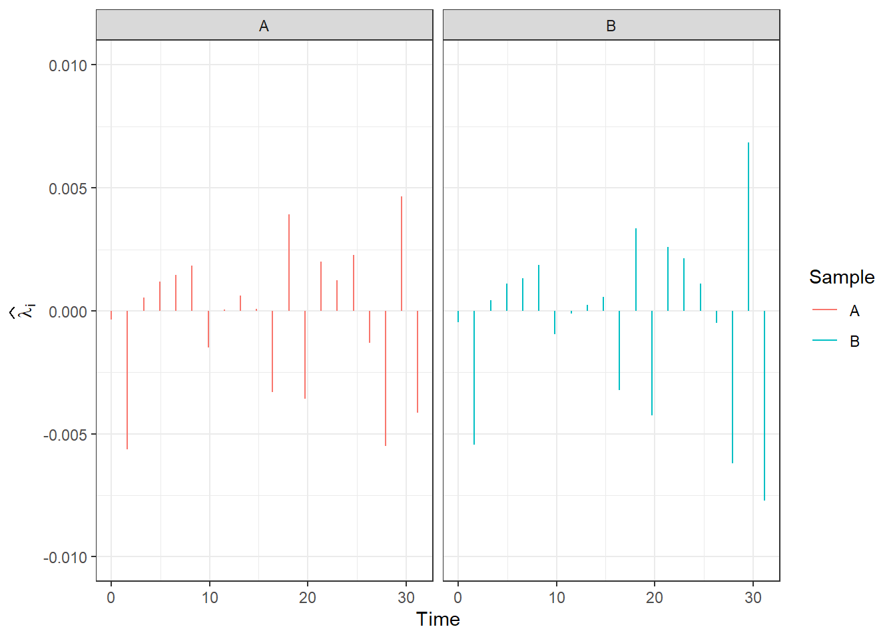

# Aplikace na reálných datech 4

V této části se podíváme podrobněji na klasifikaci pomocí postupu, při kterém nejprve data projektujeme na Reproducing Kernel Hilbert Space definovaný jádrem $K$ a následně pomocí koeficientů této projekce klasifikujeme data pomocí metody SVM. K získání koeficientů projekce se také využívá metoda SVM, avšak její analogie pro řešení regresních preblémů (SVM for regression). Tento postup je podrobněji popsán ve článku[^k], jehož autory jsou Muñoz a González.

[^k]: Muñoz, A. and González, J. (2010) *Representing functional data using support vector machines*, Pattern Recognition Letters, 31(6), pp. 511--516. [doi:10.1016/j.patrec.2009.07.014](https://www.sciencedirect.com/science/article/pii/S0167865509001913).

Autoři ve svém článku popisují mimo jiné i chování koeficientů z vyjádření pomocí jádrových funkcí (kernel expansion) a zlepšení stability koeficientů pomocí RKHS. Tuto vlastnost si nyní ilustrujme na analogickém příkladě, jako uvádějí autoři.


```r
library(fda)
library(ggplot2)
library(dplyr)
library(tidyr)
library(ddalpha)
library(patchwork)
library(e1071)
library(caret)
library(kernlab)
```

## `handwrit` data

Nejprve si načteme data, která představují souřadnice ručně psaných slov *fda*. Pro naše účely, kdy chceme porovnat dvě různá pozorování, si načtěme pouze první dva záznamy.


```r
# nacteni dat 
samples <- c(4, 5) + 10
hand <- handwrit[, samples, ]
```

Pro lepší orientaci si data nejprve vykresleme. Nejprve celkový záznam nápisu *fda*, následně jednotlivé souřadnice $x$ a $y$ proti času.


```r
p1 <- ggplot(data = data.frame(x = c(hand[, 1, 1], hand[, 2, 1]),
                               y = c(hand[, 1, 2], hand[, 2, 2]),
                               Sample = rep(c('A', 'B'), each = 1401)),
             aes(x = x, y = y, colour = Sample)) + 
  geom_path() + 
  theme_bw() + 
  labs(x = 'X', 
       y = 'Y') + 
  theme(aspect.ratio = 1,
        legend.position = 'none') 
p2 <- ggplot(data = data.frame(x = c(handwritTime, handwritTime),
                               y = c(hand[, 1, 1], hand[, 2, 1]),
                               Sample = rep(c('A', 'B'), each = 1401)),
             aes(x = x, y = y, colour = Sample)) + 
  geom_path() + 
  theme_bw() + 
  labs(x = 'Time', 
       y = 'X') + 
  theme(aspect.ratio = 1,
        legend.position = 'none')
p3 <- ggplot(data = data.frame(x = c(handwritTime, handwritTime),
                               y = c(hand[, 1, 2], hand[, 2, 2]),
                               Sample = rep(c('A', 'B'), each = 1401)),
             aes(x = x, y = y, colour = Sample)) + 
  geom_path() + 
  theme_bw() + 
  labs(x = 'Time', 
       y = 'Y') + 
  theme(aspect.ratio = 1,
        legend.position = 'none')
(p1 | p2 | p3)
```


Nyní se podívejme, jak dopadnou vektory koeficientů $\boldsymbol \alpha_1$, $\boldsymbol \alpha_2$ z jádrového vyjádření získaného pomocí SVM pro regresi a také jak vypadají $\boldsymbol \lambda_1$, $\boldsymbol \lambda_2$ pro RKHS reprezentaci. Vektory $\boldsymbol \alpha_1$ a $\boldsymbol \alpha_2$ definují reprezentaci křivek

$$
c_l^*(\boldsymbol x) = \sum_{i = 1}^m \alpha_{il} K(\boldsymbol x_i, \boldsymbol x), \quad \forall \boldsymbol x \in \mathcal X,
$$

kde $\alpha_{il} \in \mathbb R, l= 1, 2.$. Podobně vektory $\boldsymbol \lambda_1$ a $\boldsymbol \lambda_2$ definují vyjádření křivek v bázi RKHS $\mathcal H_K$

$$
c_l^*(\boldsymbol x) = \sum_{j = 1}^d \lambda_{jl}^* \phi_j(\boldsymbol x),
$$

které můžeme odhadnout z dat pomocí 

$$
\hat\lambda_{jl}^* = \hat\lambda_{jl} \sum_{i = 1}^m \alpha_{il}\hat\phi_{ji}, \quad j = 1, 2, \dots, \hat d.
$$

Uvažme Gaussovské jádro s parametrem $\gamma = 0.5$ (analogicky jako ve výše zmíněném článku).


```r
gamma <- 0.5

# jadro a jadrova matice ... Gaussovske s parametrem gamma
Gauss.kernel <- function(x, y, gamma) {
  return(exp(-gamma * norm(c(x - y) |> t(), type = 'F')^2))
}

Kernel.RKHS <- function(x, gamma) {
  K <- matrix(NA, ncol = length(x), nrow = length(x))
  for(i in 1:nrow(K)) {
    for(j in 1:ncol(K)) {
      K[i, j] <- Gauss.kernel(x = x[i], y = x[j], gamma = gamma)
    }
  }
  return(K)
}
```

Nyní si spočítejme pomocí funkce `svm()` z knihovny `e1071` vektory koeficientů $\boldsymbol \alpha_1$ a $\boldsymbol \alpha_2$. Uvědomme si, že funkce `svm()` vrací koeficienty pouze pro podpůrné vektory, pro ostatní jsou tyto koeficienty nulové. Další možností pro získání koeficientů je využít funkci `train()` z balíčku `caret` s volbou `method = 'svmRadial'`. Syntaxe této funkce je poněkud složitější, proto jsme v celém předchozím postupu uvažovali první zmíněnou funkci.


```r
# urceni koeficientu alpha z SVM
alpha <- matrix(0, nrow = length(handwritTime),
                ncol = length(samples)) # prazdny objekt

# model
for(i in 1:length(samples)) {
  df.svm <- data.frame(x = handwritTime,
                       y = hand[, i, 1])
  svm.RKHS <- svm(y ~ x, data = df.svm, 
                  kernel = 'radial',
                  type = 'eps-regression',
                  epsilon = 0.03,
                  gamma = gamma,
                  cost = 1, 
                  tolerance = 0.001,
                  shrinking = TRUE,
                  scale = TRUE)
  # alpha[svm.RKHS$index, i] <- svm.RKHS$coefs # nahrazeni nul koeficienty
  svm.RKHS <- train(y ~ x, data = df.svm,
                    method = 'svmRadial',
                    metric = "RMSE", 
                    preProcess = c('center', 'scale'),
                    # trControl = trainControl(
                    #   method = "repeatedcv", 
                    #   number = 5, 
                    #   repeats = 2, 
                    #   verboseIter = FALSE
                    #   )
                    trControl = trainControl(method = "none"),   
                    # Telling caret not to re-tune
                    tuneGrid = data.frame(sigma = 19, C = 1000)   
                    # Specifying the parameters
                    )
  alpha[svm.RKHS$finalModel@alphaindex, i] <- svm.RKHS$finalModel@alpha *
    svm.RKHS$finalModel@scaling$y.scale$`scaled:scale`
}
```


Vykresleme si pro lepší představu odhad křivky (červeně) společně s pozorovanou křivkou (modře).


```r
data.frame(x = handwritTime,
           y = svm.RKHS$finalModel@fitted * 
             svm.RKHS$finalModel@scaling$y.scale$`scaled:scale`,
           line = 'estimate') |>
  rbind(data.frame(
    x = handwritTime,
    y = hand[, i, 1],
    line = 'sample'
  )) |>
  ggplot(aes(x, y, col = line)) +
  geom_line() + 
  theme_bw() +
  theme(legend.position = 'bottom') + 
  labs(x = 'Time', y = 'X', col = 'Curve')
```

<div class="figure">

<p class="caption">(\#fig:unnamed-chunk-8)Porovnání pozorované a odhadnuté křivky.</p>
</div>


Podívejme se nyní konečně na hodnoty $\boldsymbol \alpha_1$ a $\boldsymbol \alpha_2$ pro dvě pozorování.


```r
data.frame(alpha = c(alpha[, 1], alpha[, 2]),
           Time = c(handwritTime, handwritTime),
           Sample = rep(c('A', 'B'), each = length(handwritTime))) |>
  ggplot(aes(xend = Time, x = Time, y = 0, yend = alpha, colour = Sample)) + 
  geom_segment() + 
  theme_bw() + 
  labs(x = 'Time',
       y = expression(widehat(bold(alpha))[i])) 
```


Podívejme se nyní na hodnoty $\boldsymbol \lambda_1$ a $\boldsymbol \lambda_2$ pro dvě pozorování.


```r
# spocitame matici K
K <- Kernel.RKHS(handwritTime, gamma = gamma)

# urcime vlastni cisla a vektory
Eig <- eigen(K)
eig.vals <- Eig$values
eig.vectors <- Eig$vectors
```


```r
# d
d.RKHS <- rankMM(K)

# urceni vektoru lambda
Lambda.RKHS <- matrix(NA, 
                      ncol = dim(hand)[2], 
                      nrow = d.RKHS) # vytvoreni prazdneho objektu

# vypocet reprezentace
Lambda.RKHS[, 1] <- (t(eig.vectors[, 1:d.RKHS]) %*% alpha[, 1]) *
  eig.vals[1:d.RKHS]
Lambda.RKHS[, 2] <- (t(eig.vectors[, 1:d.RKHS]) %*% alpha[, 2]) *
  eig.vals[1:d.RKHS]
```


```r
data.frame(lambda = c(Lambda.RKHS[, 1], Lambda.RKHS[, 2]),
           Time = c(handwritTime, handwritTime),
           Sample = rep(c('A', 'B'), each = length(handwritTime))) |>
  ggplot(aes(xend = Time, x = Time, y = 0, yend = lambda, colour = Sample)) + 
  geom_segment() + 
  theme_bw() + 
  labs(x = 'Time',
       y = expression(widehat(bold(lambda))[i])) +
  xlim(handwritTime[1:20] |> range()) + 
  ylim(c(-0.01, 0.01)) + 
  facet_wrap(~Sample)
```




Nakonec si vykresleme rozdíly.


```r
data.frame(lambda = c(Lambda.RKHS[, 1] - Lambda.RKHS[, 2]),
           Time = c(handwritTime)) |>
  ggplot(aes(xend = Time, x = Time, y = 0, yend = lambda)) + 
  geom_segment() + 
  theme_bw() + 
  labs(x = 'Time',
       y = expression(widehat(bold(lambda))[1] - widehat(bold(lambda))[2])) +
  ylim(c(-0.01, 0.01)) + 
  xlim(handwritTime[1:20] |> range())
```


## `growth` data

Podívejme se nyní ještě na tutéž analýzu, ale z pohledu dat `growth`.


```r
# nacteni dat 
samples <- c(54, 55) - 4
dataf <- dataf.growth()
t1 <- dataf$dataf[[samples[1]]]$args
t2 <- dataf$dataf[[samples[2]]]$args
y1 <- dataf$dataf[[samples[1]]]$vals
y2 <- dataf$dataf[[samples[2]]]$vals
data.gr <- data.frame(t = t1, H1 = y1, H2 = y2)
```


```r
gamma <- 0.1

# jadro a jadrova matice ... Gaussovske s parametrem gamma
Gauss.kernel <- function(x, y, gamma) {
  return(exp(-gamma * norm(c(x - y) |> t(), type = 'F')^2))
}

Kernel.RKHS <- function(x, gamma) {
  K <- matrix(NA, ncol = length(x), nrow = length(x))
  for(i in 1:nrow(K)) {
    for(j in 1:ncol(K)) {
      K[i, j] <- Gauss.kernel(x = x[i], y = x[j], gamma = gamma)
    }
  }
  return(K)
}
```

Nyní si spočítejme pomocí funkce `svm()` z knihovny `e1071` vektory koeficientů $\boldsymbol \alpha_1$ a $\boldsymbol \alpha_2$. Uvědomme si, že funkce `svm()` vrací koeficienty pouze pro podpůrné vektory, pro ostatní jsou tyto koeficienty nulové.


```r
# urceni koeficientu alpha z SVM
alpha <- matrix(0, nrow = length(data.gr$t),
                ncol = 2) # prazdny objekt

# model
for(i in 1:2) {
  df.svm <- data.frame(x = data.gr$t,
                       y = data.gr[, i + 1])
  svm.RKHS <- svm(y ~ x, data = df.svm, 
                  kernel = 'radial',
                  type = 'eps-regression',
                  epsilon = 0.5,
                  gamma = gamma,
                  cost = 100000, 
                  tolerance = 0.001,
                  shrinking = FALSE,
                  scale = TRUE)
  # svm.RKHS <- train(y ~ x, data = df.svm,
  #                   method = 'svmLinear')
  # urceni alpha
  # b <- - svm.RKHS$rho # rho ... the negative intercept
  # betas <- svm.RKHS$coefs
  # alphas <- betas + b #/ Gauss.kernel()
  alpha[svm.RKHS$index, i] <- svm.RKHS$coefs # nahrazeni nul koeficienty
}
```


```r
data.frame(alpha = c(alpha[, 1], alpha[, 2]),
           Time = c(data.gr$t, data.gr$t),
           Sample = rep(c('A', 'B'), each = length(data.gr$t))) |>
  ggplot(aes(xend = Time, x = Time, y = 0, yend = alpha, colour = Sample)) + 
  geom_segment() + 
  theme_bw() + 
  labs(x = 'Time',
       y = expression(widehat(bold(alpha))[i])) 
```


Podívejme se nyní na hodnoty $\boldsymbol \lambda_1$ a $\boldsymbol \lambda_2$ pro dvě pozorování.


```r
# spocitame matici K
K <- Kernel.RKHS(data.gr$t, gamma = gamma)

# urcime vlastni cisla a vektory
Eig <- eigen(K)
eig.vals <- Eig$values
eig.vectors <- Eig$vectors
```


```r
# d
d.RKHS <- rankMM(K)

# urceni vektoru lambda
Lambda.RKHS <- matrix(NA, 
                      ncol = 2, 
                      nrow = d.RKHS) # vytvoreni prazdneho objektu

# vypocet reprezentace
Lambda.RKHS[, 1] <- (t(eig.vectors[, 1:d.RKHS]) %*% alpha[, 1]) *
  eig.vals[1:d.RKHS]
Lambda.RKHS[, 2] <- (t(eig.vectors[, 1:d.RKHS]) %*% alpha[, 2]) *
  eig.vals[1:d.RKHS]
```


```r
data.frame(lambda = c(Lambda.RKHS[, 1], Lambda.RKHS[, 2]),
           Time = c(1:d.RKHS, 1:d.RKHS),
           Sample = rep(c('A', 'B'), each = d.RKHS)) |>
  ggplot(aes(xend = Time, x = Time, y = 0, yend = lambda, colour = Sample)) + 
  geom_segment() + 
  theme_bw() + 
  labs(x = 'Index',
       y = expression(widehat(bold(lambda))[i])) +
  facet_wrap(~Sample)
```


Nakonec si vykresleme rozdíly.


```r
data.frame(lambda = c(Lambda.RKHS[, 1] - Lambda.RKHS[, 2]),
           Time = c(1:d.RKHS)) |>
  ggplot(aes(xend = Time, x = Time, y = 0, yend = lambda)) + 
  geom_segment() + 
  theme_bw() + 
  labs(x = 'Index',
       y = expression(widehat(bold(lambda))[1] - widehat(bold(lambda))[2])) +
  ylim(c(-5, 3))
```


