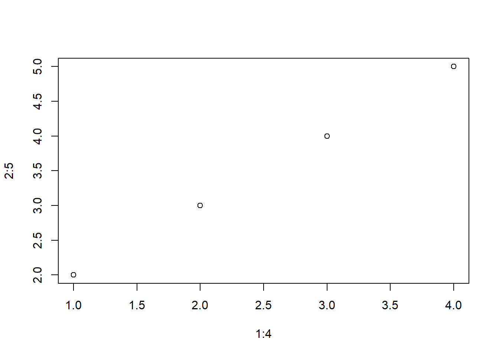

# Podpůrné materiály pro diplomovou práci

V této poslední kapitole jsou uvedeny zdrojové kódy pro vygenerování grafů a dalších případných materiálů, které jsou použity v diplomové práci. 


```r
plot(1:4, 2:5)
```



